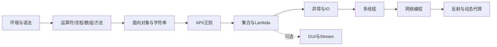
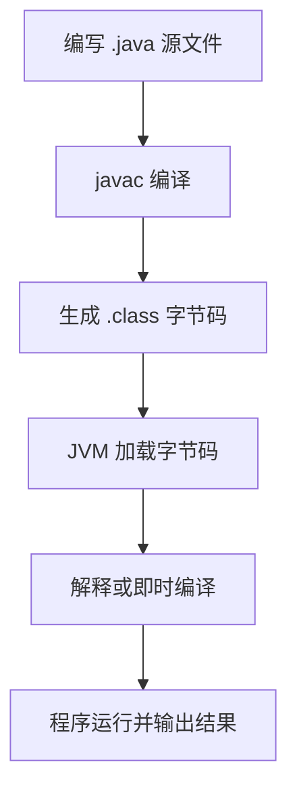
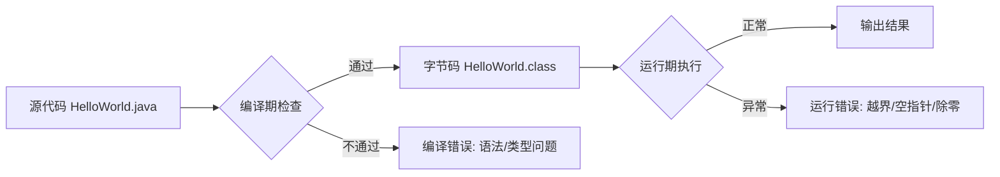
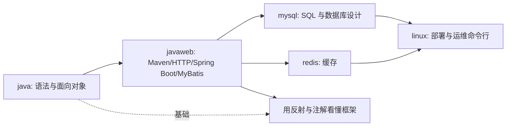
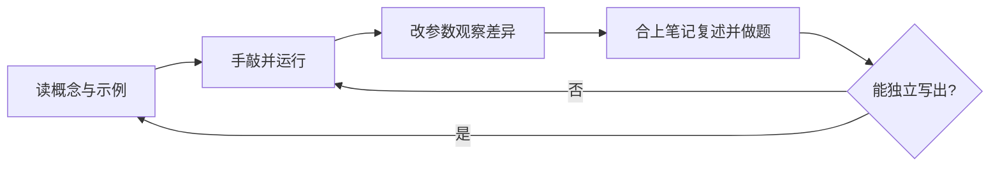
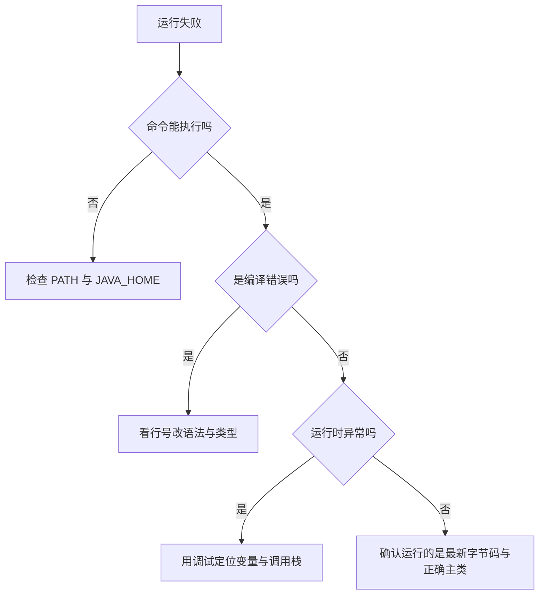

# Java 零基础学习总纲

本套资料来自原笔记的 22 个章节，按“先核心、后拓展”重新归类。GUI、网络、反射和动态代理不影响前面核心内容的学习，可在核心 Java 学完后再阅读。本篇总纲回答三个问题：学什么、按什么顺序学、学到什么程度算过关。

## 1. 学习目标与前置知识

### 1.1 学习目标

完成本套笔记后，你应该能够：

- 使用 JDK 和 IDEA 创建、编译、运行 Java 程序。
- 独立完成变量、分支、循环、数组、方法和类的练习。
- 使用面向对象思想组织代码，理解封装、继承和多态。
- 使用集合、异常、IO 和常用 API 完成小型程序。
- 读懂基础的多线程、网络、反射和动态代理代码。

上面五条是全套笔记的总目标，第 5 节的阶段检查清单把它们拆成可以自我验证的小项。判断自己是否学会，不要用“看完了”当标准，要用“能独立写出、能讲清原因”当标准。

### 1.2 前置知识

| 项目 | 要求 | 说明 |
| --- | --- | --- |
| 操作系统 | Windows 10/11，或 macOS、Linux | 命令行示例以 Windows CMD 为主 |
| 磁盘空间 | 至少 3 GB 空闲 | JDK 加 IDEA 的安装体积 |
| 文件操作 | 能新建文件夹、能看到文件扩展名 | 类名与文件名必须一致，扩展名被隐藏最容易踩坑 |
| 键盘输入 | 能输入英文半角标点 | 代码中的分号、花括号、引号必须是英文符号 |
| 编程基础 | 无要求 | 学过其他语言时，语法部分可快速略读，重点看类型系统与面向对象 |

## 2. 原章节归类

| 新文档 | 对应原章节 | 学习定位 |
| --- | --- | --- |
| [01-开发环境与基础语法](./01-开发环境与基础语法.md) | 一、Java基础；二、Java基础语法 | 核心 |
| [02-运算符流程控制数组与方法](./02-运算符流程控制数组与方法.md) | 三、运算符；四、流程控制语句；五、数组；六、方法 | 核心 |
| [03-面向对象与字符串](./03-面向对象与字符串.md) | 七、面向对象；八、字符串；九、接口和内部类 | 核心 |
| [04-常用API与正则表达式](./04-常用API与正则表达式.md) | 十、常用API；十一、正则表达式 | 核心 |
| [05-数据结构Lambda与集合](./05-数据结构Lambda与集合.md) | 十二、数据结构和Lambda表达式；十三、集合 | 核心 |
| [06-GUI与Stream函数式编程](./06-GUI与Stream函数式编程.md) | 十四、GUI图形化界面；十五、Stream流；十六、方法引用 | 拓展 |
| [07-异常与IO流](./07-异常与IO流.md) | 十七、异常；十八、IO流 | 核心 |
| [08-多线程与网络编程](./08-多线程与网络编程.md) | 十九、多线程；二十、网络编程 | 进阶 |
| [09-反射与动态代理](./09-反射与动态代理.md) | 二十一、反射；二十二、动态代理 | 拓展 |

按定位可以再压缩成三类：

| 定位 | 篇目 | 建议投入 | 学不好的后果 |
| --- | --- | --- | --- |
| 核心 | 00 到 05、07 | 每篇 8 到 15 小时 | 后面所有内容和 JavaWeb 都读不懂 |
| 进阶 | 08 | 10 小时以上 | 写不出可用的并发代码，面试会吃亏 |
| 拓展 | 06、09 | 每篇 5 小时左右 | 不影响写业务代码，但读框架源码会卡住 |

06 篇的 GUI 部分偏桌面应用，实际工作中用得少，可以跳过；但同一篇里的 Stream 流和方法引用属于必会内容，跳读时不要一起跳过。

## 3. 推荐阅读顺序



建议每读完一个分类就完成一个小练习：计算器、学生管理、通讯录、文件复制、文本统计、简单聊天室。练习的重点是把前一阶段的概念组合起来，而不是追求代码量。

顺序上的三条规则：

1. 01 到 05 必须按顺序读，后面的内容直接依赖前面的概念，例如不掌握接口就读不懂多线程和集合的比较器。
2. 07 的异常与 IO 可以在读完 05 之后读，它与 06 没有依赖关系。
3. 08 和 09 放在最后，它们回答的是“程序怎么处理并发”和“框架怎么调用我的代码”，需要前面的类、接口、访问权限知识做支撑。

## 4. Java 程序运行流程



JDK 提供开发工具，JRE 提供运行环境，JVM 负责执行字节码。现代 JDK 通常将 JRE 的组件一起提供，因此学习时重点掌握 JDK、`javac`、`java` 和 IDEA 的使用即可。

命令行上的最小闭环：

```bash
javac HelloWorld.java
java HelloWorld
```

`javac` 负责把源文件翻译成字节码，出现的是编译期错误，例如少了分号、类型不匹配；`java` 负责启动虚拟机执行字节码，出现的是运行期错误，例如数组越界、空指针。区分这两类错误很重要：编译错误必须改代码才能运行，运行错误要先让程序跑起来再用调试定位。



## 5. 阶段检查清单

每个阶段都把目标写成“能做什么”的自测项。逐条自查，做得到的打勾；做不到的不要往后读，因为后面的内容会反复用到这些能力。

### 5.1 阶段一：能运行程序

| 能做什么（自测项） | 对应篇目 | 建议练习 |
| --- | --- | --- |
| 能解释 JDK、JRE、JVM 的关系 | 00、01 | 画出三者包含关系图并讲给别人听 |
| 能用命令行和 IDEA 运行 HelloWorld | 01 | 手写 HelloWorld，先用 `javac`、`java` 跑通，再用 IDEA 跑一次 |
| 能正确声明变量并进行键盘输入 | 01 | 用 `Scanner` 读取姓名和年龄并输出问候语 |
| 能说出八种基本数据类型的取值范围差异 | 01 | 故意做一次 `int` 溢出，再用 `long` 修正 |
| 能读懂编译器报错的行号和类型 | 01 | 删掉一个分号，观察报错信息如何指出位置 |

### 5.2 阶段二：能解决基础问题

| 能做什么（自测项） | 对应篇目 | 建议练习 |
| --- | --- | --- |
| 能用分支和循环完成计算、统计和菜单程序 | 02 | 猜数字游戏；打印九九乘法表；根据成绩打印等级 |
| 能说清 `&&` 与 `&`、`\|\|` 与 `\|` 的区别 | 02 | 写一个带计数器的表达式，观察右侧是否被执行 |
| 能用 `switch` 处理枚举类型的分支 | 02 | 用 `switch` 输出星期几，并写成 JDK 14 箭头语法 |
| 能用数组保存一组数据，并完成遍历、查找和排序 | 02 | 求数组最大值、平均值，用 `Arrays.sort` 排序后二分查找 |
| 能把重复代码提取为方法 | 02 | 把评分逻辑抽成方法，再用重载支持不同类型参数 |
| 能解释引用类型传参时“改内容有效、换对象无效” | 02 | 写 `swap` 方法交换两个 `int`，观察没生效；再交换数组元素，观察生效 |

### 5.3 阶段三：能组织程序

| 能做什么（自测项） | 对应篇目 | 建议练习 |
| --- | --- | --- |
| 能设计类、对象和构造方法 | 03 | 写 `Student` 类，包含私有字段、构造方法、`get`/`set` |
| 能使用封装、继承、多态和接口 | 03 | 写 `Animal`/`Dog`/`Cat`，用父类引用调用重写方法 |
| 能正确比较字符串并使用 `StringBuilder` | 03 | 循环拼接一万次字符串，对比 `+` 与 `StringBuilder` 的写法 |
| 能说明 `static` 成员与实例成员的区别 | 03 | 用静态计数器统计创建了多少个对象 |

### 5.4 阶段四：能处理数据和文件

| 能做什么（自测项） | 对应篇目 | 建议练习 |
| --- | --- | --- |
| 能选择合适的 `List`、`Set` 或 `Map` | 05 | 用 `Map` 统计一段文本中每个单词出现的次数 |
| 能用 Lambda 和 Stream 替代部分循环 | 05、06 | 用 Stream 过滤出成绩大于 80 的学生并排序 |
| 能用异常保证程序不会因单次输入错误而直接退出 | 07 | 输入非数字时捕获异常并提示重新输入 |
| 能读写文本和二进制文件 | 07 | 复制一个文本文件，再用缓冲流改写为一次读写多字节 |
| 能用正则校验手机号或邮箱 | 04 | 用 `matches` 校验输入格式，不合法时提示重输 |

### 5.5 阶段五：理解进阶机制

| 能做什么（自测项） | 对应篇目 | 建议练习 |
| --- | --- | --- |
| 能解释线程安全、线程池和 TCP 通信的基本流程 | 08 | 多线程卖票案例，观察不加锁时的超卖 |
| 能看懂通过反射获取成员并调用方法的代码 | 09 | 从配置文件读类名，反射创建对象并调用方法 |
| 能说明注解如何被框架读取 | 09 | 自定义注解并用反射打印被标注方法的描述 |
| 能说明双亲委派模型的作用 | 09 | 写一个与 JDK 核心类同名的类，验证它不会被优先加载 |
| 能说明动态代理如何在调用前后增加公共逻辑 | 09 | 用 `Proxy.newProxyInstance` 为接口生成带日志的代理对象 |

## 6. 与仓库其他目录的衔接

本目录只负责 Java 语言本身。学完后要进入后端开发，还需要 SQL、Web 框架、缓存和部署环境，仓库里的其他目录正好覆盖这些内容。



| 目录 | 内容 | 建议开始时机 | 与本目录的衔接点 |
| --- | --- | --- | --- |
| `javaweb` | 前端基础、Maven、HTTP、Spring Boot、MyBatis、员工管理案例 | 本目录核心篇（01 到 05、07）读完后 | 面向对象、集合、异常、IO 是框架代码的地基 |
| `mysql` | 数据库、SQL 语句、表设计 | 与 `javaweb` 的数据库部分同步学 | 集合与泛型帮助理解查询结果的封装 |
| `redis` | 缓存的数据结构与使用场景 | `javaweb` 学完之后 | 需要先理解 Web 请求流程，才能判断缓存放哪一层 |
| `linux` | 常用命令、服务部署、环境排查 | 做项目部署练习时 | 命令行思维在 01 篇已经建立 |

学完本目录的下一步建议是：先读 `javaweb`，把 Java 语法放进真实的 Web 工程里；读 `javaweb` 的数据库章节时配合 `mysql`；等到要优化接口性能时再看 `redis`；最后读 `linux`，把项目真正部署到服务器上跑起来。`09` 篇的反射、注解和动态代理建议在读完 `javaweb` 的 Spring 部分后再回来重读一遍，那时会更容易理解“为什么框架到处都在用反射”。

## 7. 笔记使用方法

1. 先阅读概念和对比表，再手敲最小示例。
2. 修改示例中的变量、条件和输入，观察结果变化。
3. 每个小节结束后合上笔记，用自己的话复述核心规则。
4. 遇到 API 时优先查方法签名、参数、返回值和异常，而不是死记代码。
5. 练习遇到错误时，先阅读编译器报错，再定位到最小可复现代码。

补充三条实践建议：

- 每个知识点至少手敲一次。抄写时不要整段复制，按行输入能立刻发现拼写和标点错误。
- 每篇读完写一段三行以内的笔记，只记录“我原来错了什么”，这比摘抄概念有效得多。
- 把完成的练习保存在自己的工程里，不要建一个文件就删一个；后期调试和复习会用到。

学习闭环可以概括为下面四步，缺少任何一步都会让进度虚高：



## 8. 常见学习误区

| 误区 | 典型表现 | 正确做法 |
| --- | --- | --- |
| 只抄代码不手敲 | 看视频时代码都能看懂，自己写时连分号位置都犹豫 | 每个示例亲手输入并运行，报错自己先看一遍 |
| 不会看报错 | 一报错就截图问人，或者直接照抄网上的答案 | 先看第一条错误和行号，只改第一处错误再重新编译 |
| 一次学太多 | 一天看五章，第二天什么都不记得 | 一天只推一个知识点，配套写完一个小练习 |
| 死记 API | 背 `Arrays` 的所有方法名，却说不清参数含义 | 记住用途分类，用到时查文档确认签名 |
| 跳过基础学框架 | 语法还没熟就开始学 Spring，配置报错完全看不懂 | 先把 01 到 05、07 学完再进 `javaweb` |
| 只看不练 | 收藏了几十个教程，没有完成一次完整练习 | 每阶段至少交付一个能跑起来的小程序 |
| 忽略错误处理 | 练习里从不写异常处理，程序一输错就崩 | 把异常当作正常需求，输入校验必须完成 |
| 用 `==` 比较字符串 | 偶尔碰巧得到 `true`，就以为写法正确 | 内容比较一律使用 `equals` |
| 没有版本管理意识 | 手动复制多个 `Test2.java`、`Test3.java` 备份 | 一个知识点一个工程，文件名保持有意义 |

## 9. 开发环境故障排查

环境问题占初学者卡壳时间的大半。先查下面这张表，再考虑重装。

| 症状 | 常见原因 | 排查步骤 |
| --- | --- | --- |
| `'javac' 不是内部或外部命令` | 没有配置环境变量，或配置后未重开 CMD | 执行 `echo %JAVA_HOME%` 看是否为空；执行 `where javac` 看能否找到；改完环境变量要重开窗口 |
| `JAVA_HOME` 指向了 JRE | 安装时选错目录，指到了 `jre` 子目录 | `JAVA_HOME` 应指向 JDK 根目录，也就是 `bin` 的上一级 |
| 安装路径含中文或空格 | 安装在“新建文件夹”或“Program Files”下 | 换到 `D:\dev\jdk-17` 这类纯英文、无空格路径后重配环境变量 |
| `javac: 找不到文件` | 命令行目录与源文件不一致，或文件名拼错 | 用 `dir` 确认当前目录下确实存在该 `.java` 文件 |
| `类 HelloWorld 是公共的，应在名为 HelloWorld.java 的文件中声明` | 类名与文件名不一致 | `public class` 后面的类名必须与文件名完全一致，包括大小写 |
| `找不到或无法加载主类` | 运行时类名带了 `.class` 后缀，或包名与目录结构不匹配 | 运行时写类名不加后缀；有 `package` 时要在包结构对应的目录下运行 |
| `编码 GBK 的不可映射字符` | 源文件用 UTF-8 保存，编译时按系统默认编码读取 | 编译时加 `-encoding UTF-8`，并统一 IDE 与终端的编码设置 |
| 控制台输出中文变乱码 | 控制台代码页与输出编码不一致 | 在 CMD 中执行 `chcp 65001`，或统一改为 UTF-8 输出 |
| IDEA 报“项目 SDK 未设置” | 没有为项目选择 JDK | 在项目结构里指定已安装的 JDK，语言级别与 JDK 主版本保持一致 |
| 改了代码运行结果没变 | 运行的还是旧字节码，或运行的是另一个类 | 重新编译，确认运行配置中的主类是当前文件 |

排查顺序建议固定下来：先确认文件是否存在、名字是否正确，再确认编译命令的编码参数，最后确认环境变量。这三步能解决绝大多数“第一次运行失败”。



## 10. 练习清单

按阶段推进，每完成一组再进入下一组。所有练习都要求脱离笔记独立完成，能查 API 文档，但不要照抄示例。

1. 环境与语法：手写 HelloWorld，用命令行和 IDEA 各运行一次；用 `Scanner` 完成“姓名 + 年龄”输出。
2. 数据与运算：输入两个整数，输出和、差、积、商与余数，商保留两位小数。
3. 流程控制：猜数字游戏；打印九九乘法表；用 `switch` 输出成绩等级。
4. 数组与方法：输入 10 个成绩，求最高分、最低分、平均分，并统计不及格人数。
5. 面向对象：设计 `Student` 与 `ClassRoom`，支持添加学生和按学号查找。
6. 集合与文件：学生信息读写到文本文件，用 `Map` 统计班级平均分。
7. 异常处理：把上面的输入程序改造成任何错误输入都不会崩溃的版本。
8. 并发与网络：多线程卖票；写一个只支持单条消息的 Socket 回显服务器。
9. 反射与注解：从配置文件读取类名反射创建对象，并打印该类上的自定义注解信息。
10. 综合练习：写一个文本统计工具，统计行数、单词数、词频前十名，把结果同时输出到控制台和文件。

## 11. 资料对应关系

| 本总纲小节 | 对应篇目 | 说明 |
| --- | --- | --- |
| 1、2、3 | 00 | 学习目标、章节归类与阅读顺序 |
| 4 | 01 | 程序从源文件到运行的完整流程 |
| 5.1 | 01 | 环境搭建与变量声明 |
| 5.2 | 02 | 运算符、流程控制、数组与方法 |
| 5.3 | 03 | 面向对象与字符串 |
| 5.4 | 04、05、06、07 | 常用 API、集合、Stream、异常与 IO |
| 5.5 | 08、09 | 多线程、网络、反射与动态代理 |
| 6 | 全目录 | 与 `javaweb`、`mysql`、`redis`、`linux` 的衔接 |
| 7、8、9 | 全目录 | 学习方法、常见误区与环境排查 |

原笔记的 22 个章节与九篇新文档的对应关系见第 2 节的归类表，本篇不再重复。原笔记中 GUI 与网络部分的示例代码较多，阅读时建议只挑能运行的最小例子，不必一次性全部运行。

## 12. 总结

Java 入门的主线是：语法表达问题，方法拆分问题，面向对象组织问题，集合和 IO 处理数据，异常和多线程提高程序可靠性。网络、反射和动态代理建立在这条主线上，适合最后学习。

学习过程中最值得投入时间的三件事：把每个示例亲手敲一遍并运行；每篇结束后做一个小练习；遇到报错先自己读一遍再求助。做到这三点，本目录学完之后就能顺畅进入 `javaweb` 等后续目录。
