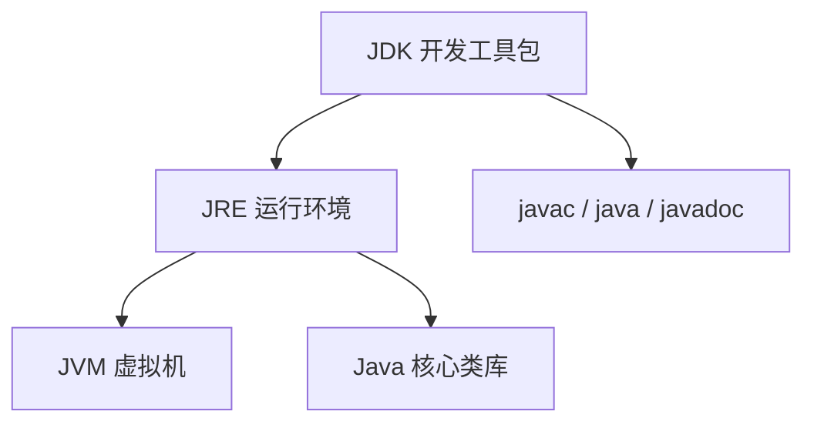
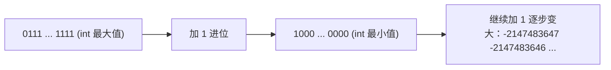
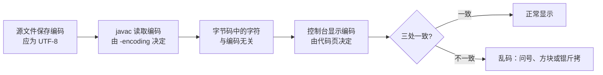
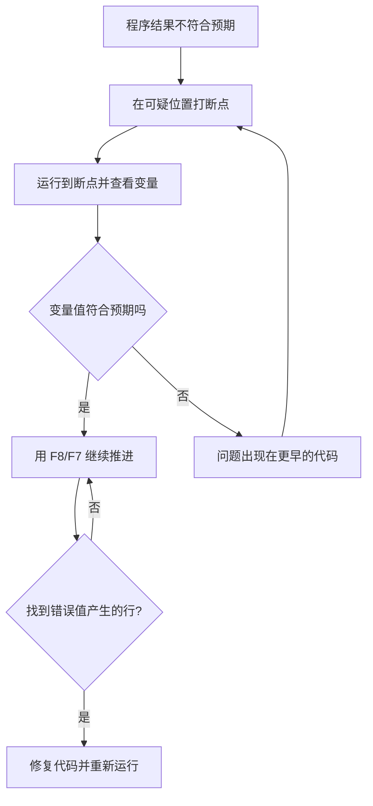

# 开发环境与基础语法

本篇整理原笔记第一、二章，目标是让初学者能创建并运行第一个 Java 程序，并掌握变量、数据类型、字面量、常量和编码这些“第一周必须弄清楚”的基本规则。此阶段最容易出问题的不是语法本身，而是环境、编码和调试这三件与编辑器有关的事，所以本篇把它们单独成节。

## 1. 学习目标与前置知识

### 1.1 学习目标

- 能说明 JDK、JRE、JVM 的关系，并在命令行和 IDEA 中运行程序。
- 能说出八种基本数据类型的字节数与取值范围，理解整数溢出与 `long` 字面量后缀。
- 能解释 `0.1 + 0.2 != 0.3` 的原因，并知道金额计算要用 `BigDecimal`。
- 会写二进制、八进制、十六进制字面量和带下划线分隔的数字。
- 会使用常用转义字符与 Unicode 转义。
- 会用 `final` 定义常量，并区分“引用不变”与“对象内容可变”。
- 能自己排查中文乱码，能用 IDEA 调试器定位运行期错误。

### 1.2 前置知识

| 项目 | 要求 |
| --- | --- |
| 电脑 | 可安装 JDK 17 或 JDK 21，磁盘至少有 3 GB 空闲 |
| 系统设置 | 会新建文件夹、显示文件扩展名、以管理员身份安装软件 |
| 输入 | 能切换到英文输入法，代码标点全部使用半角 |
| 其他 | 不需要编程基础；本篇的每一段代码都要求手敲并运行 |

## 2. JDK、JRE 和 JVM

| 名称 | 作用 |
| --- | --- |
| JVM | 执行 Java 字节码的虚拟机 |
| JRE | JVM 加 Java 核心类库，用于运行程序 |
| JDK | JRE 加编译器、调试器等开发工具 |



学习时安装一个长期支持版本（如 JDK 17 或 JDK 21）即可。安装路径建议不包含空格和中文。

三者的关系可以这样记：JVM 是执行引擎，JRE 是引擎加燃料，JDK 是引擎加燃料再加维修工具。写代码的人必须装 JDK，只运行程序的人装 JRE 就够；但现代 JDK 已经包含了运行所需的全部组件，所以学习阶段只需要装 JDK，不要额外装一个 JRE 以免版本混乱。

## 3. 命令行和环境变量

常用 CMD 命令：

| 命令 | 作用 |
| --- | --- |
| `盘符:` | 切换盘符 |
| `dir` | 查看当前目录 |
| `cd 目录` | 进入目录 |
| `cd ..` | 返回上一级 |
| `cd \` | 返回当前盘符根目录 |
| `cls` | 清屏 |
| `exit` | 退出 CMD |

验证安装：

```bash
java -version
javac -version
```

`JAVA_HOME` 指向 JDK 根目录，`Path` 中加入 `%JAVA_HOME%\bin`。在 CMD 中输入命令时，系统会先搜索当前目录，再按 `Path` 顺序搜索。

两个环境变量的分工：

| 变量 | 值示例 | 作用 |
| --- | --- | --- |
| `JAVA_HOME` | `D:\dev\jdk-17` | 告诉其他工具 JDK 装在哪里，Maven、IDEA 都会读它 |
| `Path` | `%JAVA_HOME%\bin` | 让 `javac`、`java` 命令能在任意目录直接执行 |

配置完成后必须重新打开 CMD 窗口，因为环境变量只在窗口启动时读取一次。用 `where javac` 可以确认系统最终找到的是哪个 `javac.exe`，如果结果指向 `C:\Windows\System32` 下的旧版本，说明 Path 顺序有问题。

## 4. HelloWorld

文件名必须与 `public class` 后面的类名一致：

```java
public class HelloWorld {
    public static void main(String[] args) {
        System.out.println("Hello, Java!");
    }
}
```

在文件所在目录执行：

```bash
javac HelloWorld.java
java HelloWorld
```

编译阶段将源代码转换为字节码，运行阶段由 JVM 加载并执行字节码。

文件名与类名的对应关系是一条硬规则，不是风格建议：

| 情况 | 结果 |
| --- | --- |
| 文件名 `HelloWorld.java`，类名 `HelloWorld` | 正常编译 |
| 文件名 `hello.java`，类名 `HelloWorld` | 编译报错：类 HelloWorld 是公共的，应在名为 HelloWorld.java 的文件中声明 |
| 文件名 `HelloWorld.java`，类名 `helloworld` | 编译报错，Java 区分大小写 |
| 文件名 `HelloWorld.java`，类前不加 `public` | 可以编译，但不推荐，运行时的类名由字节码决定 |

`main` 方法的签名也不要改动：`public static void main(String[] args)`。少写 `static` 或把参数改成 `String args` 都会导致虚拟机找不到入口，报 `找不到或无法加载主类`。

## 5. IDEA 基本概念

- Project：一个完整工程。
- Module：工程中的功能模块。
- Package：用于组织类的命名空间，通常使用小写英文。
- Class：Java 源代码中的类文件。

创建类后，使用包含 `main` 方法的类作为程序入口。IDEA 的运行按钮会自动完成编译和启动，命令行流程仍然值得掌握，因为它能帮助定位环境问题。

| 概念 | 对应到磁盘 | 说明 |
| --- | --- | --- |
| Project | 一个最外层文件夹 | 含 `.idea` 配置目录和模块目录 |
| Module | 项目下的子目录 | 每个模块可以有自己的源码根目录 |
| Package | 源码根目录下的子目录 | `com.example.demo` 对应三层目录 |
| Class | 一个 `.java` 文件 | 文件名与 `public` 类名一致 |

初学者建议的工程结构：一个知识点一个包，例如 `chapter01`、`chapter02`，包名避免使用中文和空格。不要把所有练习类都堆在默认包里，到了后面的反射和包内访问权限章节会很难调整。

## 6. 注释

```java
// 单行注释
/* 多行注释 */
/* 文档注释可配合 javadoc 使用 */
```

注释用于解释意图、限制和关键决策，不要重复描述显而易见的代码。

| 写法 | 适用场景 | 注意 |
| --- | --- | --- |
| `//` 单行注释 | 解释某一行或临时代码 | 临时注释掉的代码不要长期保留 |
| `/* */` 多行注释 | 大段说明 | 不能嵌套，内部再写 `/*` 会提前结束 |
| `/** */` 文档注释 | 类、方法的说明，可生成帮助文档 | 写在声明之前，配合 `javadoc` 命令使用 |

好的注释回答“为什么”，例如“这里用 `BigDecimal` 是因为金额不能出现二进制误差”；差的注释重复代码本身，例如“把 a 赋值给 b”。

## 7. 变量和数据类型

变量声明格式：

```java
数据类型 变量名 = 初始值;
```

基本数据类型：

| 类型 | 示例 | 说明 |
| --- | --- | --- |
| `byte` | `byte n = 10;` | 1 字节整数 |
| `short` | `short n = 10;` | 2 字节整数 |
| `int` | `int n = 10;` | 常用整数 |
| `long` | `long n = 10L;` | 大整数，字面量加 `L` |
| `float` | `float n = 1.2F;` | 单精度小数 |
| `double` | `double n = 1.2;` | 双精度小数 |
| `char` | `char c = 'A';` | 单个字符 |
| `boolean` | `boolean ok = true;` | `true` 或 `false` |

引用类型保存对象的引用，例如 `String`、数组和自定义类。字符串使用双引号，字符使用单引号。

### 7.1 八种基本数据类型的取值范围

| 类型 | 字节数 | 位数 | 最小值 | 最大值 | 默认值 |
| --- | --- | --- | --- | --- | --- |
| `byte` | 1 | 8 | -128 | 127 | 0 |
| `short` | 2 | 16 | -32768 | 32767 | 0 |
| `int` | 4 | 32 | -2147483648 | 2147483647 | 0 |
| `long` | 8 | 64 | -9223372036854775808 | 9223372036854775807 | 0L |
| `float` | 4 | 32 | 约 -3.4028235E38 | 约 3.4028235E38 | 0.0F |
| `double` | 8 | 64 | 约 -1.7976931348623157E308 | 约 1.7976931348623157E308 | 0.0 |
| `char` | 2 | 16 | 0 即 `'\u0000'` | 65535 即 `'\uffff'` | `'\u0000'` |
| `boolean` | 未规定 | 未规定 | `false` | `true` | `false` |

几点必须记住的细节：

- 整数的取值范围由位数决定，`byte` 到 `long` 都是二进制补码表示，所以正数部分比负数部分少一个。
- 浮点数的取值范围写的是绝对值范围，`float` 最小正数约 `1.4E-45`，`double` 最小正数约 `4.9E-324`。
- `char` 是无符号的 16 位整数，可以参与算术运算，例如 `'A' + 1` 的结果是 66。
- `boolean` 的字节数在 Java 语言规范里没有规定，虚拟机实现各不相同，不要依赖它的内存占用。

用代码可以直接读到这些边界值，不必死记数字：

```java
public class RangeDemo {
    public static void main(String[] args) {
        System.out.println(Byte.MIN_VALUE + " ~ " + Byte.MAX_VALUE);
        System.out.println(Integer.MIN_VALUE + " ~ " + Integer.MAX_VALUE);
        System.out.println(Long.MIN_VALUE + " ~ " + Long.MAX_VALUE);
        System.out.println(Float.MAX_VALUE + "  float 有效数字约 7 位");
        System.out.println(Double.MAX_VALUE + "  double 有效数字约 16 位");
    }
}
```

### 7.2 整数溢出与 long 字面量

整数类型有固定位数，超过最大值后不会报错，而是绕回负数，这就是溢出：

```java
public class OverflowDemo {
    public static void main(String[] args) {
        int max = Integer.MAX_VALUE;
        System.out.println(max);        // 2147483647
        System.out.println(max + 1);    // -2147483648

        byte b = (byte) 128;
        System.out.println(b);          // -128

        int seconds = 24 * 60 * 60 * 1000 * 1000; // 已经溢出
        System.out.println(seconds);    // 500654080
    }
}
```

溢出的原因可以这样理解：`int` 的最高位是符号位，最大值是 31 个 1，再加 1 会让所有位进位，得到 `1000...0`，这正是最小负数。



避免溢出的三种做法：

1. 提前估算结果量级，超过 21 亿的整数一律用 `long`。
2. 参与运算的变量中至少有一个是 `long`，整个表达式会先提升为 `long` 再计算。
3. 用 `Math.addExact`、`Math.multiplyExact`，溢出时抛出 `ArithmeticException`，让错误立刻暴露。

```java
public class LongDemo {
    public static void main(String[] args) {
        long big = 10000000000L;          // 超过 int 范围，字面量必须加 L
        long byInt = 10000000000L;        // 大写 L 更清楚，避免与数字 1 混淆
        long result = 1000L * 1000 * 1000 * 1000; // 有 long 参与，结果不溢出
        System.out.println(big + " " + byInt + " " + result);

        long safe = Math.multiplyExact(1_000_000, 1_000_000);
        System.out.println(safe);
    }
}
```

| 写法 | 结果 | 说明 |
| --- | --- | --- |
| `int x = 10000000000;` | 编译错误：整数太大 | 字面量超出 `int` 范围 |
| `long x = 10000000000;` | 编译错误：整数太大 | 字面量默认是 `int`，赋值前就已越界 |
| `long x = 10000000000L;` | 正确 | 加 `L` 让字面量按 `long` 处理 |
| `long x = 1000 * 1000 * 1000 * 1000;` | 结果错误 | 四个 `int` 先相乘，早已溢出 |
| `long x = 1000L * 1000 * 1000 * 1000;` | 正确 | 第一个操作数是 `long`，整体提升 |

### 7.3 浮点数的存储与精度问题

`float` 和 `double` 都按 IEEE 754 标准存储，把一个数的存储空间分成三段：

| 类型 | 符号位 | 指数位 | 尾数位 | 十进制有效数字 |
| --- | --- | --- | --- | --- |
| `float` | 1 位 | 8 位 | 23 位 | 约 6 到 7 位 |
| `double` | 1 位 | 11 位 | 52 位 | 约 15 到 17 位 |

尾数位决定了能表示多少位有效数字，指数位决定了表示范围。这种结构可以表示很大的数，也可以表示很小的数，但只能表示二进制有限小数，也就是能用若干个 `1/2`、`1/4`、`1/8` 相加精确表示的数。

`0.1` 恰好不是这样的数，它转换成二进制是无限循环小数：

```text
0.1(十进制) = 0.0001100110011001100110011...(二进制，0110 无限循环)
```

存储时必须截断到有限的尾数位，于是存进去的值比 0.1 稍大。这个误差本身很小，但参与运算后会被放大并可被打印出来：

```java
public class FloatDemo {
    public static void main(String[] args) {
        System.out.println(0.1 + 0.2);              // 0.30000000000000004
        System.out.println(0.1 + 0.2 == 0.3);       // false

        float f = 0.1F;
        System.out.println(f + 0.2F);               // 0.3（float 有效位少，显示被截断）
        System.out.println(f + 0.2F == 0.3F);       // false

        System.out.println(1.0 / 3.0);              // 0.3333333333333333
        System.out.println(1.0E-10 + 1.0E10 - 1.0E10); // 0.0，小数被大数吃掉
    }
}
```

因此，浮点数有两类常见错误：

| 错误做法 | 后果 | 正确做法 |
| --- | --- | --- |
| `if (0.1 + 0.2 == 0.3)` | 结果是 `false`，分支不执行 | 用差值比较：`Math.abs(a - b) < 1e-6` |
| 用 `double` 计算金额 | 分位出现 `0.30000000000000004`，对账不平 | 用 `BigDecimal`，见下文 |
| 用浮点数做循环条件 `i != 1.0` | 可能永远不结束 | 用整数计数或改用范围判断 |
| 用 `float` 保存大整数 | 超过 16777216 后无法精确表示每个整数 | 用 `int` 或 `long` |

判断两个浮点数是否相等时，要先想清楚“允许的误差是多少”：

```java
public class CompareDemo {
    public static void main(String[] args) {
        double a = 0.1 + 0.2;
        double b = 0.3;
        double epsilon = 1e-9;
        if (Math.abs(a - b) < epsilon) {
            System.out.println("在本精度下视为相等");
        }
    }
}
```

金额计算必须使用 `BigDecimal`：

```java
import java.math.BigDecimal;
import java.math.RoundingMode;

public class MoneyDemo {
    public static void main(String[] args) {
        BigDecimal price = new BigDecimal("19.9");
        BigDecimal count = new BigDecimal("3");
        BigDecimal total = price.multiply(count);
        System.out.println(total);                     // 59.7

        BigDecimal one = new BigDecimal("0.1");
        BigDecimal two = new BigDecimal("0.2");
        System.out.println(one.add(two));               // 0.3，没有误差
        System.out.println(one.add(two).compareTo(new BigDecimal("0.3")) == 0);

        BigDecimal avg = total.divide(count, 2, RoundingMode.HALF_UP);
        System.out.println(avg);                        // 19.90
    }
}
```

| 用法 | 结果 | 说明 |
| --- | --- | --- |
| `new BigDecimal(0.1)` | 0.1000000000000000055511151231257827021181583404541015625 | 把 `double` 的误差带进来，不要这样写 |
| `BigDecimal.valueOf(0.1)` | 0.1 | 内部按 `Double.toString` 转换，优于上一种 |
| `new BigDecimal("0.1")` | 0.1 | 推荐写法，用字符串构造 |
| `a.divide(b)` 除不尽 | 抛 `ArithmeticException` | 必须指定小数位数和舍入模式 |
| `a.equals(b)` | 比较值和小数位，`2.0` 与 `2.00` 不等 | 比较数值大小用 `compareTo` |

`BigDecimal` 是不可变对象，`add`、`multiply` 不会修改原对象，必须接收返回值：

```java
BigDecimal result = new BigDecimal("1.00");
result.add(new BigDecimal("1.00"));   // 忘记接收返回值，result 仍是 1.00
result = result.add(new BigDecimal("1.00")); // 正确写法
```

### 7.4 字面量进制与下划线分隔

Java 支持四种整数进制写法，以及用下划线分隔长数字：

```java
public class LiteralDemo {
    public static void main(String[] args) {
        int decimal = 10;
        int binary = 0b1010;        // 二进制，前缀 0b，值也是 10
        int octal = 012;            // 八进制，前缀 0，值也是 10
        int hex = 0xA;              // 十六进制，前缀 0x，值也是 10

        System.out.println(decimal + " " + binary + " " + octal + " " + hex);

        int million = 1_000_000;    // 下划线只为人眼服务，编译时被忽略
        long phone = 138_0013_8000L;
        int mask = 0b1111_0000;
        System.out.println(million + " " + phone + " " + mask);
    }
}
```

| 写法 | 进制 | 取值规则 | 注意 |
| --- | --- | --- | --- |
| `0b1010` | 二进制 | 0 到 1 | 大写 `0B` 也允许 |
| `012` | 八进制 | 0 到 7 | 前缀 `0` 很容易被误读成十进制 |
| `0xA` | 十六进制 | 0 到 9、a 到 f | 大写小写都可以，`0xFFFF_FFFFL` 常用于位掩码 |
| `1_000_000` | 十进制 | 下划线不能在开头或结尾 | `_1000`、`1000_` 编译失败 |

八进制的前缀 `0` 是初学者最容易踩的坑：`int code = 010;` 看起来像 10，实际是 8。如果写成 `int code = 08;`，因为八进制里没有 8 这个数字，编译器会直接报错。业务代码里除了位运算和掩码，建议只用十进制。

### 7.5 转义字符与 Unicode

字符和字符串里不能直接书写的符号要用反斜杠转义：

| 转义序列 | 含义 | 使用示例 |
| --- | --- | --- |
| `\n` | 换行 | `System.out.println("第一行\n第二行");` |
| `\t` | 制表符，用于对齐 | `System.out.println("姓名\t年龄");` |
| `\\` | 一个反斜杠 | `String path = "D:\\dev\\jdk-17";` |
| `\"` | 双引号 | `String s = "他说：\"你好\"";` |
| `\'` | 单引号 | `char c = '\'';` |
| `\r` | 回车，把光标移回行首 | Windows 文本换行是 `\r\n` |
| `\b` | 退格 | 少见，了解即可 |
| `\u4e2d` | Unicode 码点，这里是“中” | `char c = '\u4e2d';` |

```java
public class EscapeDemo {
    public static void main(String[] args) {
        System.out.println("姓名\t成绩");
        System.out.println("小明\t92");
        System.out.println("路径：D:\\study\\java");
        System.out.println("他说：\"今天要敲代码\"");

        char zhong = '\u4e2d';
        System.out.println(zhong);              // 中
        System.out.println("\u4f60\u597d");     // 你好

        System.out.println("进度：\r100%");     // 行首字符被覆盖，最终显示 100%
    }
}
```

关于 `\u` 转义有一个容易误解的细节：它在编译器读源文件时就被替换成对应字符，比语法分析更早。所以 `\u000a` 相当于一个换行符，写在字符串里会直接把字符串断成两行并导致编译错误。日常开发中，中文直接写在字符串里即可，只有需要表达特殊符号时才用 `\u`。

### 7.6 引用类型与基本类型的区别

| 对比项 | 基本类型 | 引用类型 |
| --- | --- | --- |
| 保存内容 | 数值本身 | 对象在堆中的地址 |
| 常见成员 | `byte`、`int`、`double`、`boolean`、`char` | `String`、数组、`ArrayList`、自定义类 |
| 默认值 | 0、0.0、`false`、`'\u0000'` | `null` |
| 比较 | `==` 比较数值 | `==` 比较地址，内容比较要用 `equals` |
| 能否调用方法 | 不能 | 能，例如 `str.length()` |
| 内存位置 | 局部变量在栈上，成员变量在对象里 | 引用在栈上，对象在堆上 |

```java
public class ReferenceDemo {
    public static void main(String[] args) {
        int a = 10;
        int b = a;
        b = 20;
        System.out.println(a);          // 10，基本类型互不影响

        int[] arr1 = {1, 2, 3};
        int[] arr2 = arr1;
        arr2[0] = 99;
        System.out.println(arr1[0]);    // 99，两个引用指向同一个数组

        String s1 = "abc";
        String s2 = "abc";
        System.out.println(s1 == s2);        // true，字符串常量池复用同一对象
        System.out.println(s1.equals(s2));   // true，比较内容才是可靠写法

        String s3 = new String("abc");
        System.out.println(s1 == s3);        // false，new 一定会创建新对象
        System.out.println(s1.equals(s3));   // true
    }
}
```

## 8. 常量与 final

`final` 用来表示“只能赋值一次”。赋值之后不能再改，因此它常用来定义常量：

```java
public class FinalDemo {
    public static void main(String[] args) {
        final double PI = 3.1415926;
        // PI = 3.14;  编译错误：无法为最终变量 PI 指定值

        final int MAX_SCORE;
        MAX_SCORE = 100;      // 只赋值一次是允许的，这叫延迟初始化
        System.out.println(PI + " " + MAX_SCORE);
    }
}
```

| 修饰位置 | 含义 | 示例 |
| --- | --- | --- |
| 局部变量 | 该变量只能赋值一次 | `final int max = 100;` |
| 成员变量 | 必须在声明处或构造方法中赋值 | `private final String id;` |
| 静态变量 | 全局常量，通常同时用 `static final` | `public static final int MAX = 10;` |
| 方法 | 不能被子类重写 | `public final void check() {}` |
| 类 | 不能被继承 | `public final class Util {}` |

常量的命名约定是全大写、单词之间用下划线：`static final int MAX_RETRY = 3;`。普通变量不要用这种命名，否则会让人误以为它是常量。

`final` 修饰引用类型时，锁定的是引用本身，不是对象内容：

```java
import java.util.ArrayList;
import java.util.List;

public class FinalReferenceDemo {
    public static void main(String[] args) {
        final List<String> names = new ArrayList<>();
        names.add("小明");          // 允许：修改的是对象内容
        names.add("小红");
        System.out.println(names);
        // names = new ArrayList<>();  编译错误：引用不可变
    }
}
```

| 写法 | 是否允许 | 原因 |
| --- | --- | --- |
| `final List<String> list = new ArrayList<>(); list.add("a");` | 允许 | 只修改对象内容，引用没变 |
| `list = new ArrayList<>();` | 编译错误 | 试图让 `final` 引用指向新对象 |
| `final int[] arr = {1, 2}; arr[0] = 9;` | 允许 | 数组元素属于对象内容 |
| `final Student s = new Student(); s.setName("小明");` | 允许 | 同上，`final` 不阻止 setter |
| `final StringBuilder sb = new StringBuilder(); sb.append("a");` | 允许 | `StringBuilder` 本身可变 |

如果希望对象内容也不可改，需要靠类本身的设计，例如 `String` 是不可变类，`List.of(...)` 返回的是不可变集合。

编译期常量还有一个容易忽略的行为：`static final` 的基本类型与字符串常量会在编译时被直接复制到使用处。修改常量值后，只重新编译定义常量的类，使用它的旧类仍会保留旧值。团队协作时遇到“改了常量没生效”，先做一次完整重新编译。

## 9. 标识符和命名

硬性规则：不能以数字开头，不能使用关键字，区分大小写，只能包含字母、数字、下划线和美元符号。

建议规范：

- 类名、接口名使用大驼峰：`StudentManager`。
- 变量名、方法名使用小驼峰：`studentCount`。
- 常量使用全大写下划线：`MAX_RETRY`。
- 名称表达含义，避免 `a1`、`test2` 这类无意义命名。

| 合法标识符 | 非法标识符 | 原因 |
| --- | --- | --- |
| `studentName` | `2ndName` | 不能以数字开头 |
| `_count` | `my name` | 不能包含空格 |
| `$price` | `class` | 不能使用关键字 |
| `中文变量名` | `int` | 中文虽合法但可移植性差，不建议使用 |

## 10. 键盘录入

```java
import java.util.Scanner;

public class InputDemo {
    public static void main(String[] args) {
        Scanner scanner = new Scanner(System.in);
        System.out.print("请输入姓名：");
        String name = scanner.nextLine();
        System.out.print("请输入年龄：");
        int age = scanner.nextInt();
        System.out.println(name + " 今年 " + age + " 岁");
    }
}
```

`nextInt()` 后继续调用 `nextLine()` 时，要注意残留换行符；初学阶段可以统一使用 `nextLine()` 再进行类型转换。

| 方法 | 读取内容 | 常见问题 |
| --- | --- | --- |
| `nextInt()` | 一个整数 | 输入非数字抛 `InputMismatchException` |
| `nextDouble()` | 一个小数 | 与 `nextLine` 混用时残留换行符 |
| `next()` | 一个单词，遇到空白停止 | 无法读取含空格的内容 |
| `nextLine()` | 整行，包含空格 | 前面用过 `nextInt` 时会读到空行 |

统一用 `nextLine()` 的写法更省心：

```java
import java.util.Scanner;

public class SafeInputDemo {
    public static void main(String[] args) {
        Scanner scanner = new Scanner(System.in);
        System.out.print("请输入年龄：");
        int age = Integer.parseInt(scanner.nextLine().trim());
        System.out.println("年龄是 " + age);
    }
}
```

## 11. 源码编码与控制台乱码

中文乱码的本质是“同一段文字在不同环节用了不同的编码”。Java 程序从源文件到屏幕，中间要经过三次编码转换：



| 环节 | 默认行为 | 统一方案 |
| --- | --- | --- |
| 源文件保存 | IDEA 默认跟随项目设置 | 统一设置为 UTF-8 |
| 编译读取 | JDK 18 之前跟随操作系统默认字符集，Windows 下常是 GBK | 命令行编译时显式加 `-encoding UTF-8` |
| 控制台显示 | Windows CMD 默认代码页 936 即 GBK | 执行 `chcp 65001` 切换到 UTF-8 |
| JVM 运行期 | JDK 18 起默认字符集为 UTF-8 | 老版本可加 `-Dfile.encoding=UTF-8` |

完整命令：

```bash
chcp 65001
javac -encoding UTF-8 HelloWorld.java
java -Dfile.encoding=UTF-8 HelloWorld
```

IDEA 中统一编码的位置：设置里的 Editor 与 File Encodings 都选择 UTF-8，并勾选以 UTF-8 转写属性文件。如果运行输出到 IDEA 的控制台仍然乱码，检查运行配置中的虚拟机参数是否设置了输出编码。

常见乱码原因与处理：

| 现象 | 原因 | 处理 |
| --- | --- | --- |
| 编译报“编码 GBK 的不可映射字符” | 文件是 UTF-8，编译按 GBK 读取 | 加 `-encoding UTF-8` |
| 控制台显示“涓枃”这类奇怪汉字 | 程序按 UTF-8 输出，终端按 GBK 解码 | `chcp 65001` 或统一改为 GBK 输出 |
| 显示一连串问号 | 目标编码无法表示原字符 | 换用支持中文的编码，通常是 UTF-8 |
| 读取文本文件内容乱码 | 读文件时没有指定编码 | 读取时显式指定 `StandardCharsets.UTF_8` |
| 只有部分中文乱码 | 文件被不同编码混写过 | 用编辑器确认编码后另存为 UTF-8 |

## 12. 使用 IDEA 调试

调试解决的是“程序能运行，但结果不对”的问题。编译错误必须在编译阶段改代码，调试帮不上忙。

### 12.1 断点

在代码行号左侧单击即可打上断点，程序运行到该行会暂停，此时可以查看所有变量的当前值。常用操作：

| 操作 | 快捷键 | 使用场景 |
| --- | --- | --- |
| 切换断点 | `Ctrl + F8` | 在光标所在行添加或取消断点 |
| 继续执行 | `F9` | 跳到下一个断点 |
| 单步跳过 | `F8` | 执行当前行，不进入被调用的方法 |
| 单步步入 | `F7` | 进入当前行调用的方法内部 |
| 单步跳出 | `Shift + F8` | 从当前方法返回到调用它的位置 |
| 运行到光标处 | `Alt + F9` | 临时停在光标所在行，不用新建断点 |
| 查看变量 | 变量窗口 | 观察当前作用域内所有变量的值 |
| 查看栈帧 | 帧窗口 | 确认当前代码是被谁调用的 |

配合调试的两种常用手段：选中表达式后查看求值结果；把关键变量拖到监视窗口，后续每一步都会显示它的最新值。

### 12.2 条件断点与调试流程

循环里第 500 次才出错时，逐次按 `F8` 是不可行的。右键断点打开条件设置，填入布尔表达式，例如 `i == 499` 或 `name == null`，程序只在条件成立时暂停。



### 12.3 用调试定位常见错误

| 错误类型 | 调试能否解决 | 定位方法 |
| --- | --- | --- |
| 缺少分号、括号不匹配 | 不能 | 编译报错已给出行号，先改第一处再重新编译 |
| 类型不匹配 | 不能 | 看报错提示的两个类型，决定转换还是改设计 |
| 空指针异常 | 能 | 在异常栈最上方的自己写的类打断点，检查哪个引用是 `null` |
| 数组越界 | 能 | 断点看下标值和数组长度，确认循环边界 |
| 计算结果错误 | 能 | 逐步执行并观察变量的中间值，找到第一次偏离预期的位置 |
| 循环不结束 | 能 | 断点加条件观察循环变量是否真的在变化 |

定位空指针的推荐做法：先读控制台里的异常栈，找到第一个属于自己写的类的行号，在该行打断点，检查这一行上所有引用类型的变量，找出值为 `null` 的那个，再决定是补判空还是修上游逻辑。

## 13. 小白易错点

- 类名与文件名不一致，`public class` 的类名必须与文件名完全相同。
- 代码标点用了中文符号，`；`、`（）`、`“”` 会导致编译错误。
- `long` 字面量忘记加 `L`，或误写小写 `l` 与数字 1 混淆。
- `float` 字面量忘记加 `F`，`float f = 1.2;` 会报类型不匹配。
- 用 `==` 比较字符串内容，应该用 `equals`。
- 为了“简单”而用 `double` 算金额，后期对账会出问题。
- 以为 `final` 修饰引用后对象内容也不能改，混淆引用不可变与对象不可变。
- 源码保存为 GBK、编译用 UTF-8，导致注释变乱码。
- 环境变量配好后没重开命令行窗口，以为配置无效。
- 编译错误没修完就试图运行，或修了多处错误后不知道该看哪一条报错。
- 忘记 `import java.util.Scanner;` 就使用 `Scanner`。
- 在 `nextInt()` 之后直接调用 `nextLine()`，读到空字符串。

## 14. 练习清单

1. 安装 JDK，配置 `JAVA_HOME` 和 `Path`，用 `java -version` 与 `where javac` 验证。
2. 手写 HelloWorld，在命令行运行一次；故意把类名改成小写，记录报错内容后再改回。
3. 打印八种基本数据类型的边界值，并说明 `int` 最大值加 1 的结果。
4. 写一个会溢出的表达式，用 `long` 和 `Math.multiplyExact` 各修正一次。
5. 演示 `0.1 + 0.2 != 0.3`，再用 `BigDecimal` 得到精确结果。
6. 用四种进制字面量表示同一个数，并输出结果验证它们相等。
7. 用带下划线分隔的数字表示金额和手机号。
8. 写一个输出带制表符对齐的表格程序，要求用 `\t` 实现列对齐。
9. 用 `final` 定义圆周率和折扣率，并尝试重新赋值，记录编译错误信息。
10. 用 `final` 修饰 `ArrayList`，演示添加元素成功、重新赋值失败。
11. 把源文件另存为 GBK 后编译，触发编码报错，再用 `-encoding UTF-8` 解决。
12. 写一个包含空指针的程序，用断点找到出错行并修复。

## 15. 资料对应关系

| 本篇小节 | 对应原章节 | 说明 |
| --- | --- | --- |
| 2 到 5 | 一、Java基础 | JDK 与环境、第一个程序、IDEA 基本概念 |
| 6 到 10 | 二、Java基础语法 | 注释、变量、类型、命名、键盘录入 |
| 7.1 到 7.6 | 二、Java基础语法 | 本篇在原笔记基础上补充了取值范围、溢出、浮点精度与进制字面量 |
| 8 | 二、Java基础语法 | 常量的补充小节 |
| 11、12 | 环境实践 | 编码问题与调试属于实践技能，原笔记未单独成章 |
| 后续 | 三、运算符 | 运算符、流程控制、数组与方法见 02 篇 |

## 16. 总结

本篇的最低目标是：安装 JDK，理解源代码、字节码和 JVM 的关系，能使用 IDEA 或命令行运行程序，并正确声明变量、输入数据和命名。

再往上一层，要能说清三件事：整数为什么会在最大值处翻转为负数，浮点数为什么不能用来算钱，以及程序里的中文为什么会乱码。这三个问题分别对应数据表示、精度和编码，理解它们之后，后面读集合、IO 和网络代码时就不会被奇怪的现象卡住。

