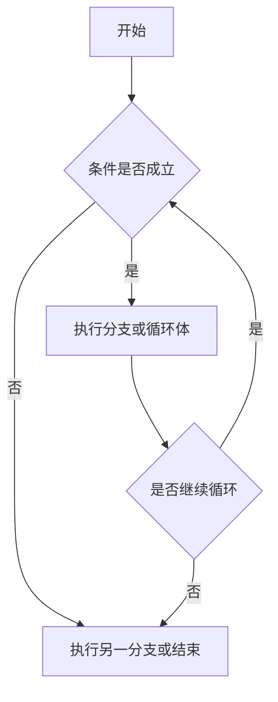
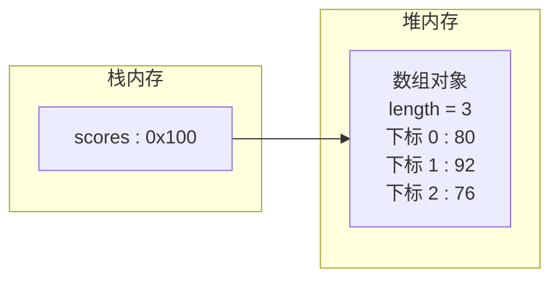
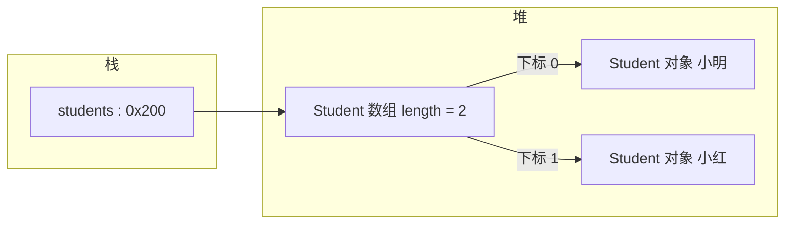
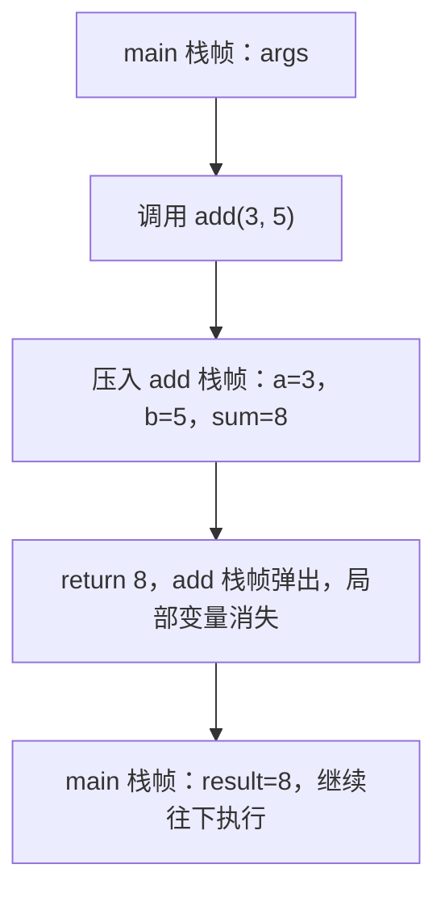
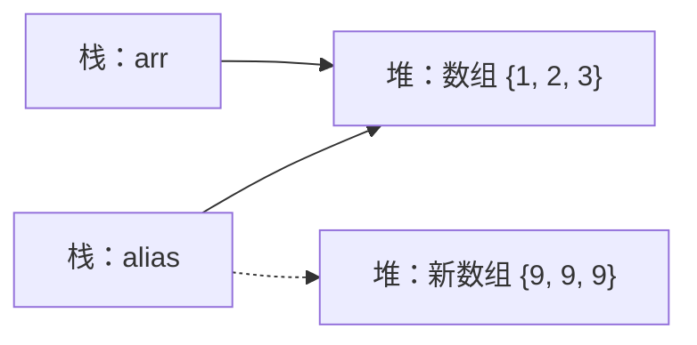
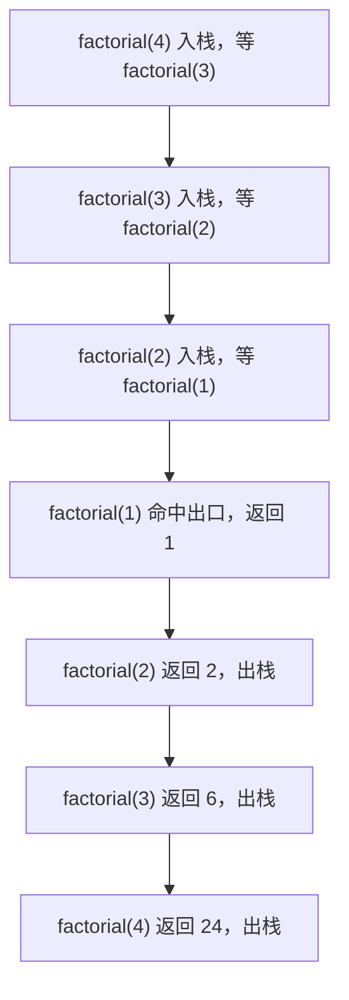

# 运算符、流程控制、数组与方法

本篇整理原笔记第三至六章，是把语法用于解决问题的核心部分。运算符决定表达式怎么算，流程控制决定代码走哪条路，数组决定一组数据怎么存，方法决定代码怎么拆。这四件工具配合起来，就能写出结构清晰的基础程序。

## 1. 学习目标与前置知识

### 1.1 学习目标

- 掌握算术、比较、逻辑、三元运算符，理解短路求值与运算符优先级。
- 掌握位运算符 `&`、`|`、`^`、`~`、`<<`、`>>`、`>>>`，能说清与逻辑运算符的区别。
- 能用 `if`、`switch`、`for`、`while`、`do...while` 控制流程，会用 `switch` 的箭头语法。
- 能说出数组的三种初始化方式、默认值表与内存结构，能解释越界异常。
- 熟练使用 `Arrays` 工具类，理解增强 for 的取值方式。
- 能用方法拆分代码，理解值传递、重载和递归。

### 1.2 前置知识

| 项目 | 要求 |
| --- | --- |
| 01 篇 | 变量声明、基本类型、类型转换、`Scanner` 输入、编译运行流程 |
| 数学 | 了解整除与取余的含义，知道负数取余的结果符号与被除数一致 |
| 工具 | 会用 IDEA 打断点和单步执行，用于观察循环和递归 |

## 2. 运算符

### 2.1 算术与赋值

`+`、`-`、`*`、`/`、`%` 用于数值计算。整数相除仍是整数，想保留小数需要至少一个操作数为浮点数。

```java
int total = 7;
int count = 2;
double average = total / (double) count;
```

`++` 和 `--` 会使变量加一或减一；`a++` 先取值再加一，`++a` 先加一再取值。`+=`、`-=` 等扩展赋值会隐含类型转换。

| 表达式 | `x` 的初值 | 表达式结果 | 执行后 `x` 的值 |
| --- | --- | --- | --- |
| `x++` | 5 | 5 | 6 |
| `++x` | 5 | 6 | 6 |
| `x--` | 5 | 5 | 4 |
| `--x` | 5 | 4 | 4 |

取余运算的符号跟随被除数，这一点在做“分秒转换”这类练习时要注意：

```java
System.out.println(7 % 3);      // 1
System.out.println(-7 % 3);     // -1
System.out.println(7 % -3);     // 1
```

扩展赋值会隐含强制转换，因此下面两种写法结果不同：

```java
short s = 1;
s += 1;             // 等价于 s = (short)(s + 1)，编译通过
// s = s + 1;       // 编译错误：int 不能直接赋给 short
```

### 2.2 比较与逻辑

`==`、`!=`、`>`、`>=`、`<`、`<=` 产生布尔结果。`&&` 表示并且，`||` 表示或者，`!` 表示取反。短路运算会在结果已确定时跳过右侧表达式，因此右侧不应放必须执行的副作用操作。

```java
int age = 20;
boolean adult = age >= 18;
boolean discount = adult && age < 60;
boolean needCheck = !adult || age > 70;
System.out.println(adult + " " + discount + " " + needCheck);
```

### 2.3 三元和类型转换

```java
String result = score >= 60 ? "及格" : "不及格";
```

自动转换一般遵循“范围小的类型转为范围大的类型”。强制转换可能丢失精度：

```java
double price = 19.9;
int integerPrice = (int) price;
```

| 场景 | 写法 | 结果 |
| --- | --- | --- |
| 小范围转大范围 | `int a = 10; long b = a;` | 自动完成 |
| 大范围转小范围 | `long a = 10L; int b = (int) a;` | 需要强转 |
| 小数转整数 | `(int) 19.9` | 19，直接截断，不四舍五入 |
| 字符转整数 | `(int) 'A'` | 65，得到码点 |
| 整数转字符 | `(char) 66` | `B` |
| 字符串转数字 | `Integer.parseInt("123")` | 123，需要处理 `NumberFormatException` |

想四舍五入应使用 `Math.round(19.9)`，它返回 `long`，对负数按“加 0.5 后取整”的规则处理。

### 2.4 字符串拼接

只要 `+` 两边有一个是字符串，就会按字符串拼接。需要比较内容时使用 `String.equals`，不要用 `==` 比较两个字符串对象。

```java
System.out.println("结果：" + 1 + 2);      // 结果：12
System.out.println("结果：" + (1 + 2));    // 结果：3
System.out.println(1 + 2 + "结果：");      // 3结果：
```

执行顺序是从左到右：先遇到字符串，后面全部按拼接处理；前面是数字相加，就先把数字算完。需要保证“先算再拼”时必须加括号。

### 2.5 位运算符

位运算符直接操作整数在内存中的二进制位，常用于掩码、权限标志、哈希计算和底层协议处理。`int` 按 32 位运算，`long` 按 64 位运算。

| 运算符 | 名称 | 运算规则 | 示例（`a = 0b1100`，`b = 0b1010`） |
| --- | --- | --- | --- |
| `&` | 按位与 | 两位都是 1 才为 1 | `a & b` 得 `0b1000`，即 8 |
| `|` | 按位或 | 有一位是 1 就为 1 | `a \| b` 得 `0b1110`，即 14 |
| `^` | 按位异或 | 两位不同才为 1 | `a ^ b` 得 `0b0110`，即 6 |
| `~` | 按位取反 | 0 变 1，1 变 0 | `~a` 得 -13 |
| `<<` | 左移 | 整体左移，低位补 0 | `a << 1` 得 24 |
| `>>` | 有符号右移 | 右移，高位补符号位 | `-8 >> 1` 得 -4 |
| `>>>` | 无符号右移 | 右移，高位补 0 | `-8 >>> 1` 得 2147483644 |

```java
public class BitDemo {
    public static void main(String[] args) {
        int a = 0b1100;      // 12
        int b = 0b1010;      // 10

        System.out.println(a & b);       // 8
        System.out.println(a | b);       // 14
        System.out.println(a ^ b);       // 6
        System.out.println(~a);          // -13

        System.out.println(a << 1);      // 24，相当于乘 2
        System.out.println(a >> 1);      // 6，相当于除 2 取整
        System.out.println(-8 >> 1);     // -4，符号位补 1，结果仍是负数
        System.out.println(-8 >>> 1);    // 2147483644，高位补 0

        System.out.println(1 << 31);     // -2147483648，左移超出范围会变号
        System.out.println(1 << 32);     // 1，移位数按 32 取余
        System.out.println(1L << 32);    // 4294967296，long 按 64 位运算
    }
}
```

`>>` 与 `>>>` 的差别只在负数上体现：前者保持符号，后者把最高位也当成数据位，因此负数右移后会变成很大的正数。写“把整数转成十六进制字符串比较”这类代码时如果用错了右移，负数结果会完全错误。

异或有一个实用性质：同一个数异或两次就还原，因此可以用于简单的加密演示和交换变量：

```java
int x = 5;
int y = 9;
x = x ^ y;
y = x ^ y;
x = x ^ y;
System.out.println(x + " " + y);   // 9 5
```

位运算与乘除的关系：

| 表达式 | 等价写法 | 说明 |
| --- | --- | --- |
| `n << 1` | `n * 2` | 左移一位相当于乘 2 |
| `n << 3` | `n * 8` | 左移三位相当于乘 8 |
| `n >> 1` | `n / 2` 向下取整 | 对正数成立，负数向下取整与整除一致 |
| `n & 1` | `n % 2 == 0` 的等价判断 | 结果为 0 说明是偶数 |

### 2.6 逻辑运算符与位运算符的区别

`&` 和 `|` 这两个符号在 Java 里是重载的：操作数是 `boolean` 时是逻辑运算，操作数是整数时是位运算。

| 运算符 | 操作数类型 | 运算类型 | 是否短路 | 结果类型 | 典型用途 |
| --- | --- | --- | --- | --- | --- |
| `&` | `boolean` | 逻辑与 | 不短路 | `boolean` | 两侧都必须求值时使用 |
| `&&` | `boolean` | 短路与 | 短路 | `boolean` | 条件判断的默认选择 |
| `|` | `boolean` | 逻辑或 | 不短路 | `boolean` | 两侧都必须求值时使用 |
| `||` | `boolean` | 短路或 | 短路 | `boolean` | 条件判断的默认选择 |
| `&` | 整数 | 按位与 | 不适用 | 整数 | 取掩码、判断奇偶 |
| `|` | 整数 | 按位或 | 不适用 | 整数 | 合并标志位 |
| `^` | 整数 | 按位异或 | 不适用 | 整数 | 交换、校验、翻转特定位 |

两个结论要分清：

- 对 `boolean` 用 `&`、`|` 依然合法，但两边的表达式一定都会执行，只是不短路，不是“变成位运算”。
- 对整数用 `&&`、`||`、`!` 会直接编译错误，因为短路逻辑不能作用于数字。

### 2.7 短路与不短路

短路意味着左边能定结果时，右边根本不执行。如果右边带副作用（自增、赋值、方法调用），两种写法的结果会不同：

```java
public class ShortCircuitDemo {
    static int calls = 0;

    static boolean check() {
        calls++;
        System.out.println("check 被调用，第 " + calls + " 次");
        return true;
    }

    public static void main(String[] args) {
        boolean a = false & check();    // check 执行，a 为 false
        boolean b = false && check();   // check 不执行，b 为 false
        boolean c = true | check();     // check 执行，c 为 true
        boolean d = true || check();    // check 不执行，d 为 true
        System.out.println(a + " " + b + " " + c + " " + d);
        System.out.println("check 总共被调用 " + calls + " 次");  // 2
    }
}
```

副作用不只是计数器，还包括写文件、改数据库、发请求。判断“要不要用 `&`”的标准很简单：右侧是否必须执行。绝大多数条件判断都应该用 `&&` 和 `||`，不短路写法只在极少见的情况下使用。

短路还有一个实际作用：充当空值保护。

```java
String name = null;
if (name != null && name.length() > 0) {
    System.out.println(name);
}

String other = null;
// if (other != null & other.length() > 0) { }   // 抛出 NullPointerException
```

用 `&&` 时左边为 `false`，右边不会执行；换成 `&` 后两边都要算，`null.length()` 立刻抛异常。

### 2.8 运算符优先级

优先级决定同一个表达式里先算谁。下面是常用的顺序，从高到低排列：

| 优先级 | 运算符 | 说明 |
| --- | --- | --- |
| 1 | `()`、`[]`、`.`、`::` | 括号、下标、成员访问、方法引用 |
| 2 | `++`、`--`、`!`、`~`、`(类型)`、`new` | 一元运算与类型转换 |
| 3 | `*`、`/`、`%` | 乘、除、取余 |
| 4 | `+`、`-` | 加、减 |
| 5 | `<<`、`>>`、`>>>` | 移位 |
| 6 | `<`、`<=`、`>`、`>=`、`instanceof` | 比较与类型判断 |
| 7 | `==`、`!=` | 相等判断 |
| 8 | `&` | 按位与、逻辑与 |
| 9 | `^` | 按位异或 |
| 10 | `|` | 按位或、逻辑或 |
| 11 | `&&` | 短路与 |
| 12 | `||` | 短路或 |
| 13 | `?:` | 三元运算 |
| 14 | `=`、`+=`、`-=`、`*=`、`/=`、`%=`、`&=`、`|=`、`^=`、`<<=`、`>>=`、`>>>=` | 赋值 |

几条容易踩坑的优先级关系：

```java
System.out.println(1 + 2 * 3);      // 7，先乘后加
System.out.println((1 + 2) * 3);    // 9
System.out.println(1 << 2 + 3);     // 32，加法优先于移位
System.out.println((1 << 2) + 3);   // 7
System.out.println(true || false && false);   // true，&& 优先于 ||
System.out.println((true || false) && false); // false
System.out.println(1 > 2 == false);           // true，比较优先于相等判断
```

结论是：优先级表不用背全，只记住“算术 > 移位 > 比较 > 相等 > 位运算 > 逻辑 > 三元 > 赋值”，其余部分不确定就加括号。括号不花钱，读错优先级要花调试时间。

## 3. 流程控制



### 3.1 条件判断

```java
if (age < 18) {
    System.out.println("未成年");
} else if (age < 60) {
    System.out.println("成年人");
} else {
    System.out.println("老年人");
}
```

`switch` 适合根据一个表达式的离散值选择分支。每个分支通常使用 `break` 防止继续执行后续分支；新版本也可以使用箭头语法。

`if` 与 `switch` 的选择：

| 对比项 | `if` | `switch` |
| --- | --- | --- |
| 判断条件 | 任意布尔表达式，可带区间和组合条件 | 只判断一个表达式与常量是否相等 |
| 支持类型 | 任意 | `byte`、`short`、`int`、`char`、`String`、枚举 |
| 可读性 | 区间判断更直观，超过 3 个分支开始变长 | 多分支等值判断更整齐 |
| 典型场景 | `score >= 60 && score < 70` | 根据状态码、星期、枚举选择行为 |

### 3.2 switch 进阶

`case` 支持的类型：

| 类型 | 起始版本 | 示例 |
| --- | --- | --- |
| `byte`、`short`、`char`、`int` | Java 1.0 | `case 1:` |
| 枚举 | Java 5 | `case MONDAY:` |
| `String` | Java 7 | `case "admin":` |
| 包装类型 `Byte`、`Short`、`Character`、`Integer` | Java 5 起依赖自动拆箱 | `switch (integerBox)` 合法，但值为 `null` 时抛空指针 |
| `long`、`float`、`double`、`boolean` | 不支持 | `switch (longValue)` 编译错误 |

`case` 后面的值必须是编译期常量，不能是变量，同一 `switch` 中不能出现重复的 `case` 值。

省略 `break` 会导致穿透（fall-through）：匹配到一个 `case` 后，后面的代码会一直执行下去，直到遇到 `break` 或 `switch` 结束。

```java
public class SwitchFallThroughDemo {
    public static void main(String[] args) {
        int month = 2;
        switch (month) {
            case 12:
            case 1:
            case 2:
                System.out.println("冬季");   // 2 匹配到这里并继续向下
                break;
            case 3:
            case 4:
            case 5:
                System.out.println("春季");
                break;
            default:
                System.out.println("其他季节");
        }
    }
}
```

穿透有时是刻意的，把多个 `case` 摞在一起可以复用同一段逻辑。风险在于漏写 `break` 时不会报错，程序只是多执行了一段代码：

```java
int code = 1;
switch (code) {
    case 1:
        System.out.println("处理 1");
    case 2:
        System.out.println("处理 2");   // 漏写 break，也会执行
        break;
    default:
        System.out.println("默认");
}
```

JDK 14 起 `switch` 有了正式的标准箭头语法，箭头分支不会穿透，也不需要 `break`：

```java
public class SwitchArrowDemo {
    public static void main(String[] args) {
        int day = 6;
        switch (day) {
            case 6, 7 -> System.out.println("周末");
            case 1, 2, 3, 4, 5 -> System.out.println("工作日");
            default -> System.out.println("非法日期");
        }
    }
}
```

`switch` 同时可以作为表达式直接产生值，用 `yield` 从代码块分支返回结果：

```java
int day = 3;
String type = switch (day) {
    case 6, 7 -> "周末";
    case 1, 2, 3, 4, 5 -> "工作日";
    default -> "非法日期";
};
System.out.println(type);

int points = switch (day) {
    case 6, 7 -> {
        int base = 100;
        yield base + 10;      // 多行分支用 yield 返回，不能用 return
    }
    default -> 60;            // 单表达式分支直接写值
};
System.out.println(points);
```

箭头写法与冒号写法不能混用在同一个 `switch` 中，混用会编译失败。

`default` 的位置是自由的，写在最前面也可以：

```java
int level = 9;
switch (level) {
    default:
        System.out.println("未知等级");
        break;
    case 1:
        System.out.println("初级");
        break;
    case 2:
        System.out.println("中级");
        break;
}
```

位置不影响匹配结果，只会影响阅读顺序。`case 9` 不存在，所以仍然进入 `default`。需要提醒的是，作为表达式的 `switch` 必须覆盖所有可能取值，否则编译报错；使用枚举时如果覆盖了全部常量，可以省略 `default`。

| 写法 | 是否需要 `break` | 能否返回值 | 起始版本 |
| --- | --- | --- | --- |
| 冒号 `case x:` | 需要，否则穿透 | 不能直接返回 | 早期版本 |
| 箭头 `case x ->` | 不需要 | 单表达式直接返回值 | JDK 14 正式 |
| `switch` 表达式加 `yield` | 不需要 | 代码块内 `yield` 返回值 | JDK 14 正式 |

### 3.3 循环

```java
for (int i = 1; i <= 5; i++) {
    System.out.println(i);
}

int i = 1;
while (i <= 5) {
    System.out.println(i++);
}
```

`do...while` 至少执行一次。`break` 结束当前循环，`continue` 跳过本轮剩余代码。设计无限循环时必须提供明确的退出条件。

| 循环 | 适用场景 | 特点 |
| --- | --- | --- |
| `for` | 次数已知 | 初始化、条件、步长写在一行 |
| `while` | 次数未知，条件先判断 | 条件不成立时一次都不执行 |
| `do...while` | 至少执行一次 | 先执行再判断 |
| 增强 `for` | 遍历数组或集合 | 不能获取索引，见 4.6 节 |

`break` 与 `continue` 的对比：

| 语句 | 作用 | 示例场景 |
| --- | --- | --- |
| `break` | 结束整个当前循环 | 查找目标后立即停止 |
| `continue` | 跳过本轮剩余代码，进入下一轮 | 跳过不符合格式的数据 |
| `return` | 结束整个方法 | 找到结果直接返回 |

```java
for (int n = 1; n <= 10; n++) {
    if (n % 2 != 0) {
        continue;          // 跳过奇数
    }
    if (n > 6) {
        break;             // 大于 6 时结束循环
    }
    System.out.println(n);  // 输出 2 4 6
}
```

### 3.4 随机数

```java
import java.util.Random;

Random random = new Random();
int value = random.nextInt(100); // 0 到 99
```

三种常见生成方式的区别：

| 写法 | 范围 | 说明 |
| --- | --- | --- |
| `random.nextInt()` | 全部 `int` 取值范围 | 可能为负数 |
| `random.nextInt(100)` | 0 到 99 | 参数是上界，取不到 |
| `random.nextInt(100) + 1` | 1 到 100 | 生成 1 到 N 的通用写法 |
| `random.nextDouble()` | 0.0 到 1.0 | 取不到 1.0 |
| `random.nextBoolean()` | `true` 或 `false` | 用于随机决策 |

想生成区间 `[min, max]` 内的整数，用 `random.nextInt(max - min + 1) + min`。

## 4. 数组

数组保存固定长度、相同类型的元素，索引从 0 开始。访问越界会抛出 `ArrayIndexOutOfBoundsException`。

```java
int[] scores = {80, 92, 76};
for (int score : scores) {
    System.out.println(score);
}
```

动态初始化会得到默认值：整数为 0，浮点数为 0.0，布尔值为 `false`，引用为 `null`。

### 4.1 三种初始化写法

```java
public class ArrayInitDemo {
    public static void main(String[] args) {
        int[] dynamic = new int[3];                 // 动态初始化：只给长度
        int[] literal = new int[]{80, 92, 76};      // 静态初始化：给完整写法
        int[] simple = {80, 92, 76};                // 静态初始化：省略 new 的简化写法

        System.out.println(dynamic.length);         // 3
        System.out.println(literal[1]);             // 92
        System.out.println(simple[2]);              // 76
    }
}
```

| 初始化方式 | 写法 | 元素取值 | 适用场景 |
| --- | --- | --- | --- |
| 动态初始化 | `new int[3]` | 全部是默认值，后续赋值 | 长度已知但值要稍后计算 |
| 静态初始化 | `new int[]{1, 2, 3}` | 逐个给出初值 | 作为方法实参时使用 |
| 简化写法 | `{1, 2, 3}` | 逐个给出初值 | 声明并直接初始化时使用 |

不能混用的两种写法：`new int[3]{1, 2, 3}` 编译错误，动态初始化不能同时给元素；`int[] a; a = {1, 2, 3};` 也编译错误，简化写法只能出现在声明语句中，赋值时需要写成 `a = new int[]{1, 2, 3};`。

### 4.2 默认值与内存结构

| 元素类型 | 默认值 |
| --- | --- |
| `byte`、`short`、`int`、`long` | 0 |
| `float`、`double` | 0.0 |
| `char` | `'\u0000'`，输出为空白字符 |
| `boolean` | `false` |
| 引用类型（`String`、数组、对象） | `null` |

需要区分两种情况：数组元素在创建时会被自动赋默认值；而方法里的局部变量不会被自动赋值，使用前必须显式初始化。

数组变量保存的是地址，真正的数组对象在堆内存中：



```java
int[] a = new int[]{80, 92, 76};
int[] b = a;            // 复制的是地址，不是内容
b[0] = 100;
System.out.println(a[0]);   // 100，两组变量指向同一个数组

int[] c = Arrays.copyOf(a, a.length);  // 这才是复制内容
c[0] = 1;
System.out.println(a[0]);   // 100，互不影响
```

如果元素本身是对象，数组保存的是对象的地址：



### 4.3 长度不可变与越界异常

数组长度在创建时就固定，`length` 是只读字段，不能赋值：

```java
int[] a = new int[3];
System.out.println(a.length);   // 3
// a.length = 5;                 // 编译错误：length 是 final 字段
a = new int[5];                 // 这是换了一个新数组，不是把原数组变长
```

`ArrayIndexOutOfBoundsException` 的成因是访问了下标小于 0 或大于等于 `length` 的位置：

```java
public class IndexDemo {
    public static void main(String[] args) {
        int[] a = new int[]{1, 2, 3};
        System.out.println(a[2]);   // 3，最后一个合法下标
        System.out.println(a[3]);   // 抛出 ArrayIndexOutOfBoundsException
    }
}
```

最常见的三种触发方式：

| 错误写法 | 原因 | 修正 |
| --- | --- | --- |
| `for (int i = 0; i <= a.length; i++)` | 循环条件用了 `<=` | 改成 `i < a.length` |
| `a[a.length]` | 把长度当成了最大下标 | 最大下标是 `a.length - 1` |
| 手动计算偏移 `a[index - 1]`，`index` 为 0 | 下标变成 -1 | 先校验 `index > 0` 再使用 |

`new int[-1]` 抛出的是另一种异常 `NegativeArraySizeException`，因为它发生在创建数组时，还没有下标可越界。用 `a.length - 1` 作为随机下标时，如果数组为空（长度为 0），会得到 -1 并越界，这也是常见坑。

### 4.4 二维数组

二维数组本质上是数组的数组：

```java
int[][] matrix = {
    {1, 2},
    {3, 4}
};
for (int[] row : matrix) {
    for (int value : row) {
        System.out.print(value + " ");
    }
    System.out.println();
}
```

几种初始化与访问方式：

```java
int[][] fixed = new int[2][3];        // 2 行 3 列，全部是 0
int[][] ragged = new int[3][];        // 只确定行数，每一行长度可以不同
ragged[0] = new int[]{1};
ragged[1] = new int[]{2, 3};
ragged[2] = new int[]{4, 5, 6};

System.out.println(matrix.length);    // 2，行数
System.out.println(matrix[0].length); // 2，第一行的列数
System.out.println(ragged[1].length); // 2，各行列数可以不同
```

遍历二维数组时要注意行列的顺序，`matrix[i][j]` 是先定位行再定位列；写反了会得到颠倒的结果，元素类型不同时还会编译错误。

需要动态增删元素时，优先考虑集合而不是反复创建新数组。

### 4.5 Arrays 工具类

`Arrays` 提供了一组针对数组的静态方法，避免手写循环：

| 方法 | 作用 | 注意 |
| --- | --- | --- |
| `Arrays.toString(arr)` | 一维数组转成可读字符串 | 二维要用 `deepToString` |
| `Arrays.sort(arr)` | 升序排序 | 对象数组需要实现 `Comparable` 或传入比较器 |
| `Arrays.binarySearch(arr, key)` | 二分查找，返回下标 | 必须先排序，否则结果无意义 |
| `Arrays.copyOf(arr, newLength)` | 复制并指定新长度 | 新长度更大时补默认值，更小时截断 |
| `Arrays.copyOfRange(arr, from, to)` | 复制指定区间 | 左闭右开，`to` 取不到 |
| `Arrays.fill(arr, value)` | 用同一个值填充 | 也可指定区间 |
| `Arrays.equals(a, b)` | 比较两个一维数组内容 | 二维要用 `deepEquals` |

```java
import java.util.Arrays;

public class ArraysDemo {
    public static void main(String[] args) {
        int[] scores = {88, 73, 95, 60};

        System.out.println(Arrays.toString(scores));      // [88, 73, 95, 60]

        Arrays.sort(scores);
        System.out.println(Arrays.toString(scores));      // [60, 73, 88, 95]

        int index = Arrays.binarySearch(scores, 88);
        System.out.println(index);                        // 2

        int missing = Arrays.binarySearch(scores, 90);
        System.out.println(missing);                      // 负数，表示没有找到

        int[] grown = Arrays.copyOf(scores, 6);
        System.out.println(Arrays.toString(grown));       // [60, 73, 88, 95, 0, 0]

        int[] part = Arrays.copyOfRange(scores, 1, 3);
        System.out.println(Arrays.toString(part));        // [73, 88]

        int[] filled = new int[3];
        Arrays.fill(filled, 7);
        System.out.println(Arrays.toString(filled));      // [7, 7, 7]

        System.out.println(Arrays.equals(new int[]{1, 2}, new int[]{1, 2}));  // true
        System.out.println(Arrays.equals(new int[]{1, 2}, new int[]{2, 1}));  // false

        int[][] matrix = {{1, 2}, {3, 4}};
        System.out.println(Arrays.deepToString(matrix));  // [[1, 2], [3, 4]]
    }
}
```

二分查找的返回值规则：找到时返回下标；没找到时返回负数，其值为 `-(插入点) - 1`，`插入点` 指该元素应该插入的位置。所以“返回负数就是没找到”，但不要直接用 `-1` 判断，应该在 `if (index >= 0)` 中处理成功的情况。

`Arrays.sort` 只能对数组排序，对集合要改用 `Collections.sort` 或 `List.sort`；`Arrays.asList` 可以把数组转成固定长度的列表，但它不支持增删元素，这是后面集合章节的常见坑。

### 4.6 增强 for 与索引遍历

增强 for 的写法更简洁，但拿到的是元素的副本，修改它不会影响原数组：

```java
import java.util.Arrays;

public class ForEachDemo {
    public static void main(String[] args) {
        int[] scores = {80, 92, 76};
        for (int score : scores) {
            score = 100;            // 改的是副本
        }
        System.out.println(Arrays.toString(scores));   // [80, 92, 76]

        for (int i = 0; i < scores.length; i++) {
            scores[i] = 100;        // 通过下标写入原数组
        }
        System.out.println(Arrays.toString(scores));   // [100, 100, 100]
    }
}
```

如果元素是引用类型，修改对象内容依然会生效，因为副本是地址：

```java
StringBuilder[] words = {new StringBuilder("a"), new StringBuilder("b")};
for (StringBuilder word : words) {
    word.append("!");           // 改的是同一个对象
}
for (StringBuilder word : words) {
    System.out.print(word + " ");   // a! b!
}
```

| 对比项 | 增强 for | 带下标的 for |
| --- | --- | --- |
| 语法 | `for (int v : arr)` | `for (int i = 0; i < arr.length; i++)` |
| 能否修改元素 | 不能，拿到的是副本 | 能，通过下标写入 |
| 能否获取下标 | 不能 | 能 |
| 能否反向或跳跃遍历 | 不能 | 能，自行控制步长 |
| 读代码成本 | 低 | 略高 |
| 适用场景 | 只读遍历、求和、统计 | 需要写回、需要下标、需要跳步 |

判断标准很简单：只读用增强 for，要写回或需要下标用普通 for。

## 5. 方法

前面四节解决数据怎么算、代码怎么拐弯、一组数据怎么存；这一节解决最后一件事：把代码拆开。方法（method）就是把一段职责独立的代码打包起来起个名字，之后一行调用就能重复使用。

### 5.1 方法是什么，为什么要把代码拆成方法

一个方法由四件事描述清楚：名字（它是干什么的）、参数（调用时交给它什么数据）、返回值类型（算完交回什么结果，不交回就写 `void`）、方法体（真正干活的语句）。

不抽方法的写法，两组数据抄两遍循环：

```java
public class NoMethod {
    public static void main(String[] args) {
        int[] a = {3, 9, 4};
        int sumA = 0;
        for (int v : a) { sumA += v; }
        int[] b = {17, 2, 8};
        int sumB = 0;
        for (int v : b) { sumB += v; }
        System.out.println(sumA + " " + sumB);
    }
}
```

抽成方法之后只写一遍循环：

```java
public class WithMethod {
    public static int sum(int[] arr) {
        int total = 0;
        for (int v : arr) { total += v; }
        return total;
    }
    public static void main(String[] args) {
        System.out.println(sum(new int[]{3, 9, 4}) + " " + sum(new int[]{17, 2, 8}));
    }
}
```

两段代码都输出 `26 27`。把逻辑抽成方法有四个好处：

- 复用：同一段逻辑只写一次，多处调用，改一处就全改。
- 可读：`sum(arr)` 比循环加累加变量更容易看懂。
- 便于测试：能单独调用一个方法验证结果，不必跑整个程序。
- 便于分工：每人负责几个方法，只要接口对齐就能并行开发。

### 5.2 方法的完整定义格式

模板是 `修饰符 返回值类型 方法名(参数列表) { 方法体 }`，逐项解释如下：

| 组成部分 | 是否必需 | 说明 |
| --- | --- | --- |
| 修饰符 | 可选 | 例如 `public`、`static`、`private`，控制访问范围和是否属于类本身 |
| 返回值类型 | 必需 | 基本类型、引用类型，或者表示没有返回值的 `void` |
| 方法名 | 必需 | 小驼峰命名、动词开头，例如 `isLeapYear`、`printDiv` |
| 参数列表 | 必需，可为空 | 括号里写类型加变量名，多个用逗号分隔，没有参数就留空 |
| 方法体 | 必需，可为空 | 花括号里的语句，空方法体通常只是占位 |

一个完整可运行的例子，输出 `add(3, 5) = 8`：

```java
public class AddDemo {
    public static int add(int a, int b) {
        return a + b;
    }
    public static void main(String[] args) {
        System.out.println("add(3, 5) = " + add(3, 5));
    }
}
```

### 5.3 形参与实参

- 形参（parameter）：定义方法时括号里声明的变量，例如 `add(int a, int b)` 里的 `a` 和 `b`，本身只是占位符号。
- 实参（argument）：调用方法时真正传进去的值，例如 `add(3, 5)` 里的 `3` 和 `5`。

```java
public static int add(int a, int b) {   // a、b 是形参
    return a + b;
}
int r = add(3, 5);                      // 3、5 是实参
```

| 对比项 | 形参 | 实参 |
| --- | --- | --- |
| 出现位置 | 方法定义处 | 方法调用处 |
| 内容 | 类型加变量名 | 具体的值或表达式 |
| 个数 | 决定方法能接收几个值 | 必须与形参个数一致 |
| 作用域 | 只在方法体内有效 | 在写这一行调用的地方有效 |
| 类型要求 | 定义时写死 | 能自动转换成形参类型即可 |

三条规则：按位置一一对应，第一个实参给第一个形参，`add(3, 5)` 与 `add(5, 3)` 都合法但语义不同；形参作用域只在方法体内，方法外面写 `System.out.println(a);` 会编译报错；实参类型必须能自动转换成形参类型，`int` 能自动转成 `double`，反过来把 `double` 给 `int` 形参，不写强制转换就编译报错。

### 5.4 返回值与 return

`return` 有两个作用：结束当前方法，后面的语句不再执行；把结果交回给调用处，类型必须与声明的返回值类型匹配。返回值类型不匹配的例子编译不过：

```java
public static int bad() {
    return 1.5;   // 编译错误：double 无法自动转成 int
}
```

报错信息是 `incompatible types: possible lossy conversion from double to int`：`1.5` 是 `double`，交给 `int` 会丢小数，Java 不允许隐式发生，要改成 `return (int) 1.5;` 或把返回值类型改成 `double`。

`return` 一执行方法立刻结束。下面这个方法找第一个正数，找到就返回：

```java
public static int firstPositive(int[] arr) {
    for (int v : arr) {
        if (v > 0) { return v; }   // 交回结果，循环和方法一起结束
    }
    return -1;                     // 一个正数都没有时的兜底返回
}
```

调用 `firstPositive(new int[]{-3, -1, 4, 7})` 得到 `4`，调用 `firstPositive(new int[]{-3, -1})` 得到 `-1`。最后的兜底 `return -1;` 不能省，分支里漏写 return 会报 `missing return statement`。

### 5.5 void 与提前结束

`void` 表示方法不交回结果，只执行动作；`void` 方法里只能写 `return;` 用来提前结束，写 `return 值;` 会编译错误 `unexpected return value`。参数非法就提前返回的例子：

```java
public class PrintDiv {
    public static void printDiv(int a, int b) {
        if (b == 0) {
            System.out.println("除数不能为 0");
            return;                     // 提前结束，不交回任何值
        }
        System.out.println(a + " / " + b + " = " + (a / b));
    }
    public static void main(String[] args) {
        printDiv(10, 2);
        printDiv(10, 0);
    }
}
```

输出依次是 `10 / 2 = 5` 和 `除数不能为 0`。

| 对比项 | `void` 方法 | 有返回值的方法 |
| --- | --- | --- |
| 是否交回结果 | 不交回 | 必须交回一个结果 |
| `return` 写法 | 只能 `return;`，也可以省略 | 必须 `return 表达式;` |
| 调用方式 | 只能当独立语句用 | 可赋值、可参与运算、可打印 |
| 典型场景 | 打印、改对象内容、校验参数 | 计算并返回结果 |

### 5.6 方法重载

重载（overload）指同一个类中方法名相同、参数列表不同。判断依据只看方法名和参数列表两项，与返回值类型、参数名、修饰符都无关。下面四个 `add` 互为重载：

```java
public class OverloadDemo {
    public static int add(int a, int b) { return a + b; }
    public static int add(int a, int b, int c) { return a + b + c; }   // 参数个数不同
    public static double add(double a, double b) { return a + b; }     // 参数类型不同
    public static String add(String a, String b) { return a + b; }     // 参数类型不同
    public static void main(String[] args) {
        System.out.println(add(1, 2) + " " + add(1, 2, 3) + " " + add(1.5, 2.5) + " " + add("1", "2"));
    }
}
```

输出是 `3 6 4.0 12`。四次调用能同时工作，是因为编译器在编译期就按实参的个数和类型挑好了走哪个版本：`add(1, 2)` 的两个实参都是 `int`，所以走第一个版本。

两种想当然的写法编译不过：

```java
public static int f(int a) { return a; }
public static double f(int a) { return a; }   // 编译错误：只有返回值类型不同，不算重载
public static int g(int a) { return a; }
public static int g(int b) { return b; }      // 编译错误：只有参数名不同，不算重载
```

重载和重写是两个完全不同的概念：

| 对比项 | 重载 overload | 重写 override |
| --- | --- | --- |
| 发生位置 | 同一个类中 | 子类中覆盖父类方法 |
| 方法名 | 必须相同 | 必须相同 |
| 参数列表 | 必须不同 | 必须相同 |
| 返回值类型 | 可以不同 | 必须相同或为子类型 |
| 何时决定 | 编译期按实参类型选定 | 运行期按实际对象类型选定 |
| 目的 | 一个名字处理多种参数 | 子类改写父类的行为 |

### 5.7 可变参数

可变参数（varargs）写成 `类型... 变量名`，编译后就是一个数组，方法里可以按数组使用长度、下标和增强 for：

```java
public class VarargsDemo {
    public static int sum(int... nums) {   // nums 编译后就是 int[]
        int total = 0;
        for (int v : nums) { total += v; }
        return total;
    }
    public static void main(String[] args) {
        System.out.println(sum());
        System.out.println(sum(1));
        System.out.println(sum(1, 2, 3));
        System.out.println(sum(new int[]{1, 2, 3}));
    }
}
```

四种调用都合法，输出依次是 `0`、`1`、`6`、`6`：`sum()` 相当于传空数组，`sum(1)` 传长度 1 的数组，`sum(1, 2, 3)` 由编译器打包成长度 3 的数组，`sum(new int[]{1, 2, 3})` 直接传数组进去。

三条规则：一个方法最多只能有一个可变参数；可变参数必须是参数列表的最后一个，前面可以照常写普通参数，例如 `f(String tag, int... nums)`；可变参数本质是数组，所以 `sum(int... nums)` 与 `sum(int[] nums)` 不能同时存在，两者签名完全相同，编译报 `already defined`。

两种会编译错误的写法：

```java
public static void f(int... nums, double rate) { }   // 编译错误：可变参数必须在最后
public static void g(int... a, int... b) { }         // 编译错误：最多只能有一个可变参数
```

### 5.8 方法的内存执行与值传递

栈（stack）和方法调用绑定在一起：每调用一个方法就压入一个栈帧，栈帧里放这个方法的形参和局部变量；方法返回时栈帧弹出，里面的局部变量随之消失。堆（heap）存放 `new` 出来的对象和数组，栈帧里存的是指向堆的引用。



Java 只有值传递，实参的值会被复制一份给形参，于是有三种情况：

1. 形参是基本类型：方法里改形参只是改副本，外面的变量不受影响。
2. 形参是引用类型，并且在方法里通过它修改对象内容：副本和外面的引用指向同一个对象，修改外面看得见。
3. 形参是引用类型，但把形参重新指向新对象：只改了副本的指向，外面仍然指向原来的对象，看不见变化。



三种情况各写一个方法来验证：

```java
public class PassDemo {
    public static void changeNumber(int n) {
        n = 100;                      // 改的是形参副本
    }
    public static void changeElement(int[] arr) {
        arr[0] = 100;                 // 通过引用改堆里的内容
    }
    public static void repoint(int[] arr) {
        arr = new int[]{9, 9, 9};     // 让形参指向新数组
    }
    public static void main(String[] args) {
        int number = 1;
        changeNumber(number);
        int[] data = {1, 2, 3};
        changeElement(data);
        int[] another = {1, 2, 3};
        repoint(another);
        System.out.println(number + " " + data[0] + " " + another[0]);
    }
}
```

输出是 `1 100 1`：`number` 没变，`data[0]` 变了，`another` 还是原来那个数组。同一个道理解释了经典的 `swap` 为什么交换不了外面两个变量：

```java
public static void swap(int a, int b) {
    int tmp = a;
    a = b;
    b = tmp;      // 交换的是两份形参副本，外面的变量毫无变化
}
```

想让方法真的交换，得让它改堆里的内容，例如传入数组后在方法里交换 `arr[0]` 与 `arr[1]`。另外 `String` 是不可变对象，方法里写 `s = s + "!"` 只会生成新对象并让形参指向它，外面的字符串不受影响。

### 5.9 递归

递归（recursion）是方法自己调用自己。写递归必须满足两个条件：有一个不用继续调用就能返回的出口；每次递归调用都比上一次更靠近出口。缺了任意一条，程序就会一直压栈直到抛错。

```java
public static int factorial(int n) {
    if (n <= 1) {
        return 1;                  // 出口
    }
    return n * factorial(n - 1);   // 每次调用参数都在变小
}
```

`factorial(4)` 的推导过程：`factorial(4) = 4 * factorial(3)`，`factorial(3) = 3 * factorial(2)`，`factorial(2) = 2 * factorial(1)`，`factorial(1)` 命中出口返回 `1`，回代得 `4 * 3 * 2 * 1 = 24`。



第二个例子是斐波那契数列，它暴露了递归最容易踩的坑：重复计算。

```java
public static int fib(int n) {
    if (n <= 1) {
        return n;
    }
    return fib(n - 1) + fib(n - 2);   // 同一项被反复计算
}
public static int fibLoop(int n) {    // 循环改写，每项只算一遍
    int a = 0;
    int b = 1;
    for (int i = 0; i < n; i++) {
        int next = a + b;
        a = b;
        b = next;
    }
    return a;
}
```

`fib(40)` 用递归会明显卡顿，因为 `fib(38)` 这样的结果被重复计算了上百万次；换成 `fibLoop` 瞬间出结果。递归深度受栈大小限制，方法没有出口或递归太深都会抛 `StackOverflowError`；栈大小可以用 JVM 参数 `-Xss` 调整，例如 `java -Xss2m Main`。

### 5.10 方法相关常见错误

| 错误写法 | 结果 | 原因与改法 |
| --- | --- | --- |
| 某个分支没有 `return` | 编译错误 `missing return statement` | 每条执行路径都要交回结果，补上兜底 return |
| `int` 方法里写 `return 1.5;` | 编译错误 | `double` 不能隐式转 `int`，改返回值类型或写强制转换 |
| 调用时参数个数不对，如 `add(1)` 调 `add(int, int)` | 编译错误 | 实参个数必须与形参一致，补参数或换重载版本 |
| 调用时参数类型不对，如 `add("1", "2")` 调 `add(int, int)` | 编译错误 | 类型不能自动转换，换成匹配的类型 |
| 只改返回值类型想重载，如 `int f(int)` 与 `double f(int)` | 编译错误 `already defined` | 重载只看方法名和参数列表，要改参数列表 |
| 只改参数名想重载，如 `g(int a)` 与 `g(int b)` | 编译错误 `already defined` | 参数名不算参数列表，类型和个数相同等于重复定义 |
| 可变参数不放在最后，如 `f(int... nums, double rate)` | 编译错误 | 可变参数必须是最后一个参数 |
| 一个方法写两个可变参数，如 `g(int... a, int... b)` | 编译错误 | 一个方法最多一个可变参数 |
| `void` 方法里写 `return 0;` | 编译错误 `unexpected return value` | `void` 方法只能写 `return;`，要交回结果就改返回值类型 |
| 以为方法里改基本类型形参会影响到外面 | 外面的值不变 | 传的是副本，要写回就把结果 return 出去 |
| 递归没有出口，如 `f(n) { return f(n + 1); }` | 运行期 `StackOverflowError` | 必须补出口，并保证每次调用都靠近出口 |

## 6. 小白易错点

1. 把 `=` 当成判断相等。`=` 是赋值，`==` 才是比较，判断相等要写 `if (a == b)`。
2. 整数除法丢小数。`5 / 2` 得 `2`，要小数至少写一个浮点数，如 `5 / 2.0`。
3. 以为 `%` 的结果一定非负。`%` 的结果符号跟随被除数，`-5 % 3` 得 `-2`。
4. `switch` 忘写 `break` 会穿透。匹配到第一个 case 后会继续执行后面的 case，除非改用箭头写法。
5. 用 `==` 比较字符串内容。`==` 比的是引用地址，比内容要用 `equals`，如 `s1.equals(s2)`。
6. 访问数组时下标越界。合法范围是 `0` 到 `arr.length - 1`，写 `arr[arr.length]` 会抛 `ArrayIndexOutOfBoundsException`。
7. 以为增强 for 能改数组元素。它拿到的是元素的副本，要修改必须用带下标的普通 for。
8. 把数组长度写成方法调用。数组是 `arr.length`（属性，没有括号），字符串是 `str.length()`（方法，有括号）。
9. 分不清 `i++` 与 `++i`。单独当语句写没有区别，参与表达式时 `i++` 先取值再自增，`++i` 先自增再取值。
10. 用 `==` 比较浮点数。`0.1 + 0.2` 与 `0.3` 并不相等，比较要用差值小于某个精度，如 `Math.abs(a - b) < 1e-6`。
11. 以为 `&` 和 `&&` 一样。`&&` 短路，左边为假时右边不执行；`&` 不短路，两侧都算，判断条件应该用 `&&`。
12. 在 `case` 后面写变量。`case` 必须是常量或字面量，写变量会编译错误。
13. 把重载和重写混为一谈。重载是同一个类中同名不同参数列表，重写是子类覆盖父类的同名同参数方法。
14. 不敢给可变参数传数组。`sum(int... nums)` 既能写 `sum(1, 2, 3)`，也能直接传 `sum(new int[]{1, 2, 3})`。
15. 忘了空数组。方法接收数组时先想清楚长度为 0 的情况，例如求最大值前先判断 `arr.length == 0`。
16. 以为方法里的局部变量能跨方法使用。每个方法有自己的局部变量，要共享数据只能通过参数传入、通过返回值传出。

## 7. 练习清单

| 序号 | 题目 | 要求与考察点 |
| --- | --- | --- |
| 1 | BMI 计算 | 输入身高体重，用 `weight / (height * height)` 计算并按范围输出偏瘦、正常、偏胖，考察类型转换与 if |
| 2 | 闰年判断 | 写 `isLeapYear(int year)` 返回 boolean，条件是被 4 整除且不被 100 整除，或能被 400 整除，考察逻辑运算符 |
| 3 | 成绩等级 | 用 if...else if 与 switch 两种写法各实现一遍，考察多分支与 break 的必要性 |
| 4 | 打印乘法表 | 用嵌套 for 输出 99 乘法表，考察循环嵌套与输出格式控制 |
| 5 | 求数组最值与平均值 | 遍历一遍求出最大值、最小值和平均值，考察数组遍历与基本类型返回值 |
| 6 | 数组反转 | 原地反转数组并打印前后结果，考察下标运算与元素交换 |
| 7 | 判断质数 | 写 `isPrime(int n)` 返回 boolean，考察方法定义、提前 return 与循环边界 |
| 8 | 重载 `add` | 写 `int`、`double`、三个参数三个版本并分别调用，考察重载的判断依据 |
| 9 | 可变参数求和 | 写 `sum(int... nums)` 并测试空参、单值、多值三种调用，考察可变参数规则 |
| 10 | 递归求阶乘 | 先用递归实现阶乘，再改写成循环，用 `n = 20` 对比结果与耗时，考察递归出口与递归开销 |

练习方法：先写伪代码把步骤列出来再写 Java；每写完一题都自己造几组边界值跑一遍，例如 0、负数、空数组、只有一个元素的数组。

## 8. 资料对应关系

### 8.1 本篇小节与原笔记章节的对应关系

| 本篇小节 | 原笔记章节 | 主要内容 |
| --- | --- | --- |
| 1 | 三、运算符；四、流程控制语句 | 学习目标与前置知识 |
| 2 | 三、运算符 | 算术、赋值、比较、逻辑、位运算与优先级 |
| 3 | 四、流程控制语句 | if、switch、循环、跳转语句与随机数 |
| 4 | 五、数组 | 初始化、内存结构、越界、二维数组、Arrays 工具类、增强 for |
| 5 | 六、方法 | 定义格式、形参与实参、return、重载、可变参数、值传递、递归 |
| 6 | 三到六章 | 易错点由本篇归纳整理 |
| 7 | 三到六章 | 练习题由本篇设计 |

### 8.2 与后续篇目的衔接

| 后续篇目 | 承接本篇的内容 |
| --- | --- |
| 03-面向对象与字符串 | 方法的定义、重载与值传递是理解构造方法、this 与封装的基础；字符串比较用 `equals` 的结论在这里展开 |
| 04-常用API与正则表达式 | 调用 `Math`、`String`、日期类的静态方法，依赖本篇的调用与参数概念 |
| 05-数据结构Lambda与集合 | 数组与增强 for 是集合遍历的前置知识，重载与可变参数在集合工具方法里大量出现 |

### 8.3 本篇小结

1. 方法是类里一段有名字、可重复调用的代码块，由修饰符、返回值类型、方法名、参数列表和方法体组成。
2. `static` 方法属于类本身，`main` 里可以直接调用。
3. 形参写在方法定义处、只在方法体内有效；实参写在调用处，个数与类型必须匹配。
4. `return` 结束方法并交回结果，有返回值的方法必须保证每条执行路径都交回结果。
5. `void` 方法不交回结果，只能写 `return;` 用来提前结束。
6. 重载只看方法名和参数列表，与返回值类型、参数名无关；重写则要求同名同参数。
7. 可变参数 `类型...` 编译后是数组，只能有一个且必须放在最后。
8. Java 只有值传递：改基本类型形参不影响外面；通过引用形参改对象内容外面看得见；让形参重新指向新对象外面看不见。
9. 递归必须有出口并且每次调用都靠近出口，否则抛 `StackOverflowError`；重复子问题多时优先改写成循环。

