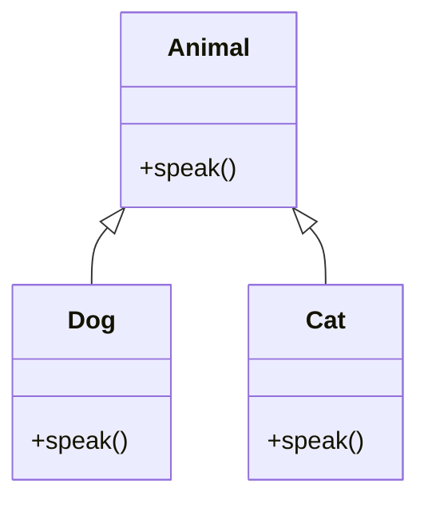
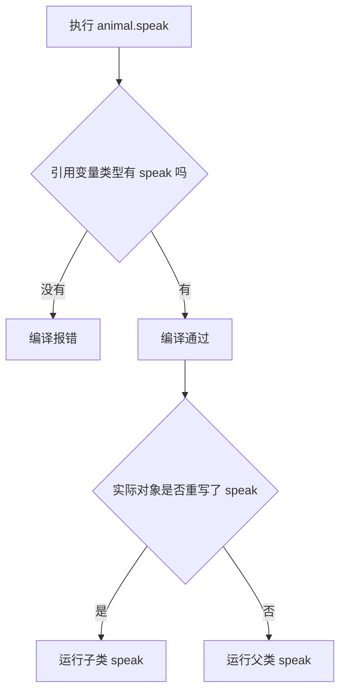
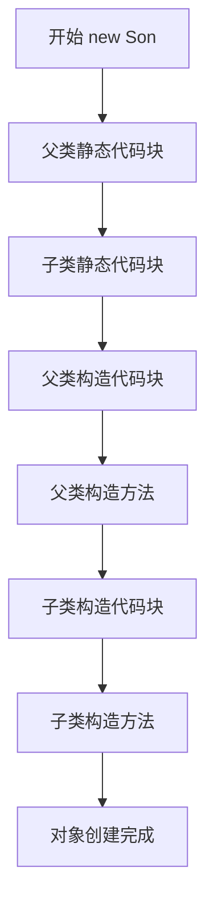
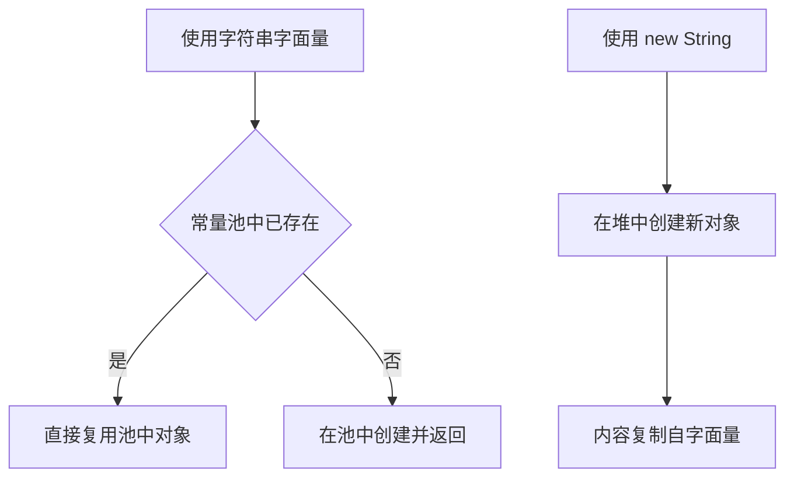

# 面向对象与字符串

本篇整理原笔记第七至九章，重点是用类和对象表达现实中的数据与行为。原笔记提供了提纲，本篇把它扩写成可以直接照着敲代码的教程：每一个概念都先回答“是什么、为什么需要”，再给出可以运行的最小示例，最后用表格和流程图对比容易混淆的知识点。

## 1. 学习目标与前置知识

### 1.1 学习目标

- 会定义类、创建对象，区分成员变量与成员方法。
- 掌握封装、继承、多态三大特性的真正含义，能说出多态哪些成员参与、哪些不参与。
- 记住四种权限修饰符的可见性范围，能根据场景选择合适的级别。
- 能写出成员内部类、静态内部类、局部内部类和匿名内部类。
- 会用 `enum` 替代常量，会用带构造方法、带抽象方法的枚举。
- 理解构造方法体系：重载、`this(...)`、`super(...)`，以及父类没有无参构造时的处理方式。
- 能说清静态代码块、构造代码块、局部代码块的执行时机与完整初始化顺序。
- 能对比抽象类和接口，知道什么时候用哪一个。
- 掌握 `String` 的不可变性、字符串常量池、`==` 与 `equals` 的区别，以及常用方法。
- 会在 `String`、`StringBuilder`、`StringBuffer` 之间做出选择。
- 会按规范重写 `Object` 的 `toString` 与 `equals`。

### 1.2 前置知识

需要先掌握：变量与数据类型、运算符、`if`/`for`/`while` 等流程控制、数组、方法（定义、调用、参数、返回值、重载），以及包与 `import` 的基本用法。如果这些还不熟，建议先回看前两篇笔记。

## 2. 类和对象

类是对象的模板，对象是类创建出来的实例。成员变量描述状态，成员方法描述行为。

```java
public class Student {
    private String name;
    private int age;

    public Student(String name, int age) {
        this.name = name;
        this.age = age;
    }

    public void introduce() {
        System.out.println(name + "，" + age + " 岁");
    }
}
```

```java
Student student = new Student("小明", 18);
student.introduce();
```

构造方法没有返回值，名称与类名相同。一个规范 JavaBean 通常提供私有成员变量、无参构造、公共 getter 和 setter。

### 2.1 对象在内存中的样子

- `Student student = new Student("小明", 18);` 中的 `student` 是引用变量，存在栈上。
- `new Student(...)` 创建的对象本体存在堆上。
- 引用变量保存的是对象的地址，所以把 `student` 赋值给另一个变量时，两个变量指向同一个对象。

```java
Student a = new Student("小明", 18);
Student b = a;          // b 和 a 指向同一个对象
b.setAge(19);
System.out.println(a.getAge());  // 19
```

理解这一点，后面字符串的 `==` 比较就很容易看懂。

### 2.2 成员变量和局部变量的区别

| 对比项 | 成员变量 | 局部变量 |
| --- | --- | --- |
| 定义位置 | 类中、方法外 | 方法内或方法参数 |
| 内存位置 | 堆中的对象里 | 栈上的方法栈帧里 |
| 默认值 | 有默认值（`0`、`false`、`null`） | 没有默认值，必须先赋值 |
| 生命周期 | 跟对象走 | 跟方法调用走 |
| 访问修饰符 | 可以加 | 不可以加 |
| 作用范围 | 整个类内部 | 所在的方法或代码块 |

## 3. 封装、继承和多态

### 3.1 封装

封装的核心是：不把内部数据直接暴露给外部，而是通过公共方法控制访问。这样做的好处是可以在方法里加校验、加日志，将来修改内部结构也不会影响调用方。

使用 `private` 隐藏实现细节，通过公共方法控制访问：

```java
public int getAge() {
    return age;
}

public void setAge(int age) {
    if (age >= 0) {
        this.age = age;
    }
}
```

如果直接暴露 `public int age`，任何人都可以把年龄设成 `-5`，校验逻辑没有地方放。这就是封装存在的理由。

### 3.2 继承

`extends` 表示“是一个”关系。子类可以复用父类可继承的成员，也可以重写方法。构造子类对象时会先执行父类构造方法。

```java
public class Person {
    protected String name;

    public Person(String name) {
        this.name = name;
    }

    public void sayHello() {
        System.out.println("你好，我是" + name);
    }
}

public class Teacher extends Person {
    public Teacher(String name) {
        super(name);
    }

    @Override
    public void sayHello() {
        System.out.println("你好，我是老师" + name);
    }
}
```

要点：

- Java 只支持单继承，一个类只能有一个直接父类。
- 子类不能继承父类的构造方法，只能通过 `super(...)` 调用。
- 父类中 `private` 成员子类无法直接访问。
- `@Override` 是给编译器看的，写了它之后方法名或参数写错会编译报错，建议总是加上。

### 3.3 多态

多态指的是：父类引用指向子类对象时，调用被重写的非静态成员方法，会执行子类版本。

```java
Animal animal = new Dog();
animal.speak();
```



多态的前提有三个：有继承或接口实现关系、子类重写了父类方法、父类引用指向子类对象。

## 4. 多态细节：哪些成员参与多态

这是初学者最容易错的地方。很多人以为“多态就是父类引用调用什么都是子类版本”，其实只有非静态成员方法参与多态。

### 4.1 三条结论

- 成员变量：不参与多态，编译看左边，运行也看左边。
- 静态方法：不参与多态，编译看左边，运行也看左边。
- 非静态成员方法：参与多态，编译看左边，运行看右边。

```java
class Father {
    String name = "father";

    public void method() {
        System.out.println("father method");
    }

    public static void staticMethod() {
        System.out.println("father static");
    }
}

class Son extends Father {
    String name = "son";

    @Override
    public void method() {
        System.out.println("son method");
    }

    public static void staticMethod() {
        System.out.println("son static");
    }
}

public class Demo {
    public static void main(String[] args) {
        Father f = new Son();
        System.out.println(f.name);        // father
        f.method();                        // son method
        f.staticMethod();                  // father static
    }
}
```

原因：成员变量和静态方法在编译期就按引用变量的类型绑定好了，只有虚方法（非静态成员方法）才在运行期根据实际对象类型去找重写后的版本。

### 4.2 多态方法调用的查找过程



### 4.3 向上转型与向下转型

向上转型是自动的、安全的：

```java
Animal animal = new Dog();   // 向上转型，天然安全
```

向下转型需要强转，并且必须保证实际类型匹配，否则抛 `ClassCastException`：

```java
Animal animal = new Dog();
Dog dog = (Dog) animal;      // 正确

Animal cat = new Cat();
Dog wrong = (Dog) cat;       // 运行时报 ClassCastException
```

正确做法是先用 `instanceof` 判断：

```java
if (animal instanceof Dog) {
    Dog dog = (Dog) animal;
    dog.watchDoor();
}
```

JDK 16 之后（实际是 JDK 16 正式定型）支持模式匹配写法：

```java
if (animal instanceof Dog dog) {
    dog.watchDoor();
}
```

### 4.4 多态作为方法参数和返回值

多态最实用的地方是让方法只依赖父类，从而同时接受所有子类：

```java
public static void letItSpeak(Animal animal) {
    animal.speak();
}

letItSpeak(new Dog());
letItSpeak(new Cat());
```

返回父类类型也是常见写法，调用方不需要知道具体子类：

```java
public static Animal create(String type) {
    if ("dog".equals(type)) {
        return new Dog();
    }
    return new Cat();
}
```

这样新增一种动物时，`letItSpeak` 和 `create` 的调用方基本不用改，这是多态带来的扩展性。

## 5. 四种权限修饰符

权限修饰符决定“谁能看见这个成员”。初学者常犯的错是把所有成员都写成 `public`，或者以为 `protected` 等价于 `public`。

| 修饰符 | 本类 | 同一个包中的其他类 | 不同包的子类 | 任意位置 |
| --- | --- | --- | --- | --- |
| `private` | 可见 | 不可见 | 不可见 | 不可见 |
| 默认（不写，package-private） | 可见 | 可见 | 不可见 | 不可见 |
| `protected` | 可见 | 可见 | 可见（只能通过子类自身或子类对象访问） | 不可见 |
| `public` | 可见 | 可见 | 可见 | 可见 |

### 5.1 典型用法

| 修饰符 | 典型用法 |
| --- | --- |
| `private` | 成员变量、只在类内部使用的辅助方法、内部类 |
| 默认 | 同一个包内部协作的工具类方法，不想对外暴露但需要同包访问 |
| `protected` | 明确希望子类重写或使用的模板方法、给子类用的字段 |
| `public` | 对外 API：构造方法、getter/setter、接口方法 |

### 5.2 `protected` 的细节

不同包的子类中，`protected` 成员只能通过“子类自己的引用”访问，不能通过父类引用访问：

```java
// 包 a
public class Parent {
    protected int value = 10;
}

// 包 b
public class Child extends Parent {
    public void test() {
        System.out.println(this.value);        // 可以
        Parent p = new Parent();
        // System.out.println(p.value);       // 编译错误
    }
}
```

### 5.3 一个实用的取值原则

在能用的前提下选最小的权限。先写 `private`，测试或子类真的需要再放大到默认或 `protected`，只有确实对外的 API 才用 `public`。把成员写成 `public` 之后，将来无法在不影响调用方的情况下修改内部实现。

## 6. 内部类

内部类是定义在另一个类（或接口）内部的类。为什么需要它？当某个类只服务于外部类，或者需要直接访问外部类的私有成员时，把它写成内部类可以缩小作用范围、增强封装。

### 6.1 成员内部类

定义在类中、方法外，相当于一个成员。

```java
public class Outer {
    private int num = 10;

    public class Inner {
        public void show() {
            System.out.println(num);            // 直接访问外部类私有成员
            System.out.println(Outer.this.num); // 完整写法
        }
    }

    public Inner getInner() {
        return new Inner();
    }
}

// 使用
Outer outer = new Outer();
Outer.Inner inner = outer.new Inner();   // 注意 new 的位置
inner.show();
```

`Outer.this` 的作用：当内部类也有同名成员时，用来明确指向外部类对象：

```java
public class Outer {
    private int num = 10;

    public class Inner {
        private int num = 20;

        public void show() {
            int num = 30;
            System.out.println(num);             // 30，局部变量
            System.out.println(this.num);        // 20，内部类成员
            System.out.println(Outer.this.num);  // 10，外部类成员
        }
    }
}
```

成员内部类不能定义静态成员（`static final` 常量除外），因为它依赖外部类对象才能存在。

### 6.2 静态内部类

用 `static` 修饰的内部类，可以直接通过外部类名创建，不需要外部类对象。

```java
public class Outer {
    private static String tag = "static tag";
    private int num = 10;

    public static class StaticInner {
        public void show() {
            System.out.println(tag);   // 可以：静态成员属于类
            // System.out.println(num); // 编译错误：静态内部类没有外部类对象
        }
    }
}

// 使用
Outer.StaticInner inner = new Outer.StaticInner();
inner.show();
```

静态内部类为什么不能直接访问外部类实例成员？因为它不持有外部类对象的引用。`num` 属于某个具体的 `Outer` 对象，编译器不知道要访问哪一个。如果确实需要，可以显式传入：

```java
public static class StaticInner {
    public void show(Outer outer) {
        System.out.println(outer.num);
    }
}
```

静态内部类是四种内部类里最常被推荐的一种，因为它不会隐式持有外部类引用，不容易造成内存泄漏。

### 6.3 局部内部类

定义在方法或代码块内部，只能在所属方法内使用。

```java
public class Outer {
    public void method() {
        int count = 5;

        class LocalInner {
            public void show() {
                System.out.println(count);  // 可以访问，count 实际是 final 的
            }
        }

        LocalInner inner = new LocalInner();
        inner.show();
    }
}
```

注意：局部内部类访问的局部变量必须是“事实上的 final”（赋值一次之后不再改动）。因为变量存活在栈上，而内部类对象可能在方法结束后仍然存在，编译器实际复制了一份值。

### 6.4 匿名内部类

匿名内部类是没有名字的内部类，同时完成了“定义类”和“创建对象”两件事，适合只用一次的接口实现。

```java
public interface Flyable {
    void fly();
}

public class Demo {
    public static void main(String[] args) {
        Flyable flyable = new Flyable() {
            @Override
            public void fly() {
                System.out.println("匿名内部类在飞行");
            }
        };
        flyable.fly();
    }
}
```

格式是 `new 接口名() { 重写方法 }` 或 `new 父类构造(...) { 重写方法 }`。它最常见的用途是配合接口回调：把一段行为作为参数传给方法。

```java
public class Button {
    public void click(ClickListener listener) {
        listener.onClick();
    }

    public interface ClickListener {
        void onClick();
    }
}

Button button = new Button();
button.click(new Button.ClickListener() {
    @Override
    public void onClick() {
        System.out.println("按钮被点击了");
    }
});
```

如果这个接口只有一个抽象方法（函数式接口），还可以写成更简洁的 Lambda：

```java
button.click(() -> System.out.println("按钮被点击了"));
```

### 6.5 四种内部类对比

| 对比项 | 成员内部类 | 静态内部类 | 局部内部类 | 匿名内部类 |
| --- | --- | --- | --- | --- |
| 定义位置 | 类中，方法外 | 类中，方法外，带 `static` | 方法或代码块内 | 方法内的表达式中 |
| 能否有名字 | 有 | 有 | 有 | 没有 |
| 创建方式 | `outer.new Inner()` | `new Outer.Inner()` | 方法内 `new LocalInner()` | `new 接口(){...}` |
| 访问外部类实例成员 | 可以（`Outer.this`） | 不可以，需显式传入 | 可以 | 可以 |
| 访问方法局部变量 | 可以（方法内创建时） | 可以（在方法内创建时） | 可以，需事实 final | 可以，需事实 final |
| 能否有静态成员 | 只能有 `static final` 常量 | 可以有 | 只能有 `static final` 常量 | 只能有 `static final` 常量 |
| 典型用途 | 与外部类强耦合的辅助类 | 工具类、Builder 模式 | 只在方法内复用的小类 | 一次性接口实现、事件回调 |

## 7. 枚举 enum

### 7.1 为什么需要枚举

在没有枚举之前，性别、订单状态这类“取值范围固定”的数据只能用常量表示：

```java
public class Gender {
    public static final int MALE = 1;
    public static final int FEMALE = 2;
}

public void setGender(int gender) { }
```

问题是：`setGender(99)` 也能编译通过，类型不安全；而且打印出来只有 `1`，看不出含义。枚举解决了这两个问题：取值被限定在枚举内部，打印出来就是名字。

### 7.2 定义与使用

```java
public enum Gender {
    MALE, FEMALE, UNKNOWN
}

Gender gender = Gender.MALE;
System.out.println(gender);        // MALE
```

枚举是一种特殊的类，它的对象个数固定，而且外部不能再创建。每个枚举常量本质上是一个 `public static final` 的对象。

### 7.3 常用方法

| 方法 | 作用 | 示例结果 |
| --- | --- | --- |
| `values()` | 返回所有常量的数组 | `[MALE, FEMALE, UNKNOWN]` |
| `valueOf(String)` | 按名字得到常量，名字不存在抛 `IllegalArgumentException` | `Gender.valueOf("MALE")` 得到 `MALE` |
| `name()` | 返回常量名，就是定义时写的名字 | `"MALE"` |
| `ordinal()` | 返回定义顺序下标，从 0 开始 | `Gender.FEMALE.ordinal()` 是 1 |
| `compareTo(E)` | 比较顺序 | 按 `ordinal` 比较 |

```java
for (Gender g : Gender.values()) {
    System.out.println(g.name() + " -> " + g.ordinal());
}
```

注意：`ordinal()` 依赖定义顺序，如果把常量顺序调换，已有数据可能错位，所以不要把它持久化到数据库，建议存 `name()` 或自定义编号。

### 7.4 枚举与 switch 配合

```java
Gender gender = Gender.MALE;

switch (gender) {
    case MALE:
        System.out.println("男");
        break;
    case FEMALE:
        System.out.println("女");
        break;
    default:
        System.out.println("未知");
        break;
}
```

`switch` 的 `case` 里直接写常量名，不能写 `Gender.MALE`。利用枚举还可以让编译器帮你检查是否漏写了分支。

### 7.5 带构造方法和字段的枚举

枚举可以像类一样有字段和构造方法，构造方法只能是 `private`（写不写 `private` 都一样）。

```java
public enum Season {
    SPRING("春天", 1),
    SUMMER("夏天", 2),
    AUTUMN("秋天", 3),
    WINTER("冬天", 4);

    private final String label;
    private final int code;

    Season(String label, int code) {
        this.label = label;
        this.code = code;
    }

    public String getLabel() {
        return label;
    }

    public int getCode() {
        return code;
    }
}

System.out.println(Season.SPRING.getLabel());   // 春天
```

每个常量后面用括号传参，就是调用对应构造方法；多个常量之间用逗号分隔，最后一个用分号。

### 7.6 带抽象方法的枚举

每个常量可以各自实现自己的行为，这可以替代一长串 `if/else`：

```java
public enum Operator {
    ADD {
        @Override
        public int apply(int a, int b) {
            return a + b;
        }
    },
    SUB {
        @Override
        public int apply(int a, int b) {
            return a - b;
        }
    };

    public abstract int apply(int a, int b);
}

System.out.println(Operator.ADD.apply(3, 5));   // 8
```

### 7.7 枚举实现单例

枚举单例天然线程安全、不会被反射破坏、序列化也不会产生新实例，是最简洁的单例写法：

```java
public enum Singleton {
    INSTANCE;

    public void doSomething() {
        System.out.println("单例方法");
    }
}

// 使用
Singleton.INSTANCE.doSomething();
```

### 7.8 枚举注意事项

- 枚举不能继承其他类，但可以实现接口。
- 枚举常量必须写在所有成员之前，且以分号结束（如果后面还有成员）。
- 枚举可以用于 `switch`，也可以放进集合和 `EnumMap`、`EnumSet`。
- 不要依赖 `ordinal()` 做持久化。

## 8. 构造方法体系

### 8.1 构造方法重载

一个类可以有多个构造方法，只要参数列表不同。

```java
public class User {
    private String name;
    private int age;

    public User() {
        this("未知", 0);        // 调用本类另一个构造方法
    }

    public User(String name) {
        this(name, 0);
    }

    public User(String name, int age) {
        this.name = name;
        this.age = age;
    }
}
```

`this(...)` 和 `super(...)` 都必须写在构造方法的第一行，因此一个构造方法里二者只能出现一个。

### 8.2 子类构造默认调用父类无参构造

如果子类构造方法没有写 `super(...)`，编译器会自动插入 `super()`，也就是调用父类的无参构造。

```java
class Father {
    public Father() {
        System.out.println("Father 无参构造");
    }
}

class Son extends Father {
    public Son() {
        // 编译器自动插入 super();
        System.out.println("Son 无参构造");
    }
}

new Son();
// 输出：Father 无参构造
//      Son 无参构造
```

### 8.3 父类没有无参构造时怎么办

如果父类只定义了带参构造，编译器就不会再生成默认无参构造，此时子类必须显式调用父类的带参构造，否则编译报错。

```java
class Father {
    private String name;

    public Father(String name) {
        this.name = name;
    }
}

class Son extends Father {
    public Son(String name) {
        super(name);   // 必须显式调用，否则编译错误
    }
}
```

报错信息通常是“父类中没有可用的无参构造方法”。解决办法只有两个：给父类补一个无参构造，或者在子类构造第一行显式 `super(...)`。

### 8.4 `this` 与 `super` 对比

| 关键字 | 指向 | 可调用内容 | 常见用途 |
| --- | --- | --- | --- |
| `this` | 当前对象 | 本类成员变量、本类方法、`this(...)` | 区分成员变量与参数、构造方法复用 |
| `super` | 父类部分 | 父类成员、父类方法、`super(...)` | 调用被重写的父类方法、初始化父类字段 |

## 9. 代码块与初始化顺序

### 9.1 三种代码块

```java
public class Block {
    static {
        System.out.println("静态代码块：类加载时执行一次");
    }

    {
        System.out.println("构造代码块：每次创建对象都执行，先于构造方法");
    }

    public Block() {
        System.out.println("构造方法");
    }

    public void method() {
        {
            int temp = 1;
            System.out.println("局部代码块：限定变量作用范围");
        }
    }
}
```

| 代码块 | 书写位置 | 执行时机 | 执行次数 |
| --- | --- | --- | --- |
| 静态代码块 | 类中，`static { }` | 类加载时 | 一次 |
| 构造代码块 | 类中，`{ }` | 每次创建对象，构造方法之前 | 每次创建对象一次 |
| 局部代码块 | 方法内部，`{ }` | 执行到该语句时 | 每次执行到都执行 |
| 同步代码块 | 方法内部，`synchronized (锁) { }` | 执行到时，需拿到锁 | 每次执行到都执行 |

### 9.2 完整执行顺序

创建子类对象时的顺序是：父类静态 → 子类静态 → 父类构造代码块 → 父类构造方法 → 子类构造代码块 → 子类构造方法。



验证代码：

```java
class Father {
    static {
        System.out.println("1 父类静态代码块");
    }

    {
        System.out.println("3 父类构造代码块");
    }

    public Father() {
        System.out.println("4 父类构造方法");
    }
}

class Son extends Father {
    static {
        System.out.println("2 子类静态代码块");
    }

    {
        System.out.println("5 子类构造代码块");
    }

    public Son() {
        System.out.println("6 子类构造方法");
    }
}

public class Demo {
    public static void main(String[] args) {
        new Son();
        System.out.println("--- 再创建一个 ---");
        new Son();
    }
}
```

第一次创建输出 `1 2 3 4 5 6`，第二次创建时静态代码块不会再执行，只输出 `3 4 5 6`。

### 9.3 为什么顺序是这样

静态代码块属于类，只在类第一次被使用时执行一次；构造代码块和构造方法属于对象，每创建一个对象就执行一次。子类调用构造方法前必须先把父类部分初始化完成，所以父类的构造代码块和构造方法先执行。

## 10. 抽象类与接口

### 10.1 抽象类

抽象类用 `abstract` 修饰，可以包含普通方法和抽象方法，不能直接创建对象。

```java
public abstract class Shape {
    protected String name;

    public Shape(String name) {
        this.name = name;
    }

    public abstract double area();

    public void print() {
        System.out.println(name + " 面积是 " + area());
    }
}

public class Circle extends Shape {
    private final double radius;

    public Circle(double radius) {
        super("圆");
        this.radius = radius;
    }

    @Override
    public double area() {
        return Math.PI * radius * radius;
    }
}
```

抽象方法没有方法体，它的意义是“强制子类必须给出实现”，同时让父类可以用统一的方式调用子类能力。

### 10.2 接口

接口表达一组能力，一个类可以实现多个接口：

```java
public interface Flyable {
    void fly();
}

public class Bird implements Flyable {
    @Override
    public void fly() {
        System.out.println("飞行");
    }
}
```

从 JDK 8 开始接口可以有 `default` 方法和 `static` 方法；从 JDK 9 开始还支持 `private` 方法（用于给 `default` 方法抽公共代码）。

```java
public interface Greetable {
    void greet();

    default void greetTwice() {
        greet();
        greet();
    }

    static Greetable of(Runnable task) {
        return task::run;
    }
}
```

接口中的字段默认是 `public static final`，必须初始化，且不能修改。

### 10.3 抽象类与接口对比

| 对比项 | 抽象类 | 接口 |
| --- | --- | --- |
| 关键字 | `abstract class` | `interface` |
| 成员变量 | 可以有普通字段，也可有 `static` 字段 | 字段默认 `public static final`，必须初始化 |
| 构造方法 | 有构造方法，供子类 `super` 调用 | 没有构造方法 |
| 抽象方法 | 可以有 | 可以有（默认都是 `public abstract`） |
| 普通方法 | 可以有 | JDK 8 起可用 `default` 方法 |
| 静态方法 | 可以有 | JDK 8 起可以有 `static` 方法 |
| 继承/实现 | 单继承，只能 extends 一个类 | 可以 implements 多个接口 |
| 访问修饰符 | 方法可以是任意级别 | 方法默认 `public`，不能是 `protected` |
| 设计定位 | “是什么”：共享状态和骨架代码 | “能做什么”：规定一组能力契约 |
| 典型场景 | 模板方法、有公共字段的类层次 | 能力扩展、跨类层次的解耦 |

### 10.4 怎么选

判断标准很简单：如果要表达“A 是一种 B”，并且需要共享字段或骨架代码，用抽象类；如果要表达“A 具备某种能力”，或者一个类需要同时具备多种能力，用接口。实际项目中常见做法是“接口定义契约 + 抽象类提供部分实现”。

### 10.5 匿名内部类与 Lambda

匿名内部类适合只使用一次的小型实现，Lambda 表达式则适合函数式接口（只有一个抽象方法的接口）。

```java
// 匿名内部类
Runnable r1 = new Runnable() {
    @Override
    public void run() {
        System.out.println("run");
    }
};

// Lambda
Runnable r2 = () -> System.out.println("run");
```

## 11. String 详解

### 11.1 String 的构造方法

```java
String s1 = "hello";                       // 字面量，进入常量池
String s2 = new String("hello");           // 在堆中新建对象
String s3 = new String(new char[]{'h', 'i'});   // 从字符数组构造
String s4 = new String(new byte[]{104, 105});   // 从字节数组构造，按平台默认编码
```

平时优先用字面量，只有需要从字节数组、字符数组等数据构造时才用构造方法。

### 11.2 字符串常量池

用字面量创建的字符串会先到字符串常量池中查找，如果已存在就直接复用，不新建：

```java
String a = "java";
String b = "java";
System.out.println(a == b);   // true，同一个池中对象
```

`new String(...)` 则一定在堆中创建新对象：

```java
String c = new String("java");
System.out.println(a == c);              // false
System.out.println(a.equals(c));         // true
```



### 11.3 `==` 与 `equals` 的区别

- `==` 比较引用，对基本类型比较的是值。
- `equals` 是方法，`String` 重写了它，比较的是字符内容。

```java
String s1 = "a";
String s2 = new String("a");
String s3 = "a" + "b";        // 编译期就是 "ab"，在池中
String s4 = s1 + "b";         // 运行时拼接，结果是新对象

System.out.println(s1 == s2);          // false
System.out.println(s1.equals(s2));     // true
System.out.println("ab" == s3);        // true
System.out.println("ab" == s4);        // false
System.out.println("ab".equals(s4));   // true
```

结论：判断字符串内容一律用 `equals`，而且推荐把常量写在前面，避免空指针：

```java
if ("java".equals(input)) {
    System.out.println("匹配");
}
```

### 11.4 不可变的原因和好处

`String` 内部用一个 `private final char[]`（JDK 9 之后改为 `private final byte[] value`）保存字符，并且不提供任何修改内容的方法，所有“修改”操作都返回新对象。

为什么这样设计：

- 线程安全：内容永不改变，多个线程同时读取不需要加锁。
- `hashCode` 可以缓存：`String` 内部缓存了哈希值，作为 `HashMap` 的 key 时效率更高。
- 适合做 key：内容不会在放入集合后被偷偷改掉，导致查不到。
- 可以安全共享：常量池复用才不会出问题。
- 安全性：数据库连接串、文件路径等作为参数传递时，不会被中途篡改。

代价是每次改动都产生新对象：

```java
String text = "";
for (int i = 0; i < 1000; i++) {
    text = text + i;   // 每次循环都产生一个新 String
}
```

### 11.5 常用方法

```java
String s = "  Hello Java World  ";

s.length();                     // 长度
s.trim();                       // 去掉首尾空白
s.toUpperCase();                // 转大写
s.toLowerCase();                // 转小写
s.contains("Java");             // 是否包含
s.startsWith("  He");           // 是否以某前缀开始
s.endsWith("  ");               // 是否以某后缀结束
s.indexOf("Java");              // 第一次出现的位置，找不到返回 -1
s.lastIndexOf("o");             // 最后一次出现的位置
s.charAt(2);                    // 第 2 个字符
s.substring(2);                 // 从下标 2 截到末尾
s.substring(2, 7);              // 截取 [2, 7)，含头不含尾
s.replace("Java", "Python");    // 替换所有匹配
s.split(" ");                   // 按空格切分
s.isEmpty();                    // 长度是否为 0
s.isBlank();                    // 是否只包含空白（JDK 11+）
s.toCharArray();                // 转成 char 数组
s.getBytes();                   // 转成 byte 数组

// 静态方法
String.join("-", "a", "b", "c");       // "a-b-c"
String.valueOf(123);                   // 基本类型转字符串
String.format("%d 岁", 18);            // 格式化
```

几个易错示例：

```java
String csv = "a,b,,c";
String[] parts = csv.split(",");      // 长度是 4，空串保留
System.out.println(parts.length);

// split 的参数是正则，切分 "." 需要转义
String ip = "192.168.1.1";
String[] nums = ip.split("\\.");      // 不能写 split(".")

// substring 下标从 0 开始，含头不含尾
"hello".substring(1, 3);              // "el"
```

## 12. StringBuilder 与 StringBuffer

前面看到，循环里用 `+` 拼接字符串会不断创建新对象。`StringBuilder` 内部维护一个可变字符数组，追加时不需要新建对象。

```java
StringBuilder builder = new StringBuilder();
builder.append("Java").append(" ").append("入门");
String text = builder.toString();
```

`StringBuilder` 支持链式调用，因为 `append` 返回的是 `this`。除了 `append`，还有 `insert`、`delete`、`replace`、`reverse`、`setLength` 等。

循环中拼接的正确写法：

```java
StringBuilder builder = new StringBuilder();
for (int i = 0; i < 1000; i++) {
    builder.append(i).append(",");
}
String result = builder.toString();
```

### 12.1 三者对比

| 对比项 | `String` | `StringBuilder` | `StringBuffer` |
| --- | --- | --- | --- |
| 是否可变 | 不可变 | 可变 | 可变 |
| 线程安全 | 安全（因为不可变） | 不安全 | 安全（方法加 `synchronized`） |
| 性能 | 频繁拼接最差 | 最快 | 比 `StringBuilder` 慢 |
| 出现版本 | 最初版本 | JDK 1.5 | JDK 1.0 |
| 适用场景 | 内容基本不变、作为常量或 key | 单线程下频繁拼接 | 多线程共享同一个缓冲区 |
| 典型用法 | `"a" + b` 少量拼接 | 循环拼接、SQL 拼装 | 极少使用，可用其他方案替代 |

### 12.2 怎么选

- 内容固定或改动很少：用 `String`。
- 单线程内需要多次改动：用 `StringBuilder`，这是绝大多数场景。
- 多线程共享同一个可变缓冲区：可以用 `StringBuffer`，但更好的方案是每个线程用自己的 `StringBuilder`，最后再合并。

另外，`String` 的 `+` 在单条语句中拼接少量字符串时，编译器会自动优化成 `StringBuilder`（JDK 9 之后是 `invokedynamic` 优化），所以 `"a" + b + "c"` 这种写法在非循环场景下并不需要手动改写。

### 12.3 StringJoiner

`StringJoiner` 适合按照分隔符、前缀和后缀拼接多个元素。

```java
StringJoiner joiner = new StringJoiner(", ", "[", "]");
joiner.add("Java").add("Python").add("Go");
System.out.println(joiner.toString());   // [Java, Python, Go]
```

## 13. Object 的 toString 与 equals

### 13.1 toString

`Object` 的 `toString` 默认返回“类名@十六进制哈希码”，几乎没有可读性。把它重写后，打印对象就能看到有意义的内容。

调用时机：`System.out.println(obj)`、字符串拼接 `"" + obj`、日志框架打印对象时，都会自动调用 `toString`。

```java
public class User {
    private String name;
    private int age;

    public User(String name, int age) {
        this.name = name;
        this.age = age;
    }

    @Override
    public String toString() {
        return "User{name='" + name + "', age=" + age + "}";
    }
}

System.out.println(new User("小明", 18));
// User{name='小明', age=18}
```

### 13.2 equals

`Object` 的 `equals` 默认行为和 `==` 一样，比较地址。要按内容比较就必须重写。

重写规范：

1. 用 `==` 先判断是不是同一个对象，是就直接返回 `true`。
2. 判断参数是否为 `null`，以及 `getClass()` 是否相同。
3. 把参数强转成目标类型，逐个比较关键字段。

```java
@Override
public boolean equals(Object o) {
    if (this == o) {
        return true;
    }
    if (o == null || getClass() != o.getClass()) {
        return false;
    }
    User user = (User) o;
    return age == user.age && Objects.equals(name, user.name);
}
```

### 13.3 为什么必须连带重写 hashCode

规则是：如果两个对象 `equals` 为 `true`，它们的 `hashCode` 必须相同。如果只重写 `equals` 不重写 `hashCode`，两个“内容相同”的对象哈希值不同，放进 `HashSet` 或作为 `HashMap` 的 key 时会被当成两个不同的键，导致数据重复或查不到。

```java
@Override
public int hashCode() {
    return Objects.hash(name, age);
}
```

实际开发中可以用 IDE 的“生成 equals() and hashCode()”功能或 Java 16+ 的 `record` 来避免手写错误。顺带说明：`Objects.equals` 是空安全的比较，`Objects.hash` 能把多个字段组合成哈希值。

## 14. 关键字速查

| 关键字 | 作用 |
| --- | --- |
| `this` | 当前对象，区分成员变量与参数 |
| `super` | 父类对象，用于访问父类成员或构造方法 |
| `static` | 类级别成员 |
| `abstract` | 声明抽象类或抽象方法 |
| `final` | 禁止再次赋值、重写或继承 |
| `package` | 声明包 |
| `import` | 导入其他包中的类型 |
| `private` / `protected` / `public` | 控制可见范围 |
| `enum` | 声明枚举类型 |
| `instanceof` | 判断对象的实际类型 |

`static`、`final`、权限修饰符的组合在面试和代码阅读中经常出现，记住这三条结论即可：

- `static` 成员属于类，随类加载而存在，可以通过类名访问。
- `final` 修饰变量只能赋值一次，修饰方法不能重写，修饰类不能被继承。
- `static final` 常量必须声明时赋值，命名习惯是全大写加下划线。

## 15. 小白易错点

- 把 `==` 当成内容比较。字符串比较内容必须用 `equals`。
- 用 `new String("x")` 创建字符串，白白多出一个对象。
- 以为多态对成员变量也生效。成员变量和静态方法都看左边。
- 向下转型不做 `instanceof` 判断，运行时抛 `ClassCastException`。
- 父类没有无参构造时，子类构造忘了写 `super(...)`，编译报错却找不到原因。
- `this(...)` 或 `super(...)` 没写在构造方法第一行，编译报错。
- 静态方法里使用 `this` 或直接访问实例成员。
- 成员内部类访问同名变量时忘了区分，以为 `num` 就是外部类那个 `num`。
- 静态内部类里直接写外部类实例字段，报“无法从静态上下文中引用非静态变量”。
- 匿名内部类想复用又无法复用，却写成了匿名内部类。
- 枚举的 `case` 写了 `Gender.MALE`，编译报错。
- 用 `ordinal()` 存数据库，之后调整常量顺序导致数据错乱。
- 循环里用 `+=` 拼字符串，数据量大时性能很差。
- 只重写 `equals` 不重写 `hashCode`，导致 `HashSet` 出现重复元素。
- 在局部内部类里修改外层局部变量，编译报错（需要事实 final）。
- 以为接口里能定义 `protected` 方法或可变字段。
- `split(".")` 想按点切分却得到空数组，忘了点是正则元字符。
- 把 `StringBuilder` 当成线程安全类在多线程间共享。

## 16. 练习清单

1. 定义 `Student` 类，包含私有字段、无参构造、全参构造、getter/setter，并重写 `toString` 与 `equals`、`hashCode`。
2. 定义父类 `Person` 和子类 `Teacher`、`Student`，用多态写一个打招呼的方法，并验证成员变量、静态方法不参与多态。
3. 写四个包结构，分别用四种权限修饰符声明字段，验证不同包下的访问结果。
4. 写一个类同时包含成员内部类、静态内部类和局部内部类，并各创建一个实例。
5. 用匿名内部类实现 `Comparator` 接口，对字符串数组按长度排序。
6. 定义 `Season` 枚举，带构造方法和字段，并写一个根据枚举返回中文名的方法。
7. 定义带抽象方法的 `Operator` 枚举，实现加减乘除四种运算。
8. 用枚举实现一个单例类，并提供 `getInstance` 语义的方法或直接使用 `INSTANCE`。
9. 打印出父类静态代码块、子类静态代码块、两个构造代码块和两个构造方法的执行顺序，并解释结果。
10. 写一个抽象类 `Shape` 和接口 `Comparable` 风格的 `Measurable`，比较两者使用上的差异。
11. 用一段代码演示 `new String("a")` 与字面量 `"a"` 的 `==` 和 `equals` 结果，并解释原因。
12. 用 `StringBuilder` 和 `+` 分别拼接 1 万次字符串，比较耗时。
13. 用 `String` 的 `substring`、`indexOf`、`split`、`replace`、`trim` 完成：从 `"  id=7;name=tom  "` 中提取键值对。
14. 用 `StringJoiner` 把字符串数组拼成 `[a, b, c]` 形式。

## 17. 资料对应关系

- 《Java基础笔记》：第七章“面向对象基础”、第八章“面向对象进阶”、第九章“常用 API 之 String”。
- 本篇第 2 至 5 节对应原笔记的类与对象、封装继承多态；第 4 节的多态细节、第 5 节的权限修饰符表格是补充内容。
- 本篇第 6、7、9 节对应原笔记内部类、枚举、代码块部分，并补充了执行顺序流程图。
- 本篇第 11 至 13 节对应原笔记的 String、StringBuilder 与 Object 部分。
- 下一篇《常用 API 与正则表达式》会接着讲包装类、`java.time`、`BigDecimal` 与正则表达式，其中的 `equals`、`toString` 会直接复用本篇第 13 节的结论。

## 18. 总结

面向对象的学习顺序是：先会定义类和创建对象，再理解封装，最后学习继承、多态、抽象类和接口。字符串是最常用的对象之一，先掌握内容比较和不可变特性，再学习构建和拼接工具。

需要重点记住的几句话：

- 封装是把数据藏起来用方法暴露；继承是复用加扩展；多态是同一父类引用调用同一方法得到不同结果。
- 只有非静态成员方法参与多态，成员变量和静态方法都看引用变量的类型。
- 权限从小到大是 `private` → 默认 → `protected` → `public`，能用小就不用大。
- 对象初始化顺序是“父类静态 → 子类静态 → 父类构造代码块 → 父类构造方法 → 子类构造代码块 → 子类构造方法”。
- 抽象类表达“是什么”，接口表达“能做什么”。
- `String` 不可变，比较内容用 `equals`，频繁拼接用 `StringBuilder`。
- 重写 `equals` 就一定要连带重写 `hashCode`。
