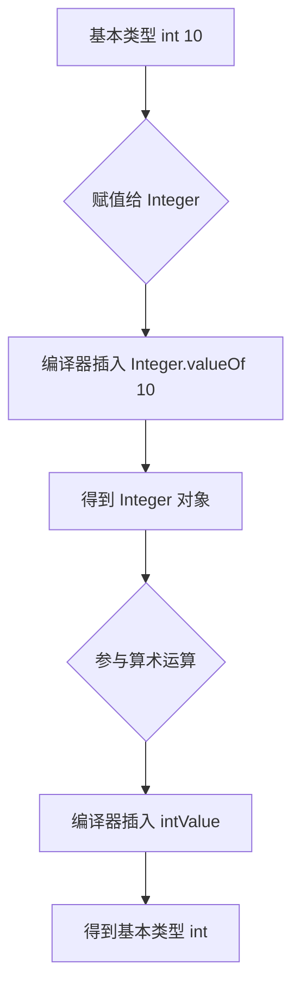
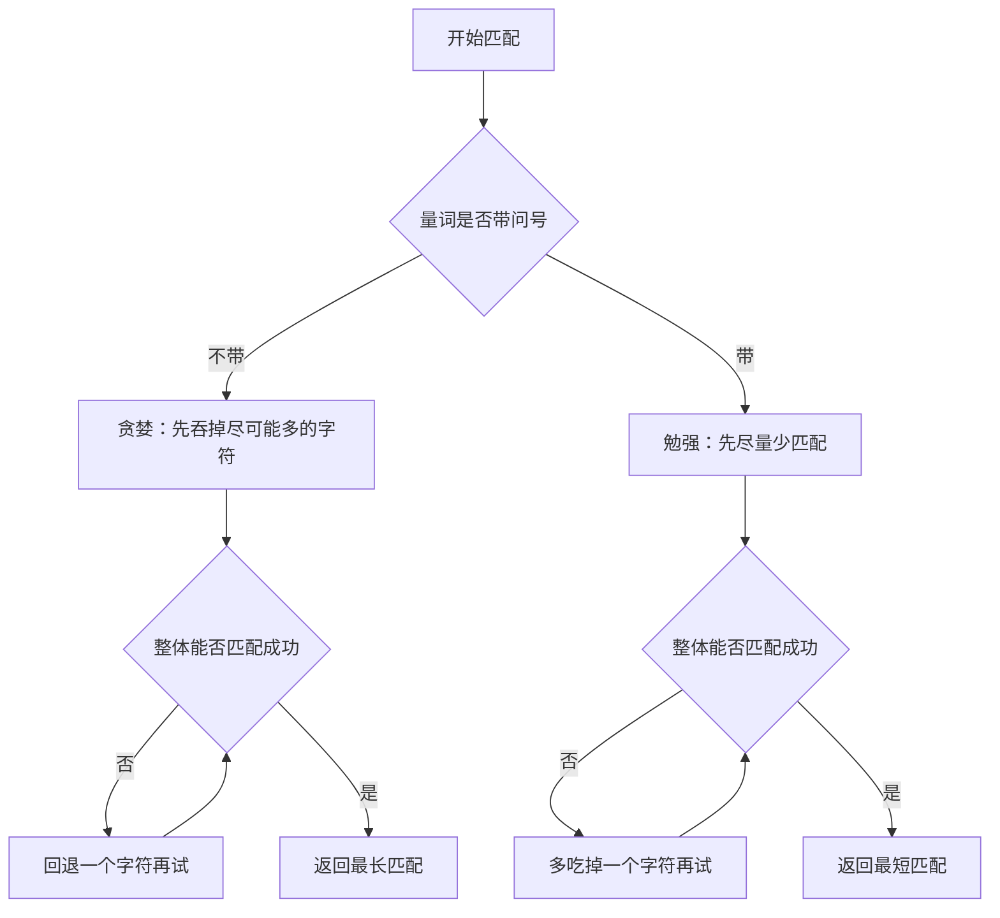
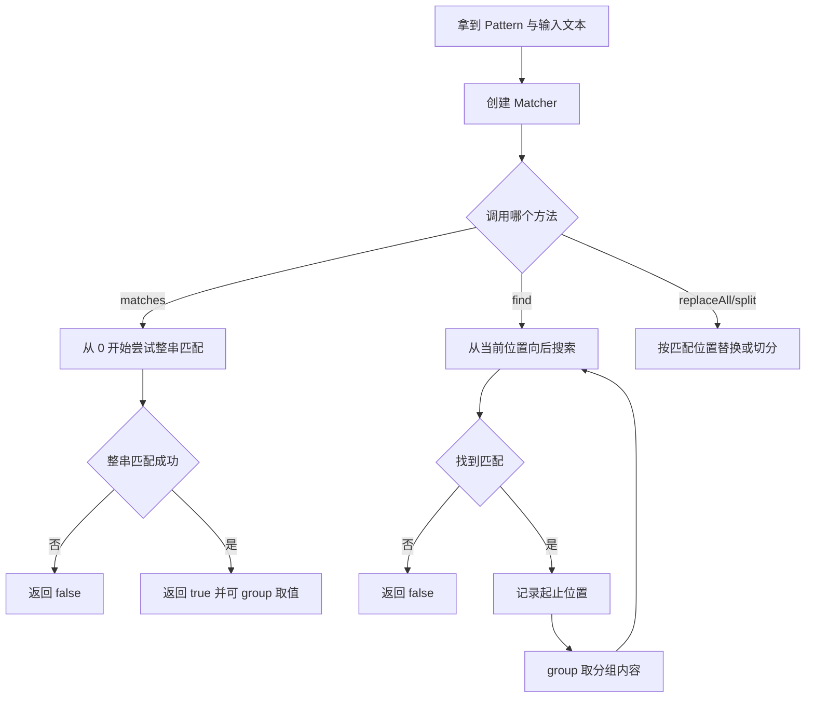

# 常用 API 与正则表达式

本篇整理原笔记第十、十一章。API 是可直接调用的现成类，正则表达式用于描述文本模式。原笔记列出了需要掌握的类型，本篇把每个类型扩展成“是什么、为什么需要、怎么用、容易错在哪”四个部分，并给出可以直接运行的示例。

## 1. 学习目标与前置知识

### 1.1 学习目标

- 会用 `Math`、`System`、`Objects`、`Arrays`、`Runtime` 的常用方法。
- 理解包装类与基本类型的对应关系，掌握自动装箱与拆箱。
- 能解释 `Integer` 缓存导致的 `==` 陷阱，会区分 `valueOf` 和 `parseInt`。
- 会使用 `BigDecimal` 做金额计算，知道什么时候必须用三参 `divide`。
- 会用 `java.time` 完成日期时间的创建、格式化、解析和运算。
- 能说出旧 `Date`/`Calendar`/`SimpleDateFormat` 的问题，知道为什么新代码优先用 `java.time`。
- 会使用 `Pattern` 和 `Matcher`，区分 `matches`、`find`、`lookingAt`。
- 理解贪婪量词与勉强量词的区别，会用分组、反向引用和预编译。
- 能写出手机号、邮箱、身份证、日期、中文的常用校验正则。

### 1.2 前置知识

需要先掌握：基本数据类型与引用类型、方法调用与参数传递、`String` 的常用方法与不可变性、异常处理（`try/catch`）、数组的基本操作，以及上一篇《面向对象与字符串》中关于 `equals`、`hashCode`、`toString` 和不可变对象的结论。

## 2. 常用工具类

| 类 | 常用用途 |
| --- | --- |
| `Math` | 数学运算、取整、幂和随机数 |
| `System` | 标准输入输出、时间和数组复制 |
| `Runtime` | 访问当前 Java 运行时环境 |
| `Object` | 所有类的根类，提供 `toString`、`equals` 等方法 |
| `Objects` | 空值检查和对象比较 |
| `Arrays` | 数组排序、查找、复制和转字符串 |

重写 `equals` 时通常也要重写 `hashCode`，这样对象才能在哈希集合中正常工作。

### 2.1 Math：数学运算

`Math` 的方法全是静态方法，直接用类名调用。

```java
Math.abs(-5);              // 5，绝对值
Math.max(3, 7);            // 7，较大值
Math.min(3, 7);            // 3，较小值
Math.pow(2, 10);           // 1024.0，注意返回 double
Math.sqrt(16);             // 4.0，平方根
Math.round(2.5);           // 3，四舍五入，返回 long
Math.round(-2.5);          // -2，负数向“大的方向”舍入
Math.floor(2.9);           // 2.0，向下取整
Math.ceil(2.1);            // 3.0，向上取整
Math.random();             // [0.0, 1.0) 的随机 double
```

生成指定范围随机整数的常用写法：

```java
// 生成 [1, 100] 的随机整数
int num = (int) (Math.random() * 100) + 1;
```

`Math.round` 的返回类型是 `long`，`Math.pow`、`Math.sqrt` 的返回类型是 `double`，这两个是初学者赋值时最容易出错的地方。

### 2.2 System：系统相关操作

```java
System.currentTimeMillis();       // 当前毫秒时间戳，返回 long
System.out.println("输出");        // 标准输出
System.err.println("错误输出");    // 错误输出

int[] src = {1, 2, 3, 4, 5};
int[] dest = new int[5];
System.arraycopy(src, 1, dest, 0, 3);   // dest = [2, 3, 4, 0, 0]

System.getProperty("java.version");     // 读取系统属性
System.getProperty("os.name");
System.getProperty("user.dir");         // 当前工作目录

System.exit(0);                         // 终止 JVM，0 表示正常结束
```

`System.arraycopy(源数组, 源起始下标, 目标数组, 目标起始下标, 复制长度)` 这五个参数顺序必须记清楚，写错顺序往往不会编译报错，但运行时会得到奇怪结果或抛 `ArrayIndexOutOfBoundsException`。

`System.exit(0)` 会直接结束整个 JVM，不只是结束当前方法，所以要谨慎使用，测试代码里不要随意加。

### 2.3 Objects：空安全的工具类

`Objects` 的价值在于把“判空”这件事统一写在一个地方，避免到处手写 `x == null ? ... : ...`。

```java
Objects.equals("a", "a");            // true，空安全
Objects.equals(null, null);          // true
Objects.equals(null, "a");           // false
Objects.isNull(null);                // true
Objects.nonNull("a");                // true
Objects.requireNonNull(name);        // name 为 null 时抛 NullPointerException
Objects.requireNonNull(name, "name 不能为空");   // 带提示信息
Objects.hash("a", 1);                // 组合哈希值
Objects.toString(null, "默认值");     // 为 null 时返回默认值
```

判断参数是否为空时建议写成 `Objects.requireNonNull(...)`，这样异常会抛在方法入口，而不是在很久之后才报错，定位问题容易得多。

### 2.4 Arrays：数组工具类

```java
int[] arr = {5, 3, 9, 1};

Arrays.toString(arr);              // "[5, 3, 9, 1]"，直接 println 数组只会打印地址
Arrays.sort(arr);                  // 原地排序，arr 变成 [1, 3, 5, 9]
Arrays.binarySearch(arr, 5);       // 2，必须先排序，否则结果不确定
Arrays.copyOf(arr, 6);             // 新数组 [1, 3, 5, 9, 0, 0]，长度不足补默认值
Arrays.copyOfRange(arr, 1, 3);     // [3, 5]，含头不含尾
Arrays.fill(new int[3], 7);        // [7, 7, 7]
Arrays.equals(new int[]{1}, new int[]{1});   // true，比较内容

List<Integer> list = Arrays.asList(1, 2, 3);  // 转成 List
```

注意事项：

- `Arrays.asList` 返回的列表长度固定，调用 `add` 或 `remove` 会抛 `UnsupportedOperationException`；需要可变列表就再包一层 `new ArrayList<>(...)`。
- `Arrays.asList` 对基本类型数组会得到 `List<int[]>` 只有一个元素，要用包装类数组。

```java
int[] nums = {1, 2, 3};
List<int[]> wrong = Arrays.asList(nums);        // 长度 1
Integer[] boxed = {1, 2, 3};
List<Integer> right = Arrays.asList(boxed);     // 长度 3
```

- `Arrays.binarySearch` 查找失败时返回负数，不是 `-1` 这么简单，具体是 `-(插入点) - 1`。

### 2.5 Runtime：运行时环境

```java
Runtime runtime = Runtime.getRuntime();   // 单例，只能用 getRuntime 获取
runtime.availableProcessors();            // 可用 CPU 核心数
runtime.freeMemory();                     // 空闲内存字节数
runtime.maxMemory();                      // 最大可用内存字节数
runtime.totalMemory();                    // 已申请内存字节数
runtime.exec("notepad.exe");              // 启动外部程序，返回 Process
```

`exec` 执行外部命令存在命令注入风险，参数来自用户输入时要做严格校验，或者改用 `ProcessBuilder` 并对参数做白名单控制。生产代码不建议直接拼接用户输入去 `exec`。

### 2.6 工具类速查表

| 类 | 常用方法 | 返回值要点 |
| --- | --- | --- |
| `Math` | `abs`、`max`、`min`、`pow`、`sqrt`、`round`、`random` | `round` 返回 `long`，`pow`/`sqrt` 返回 `double` |
| `System` | `currentTimeMillis`、`arraycopy`、`exit`、`getProperty` | `arraycopy` 参数顺序易错 |
| `Objects` | `equals`、`isNull`、`nonNull`、`requireNonNull`、`hash` | 空安全，适合做参数校验 |
| `Arrays` | `toString`、`sort`、`binarySearch`、`copyOf`、`asList` | `asList` 返回定长列表 |
| `Runtime` | `getRuntime`、`availableProcessors`、`exec` | 单例，需通过 `getRuntime` 获取 |

## 3. 包装类

### 3.1 为什么需要包装类

基本类型不是对象，无法作为泛型参数，也无法表示“不存在”这个含义。例如 `List<int>` 不合法，需要一个对象类型；数据库里某个字段可能是 `NULL`，`int` 无法表示，`Integer` 可以。包装类就是为解决这类问题而存在的。

### 3.2 八种基本类型与包装类对照

| 基本类型 | 包装类 | 字节数 | 默认值 | 常用转换方法 |
| --- | --- | --- | --- | --- |
| `byte` | `Byte` | 1 | 0 | `Byte.parseByte` |
| `short` | `Short` | 2 | 0 | `Short.parseShort` |
| `int` | `Integer` | 4 | 0 | `Integer.parseInt` |
| `long` | `Long` | 8 | 0L | `Long.parseLong` |
| `float` | `Float` | 4 | 0.0f | `Float.parseFloat` |
| `double` | `Double` | 8 | 0.0d | `Double.parseDouble` |
| `char` | `Character` | 2 | '\u0000' | 无 `parse`，用 `charAt` |
| `boolean` | `Boolean` | 未规定 | `false` | `Boolean.parseBoolean` |

除了 `int` 对应 `Integer`、`char` 对应 `Character`，其余都是首字母大写，这个例外要单独记。

包装类的默认值是 `null`，不是 0，这一点在实体类字段和数据库映射中非常重要。

### 3.3 自动装箱与自动拆箱

自动装箱是把基本类型直接赋给包装类，自动拆箱是反过来，编译器会自动插入 `valueOf` 和 `xxxValue()` 调用。

```java
Integer number = 10;       // 自动装箱，等价于 Integer.valueOf(10)
int value = number + 1;    // 自动拆箱，等价于 number.intValue() + 1
```



拆箱最常见的坑是空指针：

```java
Integer count = null;
int result = count;   // 运行时 NullPointerException
```

只要包装类变量可能为 `null`，参与运算前就要判空或用 `Objects.requireNonNull`。

### 3.4 Integer 缓存导致的 `==` 陷阱

`Integer.valueOf` 会缓存 `-128` 到 `127` 之间的对象，这个范围内相同数值返回的是同一个对象，超出范围则每次新建。

```java
Integer a = 100;
Integer b = 100;
System.out.println(a == b);     // true，来自缓存，同一对象

Integer c = 200;
Integer d = 200;
System.out.println(c == d);     // false，超出缓存范围

System.out.println(c.equals(d));         // true，比较内容
System.out.println(new Integer(100) == 100);   // true，右边拆箱
```

| 比较方式 | `-128 ~ 127` | 超出范围 | 说明 |
| --- | --- | --- | --- |
| `==` 比较两个 `Integer` | `true` | `false` | 比较对象地址，受缓存影响 |
| `equals` 比较两个 `Integer` | `true` | `true` | 比较数值，推荐写法 |
| `Integer` 与 `int` 用 `==` | `true` | `true` | 自动拆箱后按数值比较 |
| 两个都 `new Integer(...)` | `false` | `false` | 一定是不一样的新对象 |

结论：比较包装类的值一律用 `equals`，不要用 `==`。

### 3.5 valueOf 与 parseInt 的区别

| 方法 | 返回类型 | 是否走缓存 | 典型用途 |
| --- | --- | --- | --- |
| `Integer.parseInt("42")` | `int` | 不涉及 | 把字符串解析成基本类型 |
| `Integer.valueOf("42")` | `Integer` | 会（在范围内） | 需要包装类对象时使用 |
| `Integer.valueOf(42)` | `Integer` | 会（在范围内） | 自动装箱的底层方法 |

```java
int i = Integer.parseInt("42");              // 基本类型
Integer obj = Integer.valueOf("42");         // 包装类
int radix = Integer.parseInt("1010", 2);     // 按二进制解析，得到 10
```

`parseInt` 的字符串必须能解析成合法数字，否则抛 `NumberFormatException`，这是必须处理的运行时异常：

```java
try {
    int age = Integer.parseInt(input);
} catch (NumberFormatException e) {
    System.out.println("请输入数字");
}
```

JDK 9 之后 `Integer` 还提供了 `Integer.parseInt(CharSequence, int, int, int)`，可以解析字符串的一段区间，日常使用较少。

### 3.6 包装类与 String 互转

```java
// String -> int
int i1 = Integer.parseInt("42");
int i2 = Integer.valueOf("42");        // 自动拆箱

// int -> String
String s1 = String.valueOf(42);
String s2 = Integer.toString(42);
String s3 = "" + 42;
String s4 = String.format("%d", 42);

// String -> Integer
Integer o1 = Integer.valueOf("42");

// Integer -> String
String s5 = String.valueOf(o1);
String s6 = o1.toString();
```

排序建议：需要字符串时优先用 `String.valueOf(...)`，它空安全，传入 `null` 会得到 `"null"` 而不是抛异常。

### 3.7 BigInteger

`BigInteger` 用于超出 `long` 范围的整数。它是不可变类，运算要调用方法，不能直接用运算符：

```java
BigInteger a = new BigInteger("99999999999999999999999999");
BigInteger b = BigInteger.valueOf(2);
BigInteger sum = a.add(b);
BigInteger product = a.multiply(b);
```

## 4. BigDecimal

### 4.1 为什么 double 不够用

浮点数不适合直接表示金额，因为二进制无法精确表示大多数十进制小数：

```java
System.out.println(0.1 + 0.2);          // 0.30000000000000004
System.out.println(1.0 - 0.9);          // 0.09999999999999998
System.out.println(0.1 + 0.2 == 0.3);   // false
```

金额计算如果出现这种误差，对账就会出问题，所以涉及金额、利率、汇率一律用 `BigDecimal`。

### 4.2 构造方式

```java
BigDecimal price = new BigDecimal("19.90");     // 推荐：字符串构造
BigDecimal price2 = BigDecimal.valueOf(19.90);  // 推荐：底层按字符串转换
BigDecimal bad = new BigDecimal(19.90);         // 不推荐：把误差也带进来

System.out.println(bad);   // 19.9000000000000003552713678800500929355621337890625
```

必须记住：不要用 `double` 参数的构造方法创建 `BigDecimal`，要么传字符串，要么用 `BigDecimal.valueOf`。

### 4.3 基本运算

`BigDecimal` 是不可变类，运算返回新对象，原对象不变。

```java
import java.math.BigDecimal;

BigDecimal price = new BigDecimal("19.90");
BigDecimal quantity = new BigDecimal("2");

BigDecimal total = price.multiply(quantity);      // 39.80
BigDecimal diff = total.subtract(price);          // 19.90
BigDecimal sum = price.add(quantity);             // 21.90
BigDecimal half = total.divide(quantity);         // 19.90
```

比较大小用 `compareTo`，不要用 `equals`，因为 `equals` 会比较精度：

```java
new BigDecimal("1.0").equals(new BigDecimal("1.00"));       // false
new BigDecimal("1.0").compareTo(new BigDecimal("1.00"));    // 0，表示相等
```

### 4.4 除法除不尽怎么办

`1 / 3` 是无限循环小数，如果直接除会抛 `ArithmeticException`：

```java
new BigDecimal("1").divide(new BigDecimal("3"));
// ArithmeticException: Non-terminating decimal expansion; no exact representable decimal result.
```

必须用三参 `divide` 指定精度和舍入方式：

```java
BigDecimal result = new BigDecimal("1")
        .divide(new BigDecimal("3"), 4, RoundingMode.HALF_UP);
System.out.println(result);   // 0.3333
```

`setScale` 用于调整小数位数，同样需要指定舍入方式：

```java
new BigDecimal("2.345").setScale(2, RoundingMode.HALF_UP);    // 2.35
new BigDecimal("2.344").setScale(2, RoundingMode.HALF_UP);    // 2.34
new BigDecimal("2.345").setScale(2, RoundingMode.DOWN);       // 2.34
```

### 4.5 常用 RoundingMode

| 模式 | 含义 | `2.5` 保留 0 位 | `-2.5` 保留 0 位 |
| --- | --- | --- | --- |
| `UP` | 远离零方向舍入 | 3 | -3 |
| `DOWN` | 向零方向舍入（截断） | 2 | -2 |
| `CEILING` | 向正无穷方向舍入 | 3 | -2 |
| `FLOOR` | 向负无穷方向舍入 | 2 | -3 |
| `HALF_UP` | 四舍五入（最常用） | 3 | -3 |
| `HALF_DOWN` | 五舍六入 | 2 | -2 |
| `HALF_EVEN` | 银行家舍入，向偶数舍入 | 2 | -2 |

银行家舍入 `HALF_EVEN` 在金融场景中更常用，因为它能减少长期累计的统计偏差。

### 4.6 BigDecimal 使用要点

- 不要用 `double` 构造，也不要拿 `==` 比较。
- 运算结果不要用 `new BigDecimal(double)` 包装，链式调用本身返回新对象。
- `toString` 可能输出科学计数法，需要固定格式时用 `toPlainString()`。
- 金额建议统一保留 2 位小数，并在入库前用 `setScale` 定好精度。

```java
new BigDecimal("1E+3").toString();        // 1E+3
new BigDecimal("1E+3").toPlainString();   // 1000
new BigDecimal("19.9").setScale(2, RoundingMode.HALF_UP);   // 19.90
```

## 5. 日期和时间

优先使用 JDK 8 之后的 `java.time` API，它们是线程安全的不可变类：

| 类型 | 表示 |
| --- | --- |
| `LocalDate` | 日期 |
| `LocalTime` | 时间 |
| `LocalDateTime` | 本地日期时间 |
| `ZonedDateTime` | 带时区的日期时间 |
| `Instant` | 时间线上的时间戳 |
| `DateTimeFormatter` | 格式化与解析 |
| `Duration` | 时分秒级时间间隔 |
| `Period` | 年月日级时间间隔 |

```java
import java.time.LocalDate;
import java.time.Period;

LocalDate birthday = LocalDate.of(2000, 1, 1);
LocalDate today = LocalDate.now();
int years = Period.between(birthday, today).getYears();
```

旧的 `Date`、`Calendar` 和 `SimpleDateFormat` 在维护旧项目时仍会遇到，但新代码优先选择不可变的 `java.time` 类型。

### 5.1 创建日期时间

```java
LocalDate date = LocalDate.now();                  // 今天
LocalDate date2 = LocalDate.of(2024, 3, 15);       // 指定年月日
LocalDate date3 = LocalDate.parse("2024-03-15");   // 解析标准格式

LocalTime time = LocalTime.now();
LocalTime time2 = LocalTime.of(13, 30, 0);

LocalDateTime dateTime = LocalDateTime.now();
LocalDateTime dateTime2 = LocalDateTime.of(date, time);
LocalDateTime dateTime3 = LocalDateTime.parse("2024-03-15T13:30:00");
```

### 5.2 获取字段

```java
date.getYear();            // 年
date.getMonthValue();      // 月，1 到 12
date.getMonth();           // Month 枚举，打印出来是 MARCH
date.getDayOfMonth();      // 日
date.getDayOfWeek();       // 星期几枚举，打印出来是 FRIDAY
date.getDayOfYear();       // 一年中的第几天
dateTime.getHour();
dateTime.getMinute();
dateTime.getSecond();
```

### 5.3 plusXxx、minusXxx、withXxx 链式用法

`java.time` 的对象不可变，所有修改都返回新对象，因此可以链式调用。

```java
LocalDate today = LocalDate.of(2024, 3, 15);

LocalDate nextWeek = today.plusDays(7);        // 2024-03-22
LocalDate nextMonth = today.plusMonths(1);     // 2024-04-15
LocalDate lastYear = today.minusYears(1);      // 2023-03-15
LocalDate firstDay = today.withDayOfMonth(1);  // 2024-03-01

// 链式调用
LocalDate result = today.plusDays(10).minusMonths(1).withYear(2025);
```

因为是不可变对象，调用 `plusDays` 不会改变 `today`，忘记接收返回值是最常见的错误：

```java
today.plusDays(7);        // 错误：返回值被丢弃，today 没变
System.out.println(today);   // 仍然是 2024-03-15
```

### 5.4 格式化与解析

```java
import java.time.format.DateTimeFormatter;

DateTimeFormatter formatter = DateTimeFormatter.ofPattern("yyyy-MM-dd HH:mm:ss");
LocalDateTime now = LocalDateTime.now();

String text = now.format(formatter);                       // 日期 -> 字符串
LocalDateTime parsed = LocalDateTime.parse("2024-03-15 13:30:00", formatter);   // 字符串 -> 日期
```

常用的格式字母：

| 字母 | 含义 | 示例 |
| --- | --- | --- |
| `yyyy` | 年 | 2024 |
| `MM` | 月（补零） | 03 |
| `dd` | 日（补零） | 15 |
| `HH` | 小时（24 小时制） | 13 |
| `mm` | 分钟 | 30 |
| `ss` | 秒 | 00 |
| `SSS` | 毫秒 | 123 |
| `E` | 星期 | 星期五 |
| `D` | 一年中的第几天 | 75 |

注意 `MM` 是月、`mm` 是分钟，`HH` 是 24 小时制、`hh` 是 12 小时制，写错会导致结果差几个小时或几个月，而且不会报错。

`DateTimeFormatter` 是线程安全的不可变对象，可以定义成 `static final` 常量复用，这一点和老 API 的 `SimpleDateFormat` 完全不同。

### 5.5 Period 与 Duration 的区别

```java
LocalDate start = LocalDate.of(2024, 1, 1);
LocalDate end = LocalDate.of(2024, 3, 15);
Period period = Period.between(start, end);
System.out.println(period.getYears() + " 年 " + period.getMonths() + " 月 " + period.getDays() + " 天");
// 0 年 2 月 14 天

LocalTime t1 = LocalTime.of(9, 0);
LocalTime t2 = LocalTime.of(17, 30);
Duration duration = Duration.between(t1, t2);
System.out.println(duration.toMinutes());   // 510
```

| 对比项 | `Period` | `Duration` |
| --- | --- | --- |
| 计量单位 | 年、月、日 | 时、分、秒、纳秒 |
| 主要配合类型 | `LocalDate` | `LocalTime`、`LocalDateTime`、`Instant` |
| 典型用途 | 算年龄、算合同到期天数 | 算耗时、算超时时间 |
| 常用取值方法 | `getYears`、`getMonths`、`getDays` | `toMinutes`、`toHours`、`getSeconds` |
| 能否与日期相加减 | 可以，`date.plus(period)` | 可以，`time.plus(duration)` |

### 5.6 Instant 与时区转换

`Instant` 表示时间线上的一个点，可以理解为时间戳，本身不带时区信息。

```java
import java.time.Instant;
import java.time.ZoneId;
import java.time.ZonedDateTime;

Instant instant = Instant.now();                    // 当前时刻
long epochMilli = instant.toEpochMilli();           // 毫秒时间戳
Instant fromMilli = Instant.ofEpochMilli(1710000000000L);

// 同一时刻，不同时区的显示
ZonedDateTime shanghai = instant.atZone(ZoneId.of("Asia/Shanghai"));
ZonedDateTime tokyo = instant.atZone(ZoneId.of("Asia/Tokyo"));
ZonedDateTime utc = instant.atZone(ZoneId.of("UTC"));

// 带时区的日期时间转成 Instant
Instant back = shanghai.toInstant();

// 系统默认时区
ZoneId.systemDefault();
```

关键理解：`Instant` 是“绝对时刻”，`ZonedDateTime` 是“某时区下看到的时间”。跨时区传输和存储用 `Instant` 或时间戳，展示给用户时再转成本地时间。

### 5.7 旧日期 API：Date、Calendar、SimpleDateFormat

```java
import java.text.SimpleDateFormat;
import java.util.Calendar;
import java.util.Date;

Date now = new Date();                        // 当前时间
long time = now.getTime();                    // 毫秒时间戳
Date fromMilli = new Date(1710000000000L);

Calendar calendar = Calendar.getInstance();
calendar.set(2024, Calendar.MARCH, 15);       // 月份从 0 开始，3 表示四月
int year = calendar.get(Calendar.YEAR);
Date date = calendar.getTime();

SimpleDateFormat sdf = new SimpleDateFormat("yyyy-MM-dd HH:mm:ss");
String text = sdf.format(new Date());
Date parsed = sdf.parse("2024-03-15 13:30:00");
```

`Calendar` 的月份从 0 开始（0 表示一月），这是旧 API 最容易被坑的地方之一。

### 5.8 SimpleDateFormat 为什么线程不安全

`SimpleDateFormat` 内部用一个 `Calendar` 字段保存解析过程中的中间状态，多个线程共用同一个实例时，状态会互相覆盖，可能得到错误结果甚至抛 `NumberFormatException`。

```java
// 危险写法：静态共享同一个实例
private static final SimpleDateFormat SDF = new SimpleDateFormat("yyyy-MM-dd");

// 安全写法一：每次使用新建（代价大）
new SimpleDateFormat("yyyy-MM-dd").format(new Date());

// 安全写法二：用 ThreadLocal 各自持有
private static final ThreadLocal<SimpleDateFormat> SDF_LOCAL =
        ThreadLocal.withInitial(() -> new SimpleDateFormat("yyyy-MM-dd"));

// 推荐写法：直接换成 java.time
DateTimeFormatter FORMATTER = DateTimeFormatter.ofPattern("yyyy-MM-dd");
```

### 5.9 新旧日期 API 对比

| 对比项 | 旧 API（`Date`/`Calendar`/`SimpleDateFormat`） | 新 API（`java.time`） |
| --- | --- | --- |
| 是否可变 | `Date` 和 `Calendar` 可变，容易被意外修改 | 全部不可变 |
| 线程安全 | `SimpleDateFormat` 不安全 | `DateTimeFormatter` 安全 |
| 月份下标 | `Calendar` 从 0 开始 | 从 1 开始，符合直觉 |
| API 可读性 | 方法名晦涩，`Calendar.add` 参数含义不直观 | `plusDays`、`minusMonths` 见名知意 |
| 时区处理 | 麻烦，容易混淆 | `ZoneId`、`ZonedDateTime` 表达清晰 |
| 链式调用 | 不支持 | 支持 |
| 推荐度 | 只在维护旧代码时使用 | 新代码一律优先 |

## 6. 正则表达式

正则表达式是用一串字符描述文本模式的工具，适合做校验、查找、提取和替换。

### 6.1 常见组成

| 写法 | 含义 |
| --- | --- |
| `[abc]` | a、b、c 中任意一个 |
| `[^abc]` | 除 a、b、c 外的字符 |
| `\\d` | 数字 |
| `\\w` | 字母、数字或下划线 |
| `.` | 任意字符 |
| `+` | 一次或多次 |
| `*` | 零次或多次 |
| `?` | 零次或一次 |
| `{n,m}` | 至少 n 次，至多 m 次 |
| `^` / `$` | 开始 / 结束 |

Java 字符串中的反斜杠需要再次转义，例如正则 `\d+` 在 Java 中写成 `"\\d+"`。

```java
String phone = "13812345678";
boolean valid = phone.matches("1[3-9]\\d{9}");
```

捕获分组使用 `(pattern)`，非捕获分组使用 `(?:pattern)`。`matches` 要求整个字符串匹配；`find` 可以在文本中查找局部匹配。

### 6.2 常用字符类与量词

| 写法 | 含义 | 等价形式 |
| --- | --- | --- |
| `[a-zA-Z]` | 英文字母 | 字符类 |
| `[0-9]` | 数字 | `\\d` |
| `\\D` | 非数字 | `[^0-9]` |
| `\\s` | 空白字符 | 空格、制表符、换行 |
| `\\S` | 非空白字符 | `[^\\s]` |
| `\\W` | 非字母数字下划线 | `[^\\w]` |
| `\\b` | 单词边界 | 位置匹配，不消耗字符 |
| `{n}` | 恰好 n 次 | 固定次数 |
| `{n,}` | 至少 n 次 | 上限不限 |

### 6.3 Pattern 与 Matcher

`String` 的 `matches`、`replaceAll`、`split` 每次都会重新编译正则，反复使用时应该用 `Pattern.compile` 预编译。

```java
import java.util.regex.Matcher;
import java.util.regex.Pattern;

Pattern pattern = Pattern.compile("\\d+");
Matcher matcher = pattern.matcher("订单 123 金额 456 元");

while (matcher.find()) {
    System.out.println(matcher.group());   // 123，然后 456
}
```

### 6.4 matches、find、lookingAt 的区别

| 方法 | 匹配范围 | 典型用途 |
| --- | --- | --- |
| `matches()` | 要求整个字符串完全匹配 | 格式校验 |
| `find()` | 从当前位置向后找一个子串，可多次调用 | 提取、遍历所有出现 |
| `lookingAt()` | 从开头匹配，不要求匹配到结尾 | 前缀匹配 |
| `String.matches(regex)` | 等价于整串匹配，且每次重新编译 | 一次性校验 |

```java
String text = "abc123";

text.matches("\\d+");                  // false，整串必须都是数字
Pattern.compile("\\d+").matcher(text).find();      // true，中间有数字
Pattern.compile("abc").matcher(text).lookingAt();  // true，开头是 abc
```

### 6.5 分组与 group()

```java
String text = "2024-03-15";
Pattern pattern = Pattern.compile("(\\d{4})-(\\d{2})-(\\d{2})");
Matcher matcher = pattern.matcher(text);

if (matcher.matches()) {
    System.out.println(matcher.group(0));   // 2024-03-15，整个匹配
    System.out.println(matcher.group(1));   // 2024
    System.out.println(matcher.group(2));   // 03
    System.out.println(matcher.group(3));   // 15
}
```

分组编号从左到右按左括号出现顺序从 1 开始，`group(0)` 表示整个匹配。非捕获分组 `(?:...)` 只分组不编号，适合给量词加范围而不占编号：

```java
"(?:ab)+"    // 匹配 ab 重复多次，但 ab 不占一个组号
```

命名分组更易读，语法是 `(?<name>...)`：

```java
Pattern p = Pattern.compile("(?<year>\\d{4})-(?<month>\\d{2})");
Matcher m = p.matcher("2024-03");
if (m.matches()) {
    System.out.println(m.group("year"));   // 2024
}
```

### 6.6 贪婪量词与勉强量词

量词默认是贪婪的，会尽可能多匹配；加 `?` 后变成勉强（懒惰），尽可能少匹配。

```java
String text = "<a><b><c>";

Pattern greedy = Pattern.compile("<.+>");
Matcher g = greedy.matcher(text);
if (g.find()) {
    System.out.println(g.group());   // <a><b><c>  整个字符串
}

Pattern lazy = Pattern.compile("<.+?>");
Matcher l = lazy.matcher(text);
while (l.find()) {
    System.out.println(l.group());   // <a>  <b>  <c>  逐个输出
}
```

| 量词 | 类型 | 行为 |
| --- | --- | --- |
| `.*` | 贪婪 | 尽可能多匹配，遇到换行默认不匹配 |
| `.*?` | 勉强（懒惰） | 尽可能少匹配 |
| `.*+` | 占有 | 尽可能多匹配且不回溯，性能高但不易命中 |
| `[^>]*` | 取反字符类 | 常用来替代 `.*?`，可读性和性能更好 |



实用建议：解析标签或 JSON 片段时，用 `[^>]*`、`[^"]*` 这类取反字符类比 `.*?` 更可靠，也更不容易出现灾难性回溯。

### 6.7 反向引用

反向引用用 `\n` 引用前面第 n 个分组捕获到的内容，用于查找重复内容：

```java
// 匹配连续重复的单词
Pattern pattern = Pattern.compile("\\b(\\w+)\\s+\\1\\b");
Matcher matcher = pattern.matcher("hello hello world");
while (matcher.find()) {
    System.out.println(matcher.group());   // hello hello
}

// 判断是否为重复字符的字符串：1212、abab
"1212".matches("(\\d\\d)\\1");             // true
```

注意：`\1` 在 Java 字符串中要写成 `"\\1"`。

### 6.8 replaceAll 与 split

```java
// 替换：替换所有匹配
"a1b2c3".replaceAll("\\d", "#");           // a#b#c#

// 替换时用 $1 引用分组
"2024-03-15".replaceAll("(\\d{4})-(\\d{2})-(\\d{2})", "$1年$2月$3日");
// 2024年03月15日

// replaceFirst 只替换第一个
"a1b2".replaceFirst("\\d", "#");           // a#b2

// split 按正则切分
"a,b,,c".split(",");                        // 长度 4，空串保留
"a,b,,c".split(",", 2);                     // ["a", "b,,c"]，限制切分次数
"1a2b3".split("[a-b]");                     // ["1", "2", "3"]

// 按点切分要转义
"192.168.1.1".split("\\.");
```

`split` 的参数是正则，不是普通字符串，所以 `|`、`.`、`*`、`+`、`?`、`(` 等元字符都要转义。如果只是想按普通字符切分，`Pattern.quote(".")` 是更稳妥的写法。

### 6.9 预编译复用的意义

`String.matches` 每次调用都会重新编译正则，在循环或高频校验中开销明显：

```java
// 差：每次循环都重新编译
for (String phone : phones) {
    if (phone.matches("1[3-9]\\d{9}")) {
        System.out.println(phone);
    }
}

// 好：编译一次，反复使用
private static final Pattern PHONE = Pattern.compile("1[3-9]\\d{9}");

for (String phone : phones) {
    if (PHONE.matcher(phone).matches()) {
        System.out.println(phone);
    }
}
```

`Pattern` 是线程安全的不可变对象，可以安全地定义成 `static final` 常量；但 `Matcher` 不是线程安全的，必须每个线程各自创建。

### 6.10 常用正则速查表

| 用途 | 正则 | 说明 |
| --- | --- | --- |
| 手机号（中国大陆） | `1[3-9]\d{9}` | 1 开头，第二位 3 到 9，共 11 位 |
| 邮箱（宽松） | `\w+([-+.]\w+)*@\w+([-.]\w+)*\.\w+([-.]\w+)*` | 常见简单校验 |
| 邮箱（严格） | `[A-Za-z0-9._%+-]+@[A-Za-z0-9.-]+\.[A-Za-z]{2,}` | 实用且不易误判 |
| 身份证（18 位） | `[1-9]\d{5}(18\|19\|20)\d{2}(0[1-9]\|1[0-2])(0[1-9]\|[12]\d\|3[01])\d{3}[\dXx]` | 只校验格式，不校验校验位 |
| 日期 `yyyy-MM-dd` | `\d{4}-(0[1-9]\|1[0-2])-(0[1-9]\|[12]\d\|3[01])` | 不校验每月天数 |
| 时间 `HH:mm:ss` | `([01]\d\|2[0-3]):[0-5]\d:[0-5]\d` | 24 小时制 |
| 邮政编码 | `[1-9]\d{5}` | 6 位，首位不为 0 |
| 中文字符 | `[\u4e00-\u9fa5]` | 常用汉字区间 |
| 中文字符串 | `^[\u4e00-\u9fa5]+$` | 整串都是汉字 |
| 用户名 | `^[a-zA-Z_]\w{3,15}$` | 字母或下划线开头，4 到 16 位 |
| 正整数 | `^[1-9]\d*$` | 不含 0 和负数 |
| 金额（两位小数） | `^\d+(\.\d{1,2})?$` | 最多两位小数 |
| 密码强度 | `^(?=.*[A-Za-z])(?=.*\d)[A-Za-z\d]{8,}$` | 至少 8 位，含字母和数字 |

```java
private static final Pattern PHONE = Pattern.compile("1[3-9]\\d{9}");
private static final Pattern EMAIL = Pattern.compile("[A-Za-z0-9._%+-]+@[A-Za-z0-9.-]+\\.[A-Za-z]{2,}");
private static final Pattern CHINESE = Pattern.compile("^[\\u4e00-\\u9fa5]+$");

PHONE.matcher("13812345678").matches();   // true
EMAIL.matcher("tom@example.com").matches();   // true
CHINESE.matcher("张三").matches();         // true
```

注意：正则只能校验格式，身份证的校验位、日期的实际天数、手机号是否真实存在都必须用额外逻辑处理。

### 6.11 正则编写建议

- 先写测试样例，再写正则，用几个正常值和边界值验证。
- 能用 `Pattern.quote` 处理特殊字符就别手写转义。
- 避免嵌套量词（如 `(a+)+`），它可能造成灾难性回溯，让程序卡死。
- 超长正则加注释或拆成多个小正则分步校验，可维护性比“一行搞定”更重要。

## 7. 正则匹配流程



## 8. API 使用步骤


查 API 时优先确认：类是否需要导入、方法是否为静态、参数类型、返回值、是否会抛异常，以及对象是否可变。

几个通用判断经验：

- 方法是否静态：静态方法用类名调用，不需要 `new`；很多工具类（`Math`、`Arrays`、`Objects`）都是静态方法。
- 对象是否可变：不可变类型（`String`、`BigDecimal`、`java.time`）的修改方法一定返回新对象，必须接收返回值。
- 是否会抛异常：`parseInt`、`SimpleDateFormat.parse`、`BigDecimal.divide` 等都可能抛运行时异常，需要 `try/catch` 或提前校验。

## 9. 小白易错点

- 用 `double` 做金额计算，出现 `0.30000000000000004`。
- 用 `new BigDecimal(double)` 构造，把浮点误差带了进来。
- 用 `equals` 比较两个 `BigDecimal`，因为精度不同返回 `false`。
- 除法没有指定精度，`1 / 3` 直接抛 `ArithmeticException`。
- 用 `==` 比较两个 `Integer`，在 128 以上得到 `false`。
- 包装类为 `null` 时直接参与运算，抛 `NullPointerException`。
- 把 `Integer.valueOf` 和 `Integer.parseInt` 搞混，一个返回对象一个返回基本类型。
- `Arrays.asList` 返回定长列表，调用 `add` 抛 `UnsupportedOperationException`。
- 对基本类型数组用 `Arrays.asList`，得到只有一个元素的列表。
- `Arrays.binarySearch` 之前忘了排序。
- `System.arraycopy` 五个参数顺序写错。
- 直接打印数组，输出的是地址而不是内容，忘了 `Arrays.toString`。
- `Calendar` 的月份从 0 开始，写 `Calendar.MARCH` 时以为是三月实际是四月。
- 在多个线程里共用同一个 `SimpleDateFormat` 实例。
- 日期格式写成 `"yyyy-mm-dd HH:MM:ss"`，月分不分、时分不分。
- `LocalDate.plusDays` 的返回值没有接收，以为原对象被改了。
- `split(".")`、`split("|")` 忘记转义，得到空数组。
- `matches` 和 `find` 混用，用 `matches` 提取子串永远失败。
- 循环里用 `String.matches`，没有预编译。
- 正则里想用 `\d` 却写成了 `"\d"`，Java 编译报错（非法转义字符）。
- 写正则时忘了 `^` 和 `$`，导致部分匹配也被判为通过。

## 10. 练习清单

1. 用 `Math` 生成 10 个 `[1, 100]` 的随机整数并求最大值、最小值、平均值。
2. 用 `System.arraycopy` 把数组前 3 个元素复制到另一个数组的下标 2 开始位置。
3. 用 `Objects.requireNonNull` 改造一个方法，让参数为 `null` 时抛出带提示的异常。
4. 用 `Arrays` 完成：排序、二分查找、复制扩容、转字符串输出。
5. 用 `Runtime` 打印本机可用 CPU 核心数和最大可用内存。
6. 写代码演示 `Integer` 在 100 和 200 两种情况下的 `==` 结果并解释原因。
7. 用 `parseInt` 读取用户输入，非法输入时提示重新输入。
8. 用 `BigDecimal` 计算购物车总价，保留 2 位小数，并计算每人分摊金额（除不尽）。
9. 分别用 `HALF_UP`、`DOWN`、`HALF_EVEN` 对 `2.5`、`3.5` 保留 0 位小数，观察差异。
10. 用 `LocalDate` 计算从今天起 100 天后的日期，以及两个日期间相差的天数、月数。
11. 用 `DateTimeFormatter` 把当前时间格式化成 `yyyy年MM月dd日 HH:mm:ss`，再解析回 `LocalDateTime`。
12. 用 `Instant` 把当前时刻转换成上海、东京、UTC 三个时区的显示时间。
13. 用 `SimpleDateFormat` 演示多线程下的错误，并改用 `DateTimeFormatter` 修复。
14. 用 `Pattern` 和 `Matcher` 从一段文本中提取所有手机号。
15. 用分组解析 `2024-03-15` 并把结果拼成 `2024年03月15日`。
16. 用贪婪和勉强两种量词分别提取 `<a><b><c>` 中的标签，比较结果。
17. 用反向引用判断字符串 `123123` 是否为两段重复内容。
18. 编写并测试手机号、邮箱、身份证、日期、中文字符串五个校验正则，各准备至少 3 个测试用例。

## 11. 资料对应关系

- 《Java基础笔记》：第十章“常用 API”、第十一章“正则表达式”。
- 本篇第 2 至 4 节对应原笔记的工具类、包装类、`BigDecimal` 部分，其中 `Runtime`、`Objects`、`RoundingMode` 表格是补充内容。
- 本篇第 5 节对应原笔记的日期时间部分，新增了 `DateTimeFormatter`、`Period`/`Duration` 对比和 `Instant` 时区转换。
- 本篇第 6 节对应原笔记的正则部分，新增了 `Pattern`/`Matcher`、分组、贪婪与勉强量词、反向引用和速查表。
- 上一篇《面向对象与字符串》第 13 节的 `equals`/`hashCode` 结论在本篇的包装类比较中会反复用到。
- 后续学习集合框架时，会用到本篇的包装类、`Arrays.asList` 与正则匹配结论。

## 12. 总结

常用 API 的重点不在背诵全部方法，而在于会查文档、会选择类型。正则表达式适合校验和提取结构化文本，但复杂规则应配合清晰的测试样例，避免写出无法维护的超长表达式。

需要重点记住的几句话：

- 金额和精度敏感的计算一律用 `BigDecimal`，用字符串构造，除法必须指定精度。
- 包装类比较值用 `equals`，`Integer` 只在 `-128` 到 `127` 之间会复用对象。
- 新代码用 `java.time`，`DateTimeFormatter` 线程安全，`SimpleDateFormat` 不是。
- 日期时间对象不可变，`plusXxx`、`minusXxx`、`withXxx` 的返回值必须接收。
- 正则先写测试样例；`matches` 整串匹配，`find` 局部查找；反复使用时预编译 `Pattern`。
- `.*` 贪婪、`.*?` 勉强，解析标签时优先用取反字符类 `[^>]*`。
