# 数据结构、Lambda 与集合

本篇整理原笔记第十二、十三章。数组长度固定，集合更适合保存数量变化的数据；泛型保证集合中的元素类型安全。这一章先看数据在内存里怎么摆放，认识链表、栈、队列和树，再回头理解 Java 集合框架为什么这样设计，最后补齐泛型和 Lambda 表达式。

## 1. 学习目标与前置知识

### 1.1 学习目标

- 说清 `Collection` 与 `Map` 两条继承链，以及 `List`、`Set`、`Queue` 的区别。
- 对比 `ArrayList` 与 `LinkedList` 的底层结构，按读写场景选型。
- 描述 `HashSet` 与 `HashMap` 的哈希表结构、`put` 流程、扩容与树化阈值。
- 用 `Comparable` 和 `Comparator` 给 `TreeSet`、`TreeMap` 指定排序规则。
- 用 `Iterator`、增强 for、`ListIterator` 遍历集合，并解释 `ConcurrentModificationException` 的成因。
- 掌握 `Map` 的三种遍历方式和常用增删查方法。
- 会使用 `Collections` 工具类、可变参数、泛型通配符和 Lambda 表达式。

### 1.2 前置知识

- 第 03 篇的类、对象、继承、接口，以及 `equals` 和 `hashCode` 的重写。
- 第 02 篇的数组、方法定义和参数传递。
- 第 04 篇的包装类与自动装箱：集合只能保存引用类型，写 `List<Integer>` 而不是 `List<int>`。

## 2. 查找与排序

### 2.1 三大查找算法

常见查找算法：

| 算法 | 前提 | 特点 |
| --- | --- | --- |
| 基本查找 | 无 | 逐个比较，简单但较慢 |
| 二分查找 | 数据有序 | 每次排除一半范围 |
| 哈希查找 | 有哈希结构 | 平均速度快，依赖良好哈希函数 |

二分查找的关键是更新边界时要跳过已经比较过的中间位置，写成 `min = mid + 1` 和 `max = mid - 1`：

```java
public static int binarySearch(int[] array, int target) {
    int min = 0;
    int max = array.length - 1;
    while (min <= max) {
        int mid = (min + max) / 2;
        if (array[mid] == target) {
            return mid;
        }
        if (array[mid] < target) {
            min = mid + 1;
        } else {
            max = mid - 1;
        }
    }
    return -1;
}
```

如果写成 `min = mid` 或 `max = mid`，范围只剩两个元素时会死循环。

### 2.2 常见排序算法

常见排序算法包括选择排序、冒泡排序、插入排序和快速排序。学习时先理解“比较、交换、缩小范围”的思想，再使用库方法：

```java
import java.util.Arrays;

int[] numbers = {4, 1, 3, 2};
Arrays.sort(numbers);
System.out.println(Arrays.toString(numbers));
```

`Arrays.sort` 对基本类型使用双轴快速排序，对对象数组使用 TimSort，后者是稳定排序，能保留相等元素的原有相对顺序。

| 排序算法 | 平均时间复杂度 | 是否稳定 | 特点 |
| --- | --- | --- | --- |
| 冒泡排序 | O(n²) | 稳定 | 每轮把最大值“冒”到末尾 |
| 选择排序 | O(n²) | 不稳定 | 每轮选最小值交换到前面 |
| 插入排序 | O(n²) | 稳定 | 数据基本有序时很快 |
| 快速排序 | O(n log n) | 不稳定 | 分治思想，实际速度通常最快 |

## 3. 基础数据结构

二叉树、二叉查找树、平衡树和红黑树用于理解集合和索引的底层结构，初学阶段重点掌握有序、查找和插入的概念。本节把这些结构用最直观的方式过一遍，它们直接决定了集合实现类的性能特点。

### 3.1 链表、栈、队列

链表由节点组成，节点存数据并保存指向后继的引用。单向链表只能从头往后走：

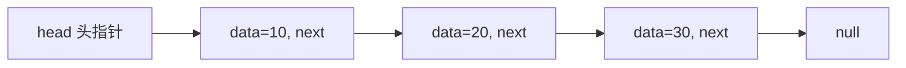

双向链表的节点多保存一个前驱引用，所以能前后移动，代价是每个节点占用更多内存：

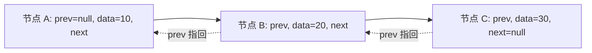

栈是“后进先出”（LIFO）的结构，只允许在栈顶放入和取出：

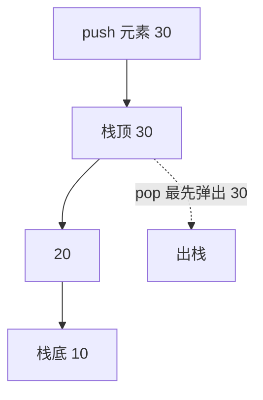

队列是“先进先出”（FIFO）的结构，从队尾进入、从队头离开：

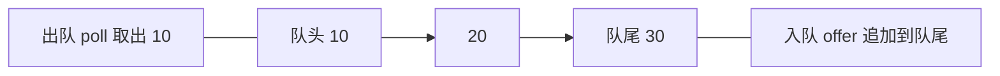

| 结构 | 访问规则 | 典型操作 | 现实类比 |
| --- | --- | --- | --- |
| 单向链表 | 只能顺序向后 | 头插、尾插、删除后继 | 单向走廊 |
| 双向链表 | 可前后移动 | 头尾增删、任意位置插入 | 双向通道 |
| 栈 | 后进先出 | `push`、`pop`、`peek` | 一摞盘子 |
| 队列 | 先进先出 | `offer`、`poll`、`peek` | 排队买票 |

### 3.2 二叉树、二叉搜索树与红黑树

二叉树中每个节点最多有两个子节点：

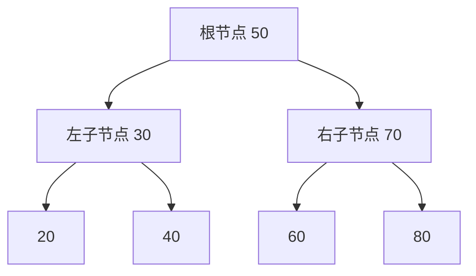

二叉搜索树（BST）在二叉树基础上增加大小约束：任意节点的左子树所有值都小于它，右子树所有值都大于它。查找时每次比较都能丢掉一半分支，这是二分查找的树形表达。

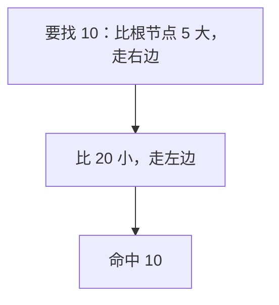

红黑树是一种自平衡的二叉搜索树，通过染色和旋转把树高控制在 O(log n)，必须满足：每个节点是红或黑；根节点是黑；红色节点的子节点必须是黑；从任意节点到其所有叶子路径上的黑色节点数量相同。

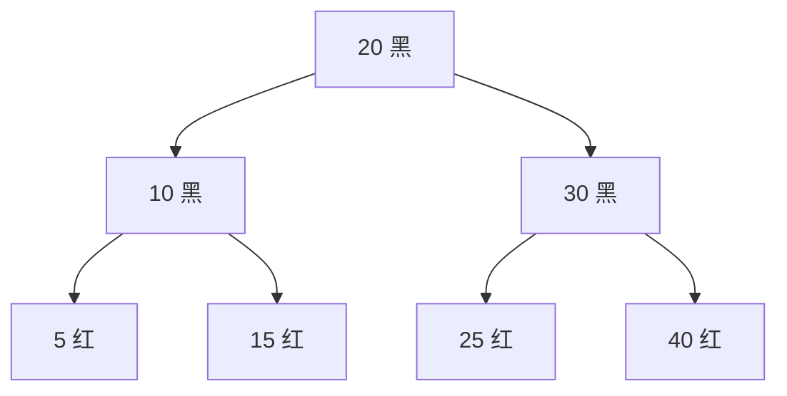

为什么需要红黑树：普通二叉搜索树在插入有序数据时会退化成链表，查找变成 O(n)；红黑树用少量旋转代价换来接近平衡的高度，因此 `TreeMap`、`TreeSet` 以及 `HashMap` 的桶都用它。

| 结构 | 查找 | 插入 | 特点 |
| --- | --- | --- | --- |
| 二叉树 | 不确定 | 不确定 | 只有形状约束，没有大小规则 |
| 二叉搜索树 | 平均 O(log n)，最坏 O(n) | 平均 O(log n) | 有序数据下会退化成链表 |
| 红黑树 | O(log n) | O(log n) | 自平衡，旋转次数少，库实现常用 |

### 3.3 用集合类实现这些结构

初学不需要自己写链表和树，先会用现成类：

```java
import java.util.Deque;
import java.util.LinkedList;
import java.util.PriorityQueue;
import java.util.Queue;

Deque<String> stack = new LinkedList<>();
stack.push("第一");
stack.push("第二");
System.out.println(stack.pop());

Queue<String> queue = new LinkedList<>();
queue.offer("第一");
queue.offer("第二");
System.out.println(queue.poll());

Queue<Integer> priority = new PriorityQueue<>();
priority.offer(3);
priority.offer(1);
System.out.println(priority.poll());
```

`Deque` 的 `push` 和 `pop` 作用于同一端，所以能当栈；`offer` 加到队尾、`poll` 从队头取出，所以能当队列。`PriorityQueue` 内部是二叉堆，只保证队头是最小元素，不保证整体有序。

## 4. 泛型

### 4.1 为什么需要泛型

泛型把类型检查提前到编译阶段：

```java
import java.util.ArrayList;
import java.util.List;

List<String> names = new ArrayList<>();
names.add("小明");
String first = names.get(0);
```

没有泛型时集合只能存 `Object`，取出必须强转，类型错误要等到运行时才暴露。泛型同时消除了强制类型转换，让代码意图更清晰。

### 4.2 泛型类、泛型方法、泛型接口

```java
public class Box<T> {
    private T value;

    public void set(T value) {
        this.value = value;
    }

    public T get() {
        return value;
    }
}
```

```java
public static <T extends Comparable<T>> T maxOf(T a, T b) {
    return a.compareTo(b) >= 0 ? a : b;
}
```

```java
public interface Repository<T> {
    void save(T entity);

    T findById(long id);
}
```

`<T extends Comparable<T>>` 叫类型参数的限定，表示传入的类型必须可比较，方法体内才能安全调用 `compareTo`。

### 4.3 类型擦除

泛型只在编译期有效，编译后类型参数被擦除成它的上界（没有限定就是 `Object`），并在需要的地方自动插入强制转换。因此运行时看不到泛型信息：

- `List<String>` 和 `List<Integer>` 运行时都是 `List`，不能重载 `m1(List<String>)` 与 `m1(List<Integer>)`。
- 不能写 `new T[10]` 或 `new T()`。
- 不能写 `obj instanceof List<String>`，只能判断 `obj instanceof List`。
- 静态字段不能声明为类型参数类型。

### 4.4 通配符与 PECS 原则

| 写法 | 含义 | 读取结果 | 能否写入 | 适用场景 |
| --- | --- | --- | --- | --- |
| `List<?>` | 任意类型 | 只能读成 `Object` | 不能（`null` 除外） | 只关心元素个数 |
| `List<? extends Number>` | 上界通配符 | 可以读成 `Number` | 不能（`null` 除外） | 生产者，只取数据 |
| `List<? super Integer>` | 下界通配符 | 只能读成 `Object` | 可以写入 `Integer` 及其子类 | 消费者，只放数据 |

`? extends T` 适合读取某种 `T` 子类型，`? super T` 适合写入 `T` 或其子类型。记忆规则：生产者使用 `extends`，消费者使用 `super`（PECS）。

```java
import java.util.ArrayList;
import java.util.List;

public class WildcardDemo {
    public static double sum(List<? extends Number> numbers) {
        double total = 0;
        for (Number number : numbers) {
            total += number.doubleValue();
        }
        return total;
    }

    public static void addIntegers(List<? super Integer> target) {
        target.add(1);
        target.add(2);
    }

    public static void main(String[] args) {
        System.out.println(sum(new ArrayList<>(List.of(1, 2, 3))));
        List<Number> numbers = new ArrayList<>();
        addIntegers(numbers);
        System.out.println(numbers);
    }
}
```

`sum` 不能往 `numbers` 里 `add`，因为编译器无法确定它实际是 `List<Integer>` 还是 `List<Double>`；`addIntegers` 读元素只能得到 `Object`，因为实参可能是 `List<Object>`。

## 5. 集合体系总览

### 5.1 Collection 与 Map 两条继承链

集合框架有两棵独立的树：`Collection` 存放单个元素，`Map` 存放键值对，`Map` 不是 `Collection` 的子接口。

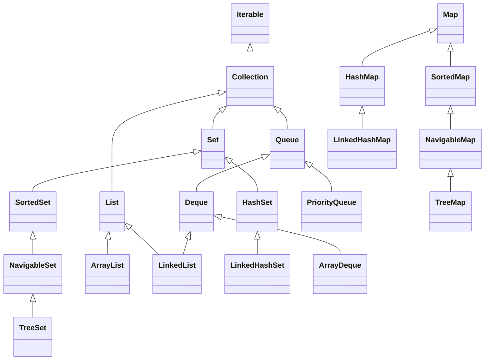

`Iterable` 提供 `iterator()`，因此所有 `Collection` 实现都能用增强 for 遍历；`Map` 本身不能直接增强 for，需要转成 `keySet()`、`values()` 或 `entrySet()`。

### 5.2 List、Set、Queue 的区别

| 接口 | 是否有序 | 是否可重复 | 是否有索引 | 能否存 null | 典型实现 |
| --- | --- | --- | --- | --- | --- |
| `List` | 有序，保留插入顺序 | 可重复 | 有 | 可以 | `ArrayList`、`LinkedList` |
| `Set` | `HashSet` 无序，`LinkedHashSet` 保留插入顺序，`TreeSet` 按排序 | 不可重复 | 无 | 可以（`TreeSet` 除外） | `HashSet`、`LinkedHashSet`、`TreeSet` |
| `Queue` | 按出队规则有序 | 可重复 | 无 | `LinkedList` 可以 | `LinkedList`、`ArrayDeque`、`PriorityQueue` |
| `Map` | 键不可重复，值可重复 | 键唯一 | 无，按键查找 | `HashMap` 允许一个 null 键 | `HashMap`、`LinkedHashMap`、`TreeMap` |

### 5.3 集合选型的三个问题

选择集合时先问三个问题：是否允许重复、是否需要保持顺序、是否需要按键查找。

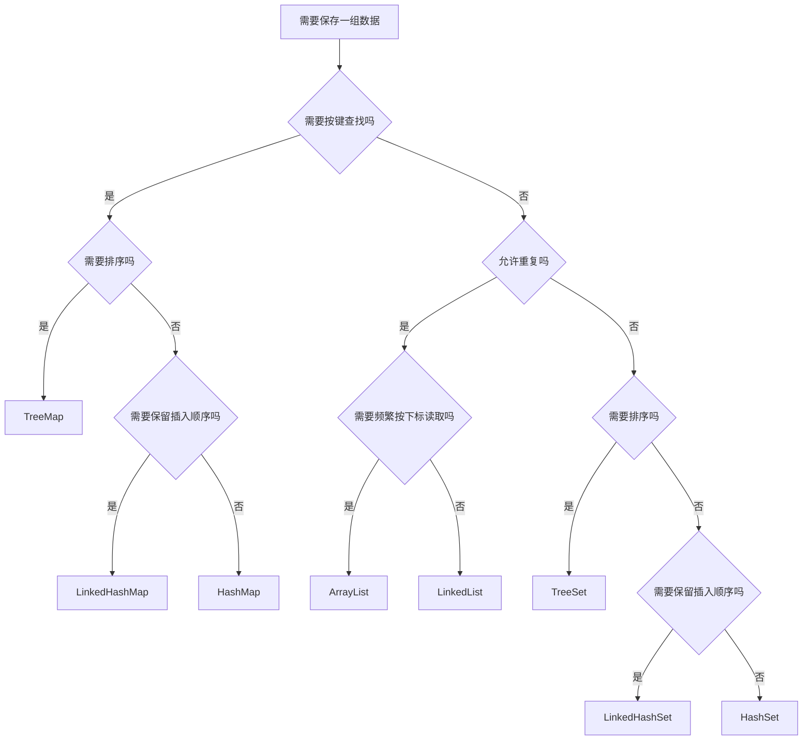

## 6. List 家族：ArrayList 与 LinkedList

`List` 有序、可重复并支持索引。`ArrayList` 随机访问快，尾部添加通常快；`LinkedList` 首尾操作方便，但按索引访问较慢。

### 6.1 ArrayList 的底层结构

`ArrayList` 内部就是一个可扩容的数组。默认容量是 10，首次添加元素时才真正分配；容量不够时按 1.5 倍扩容，即 `newCapacity = oldCapacity + (oldCapacity >> 1)`，然后把旧数组复制到新数组。

```java
import java.util.ArrayList;
import java.util.List;

List<String> names = new ArrayList<>(100);
names.add("小明");
names.add("小红");
names.add(1, "阿强");
names.set(0, "小刚");
names.remove("小红");
System.out.println(names.get(1) + " " + names.size());
```

`add(index, element)` 需要把该位置之后的元素整体后移，因此中间插入是 O(n)。扩容有数组复制开销，如果能预估数量，可以像上面那样构造时直接给出初始容量。

### 6.2 LinkedList 的底层结构

`LinkedList` 内部是双向链表，每个节点保存前驱、后继和元素三部分。它同时实现了 `List` 和 `Deque`，既能按下标访问，也能当栈或队列使用。

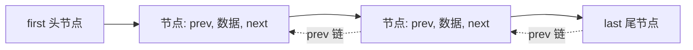

头尾增删只需改动几个引用，是 O(1)；按下标查找要先从头或尾走一遍，是 O(n)。

```java
import java.util.Deque;
import java.util.LinkedList;

Deque<String> deque = new LinkedList<>();
deque.addFirst("前");
deque.addLast("后");
System.out.println(deque.getFirst() + " " + deque.removeLast());
```

### 6.3 两者对比与选型

| 对比项 | ArrayList | LinkedList |
| --- | --- | --- |
| 底层结构 | 动态数组 | 双向链表 |
| 内存布局 | 连续内存，元素紧邻 | 节点分散，每个节点额外存两个引用 |
| 默认容量 | 10，首次添加时分配 | 无容量概念 |
| 扩容方式 | 1.5 倍扩容并复制数组 | 不需要扩容 |
| 按索引随机访问 | O(1) | O(n) |
| 尾部添加 | 均摊 O(1)，扩容时 O(n) | O(1) |
| 中间插入删除 | O(n)，需要移动元素 | 找到位置 O(n)，改引用 O(1) |
| 头部插入删除 | O(n) | O(1) |
| 内存开销 | 较小，可能有预留空位 | 较大，每节点多两个引用 |
| 推荐场景 | 查多改少、主要按下标访问 | 频繁头尾增删、需要当栈或队列 |

结论很直接：绝大多数情况先选 `ArrayList`，只有确实频繁在两端增删时才考虑 `LinkedList`。只在中间插入少量元素时，`LinkedList` 的查找成本通常已经抵消了改引用的优势。

## 7. Set 家族与哈希表

`Set` 不允许重复元素。`HashSet` 不保证顺序，`LinkedHashSet` 保留插入顺序，`TreeSet` 按排序规则保存元素。自定义对象放入哈希集合时，必须正确重写 `equals` 和 `hashCode`。

| 实现类 | 底层结构 | 顺序 | 允许 null | 元素要求 | 查找性能 |
| --- | --- | --- | --- | --- | --- |
| `HashSet` | 哈希表 | 不保证 | 允许一个 | 正确重写 `equals` 与 `hashCode` | 平均 O(1) |
| `LinkedHashSet` | 哈希表加双向链表 | 保留插入顺序 | 允许一个 | 同上 | 平均 O(1) |
| `TreeSet` | 红黑树 | 按比较规则升序 | 不允许（自然排序时） | 实现 `Comparable` 或传入 `Comparator` | O(log n) |

```java
import java.util.HashSet;
import java.util.LinkedHashSet;
import java.util.Set;

Set<String> hash = new HashSet<>();
System.out.println(hash.add("小明"));
System.out.println(hash.add("小明"));
System.out.println(hash.size());

Set<String> linked = new LinkedHashSet<>();
linked.add("c");
linked.add("a");
System.out.println(linked);
```

`add` 返回 `boolean` 表示这次是否真的新增成功，第二次添加相同元素返回 `false`，集合大小不变。

### 7.1 哈希表的结构

`HashSet` 和 `HashMap` 的底层是同一套哈希表实现。JDK 8 之后的结构是“数组 + 链表 + 红黑树”：

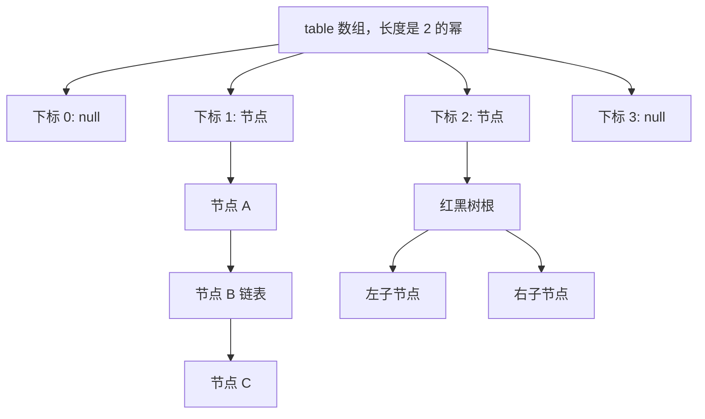

数组每个位置叫一个桶。元素先算哈希值，再对数组长度取模得到桶下标；哈希值不同但下标相同的元素落在同一个桶里用链表串起来，链表过长就转成红黑树，把最坏查找从 O(n) 降到 O(log n)。

### 7.2 hash 扰动函数的作用

如果只用 `key.hashCode()` 的低位定位桶，高位信息就浪费了。`HashMap` 会再加工一次：

```java
static final int hash(Object key) {
    int h;
    return (key == null) ? 0 : (h = key.hashCode()) ^ (h >>> 16);
}
```

它把哈希值的高 16 位异或到低 16 位，让高位也参与桶下标计算，减少不同 key 撞进同一个桶的概率。桶下标用 `(n - 1) & hash` 计算，只有在数组长度是 2 的幂时，这个与运算才等价于取模。

### 7.3 put 的完整流程

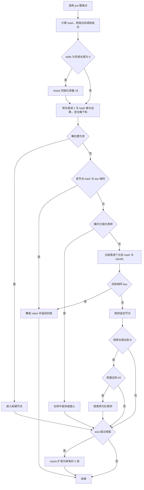

流程里有两个比较只走 hash 不走 `equals`：先比 hash 是为了快速排除，hash 相同时才调用 `equals` 做真正判断。这也是为什么重写 `equals` 必须同时重写 `hashCode`，否则两个“相等”的对象会算出不同 hash，被放进不同的桶。

```java
import java.util.HashMap;
import java.util.Map;

Map<String, Integer> scores = new HashMap<>();
System.out.println(scores.put("语文", 90));
System.out.println(scores.put("语文", 95));
System.out.println(scores.get("语文"));
```

`put` 返回被覆盖的旧值，第一次返回 `null`，第二次返回 `90`，而 `get` 拿到的是最新的 `95`。

### 7.4 扩容与树化阈值

| 参数 | 默认值 | 含义 |
| --- | --- | --- |
| 默认容量 `DEFAULT_INITIAL_CAPACITY` | 16 | 数组初始长度，必须是 2 的幂 |
| 负载因子 `DEFAULT_LOAD_FACTOR` | 0.75 | 元素数量与容量的比值上限 |
| 扩容阈值 `threshold` | 容量乘 0.75，初始为 12 | `size` 超过它就扩容 |
| 扩容倍数 | 2 倍 | 长度翻倍，重新分配桶下标 |
| 链表转红黑树阈值 `TREEIFY_THRESHOLD` | 8 | 单个桶链表长度达到 8 时可能树化 |
| 红黑树转链表阈值 `UNTREEIFY_THRESHOLD` | 6 | 树中节点减少到 6 时退化回链表 |
| 最小树化容量 `MIN_TREEIFY_CAPACITY` | 64 | 容量不足 64 时优先扩容而不是树化 |

负载因子取 0.75 是空间与时间的折中：太小会频繁扩容浪费内存，太大则链表变长、查询变慢。树化阈值 8 与退化阈值 6 之间留出缓冲区，避免元素数量在 7 和 8 之间反复转换结构。扩容之所以是 2 倍，是因为长度从 2 的幂变成 2 的幂后，`(n - 1) & hash` 的结果只可能落在原桶或“原桶加旧容量”两个位置，迁移成本更低。

### 7.5 equals 与 hashCode 的配合

```java
import java.util.Objects;

public class StudentKey {
    private final String id;

    public StudentKey(String id) {
        this.id = id;
    }

    @Override
    public boolean equals(Object o) {
        if (this == o) {
            return true;
        }
        if (!(o instanceof StudentKey)) {
            return false;
        }
        return Objects.equals(id, ((StudentKey) o).id);
    }

    @Override
    public int hashCode() {
        return Objects.hash(id);
    }
}
```

规则是：`equals` 为真的两个对象，`hashCode` 必须相同；`hashCode` 相同的两个对象，`equals` 不一定为真，这叫哈希冲突，是允许的。

### 7.6 TreeSet 的排序：Comparable 与 Comparator

`TreeSet` 用比较结果判断“是否重复”，`compareTo` 或 `compare` 返回 0 就视为同一元素。

| 对比项 | `Comparable` | `Comparator` |
| --- | --- | --- |
| 所在包 | `java.lang` | `java.util` |
| 方法 | `int compareTo(T o)` | `int compare(T o1, T o2)` |
| 实现位置 | 元素类自己实现 | 独立类或 Lambda，从集合外部传入 |
| 排序规则 | 自然排序，只有一种 | 定制排序，可定义多种 |
| 使用方式 | `new TreeSet<>()` | `new TreeSet<>(comparator)` |
| 是否修改元素类 | 需要 | 不需要 |
| 返回值含义 | 负数小于，0 相等，正数大于 | 同上 |

```java
import java.util.Comparator;
import java.util.Set;
import java.util.TreeSet;

Set<String> natural = new TreeSet<>();
natural.add("banana");
natural.add("apple");
System.out.println(natural);

Set<String> byLength = new TreeSet<>(Comparator.comparingInt(String::length));
byLength.add("banana");
byLength.add("apple");
byLength.add("cherry");
System.out.println(byLength);
```

`byLength` 里三个单词长度分别是 6、5、6，所以 `apple` 被保留，两个长度为 6 的单词只留下一个，这是用 `Comparator` 时最容易踩的坑。用 `Comparator.comparing(...)` 后可以链式追加 `thenComparing(...)` 补充比较条件。

`compareTo` 与 `equals` 不一致时会有明确后果：

- `TreeSet` 认为元素重复，直接丢弃，即使 `equals` 返回 `false`。
- `HashSet` 只认 `equals` 和 `hashCode`，与 `compareTo` 无关。
- 同一个元素在两个集合里的“重复判定”结论可能不同，跨集合操作结果难以预期。

## 8. Map 家族

`Map` 以键值对保存数据，键不能重复：

```java
import java.util.HashMap;
import java.util.Map;

Map<String, Integer> scores = new HashMap<>();
scores.put("语文", 90);
scores.put("数学", 95);
scores.forEach((subject, score) ->
    System.out.println(subject + ": " + score));
```

`HashMap` 通常提供快速查找，`LinkedHashMap` 保留插入顺序，`TreeMap` 按键排序。使用 `getOrDefault`、`containsKey` 和 `computeIfAbsent` 可以减少空值判断。

| 实现类 | 底层结构 | 键的顺序 | 允许 null 键 | 查找性能 |
| --- | --- | --- | --- | --- |
| `HashMap` | 哈希表 | 不保证 | 允许一个 | 平均 O(1) |
| `LinkedHashMap` | 哈希表加双向链表 | 保留插入顺序 | 允许一个 | 平均 O(1) |
| `TreeMap` | 红黑树 | 按键排序 | 自然排序时不支持 | O(log n) |

### 8.1 常用方法

| 方法 | 作用 |
| --- | --- |
| `put(key, value)` | 新增或覆盖，返回被覆盖的旧值 |
| `get(key)` | 按键取值，不存在返回 `null` |
| `getOrDefault(key, defaultValue)` | 按键取值，不存在返回默认值 |
| `putIfAbsent(key, value)` | 键不存在时才放入 |
| `computeIfAbsent(key, mappingFunction)` | 键不存在时用函数算出一个值放进去 |
| `containsKey(key)` | 判断键是否存在 |
| `remove(key)` | 按键删除，返回被删除的值 |
| `size()` | 键值对个数 |
| `keySet()` | 返回所有键的 `Set` 视图 |
| `values()` | 返回所有值的 `Collection` 视图 |
| `entrySet()` | 返回所有键值对的 `Set` 视图 |

```java
import java.util.ArrayList;
import java.util.HashMap;
import java.util.List;
import java.util.Map;

Map<String, Integer> scores = new HashMap<>();
scores.put("语文", 90);
scores.putIfAbsent("语文", 100);
System.out.println(scores.get("语文") + " " + scores.getOrDefault("英语", 0));
System.out.println(scores.containsKey("数学") + " " + scores.size());

Map<String, List<String>> groups = new HashMap<>();
groups.computeIfAbsent("一班", key -> new ArrayList<>()).add("小明");
System.out.println(groups);
```

`putIfAbsent("语文", 100)` 不会覆盖已有的 90，输出的还是 90。`computeIfAbsent` 一行完成“先判断再初始化”，特别适合构建一对多结构。

### 8.2 三种遍历方式与性能差异

```java
import java.util.HashMap;
import java.util.Map;

Map<String, Integer> scores = new HashMap<>();
scores.put("语文", 90);
scores.put("数学", 95);

for (String key : scores.keySet()) {
    System.out.println(key + " -> " + scores.get(key));
}

for (Map.Entry<String, Integer> entry : scores.entrySet()) {
    System.out.println(entry.getKey() + " -> " + entry.getValue());
}

for (Integer value : scores.values()) {
    System.out.println(value);
}

scores.forEach((key, value) -> System.out.println(key + " -> " + value));
```

| 遍历方式 | 拿到什么 | 是否需要二次查找 | 适用场景 |
| --- | --- | --- | --- |
| `keySet()` 加 `get` | 键 | 需要，每个键查一次值 | 只关心键，或键的数量很少 |
| `entrySet()` | 键和值 | 不需要 | 同时需要键和值，最常用 |
| `values()` | 只有值 | 不需要 | 只统计或打印值 |
| `forEach` | 键和值 | 不需要 | 简单遍历，配合 Lambda 写法简洁 |

`keySet` 加 `get` 的循环里每次 `get` 都要重新算 hash 定位桶，复杂度比 `entrySet` 高，数据量大时应优先用 `entrySet`。`keySet`、`values`、`entrySet` 返回的都是视图而不是副本，遍历过程中调用 `Map` 的增删方法同样会触发 `ConcurrentModificationException`。

## 9. 集合遍历与 Iterator

### 9.1 Iterator 的三个方法

`Iterator` 是集合统一的遍历器，`hasNext()` 判断后面还有没有元素，`next()` 取出下一个元素并把指针后移，`remove()` 删除刚才 `next()` 返回的元素。

```java
import java.util.ArrayList;
import java.util.Iterator;
import java.util.List;

List<String> names = new ArrayList<>(List.of("小明", "小红", "阿强"));
Iterator<String> iterator = names.iterator();
while (iterator.hasNext()) {
    if (iterator.next().equals("小红")) {
        iterator.remove();
    }
}
System.out.println(names);
```

### 9.2 增强 for 的本质就是迭代器

增强 for 只是 `Iterator` 的语法糖，编译器会把它展开成 `while (iterator.hasNext())`。因此它有两个限制：不能在遍历中调用集合自己的增删方法，也拿不到下标。

```java
for (String name : names) {
    System.out.println(name);
}
names.forEach(System.out::println);
```

### 9.3 ListIterator 的双向遍历与修改

`List` 额外提供 `listIterator()`，它的光标可以在元素之间前后移动，还支持在遍历中安全地添加和修改：

| 方法 | 作用 |
| --- | --- |
| `hasNext()` / `next()` | 向后遍历 |
| `hasPrevious()` / `previous()` | 向前遍历 |
| `nextIndex()` / `previousIndex()` | 返回下一次调用 `next` 或 `previous` 的下标 |
| `add(element)` | 在光标位置插入元素 |
| `set(element)` | 替换刚才返回的元素 |
| `remove()` | 删除刚才返回的元素 |

```java
import java.util.ArrayList;
import java.util.List;
import java.util.ListIterator;

List<String> names = new ArrayList<>(List.of("A", "B", "C"));
ListIterator<String> iterator = names.listIterator(names.size());
while (iterator.hasPrevious()) {
    System.out.print(iterator.previous());
}
System.out.println();

while (iterator.hasNext()) {
    if (iterator.next().equals("B")) {
        iterator.set("B2");
        iterator.add("NEW");
    }
}
System.out.println(names);
```

`add` 插在光标之前，`next` 之后调用 `set` 修改的是刚返回的元素，这两个方法都会同步迭代器内部的修改计数，所以不会报错。

### 9.4 ConcurrentModificationException 的成因

集合内部有一个 `modCount` 记录结构被修改的次数，迭代器创建时保存一份 `expectedModCount`，每次 `next()` 都检查两者是否相等，不等就抛 `ConcurrentModificationException`。

```java
import java.util.ArrayList;
import java.util.List;

List<String> names = new ArrayList<>(List.of("小明", "小红"));
for (String name : names) {
    if (name.equals("小红")) {
        names.remove(name);
    }
}
```

上面这段代码会抛异常：`names.remove` 走的是集合自己的方法，只增加了 `modCount`，没有更新迭代器的 `expectedModCount`。正确的两种做法是：

```java
import java.util.ArrayList;
import java.util.Iterator;
import java.util.List;

List<String> names = new ArrayList<>(List.of("小明", "小红"));

Iterator<String> iterator = names.iterator();
while (iterator.hasNext()) {
    if (iterator.next().equals("小红")) {
        iterator.remove();
    }
}

names.removeIf(name -> name.equals("小红"));
```

`removeIf` 是 `Collection` 的默认方法，内部处理好了修改计数，是按条件删除的首选写法。这个异常的名字容易让人误解成多线程问题，其实单线程照样会触发。

### 9.5 四种遍历方式对比

| 遍历方式 | 能否拿到下标 | 能否边遍历边删 | 适用场景 |
| --- | --- | --- | --- |
| 普通 for | 能 | 能，但删除后要手动修正下标 | 需要下标、需要倒序 |
| 增强 for | 不能 | 不能，会抛 `ConcurrentModificationException` | 只读遍历，写法最简洁 |
| `Iterator` | 不能 | 能，用 `iterator.remove()` | 需要在遍历中安全删除 |
| `forEach` | 不能 | 不能 | 一行搞定简单遍历 |

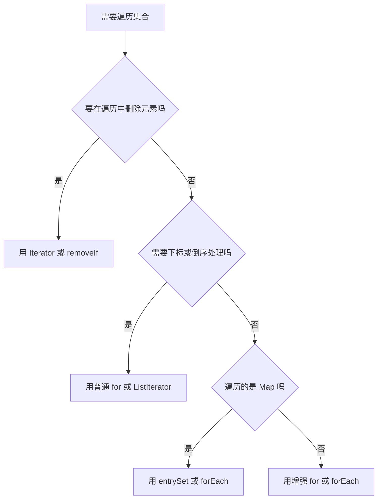

## 10. Collections 工具类

`Collections` 是针对集合的工具类，方法都是静态的，与操作数组的 `Arrays` 对应。

| 方法 | 用法说明 |
| --- | --- |
| `sort(list)` | 按自然顺序排序，可再传一个 `Comparator` 定制排序 |
| `reverse(list)` | 反转列表元素顺序 |
| `shuffle(list)` | 随机打乱顺序，常用于抽奖和洗牌 |
| `max(collection)` | 按自然顺序取最大值，可传比较器 |
| `min(collection)` | 按自然顺序取最小值，可传比较器 |
| `binarySearch(list, key)` | 二分查找，前提是列表已按同样规则排好序 |
| `swap(list, i, j)` | 交换两个下标位置的元素 |
| `synchronizedList(list)` | 返回线程安全的包装列表，适用于多线程共享 |
| `unmodifiableList(list)` | 返回只读包装，修改会抛 `UnsupportedOperationException` |

```java
import java.util.ArrayList;
import java.util.Collections;
import java.util.List;

List<Integer> numbers = new ArrayList<>(List.of(3, 1, 4, 1, 5));
Collections.sort(numbers);
System.out.println(Collections.binarySearch(numbers, 4));
System.out.println(Collections.max(numbers) + " " + Collections.min(numbers));
System.out.println(Collections.frequency(numbers, 1));
Collections.swap(numbers, 0, 1);
Collections.reverse(numbers);
Collections.shuffle(numbers);

List<Integer> readOnly = Collections.unmodifiableList(numbers);
List<Integer> safe = Collections.synchronizedList(numbers);
System.out.println(readOnly.size() + safe.size());
```

`synchronizedList` 的包装只保证单个方法调用是原子的，遍历时仍然要自己加锁，这一点后面学多线程时会展开。

## 11. 可变参数

可变参数的写法是在参数类型后加三个点，例如 `int... nums`。它让方法可以接收任意个同类型参数，不用先手动组装数组。

```java
public static int sum(int first, int... rest) {
    int total = first;
    for (int value : rest) {
        total += value;
    }
    return total;
}
```

调用时三种写法都合法：

```java
sum(1);
sum(1, 2, 3);
sum(1, new int[]{2, 3});
```

要点如下：

- 编译后 `int... nums` 就是 `int[] nums`，本质是数组。
- 传数组和使用散列参数效果相同，传散列参数时编译器自动打包成数组。
- 一个方法只能有一个可变参数，且必须放在参数列表最后，否则编译器无法确定从哪个参数开始打包。
- 重载时编译器优先选择固定参数版本，避免写出让人分不清调用的重载。

`Arrays.asList` 配合可变参数有一个经典陷阱：它接收的是 `T...`，而基本类型数组不能作为 `T`：

```java
import java.util.Arrays;
import java.util.List;

int[] array = {1, 2, 3};
List<int[]> wrong = Arrays.asList(array);
System.out.println(wrong.size());

Integer[] boxed = {1, 2, 3};
List<Integer> right = Arrays.asList(boxed);
System.out.println(right);
```

`wrong` 的长度是 1，唯一元素是那个数组；用 `Integer[]` 才会得到长度为 3 的列表。另外 `Arrays.asList` 返回的是固定长度列表，`add` 和 `remove` 会抛 `UnsupportedOperationException`，`set` 可以修改元素，因为它直接写回原数组。

## 12. Lambda 与函数式接口

### 12.1 函数式接口

Lambda 只能赋值给函数式接口，即只有一个抽象方法的接口：

```java
import java.util.function.Predicate;

Predicate<Integer> positive = value -> value > 0;
System.out.println(positive.test(3));
```

常用函数式接口：`Predicate<T>` 返回布尔值，`Consumer<T>` 消费数据，`Function<T,R>` 转换数据，`Supplier<T>` 提供数据。

| 接口 | 抽象方法 | 输入 | 输出 | 典型用途 |
| --- | --- | --- | --- | --- |
| `Predicate<T>` | `test(T)` | `T` | `boolean` | 过滤条件 |
| `Consumer<T>` | `accept(T)` | `T` | 无 | 打印、累加、保存 |
| `Function<T,R>` | `apply(T)` | `T` | `R` | 对象转换 |
| `Supplier<T>` | `get()` | 无 | `T` | 延迟创建对象 |

接口上可以加 `@FunctionalInterface` 注解，编译器会检查它确实只有一个抽象方法。

```java
@FunctionalInterface
public interface Calculator {
    int calculate(int a, int b);
}
```

### 12.2 Lambda 的语法与省略规则

完整语法是 `(参数列表) -> { 方法体 }`。以下三种省略都是合法的：

- 参数类型可以省略，编译器从函数式接口推断。
- 只有一个参数时，参数外的小括号可以省略。
- 方法体只有一条语句时，大括号和 `return` 可以一起省略。

```java
Calculator add = (a, b) -> a + b;
Calculator maxOf = (a, b) -> {
    return Math.max(a, b);
};
Consumer<String> printer = System.out::println;
```

有返回值时要注意：要么写成单表达式省略 `return`，要么保留大括号并写 `return`，不能只写大括号不写 `return`。

### 12.3 Lambda 与匿名内部类的区别

| 对比项 | Lambda 表达式 | 匿名内部类 |
| --- | --- | --- |
| 依赖 | 必须是函数式接口 | 可以是任意接口或抽象类 |
| `this` 指向 | 外层所在对象 | 匿名内部类自身 |
| 编译产物 | 使用 `invokedynamic`，不生成独立类文件 | 生成 `外部类$1.class` 这样的类文件 |
| 能否声明字段 | 不能 | 能 |
| 能否重写多个方法 | 不能 | 能 |
| 写法 | 简洁 | 冗长 |

```java
public class LambdaScopeDemo {
    private String name = "外部对象";

    public void demo() {
        Runnable lambda = () -> System.out.println("lambda: " + this.name);
        Runnable anonymous = new Runnable() {
            private String name = "匿名内部类";

            @Override
            public void run() {
                System.out.println("anonymous: " + this.name);
            }
        };
        lambda.run();
        anonymous.run();
    }
}
```

这段代码输出的是 `lambda: 外部对象` 和 `anonymous: 匿名内部类`。需要操作外层对象时 Lambda 更自然；需要多个方法或自己的状态时只能写匿名内部类。另外 Lambda 捕获的局部变量必须是事实上不可变的，即赋值一次后不再改变。

## 13. 不可变集合

不可变集合创建后不能增删改，适合保存不会变化的配置或常量：

```java
import java.util.List;
import java.util.Map;
import java.util.Set;

List<String> levels = List.of("低", "中", "高");
Set<String> roles = Set.of("管理员", "普通用户");
Map<String, Integer> limits = Map.of("低", 1, "中", 5);
```

调用修改方法会抛出 `UnsupportedOperationException`。需要修改时复制一份可变集合。

```java
import java.util.ArrayList;
import java.util.List;

List<String> levels = List.of("低", "中", "高");
List<String> editable = new ArrayList<>(levels);
editable.add("极高");
```

`List.of` 不接受 `null` 元素，`Set.of` 和 `Map.of` 也不接受重复的键，传入重复值会在创建时就抛 `IllegalArgumentException`。

| 创建方式 | 能否含 null | 是否真正不可变 | 备注 |
| --- | --- | --- | --- |
| `List.of` | 不能 | 是 | JDK 9 起提供 |
| `Set.of` | 不能 | 是 | 不允许重复元素 |
| `Map.of` | 键值都不能为 null | 是 | 最多 10 组键值，超出用 `Map.ofEntries` |
| `Collections.unmodifiableList` | 可以 | 否，是只读视图 | 原集合变动会反映到视图 |

## 14. 小白易错点

- `Arrays.asList` 返回的不是 `ArrayList`，调用 `add` 会抛 `UnsupportedOperationException`。
- 把基本类型数组传进 `Arrays.asList`，得到长度 1 的列表。
- 重写 `equals` 忘记重写 `hashCode`，导致 `HashSet` 里出现“看起来重复”的两个对象。
- 用可变对象当 `HashMap` 的键，改内容后算出的 hash 变了，就再也 `get` 不到了。
- `TreeSet` 用 `Comparator` 只比较一个字段，该字段相同的不同对象会被当成重复元素丢弃。
- 自定义对象做 `TreeSet` 元素但没实现 `Comparable` 也没传 `Comparator`，运行时抛 `ClassCastException`。
- 增强 for 中调用集合的 `remove`，抛 `ConcurrentModificationException`，应改用 `Iterator.remove()` 或 `removeIf`。
- 遍历 `Map` 用 `keySet()` 再 `get()`，比 `entrySet()` 多做一次查找。
- `List.of` 返回的集合不能 `add`，也不能存 `null`。
- 把 `? extends T` 当成可读可写，写 `list.add(x)` 编译直接报错。
- 可变参数没放在参数列表最后，编译不通过。
- Lambda 里修改外层局部变量，编译报错，因为捕获的变量必须事实上不可变。

## 15. 练习清单

1. 用二分查找在有序数组中查找目标值，并打印查找次数。
2. 分别用 `ArrayList` 和 `LinkedList` 完成 10 万次头部插入，比较耗时并解释差异。
3. 定义 `Student` 类，正确重写 `equals` 与 `hashCode`，放进 `HashSet` 验证重复元素被过滤。
4. 让 `Student` 实现 `Comparable`，再写一个按姓名长度排序的 `Comparator`，分别在 `TreeSet` 中验证。
5. 用三种方式遍历同一个 `Map`，统计每种方式在 10 万条数据下的耗时。
6. 用 `Iterator` 删除集合中所有长度小于 2 的字符串，再用 `removeIf` 重写一遍。
7. 用 `Collections` 的 `sort`、`max`、`min`、`binarySearch`、`swap` 处理一组整数。
8. 写一个 `sum(int first, int... rest)` 方法，分别用三种调用方式测试。
9. 写泛型方法 `swap(List<T> list, int i, int j)`，再写一个接收 `List<? extends Number>` 的求和方法。
10. 用 `List.of` 创建不可变集合，尝试修改并观察异常，再复制成 `ArrayList` 完成修改。
11. 定义一个函数式接口，分别用匿名内部类和 Lambda 实现，打印 `this` 观察差异。
12. 画一遍 `HashMap` 的 `put` 流程，并在代码里打印 `size` 和 `keySet` 观察扩容前后的变化。

## 16. 资料对应关系

- 《Java 基础笔记》：第十二章“数据结构与集合”、第十三章“泛型与 Lambda”。
- 第 03 篇：提供 `equals` 与 `hashCode` 的重写规范，是哈希集合正确性的前提。
- 第 04 篇：提供包装类与自动装箱，解释为什么集合不能用基本类型。
- 第 06 篇：在集合之上继续讲解 Stream 流式处理与方法引用。
- 第 09 篇：反射与动态代理会再次遇到泛型擦除带来的限制。

## 17. 总结

选择集合时先问三个问题：是否允许重复、是否需要保持顺序、是否需要按键查找。先掌握接口语义，再了解 `ArrayList`、`HashSet` 和 `HashMap` 的实现差异。查多改少选 `ArrayList`，需要有序去重选 `TreeSet`，需要按键快速查找选 `HashMap`；泛型把类型错误提前到编译期，Lambda 则把“一段行为”当成参数传递。
