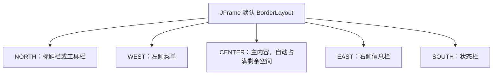
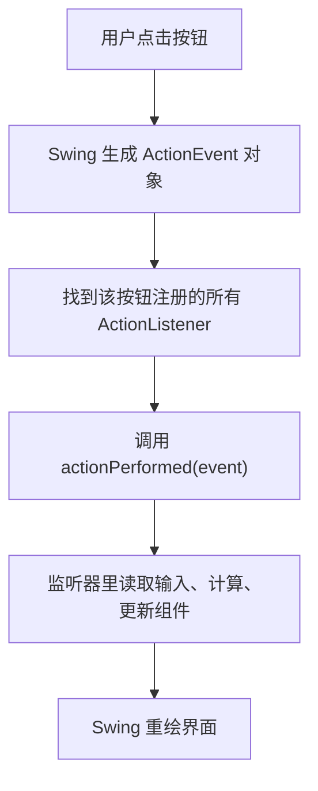
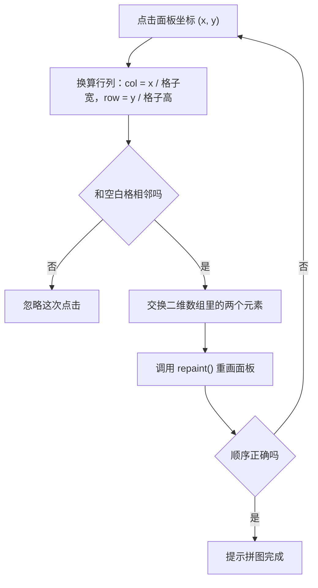
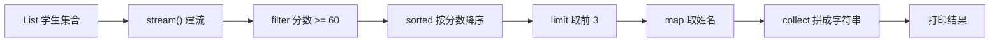

# GUI 与 Stream 函数式编程

本篇整理原笔记第十四至十六章。GUI 是可选拓展，Stream 和方法引用则是集合之后最常用的数据处理工具：前者帮你理解桌面程序的界面、布局与事件是怎么串起来的，后者让你把“筛选、转换、统计”写成一条链式流水线。

## 1. 学习目标与前置知识

### 1.1 学习目标

| 序号 | 目标 | 对应小节 |
| --- | --- | --- |
| 1 | 能说清窗口、容器、组件三个概念的关系 | 2 |
| 2 | 能用 `JFrame` 写出一个能点击、能取输入值的窗口 | 2 |
| 3 | 能在流式、边界、网格三种布局之间选对布局 | 3 |
| 4 | 能说清事件源、事件对象、监听器三要素 | 4 |
| 5 | 能读懂拼图游戏这类小案例的代码结构 | 5 |
| 6 | 能用 Stream 完成筛选、转换、排序、统计 | 6 |
| 7 | 会写四种方法引用，并知道什么时候不该用方法引用 | 7 |

### 1.2 前置知识

| 前置内容 | 为什么需要 |
| --- | --- |
| 类与对象、继承、接口 | Swing 组件都是类，事件要靠接口或 Lambda 实现 |
| Lambda 与函数式接口 | 事件监听器和 Stream 的中间操作都用 Lambda 传行为 |
| 集合 `List`、`Map` | Stream 最常见的来源就是集合 |
| 泛型 | `List<String>`、`Collectors.toList()` 都带泛型 |

如果 Lambda 还不熟，先回到 05 篇确认下面这行能读懂再来：

```java
button.addActionListener(event -> button.setText("已点击"));
```

这行的意思不是“立刻执行 `setText`”，而是“把一段以后才执行的代码交给按钮保管，用户点一下才执行一次”。

## 2. Swing 窗口与组件

### 2.1 三个概念：窗口、容器、组件

| 概念 | 说明 | 常见类 |
| --- | --- | --- |
| 顶层容器 | 独立的操作系统窗口，是界面的根 | `JFrame`、`JDialog` |
| 中间容器 | 不能独立显示，用来分区和嵌套 | `JPanel`、`JScrollPane` |
| 组件 | 界面上可见的元素 | `JLabel`、`JButton`、`JTextField` |

关系是：`JFrame` 里放 `JPanel`，`JPanel` 里放组件。组件必须先被加进容器，再让窗口可见，才会显示出来。

### 2.2 常用组件速查

| 组件 | 作用 | 常用方法 |
| --- | --- | --- |
| `JLabel` | 显示文字或图片，不能编辑 | `setText`、`getText` |
| `JButton` | 按钮，点击触发 `ActionEvent` | `setText`、`setActionCommand` |
| `JTextField` | 单行文本输入 | `getText`、`setText` |
| `JPasswordField` | 密码输入，回显为圆点 | `getPassword` 返回 `char[]` |
| `JTextArea` | 多行文本输入，常放进 `JScrollPane` | `getText`、`append` |
| `JCheckBox` | 复选框 | `isSelected` |
| `JRadioButton` | 单选按钮，要配合 `ButtonGroup` 使用 | `isSelected` |
| `JComboBox` | 下拉框 | `getSelectedItem` |
| `JTable` | 表格 | 通过 `TableModel` 存取 |

`JPasswordField.getPassword()` 返回的是 `char[]`，不是 `String`。转成字符串只是为了比较，用完不要长期保存，避免密码在内存里留太久。

### 2.3 第一个完整窗口

```java
import javax.swing.JButton;
import javax.swing.JFrame;

public class WindowDemo {
    public static void main(String[] args) {
        JFrame frame = new JFrame("入门窗口");
        JButton button = new JButton("点击");
        button.addActionListener(event -> button.setText("已点击"));
        frame.add(button);
        frame.setSize(300, 180);
        frame.setDefaultCloseOperation(JFrame.EXIT_ON_CLOSE);
        frame.setVisible(true);
    }
}
```

每一行的作用：

| 代码 | 作用 |
| --- | --- |
| `new JFrame("入门窗口")` | 创建窗口并设置标题 |
| `new JButton("点击")` | 创建按钮，显示文字为“点击” |
| `addActionListener(...)` | 注册监听器，用户点击时执行 Lambda |
| `frame.add(button)` | 把按钮加到窗口的中间区域 |
| `setSize(300, 180)` | 设置窗口宽 300、高 180 |
| `setDefaultCloseOperation(EXIT_ON_CLOSE)` | 点右上角关闭按钮时结束程序 |
| `setVisible(true)` | 让窗口真正显示出来 |

`setDefaultCloseOperation` 必须写，否则点关闭只是隐藏窗口，程序还在后台运行；`setVisible(true)` 通常放在最后，所有组件都加完再显示。

### 2.4 一个能算数的窗口

光有按钮还没意思，下面这个窗口输入两个数，点击后显示和：

```java
import java.awt.FlowLayout;
import javax.swing.JButton;
import javax.swing.JFrame;
import javax.swing.JLabel;
import javax.swing.JTextField;

public class AddWindow {
    public static void main(String[] args) {
        JFrame frame = new JFrame("加法器");
        frame.setLayout(new FlowLayout());
        JTextField first = new JTextField(6);
        JTextField second = new JTextField(6);
        JLabel result = new JLabel("结果：");
        JButton ok = new JButton("计算");
        ok.addActionListener(event -> {
            int a = Integer.parseInt(first.getText().trim());
            int b = Integer.parseInt(second.getText().trim());
            result.setText("结果：" + (a + b));
        });
        frame.add(first);
        frame.add(new JLabel("+"));
        frame.add(second);
        frame.add(ok);
        frame.add(result);
        frame.setSize(400, 120);
        frame.setDefaultCloseOperation(JFrame.EXIT_ON_CLOSE);
        frame.setVisible(true);
    }
}
```

`Integer.parseInt` 遇到空串或非数字会抛 `NumberFormatException`，所以真实程序要在 Lambda 里加 `try-catch` 并在界面提示错误；这一篇先保持示例简短。

## 3. 布局管理器

### 3.1 为什么要布局管理器

布局管理器（layout manager）负责决定组件的摆放位置和大小。你不用写死坐标，窗口拉大拉小时组件会自动重新排列；如果不用布局管理器，就得自己算每个组件的像素位置，换个分辨率界面就乱了。

设置方式是 `frame.setLayout(new XxxLayout())`，`JFrame` 默认用边界布局，`JPanel` 默认用流式布局。

### 3.2 四种常用布局对比

| 布局 | 排列方式 | 构造写法 | 适用场景 |
| --- | --- | --- | --- |
| `FlowLayout` | 从左到右排，一行放满自动换行 | `new FlowLayout()` | 几个按钮排一排的小工具窗口 |
| `BorderLayout` | 分成东南西北中五个区域 | `new BorderLayout()` | 主界面：中间内容 + 上下工具栏 |
| `GridLayout` | 切成行列相等的格子 | `new GridLayout(2, 3)` | 计算器键盘、拼图、九宫格 |
| `GridBagLayout` | 逐格设置权重，能精细控制 | `new GridBagLayout()` | 复杂表单（初学不必深究） |

三个最常用的选择口诀：一排按钮用流式，整块界面用边界，等大方阵用网格。

### 3.3 边界布局的五个区域



`frame.add(组件)` 不写区域时默认放进 `CENTER`；`CENTER` 会被窗口缩放拉伸，其他四个区域只占自己需要的高度或宽度。

### 3.4 组合布局的例子

```java
import java.awt.BorderLayout;
import java.awt.GridLayout;
import javax.swing.JButton;
import javax.swing.JFrame;
import javax.swing.JPanel;

public class LayoutDemo {
    public static void main(String[] args) {
        JFrame frame = new JFrame("布局演示");
        frame.setLayout(new BorderLayout());
        JPanel grid = new JPanel(new GridLayout(2, 3));
        for (int i = 1; i <= 6; i++) {
            grid.add(new JButton("按钮" + i));
        }
        frame.add(new JButton("北"), BorderLayout.NORTH);
        frame.add(new JButton("南"), BorderLayout.SOUTH);
        frame.add(grid, BorderLayout.CENTER);
        frame.setSize(400, 220);
        frame.setDefaultCloseOperation(JFrame.EXIT_ON_CLOSE);
        frame.setVisible(true);
    }
}
```

要点：边界布局里一个区域只能放一个组件，要塞多个就先放进 `JPanel`，再把这个面板当做一个组件放进区域，这叫布局嵌套。

## 4. 事件处理模型

### 4.1 三要素

| 要素 | 说明 | 例子 |
| --- | --- | --- |
| 事件源 | 产生事件的组件 | 被点击的 `JButton` |
| 事件对象 | 描述发生了什么，携带位置、命令等信息 | `ActionEvent`、`MouseEvent` |
| 监听器 | 事件发生时被调用的对象 | `ActionListener` 的实现类或 Lambda |

注册方式是 `事件源.addXxxListener(监听器)`。一个事件源可以注册多个监听器，事件发生时它们会依次执行。

### 4.2 事件的完整流程



### 4.3 常用事件与监听器

| 组件动作 | 事件类型 | 监听器接口 | 需要实现的方法 |
| --- | --- | --- | --- |
| 按钮点击、文本框回车 | `ActionEvent` | `ActionListener` | `actionPerformed` |
| 鼠标按下、松开、进入、离开 | `MouseEvent` | `MouseListener` | `mouseClicked` 等 5 个 |
| 鼠标移动、拖动 | `MouseEvent` | `MouseMotionListener` | `mouseMoved`、`mouseDragged` |
| 键盘按下、松开、敲击 | `KeyEvent` | `KeyListener` | `keyPressed`、`keyReleased`、`keyTyped` |
| 窗口打开、关闭、最小化 | `WindowEvent` | `WindowListener` | `windowClosing` 等 |
| 下拉框、列表框选择变化 | `ItemEvent` | `ItemListener` | `itemStateChanged` |

`MouseListener`、`KeyListener`、`WindowListener` 都要求把所有方法都写出来，哪怕只用其中一个。这时可以继承适配器类 `MouseAdapter`、`KeyAdapter`、`WindowAdapter`，它们已经把接口方法全部空实现好，你只覆盖关心的那一个。

### 4.4 用适配器做关闭前的动作

```java
import java.awt.event.WindowAdapter;
import java.awt.event.WindowEvent;
import javax.swing.JFrame;

public class CloseDemo {
    public static void main(String[] args) {
        JFrame frame = new JFrame("关闭确认");
        frame.addWindowListener(new WindowAdapter() {
            @Override
            public void windowClosing(WindowEvent event) {
                System.out.println("窗口即将关闭，可以在这里保存数据");
            }
        });
        frame.setSize(300, 150);
        frame.setDefaultCloseOperation(JFrame.DISPOSE_ON_CLOSE);
        frame.setVisible(true);
    }
}
```

只要求关闭窗口时，直接写 `setDefaultCloseOperation(JFrame.EXIT_ON_CLOSE)` 就够了；监听器适合做“关闭前保存数据”“弹确认框”这类额外动作。

### 4.5 事件对象能拿到什么

```java
ok.addActionListener(event -> {
    Object source = event.getSource();          // 谁触发了事件
    String command = event.getActionCommand();  // 按钮文字，可用 setActionCommand 改写
    System.out.println(source + " " + command);
});
```

多个按钮共用一个监听器时，用 `getActionCommand()` 区分是哪个按钮，比比较对象引用更清楚。

## 5. 拼图游戏案例拆解

### 5.1 需求与实现思路

需求：一张图切成 3 行 3 列共 9 块，其中一块是空白；点击空白旁边的小图就和空白交换位置；拼回原图顺序时提示成功。

| 要解决的问题 | 做法 |
| --- | --- |
| 图片怎么存放 | 切成小图后用 `ImageIcon[]` 保存，或按行号列号在 `paintComponent` 里画 |
| 界面状态怎么表示 | 用二维数组保存每格放的是第几块，`0` 表示空白 |
| 界面怎么更新 | 交换数组元素后调用 `repaint()` 重画 |
| 怎么判断成功 | 遍历二维数组，检查编号是否等于正确顺序 |
| 点击怎么响应 | 实现 `MouseListener`，把点击坐标换算成行号和列号 |

### 5.2 状态与点击流程



### 5.3 关键代码骨架

```java
import java.awt.event.MouseEvent;
import java.awt.event.MouseListener;
import javax.swing.JPanel;

public class PuzzlePanel extends JPanel implements MouseListener {
    private final int[][] state = {
        {1, 2, 3},
        {4, 5, 6},
        {7, 8, 0}   // 0 表示空白格
    };
    private final int cellSize = 100;

    public PuzzlePanel() {
        addMouseListener(this);
    }

    @Override
    public void mouseClicked(MouseEvent event) {
        int col = event.getX() / cellSize;
        int row = event.getY() / cellSize;
        if (swapWithBlank(row, col)) {
            repaint();
            if (isFinished()) {
                System.out.println("拼图完成");
            }
        }
    }

    private boolean swapWithBlank(int row, int col) {
        // 先找到空白格位置，再判断它和 (row, col) 是否上下左右相邻，相邻才交换
        return false;   // 完整实现留作练习
    }

    private boolean isFinished() {
        int expect = 1;
        for (int[] line : state) {
            for (int value : line) {
                if (value != 0 && value != expect) {
                    return false;
                }
                if (value != 0) {
                    expect++;
                }
            }
        }
        return true;
    }

    @Override public void mousePressed(MouseEvent e) { }
    @Override public void mouseReleased(MouseEvent e) { }
    @Override public void mouseEntered(MouseEvent e) { }
    @Override public void mouseExited(MouseEvent e) { }
}
```

拼图案例练的是“界面 + 数组 + 事件”三件事的组合。不理解布局和事件之前，不建议直接复制完整案例，先把 §3 和 §4 的代码亲手敲一遍。

## 6. Stream 流

### 6.1 Stream 的三个特征

概念先说清楚：Stream（流）不是集合，它不保存数据，只是对数据源的一条“处理流水线”。

| 特征 | 含义 |
| --- | --- |
| 不保存数据 | 流里没有元素，元素还在原来的集合或数组里 |
| 不修改数据源 | 中间操作返回新流，原集合、原数组保持不变 |
| 延迟执行 | 中间操作只记录要做什么，遇到终结操作才开始跑 |

由此带来两条使用规则：一个流只能消费一次，用过就要重新创建；终结操作只能有一个，找到它就意味着流水线跑完。

### 6.2 获取流的三种方式

| 数据源 | 写法 | 说明 |
| --- | --- | --- |
| 集合 | `list.stream()` | 最常用，`Collection` 接口自带 |
| 数组 | `Arrays.stream(array)` | 不要写 `Stream.of(array)` 处理基本类型数组，它会把整个数组当成一个元素 |
| 一组值 | `Stream.of("a", "b")` | 直接给若干元素 |

`IntStream.range(1, 5)` 生成 1 到 4，不含上界；`IntStream.rangeClosed(1, 5)` 含上界。基本类型流提供了 `sum()`、`average()` 等方法，避免装箱。

### 6.3 常用中间操作

| 方法 | 作用 | 例子 |
| --- | --- | --- |
| `filter` | 按条件保留元素 | `.filter(n -> n % 2 == 1)` |
| `map` | 一对一转换 | `.map(String::toUpperCase)` |
| `flatMap` | 一对多再合并成一条流 | `.flatMap(list -> list.stream())` |
| `distinct` | 去重，依赖元素的 `equals` | `.distinct()` |
| `sorted` | 排序 | `.sorted(Comparator.comparingInt(Employee::getAge))` |
| `limit` | 只取前 n 个 | `.limit(3)` |
| `skip` | 跳过前 n 个 | `.skip(2)` |
| `peek` | 看一眼元素，用于调试 | `.peek(System.out::println)` |

中间操作返回的还是流，所以可以一路点下去形成链。

### 6.4 常用终结操作

| 方法 | 作用 | 返回类型 |
| --- | --- | --- |
| `forEach` | 逐个处理 | `void` |
| `count` | 统计个数 | `long` |
| `max`、`min` | 按比较器取最值 | `Optional` |
| `collect` | 收集成集合、字符串或 Map | 看收集器 |
| `reduce` | 归并成一个值 | `Optional` 或具体类型 |
| `anyMatch`、`allMatch`、`noneMatch` | 判断是否存在、是否全满足、是否全不满足 | `boolean` |
| `findFirst`、`findAny` | 取第一个、取任意一个 | `Optional` |
| `toArray` | 转成数组 | 数组 |
| `sum`、`average` | 基本类型流求和、求平均 | `int`、`OptionalDouble` |

### 6.5 一条完整流水线

```java
import java.util.List;
import java.util.stream.Collectors;

public class StreamDemo {
    public static void main(String[] args) {
        List<String> names = List.of("小明", "小红", "阿强", "小红");
        List<String> result = names.stream()
                .filter(name -> name.length() == 2)   // 中间操作
                .distinct()                           // 中间操作
                .sorted()                             // 中间操作
                .collect(Collectors.toList());        // 终结操作
        System.out.println(result);
        System.out.println(names);
    }
}
```

输出是 `[阿强, 小明, 小红]` 和原来的四个名字，第二行证明原集合没有被改动。

### 6.6 collect 与 Collectors

`collect` 是最常用的终结操作，具体行为由参数里的收集器决定：

| 需求 | 写法 |
| --- | --- |
| 收集成 List | `.collect(Collectors.toList())` |
| 收集成 Set | `.collect(Collectors.toSet())` |
| 收集成 Map | `.collect(Collectors.toMap(Employee::getId, Employee::getName))` |
| 拼成字符串 | `.collect(Collectors.joining(", ", "[", "]"))` |
| 按部门分组计数 | `.collect(Collectors.groupingBy(Employee::getDept, Collectors.counting()))` |
| 求平均年龄 | `.collect(Collectors.averagingInt(Employee::getAge))` |
| 分成满足与不满足两组 | `.collect(Collectors.partitioningBy(e -> e.getAge() >= 30))` |

用 `toMap` 时，如果同一个键出现两次会抛 `IllegalStateException`，要传第三个参数说明如何合并，例如 `(oldValue, newValue) -> newValue`。

Java 16 起可以直接写 `stream.toList()`，它返回不可变列表；JDK 8 只有 `Collectors.toList()`。两者都值得认识，看到别人的代码不要以为是两种功能。

### 6.7 reduce 归并

`reduce` 把流里的多个元素合成一个值，常见三种重载：

| 写法 | 含义 | 返回类型 |
| --- | --- | --- |
| `.reduce((a, b) -> a + b)` | 不给初始值，第一个元素当起点 | `Optional<T>`，流为空时为空 |
| `.reduce(0, (a, b) -> a + b)` | 给初始值 `0` | 与初始值同类型 |
| `.reduce(0, (a, b) -> a + b, Integer::sum)` | 并行版本，第三个参数负责合并各段结果 | 与初始值同类型 |

```java
List<Integer> numbers = List.of(1, 2, 3, 4, 5);
System.out.println(numbers.stream().reduce(0, Integer::sum));             // 15
System.out.println(numbers.stream().reduce((a, b) -> a * b).orElse(1));   // 120
```

`findFirst`、`max`、`reduce` 不带初始值的版本都返回 `Optional`，这是在提醒你“流可能是空的”。用 `orElse`、`orElseThrow`、`ifPresent` 处理它，不要直接 `get()`。

## 7. 方法引用

### 7.1 什么是方法引用

方法引用（method reference）是 Lambda 的简写，符号是两个冒号 `::`。当 Lambda 体里只是“原样调用一个已经存在的方法”，参数顺序、类型和返回值又都对得上时，就能改写成方法引用：

```java
names.forEach(name -> System.out.println(name));   // 完整 Lambda
names.forEach(System.out::println);                // 方法引用
```

两行完全等价：`forEach` 把每个元素交给 `println`，正好匹配。

### 7.2 四种形式

| 形式 | 语法 | 例子 | 等价 Lambda |
| --- | --- | --- | --- |
| 引用静态方法 | `类名::静态方法` | `Math::abs` | `n -> Math.abs(n)` |
| 引用特定对象的实例方法 | `对象::实例方法` | `System.out::println` | `s -> System.out.println(s)` |
| 引用任意对象的实例方法 | `类名::实例方法` | `String::toUpperCase` | `s -> s.toUpperCase()` |
| 引用构造方法 | `类名::new` | `ArrayList::new` | `() -> new ArrayList<>()` |

第三种最容易混：`String::toUpperCase` 的调用者就是流里的元素本身，所以 Lambda 里参数写在方法前面，变成 `s.toUpperCase()`。

第四种常和 `Supplier`、`Function` 配合，例如 `students.stream().map(Student::new)` 会把每个元素直接交给 `Student` 的构造方法。

### 7.3 什么时候不该用方法引用

方法引用只适合“原样转交”。一旦要额外计算、要判断、要拼字符串，就该老老实实写 Lambda：

```java
names.forEach(name -> System.out.println("姓名：" + name));   // 清晰
```

写成方法引用得先单独定义一个 `printName` 方法，代码反而变绕。判断标准只有一条：方法引用让代码更短且更好读就用，只是更短但更难懂就保留 Lambda。

### 7.4 方法引用与 Stream 组合

```java
import java.util.List;
import java.util.stream.Collectors;

List<String> names = List.of("小明", "小红", "阿强");
List<String> upper = names.stream()
        .map(String::toUpperCase)     // 引用任意对象的实例方法
        .collect(Collectors.toList());
upper.forEach(System.out::println);   // 引用特定对象的方法
```

## 8. 综合练习

需求：有一组学生记录（姓名、年龄、分数），用一条 Stream 完成四件事——筛出及格的学生、按分数从高到低排序、取前三名、把姓名用逗号拼成一行。



```java
import java.util.Comparator;
import java.util.List;
import java.util.stream.Collectors;

public class StudentDemo {
    public static void main(String[] args) {
        List<Student> students = List.of(
                new Student("小明", 18, 92),
                new Student("小红", 19, 58),
                new Student("阿强", 20, 76),
                new Student("小美", 18, 85));
        String top = students.stream()
                .filter(s -> s.getScore() >= 60)
                .sorted(Comparator.comparingInt(Student::getScore).reversed())
                .limit(3)
                .map(Student::getName)
                .collect(Collectors.joining(", "));
        System.out.println(top);
    }
}
```

输出是 `小明, 小美, 阿强`。`Comparator.comparingInt(...).reversed()` 表示先按分数升序比较，再把结果整体反转成降序。

## 9. 小白易错点

1. 忘记调用 `setVisible(true)`，程序在运行但看不到窗口。
2. 忘记 `setDefaultCloseOperation`，点关闭只是隐藏窗口，程序还在后台跑。
3. 误以为组件会按像素坐标摆放，其实位置由布局管理器决定，没设置布局就用默认布局。
4. 往边界布局的同一个区域加了两个组件，只显示最后一个。
5. 实现 `MouseListener` 时只写了 `mouseClicked`，其余四个方法没实现，编译不通过；应该继承 `MouseAdapter`。
6. 在事件回调里做耗时操作，界面会假死；耗时任务要放到单独线程。
7. 把 `JPasswordField.getPassword()` 返回的 `char[]` 当字符串直接用。
8. 以为 `map` 会修改原集合，其实它只产生新流。
9. 复用一个已经终结过的流，第二次使用会抛 `IllegalStateException: stream has already been operated upon or closed`。
10. 写 `Stream.of(intArray)` 想处理基本类型数组，结果流的元素个数是 1。
11. `Collectors.toMap` 遇到重复键没给合并函数，运行期抛 `IllegalStateException`。
12. 对 `Optional` 直接调用 `get()`，流为空时抛 `NoSuchElementException`。
13. 强行套方法引用，把一行能看懂的 Lambda 写成必须跳到另一个方法才能看懂的形式。
14. 用 `peek` 代替 `forEach` 干活；`peek` 是中间操作，没有终结操作时根本不会执行。

## 10. 练习清单

| 序号 | 题目 | 要求与考察点 |
| --- | --- | --- |
| 1 | 计算器窗口 | 两个输入框加四则运算按钮，用流式布局排列，考察组件取值与事件 |
| 2 | 登录窗口 | 用户名、密码、登录按钮，校验非空后弹提示，考察 `JPasswordField` 与 `JOptionPane` |
| 3 | 九宫格按钮 | 用 `GridLayout(3, 3)` 放 9 个按钮，点击后文字变“已点击”，考察网格布局与共用监听器 |
| 4 | 布局拼装 | 北侧工具栏、中间网格、南侧状态栏，考察布局嵌套 |
| 5 | 键盘监听 | 用 `KeyAdapter` 显示按下的键名，考察适配器类与事件对象 |
| 6 | 数字统计 | 给定整数集合，用 Stream 求偶数的个数与总和，考察 `filter` 与基本类型流 |
| 7 | 名字处理 | 把姓名列表去重、排序、转大写并拼接，考察 `distinct`、`sorted`、`map`、`joining` |
| 8 | 按部门统计 | 给一组员工，按部门分组统计人数与平均年龄，考察 `groupingBy` 与 `averagingInt` |
| 9 | 方法引用改写 | 把写好的若干 Lambda 改写成四种方法引用，考察形式与适用条件 |
| 10 | 拼图游戏 | 完成 §5 骨架里的 `swapWithBlank`，加上图片显示与成功提示，考察综合能力 |

## 11. 资料对应关系

### 11.1 本篇小节与原笔记章节的对应关系

| 本篇小节 | 原笔记章节 | 主要内容 |
| --- | --- | --- |
| 1 | 十四到十六章 | 学习目标与前置知识 |
| 2 | 十四、GUI 入门 | 窗口、容器与常用组件 |
| 3 | 十四、GUI 入门 | 布局管理器与布局嵌套 |
| 4 | 十四、GUI 入门 | 事件三要素、监听器与适配器 |
| 5 | 十五、拼图游戏案例 | 案例拆解与骨架代码 |
| 6 | 十六、Stream 流 | 特征、获取方式、中间与终结操作、collect、reduce |
| 7 | 十六、Stream 流 | 方法引用四种形式 |
| 8 | 十四到十六章 | 综合练习由本篇设计 |

### 11.2 与后续篇目的衔接

| 后续篇目 | 承接本篇的内容 |
| --- | --- |
| 07-异常与IO流 | 事件回调里的 `try-catch`、文件读写都会用到本篇的 Lambda 写法 |
| 08-多线程与网络编程 | 界面假死要靠线程解决，两者通常一起出现 |
| 09-反射与动态代理 | 框架在运行期调用方法，理解“方法也能当对象传递”有助于看懂反射 |
| javaweb 各篇 | 集合分组统计与 `Collectors` 在业务代码里每天都要用 |

### 11.3 本篇小结

1. Swing 界面由顶层容器、中间容器和组件三层组成，组件要先加进容器，再让窗口可见。
2. `JFrame` 默认边界布局，`JPanel` 默认流式布局；一个区域只能放一个组件，要塞多个就嵌套面板。
3. 事件有三要素：事件源、事件对象、监听器，注册方式是 `addXxxListener`。
4. 接口方法多的监听器用适配器类简化，例如 `MouseAdapter`、`WindowAdapter`。
5. Stream 不存数据、不改数据源、延迟执行，一个流只能消费一次。
6. 中间操作返回流，可以串成链；终结操作触发执行并产生结果。
7. `collect` 配合 `Collectors` 能收集成 List、Set、Map、字符串，也能分组、求平均。
8. `reduce` 把多个元素合成一个值，不给初始值的版本返回 `Optional`。
9. 方法引用是 Lambda 的简写，有静态方法、特定对象实例方法、任意对象实例方法、构造方法四种形式，读不懂就写回 Lambda。
