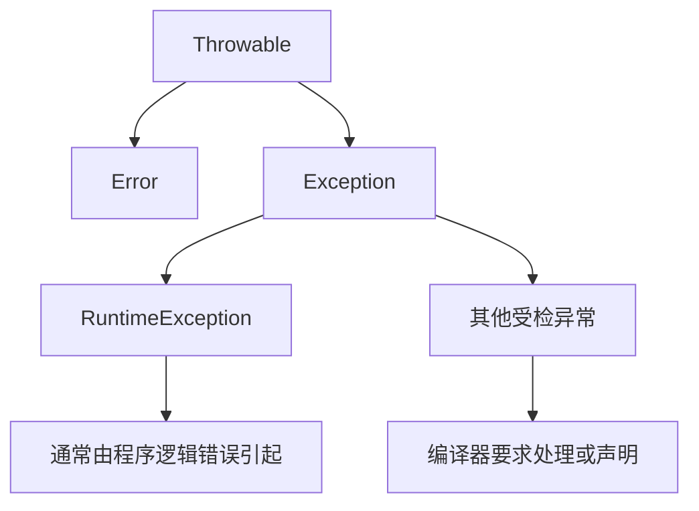
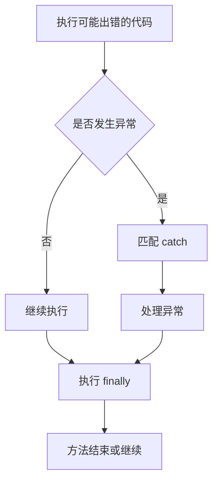
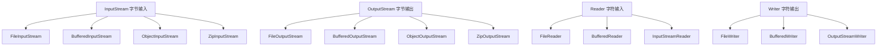
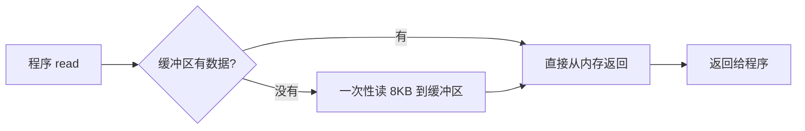
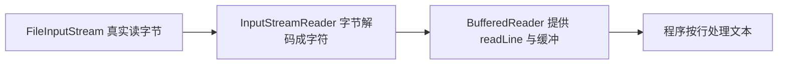
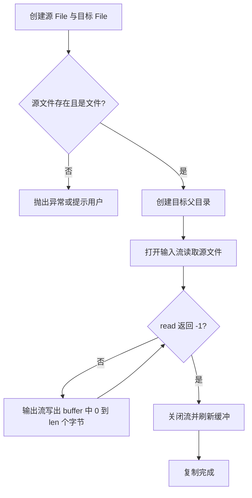

# 异常与 IO 流

本篇整理原笔记第十七、十八章，解决“程序出错时如何处理”和“如何读写外部数据”两个问题。异常部分回答“程序出错时应该怎么办”，IO 部分回答“数据如何进出程序”。下面的示例省略了 import 语句，编码时按需引入 `java.io`、`java.nio.charset` 等包下的类。

## 1. 学习目标与前置知识

### 1.1 学习目标

- 能画出 `Throwable` 的继承结构，区分 `Error`、受检异常和非受检异常。
- 能用 `try-catch-finally`、`throw`、`throws`、try-with-resources 处理异常。
- 能写出受检和非受检两种自定义异常，并说明什么时候用哪一种。
- 会用 `File` 表示路径，判断、创建、删除文件和目录，并按条件过滤目录内容。
- 能说清字节流、字符流、缓冲流、转换流、对象流、打印流各自解决什么问题。
- 能用正确的字符集读写文本，能解释乱码是怎么产生的。
- 能完成文件复制、文本排序、配置读取和 ZIP 解压四个小案例。

### 1.2 前置知识

- 第 03 篇：类、继承、构造方法、`super`、方法重写，自定义异常要用到。
- 第 05 篇：集合的基本使用，读取文件内容后常需要放进 `List`。
- 第 06 篇：Lambda 表达式，`FileFilter` 可以写成 Lambda。
- 会看编译器的报错信息，异常处理的学习有一半是在读报错。

## 2. 异常体系



`Error` 通常表示严重的系统级问题；`Exception` 是应用程序可以考虑处理的问题。运行时异常常见原因包括空指针、数组越界和类型转换错误。

### 2.1 三者分别代表什么

| 类型 | 表示什么 | 典型例子 | 程序该不该处理 |
|---|---|---|---|
| `Error` | JVM 级别的严重故障 | `OutOfMemoryError`、`StackOverflowError` | 通常不处理，应调整设计或资源 |
| `RuntimeException` | 代码逻辑错误导致的问题 | 空指针、数组越界、除零 | 应修改代码避免，而不是到处 catch |
| 其他 `Exception` | 外部环境导致的、可预期的失败 | 文件不存在、网络中断 | 必须处理或声明抛出 |

`Throwable` 是三者共同的父类，`catch (Throwable t)` 能把 `Error` 也吞掉，实际开发中很少这么写。

### 2.2 受检异常与非受检异常

判断标准很简单：这个异常是不是 `RuntimeException` 的子类。

| 对比项 | 受检异常 Checked | 非受检异常 Unchecked |
|---|---|---|
| 继承自 | `Exception`（不含 `RuntimeException` 分支） | `RuntimeException` |
| 编译器是否强制处理 | 强制，必须 try-catch 或 throws | 不强制 |
| 典型代表 | `IOException`、`FileNotFoundException`、`SQLException` | `NullPointerException`、`ArithmeticException` |
| 出现原因 | 外部环境不可控，如文件被删、磁盘满 | 代码写错，如没判空、下标越界 |
| 处理思路 | 重试、提示用户、记录日志 | 修 bug，不要靠 catch 掩盖 |

```java
// FileInputStream 的构造方法声明了 FileNotFoundException
// 这是受检异常，不写 try-catch 就必须用 throws 声明
public static void main(String[] args) throws IOException {
    FileInputStream in = new FileInputStream("a.txt");
    in.close();
}
```

去掉 `throws IOException` 后编译器会直接报错：`unreported exception java.io.IOException; must be caught or declared to be thrown`。这就是“受检”的含义。

### 2.3 常见异常类与处理策略

| 异常类 | 典型触发场景 | 处理策略 |
|---|---|---|
| `NullPointerException` | 对 `null` 调用方法，如 `str.length()` 而 `str` 为 `null` | 提前判空，或用 `Objects.requireNonNull` |
| `ArrayIndexOutOfBoundsException` | 下标为负数或不小于 `length`，如 `arr[arr.length]` | 检查循环边界，别写死数字 |
| `NumberFormatException` | `Integer.parseInt("abc")`，字符串含非数字字符 | 先用正则或 try-catch 校验输入，给出提示 |
| `ClassCastException` | `(String) obj` 而 `obj` 实际是 `Integer` | 转换前用 `instanceof` 判断 |
| `ArithmeticException` | 整数除以 0，如 `10 / 0` | 运算前判断除数是否为 0 |

```java
String text = null;
if (text != null) {
    System.out.println(text.length());      // 避免 NullPointerException
}

int[] numbers = {1, 2, 3};
for (int i = 0; i < numbers.length; i++) {
    System.out.println(numbers[i]);         // 避免越界
}

try {
    int value = Integer.parseInt("12a");
} catch (NumberFormatException ex) {
    System.out.println("输入不是合法整数：" + ex.getMessage());
}

if (numbers[0] != 0) {
    System.out.println(10 / numbers[0]);    // 避免 ArithmeticException
}
```

`10 / 0` 只有在除数为整型时才抛 `ArithmeticException`；浮点数 `10.0 / 0` 的结果是 `Infinity`，不会抛异常。这是最容易判断错的一点。

## 3. 异常处理

```java
try {
    int result = 10 / divisor;
    System.out.println(result);
} catch (ArithmeticException ex) {
    System.out.println("除数不能为 0");
} finally {
    System.out.println("清理工作");
}
```



`throw` 用于主动抛出异常，`throws` 用于在方法声明中说明可能抛出的异常。自定义异常应使用有意义的类名和错误信息，不要捕获后静默忽略。

### 3.1 try-catch-finally 执行细节

- `try` 中出现异常后，异常点之后的代码不再执行，控制权直接交给 `catch`。
- 没有 `catch` 匹配时，`finally` 仍会执行，然后异常继续向上抛。
- `finally` 一定会执行，除非 JVM 退出（`System.exit`）或进程被强杀。
- 资源释放应放在 `finally` 中，这是 try-with-resources 出现前的标准写法。

```java
try {
    System.out.println("1. try 开始");
    int value = 1 / 0;
    System.out.println("2. 这行不会执行");
} catch (ArithmeticException ex) {
    System.out.println("3. catch 捕获：" + ex.getMessage());
} finally {
    System.out.println("4. finally 一定执行");
}
System.out.println("5. 方法继续往下走");
```

输出顺序是 1、3、4、5。

### 3.2 多重 catch 与异常合并

多个 `catch` 从上到下依次匹配，所以子类必须写在父类前面，否则子类的 `catch` 永远不可达，编译器直接报错。

```java
try {
    FileInputStream in = new FileInputStream("data.txt");
    System.out.println(in.read());
} catch (FileNotFoundException ex) {
    System.out.println("文件不存在：" + ex.getMessage());   // 子类在前
} catch (IOException ex) {
    System.out.println("读取失败：" + ex.getMessage());     // 父类在后
}
```

两个异常的处理逻辑完全一样时，JDK 7 以后可以用竖线合并到一个 `catch`：

```java
try {
    FileInputStream in = new FileInputStream("data.txt");
    int value = Integer.parseInt("abc");
} catch (IOException | NumberFormatException ex) {
    // 合并 catch 时变量默认是 final，不能再赋值
    System.out.println("出错了：" + ex.getMessage());
}
```

合并只是少写重复代码，不改变“从具体到宽泛”的匹配本质。

### 3.3 return 与 finally 的覆盖关系

```java
public static int test() {
    int result = 10;
    try {
        return result;
    } finally {
        result = 20;    // 改的是局部变量，返回值已确定，这里不影响
    }
}

public static int test2() {
    try {
        return 10;
    } finally {
        return 20;      // finally 的 return 会覆盖前面的 return
    }
}
```

`test()` 返回 10，`test2()` 返回 20。结论：不要在 `finally` 里写 `return`，否则既会覆盖真正的返回值，又会丢掉原来的异常。`finally` 只做关闭资源、释放锁这类清理工作。

### 3.4 throw 与 throws

- `throw` 写在方法体里，抛出的是一个具体异常对象，一次只能抛一个。
- `throws` 写在方法声明上，列出可能抛出的异常类型，可以写多个，用逗号分隔。

```java
public static void checkAge(int age) {
    if (age < 0) {
        // 主动抛出，非受检异常不用在方法上声明
        throw new IllegalArgumentException("年龄不能为负数：" + age);
    }
}

public static void readFile() throws IOException {
    // 声明式抛出，把处理责任交给调用者
    throw new IOException("模拟读取失败");
}
```

### 3.5 try-with-resources

只要资源类实现了 `java.lang.AutoCloseable`，就可以写在 `try` 后面的小括号里，代码块结束后自动调用 `close()`，抛异常也会关闭。多个资源用分号分隔，关闭顺序与声明顺序相反。

```java
try (FileInputStream in = new FileInputStream("source.jpg");
     FileOutputStream out = new FileOutputStream("target.jpg")) {
    byte[] buffer = new byte[1024];
    int len;
    while ((len = in.read(buffer)) != -1) {
        out.write(buffer, 0, len);
    }
} catch (IOException ex) {
    System.out.println("复制失败：" + ex.getMessage());
}
```

手工写 `finally` 时，如果 `close()` 自己也抛异常，会掩盖原来的异常，try-with-resources 会自动处理这种情况。

## 4. 自定义异常

JDK 的异常只能表达通用问题。业务中需要“余额不足”“用户名已存在”这类语义清晰的异常，就要自己定义。核心要求只有两条：起一个能看懂的名字，构造方法里把信息传给父类。

### 4.1 继承 Exception：受检异常

```java
public class InsufficientBalanceException extends Exception {
    public InsufficientBalanceException() {
        super();
    }

    public InsufficientBalanceException(String message) {
        super(message);
    }

    public InsufficientBalanceException(String message, Throwable cause) {
        super(message, cause);
    }
}
```

因为继承的是 `Exception`，调用方必须处理：

```java
public void withdraw(double amount) throws InsufficientBalanceException {
    if (amount > balance) {
        throw new InsufficientBalanceException("余额不足，当前余额：" + balance);
    }
    balance -= amount;
}

// 调用处
try {
    account.withdraw(500);
} catch (InsufficientBalanceException ex) {
    System.out.println(ex.getMessage());
}
```

### 4.2 继承 RuntimeException：非受检异常

```java
public class UsernameExistsException extends RuntimeException {
    public UsernameExistsException(String message) {
        super(message);
    }

    public UsernameExistsException(String message, Throwable cause) {
        super(message, cause);
    }
}
```

调用方可以不写 try-catch，编译照过，异常在运行时抛出：

```java
public void register(String username) {
    if ("admin".equals(username)) {
        throw new UsernameExistsException("用户名已存在：" + username);
    }
    System.out.println("注册成功：" + username);
}
```

### 4.3 两种写法的选择依据

| 对比项 | 继承 `Exception` | 继承 `RuntimeException` |
|---|---|---|
| 是否受检 | 受检 | 非受检 |
| 调用方是否被迫处理 | 是，必须 try-catch 或 throws | 否 |
| 适合的场景 | 调用方能补救，如余额不足可提示充值 | 调用方无法补救，通常是参数或状态错误 |
| 对方法签名的影响 | 每层都要声明 `throws`，签名变长 | 不污染方法签名 |
| 常见搭配 | 底层工具类、可恢复的业务失败 | 参数校验、状态断言 |

经验规则：调用方看到异常后能做出有意义的反应，用受检异常；只能让它冒泡到统一异常处理器，用非受检异常。

### 4.4 serialVersionUID 的习惯写法

自定义异常是可序列化的（`Throwable` 实现了 `Serializable`），规范做法是显式声明版本号：

```java
public class BusinessException extends RuntimeException {
    private static final long serialVersionUID = 1L;

    public BusinessException(String message) {
        super(message);
    }
}
```

不写也能编译，但 JVM 会按类结构自动算一个值，类一改（加字段、改方法签名）版本号就变了，反序列化旧数据会抛 `InvalidClassException: local class incompatible`。显式写死就把这个风险固定住了。

## 5. 异常处理原则

- 不要捕获后静默忽略。空的 `catch` 块会让问题在很远的地方才暴露，排查成本极高。至少要打日志，或者包装后继续向上抛。
- 不要用异常做流程控制。正常分支用 `if-else`，异常只用于真正意外的失败；抛异常要构造堆栈信息，代价比 `if` 高得多。
- 尽早失败。参数不合法时立刻抛异常，别让它带着错误状态继续往下跑，否则报错点会离出错点越来越远。
- 只捕获自己能处理的异常。`catch (Exception ex) { }` 等于关闭了错误提示。
- 包装异常时保留原始信息，把原异常作为 cause 传进去，即 `new MyException("说明", ex)`，否则原始堆栈会丢失。

```java
try (InputStream in = getClass().getResourceAsStream(name)) {
    if (in == null) {
        throw new IllegalArgumentException("资源不存在：" + name);
    }
} catch (IOException ex) {
    // 不要吞掉，包装时把 ex 作为 cause 传进去
    throw new IllegalStateException("加载资源失败：" + name, ex);
}
```

## 6. File 类

`File` 表示文件或目录的路径，不代表文件内容。可以使用它判断存在性、创建目录、删除文件和遍历目录。换句话说，`File` 是“路径的抽象”，真正读写内容要靠后面的流。

### 6.1 三种构造方式

```java
File f1 = new File("D:\\study\\data\\a.txt");          // 直接给完整路径
File f2 = new File("D:\\study\\data", "a.txt");        // 父路径字符串 + 子路径
File dir = new File("D:\\study\\data");
File f3 = new File(dir, "a.txt");                      // 父 File 对象 + 子路径
```

第三种最常用，因为父目录本身也是程序算出来的，不用做字符串拼接，也就不会漏写或多写分隔符。

### 6.2 相对路径与绝对路径

- 绝对路径以盘符或根目录开头，如 `D:\study\data\a.txt`，在任何工作目录下都指向同一文件。
- 相对路径不带盘符，如 `data\a.txt`，起点是“当前工作目录”，也就是启动 JVM 时所在的目录。

```java
File relative = new File("data.txt");
System.out.println("路径：" + relative.getPath());
System.out.println("绝对路径：" + relative.getAbsolutePath());
System.out.println("分隔符：" + File.separator);   // 不要手写 \ 或 /
```

“IDE 里能读、命令行就报文件不存在”通常就是两次运行的工作目录不同。排查第一步永远是打印 `getAbsolutePath()`。

### 6.3 createNewFile、mkdir 与 mkdirs

| 方法 | 能创建几级目录 | 父目录不存在时 | 返回值含义 |
|---|---|---|---|
| `mkdir()` | 只能一级 | 失败，返回 `false` | true 表示创建成功 |
| `mkdirs()` | 多级都可 | 自动把中间目录一起建出来 | true 表示创建成功 |
| `createNewFile()` | 只创建文件，不建目录 | 抛 `IOException` | true 表示新建，false 表示已存在 |

```java
File dir = new File("D:\\study\\demo");
System.out.println(dir.mkdirs());              // 多级目录一次建好

File file = new File(dir, "a.txt");
System.out.println(file.createNewFile());      // 第一次 true
System.out.println(file.createNewFile());      // 第二次 false，文件已存在
```

`createNewFile()` 不会帮你建父目录，父目录不存在时抛 `IOException: 系统找不到指定的路径`，所以顺序永远是先 `mkdirs()` 再 `createNewFile()`。

### 6.4 判断与获取信息

| 方法 | 作用 | 注意点 |
|---|---|---|
| `exists()` | 路径是否存在 | 文件和目录都返回 true |
| `isFile()` | 是否是文件 | 路径不存在时返回 false |
| `isDirectory()` | 是否是目录 | 常与 `exists()` 配合 |
| `length()` | 文件字节数 | 对目录来说该值没有实际意义 |
| `getName()` | 最后一段名字 | 不含父路径 |
| `getParent()` | 父目录路径字符串 | 没有父路径时返回 null |
| `getParentFile()` | 父目录的 File 对象 | 常用来“先建父目录” |
| `lastModified()` | 最后修改时间毫秒数 | 可配合 `java.util.Date` 显示 |

```java
File file = new File("D:\\study\\demo\\a.txt");
if (file.isFile()) {
    System.out.println(file.getName() + " " + file.length() + " 字节");
    File parent = file.getParentFile();
    System.out.println("父目录存在吗：" + parent.exists());
}
```

### 6.5 删除文件与目录

```java
File file = new File("D:\\study\\demo\\a.txt");
System.out.println(file.delete());          // 删除文件

File dir = new File("D:\\study\\demo");
System.out.println(dir.delete());           // 目录非空时返回 false，不抛异常
```

`delete()` 只能删空目录。要删非空目录，得先递归删掉里面的内容，这正是综合练习里会用到的场景。

### 6.6 listFiles 与 FileFilter 过滤

```java
File dir = new File("D:\\study\\demo");
File[] files = dir.listFiles();
if (files != null) {
    for (File file : files) {
        System.out.println(file.getName());
    }
}

// 匿名内部类写法，accept 返回 true 表示保留
File[] txtFiles = dir.listFiles(new FileFilter() {
    @Override
    public boolean accept(File pathname) {
        return pathname.isFile() && pathname.getName().endsWith(".txt");
    }
});

// Lambda 写法更简洁
File[] javaFiles = dir.listFiles(
        pathname -> pathname.isFile() && pathname.getName().endsWith(".java"));
```

两个细节必须注意：目录不存在或不是目录时 `listFiles()` 返回 `null`，一定要判空；`FileFilter` 拿到的是 `File` 对象，`FilenameFilter` 拿到的是目录和文件名字符串。

## 7. IO 流分类体系


字节流适合图片、音频等二进制数据；字符流适合文本。缓冲流通过内存缓冲减少底层读写次数。

### 7.1 流的分类依据

理解 IO 只需要回答三个问题：

1. 数据是流进程序还是流出程序？这决定输入流还是输出流，“输入输出”是相对程序而言的，读文件是输入流。
2. 处理的是字节还是字符？这决定用字节流还是字符流。
3. 是直接操作数据源，还是在原始流外面套一层增强？这决定节点流还是处理流。

### 7.2 四个抽象基类

| 抽象基类 | 方向 | 数据单位 | 常用子类 |
|---|---|---|---|
| `InputStream` | 输入 | 字节 | `FileInputStream`、`BufferedInputStream` |
| `OutputStream` | 输出 | 字节 | `FileOutputStream`、`BufferedOutputStream` |
| `Reader` | 输入 | 字符 | `FileReader`、`BufferedReader`、`InputStreamReader` |
| `Writer` | 输出 | 字符 | `FileWriter`、`BufferedWriter`、`OutputStreamWriter` |

规律很好记：`Input`/`Output` 表示方向，`Stream` 结尾是字节，`Reader`/`Writer` 结尾是字符。所有流都实现了 `Closeable`，方法名统一叫 `close()`。



### 7.3 字节流与字符流对比

| 对比项 | 字节流 | 字符流 |
|---|---|---|
| 基类 | `InputStream` / `OutputStream` | `Reader` / `Writer` |
| 数据单位 | 字节（8 位） | 字符（与编码有关） |
| 适合的数据 | 图片、音频、视频、任意二进制 | 纯文本文件 |
| 是否涉及编码 | 不涉及，原样搬运 | 涉及，读写时要确定字符集 |
| 典型方法 | `read()`、`write(byte[])` | `read()`、`write(String)` |
| 中文处理 | 需自己处理字节边界，容易截断 | 一次一个字符，不会截断 |

判断口诀：能用记事本正常读、希望看到文字，用字符流；其他一律用字节流。最保险的做法是“文件复制永远用字节流”。

## 8. 常用 IO 类型

| 类型 | 用途 |
| --- | --- |
| `FileInputStream` / `FileOutputStream` | 字节文件读写 |
| `FileReader` / `FileWriter` | 字符文件读写 |
| `BufferedInputStream` / `BufferedOutputStream` | 缓冲字节流 |
| `BufferedReader` / `BufferedWriter` | 缓冲字符流 |
| `InputStreamReader` / `OutputStreamWriter` | 字节与字符转换 |
| `ObjectInputStream` / `ObjectOutputStream` | 对象反序列化和序列化 |
| `PrintWriter` | 方便地输出文本 |
| `Properties` | 读写键值配置 |

使用 try-with-resources 自动关闭资源：

```java
import java.io.BufferedReader;
import java.io.FileReader;
import java.io.IOException;

try (BufferedReader reader = new BufferedReader(new FileReader("data.txt"))) {
    String line;
    while ((line = reader.readLine()) != null) {
        System.out.println(line);
    }
} catch (IOException ex) {
    System.out.println("文件读取失败：" + ex.getMessage());
}
```

这段代码只能写在方法体内部，直接放在类里会编译报错。另外 `FileReader` 不指定字符集时使用平台默认编码，只读英文没问题，读中文建议改用第 12 节介绍的转换流写法。

## 9. 字节流

### 9.1 FileInputStream 的三种读法

`read()` 的返回值类型是 `int` 而不是 `byte`，原因是 `int` 可以额外用 -1 表示“读完了”，`byte` 的取值范围只有 -128 到 127，不够用。

| 读法 | 代码形态 | 优点 | 缺点 |
|---|---|---|---|
| 单字节读取 | `read()` | 写法最简单 | 一次只搬一个字节，大文件极慢 |
| 一次读满数组 | `new byte[in.available()]` | 一次拿到全部内容 | 内存要装得下，超大文件会溢出 |
| 固定缓冲区循环 | `read(buffer)` 循环 | 内存占用恒定，速度快 | 需自己处理读取长度 |

```java
// 读法一：一次读一个字节，效率低，只适合演示
try (FileInputStream in = new FileInputStream("data.txt")) {
    int b;
    while ((b = in.read()) != -1) {
        System.out.print((char) b);
    }
}

// 读法二：按文件大小一次读完
try (FileInputStream in = new FileInputStream("data.txt")) {
    byte[] data = new byte[in.available()];
    int len = in.read(data);
    System.out.println(new String(data, 0, len, "UTF-8"));
}

// 读法三：固定缓冲区循环读，最通用
try (FileInputStream in = new FileInputStream("data.txt")) {
    byte[] buffer = new byte[1024];
    int len;
    while ((len = in.read(buffer)) != -1) {
        System.out.write(buffer, 0, len);
    }
}
```

关键点是第三个写法里的 `write(buffer, 0, len)`：最后一次读取往往只填满缓冲区的一部分，写成 `write(buffer)` 会把上次残留的数据也写出去，导致文件末尾多出垃圾内容。

### 9.2 FileOutputStream 的写入与追加

| 方法 | 作用 |
|---|---|
| `write(int b)` | 写出一个字节，只取参数的低 8 位 |
| `write(byte[] b)` | 写出整个字节数组 |
| `write(byte[] b, int off, int len)` | 从下标 `off` 开始写出 `len` 个字节 |

```java
File file = new File("output.txt");

// 覆盖写：每次运行都会清空原内容
try (FileOutputStream out = new FileOutputStream(file)) {
    out.write("第一行\n".getBytes(StandardCharsets.UTF_8));
}

// 追加写：第二个参数为 true，新内容写到文件末尾
try (FileOutputStream out = new FileOutputStream(file, true)) {
    byte[] data = "第二行\n".getBytes(StandardCharsets.UTF_8);
    out.write(data);
    out.write(data, 0, 3);      // 从下标 0 开始只写 3 个字节
}
```

`FileOutputStream(File)` 是覆盖模式，`FileOutputStream(File, boolean append)` 传 `true` 才是追加模式，这是写日志时最常踩的坑。

### 9.3 close 与 flush 的区别

| 对比项 | `flush()` | `close()` |
|---|---|---|
| 是否刷新缓冲区 | 是 | 是，关闭前会先刷新 |
| 是否释放资源 | 否，流仍可继续使用 | 是，释放文件句柄 |
| 调用后还能写吗 | 能 | 不能，再写抛 `IOException` |
| 使用时机 | 需要立刻让对方看到数据时 | 资源使用结束，或交给 try-with-resources |
| 字节流是否需要 | 一般不需要，字节流通常没有额外缓冲 | 需要 |

字符流和缓冲流内部有字符缓冲区，写了几次之后数据可能还停在内存里。连续读写同一个文件时，只 `write` 不 `flush` 可能读到旧内容。`close()` 会自动 `flush()`，所以用 try-with-resources 时基本不用担心。

## 10. 字符流

### 10.1 FileReader 读取文本

```java
// 一次读一个字符
try (FileReader reader = new FileReader("data.txt")) {
    int c;
    while ((c = reader.read()) != -1) {
        System.out.print((char) c);
    }
}

// 一次读一个字符数组，推荐写法
try (FileReader reader = new FileReader("data.txt")) {
    char[] buffer = new char[1024];
    int len;
    while ((len = reader.read(buffer)) != -1) {
        System.out.print(new String(buffer, 0, len));
    }
}
```

`read()` 返回的同样是 `int`，用 -1 表示读完，只是单位从字节变成了字符。

### 10.2 FileWriter 写入与追加

```java
// 覆盖写
try (FileWriter writer = new FileWriter("note.txt")) {
    writer.write("第一行");
    writer.write("\n");
    writer.write("第二行");
    writer.flush();     // close 也会自动 flush，这里手动写一次便于观察
}

// 追加写
try (FileWriter writer = new FileWriter("note.txt", true)) {
    writer.write("\n第三行");
}

// 字符数组与部分写入
try (FileWriter writer = new FileWriter("chars.txt")) {
    char[] chars = "HelloWorld".toCharArray();
    writer.write(chars);
    writer.write(chars, 0, 5);
}
```

`FileWriter` 内部有缓冲区，写完不 `close()` 也不 `flush()`，数据可能留在内存里没落到磁盘。

### 10.3 为什么字符流不适合二进制文件

字符流读写时会做“字节与字符的转换”，这一步依赖字符集：

- 读图片时，字节被按某个字符集强行解码成字符，遇到无法映射的字节组合会被替换成问号或无效字符，数据被破坏。
- 写出时再把字符编码回字节，这一步不可逆，原文件无法复原。
- 结果是复制出来的图片打不开，音频、压缩包同样会损坏。

正确做法：图片、音频、视频、压缩包、可执行文件一律用字节流，只有纯文本才用字符流。

## 11. 缓冲流

| 缓冲流 | 包装的基类 | 常用增强方法 |
|---|---|---|
| `BufferedInputStream` | `InputStream` | 无新增方法，只是加速 |
| `BufferedOutputStream` | `OutputStream` | 无新增方法，只是加速 |
| `BufferedReader` | `Reader` | `readLine()` 一次读一行 |
| `BufferedWriter` | `Writer` | `newLine()` 写跨平台换行符 |

```java
try (BufferedReader reader = new BufferedReader(new FileReader("data.txt"));
     BufferedWriter writer = new BufferedWriter(new FileWriter("copy.txt"))) {
    String line;
    while ((line = reader.readLine()) != null) {    // null 表示读完
        writer.write(line);
        writer.newLine();                           // 不要手写 "\n"
    }
}
```

`readLine()` 读到文件末尾返回 `null`，这是循环结束的唯一判断依据，不是空字符串。`newLine()` 会根据平台写出 Windows 的 `\r\n` 或 Linux 的 `\n`。

### 11.1 缓冲为什么快

不带缓冲时，每次 `read()` 或 `write()` 都会请求操作系统做一次真实的磁盘或网卡操作，也就是一次系统调用，开销远大于内存拷贝。

缓冲流的做法是：一次性从底层读出一大块（默认 8KB）放进内存数组，后续读取先在内存完成，缓冲区用完了才再申请一次真实读取。写操作相反，先写进内存缓冲区，填满后一次性写出。



效果上，原来可能要几万次系统调用的操作会被压缩到几十次，小文件差距不明显，大文件非常可观。

## 12. 转换流

### 12.1 两座桥的定位

`InputStreamReader` 与 `OutputStreamWriter` 是字节流与字符流之间的桥梁：把字节流按指定字符集解码成字符，或者把字符按指定字符集编码成字节。

```java
// 字节流 -> 按 UTF-8 解码 -> 缓冲读，最标准的文本读取链
try (BufferedReader reader = new BufferedReader(
        new InputStreamReader(new FileInputStream("data.txt"), StandardCharsets.UTF_8))) {
    String line;
    while ((line = reader.readLine()) != null) {
        System.out.println(line);
    }
}
```

### 12.2 写出时显式指定字符集

```java
try (Writer writer = new OutputStreamWriter(
        new FileOutputStream("utf8.txt"), StandardCharsets.UTF_8)) {
    writer.write("中文内容会被编码成 UTF-8 字节");
}
```

`StandardCharsets` 已提供常用常量：`UTF_8`、`GBK`、`ISO_8859_1`、`US_ASCII`，直接用它们比手写字符串更安全，拼错会当场编译失败，而不是运行时抛 `UnsupportedEncodingException`。

### 12.3 平台默认编码的坑

不指定字符集时，`InputStreamReader`、`OutputStreamWriter`、`FileReader`、`FileWriter`、`new String(bytes)` 都使用平台默认字符集。同一份代码在 A 机器上写、B 机器上读就可能乱码。典型场景是：Windows 中文版默认 GBK，Linux 服务器默认 UTF-8，本地测试正常、部署后中文全变问号。

避免方式有两条：所有文本读写都显式传字符集；或用启动参数统一指定 `file.encoding`。前者更可靠，因为它不依赖运行环境配置。

## 13. 装饰器模式

### 13.1 为什么不给每种组合写一个子类

假设要给文件字节流加缓冲，又给网络字节流加缓冲，再考虑“缓冲 + 转换”“缓冲 + 转换 + 读行”这些组合。用继承实现就需要 `BufferedFileInputStream`、`BufferedSocketInputStream`、`BufferedConvertFileInputStream` 等大量类，每加一种能力类的数量按乘法增长，这就是“类爆炸”。

装饰器的思路是：每个增强类只做一件事，并且接收一个同类对象，在它外面套一层。组合数量仍然是乘积，但需要写的类只按加法增长。



### 13.2 一条完整包装链的解读

```java
BufferedReader reader = new BufferedReader(
        new InputStreamReader(
                new FileInputStream("data.txt"), StandardCharsets.UTF_8));
```

从内往外读这段代码：

1. `new FileInputStream("data.txt")` 负责最底层，从文件读出原始字节。
2. `new InputStreamReader(..., StandardCharsets.UTF_8)` 套在外面，把字节按 UTF-8 解码成字符。
3. `new BufferedReader(...)` 再套一层，提供缓冲区以及 `readLine()`，让程序按行处理。

调用 `reader.readLine()` 时，请求逐层向内传递，最终由 `FileInputStream` 读磁盘；数据层层向上返回，变成一行字符串。包装顺序不能随便换：`new BufferedReader(new FileInputStream(...))` 会直接编译失败，因为 `BufferedReader` 的构造方法要求传入 `Reader` 而不是 `InputStream`。

## 14. 对象流与序列化

### 14.1 序列化与反序列化

序列化是把内存中的对象转成字节序列，反序列化是把字节序列还原成对象，用途是保存对象状态到文件或在网络上传输对象。

```java
class Student implements Serializable {
    private static final long serialVersionUID = 1L;

    private String name;
    private int age;
    private transient String password;              // 不参与序列化
    private static String school = "第一中学";       // 属于类，不随对象序列化

    public Student(String name, int age, String password) {
        this.name = name;
        this.age = age;
        this.password = password;
    }

    public String getName() { return name; }

    public int getAge() { return age; }

    public String getPassword() { return password; }
}
```

```java
Student student = new Student("张三", 18, "123456");

// 序列化：对象 -> 字节 -> 文件
try (ObjectOutputStream out = new ObjectOutputStream(new FileOutputStream("student.dat"))) {
    out.writeObject(student);
}

// 反序列化：文件 -> 字节 -> 对象
try (ObjectInputStream in = new ObjectInputStream(new FileInputStream("student.dat"))) {
    Student restored = (Student) in.readObject();
    System.out.println(restored.getName() + " " + restored.getAge());
    System.out.println("密码字段：" + restored.getPassword());   // 输出 null
}
```

`readObject()` 的返回值是 `Object`，需要强制转换，并且会抛 `ClassNotFoundException`。密码打印为 `null`，因为 `transient` 字段反序列化后是默认值。

### 14.2 Serializable 标记接口

`Serializable` 是一个空接口，没有任何方法，作用只是“打个标记”，告诉 JVM 这个类的对象允许被序列化。没实现它就去序列化会抛 `NotSerializableException`；对象里的引用类型字段也必须实现 `Serializable`，否则同样失败。

| 修饰符 | 是否参与序列化 | 说明 |
|---|---|---|
| 普通实例字段 | 是 | 默认全部参与 |
| `static` 字段 | 否 | 属于类而不属于对象 |
| `transient` 字段 | 否 | 敏感数据或不可序列化的资源 |
| 父类字段 | 父类也实现 `Serializable` 时参与 | 否则父类字段走无参构造，值会丢失 |

### 14.3 serialVersionUID 的作用

反序列化时，JVM 会拿文件里记录的版本号和当前类的版本号比对，一致才继续，不一致抛 `InvalidClassException`。如果没有显式声明，编译器会根据类结构（字段、方法、接口）自动算一个值，那么给类加一个字段、改一个方法签名，版本号就变了，之前存的文件全部失效。

```java
class Student implements Serializable {
    private static final long serialVersionUID = 1L;    // 版本号由自己控制
}
```

固定版本号后，只要改动是可容忍的，旧数据仍能读出来，新字段取默认值。打算长期存储的类都建议显式写上它。

### 14.4 连续读取多个对象

`readObject()` 读到末尾不会返回 `null`，而是抛 `EOFException`，所以循环读取要靠捕获这个异常来结束：

```java
try (ObjectInputStream in = new ObjectInputStream(new FileInputStream("students.dat"))) {
    while (true) {
        try {
            Student student = (Student) in.readObject();
            System.out.println(student.getName());
        } catch (EOFException ex) {
            break;      // 读到文件末尾，正常结束循环
        }
    }
}
```

更规范的写法是先写入对象个数，或者把对象装进 `List` 一次性序列化，这样就不需要用异常当循环条件。

安全提醒：不要反序列化来自不可信来源的数据。反序列化会执行对象重建逻辑，历史上出现过通过特制字节流触发任意代码执行的漏洞。

## 15. 打印流

### 15.1 PrintStream 与 PrintWriter 的区别

| 对比项 | `PrintStream` | `PrintWriter` |
|---|---|---|
| 所属体系 | 字节流，继承 `OutputStream` | 字符流，继承 `Writer` |
| 常用方法 | `print`、`println`、`printf` | `print`、`println`、`printf` |
| 是否抛 `IOException` | 不抛，通过 `checkError()` 判断 | 不抛，通过 `checkError()` 判断 |
| 字符集处理 | 老构造方法使用平台默认编码 | 可包装 `OutputStreamWriter` 指定编码 |
| 典型实例 | `System.out`、`System.err` | 写文本文件、写网络响应 |

```java
try (PrintWriter writer = new PrintWriter("report.txt", "UTF-8")) {
    writer.println("姓名：张三");
    writer.printf("成绩：%.2f%n", 92.5);
    writer.print("结束");
    System.out.println("是否出错：" + writer.checkError());
}
```

`print` 系列方法不抛 `IOException`，写失败了也不会中断程序，复杂场景要主动调用 `checkError()`。

### 15.2 System.out 与输出重定向

`System.out` 本身就是一个 `PrintStream`，默认指向控制台；`System.setOut` 可以把它换成别的 `PrintStream`，把标准输出重定向到文件。

```java
PrintStream console = System.out;

// 重定向到文件，第二个参数 true 表示开启自动刷新
System.setOut(new PrintStream(new FileOutputStream("log.txt"), true));
System.out.println("这行会写进文件");

System.setOut(console);         // 用完恢复，避免影响后续代码
System.out.println("这行显示在控制台");
```

同理 `System.setErr` 重定向错误输出，`System.in` 是标准输入字节流，可以用 `Scanner` 包装后读键盘输入。

### 15.3 自动刷新开关

自动刷新指调用 `println`、`printf`、`format` 时是否立刻把缓冲区内容写出去，构造方法第二个参数传 `true` 才开启。

- 开发调试、日志输出建议开启，否则程序崩溃时最后几行可能丢在缓冲区。
- 批量写大文件建议关闭，一次一次刷盘会拖慢速度，交给 `close()` 统一处理即可。

## 16. Properties 配置文件

### 16.1 键值对的读写

`Properties` 是 `Hashtable` 的子类，专门处理键和值都是字符串的配置文件，例如数据库连接信息。

```java
Properties props = new Properties();
props.setProperty("url", "jdbc:mysql://localhost:3306/study");
props.setProperty("username", "root");

String password = props.getProperty("password", "默认密码");   // 给默认值
System.out.println(props.getProperty("url") + " " + password);

// 遍历所有键，返回的是 Set<String>
for (String key : props.stringPropertyNames()) {
    System.out.println(key + " = " + props.getProperty(key));
}
```

### 16.2 load 与 store

```java
Properties props = new Properties();

// 推荐：用 Reader 指定字符集，配置文件里的中文才正常
try (Reader reader = new InputStreamReader(
        new FileInputStream("config.properties"), StandardCharsets.UTF_8)) {
    props.load(reader);
}
System.out.println(props.getProperty("app.name"));

// 写回文件，注释会作为第一行写入
try (OutputStream out = new FileOutputStream("config.properties")) {
    props.store(out, "应用配置");
}

// 也可以用 InputStream，但读取时按 ISO-8859-1 解析
try (InputStream in = new FileInputStream("config.properties")) {
    props.load(in);
}
```

`load(InputStream)` 是历史遗留行为：它把字节按 ISO-8859-1 映射成字符，文件里直接写中文会乱码。解决办法是改用 `load(Reader)`。配置文件的格式很简单，`#` 开头是注释，键和值之间用 `=` 或 `:` 分隔。

### 16.3 与 XML 配置的简单对照

| 对比项 | properties | xml |
|---|---|---|
| 结构能力 | 只能一层键值对 | 支持多层级嵌套 |
| 可读性 | 简单直接 | 标签多，但层次清楚 |
| 中文支持 | `load(InputStream)` 需转义 | 可声明 `encoding="UTF-8"` |
| 读写 API | `load` / `store` | `loadFromXML` / `storeToXML` |
| 适用场景 | 少量配置、国际化语言包 | 复杂配置，如框架配置文件 |

```java
Properties props = new Properties();
try (InputStream in = new FileInputStream("config.xml")) {
    props.loadFromXML(in);
}
System.out.println(props.getProperty("app.name"));
```

两者可以互相转换，选哪个主要看配置本身是否需要层次结构。

## 17. 字符集与乱码

### 17.1 常见字符集对照

| 字符集 | 英文/数字占几字节 | 常见汉字占几字节 | 说明 |
|---|---|---|---|
| ASCII | 1 | 不支持 | 只有 128 个字符，用低 7 位 |
| GBK | 1 | 2 | 中文环境常用，兼容 ASCII |
| UTF-8 | 1 | 3 | 变长编码，兼容 ASCII，国际通用 |
| UTF-16 | 2（英文字符也占 2） | 2 或 4 | Java 内部表示 `char`、`String` 用的就是它 |

UTF-8 里英文只占 1 字节而中文占 3 字节，是因为它根据字符编号范围决定编码长度：编号小的用短编码，编号大的用长编码，所以既省空间又能容纳全世界文字。

### 17.2 getBytes 与 new String

```java
String text = "中A";
byte[] utf8 = text.getBytes(StandardCharsets.UTF_8);
byte[] gbk = text.getBytes(Charset.forName("GBK"));

System.out.println("UTF-8 字节数：" + utf8.length);      // 4
System.out.println("GBK 字节数：" + gbk.length);         // 3

// 编码和解码用同一种字符集，内容才能还原
System.out.println(new String(utf8, StandardCharsets.UTF_8));

// 用错的字符集解码，就得到乱码
System.out.println(new String(utf8, Charset.forName("GBK")));
```

`getBytes()` 不传参数时使用平台默认字符集，`new String(bytes)` 也一样。这种写法在本地可能一直正常，换台机器就出问题，所以生产代码应显式传字符集。

### 17.3 平台默认字符集

```java
System.out.println("默认字符集：" + Charset.defaultCharset());
System.out.println("是否支持 UTF-8：" + Charset.isSupported("UTF-8"));
```

Windows 中文版的默认字符集通常是 `GBK`，部分新版本 JDK 默认 `UTF-8`，Linux 服务器一般是 `UTF-8`。正因为“默认值会变”，代码里才不该依赖它。

### 17.4 乱码的成因与排查

乱码的本质只有一句话：编码时用的字符集和解码时用的字符集不一致，或者数据在传输中被截断。

- 用 GBK 编码、用 UTF-8 解码：一个汉字从 2 字节被当成 3 字节解析，后面的内容全部错位。
- 用 UTF-8 编码、用 GBK 解码：3 字节被拆成 1.5 个汉字，出现大量问号或方块。
- 缓冲区按字节切分，把多字节字符从中间截断，读到半个汉字，同样无法还原。
- 文件本身是 UTF-8，读取时没指定字符集，走了平台默认的 GBK。

排查顺序：先确认文件真实的字符集，再确认读写每一步是否显式指定了同一个字符集，最后检查有没有按字节切片做字符串转换的代码。

## 18. 压缩流

原笔记提到 ZIP 操作使用 `ZipInputStream` 和 `ZipOutputStream`。它们的关键概念是“条目”`ZipEntry`：一个压缩包由若干条目组成，每个条目有自己的名字。

### 18.1 压缩多个文件

```java
File[] sources = {new File("a.txt"), new File("b.txt")};

try (ZipOutputStream zipOut = new ZipOutputStream(new FileOutputStream("files.zip"))) {
    byte[] buffer = new byte[1024];
    for (File file : sources) {
        // 一个文件对应一个条目，条目名就是解压后的文件名
        zipOut.putNextEntry(new ZipEntry(file.getName()));
        try (InputStream in = new FileInputStream(file)) {
            int len;
            while ((len = in.read(buffer)) != -1) {
                zipOut.write(buffer, 0, len);
            }
        }
        zipOut.closeEntry();        // 结束当前条目，才能写下一个
    }
}
```

要在压缩包里保留目录结构，条目名写成 `dir/a.txt` 这种带斜杠的形式即可；只表示目录的条目，名字要以 `/` 结尾。

### 18.2 解压到指定目录

```java
File targetDir = new File("unzip");
if (!targetDir.exists()) {
    targetDir.mkdirs();
}

try (ZipInputStream zipIn = new ZipInputStream(new FileInputStream("files.zip"))) {
    byte[] buffer = new byte[1024];
    ZipEntry entry;
    while ((entry = zipIn.getNextEntry()) != null) {     // null 表示读完
        File outFile = new File(targetDir, entry.getName());
        File parent = outFile.getParentFile();
        if (parent != null && !parent.exists()) {
            parent.mkdirs();
        }
        if (!entry.isDirectory()) {
            try (OutputStream out = new FileOutputStream(outFile)) {
                int len;
                while ((len = zipIn.read(buffer)) != -1) {
                    out.write(buffer, 0, len);
                }
            }
        }
        zipIn.closeEntry();
    }
}
```

读取当前条目的内容时直接用 `zipIn.read(...)`，读到 -1 说明这个条目结束，然后必须调用 `closeEntry()` 再取下一个。条目可能是目录，所以要先把父目录建出来。

### 18.3 中文文件名乱码的处理思路

ZIP 规范早期没有规定文件名用什么字符集，Windows 自带压缩工具用 GBK，很多 Linux 工具用 UTF-8。字符集用错，解压出来的文件名就是乱码。

处理思路：`ZipInputStream` 和 `ZipOutputStream` 都有接收 `Charset` 的构造方法，显式指定与压缩包一致的字符集即可。

```java
// 按 GBK 解析条目名，兼容 Windows 生成的压缩包
try (ZipInputStream zipIn = new ZipInputStream(
        new FileInputStream("files.zip"), Charset.forName("GBK"))) {
    System.out.println(zipIn.getNextEntry().getName());
}

// 自己生成压缩包时也可以指定
ZipOutputStream zipOut = new ZipOutputStream(
        new FileOutputStream("out.zip"), Charset.forName("GBK"));
```

自己生成压缩包时，目标用户是 Windows 就用 GBK 写条目名；只在 Linux 或自研系统之间流转，统一 UTF-8 更规范。

## 19. 第三方工具与文件复制流程

### 19.1 Commons-IO 替代掉的重复代码

前面的代码里，判空、建目录、开流、循环拷贝、关流这些步骤反复出现。Apache Commons IO 把这些模板代码封装好了，一行顶十几行。

```java
File src = new File("source.txt");
File dest = new File("copy.txt");

// 复制文件：自动建父目录、自动关流
FileUtils.copyFile(src, dest);

// 一次性读成字符串，指定字符集
String content = FileUtils.readFileToString(src, StandardCharsets.UTF_8);

// 写字符串到文件
FileUtils.writeStringToFile(dest, content, StandardCharsets.UTF_8);

// 流之间的拷贝，返回拷贝的字节数
try (InputStream in = new FileInputStream("a.jpg");
     OutputStream out = new FileOutputStream("b.jpg")) {
    int count = IOUtils.copy(in, out);
    System.out.println("拷贝字节数：" + count);
}

// 整目录复制与递归删除
FileUtils.copyDirectory(new File("srcDir"), new File("destDir"));
FileUtils.deleteDirectory(new File("tempDir"));
```

| 工具方法 | 替代掉的手写代码 |
|---|---|
| `FileUtils.copyFile` | try-with-resources 加循环读写的完整拷贝模板 |
| `FileUtils.readFileToString` | 字符流读取加 `StringBuilder` 拼接 |
| `FileUtils.writeStringToFile` | 写字符串前先判断父目录是否存在 |
| `IOUtils.copy` | 两个流之间的手动缓冲区循环 |
| `FileUtils.deleteDirectory` | 递归删除非空目录的自写实现 |

```xml
<dependency>
    <groupId>commons-io</groupId>
    <artifactId>commons-io</artifactId>
    <version>2.16.1</version>
</dependency>
```

工具类虽然省事，但 `readFileToString` 会把整个文件读进内存，超大文件还是要用流循环处理。

### 19.2 文件复制的完整流程



判断顺序很重要：先确认源存在，再建目标目录，最后才开流。否则最常见的报错是 `FileNotFoundException: 系统找不到指定的路径`，而它其实来自目标目录不存在。

## 20. 小白易错点

- 用 `==` 比较字符串内容判断是否读完，应该用 `!= null` 判断 `readLine()` 的返回值。
- 忘记关闭流，文件被占用无法删除。统一用 try-with-resources。
- 复制文件用字符流处理图片，结果文件损坏。
- 读取文本不指定字符集，换台机器就乱码。
- 直接把 `read()` 的返回值强转成字符输出，中文会变成问号或乱码。
- 分不清 `mkdir` 与 `mkdirs`，多级目录创建失败。
- `delete()` 删非空目录返回 false，却以为是权限问题。
- `listFiles()` 返回 null 时直接遍历，抛 `NullPointerException`。
- 连续反序列化时用 `!= null` 判断结束，实际应该处理 `EOFException`。
- 不写 `serialVersionUID`，改一次类结构旧文件就读不了。
- 在 `finally` 里写 `return`，覆盖正常返回值还吞掉异常。
- 用异常做流程控制，例如靠 `NumberFormatException` 判断字符串是不是数字。
- 把空 `catch` 块当成“避免报错”的手段，问题被藏到最后才暴露。
- 只调了 `flush()` 以为资源已释放，实际还要 `close()`。
- 压缩中文文件名不指定字符集，解压后文件名变成乱码。

## 21. 练习清单

1. 用字节流实现任意类型文件复制，并统计拷贝的字节数。
2. 用 `BufferedReader` 读取文本文件的每一行，按行排序后写回新文件。
3. 用 `File` 加 `FileFilter` 列出某个目录下所有 `.java` 文件，并计算总大小。
4. 用 `Properties` 读取数据库配置文件，取出 `url`、`username`、`password`。
5. 自定义一个受检异常 `InsufficientBalanceException`，在转账方法中使用并处理。
6. 用 `ObjectOutputStream` 保存一个学生列表，再用 `ObjectInputStream` 读回并打印。
7. 把多个文本文件压缩成一个 zip，再解压到另一个目录，验证内容一致。
8. 故意用不同字符集写读同一个文件，观察乱码，再用同一个字符集修正。
9. 用 `System.setOut` 把一段程序的输出重定向到日志文件。
10. 用 Commons-IO 重写第 1 题，对比两种写法的代码行数。

## 22. 资料对应关系

- 《Java 笔记》第十七章：异常处理，对应本文第 2 至第 5 节。
- 《Java 笔记》第十八章：IO 流，对应本文第 6 至第 19 节。
- 第 03 篇：类与继承，自定义异常部分依赖这部分知识。
- 第 06 篇：Lambda 表达式，`FileFilter` 的简化写法会用到。
- 延伸阅读：
  - [Java 官方 IO 教程](https://docs.oracle.com/javase/tutorial/essential/io/)
  - [Apache Commons IO 主页](https://commons.apache.org/proper/commons-io/)

## 23. 总结

IO 代码的关键是选择正确的流、指定字符集、及时关闭资源并处理 `IOException`。文件复制、文本排序、配置读取和 ZIP 解压是适合练习的四个小案例。

选流的判断顺序可以固化成三句话：先问数据是字节还是字符，再问方向是输入还是输出，最后问是否需要缓冲、转换或对象化。把这三步想清楚，`new BufferedReader(new InputStreamReader(new FileInputStream(file), StandardCharsets.UTF_8))` 这种长句子也就不再可怕了。
