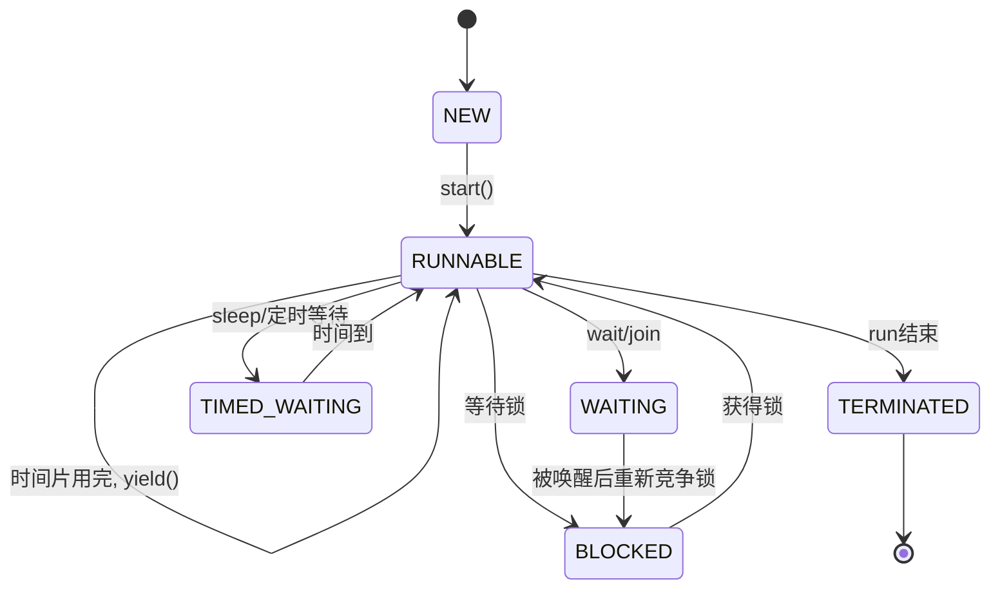
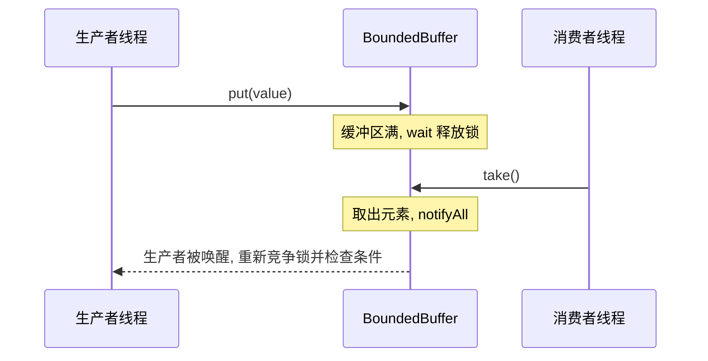
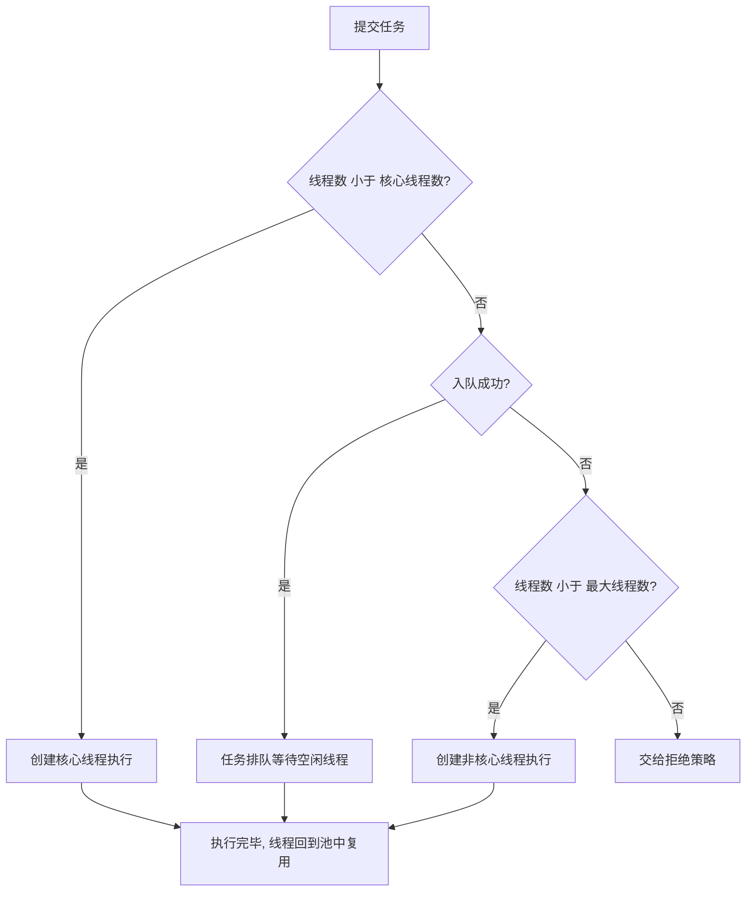
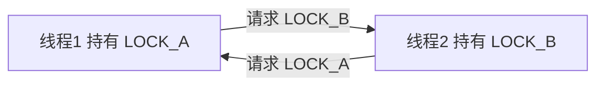
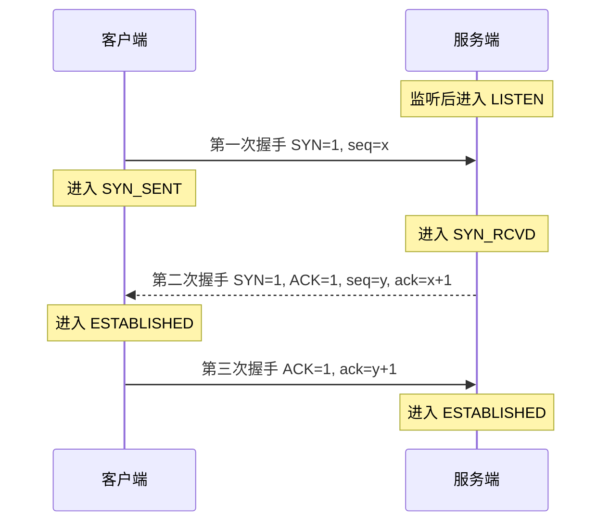
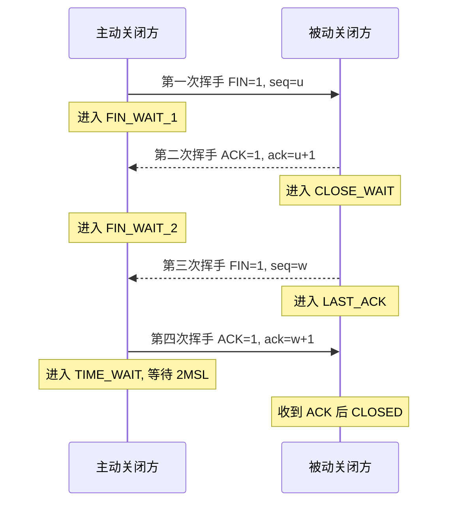
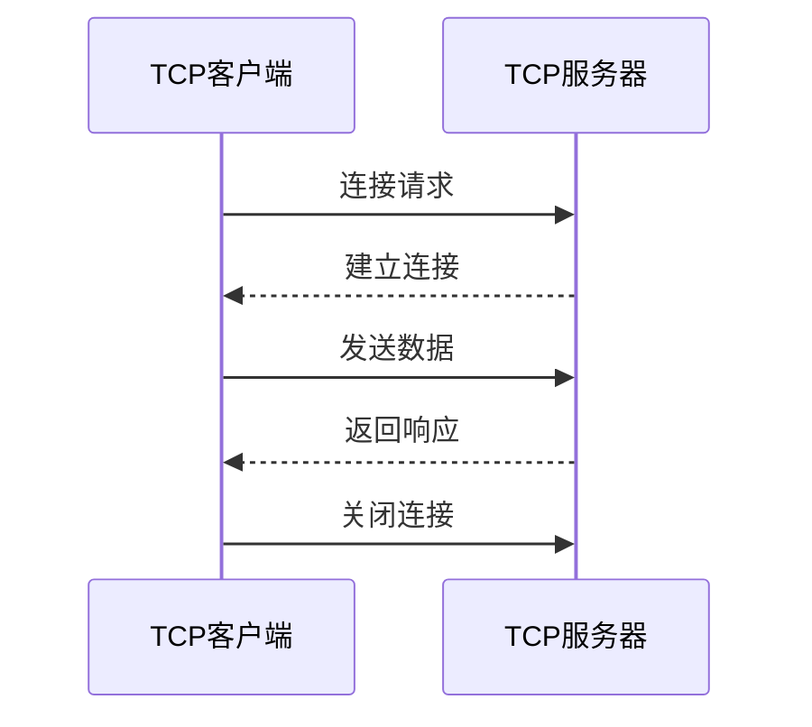
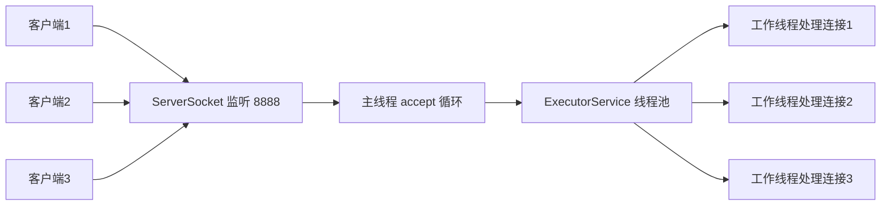

# 多线程与网络编程

本篇整理原笔记第十九、二十章。它们属于核心 Java 之后的进阶内容，学习前应先熟悉类、接口、异常和 IO。

多线程解决“让多个任务看起来同时执行”，以及随之而来的“多个线程读写同一份数据时如何保证结果正确”；网络编程解决“两台主机上的两个程序如何交换数据”。这两部分经常一起出现：服务器要同时服务多个客户端，就必须为每个连接分配线程，再用线程池统一管理。

下面每个概念都按“是什么、为什么需要、怎么用加代码”的顺序展开。

## 1. 学习目标与前置知识

### 1.1 学习目标

- 能用四种方式创建线程，并说明各自取舍。
- 能说清 `start()` 与 `run()`、`sleep()` 与 `wait()` 的区别。
- 能画出线程的六种状态并解释进入条件。
- 能解释竞态条件的成因，并用 `synchronized`、`Lock`、原子类解决。
- 能写出 `wait` / `notifyAll` 和 `BlockingQueue` 两种生产者消费者实现。
- 能读懂 `ThreadPoolExecutor` 的七个参数并选择拒绝策略。
- 能理解 `volatile`、JMM、CAS 的作用与局限，能识别和排查死锁。
- 能写出一发一收的 TCP 程序，并扩展到多客户端。
- 能说出三次握手、四次挥手的过程和 `TIME_WAIT` 的意义。
- 能用 `DatagramSocket` 写 UDP 收发，能对比 BIO / NIO / AIO。

### 1.2 前置知识

- 类、继承、接口、匿名内部类与 Lambda 表达式。
- 受检异常的捕获与声明，尤其是 `InterruptedException`、`IOException`。
- IO 流：`InputStream` / `OutputStream` 的字节读写。
- 集合框架与泛型、`try-with-resources` 语法。

## 2. 进程、线程与并发

### 2.1 进程与线程

进程是操作系统分配资源的基本单位，拥有独立内存空间；线程是 CPU 调度的基本单位，同一进程内的线程共享堆和方法区，但各有自己的虚拟机栈和程序计数器。

正因为线程共享堆，线程之间交换数据很方便，也正是这份共享带来了线程安全问题。

### 2.2 为什么需要多线程

- 提高 CPU 利用率：等待磁盘、网络时 CPU 可以执行别的任务。
- 提高响应速度：界面线程显示，工作线程做耗时计算。
- 提高吞吐量：服务器为每个客户端连接分配一个线程。
- 简化模型：把大任务拆成若干独立小任务并行处理。

### 2.3 并发与并行

并发是多个任务在同一时间段内交替推进，并行是同一时刻真正同时执行。单核只能并发，多核可以并行。所以不能假设“线程 A 会一直执行到结束，线程 B 才开始”。

## 3. 创建线程的四种方式

### 3.1 方式一：继承 `Thread`

```java
public class MyThread extends Thread {
    @Override
    public void run() {
        for (int i = 0; i < 3; i++) {
            System.out.println(getName() + " 输出 " + i);
        }
    }

    public static void main(String[] args) {
        MyThread thread = new MyThread();
        thread.setName("工作线程");
        thread.start();
    }
}
```
写法直接，任务写在 `run()` 里。缺点是 Java 只支持单继承，继承 `Thread` 后不能再继承其他类，而且任务与线程绑定，无法复用。

### 3.2 方式二：实现 `Runnable`

```java
public class MyTask implements Runnable {
    @Override
    public void run() {
        System.out.println(Thread.currentThread().getName() + " 执行任务");
    }
}

public class RunnableDemo {
    public static void main(String[] args) {
        new Thread(new MyTask(), "任务线程").start();
    }
}
```
`Runnable` 是函数式接口，可以写成 Lambda：
```java
Thread thread = new Thread(() ->
        System.out.println("在线程中执行"));
thread.start();
```
任务被抽成 `Runnable` 后，同一个任务对象可以交给不同的线程或线程池执行，这是最常用的写法。

### 3.3 方式三：实现 `Callable` 配合 `FutureTask`

`Runnable.run()` 没有返回值，也不能抛受检异常。需要“执行完给我一个结果”时用 `Callable`。
```java
import java.util.concurrent.Callable;
import java.util.concurrent.FutureTask;

public class CallableDemo {
    public static void main(String[] args) throws Exception {
        Callable<Integer> task = () -> {
            int sum = 0;
            for (int i = 1; i <= 100; i++) {
                sum += i;
            }
            return sum;
        };

        FutureTask<Integer> futureTask = new FutureTask<>(task);
        new Thread(futureTask, "计算线程").start();

        System.out.println("结果：" + futureTask.get());
    }
}
```
`FutureTask` 同时实现 `Runnable` 和 `Future`，既能交给线程执行，又能取结果。`get()` 会阻塞到任务结束；任务内部抛异常时，`get()` 抛 `ExecutionException`，真正原因用 `getCause()` 取。

### 3.4 方式四：交给线程池

```java
import java.util.concurrent.ExecutorService;
import java.util.concurrent.Executors;

ExecutorService pool = Executors.newFixedThreadPool(2);
pool.submit(() -> System.out.println("处理任务"));
pool.shutdown();
```
任务只描述“要做什么”，线程的创建、复用、排队由池子负责，这是生产环境的标准做法，见第 11 节。

### 3.5 四种方式对比

| 方式 | 有返回值 | 能抛受检异常 | 可继承其他类 | 线程复用 | 评价 |
| --- | --- | --- | --- | --- | --- |
| 继承 `Thread` | 否 | 否 | 否 | 否 | 仅适合演示 |
| 实现 `Runnable` | 否 | 否 | 是 | 交给线程池可复用 | 常用 |
| `Callable` + `FutureTask` | 是 | 是 | 是 | 交给线程池可复用 | 需要结果时用 |
| 线程池 | 由任务决定 | 由任务决定 | 是 | 是 | 生产首选 |

### 3.6 `start()` 与 `run()` 的区别

| 对比项 | `start()` | `run()` |
| --- | --- | --- |
| 是否创建新线程 | 是 | 否，普通方法调用 |
| 在哪个线程执行 | 新线程 | 当前调用者线程 |
| 可调用次数 | 一个线程对象只能一次 | 可以多次 |
| 重复调用后果 | 抛 `IllegalThreadStateException` | 正常执行 |

```java
Thread thread = new Thread(() ->
        System.out.println("当前线程：" + Thread.currentThread().getName()));

thread.run();   // 输出 main，仍在主线程里跑
thread.start(); // 输出 Thread-0，这才是新线程
```
`start()` 会通知 JVM 创建新线程，新线程启动后回调 `run()`；直接调 `run()` 没有任何线程创建动作。

## 4. `Thread` 常用方法

### 4.1 `currentThread()` 与线程名

```java
Thread current = Thread.currentThread();
System.out.println(current.getName() + " / " + current.getId());
current.setName("订单处理线程");
```
`currentThread()` 是静态方法，返回正在执行这行代码的线程对象。日志里带上线程名能大幅降低并发问题排查难度。

### 4.2 `sleep(long millis)`

```java
try {
    Thread.sleep(1000);
} catch (InterruptedException e) {
    Thread.currentThread().interrupt();
}
```

- 它是静态方法，写 `thread.sleep(1000)` 休眠的是当前线程，不是 `thread`。
- 声明了受检异常 `InterruptedException`，必须处理。
- 休眠期间让出 CPU，但不释放已持有的锁。
- 时间到后回到 `RUNNABLE`，能否立刻执行取决于调度。

### 4.3 `join()` 与 `join(long)`

`join()` 让当前线程等待目标线程结束再继续。
```java
worker.start();
worker.join();    // 一直等到 worker 结束
worker.join(500); // 最多等 500 毫秒，时间到就继续
```
常见用途是主线程等待所有子任务完成后汇总结果。

### 4.4 `interrupt()` 与 `InterruptedException`

`interrupt()` 不是强杀线程，而是设置中断标记，如何响应由线程自己的代码决定：处于 `sleep`、`wait`、`join` 的线程会抛 `InterruptedException` 并清除标记；运行中的线程只是标记变为 `true`，需要主动检查。
```java
Thread worker = new Thread(() -> {
    while (!Thread.currentThread().isInterrupted()) {
        try {
            Thread.sleep(500);
            System.out.println("工作中");
        } catch (InterruptedException e) {
            Thread.currentThread().interrupt(); // 恢复中断标记
            break;
        }
    }
    System.out.println("线程退出");
});

worker.start();
Thread.sleep(1200);
worker.interrupt();
```
`isInterrupted()` 只读取标记，`Thread.interrupted()` 读取并清除标记。捕获异常后要么继续抛出，要么恢复标记，不要静默吞掉。

### 4.5 `setDaemon(true)` 守护线程

守护线程为其他线程服务，所有非守护线程结束后 JVM 直接退出，不再等待守护线程。垃圾回收线程就是典型代表。
```java
Thread daemon = new Thread(() -> System.out.println("后台任务"));
daemon.setDaemon(true);
daemon.start();
```
`setDaemon()` 必须在 `start()` 之前调用，否则抛 `IllegalThreadStateException`。

### 4.6 优先级与 `yield()`

优先级范围 1 到 10，常用常量有 `Thread.MIN_PRIORITY`、`Thread.NORM_PRIORITY`（默认 5）、`Thread.MAX_PRIORITY`。它只是给调度器的提示，不能保证执行顺序。
```java
Thread t = new Thread(() -> System.out.println("高优先级线程"));
t.setPriority(Thread.MAX_PRIORITY);
t.start();
```
`yield()` 表示愿意让出本次时间片，线程回到就绪状态重新竞争，同样只是建议。

### 4.7 常用方法一览

| 方法 | 作用 | 是否释放锁 | 注意点 |
| --- | --- | --- | --- |
| `currentThread()` | 获取当前线程 | 无关 | 静态方法 |
| `getName()` / `setName()` | 读写线程名 | 无关 | 排查问题必备 |
| `sleep(long)` | 休眠指定毫秒 | 不释放 | 静态方法，抛 `InterruptedException` |
| `join()` | 等待目标线程结束 | 不释放 | 当前线程进入 `WAITING` |
| `join(long)` | 最多等待指定毫秒 | 不释放 | 当前线程进入 `TIMED_WAITING` |
| `interrupt()` | 设置中断标记或唤醒阻塞 | 无关 | 不强制终止线程 |
| `setDaemon(boolean)` | 设置守护线程 | 无关 | 必须在 `start()` 前调用 |
| `setPriority(int)` | 设置优先级 | 无关 | 只是提示 |
| `yield()` | 让出本次时间片 | 不释放 | 静态方法，只是建议 |

## 5. 线程生命周期与六种状态

### 5.1 六种状态

`Thread.State` 是枚举，用 `thread.getState()` 读取。

| 状态 | 含义 | 典型进入方式 |
| --- | --- | --- |
| `NEW` | 已创建未启动 | `new Thread(...)` |
| `RUNNABLE` | 可运行（就绪或运行中） | 调用 `start()` 之后 |
| `BLOCKED` | 等待监视器锁 | 竞争 `synchronized` 锁失败 |
| `WAITING` | 无限期等待 | `wait()`、`join()` |
| `TIMED_WAITING` | 限时等待 | `sleep(ms)`、`join(ms)`、`wait(ms)` |
| `TERMINATED` | 已终止 | `run()` 结束或抛未捕获异常 |

### 5.2 状态转换图



### 5.3 状态细节

- Java 的 `RUNNABLE` 把操作系统的“就绪”和“运行”合并了，看到它只说明线程没被卡住，不代表正在占用 CPU，这是为了跨平台一致。
- `sleep(ms)` 进入 `TIMED_WAITING`，时间到直接回 `RUNNABLE`，因为它不持有锁。
- `join()` 无参进入 `WAITING`，`join(long)` 进入 `TIMED_WAITING`；`wait()` 进入 `WAITING`，`wait(long)` 进入 `TIMED_WAITING`。
- 从 `WAITING` 被 `notify()` 唤醒后不会立刻执行，只是从等待队列移到锁的竞争队列，会先进入 `BLOCKED`，拿到锁才回到 `RUNNABLE`。
- 抢占 `synchronized` 锁失败是唯一会进入 `BLOCKED` 的方式。

### 5.4 观察状态变化

```java
Thread t = new Thread(() -> {
    try {
        Thread.sleep(2000);
    } catch (InterruptedException e) {
        Thread.currentThread().interrupt();
    }
});

System.out.println(t.getState()); // NEW
t.start();
Thread.sleep(200);
System.out.println(t.getState()); // TIMED_WAITING
t.join();
System.out.println(t.getState()); // TERMINATED
```

## 6. 线程安全问题：竞态条件

### 6.1 成因

当多个线程同时读写同一份共享可变数据，且操作不是原子的、又没有同步时，结果就依赖线程执行顺序，这叫竞态条件。它需要三个条件同时成立：

1. 存在共享的可变状态。
2. 对它的操作不是原子操作（读、算、写可以被打断）。
3. 没有同步机制保证互斥或可见性。

### 6.2 计数器累加的例子

```java
public class Counter {
    private int count = 0;

    public void increase() {
        count++;
    }

    public int getCount() {
        return count;
    }
}

public class CounterTest {
    public static void main(String[] args) throws InterruptedException {
        Counter counter = new Counter();

        Thread t1 = new Thread(() -> {
            for (int i = 0; i < 10000; i++) {
                counter.increase();
            }
        });
        Thread t2 = new Thread(() -> {
            for (int i = 0; i < 10000; i++) {
                counter.increase();
            }
        });

        t1.start();
        t2.start();
        t1.join();
        t2.join();

        System.out.println("期望 20000，实际 " + counter.getCount());
    }
}
```
结果大多小于 20000 且每次都不同。原因是 `count++` 实际包含读取、加一、写回三步：两个线程可能同时读到 100，各自算出 101，再各自写回 101，一次累加就被吞掉了。

### 6.3 解决思路

| 思路 | 手段 | 适用场景 |
| --- | --- | --- |
| 互斥 | `synchronized`、`Lock` | 临界区含多步操作，必须串行 |
| 无共享 | 改成局部变量、用 `ThreadLocal` | 每个线程独立计算 |
| 不可变 | `final`、不可变对象 | 状态创建后不再改变 |
| 原子操作 | `AtomicInteger` 等原子类 | 简单计数、累加 |
| 线程安全容器 | `ConcurrentHashMap`、`BlockingQueue` | 多线程共享集合 |
| 消息传递 | 用队列传数据代替共享变量 | 生产者消费者模型 |

## 7. `synchronized` 关键字

### 7.1 是什么

`synchronized` 是 Java 内置的互斥同步手段，保证同一时刻只有一个线程能进入被保护的代码区域，同时保证进入的线程能看到之前线程对共享变量的修改。线程进入前必须获得锁，退出时自动释放，抛异常也会释放。

### 7.2 三种用法

修饰代码块，显式指定锁对象，粒度最小：
```java
public void sell() {
    synchronized (lock) {
        if (ticket > 0) {
            System.out.println(Thread.currentThread().getName() + " 卖出 " + ticket);
            ticket--;
        }
    }
}
```
修饰实例方法，锁是 `this`：
```java
public synchronized void sell() {
    if (ticket > 0) {
        ticket--;
    }
}
```
修饰静态方法，锁是类的 Class 对象：
```java
public static synchronized void init() {
    // 锁是 TicketService.class
}
```

| 用法 | 锁对象 | 影响范围 |
| --- | --- | --- |
| `synchronized (obj)` | 括号里的对象 | 使用同一对象的同步块之间互斥 |
| 修饰实例方法 | `this` | 同一实例的同步方法之间互斥 |
| 修饰静态方法 | `类名.class` | 全 JVM 中该类所有实例共享一把锁 |

### 7.3 锁对象必须唯一

只有当多个线程抢同一把锁时才互斥，下面的写法完全没有同步效果：
```java
public void sell() {
    Object lock = new Object(); // 每次调用都新建锁，等于没锁
    synchronized (lock) {
        ticket--;
    }
}
```
用 `String` 常量或可变对象当锁，还会带来跨类互斥或锁被换掉的隐患。规范做法是 `private final Object lock = new Object();`。

### 7.4 可重入性

同一个线程可以重复获得自己已持有的 `synchronized` 锁：
```java
public synchronized void outer() {
    inner();
}

public synchronized void inner() {
    System.out.println("重入成功，不会死锁");
}
```
其余要点：锁范围尽量小，不要在同步块里做耗时 IO，不要在同步块里调用外部可重写的方法，涉及多把锁时所有线程按同一顺序获取。

## 8. `Lock` 与 `ReentrantLock`

### 8.1 为什么需要 `Lock`

`synchronized` 获取锁的过程无法被打断，拿不到就只能一直等。需要“尝试一次拿不到就走”“最多等 3 秒”“公平排队”时，就要用 `ReentrantLock`。

### 8.2 `lock()` 与 `unlock()` 必须放进 `try-finally`

```java
private final Lock lock = new ReentrantLock();
private int count = 0;

public void increase() {
    lock.lock();
    try {
        count++;
    } finally {
        lock.unlock();
    }
}
```
`synchronized` 会自动释放锁，`Lock` 必须手动释放。如果临界区抛异常而没释放，其他线程会永久阻塞。

### 8.3 `tryLock()` 尝试获取锁

```java
boolean locked = false;
try {
    locked = lock.tryLock(1, TimeUnit.SECONDS);
    if (!locked) {
        System.out.println("等待 1 秒仍未拿到锁，放弃本次操作");
        return;
    }
    count++;
} catch (InterruptedException e) {
    Thread.currentThread().interrupt();
} finally {
    if (locked) {
        lock.unlock(); // 只有真的拿到锁才解锁
    }
}
```
`tryLock()` 无参版本立即返回；`tryLock(long, TimeUnit)` 会等待指定时间并可被中断。`lockInterruptibly()` 在等待锁的过程中也能响应中断，而 `lock()` 不行。

### 8.4 公平锁与 `Condition`

`new ReentrantLock(true)` 创建公平锁，等待最久的线程优先获得锁，代价是吞吐下降，默认是非公平锁。

`Lock` 可以通过 `newCondition()` 创建多个条件变量，把等待不同条件的线程分到不同队列：
```java
private final Lock lock = new ReentrantLock();
private final Condition notFull = lock.newCondition();
private final Condition notEmpty = lock.newCondition();
```
`Condition.await()` 对应 `Object.wait()`，`signal()` 对应 `notify()`，`signalAll()` 对应 `notifyAll()`，同样必须在持有锁时调用。

### 8.5 `synchronized` 与 `Lock` 对比

| 对比项 | `synchronized` | `Lock` / `ReentrantLock` |
| --- | --- | --- |
| 层次 | JVM 关键字 | JDK 接口 |
| 释放锁 | 自动，含异常 | 手动 `unlock()`，放 `finally` |
| 等待可否中断 | 不可以 | `lockInterruptibly()` 可以 |
| 是否可超时 | 不可以 | `tryLock(时间)` 可以 |
| 公平性 | 只能非公平 | 可选公平 |
| 条件变量 | 一个等待队列 | 可创建多个 `Condition` |
| 读写分离 | 不支持 | `ReentrantReadWriteLock` 支持 |
| 使用复杂度 | 低，不易出错 | 高，忘记解锁会死锁 |

原则是能用 `synchronized` 就先用它，需要超时、中断、公平或读写分离时再换成 `Lock`。

## 9. `wait()` / `notify()` / `notifyAll()`

### 9.1 三个方法

它们都是 `Object` 的方法，用来表达“条件没满足，我先让出锁等一会儿”。必须在 `synchronized` 块中调用，否则抛 `IllegalMonitorStateException`。

| 方法 | 作用 | 是否释放锁 |
| --- | --- | --- |
| `wait()` | 释放锁进入 `WAITING` 直到被唤醒 | 释放 |
| `wait(long)` | 最多等待指定毫秒 | 释放 |
| `notify()` | 随机唤醒一个在该对象上等待的线程 | 调用者不释放 |
| `notifyAll()` | 唤醒所有等待线程 | 调用者不释放 |

`notify()` 只是把线程移到锁的竞争队列，被唤醒的线程要等调用者退出同步块释放锁后才能继续抢锁。

### 9.2 判断条件要用 `while` 而不是 `if`

等待的线程可能在没有真正满足条件时醒来，这叫虚假唤醒。用 `while` 会在醒来后重新检查条件。
```java
synchronized (lockObj) {
    while (!conditionMet()) { // 正确写法
        lockObj.wait();
    }
    doSomething();
}
```

### 9.3 生产者消费者完整代码

```java
public class BoundedBuffer {
    private final int[] buffer;
    private int count = 0;
    private int putIndex = 0;
    private int takeIndex = 0;

    public BoundedBuffer(int capacity) {
        this.buffer = new int[capacity];
    }

    public synchronized void put(int value) throws InterruptedException {
        while (count == buffer.length) {
            wait(); // 缓冲区满，生产者等待
        }
        buffer[putIndex] = value;
        putIndex = (putIndex + 1) % buffer.length;
        count++;
        notifyAll(); // 有新元素，通知消费者
    }

    public synchronized int take() throws InterruptedException {
        while (count == 0) {
            wait(); // 缓冲区空，消费者等待
        }
        int value = buffer[takeIndex];
        takeIndex = (takeIndex + 1) % buffer.length;
        count--;
        notifyAll(); // 有空位，通知生产者
        return value;
    }
}
```
```java
public static void main(String[] args) {
    BoundedBuffer buffer = new BoundedBuffer(3);

    Thread producer = new Thread(() -> {
        try {
            for (int i = 1; i <= 10; i++) {
                buffer.put(i);
                System.out.println("生产 " + i);
            }
        } catch (InterruptedException e) {
            Thread.currentThread().interrupt();
        }
    }, "生产者");

    Thread consumer = new Thread(() -> {
        try {
            for (int i = 1; i <= 10; i++) {
                System.out.println("消费 " + buffer.take());
            }
        } catch (InterruptedException e) {
            Thread.currentThread().interrupt();
        }
    }, "消费者");

    producer.start();
    consumer.start();
}
```
这里用 `notifyAll()` 而不是 `notify()`：两类线程等在同一对象上，只唤醒一个恰好是同类线程时，可能出现双方都睡回去、整体卡住的情况。

### 9.4 生产者消费者时序图



### 9.5 `wait()` 与 `sleep()` 对比

| 对比项 | `wait()` | `sleep(long)` |
| --- | --- | --- |
| 所属 | `Object` 的方法 | `Thread` 的静态方法 |
| 是否释放锁 | 释放 | 不释放 |
| 调用前提 | 必须持有该对象的锁 | 无要求 |
| 唤醒方式 | `notify()` / `notifyAll()` 或超时 | 时间到自然醒 |
| 进入状态 | `WAITING` / `TIMED_WAITING` | `TIMED_WAITING` |

## 10. 阻塞队列 `BlockingQueue`

### 10.1 四组方法的区别

`BlockingQueue` 在普通队列上增加了“满时放入等待、空时取出等待”的能力，用它实现生产者消费者不需要自己写 `wait` / `notify`。

| 操作 | 抛异常 | 返回特殊值 | 一直阻塞 | 超时退出 |
| --- | --- | --- | --- | --- |
| 插入 | `add(e)` | `offer(e)` 返回 `false` | `put(e)` | `offer(e, timeout, unit)` |
| 移除 | `remove()` | `poll()` 返回 `null` | `take()` | `poll(timeout, unit)` |
| 检查队首 | `element()` | `peek()` 返回 `null` | 无 | 无 |

- `put` / `take` 会一直阻塞，适合生产与消费速度不一致的场景。
- `offer(e, timeout, unit)` / `poll(timeout, unit)` 限时等待，适合不希望无限期卡住。
- `offer` / `poll` 不阻塞，适合“放不下就丢弃”。

### 10.2 常见实现类

| 实现类 | 存储结构 | 容量 | 锁粒度 |
| --- | --- | --- | --- |
| `ArrayBlockingQueue` | 数组 | 创建时必须指定 | 一把锁，读写互斥 |
| `LinkedBlockingQueue` | 链表 | 默认 `Integer.MAX_VALUE` | 两把锁，读写可并行 |
| `SynchronousQueue` | 不存储元素 | 容量 0 | 每次放入必须等到一次取出 |
| `PriorityBlockingQueue` | 二叉堆 | 默认无界 | 按优先级出队 |
| `DelayQueue` | 堆加延时 | 无界 | 到期才能出队 |

`LinkedBlockingQueue` 读写锁分离，并发吞吐通常更好，但默认容量几乎等于无界，需警惕内存问题。

### 10.3 用它改写生产者消费者模型

```java
BlockingQueue<Integer> queue = new ArrayBlockingQueue<>(3);

Thread producer = new Thread(() -> {
    try {
        for (int i = 1; i <= 10; i++) {
            queue.put(i);
            System.out.println("生产 " + i + "，队列长度 " + queue.size());
        }
    } catch (InterruptedException e) {
        Thread.currentThread().interrupt();
    }
}, "生产者");

Thread consumer = new Thread(() -> {
    try {
        while (true) {
            Integer value = queue.take();
            System.out.println("消费 " + value + "，队列长度 " + queue.size());
        }
    } catch (InterruptedException e) {
        Thread.currentThread().interrupt();
    }
}, "消费者");

producer.start();
consumer.start();
```
不需要任何 `synchronized`、`wait`、`notify`，阻塞与唤醒都在队列内部完成。实际项目中终止消费者通常用“毒丸对象”或配合中断。

## 11. 线程池

### 11.1 为什么不要每次手动 `new Thread`

- 线程创建销毁要占用系统资源，频繁创建会拖慢应用。
- 线程数量不可控，请求一来就新建，容易打满内存和 CPU。
- 缺少排队、拒绝、监控和优雅关闭能力。
- 线程复用减少创建开销，执行上下文更稳定。

核心思想是“线程复用、任务排队、容量可控”。

### 11.2 `ThreadPoolExecutor` 的七个构造参数

```java
ThreadPoolExecutor executor = new ThreadPoolExecutor(
        2,                                    // corePoolSize
        4,                                    // maximumPoolSize
        60L, TimeUnit.SECONDS,                 // keepAliveTime 与时间单位
        new ArrayBlockingQueue<>(5),           // workQueue
        Executors.defaultThreadFactory(),      // threadFactory
        new ThreadPoolExecutor.AbortPolicy()   // handler
);
```

1. `corePoolSize` 核心线程数：长期保留的线程，空闲也不回收。
2. `maximumPoolSize` 最大线程数：线程总数上限，必须大于等于核心线程数。
3. `keepAliveTime` 空闲存活时间：超出核心线程数的线程，空闲超过该时间就被回收。
4. `unit` 时间单位：`keepAliveTime` 的单位。
5. `workQueue` 工作队列：核心线程都忙时，新任务先入队等待。
6. `threadFactory` 线程工厂：决定线程如何创建，常用它给线程起有意义的名字。
7. `handler` 拒绝策略：队列满且线程数已达上限时的处理方式。

### 11.3 任务提交后的执行流程

注意不是“先创建到最大线程数再排队”，而是“先填满核心线程，再排队，队列满后才扩容到最大线程数”。

如果工作队列是无界队列，“队列已满”永远不成立，`maximumPoolSize` 也就永远用不上。

### 11.4 四种拒绝策略

| 策略 | 行为 | 适用场景 |
| --- | --- | --- |
| `AbortPolicy` | 抛 `RejectedExecutionException`，默认策略 | 希望快速失败 |
| `CallerRunsPolicy` | 由提交任务的调用线程自己执行 | 希望降速且不丢任务 |
| `DiscardPolicy` | 静默丢弃新任务 | 任务可丢且不打扰调用方 |
| `DiscardOldestPolicy` | 丢弃队列中最老的任务再尝试提交 | 只关心最新任务 |

`CallerRunsPolicy` 会占用调用线程，提交速度自然下降，起到类似背压的作用，代价是拖慢主流程。

### 11.5 `Executors` 的四个快捷工厂方法

| 方法 | 核心 / 最大线程数 | 工作队列 | 特点与场景 |
| --- | --- | --- | --- |
| `newFixedThreadPool(n)` | `n` / `n` | 无界 `LinkedBlockingQueue` | 线程数固定，负载稳定 |
| `newSingleThreadExecutor()` | 1 / 1 | 无界 `LinkedBlockingQueue` | 任务串行，保证顺序 |
| `newCachedThreadPool()` | 0 / `Integer.MAX_VALUE` | `SynchronousQueue` | 来任务就建线程，空闲 60 秒回收 |
| `newScheduledThreadPool(n)` | `n` / `Integer.MAX_VALUE` | 延时队列 | 定时、周期执行 |

```java
ScheduledExecutorService scheduled = Executors.newScheduledThreadPool(2);
scheduled.schedule(() -> System.out.println("3 秒后执行"), 3, TimeUnit.SECONDS);
scheduled.scheduleAtFixedRate(() -> System.out.println("每 2 秒执行"), 0, 2, TimeUnit.SECONDS);
```

### 11.6 为什么生产环境不推荐直接用 `Executors`

- `newFixedThreadPool` 和 `newSingleThreadExecutor` 用无界队列，任务堆积会抛 `OutOfMemoryError`，而且队列不满导致 `maximumPoolSize` 形同虚设。
- `newCachedThreadPool` 最大线程数是 `Integer.MAX_VALUE`，任务暴涨时会创建大量线程，耗尽内存。

正确做法是直接使用 `ThreadPoolExecutor` 构造方法，显式指定有界队列和拒绝策略。线程数方面，CPU 密集型任务接近 CPU 核数，IO 密集型可以更大，具体数值靠压测确定。

### 11.7 关闭与监控

```java
executor.shutdown();      // 不再接收新任务，已提交的任务继续执行完
// executor.shutdownNow(); // 尝试中断执行中的任务，返回未执行的任务列表
boolean stopped = executor.awaitTermination(5, TimeUnit.SECONDS);
System.out.println("是否全部结束：" + stopped);
```
`shutdown()` 不会阻塞，需要配合 `awaitTermination` 等待真正结束。监控常用 `getPoolSize()`、`getActiveCount()`、`getQueue().size()`、`getCompletedTaskCount()`，把它们打到日志里才能发现队列堆积。

## 12. `Callable`、`Future` 与批量提交

### 12.1 `submit()` 与 `execute()` 的区别

| 对比项 | `execute(Runnable)` | `submit(...)` |
| --- | --- | --- |
| 定义位置 | `Executor` | `ExecutorService` |
| 返回值 | 无 | `Future` |
| 能否取结果 | 不能 | 可以 |
| 任务内异常 | 由未捕获异常处理器处理，容易被忽略 | 由 `Future` 捕获，`get()` 时抛出 |

```java
executor.execute(() -> System.out.println("没有返回值"));
Future<Integer> future = executor.submit(() -> 42);
```
`Runnable` 也能提交给 `submit()`，此时 `get()` 返回 `null`，但异常仍能通过 `get()` 拿到，比 `execute()` 更容易排查问题。

### 12.2 `Future.get()` 阻塞与超时

```java
Future<Integer> future = executor.submit(() -> 42);

try {
    Integer result = future.get(1, TimeUnit.SECONDS); // 最多等 1 秒
    System.out.println(result);
} catch (TimeoutException e) {
    future.cancel(true); // 任务能响应中断时才会真的停下来
} catch (ExecutionException e) {
    e.getCause().printStackTrace(); // 任务内部真正的异常
} catch (InterruptedException e) {
    Thread.currentThread().interrupt();
}
```
无参 `get()` 会一直等到任务结束，`get(timeout, unit)` 超时后抛 `TimeoutException`。

### 12.3 `invokeAll` 与 `invokeAny`

```java
List<Callable<Integer>> tasks = List.of(
        () -> 1 + 1,
        () -> 2 + 2,
        () -> 3 + 3
);

List<Future<Integer>> futures = executor.invokeAll(tasks);
for (Future<Integer> f : futures) {
    System.out.println(f.get());
}
```
`invokeAll` 等所有任务结束，返回与任务顺序一致的 `Future` 列表，还有带超时的重载，超时后未完成的任务会被取消。`invokeAny` 只返回最先成功完成的结果并取消其余任务。

## 13. 并发容器与同步工具类

### 13.1 `ConcurrentHashMap`

`Hashtable` 用 `synchronized` 修饰所有方法，等于给整张表加一把大锁。`ConcurrentHashMap` 把并发控制细化：JDK 7 用分段锁把表分成若干段，不同段互不影响；JDK 8 之后改为数组加链表加红黑树，锁的粒度细化到单个桶，配合 CAS 完成空桶插入和计数。
```java
ConcurrentHashMap<String, Integer> map = new ConcurrentHashMap<>();
map.put("a", 1);
map.merge("a", 1, Integer::sum);        // 原子地完成“取旧值加一写回”
map.computeIfAbsent("b", key -> 0);     // 不存在才计算并放入
```
两个注意点：它不允许 `null` 键和 `null` 值，因为并发下无法区分“不存在”和“值是 null”；单个方法原子，但“先检查再操作”的组合不原子，要用 `putIfAbsent`、`computeIfAbsent`、`merge` 这类复合方法。

### 13.2 `CopyOnWriteArrayList`

写时复制的思路是读操作不加锁，写操作先复制一份新数组，改完把引用指过去，适合读多写少的场景。
```java
CopyOnWriteArrayList<String> list = new CopyOnWriteArrayList<>();
list.add("A");
for (String item : list) {
    System.out.println(item); // 迭代期间其他线程写入不会抛异常
}
```
常见用途是监听器列表、配置项缓存。它不适合频繁写入，因为每次写都要复制整个数组；迭代器拿到的是写入时刻的快照，属于弱一致性。

### 13.3 `CountDownLatch`

它像一个倒计时门闩，构造时给定计数，`countDown()` 减一，`await()` 阻塞直到计数为 0，是一次性的。
```java
CountDownLatch latch = new CountDownLatch(3);

for (int i = 1; i <= 3; i++) {
    int index = i;
    new Thread(() -> {
        try {
            System.out.println("任务 " + index + " 完成");
        } finally {
            latch.countDown(); // 无论成功失败都要减一
        }
    }).start();
}

latch.await(5, TimeUnit.SECONDS); // 也可以不带超时
```
常见用途是主线程等待所有子任务完成、压测时让多个线程同时开始。需要重复使用计数时应改用 `CyclicBarrier`。

### 13.4 `Semaphore`

它用来限制同时访问某个资源的线程数，`acquire()` 取许可，`release()` 归还许可。
```java
Semaphore semaphore = new Semaphore(2);

new Thread(() -> {
    try {
        semaphore.acquire();
        System.out.println("获得许可，开始处理");
        Thread.sleep(500);
    } catch (InterruptedException e) {
        Thread.currentThread().interrupt();
    } finally {
        semaphore.release(); // 必须归还，否则许可会泄漏
    }
}).start();
```
`tryAcquire()` 和 `tryAcquire(timeout, unit)` 可以避免无限等待。与 `CountDownLatch` 的区别是：前者等别人做完，计数只减不加；后者限制同时做的人数，许可有借有还。

## 14. `volatile` 与 Java 内存模型

### 14.1 主内存与工作内存

Java 内存模型（JMM）规定：共享变量存在主内存，每个线程有自己的工作内存，读写时先把变量复制到工作内存，操作完再写回。因为多了一层复制，一个线程改了值，另一个线程可能还在用旧副本，这就是可见性问题；再加上编译器和 CPU 会重排指令，还有有序性问题。

### 14.2 `volatile` 的作用

```java
public class VolatileFlag {
    private volatile boolean running = true;

    public void stop() {
        running = false;
    }

    public void work() {
        while (running) {
            // 做事情
        }
        System.out.println("收到停止信号，退出循环");
    }
}
```
`volatile` 保证两点：写会立刻刷新到主内存、读会直接读最新值，也就是可见性；禁止与前后操作重排序，也就是有序性。

它不保证原子性，`count++` 用 `volatile` 修饰依旧不安全，因为读、改、写三步仍可能交错，需要原子类或加锁。

### 14.3 happens-before

happens-before 是 JMM 判断“一个线程的写对另一个线程是否可见”的规则：如果 A happens-before B，那么 A 对共享变量的修改在 B 开始时一定可见。常见规则有：

- 程序顺序规则：同一线程里前面的操作 happens-before 后面的操作。
- 监视器锁规则：对同一个锁的解锁 happens-before 后续对它加锁。
- `volatile` 规则：对 `volatile` 变量的写 happens-before 后续对它的读。
- 线程启动规则：`start()` happens-before 新线程中的任何操作。
- 线程终止规则：线程中所有操作 happens-before 其他线程从 `join()` 成功返回。

### 14.4 双重检查锁单例为什么要加 `volatile`

```java
public class Singleton {
    private static volatile Singleton instance;

    private Singleton() {
    }

    public static Singleton getInstance() {
        if (instance == null) {
            synchronized (Singleton.class) {
                if (instance == null) {
                    instance = new Singleton();
                }
            }
        }
        return instance;
    }
}
```
`instance = new Singleton()` 可以拆成“分配内存、初始化对象、把引用赋给 `instance`”。如果重排成“分配内存、赋值引用、初始化对象”，另一个线程第一次检查就会看到非 `null` 但尚未初始化完成的对象。加 `volatile` 禁止这种重排，保证看到引用时对象一定构造完成。

## 15. 原子类与 CAS

### 15.1 `AtomicInteger`

```java
AtomicInteger counter = new AtomicInteger(0);

int after = counter.incrementAndGet();      // 先加再返回
int before = counter.getAndIncrement();     // 先返回再加
counter.addAndGet(5);
boolean ok = counter.compareAndSet(after, 100); // 期望值匹配才更新
int current = counter.get();
```
这些方法都是原子的，不需要加锁，性能通常优于 `synchronized`。常用原子类还有 `AtomicLong`、`AtomicBoolean`、`AtomicReference`。

### 15.2 CAS 的“比较并交换”语义

```text
如果 当前值 == 期望值：
    把当前值更新为新值，返回 true
否则：
    什么都不做，返回 false
```
整个“比较加更新”由一条 CPU 指令完成，中间不会被打断。`incrementAndGet()` 的实现就是一个自旋循环：读出当前值、算出新值、用 CAS 尝试更新，失败就重来。

CAS 是乐观策略：假设冲突少，冲突了就重试；`synchronized` 是悲观策略：先进临界区再说。

### 15.3 ABA 问题

CAS 只比较“值是否等于期望值”，无法察觉这个值被别人改过又改回来。例如值本来是 100，线程 A 读到期望值 100，此时线程 B 改成 200 又改回 100，A 的 CAS 依然成功，但中间状态已经被破坏。加减场景通常无害，但“引用是否被换过”这类场景就可能出错。

解决办法是给值配一个版本号：
```java
AtomicStampedReference<Integer> reference = new AtomicStampedReference<>(100, 0);

int stamp = reference.getStamp();
boolean updated = reference.compareAndSet(100, 200, stamp, stamp + 1);
```
每次修改版本号都加一，即使值变回原样，版本号也对不上，CAS 就会失败。另一个选择是 `AtomicMarkableReference`，用布尔标记表示是否被改过。

## 16. 死锁

### 16.1 四个必要条件

| 条件 | 含义 |
| --- | --- |
| 互斥 | 资源同一时刻只能被一个线程占用 |
| 请求与保持 | 持有至少一个资源，同时又去请求别的资源 |
| 不可剥夺 | 资源只能由持有者主动释放 |
| 循环等待 | 存在线程与资源的环形等待链 |

四个条件同时成立才会死锁，破坏任意一个就能避免，最容易破坏的是循环等待。

### 16.2 复现死锁

```java
public class DeadLockDemo {
    private static final Object LOCK_A = new Object();
    private static final Object LOCK_B = new Object();

    public static void main(String[] args) {
        new Thread(() -> {
            synchronized (LOCK_A) {
                System.out.println("线程 1 持有 A，想拿 B");
                sleep();
                synchronized (LOCK_B) {
                    System.out.println("线程 1 同时持有 A 和 B");
                }
            }
        }, "线程1").start();

        new Thread(() -> {
            synchronized (LOCK_B) {
                System.out.println("线程 2 持有 B，想拿 A");
                sleep();
                synchronized (LOCK_A) {
                    System.out.println("线程 2 同时持有 A 和 B");
                }
            }
        }, "线程2").start();
    }

    private static void sleep() {
        try {
            Thread.sleep(100);
        } catch (InterruptedException e) {
            Thread.currentThread().interrupt();
        }
    }
}
```
运行时通常只看到前两行输出，两个线程各持一把锁并等待对方释放，程序永远不会结束。


### 16.3 如何避免

- 固定加锁顺序：所有线程都按 A 再 B 的顺序获取，就不会出现环形等待，这是最实用的做法。
- 使用 `tryLock(timeout)`：拿不到就释放已持有的锁并重试。
- 缩小锁范围，减少嵌套锁，不在持有锁时调用外部方法。

### 16.4 如何排查

- `jps` 找到进程号，执行 `jstack <pid>`，有死锁时输出会出现 `Found one Java-level deadlock:`，并列出互相等待的线程、持有的锁和等待的锁。
- `jconsole` 或 `jvisualvm` 连接进程后，有专门的“检测死锁”按钮，可以直接看到死锁线程的堆栈。
- `jstack -l <pid>` 会额外输出 `Ownable synchronizers`，对 `ReentrantLock` 造成的死锁更有帮助。

排查关键是看清“谁持有哪把锁、在等哪把锁”，再回代码里找加锁顺序不一致的地方。

## 17. 网络编程三要素

网络通信三要素是 IP 地址、端口号和协议。

### 17.1 IP 地址

IP 地址用于在网络中定位主机。IPv4 是 32 位，点分十进制表示，例如 `192.168.1.10`；IPv6 是 128 位，冒号分隔的十六进制表示；`127.0.0.1` 是本机回环地址，`localhost` 通常解析到它。

Java 用 `InetAddress` 表示 IP 地址：
```java
InetAddress local = InetAddress.getLocalHost();
System.out.println(local.getHostName() + " / " + local.getHostAddress());

InetAddress remote = InetAddress.getByName("www.example.com");
System.out.println(remote.getHostAddress()); // 域名解析，失败抛 UnknownHostException
```
`getByName()` 既能传域名也能传 IP 字符串，`getLocalHost()` 返回本机地址，`getHostAddress()` 返回 IP 字符串。

### 17.2 端口号

端口号用于区分同一台主机上的不同程序，范围 0 到 65535。

| 范围 | 名称 | 说明 |
| --- | --- | --- |
| 0 - 1023 | 系统端口（知名端口） | HTTP、HTTPS、SSH 等标准服务，普通程序绑定通常需要管理员权限 |
| 1024 - 49151 | 注册端口 | 用户程序或第三方软件，例如 MySQL 的 3306、Tomcat 的 8080 |
| 49152 - 65535 | 动态端口 | 客户端发起连接时由操作系统临时分配 |

一个端口同一时刻通常只能被一个服务端程序监听，绑定已占用的端口会抛 `BindException`，开发时建议使用 1024 以上的端口。

### 17.3 协议

协议是双方约定好的通信规则，包括数据格式、交互顺序和出错处理。最常用的是 TCP 和 UDP，它们在可靠性、效率、连接方式上的取舍完全不同。UDP 面向数据报，速度快但不保证到达；TCP 面向连接，提供可靠、有序的字节流。

## 18. TCP 三次握手与四次挥手

### 18.1 三次握手

TCP 面向连接，通信前双方必须确认彼此都能收发，并协商初始序号。


- 第一次：客户端告诉服务端“我要连接，我的初始序号是 x”。
- 第二次：服务端告诉客户端“我收到了，我的初始序号是 y”。
- 第三次：客户端确认收到了服务端的应答。

为什么建立连接是三次而不是两次：如果只有两次，服务端发出应答后就认定连接建立，但它并不知道客户端是否收到了自己的 SYN。假如客户端因超时重发 SYN，服务端会为一个早已失效的请求保留连接资源。第三次确认让双方真正同步。

### 18.2 四次挥手


为什么关闭连接是四次：TCP 是全双工的，两个方向要各自关闭。被动关闭方收到 FIN 后内核立刻回 ACK 表示“我知道你要关了”，但它可能还有数据没发完，应用程序也不会马上 close，所以 ACK 和它自己的 FIN 无法合并。而建立连接时服务端的 SYN 和 ACK 在同一个报文里，所以能省掉一次。

`TIME_WAIT` 的意义有两个：一是确保最后一个 ACK 能到达对方，如果这个 ACK 丢了，对方会重发 FIN，本端还在等待期就能重新应答，否则对方会收到 RST；二是让本次连接中迟到的旧报文彻底消亡，避免被使用相同四元组的新连接误认。

服务端出现大量 `TIME_WAIT` 通常是短连接频繁创建造成的，属正常现象；大量 `CLOSE_WAIT` 往往说明代码里忘了 `close()`。

### 18.3 TCP 与 UDP 对比

| 对比项 | TCP | UDP |
| --- | --- | --- |
| 连接方式 | 面向连接，需要三次握手 | 无连接，直接发送 |
| 可靠性 | 可靠，有确认、重传、排序 | 不保证到达和顺序 |
| 传输形式 | 字节流 | 数据报，一次发送对应一次接收 |
| 首部开销 | 最小 20 字节 | 固定 8 字节 |
| 传输效率 | 相对慢 | 相对快 |
| 适用场景 | 文件传输、网页、数据库连接 | 视频直播、语音通话、DNS、游戏心跳 |

### 18.4 一次完整通信的时序



## 19. TCP 编程：`Socket` 与 `ServerSocket`

### 19.1 常用 API

客户端用 `Socket` 主动连接服务端，服务端用 `ServerSocket` 监听端口并 `accept()` 得到一个 `Socket`，之后双方通过 `Socket` 上的流读写数据。

| 方法 | 所属 | 作用 |
| --- | --- | --- |
| `new ServerSocket(int port)` | `ServerSocket` | 在指定端口创建监听 |
| `accept()` | `ServerSocket` | 阻塞等待客户端连接，返回一个新的 `Socket` |
| `setSoTimeout(int)` | `ServerSocket` 或 `Socket` | 设置超时，超时抛 `SocketTimeoutException` |
| `new Socket(String host, int port)` | `Socket` | 连接指定主机和端口 |
| `getInputStream()` / `getOutputStream()` | `Socket` | 获取输入流 / 输出流 |
| `getInetAddress()` / `getPort()` | `Socket` | 获取对端地址 / 端口 |
| `shutdownOutput()` / `shutdownInput()` | `Socket` | 半关闭输出 / 输入方向 |

TCP 的 `read()` 返回 `-1` 表示对端已关闭输出方向，也就是 EOF，与读文件到结尾语义相同。

### 19.2 服务端

```java
import java.io.*;
import java.net.ServerSocket;
import java.net.Socket;
import java.nio.charset.StandardCharsets;

public class TcpServer {
    public static void main(String[] args) throws IOException {
        ServerSocket serverSocket = new ServerSocket(8888);
        System.out.println("服务端启动，监听 8888");

        try (Socket socket = serverSocket.accept()) {
            System.out.println("客户端已连接：" + socket.getInetAddress().getHostAddress());

            byte[] buffer = new byte[1024];
            int len = socket.getInputStream().read(buffer);
            System.out.println("收到：" + new String(buffer, 0, len, StandardCharsets.UTF_8));

            OutputStream out = socket.getOutputStream();
            out.write("你好，我是服务端".getBytes(StandardCharsets.UTF_8));
            out.flush();
        }

        serverSocket.close();
    }
}
```
`accept()` 会一直阻塞到有客户端连接。读取时必须把实际长度 `len` 传给 `String` 构造器，否则缓冲区里没读到的 `0` 也会被转成字符。

### 19.3 客户端

```java
import java.io.*;
import java.net.Socket;
import java.nio.charset.StandardCharsets;

public class TcpClient {
    public static void main(String[] args) throws IOException {
        try (Socket socket = new Socket("127.0.0.1", 8888)) {
            OutputStream out = socket.getOutputStream();
            out.write("你好，我是客户端".getBytes(StandardCharsets.UTF_8));
            out.flush();

            byte[] buffer = new byte[1024];
            int len = socket.getInputStream().read(buffer);
            System.out.println("收到：" + new String(buffer, 0, len, StandardCharsets.UTF_8));
        }
    }
}
```

### 19.4 运行顺序与注意点

1. 先启动服务端再启动客户端，顺序反了会抛 `ConnectException: Connection refused`。
2. 双方必须使用同一端口，端口以服务端绑定的为准。
3. `read()` 是阻塞的，对端既不发数据也不关闭连接时会一直等，应设置 `setSoTimeout()`。
4. 一次 `read()` 不保证读完对端一次写入的全部数据，TCP 没有消息边界。要按“一行一条消息”处理，可以用 `BufferedReader.readLine()` 配合换行符，或自定义“长度加内容”的协议。
5. 关闭连接前先 `flush()`，否则缓冲区里的数据可能还没发出去。

## 20. 多客户端与半关闭

### 20.1 为每个连接提交一个任务到线程池

前面的服务端一次只能服务一个客户端，因为主线程被 `accept()` 之后处理数据的代码占住了。正确做法是主线程只负责 `accept()`，每拿到一个连接就交给线程池。

```java
public class ThreadPoolTcpServer {
    public static void main(String[] args) throws IOException {
        ExecutorService pool = Executors.newFixedThreadPool(8);
        ServerSocket serverSocket = new ServerSocket(8888);

        while (true) {
            Socket socket = serverSocket.accept();
            pool.submit(() -> handle(socket));
        }
    }

    private static void handle(Socket socket) {
        try (Socket s = socket) {
            byte[] buffer = new byte[1024];
            int len;
            while ((len = s.getInputStream().read(buffer)) != -1) {
                System.out.println("收到：" + new String(buffer, 0, len, StandardCharsets.UTF_8));
            }
            System.out.println("客户端已断开");
        } catch (IOException e) {
            System.out.println("连接处理失败：" + e.getMessage());
        }
    }
}
```
这里的 `read()` 会循环到对端关闭为止，因此要求客户端发送完后调用 `shutdownOutput()`。

### 20.2 半关闭 `shutdownOutput()`

`Socket` 是全双工的，关闭可以分方向进行：`shutdownOutput()` 只关闭本端的发送方向，本端仍可继续读对端数据；`shutdownInput()` 相反。

文件上传必须用它：客户端把文件写完，但不能直接 `close()`，因为还要读服务端返回的结果。`shutdownOutput()` 同时满足了两件事：告诉服务端“我发完了”，又能继续收结果。
```java
try (Socket socket = new Socket("127.0.0.1", 8888)) {
    OutputStream out = socket.getOutputStream();
    Files.copy(Paths.get("上传文件.txt"), out);
    socket.shutdownOutput(); // 数据发完，但还要读服务端响应

    int code = socket.getInputStream().read();
    System.out.println("服务端返回：" + code); // 1 表示成功
}
```
不调用 `shutdownOutput()`，服务端的循环读永远等不到 EOF，会认为文件没传完；反过来直接 `close()` 而不等响应，客户端收不到结果，服务端写响应时还可能触发 `Connection reset`。服务端接收文件时应限制大小和类型，并用 `Files.copy(in, target)` 这类流式写入，避免把整个文件读进内存。

## 21. UDP 编程

UDP 使用 `DatagramSocket` 和 `DatagramPacket`。单播发送给一个地址，组播发送给一组订阅者，广播发送给局域网内符合条件的主机。练习可以从本机回环地址开始，再尝试文件上传和多发多收。

### 21.1 发送端

```java
public class UdpSender {
    public static void main(String[] args) throws IOException {
        try (DatagramSocket socket = new DatagramSocket()) {
            byte[] data = "你好，UDP".getBytes(StandardCharsets.UTF_8);
            DatagramPacket packet = new DatagramPacket(
                    data, data.length, InetAddress.getByName("127.0.0.1"), 9999);
            socket.send(packet);
            System.out.println("已发送 " + data.length + " 字节");
        }
    }
}
```

### 21.2 接收端

```java
public class UdpReceiver {
    public static void main(String[] args) throws IOException {
        try (DatagramSocket socket = new DatagramSocket(9999)) {
            byte[] buffer = new byte[1024];
            DatagramPacket packet = new DatagramPacket(buffer, buffer.length);
            socket.receive(packet); // 阻塞直到收到一个数据报

            String text = new String(packet.getData(), 0, packet.getLength(),
                    StandardCharsets.UTF_8);
            System.out.println("来自 " + packet.getAddress().getHostAddress()
                    + ":" + packet.getPort() + " 的消息：" + text);
        }
    }
}
```
要点：接收端必须先用 `DatagramSocket(port)` 绑定端口，发送端可以不指定端口，由系统临时分配；要先启动接收端再启动发送端，UDP 没有连接和重传，接收端没就绪时发出的数据会直接丢失；`packet.getLength()` 才是实际收到的字节数，`getData()` 返回整个缓冲区。

### 21.3 单播、组播、广播

| 方式 | 目标地址 | 是否要加入组 | 适用场景 |
| --- | --- | --- | --- |
| 单播 | 具体的一个 IP | 不需要 | 点对点指令、状态上报 |
| 组播 | 224.0.0.0 到 239.255.255.255 | 接收方需要 `joinGroup` | 视频会议、行情推送、服务发现 |
| 广播 | 受限广播地址 255.255.255.255 或子网广播地址 | 不需要 | 局域网内通知所有主机，通常不跨路由器 |

组播接收端示例：
```java
MulticastSocket socket = new MulticastSocket(10000);
InetAddress group = InetAddress.getByName("224.0.0.1");
socket.joinGroup(group);

byte[] buffer = new byte[1024];
DatagramPacket packet = new DatagramPacket(buffer, buffer.length);
socket.receive(packet);
System.out.println("收到组播消息：" + new String(packet.getData(), 0, packet.getLength()));

socket.leaveGroup(group);
socket.close();
```
`MulticastSocket` 是 `DatagramSocket` 的子类，发送组播数据同样构造 `DatagramPacket` 后 `send()`。较新的 JDK 中 `joinGroup(InetAddress)` 已被标记为过时，新代码可以使用带 `NetworkInterface` 的重载显式指定网卡。广播发送端需要调用 `setBroadcast(true)` 打开广播开关，部分实现默认允许广播，显式设置更稳妥。

### 21.4 使用边界

UDP 的优点是快、没有连接维护开销、天然支持一对多；缺点是不保证到达、顺序和不重复，也不做拥塞控制。它适合“丢一点数据没关系但延迟必须低”的场景；需要完整性保证时要么改用 TCP，要么在应用层自己实现确认和重传。数据报还受 MTU 限制，单包一般建议控制在 1472 字节以内。

## 22. BIO、NIO 与 AIO

### 22.1 三种模型对比

| 对比项 | BIO | NIO | AIO |
| --- | --- | --- | --- |
| 引入版本 | 1.0 | 1.4 | 7 |
| 模型 | 同步阻塞 | 同步非阻塞加多路复用 | 异步非阻塞 |
| 核心组件 | `InputStream` / `OutputStream` / `Socket` | `Channel` / `Buffer` / `Selector` | `AsynchronousSocketChannel` 等 |
| 一个连接对应多少线程 | 通常一个连接一个线程 | 一个 `Selector` 线程管理很多连接 | 由操作系统完成 IO，回调或 `Future` 通知结果 |
| 适用连接数 | 少（几十到几百） | 多（几千到几万） | 多，依赖操作系统的异步 IO 支持 |
| 编程难度 | 低 | 高 | 中等，调试较难 |
| 典型代表 | 传统 `Socket` | Netty | 直接使用较少 |

### 22.2 为什么高并发场景转向 NIO

BIO 的瓶颈在于每来一个连接就占用一个线程，线程在 `read()` 上大部分时间空闲，却依然占着栈空间和调度开销，连接数上千后线程切换会成为主要瓶颈。

NIO 把连接注册到 `Selector` 上，由少量线程监听所有连接的事件，只有真正有数据可读可写时才去处理，用很少的线程支撑大量连接，也就是事件驱动模型。代价是编程复杂度上升，需要自己处理半包粘包、缓冲区管理等细节。

### 22.3 Netty

Netty 是基于 NIO 的异步事件驱动网络框架，把事件循环、缓冲区管理、粘包拆包、编解码、心跳、优雅关闭等繁琐部分封装成了可复用组件，是很多中间件的底层通信框架。实际工作中写高性能网络服务通常不会直接手写 NIO，而是使用 Netty。

另外，JDK 21 引入了虚拟线程，`Executors.newVirtualThreadPerTaskExecutor()` 可以用很低的成本为每个任务创建线程，让“一个连接一个线程”的写法在连接数很多时也具备可行性，这条路线与 NIO 互补，选型需结合 JDK 版本和团队经验。

## 23. 总结

多线程先解决“任务如何并发执行”，再解决“共享数据如何安全访问”；网络编程先掌握一个客户端和一个服务端的 TCP 通信，再结合线程池扩展到多客户端。

把两条线索连起来看：并发部分的主线是共享状态，从 `synchronized` 到 `Lock`，从 `volatile` 到原子类，从 `wait` / `notify` 到 `BlockingQueue` 和线程池，本质都是在提供不同粒度和不同代价的“安全共享”方案；网络部分的主线是连接和协议，TCP 提供可靠有序的字节流，代价是握手挥手和状态维护，UDP 简单快速，可靠性要自己做。服务端高并发的基础组合就是 `ServerSocket` 加线程池，再往上才是 NIO 和 Netty。调试能力同样重要，会用 `jstack`、`jconsole`、`getState()` 观察线程，才能把并发问题从偶发变成可定位。

## 24. 小白易错点

- 调用 `run()` 而不是 `start()`，任务在主线程里跑，根本没有新线程。
- 对同一个线程对象两次调用 `start()`，抛 `IllegalThreadStateException`。
- `sleep()` 是静态方法，写 `thread.sleep(1000)` 休眠的是当前线程，不是 `thread`。
- 捕获 `InterruptedException` 后既不处理也不恢复中断标记，等于把中断信号吞掉。
- `setDaemon(true)` 写在 `start()` 之后，抛 `IllegalThreadStateException`。
- 同步块里的锁对象是局部变量或每次新建的对象，锁完全失效。
- 用 `String` 常量或可变对象当锁，导致意外的跨类互斥或锁被换掉。
- `lock()` 之后忘记在 `finally` 里 `unlock()`，其他线程永久阻塞。
- 判断等待条件用 `if` 而不是 `while`，遇到虚假唤醒就出错。
- 在 `synchronized` 块之外调用 `wait()` / `notify()`，抛 `IllegalMonitorStateException`。
- 多个等待队列共用一个监视器却只用 `notify()`，可能让所有线程都睡死。
- `newFixedThreadPool` 的无界队列在任务堆积时会 OOM，生产环境应显式指定有界队列和拒绝策略。
- 线程池用完不 `shutdown()`，非守护线程不结束，程序不会退出。
- 以为 `volatile` 能让 `count++` 变安全，它只保证可见性，不保证原子性。
- 以为 `Future.get()` 不阻塞，直接在主线程调用导致接口卡住。
- 死锁只靠看代码猜，不用 `jstack` 看“谁持有哪把锁”。
- TCP 服务端用一次 `read()` 就当收完一条消息，忽略粘包和半包。
- 用 `new String(buffer)` 而不是 `new String(buffer, 0, len)`，结果多出一堆空字符。
- 多客户端场景在主线程里处理连接，一次只能服务一个客户端。
- 文件上传不调用 `shutdownOutput()`，服务端永远读不到 EOF。
- UDP 先启动发送端，接收端还没绑定端口，数据直接丢失。
- 端口被占用时抛 `BindException`，通常是上一次的服务端进程还没退出。

## 25. 练习清单

1. 用四种方式各写一个线程，打印当前线程名，对比输出顺序。
2. 写两个线程累加同一个 `int`，分别用无同步、`synchronized`、`Lock`、`AtomicInteger` 实现并对比结果。
3. 用 `getState()` 打印线程在 `sleep`、`join`、`wait` 时的状态。
4. 用 `wait()` / `notifyAll()` 实现容量为 3 的有界缓冲区生产者消费者模型。
5. 用 `ArrayBlockingQueue` 改写上一题，比较代码量的差别。
6. 手动创建 `ThreadPoolExecutor`，把队列容量设为 1、最大线程数设为 2，观察四种拒绝策略的差异。
7. 用 `CountDownLatch` 让主线程等待 5 个子任务全部完成后输出汇总。
8. 用 `Semaphore` 限制最多 3 个线程同时访问某个模拟资源。
9. 写一个双重检查锁单例，去掉 `volatile` 后思考可能出现的问题。
10. 写一个死锁程序，用 `jstack` 找到它，再改成固定加锁顺序修复。
11. 写一个客户端一个服务端的一发一收 TCP 程序，分别打印收发内容。
12. 把上一题改造成多客户端版本，服务端用线程池处理连接，用两个客户端同时连接测试。
13. 实现简单的 TCP 文件上传：客户端发送文件后 `shutdownOutput()`，服务端保存文件并返回结果码。
14. 写 UDP 发送端和接收端在本机互发消息，再改成组播，让两个接收端都能收到。
15. 给 TCP 服务端加上 `setSoTimeout()`，观察超时异常的处理方式。

## 26. 资料对应关系

- 原笔记第十九章：多线程基础、线程安全、生产者消费者、线程池。
- 原笔记第二十章：网络编程三要素、TCP / UDP、Socket 编程、多客户端案例。
- 后续学习 NIO 和 Netty 时，会复用 `Channel`、`Selector`、事件驱动的概念。
- 后续学习 JUC 源码和框架时，会复用线程池、AQS 相关的思路。

延伸阅读：

- [Java 并发官方教程](https://docs.oracle.com/javase/tutorial/essential/concurrency/)
- [java.util.concurrent 包 API 文档](https://docs.oracle.com/javase/8/docs/api/java/util/concurrent/package-summary.html)
- [Thread 类 API 文档](https://docs.oracle.com/javase/8/docs/api/java/lang/Thread.html)
- [Socket 类 API 文档](https://docs.oracle.com/javase/8/docs/api/java/net/Socket.html)
