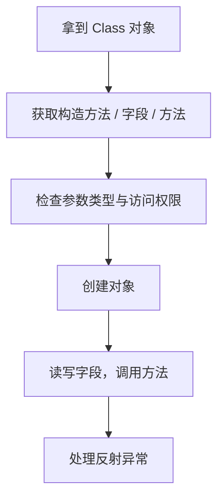
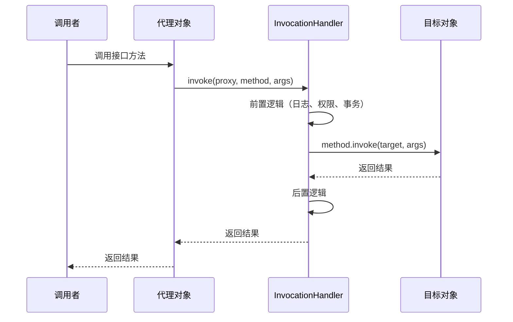
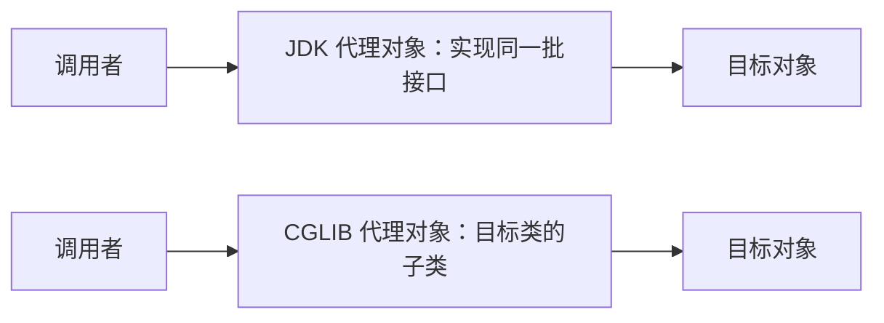

# 反射与动态代理

本篇整理原笔记第二十一、二十二章，是 Java 核心完成后的机制拓展。反射把“编译期确定的调用”推迟到运行期，动态代理在反射之上再加一层统一拦截逻辑；Spring、MyBatis 这类框架大量依赖这两项能力。学习目标是能读懂框架代码，而不是把反射塞进日常业务。

## 1. 学习目标与前置知识

### 1.1 学习目标

| 序号 | 目标 | 对应小节 |
| --- | --- | --- |
| 1 | 能说清反射调用和普通调用的区别 | 2 |
| 2 | 会三种获取 `Class` 对象的方式，并知道它们的差别 | 3 |
| 3 | 会用反射创建对象、读写字段、调用方法 | 4 |
| 4 | 知道 `setAccessible(true)` 能做什么、有什么代价 | 4 |
| 5 | 能读取运行期保留的注解 | 5 |
| 6 | 能写出一个 JDK 动态代理 | 7 |
| 7 | 能说清 JDK 代理与 CGLIB 代理的区别，以及 Spring 的选择规则 | 8 |

### 1.2 前置知识

| 前置内容 | 为什么需要 |
| --- | --- |
| 类与对象、构造方法 | 反射创建对象相当于在运行期替你 `new` |
| 方法重载 | 查找方法要用参数类型精确匹配，否则会找错或者找不到 |
| 接口与实现类 | JDK 动态代理必须基于接口 |
| Lambda 与函数式接口 | `InvocationHandler` 可以用 Lambda 写 |
| 注解 | 反射是运行期读取注解的唯一手段 |

## 2. 什么是反射

### 2.1 概念

反射（reflection）指程序在运行期获取类的信息并操作它。平时的写法是先把类名和方法名写死在代码里，编译期就确定了；反射的写法是先拿到一个 `Class` 对象，再按名字去问它：有哪些构造方法、哪些字段、哪些方法，然后在运行期创建对象、读写字段、调用方法。

### 2.2 两种调用方式对比

| 对比项 | 普通调用 | 反射调用 |
| --- | --- | --- |
| 写代码时 | 必须知道类名和方法名 | 可以只知道类的字符串名字 |
| 错误发现时机 | 编译期检查类型和方法是否存在 | 运行期才能发现名字写错 |
| 性能 | 快，可以被编译器与 JIT 优化 | 慢，多了查找、权限检查和方法调用开销 |
| 可读性与调试 | 直观，能直接跳转 | 间接，堆栈里全是 `invoke` |
| 典型场景 | 业务代码 | 框架、容器、通用工具 |

### 2.3 反射的执行路径



### 2.4 反射能做的四件事

| 能力 | 用到的 API |
| --- | --- |
| 运行期创建对象 | `getDeclaredConstructor(...)` 加 `newInstance(...)` |
| 读写任意字段 | `getDeclaredField("name")` 加 `setAccessible(true)` 加 `set` / `get` |
| 调用任意方法 | `getDeclaredMethod("study", String.class)` 加 `invoke` |
| 获取注解信息 | `getAnnotation(Xxx.class)`、`getDeclaredAnnotations()` |

## 3. 获取 Class 对象

### 3.1 三种方式

| 方式 | 写法 | 适用场景 | 是否触发类初始化 |
| --- | --- | --- | --- |
| 类名点 class | `Student.class` | 编译期已经知道目标类 | 不触发静态代码块 |
| `Class.forName` | `Class.forName("example.Student")` | 类名来自配置或字符串，框架常用 | 触发，静态代码块会执行 |
| `对象.getClass()` | `student.getClass()` | 手上已经有对象 | 对象已存在，类早已初始化 |

三种方式拿到的是同一个 `Class` 对象（同一个类加载器下），可以用 `==` 直接比较。

### 3.2 代码示例

```java
Class<?> a = Student.class;
Class<?> b = Class.forName("example.Student");   // 会抛 ClassNotFoundException
Student student = new Student();
Class<?> c = student.getClass();

System.out.println(a == b);   // true
System.out.println(b == c);   // true
```

`Class.forName` 抛出的是受检异常 `ClassNotFoundException`，必须处理。包名或类名写错时它不会在编译期报错，而是在运行期直接抛出来，这也是反射代码“容易上线才发现问题”的原因。

### 3.3 基本类型与包装类型的 Class

```java
System.out.println(int.class == Integer.TYPE);    // true
System.out.println(int.class == Integer.class);   // false
System.out.println(int[].class.getName());        // [I
```

`int.class` 与 `Integer.class` 不是同一个对象。反射查找方法时要传参数类型的 `Class`：方法签名写的是 `int`，就必须传 `int.class`，传 `Integer.class` 会找不到方法。

### 3.4 Class 对象的常用方法

| 方法 | 作用 |
| --- | --- |
| `getName()` | 全限定类名，例如 `example.Student` |
| `getSimpleName()` | 简单类名，例如 `Student` |
| `getPackage().getName()` | 包名 |
| `getSuperclass()` | 父类的 `Class` |
| `getInterfaces()` | 实现的接口数组 |
| `isInterface()`、`isArray()`、`isEnum()` | 类型判断 |
| `newInstance()` | 调用无参构造创建对象，JDK 9 起已过时，改用构造方法 API |

`newInstance()` 被废弃的原因是它只能调用无参构造，而且抛出的异常不精确；替代写法是 `type.getDeclaredConstructor().newInstance()`。

## 4. 用反射操作成员

### 4.1 先准备一个被反射的类

```java
package example;

public class Student {
    private String name;
    private int age;
    public static int count;

    public Student() { }

    public Student(String name, int age) {
        this.name = name;
        this.age = age;
    }

    public String introduce() {
        return "我是" + name + "，今年" + age + "岁";
    }

    private void secret(int code) {
        System.out.println("私有方法被调用，code=" + code);
    }
}
```

### 4.2 getXxx 与 getDeclaredXxx 的区别

| 方法族 | 能拿到什么 | 包含私有成员 | 包含继承来的成员 |
| --- | --- | --- | --- |
| `getConstructor(s)`、`getMethod(s)`、`getField(s)` | 只有 public 成员 | 否 | 是 |
| `getDeclaredConstructor(s)`、`getDeclaredMethod(s)`、`getDeclaredField(s)` | 本类声明的全部成员 | 是 | 否 |

另外注意带不带 `s` 的差别：不带 `s` 的方法按参数类型精确查找一个成员，找不到就抛 `NoSuchMethodException`；带 `s` 的返回数组，适合遍历。写框架时想把某个类的所有注解都读出来，就要用带 `s` 的版本。

### 4.3 setAccessible(true) 的作用与代价

拿到私有成员以后，直接调用 `set`、`get` 或 `invoke` 会抛 `IllegalAccessException`，要先用 `setAccessible(true)` 关掉访问检查。它确实能做到，但代价是打破封装：

- 字段改名或类型变化时，反射代码在编译期不会报错，运行期才炸。
- JDK 9 之后的模块化下，访问其他模块的私有成员可能直接抛 `InaccessibleObjectException`。
- 在启用安全检查的环境里可能被拒绝访问。

所以 `setAccessible(true)` 出现在框架和测试工具里很正常，业务代码里应尽量避免。

### 4.4 用构造方法创建对象

```java
Class<?> type = Class.forName("example.Student");
Constructor<?> constructor = type.getDeclaredConstructor(String.class, int.class);
Object student = constructor.newInstance("小明", 18);
System.out.println(student);
```

`newInstance` 的实参要与构造方法的形参一一对应。类型不匹配抛 `IllegalArgumentException`，构造方法根本不存在则在 `getDeclaredConstructor` 这一步抛 `NoSuchMethodException`。

### 4.5 读写字段

```java
Object target = type.getDeclaredConstructor().newInstance();

Field nameField = type.getDeclaredField("name");
nameField.setAccessible(true);                // 私有字段必须先打开
nameField.set(target, "小红");
System.out.println(nameField.get(target));    // 小红
```

静态字段也能读写，`set` 和 `get` 的第一个参数传 `null` 即可，因为静态字段属于类而不属于某个对象。

### 4.6 调用方法

```java
Method introduce = type.getDeclaredMethod("introduce");
Object result = introduce.invoke(target);
System.out.println(result);

Method secret = type.getDeclaredMethod("secret", int.class);
secret.setAccessible(true);
secret.invoke(target, 42);   // 调用私有方法
```

`invoke` 的第一个参数是目标对象，静态方法传 `null`，后面的参数按顺序传给目标方法。目标方法自己抛出的异常会被包进 `InvocationTargetException`，要用 `getCause()` 才能拿到真实异常。

### 4.7 反射常见异常一览

| 异常 | 出现原因 |
| --- | --- |
| `ClassNotFoundException` | `Class.forName` 的类名或包名写错 |
| `NoSuchMethodException` | 方法名或参数类型对不上 |
| `NoSuchFieldException` | 字段名写错 |
| `InstantiationException` | 试图创建抽象类或接口的实例 |
| `IllegalAccessException` | 没有 `setAccessible(true)` 就访问非 public 成员 |
| `IllegalArgumentException` | 实参类型与形参不匹配 |
| `InvocationTargetException` | 目标方法自身抛了异常，被包了一层 |
| `InaccessibleObjectException` | 模块化限制拒绝访问，JDK 9 及以后 |

## 5. 反射读取注解

### 5.1 注解必须保留到运行期才能被反射读到

注解能不能被反射读到，取决于它的保留策略 `@Retention`：

| 保留策略 | 含义 | 反射能否读到 |
| --- | --- | --- |
| `RetentionPolicy.SOURCE` | 只保留在源码里，编译后丢弃 | 不能，例如 `@Override` |
| `RetentionPolicy.CLASS` | 保留到 class 文件，运行期丢弃，这是默认值 | 不能 |
| `RetentionPolicy.RUNTIME` | 一直保留到运行期 | 能，框架自定义注解都选它 |

### 5.2 定义一个运行期注解

```java
import java.lang.annotation.ElementType;
import java.lang.annotation.Retention;
import java.lang.annotation.RetentionPolicy;
import java.lang.annotation.Target;

@Retention(RetentionPolicy.RUNTIME)
@Target(ElementType.METHOD)
public @interface Log {
    String value() default "默认说明";
    int level() default 1;
}
```

`@Retention(RUNTIME)` 是关键，忘了写就默认是 `CLASS`，后面反射什么都读不到。属性名 `value` 比较特殊，使用时可以省略 `value =`，直接写 `@Log("保存订单")`。

### 5.3 用反射读出注解

```java
public class AnnotatedService {
    @Log(value = "保存订单", level = 2)
    public void save() { }
}
```

```java
Class<?> type = AnnotatedService.class;
Method method = type.getDeclaredMethod("save");
if (method.isAnnotationPresent(Log.class)) {
    Log log = method.getAnnotation(Log.class);
    System.out.println(log.value() + " " + log.level());   // 保存订单 2
}
```

`isAnnotationPresent` 判断有没有标注，`getAnnotation` 拿到注解实例再取属性值。`getAnnotations()` 一次拿到全部注解，`getDeclaredAnnotations()` 只拿本类或本成员直接标注的，不含继承来的。

### 5.4 注解配合反射的典型场景

| 场景 | 例子 |
| --- | --- |
| ORM 映射 | 字段上的 `@Column("user_name")` 决定映射到哪一列 |
| 单元测试 | `@Test` 标注的方法被测试框架挑出来执行 |
| 权限校验 | `@RequiresPermission("user:add")` 被拦截器读取 |
| JSON 序列化 | `@JsonIgnore` 决定某个字段不参与序列化 |

## 6. 反射的应用场景与代价

### 6.1 典型应用

| 应用 | 反射做什么 |
| --- | --- |
| 框架装配对象 | 读取类上的注解，按配置创建对象并注入依赖 |
| MyBatis 结果映射 | 用字段名或注解把查询结果写进对象 |
| Spring 依赖注入 | 查找字段和构造方法，用反射赋值 |
| 注解驱动的校验 | 读取注解属性并校验对象 |
| 通用工具 | 对象转 JSON、属性拷贝、日志打印 |

### 6.2 代价与规避

| 代价 | 表现 | 规避做法 |
| --- | --- | --- |
| 运行期才报错 | 名字写错编译不报 | 优先用 `Class` 字面量与类型化 API，并写单元测试 |
| 性能损耗 | 反复查找方法与字段 | 把 `Method`、`Field` 缓存到静态变量里复用 |
| 破坏封装 | 能读到和修改私有字段 | 只读优先，非必要不 `setAccessible` |
| 模块限制 | 模块化下访问被拒绝 | 改用公开 API 或用模块的 opens 配置 |
| 调试困难 | 堆栈里全是 `invoke` | 关键路径保留直接调用 |

反射的开销主要在查找和权限检查，缓存 `Method` 对象能明显改善；JDK 还提供了 `MethodHandle`、`VarHandle` 等更高效的替代手段，读框架代码时知道有这回事就够。

## 7. 动态代理

### 7.1 概念与四个角色

代理模式：调用者拿到的不是真实对象，而是代理对象；调用者调用代理，代理在调用真实对象前后插入公共逻辑。动态代理指代理类不是手写的，而是运行期由 JDK 生成。

| 角色 | 说明 |
| --- | --- |
| 接口 | 规定代理和目标都必须实现的方法 |
| 目标对象 | 真正干活的实现类 |
| 代理对象 | 运行期生成，持有目标对象，负责插入增强逻辑 |
| `InvocationHandler` | 拦截处理器，代理对象把每次调用都交给它 |

### 7.2 JDK 动态代理的三个参数

```java
Proxy.newProxyInstance(
        类加载器,                       // 一般用接口的类加载器
        new Class<?>[]{接口.class},     // 代理要实现的接口数组
        调用处理器);                     // InvocationHandler，接管每次调用
```

返回值是 `Object`，必须强转成接口类型，因为代理对象只实现了接口里的方法，用实现类接收会 `ClassCastException`。

### 7.3 调用链



### 7.4 一个完整例子

```java
import java.lang.reflect.Proxy;

interface TaskService {
    void execute(String taskName);
    int count();
}

class TaskServiceImpl implements TaskService {
    @Override
    public void execute(String taskName) {
        System.out.println("执行任务：" + taskName);
    }

    @Override
    public int count() {
        return 3;
    }
}

public class ProxyDemo {
    public static void main(String[] args) {
        TaskService target = new TaskServiceImpl();
        TaskService proxy = (TaskService) Proxy.newProxyInstance(
                TaskService.class.getClassLoader(),
                new Class<?>[]{TaskService.class},
                (object, method, methodArgs) -> {
                    System.out.println("调用前：" + method.getName());
                    Object result = method.invoke(target, methodArgs);
                    System.out.println("调用后：" + method.getName());
                    return result;
                });
        proxy.execute("导出报表");
        System.out.println("count = " + proxy.count());
    }
}
```

输出：

```text
调用前：execute
执行任务：导出报表
调用后：execute
调用前：count
调用后：count
count = 3
```

写处理器时有五个要点：

- `method.invoke(target, methodArgs)` 里的目标必须是真实对象 `target`。如果写成 `object`（代理对象自己），就会递归调用自己，栈溢出。
- `methodArgs` 有可能为 `null`（无参方法），`invoke` 接受 `null` 表示没有参数。
- 必须把目标方法的返回值原样返回，否则声明有返回值的接口调用会拿到 `null` 或运行期报错。
- 目标方法抛出的异常会被包成 `InvocationTargetException`，需要拆开再抛出真实异常。
- `Object` 定义的 `toString`、`equals`、`hashCode` 也会被拦截，日志代理里要注意排除，否则打印代理对象时可能递归。

### 7.5 什么时候用动态代理

| 场景 | 增强逻辑 |
| --- | --- |
| 日志 | 统一记录方法名、参数与耗时 |
| 事务 | 调用前开启事务，调用后提交或回滚 |
| 权限 | 调用前校验当前用户是否有权限 |
| 缓存 | 命中缓存就直接返回，不调用目标方法 |
| 重试 | 失败后按策略重试 |

动态代理的本质是在调用前后插逻辑。注意它的局限：JDK 动态代理只能代理接口里的方法，目标类自己新增的 public 方法不在接口里，代理对象上没有这些方法。

## 8. CGLIB 代理与 JDK 代理

### 8.1 CGLIB 是什么

JDK 动态代理要求目标类型有接口，没有接口就用不了。CGLIB（Code Generation Library）是一个字节码生成库，它在运行期生成目标类的子类作为代理，子类覆盖父类方法并在其中插入增强逻辑，所以不需要接口。

它的限制来自“继承”这个前提：`final` 类不能被继承，`final` 方法不能被覆盖，所以 CGLIB 无法代理 `final` 类和 `final` 方法；私有方法、静态方法也无法被覆盖。

### 8.2 两者对比

| 对比项 | JDK 动态代理 | CGLIB 代理 |
| --- | --- | --- |
| 实现方式 | 运行期生成实现同一批接口的类 | 运行期生成目标类的子类 |
| 是否需要接口 | 必须有 | 不需要 |
| 代理范围 | 接口里声明的方法 | 可被覆盖的非 final 方法 |
| 额外依赖 | JDK 自带 | 需要 CGLIB 字节码库，Spring 已内置 |
| 性能 | 生成快，调用稍慢 | 生成慢，调用快 |
| 限制 | 方法必须写在接口里 | final 类、final 方法、私有方法都不能代理 |

### 8.3 Spring AOP 怎么选

| 目标类型 | 默认代理方式 |
| --- | --- |
| 实现了接口 | JDK 动态代理 |
| 没有实现接口 | CGLIB 代理 |
| 要求代理具体实现类 | 设置 `proxyTargetClass = true`，强制走 CGLIB |

Spring Boot 2.x 起默认统一使用 CGLIB，所以目标类即使实现了接口，按具体类注入也能注入成功。理解这条规则能解释一个常见疑惑：为什么 Service 不写接口也能被事务和日志增强。

### 8.4 两种代理的调用链对比



## 9. 小白易错点

1. 以为 `getMethod` 也能拿到私有方法。它只找 public 方法，私有方法要用 `getDeclaredMethod`。
2. 用 `getDeclaredField` 去拿父类字段，结果抛 `NoSuchFieldException`。`getDeclaredXxx` 只找本类声明的成员。
3. 拿到私有成员后忘记 `setAccessible(true)`，直接调用抛 `IllegalAccessException`。
4. 查找带 `int` 参数的方法时传了 `Integer.class`，正确写法是 `int.class`。
5. 用 `Class.forName` 时把异常吞掉，类名写错要到运行期才暴露。
6. 用 `newInstance()` 的老写法，JDK 9 起已过时，应改用 `getDeclaredConstructor().newInstance()`。
7. 把 `InvocationTargetException` 直接往上抛，真实原因藏在 `getCause()` 里，日志里看不到关键信息。
8. 在 `InvocationHandler` 里写 `method.invoke(object, methodArgs)`，把代理对象当目标导致递归调用自己。
9. 忘记把目标方法的返回值返回出去，接口声明有返回值时调用方拿到 `null`。
10. 用实现类类型接收代理对象，例如 `TaskServiceImpl proxy = (TaskServiceImpl) Proxy.newProxyInstance(...)`，抛 `ClassCastException`。
11. 以为 JDK 动态代理能增强目标类独有但接口里没有的方法，其实代理对象上根本没有这个方法。
12. 想用 CGLIB 代理 `final` 类或 `final` 方法，生成代理时直接失败。
13. 自定义注解忘了写 `@Retention(RetentionPolicy.RUNTIME)`，反射读出来是 `null`。
14. 误以为注解能直接改程序行为。注解本身只是数据，必须有反射或编译期处理器去读它才生效。
15. 在循环里反复 `getDeclaredMethod` 不缓存，性能明显下降。

## 10. 练习清单

| 序号 | 题目 | 要求与考察点 |
| --- | --- | --- |
| 1 | 三种方式获取 Class | 对同一个类分别用三种方式获取并打印 `getName()`，验证 `==` 相等，考察类加载与初始化 |
| 2 | 打印类结构 | 用 `getDeclaredFields`、`getDeclaredMethods`、`getDeclaredConstructors` 输出一个类的全部成员，考察带 `s` 与不带 `s` 的区别 |
| 3 | 反射创建对象 | 用有参构造创建对象并打印 `toString`，考察 `getDeclaredConstructor` 与类型匹配 |
| 4 | 修改私有字段 | 把某个对象的私有字段改成新值再读回来，考察 `setAccessible` 与 `set` / `get` |
| 5 | 调用私有方法 | 用反射调用带参数的私有方法，考察 `invoke` 与 `InvocationTargetException` |
| 6 | 通用对象打印 | 写一个方法，接收任意对象，用反射输出它的字段名和字段值，考察通用性写法 |
| 7 | 属性拷贝 | 写方法把两个同类对象的字段逐个复制，考察字段遍历与异常处理 |
| 8 | 自定义注解 | 定义 `@Log` 注解并标注在方法上，用反射读出注解属性，考察 `@Retention(RUNTIME)` |
| 9 | 简易日志代理 | 给一个接口写 JDK 动态代理，记录方法名与耗时，考察 `newProxyInstance` 与 `InvocationHandler` |
| 10 | 简易事务代理 | 在代理里模拟开启事务、提交、回滚，并让异常正确抛出，考察返回值与异常传递 |
| 11 | 对比两种代理 | 对有接口的类分别用 JDK 代理和 CGLIB 代理，打印代理对象的类名，考察两种实现方式 |
| 12 | 反射实现工厂 | 根据配置文件里的类名创建对象，考察 `Class.forName` 与多态 |

练习方法：反射代码几乎都是“写错名字运行期才报错”，所以每写一步就运行一次，不要一口气写完再跑；异常处理不要只打一句 `printStackTrace`，至少要打印出类名、成员名和真实原因。

## 11. 资料对应关系

### 11.1 本篇小节与原笔记章节的对应关系

| 本篇小节 | 原笔记章节 | 主要内容 |
| --- | --- | --- |
| 1 | 二十一、二十二章 | 学习目标与前置知识 |
| 2 | 二十一、反射 | 反射的概念、与普通调用的对比 |
| 3 | 二十一、反射 | 三种获取 Class 的方式与 Class 常用方法 |
| 4 | 二十一、反射 | 构造方法、字段、方法的反射操作与异常 |
| 5 | 二十一、反射 | 运行时注解的读取 |
| 6 | 二十一、反射 | 应用场景与代价 |
| 7 | 二十二、动态代理 | JDK 动态代理与调用链 |
| 8 | 二十二、动态代理 | CGLIB 代理与 Spring AOP 的选择规则 |

### 11.2 与后续篇目的衔接

| 后续篇目 | 承接本篇的内容 |
| --- | --- |
| javaweb Spring 各篇 | 依赖注入、事务、AOP 全靠反射与动态代理实现 |
| javaweb MyBatis 各篇 | 结果集映射依赖反射写字段，Mapper 接口依赖动态代理生成实现 |
| 07-异常与IO流 | 反射 API 大量抛受检异常，异常处理链路在这里打基础 |
| 08-多线程与网络编程 | 线程池、远程调用框架在内部同样用反射做通用派发 |

### 11.3 本篇小结

1. 反射是运行期获取类信息并操作它的能力，灵活性来自“名字可以在运行期确定”，代价是错误延后、性能下降和封装被破坏。
2. 获取 `Class` 有三种方式：`类名.class`、`Class.forName("全限定类名")`、`对象.getClass()`，同一个类加载器下三者是同一个对象。
3. `getXxx` 只拿 public 成员且包含继承来的，`getDeclaredXxx` 拿本类声明的全部成员且不含继承；带 `s` 的返回数组。
4. 访问非 public 成员要先 `setAccessible(true)`，模块化环境下可能被拒绝。
5. 反射能创建对象、读写字段、调用方法，方法调用要凑齐参数类型，`invoke` 的第一个参数是目标对象或 `null`。
6. 注解只有 `@Retention(RUNTIME)` 才能被反射读到，反射负责把注解变成可用的配置数据。
7. JDK 动态代理基于接口生成代理类，核心是 `Proxy.newProxyInstance` 和 `InvocationHandler`，处理器里要把返回值返回、把异常传递出去。
8. CGLIB 通过生成子类代理，不需要接口，但不能代理 `final` 类和 `final` 方法。
9. Spring AOP 有接口默认走 JDK 代理，Spring Boot 2.x 起默认统一用 CGLIB；理解这条规则能解释“没写接口也能被增强”的现象。
