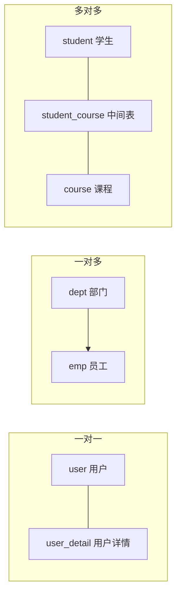
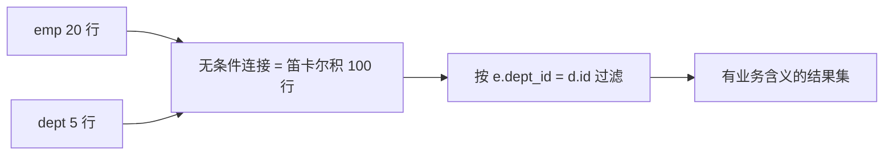
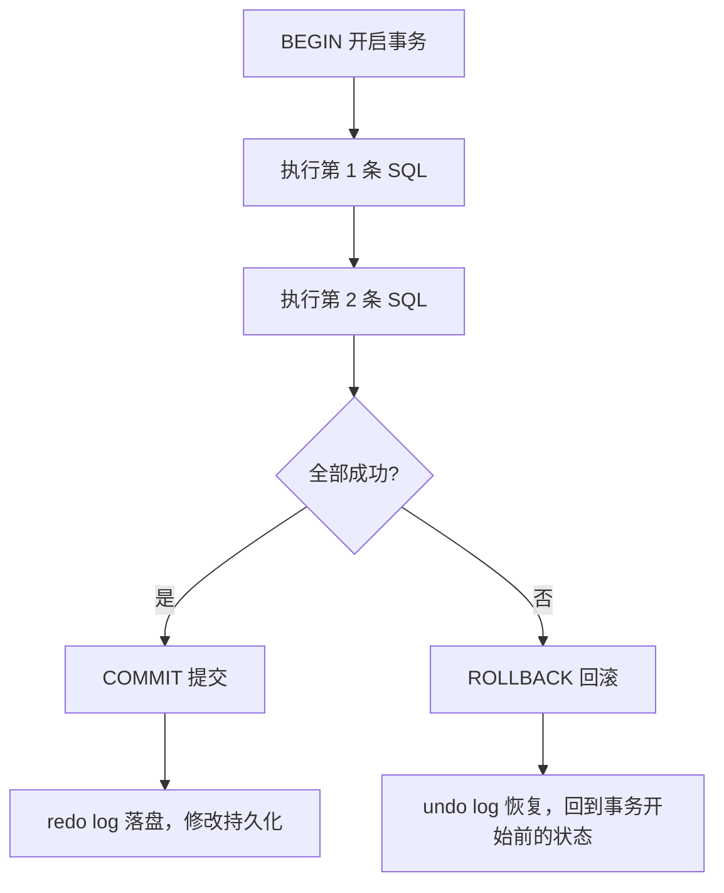

# 05 Web 后端基础（MySQL 数据库）

本章介绍关系型数据库的基本概念、SQL 语法、多表设计与多表查询、事务、索引和分页，为第 06 章的 JDBC 与 MyBatis 打基础。示例中的账号密码统一写成占位符（例如 `${DB_PASSWORD}`），不要写入真实凭据。

读完后你应该能：

- 说清楚数据库、数据库管理系统（DBMS）和 SQL 的区别。
- 根据业务判断表关系，并用外键约束建出一对多和多对多结构。
- 写出内连接、外连接、自连接和四类子查询，解释笛卡尔积是怎么产生的。
- 用事务与隔离级别解释转账类操作，并说明脏读、不可重复读、幻读。
- 按业务含义选择字段类型与约束，用 `LIMIT` 写出分页查询。

前置知识：第 04 章的三层架构与 Spring Boot 入门；本机安装 MySQL 并会使用一种客户端（命令行、IDEA Database、DataGrip 或 Navicat）。

## 1. MySQL 与关系型数据库

### 1.1 基本概念

学习数据库前先区分三个容易混淆的名词：数据库、数据库管理系统、SQL。它们处在不同层次，不是同一个东西。

- 数据库（database）：按照一定的数据结构组织、存储和管理数据的仓库，通常指一批相关表、视图、索引等对象的集合，例如 `tlias`。
- 数据库管理系统（DBMS，Database Management System）：管理数据库的软件，负责解析 SQL、读写磁盘、控制并发、管理用户权限和备份恢复，例如 MySQL、Oracle、PostgreSQL、SQL Server。
- SQL（Structured Query Language，结构化查询语言）：与关系型数据库交互的标准语言，用于定义表结构、读写数据、控制系统权限。SQL 是语言，不是软件，也不是数据库本身。

因此“数据库”和“数据库管理系统”不能混用：MySQL 是 DBMS，不是数据库；`tlias` 是 MySQL 管理的一个数据库；我们写 SQL 交给 MySQL，由 MySQL 去操作 `tlias` 里的表。

| 名称 | 中文 | 说明 | 例子 |
|---|---|---|---|
| 数据库 | database | 按数据结构组织存储数据的仓库，是表和对象的集合 | `tlias` |
| 数据库管理系统 | DBMS | 管理数据库的软件，负责解析 SQL、存储、并发与权限 | MySQL 8.0 |
| SQL | 结构化查询语言 | 操作数据库的标准语言 | `SELECT * FROM dept;` |
| 表 | table | 二维结构，一行是一条完整记录 | `dept` |


SQL 的作用按语句类型体现：DDL 定义库表结构，DML 增删改数据，DQL 查询数据，DCL 控制权限，TCL 控制事务。第 2 章会逐类展开。

关系型数据库使用二维表表达数据，表之间通过主键和外键字段建立联系。主键唯一标识记录，约束用于保证数据质量。

常见概念：

| 概念 | 含义 |
|---|---|
| 数据库 | 多个相关表和对象的集合，是被管理的对象，本身不是软件 |
| 表 | 保存同一类数据的结构 |
| 行 | 一条完整记录 |
| 列 | 记录中的一个字段 |
| 主键 | 唯一标识一行，不能重复且不能为 NULL |
| 外键 | 保存另一张表主键，用于表达关联 |
| 约束 | 限制数据取值，保证数据质量 |

### 1.2 建库建表

~~~sql
CREATE DATABASE IF NOT EXISTS tlias DEFAULT CHARACTER SET utf8mb4;
USE tlias;

CREATE TABLE dept (
  id INT UNSIGNED PRIMARY KEY AUTO_INCREMENT,
  name VARCHAR(10) NOT NULL UNIQUE,
  create_time DATETIME,
  update_time DATETIME
);
~~~

常用字段类型包括整数 `INT`、小数 `DECIMAL`、字符串 `VARCHAR`、日期时间 `DATETIME` 和大文本 `TEXT`。表设计时应根据业务含义选择类型，不要所有字段都使用字符串。

### 1.3 数据库设计步骤

1. 根据需求识别实体，例如部门、员工和工作经历。
2. 为每个实体设计表和字段。
3. 为每张表选择主键，通常使用自增整数或业务无关的唯一 ID。
4. 分析一对一、一对多和多对多关系。
5. 为查询、关联和唯一性要求设计约束和索引。
6. 使用测试数据验证新增、修改、删除和查询。

字段名应表达清晰含义，时间字段通常使用 `create_time`、`update_time`，状态字段使用数字或枚举并在文档中说明每个值代表什么。

其中第 2 步的类型选择见 §1.4，第 5 步的约束与索引见 §1.5，第 4 步的表关系判断与外键写法见 §1.6。

连接 MySQL 后常用命令：

~~~text
mysql -u root -p
SHOW DATABASES;
USE tlias;
SELECT DATABASE();
EXIT;
~~~

图形化工具（如 IDEA Database、DataGrip、Navicat）本质上也是通过驱动连接数据库。连接失败时检查主机、端口、用户名、密码、数据库名和账号权限；不要把生产密码提交到 Git。

### 1.4 常用数据类型与选型

字段类型决定了能存什么值、占多少空间、比较和排序是否高效。按大类分：

- 数值类型：整数 `TINYINT`、`SMALLINT`、`INT`、`BIGINT`；精确小数 `DECIMAL`；近似小数 `FLOAT`、`DOUBLE`。
- 字符串类型：定长 `CHAR`、变长 `VARCHAR`、大文本 `TEXT`。
- 日期时间类型：日期 `DATE`、时间 `TIME`、日期时间 `DATETIME` 与 `TIMESTAMP`。

选型建议：

| 业务场景 | 推荐类型 | 理由 |
|---|---|---|
| 主键、自增 ID | `BIGINT UNSIGNED` | 预留增长空间，避免 INT 用尽 |
| 短小且定长的编码（性别码、状态码） | `TINYINT` 或 `CHAR(1)` | 占用小，便于建立约定 |
| 姓名、标题、用户名 | `VARCHAR(n)` | 变长存储，按最大长度留余量 |
| 文章正文、JSON 字符串 | `TEXT` 或 `JSON` | 超长内容不适合参与索引 |
| 金额、单价、利率 | `DECIMAL(m, d)` | 精确小数，不丢分位 |
| 业务发生时间（下单时间） | `DATETIME` | 存什么读什么，不受服务器时区改动影响 |
| 记录最后更新时间 | `TIMESTAMP` | 支持自动更新，由数据库维护 |

金额必须用 `DECIMAL` 而不是 `FLOAT`：`FLOAT` 和 `DOUBLE` 是二进制浮点数，只能近似表示十进制小数，常见的现象是 `0.1 + 0.2` 不等于 `0.3`，累加后会出现一分两分的误差，对账时很难解释。`DECIMAL(10, 2)` 表示总共 10 位数字、其中 2 位小数，即最大 `99999999.99`，存储的是精确值。

```sql
CREATE TABLE account (
  id BIGINT UNSIGNED PRIMARY KEY AUTO_INCREMENT,
  username VARCHAR(50) NOT NULL,
  balance DECIMAL(10, 2) NOT NULL DEFAULT 0.00,
  created_at DATETIME NOT NULL,
  updated_at TIMESTAMP NOT NULL DEFAULT CURRENT_TIMESTAMP ON UPDATE CURRENT_TIMESTAMP
);
```

`DATETIME` 与 `TIMESTAMP` 的区别经常被忽略，两者最大的差异是时区处理：

| 对比项 | DATETIME | TIMESTAMP |
|---|---|---|
| 存储范围 | 1000-01-01 到 9999-12-31 | 1970-01-01 到 2038-01-19（存在 2038 问题） |
| 时区处理 | 按写入的字面值存储，不做时区转换 | 按会话时区转换成 UTC 存储，读取时再转回 |
| 自动更新 | 需显式写 `DEFAULT CURRENT_TIMESTAMP` | 支持 `ON UPDATE CURRENT_TIMESTAMP` |
| 占用空间 | 5 字节（MySQL 5.6 起） | 4 字节 |
| 适用场景 | 业务时间、需要长期保存的时间 | 记录更新时间、需要跨时区一致的时间 |

时区影响的典型表现：同一行数据在不同时区的会话里用 `TIMESTAMP` 读出来会显示不同的时间，迁移服务器时区后旧数据的时间也会跟着变；而 `DATETIME` 始终是写进去的那个字面值。因此项目里要统一约定时区并写入 JDBC 连接参数（如 `serverTimezone=Asia/Shanghai`），不要一部分字段用 `DATETIME`、一部分用 `TIMESTAMP` 却各自理解不同。

其他常见坑：

- `VARCHAR(n)` 中的 n 是字符数不是字节数，`utf8mb4` 下一个汉字仍算 1 个字符，但一个 `VARCHAR(255)` 索引可能因为字节数超限而建不上索引。
- 建库时要显式指定字符集，例如 `utf8mb4`，否则可能出现 emoji 或生僻字插入失败。
- 存储手机号、身份证号用 `VARCHAR`，不要用整数，避免前导零丢失和超出范围。
- 长文本和大字段不要放在高频查询的表里，会拖慢每行扫描速度。

### 1.5 数据完整性约束

约束（constraint）是加在列或表上的规则，由数据库在写入时校验，用来阻止不合法的数据进入表中。常见约束及其写法：

| 约束 | 关键字 | 作用 | 示例 |
|---|---|---|---|
| 主键 | `PRIMARY KEY` | 唯一标识一行，非空且不重复，一张表只能有一个 | `id INT PRIMARY KEY` |
| 外键 | `FOREIGN KEY ... REFERENCES` | 取值必须存在于被引用表的主键或唯一列中 | `FOREIGN KEY (dept_id) REFERENCES dept(id)` |
| 非空 | `NOT NULL` | 该列必须有值，不能为 NULL | `name VARCHAR(20) NOT NULL` |
| 唯一 | `UNIQUE` | 该列（或列组合）取值不能重复，允许多行为 NULL | `username VARCHAR(50) UNIQUE` |
| 默认值 | `DEFAULT` | 未提供值时使用默认值 | `status TINYINT NOT NULL DEFAULT 1` |
| 检查 | `CHECK` | 值必须满足布尔表达式 | `CHECK (status IN (0, 1))` |
| 自增 | `AUTO_INCREMENT` | 整数键列由数据库自动生成递增值 | `id INT AUTO_INCREMENT` |

```sql
CREATE TABLE dept (
  id INT UNSIGNED PRIMARY KEY AUTO_INCREMENT,
  name VARCHAR(10) NOT NULL UNIQUE,
  status TINYINT NOT NULL DEFAULT 1,
  sort INT NOT NULL DEFAULT 0,
  create_time DATETIME NOT NULL DEFAULT CURRENT_TIMESTAMP,
  CONSTRAINT chk_dept_status CHECK (status IN (0, 1))
);
```

关于自增主键 `AUTO_INCREMENT` 的补充：

- 只能加在键列上（主键或唯一键），且一张表只能有一个自增列。
- 自增不保证连续：回滚、删除行、批量插入失败都会让已分配的值作废，出现跳号是正常现象，不要把“ID 连续”当成业务规则。
- 插入后想拿到新主键，可以在同一个连接里执行 `SELECT LAST_INSERT_ID();`；Java 侧对应第 06 章的主键回填。
- 自增列的起点和步长可通过 `AUTO_INCREMENT = 1000` 或 `SET @@auto_increment_increment` 调整，多主集群才会用到。

约束写在建表语句里最清晰；也可以通过 `ALTER TABLE` 后补：

```sql
ALTER TABLE dept ADD CONSTRAINT uk_dept_name UNIQUE (name);
ALTER TABLE dept DROP CONSTRAINT chk_dept_status;
```

校验时机要记住：`NOT NULL`、`UNIQUE`、`CHECK`、`FOREIGN KEY` 都在写入或更新时立刻检查，违反约束的语句会直接报错而不是静默忽略。另外 `UNIQUE` 允许多个 NULL，因为 NULL 之间不算重复。

### 1.6 多表设计与外键约束

把不同实体的数据放在不同的表里，再通过字段建立联系，可以避免同一份数据在多个地方重复保存（否则改一处漏一处）。表之间的关系只有三种，判断方法是站在任意一边问“另一边能对应几条记录”：

| 关系 | 判断方法 | 例子 | 建表方式 |
|---|---|---|---|
| 一对一 | A 一条记录最多对应 B 一条，反之亦然 | 员工与工牌、用户与用户详情 | 在任意一边加外键，并给外键加唯一约束 |
| 一对多 | A 一条对应 B 多条，B 一条只对应 A 一条 | 部门与员工、订单与订单明细 | 在多的一方加外键，指向一的一方的主键 |
| 多对多 | A 一条对应 B 多条，B 一条也对应 A 多条 | 学生与课程、订单与商品 | 引入中间表，中间表放两个外键 |



外键（foreign key）是表中的一个字段，它的取值必须出现在被引用表的主键或唯一列中，用于保证参照完整性。一对多的典型写法是在多的一方加外键：

```sql
CREATE TABLE dept (
  id INT UNSIGNED PRIMARY KEY AUTO_INCREMENT,
  name VARCHAR(10) NOT NULL
);

CREATE TABLE emp (
  id INT UNSIGNED PRIMARY KEY AUTO_INCREMENT,
  name VARCHAR(20) NOT NULL,
  dept_id INT UNSIGNED,
  CONSTRAINT fk_emp_dept FOREIGN KEY (dept_id) REFERENCES dept(id)
);
```

建表后也可以补加外键：

```sql
ALTER TABLE emp
ADD CONSTRAINT fk_emp_dept FOREIGN KEY (dept_id) REFERENCES dept(id);
```

外键的作用是双向的：

- 插入或更新 `emp.dept_id` 时，如果 `dept` 里没有这个 id，写入直接被拒绝，不会产生指向不存在部门的脏数据。
- 删除或更新 `dept.id` 时，如果还有员工引用它，默认行为 `RESTRICT` 会阻止操作，避免出现孤儿记录。

外键还可以声明级联行为：

| 行为 | 含义 | 使用建议 |
|---|---|---|
| `RESTRICT` / `NO ACTION` | 有引用时禁止删除或修改（默认） | 常用，最安全 |
| `CASCADE` | 主表删除或改主键时，子表记录跟着删除或改值 | 谨慎使用，容易一次删掉大量数据 |
| `SET NULL` | 主表记录被删时，子表外键置为 NULL | 外键列必须允许 NULL |

```sql
ALTER TABLE emp
ADD CONSTRAINT fk_emp_dept FOREIGN KEY (dept_id)
REFERENCES dept(id) ON UPDATE CASCADE ON DELETE RESTRICT;
```

多对多必须引入中间表（也称关联表），因为两张表都“在多方”，谁也无法在自身表里存放对方的多条记录。中间表的每一行代表一次关联，通常放两个外键分别指向两张表，再加上关联自身的属性：

```sql
CREATE TABLE student (
  id BIGINT UNSIGNED PRIMARY KEY AUTO_INCREMENT,
  name VARCHAR(20) NOT NULL
);

CREATE TABLE course (
  id BIGINT UNSIGNED PRIMARY KEY AUTO_INCREMENT,
  name VARCHAR(20) NOT NULL
);

CREATE TABLE student_course (
  id BIGINT UNSIGNED PRIMARY KEY AUTO_INCREMENT,
  student_id BIGINT UNSIGNED NOT NULL,
  course_id BIGINT UNSIGNED NOT NULL,
  score DECIMAL(5, 2),
  CONSTRAINT fk_sc_student FOREIGN KEY (student_id) REFERENCES student(id),
  CONSTRAINT fk_sc_course FOREIGN KEY (course_id) REFERENCES course(id),
  CONSTRAINT uk_sc UNIQUE (student_id, course_id)
);
```

中间表的两个要点：两个外键分别指向两张主表，保证关联的是真实存在的记录；`UNIQUE (student_id, course_id)` 保证同一个学生同一门课只有一条记录，避免重复选课。如果关联内部不需要单独的主键，也可以把两列合起来作为联合主键。

物理外键与逻辑外键的区别是工程里经常讨论的问题：

| 对比项 | 物理外键（数据库 FOREIGN KEY） | 逻辑外键（只存 id，不建约束） |
|---|---|---|
| 约束位置 | 数据库层，DDL 里声明 | 应用层，由 Service 代码校验 |
| 数据一致性 | 强，非法数据写不进去 | 依赖代码质量，可能产生孤儿数据 |
| 写入性能 | 每次写子表都要查主表，并发高时是额外开销 | 无额外检查开销 |
| 删除影响 | 受引用限制，删除主表记录要处理级联 | 更灵活，但需要自己写清理逻辑 |
| 分库分表、跨库 | 不支持跨库外键 | 天然支持 |
| 常见场景 | 教学项目、单体小型系统，用来强调关系 | 互联网项目主流做法 |

结论：学习阶段按物理外键理解关系是必要的，考试和面试也常问外键作用；生产项目里更常见的是只保留 `dept_id` 这样的逻辑外键，把一致性校验交给业务代码，并配合定期校验脚本发现脏数据。

## 2. SQL 分类

### 2.1 DDL

DDL 管理数据库和表结构，如 CREATE、ALTER、DROP。

~~~sql
ALTER TABLE dept ADD COLUMN status TINYINT NOT NULL DEFAULT 1;
ALTER TABLE dept MODIFY COLUMN name VARCHAR(20) NOT NULL;
ALTER TABLE dept DROP COLUMN status;
~~~

生产环境执行 `DROP`、`TRUNCATE` 和结构变更前必须确认目标范围并备份数据。

查看结构和表信息：

~~~sql
SHOW DATABASES;
SHOW TABLES;
DESC dept;
SHOW CREATE TABLE dept;
~~~

删除和清空的区别：`DROP TABLE` 删除表结构和数据，`TRUNCATE TABLE` 快速清空数据并保留表结构，`DELETE` 按条件删除行并可回滚（是否可回滚还取决于存储引擎和事务）。

### 2.2 DML

~~~sql
INSERT INTO dept(name, create_time, update_time)
VALUES ('教研部', NOW(), NOW());

UPDATE dept
SET name = '技术部', update_time = NOW()
WHERE id = 1;

DELETE FROM dept WHERE id = 1;
~~~

更新和删除必须写 WHERE。执行生产操作前，先用相同条件查询确认范围。

`INSERT` 增加记录，`UPDATE` 修改已有记录，`DELETE` 删除记录。批量插入可以一次写入多组值，修改和删除没有 `WHERE` 时可能影响整张表。

~~~sql
INSERT INTO dept(name) VALUES ('研发部'), ('测试部');

UPDATE dept
SET name = '技术研发部'
WHERE id = 1;

DELETE FROM dept
WHERE id = 2;
~~~

### 2.3 DQL

~~~sql
SELECT id, name
FROM dept
WHERE name LIKE CONCAT('%', '研', '%')
ORDER BY id DESC
LIMIT 0, 10;
~~~

SQL 常见逻辑顺序：FROM/JOIN → WHERE → GROUP BY → HAVING → SELECT → ORDER BY → LIMIT。

常见条件运算符：`=`、`<>`、`>`、`<`、`BETWEEN`、`IN`、`LIKE`、`IS NULL`。`LIKE '%关键字%'` 可以模糊匹配，但前置通配符通常不容易使用普通索引。

常见聚合函数：`COUNT` 统计数量，`SUM` 求和，`AVG` 求平均，`MAX` 求最大值，`MIN` 求最小值。`WHERE` 在分组前过滤行，`HAVING` 在分组后过滤组。

基础查询示例：

~~~sql
SELECT id, name FROM dept;
SELECT DISTINCT job FROM emp;
SELECT * FROM emp WHERE salary BETWEEN 5000 AND 10000;
SELECT * FROM emp WHERE job IN (1, 2, 3);
SELECT * FROM emp WHERE name LIKE '张%';
SELECT * FROM emp ORDER BY update_time DESC, id DESC LIMIT 0, 10;
~~~

NULL 不是 0 或空字符串。判断空值要用 IS NULL/IS NOT NULL，不能写 = NULL；WHERE 条件可能产生 TRUE、FALSE、UNKNOWN 三种结果。主键应稳定且不重复，UNIQUE 防止业务字段重复，NOT NULL 保证必填；设计表时减少重复数据，报表场景可在可控范围内反规范化。

分页常见写法是 `LIMIT offset, pageSize`，例如第 2 页、每页 10 条为 `LIMIT 10, 10`。必须配合稳定的 `ORDER BY`，否则数据新增或更新时页内顺序可能变化。

## 3. 聚合和多表查询

~~~sql
SELECT job, COUNT(*) AS total
FROM emp
GROUP BY job
HAVING COUNT(*) > 1
ORDER BY total DESC;

SELECT e.id, e.name, d.name AS dept_name
FROM emp e
LEFT JOIN dept d ON e.dept_id = d.id;
~~~

| 类型 | 特点 | 用途 |
|---|---|---|
| INNER JOIN | 只保留匹配行 | 查询有关联的数据 |
| LEFT JOIN | 保留左表所有行 | 主表记录不能丢失 |
| 子查询 | 查询结果参与外层 | 表达复杂条件 |

连接条件必须写在 `ON` 后。`INNER JOIN` 只返回两边匹配的记录；`LEFT JOIN` 保留左表全部记录，右表没有匹配时字段为 NULL。多表查询时应明确列名，避免使用 `SELECT *` 返回不需要的字段。

子查询按返回结果可以分为标量子查询、列子查询、行子查询和表子查询：

~~~sql
-- 标量子查询：只返回一个值
SELECT * FROM emp WHERE salary > (SELECT AVG(salary) FROM emp);

-- 列子查询：配合 IN
SELECT * FROM emp WHERE dept_id IN (SELECT id FROM dept WHERE name LIKE '%技术%');

-- 表子查询：把查询结果当作临时表
SELECT t.job, t.total
FROM (SELECT job, COUNT(*) AS total FROM emp GROUP BY job) t;
~~~

### 3.1 笛卡尔积是怎么产生的

笛卡尔积（Cartesian product）指两张表不加任何条件地连接时，左表的每一行都会和右表的每一行组合一次，结果行数等于两张表行数的乘积。`dept` 有 5 行、`emp` 有 20 行时，`FROM emp, dept` 会得到 100 行，其中绝大多数组合没有业务含义。

产生的原因是：`FROM` 只是把两张表的数据放在一起，数据库并不知道哪两行应该配对。配对规则必须由连接条件给出，条件写错或漏写就会得到笛卡尔积。

```sql
-- 错误：没有连接条件，结果是 5 × 20 = 100 行
SELECT e.name, d.name
FROM emp e, dept d;

-- 正确：用连接条件把配对范围限制为“员工的部门等于部门表里的那一行”
SELECT e.name, d.name
FROM emp e, dept d
WHERE e.dept_id = d.id;
```



判断是否误写笛卡尔积有两个信号：结果行数远大于业务预期；`SELECT COUNT(*)` 得到的是两表行数的乘积。多表查询时先确认连接条件，再写其它过滤条件。

### 3.2 内连接与外连接

内连接只保留两边都能配上的行，写法有两种，语义完全相同：

```sql
-- 显式内连接：连接条件写在 ON 后
SELECT e.id, e.name, d.name AS dept_name
FROM emp e
INNER JOIN dept d ON e.dept_id = d.id;

-- 隐式内连接：表用逗号分隔，连接条件写在 WHERE 里
SELECT e.id, e.name, d.name AS dept_name
FROM emp e, dept d
WHERE e.dept_id = d.id;
```

隐式写法是早期标准，条件一多容易和普通过滤条件混在一起；显式写法把连接关系和过滤条件分开，可读性更好，多表连接时推荐显式写法。

外连接会保留一侧的全部记录，另一侧没有匹配时用 NULL 补位：

```sql
-- 左外连接：保留左表 emp 全部记录，即使员工没有部门
SELECT e.id, e.name, d.name AS dept_name
FROM emp e
LEFT JOIN dept d ON e.dept_id = d.id;

-- 右外连接：保留右表 emp 全部记录，效果与上面等价
SELECT e.id, e.name, d.name AS dept_name
FROM dept d
RIGHT JOIN emp e ON e.dept_id = d.id;
```

`LEFT JOIN` 和 `RIGHT JOIN` 只是把保留哪张表写在了关键字上，交换两张表的位置即可互相改写，所以工程上更常用 `LEFT JOIN`。两者区别：

| 连接方式 | 保留的行 | 未匹配一侧的字段 | 典型用途 |
|---|---|---|---|
| `INNER JOIN` | 两边都匹配的行 | 不出现 | 只关心有关联的数据 |
| `LEFT JOIN` | 左表全部行 | 右表字段为 NULL | 统计“每个部门有几名员工”，含 0 人的部门 |
| `RIGHT JOIN` | 右表全部行 | 左表字段为 NULL | 同上，但以右表为主 |

外连接最常见的坑是过滤条件写错位置。如果右表的过滤条件写在 `WHERE` 里，就会把补 NULL 的那些行重新过滤掉，左外连接实际退化成了内连接：

```sql
-- 结果与内连接相同：条件写在 WHERE，NULL 行被过滤掉
SELECT e.name, d.name
FROM emp e
LEFT JOIN dept d ON e.dept_id = d.id
WHERE d.status = 1;

-- 正确：右表的过滤条件写在 ON 里，左表记录仍然全部保留
SELECT e.name, d.name
FROM emp e
LEFT JOIN dept d ON e.dept_id = d.id AND d.status = 1;
```

记法：主表（要保留全部记录的那张表）的过滤条件写在 `WHERE`，从表的过滤条件写在 `ON`。

### 3.3 自连接

自连接（self join）是把同一张表起两个不同的别名，当成两张表来连接，适合“表里的某个字段引用本表主键”的层级数据。员工表里 `manager_id` 指向另一位员工的 `id`，就是典型场景：

```sql
SELECT e.name AS emp_name, m.name AS manager_name
FROM emp e
LEFT JOIN emp m ON e.manager_id = m.id;
```

要点有两个：必须给同一个表起两个别名（`e` 和 `m`），否则列名无法区分；查询“没有上级的顶层员工”时要用 `LEFT JOIN`，否则 `manager_id` 为 NULL 的行会被内连接过滤掉。

自连接的思路也能用于比较同一张表内的其它行，例如找出薪资高于本部门平均薪资的员工：

```sql
SELECT e.name, e.salary
FROM emp e
WHERE e.salary > (
    SELECT AVG(e2.salary) FROM emp e2 WHERE e2.dept_id = e.dept_id
);
```

### 3.4 子查询与 IN、EXISTS

子查询（subquery）是嵌套在另一条 SQL 里的 `SELECT`，可以出现在 `WHERE`、`HAVING`、`FROM` 和 `SELECT` 中。按返回结果的形状分为四类：

| 类型 | 返回结果 | 常用运算符 | 示例场景 |
|---|---|---|---|
| 标量子查询 | 1 行 1 列 | `=`、`>`、`<` | 薪资高于全公司平均薪资 |
| 列子查询 | 1 列多行 | `IN`、`NOT IN`、`ANY`、`ALL` | 部门名含“技术”的所有员工 |
| 行子查询 | 1 行多列 | `=`、`IN`（配合括号中的多列） | 与某个员工同部门同岗位的人 |
| 表子查询 | 多行多列 | 放在 `FROM` 后当作临时表 | 按岗位统计人数后再排序取前几名 |

```sql
-- 行子查询：括号里写多列，与子查询返回的多列逐列比较
SELECT * FROM emp
WHERE (job, salary) = (SELECT job, salary FROM emp WHERE id = 1);

-- 表子查询：把分组统计结果当成临时表，再在外层过滤排序
SELECT t.job, t.total
FROM (SELECT job, COUNT(*) AS total FROM emp GROUP BY job) t
WHERE t.total >= 3
ORDER BY t.total DESC;
```

`IN` 用于判断某个值是否出现在一列结果中；`EXISTS` 用于判断子查询是否至少返回一行，返回布尔值：

```sql
-- IN：先执行子查询得到一列部门 id，再判断 dept.id 是否属于这个集合
SELECT * FROM dept d
WHERE d.id IN (SELECT e.dept_id FROM emp e WHERE e.salary > 10000);

-- EXISTS：外层每取一行，就代入子查询判断“这个部门是否存在高薪员工”
SELECT * FROM dept d
WHERE EXISTS (
    SELECT 1 FROM emp e
    WHERE e.dept_id = d.id AND e.salary > 10000
);
```

两者对比：

| 对比项 | IN | EXISTS |
|---|---|---|
| 子查询类型 | 通常是不相关子查询，先算出集合 | 相关子查询，引用外层的列 |
| 执行方式 | 子查询结果集较大时占用内存，逐值比较 | 外层每行触发一次判断，匹配到就停止 |
| 适合的数据量 | 子查询结果集小、外层表大 | 外层表小、子查询目标表大且命中快 |
| NULL 影响 | `NOT IN` 遇到 NULL 时结果为 UNKNOWN，查不到任何行 | 不受 NULL 影响 |

`NOT IN` 的 NULL 陷阱值得单独记：`SELECT ... WHERE dept_id NOT IN (SELECT dept_id FROM emp)`，只要 `emp.dept_id` 中有 NULL，整个条件就永远不成立，查询返回空结果。这时改用 `NOT EXISTS`，或者加上 `WHERE dept_id IS NOT NULL`。

## 4. 事务和索引

### 4.1 事务

事务具有原子性、一致性、隔离性和持久性。

~~~sql
START TRANSACTION;
UPDATE account SET balance = balance - 100 WHERE id = 1;
UPDATE account SET balance = balance + 100 WHERE id = 2;
COMMIT;
-- 异常时执行 ROLLBACK
~~~

事务通常由 `START TRANSACTION` 开始，以 `COMMIT` 提交，以 `ROLLBACK` 回滚。事务的四个特性是：原子性、一致性、隔离性和持久性。转账等必须全部成功或全部失败的操作应放在同一个事务中。

事务（transaction）是一组被当作一个整体的 SQL 操作序列：要么全部生效，要么全部撤销，不会停在中间状态。`BEGIN` 与 `START TRANSACTION` 在 MySQL 中含义相同，都表示开启一个事务。

四个特性合称 ACID，含义要说得准确：

| 特性 | 英文 | 含义 | 依靠什么实现 |
|---|---|---|---|
| 原子性 | Atomicity | 事务里的操作是不可分割的整体，要么全部成功，要么全部失败回滚，不存在“扣了钱没加上”的中间态 | undo log 记录反向操作，回滚时恢复 |
| 一致性 | Consistency | 事务执行前后数据都满足业务规则和约束，例如转账前后两人余额之和不变 | 由原子性、隔离性加上应用与约束共同保证 |
| 隔离性 | Isolation | 并发执行的事务之间互不干扰，一个事务未提交的修改默认对其它事务不可见 | 锁与 MVCC 快照，由隔离级别决定强度 |
| 持久性 | Durability | 一旦提交，修改就永久保存，即使之后宕机或断电也不会丢失 | redo log 先写日志再刷盘 |

容易答错的是“一致性”：它不是数据库单方面保证的，而是原子性、隔离性和正确的业务约束共同的结果；如果业务规则写错（例如转账金额算错），数据库依然“一致”地保存了这个错误结果。

```sql
BEGIN;
UPDATE account SET balance = balance - 100 WHERE id = 1;
UPDATE account SET balance = balance + 100 WHERE id = 2;

-- 两条都成功，提交并持久化
COMMIT;

-- 如果第二条执行失败，撤销第一条的影响
-- ROLLBACK;
```

事务的执行路径可以这样理解：



默认情况下，MySQL 每条 SQL 都自动提交，这种模式叫自动提交（autocommit）。查看和修改方式：

```sql
SELECT @@autocommit;   -- 1 表示开启自动提交，这是默认值
SET autocommit = 0;    -- 关闭后必须手动 COMMIT 或 ROLLBACK
SET autocommit = 1;    -- 恢复默认
```

自动提交关闭后，即使单纯执行 `UPDATE` 也不会立即生效，客户端断开连接时未提交的修改会回滚。Java 代码里对应的做法是 `conn.setAutoCommit(false)`，成功时 `commit()`，异常时 `rollback()`，见第 06 章。

使用事务时还要注意：

- 事务范围要尽量小，只包住必须同时成功或失败的操作，长事务会长时间占锁并拖慢其它会话。
- DDL（`CREATE`、`ALTER`、`DROP`、`TRUNCATE`）会隐式提交当前事务，不要在事务中间混入建表改表语句。
- 回滚只能撤销数据修改，不能撤销已执行的外部副作用，例如已发出的短信或已上传的文件，这类操作应放在提交之后做。

### 4.2 索引

索引适合经常用于 WHERE、JOIN、ORDER BY 的列，但会占空间并增加写入成本。

联合索引要考虑最左匹配原则；不要对索引列做函数或隐式类型转换；使用 EXPLAIN 检查查询计划。

索引本质上是帮助数据库快速定位记录的数据结构。主键和唯一约束通常会自动创建索引，但索引并非越多越好，因为插入、更新和删除也需要维护索引。

~~~sql
CREATE INDEX idx_emp_dept ON emp(dept_id);
EXPLAIN SELECT * FROM emp WHERE dept_id = 1;
~~~

联合索引 `(dept_id, update_time)` 可以优先匹配最左边的 `dept_id`；查询条件对索引列进行函数运算或隐式类型转换，可能导致索引失效。

索引的作用与代价要一起看，它是空间和写入速度换查询速度：

| 维度 | 有索引 | 没有索引 |
|---|---|---|
| 等值查询 | 按索引定位，通常几毫秒 | 全表扫描，逐行比较 |
| 范围查询与排序 | 可以顺序扫描索引，避免额外排序 | 需要读取全部行后排序 |
| 关联查询 | `JOIN` 的关联列走索引，效率高 | 每行都要扫描被关联表 |
| 空间占用 | 每个索引都要额外存储，甚至接近数据量 | 不占额外空间 |
| 写入成本 | 插入、更新、删除都要同步维护索引，变慢 | 写入更快 |
| 选择成本 | 索引太多会让优化器选错执行计划 | 无此问题 |

常见导致索引失效的写法，写 SQL 时要避开：

| 写法 | 问题 | 改法 |
|---|---|---|
| `WHERE YEAR(create_time) = 2024` | 对索引列做函数运算 | 改成范围条件 `create_time >= '2024-01-01' AND create_time < '2025-01-01'` |
| `WHERE name = 123` | 隐式类型转换，字符串列用数字比较 | 保持类型一致，写 `name = '123'` |
| `WHERE name LIKE '%张'` | 前置通配符无法利用索引有序性 | 尽量用后缀模糊 `LIKE '张%'`，或改用全文检索 |
| `WHERE a = 1 OR b = 2`（只有一个列有索引） | `OR` 两侧都要走索引才会用索引 | 拆成两条查询 `UNION`，或给两列都建索引 |
| 联合索引 `(a, b)` 上只写 `WHERE b = 1` | 违反最左匹配原则 | 调整索引顺序，或补上 `a` 的条件 |

验证方式是用 `EXPLAIN` 看执行计划，重点看 `type` 是否为 `ALL`（全表扫描）和 `key` 是否命中预期索引。索引更深入的原理见 `../mysql/06-索引.md` 与 `../mysql/07-SQL优化.md`。

### 4.3 事务隔离和并发问题

多个事务同时操作数据时，可能出现脏读、不可重复读和幻读。数据库通过隔离级别控制一个事务可以看到哪些并发修改。初学阶段应记住：需要保持业务整体性的多条 SQL 必须放在同一事务中，提交前的修改在失败时要回滚。

三个并发问题的准确含义：

| 问题 | 现象 | 谁造成 | 例子 |
|---|---|---|---|
| 脏读 | 读到了别的事务未提交、之后可能被回滚的数据 | 另一个事务执行了 UPDATE 但还没提交 | 事务 B 读到 A 把余额改成 0，随后 A 回滚，B 基于错误数据做了决策 |
| 不可重复读 | 同一个事务内两次读同一行，结果不同 | 另一个事务 UPDATE 或 DELETE 并提交 | 事务 A 两次查同一员工薪资，中间事务 B 改并提交，A 两次结果不同 |
| 幻读 | 同一个事务内两次执行相同的范围查询，第二次多出或少了一些行 | 另一个事务 INSERT 或 DELETE 并提交 | 事务 A 两次执行 `WHERE salary > 10000`，第二次多了一行新插入的记录 |

隔离级别（isolation level）就是用来压制这些问题的，级别越高并发能力越弱：

| 隔离级别 | 脏读 | 不可重复读 | 幻读 | 说明 |
|---|---|---|---|---|
| `READ UNCOMMITTED` 读未提交 | 可能 | 可能 | 可能 | 几乎不加隔离，性能最好，基本不用 |
| `READ COMMITTED` 读已提交 | 不可能 | 可能 | 可能 | 只能读到已提交数据，Oracle 与 PostgreSQL 的默认级别 |
| `REPEATABLE READ` 可重复读 | 不可能 | 不可能 | InnoDB 下基本不可能 | MySQL 默认级别，用 MVCC 快照保证同一事务内多次读一致，间隙锁可抑制多数幻读 |
| `SERIALIZABLE` 串行化 | 不可能 | 不可能 | 不可能 | 事务近似串行执行，最安全但并发最差 |

查看和设置隔离级别：

```sql
-- MySQL 8.0 查看当前会话的隔离级别
SELECT @@transaction_isolation;
-- MySQL 5.7 使用 @@tx_isolation

-- 只对当前会话生效
SET SESSION TRANSACTION ISOLATION LEVEL READ COMMITTED;

-- 对之后建立的新连接生效，需要相应权限
SET GLOBAL TRANSACTION ISOLATION LEVEL REPEATABLE READ;
```


实践结论：绝大多数业务用默认的 `REPEATABLE READ` 即可；只有在明确遇到并发可见性差异时才调整，并在同一次会话里验证结果。MySQL 锁与 MVCC 的细节见 `../mysql/11-锁.md` 与 `../mysql/12-InnoDB引擎.md`。

### 4.4 规范化和反规范化

规范化通过拆分表、减少重复字段来避免更新异常；反规范化是在读取性能或报表场景下有意识地保存冗余字段。反规范化必须定义同步策略，否则容易产生不一致数据。

### 4.5 分页查询

分页是把一次查询拆成多页返回，避免一次把几十万行数据传给前端。MySQL 用 `LIMIT` 实现，`offset` 表示跳过多少行：

```sql
-- 第 1 页，每页 10 条
SELECT id, name, salary
FROM emp
ORDER BY id
LIMIT 0, 10;

-- 等价的另一种写法，把行数和偏移量分开，可读性更好
SELECT id, name, salary
FROM emp
ORDER BY id
LIMIT 10 OFFSET 10;   -- 第 2 页
```

偏移量的计算公式是 `offset = (page - 1) * pageSize`：

```text
page=1, pageSize=10  ->  LIMIT 0, 10
page=2, pageSize=10  ->  LIMIT 10, 10
page=3, pageSize=10  ->  LIMIT 20, 10
```

两个必须记住的点：

- 分页一定要配合稳定的 `ORDER BY`。没有排序时返回顺序不保证稳定，翻页可能重复或漏掉记录；排序字段要能唯一确定顺序，最好带上主键，例如 `ORDER BY update_time DESC, id DESC`。
- 深分页会越翻越慢。`LIMIT 1000000, 10` 需要先读出前 100 万行再丢弃，即使有索引也很慢。常见优化是记住上一页最后一个 id，只向后取：

```sql
-- 只适合按主键顺序向后翻页，不能直接跳到任意页
SELECT id, name FROM emp
WHERE id > 1000000
ORDER BY id
LIMIT 10;
```


Java 侧的分页实现见第 06 章，接口通常返回 `total` 与 `rows` 两个字段。

## 5. 小白易错点

- 把数据库和数据库管理系统混为一谈，说“MySQL 是一个数据库”。
- `UPDATE`、`DELETE` 忘记写 `WHERE`，影响整张表；执行前应先用相同条件 `SELECT` 确认范围。
- 判断空值写 `= NULL`，正确写法是 `IS NULL`。
- 多表查询漏写连接条件，得到行数相乘的笛卡尔积。
- 左外连接时把从表的过滤条件写进 `WHERE`，外连接退化成内连接。
- 多对多关系直接在两张表里互加外键，应该引入中间表。
- 金额字段用 `FLOAT` 或 `DOUBLE`，累加后出现分位误差，应该用 `DECIMAL`。
- 认为自增主键一定连续，把“编号连续”当成业务规则。
- 事务里混入 DDL，或者忘记 `COMMIT`，导致修改没有生效。
- 用 `NOT IN` 做子查询却没考虑 NULL，查询结果为空。
- 分页只写 `LIMIT` 不写稳定的 `ORDER BY`，页与页之间出现重复或漏行。

## 6. 练习清单

1. 用一条 SQL 建出 `dept` 与 `emp` 两张表，包含主键、非空、唯一、默认值和一对多外键。
2. 设计学生与课程的中间表，并写出“查询某学生所选全部课程”的 SQL。
3. 分别用内连接和左外连接查询“每个部门的员工列表”，比较两种写法在无人部门上的差异。
4. 用自连接查询每个员工的直属领导姓名。
5. 用标量、列、行、表四类子查询各写一条查询，并用 `EXISTS` 改写其中一条 `IN` 查询。
6. 模拟转账：开启事务，扣款、加款后执行 `ROLLBACK`，观察数据是否恢复。
7. 查询当前隔离级别，切换到 `READ COMMITTED` 后再改回默认值。
8. 写出“第 3 页、每页 5 条”的分页 SQL，并说明为什么必须加 `ORDER BY`。

## 7. 资料对应关系

- 《JavaWeb笔记》：数据库基础、多表查询、事务与索引章节。
- 第 06 章：用 JDBC 与 MyBatis 执行本章的 SQL，包含连接池与 SQL 注入。
- `../mysql/01-MySQL概述.md`、`../mysql/02-SQL.md`：MySQL 基础与 SQL 语法。
- `../mysql/03-事务.md`：事务与隔离级别的深入讲解。
- `../mysql/06-索引.md`、`../mysql/07-SQL优化.md`：索引原理与慢查询优化。

外部资料建议直接在浏览器打开 MySQL 官方手册的“Data Types”与“InnoDB Transaction Isolation Levels”两页核对细节，本地缓存与官方站点的访问稳定性不保证，这里不做链接。

## 8. 本章总结

- DDL 管结构，DML 管数据，DQL 查数据。
- 掌握条件、排序、分页、聚合、连接和子查询。
- 事务保证整体性，索引需要权衡读写成本。
- 数据库是被管理的仓库，MySQL 是管理它的 DBMS，SQL 是操作语言。
- 表关系用外键和中间表表达，多对多必须引入中间表。
- 金额用 `DECIMAL`，时间字段要统一时区约定，分页必须配稳定排序。
