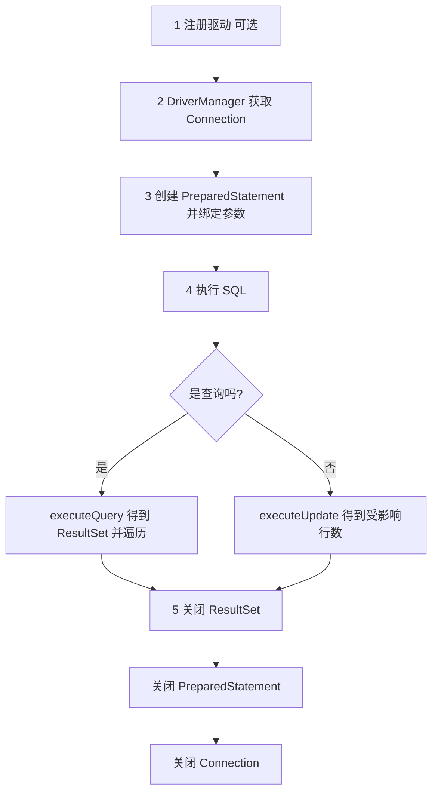
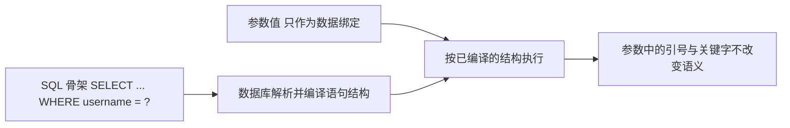
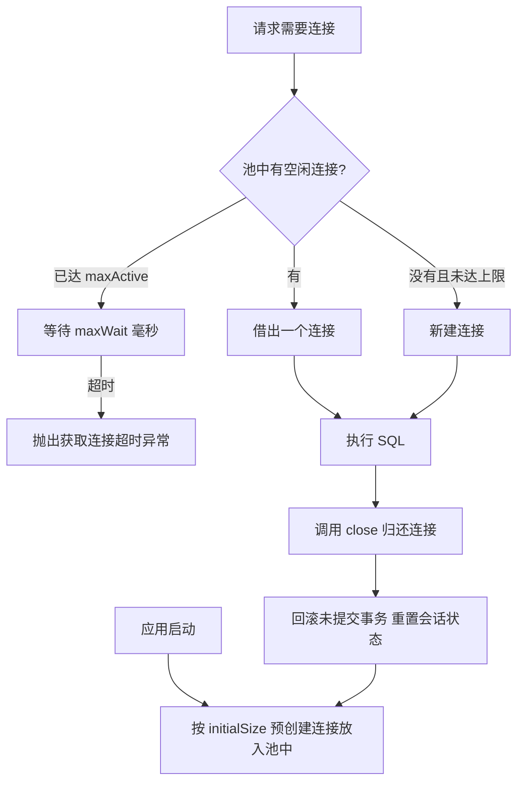
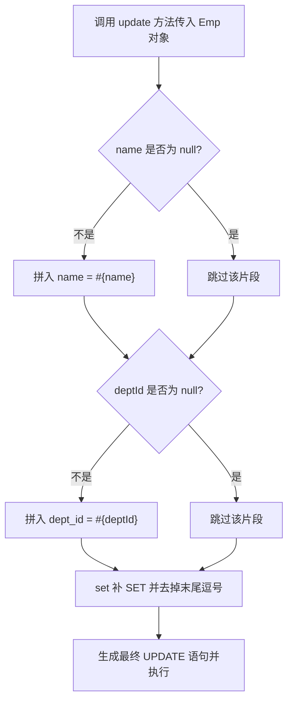

# 06 Web 后端基础（Java 操作数据库）

本章介绍 Java 如何访问关系型数据库：先看原生 JDBC 的连接、预编译、结果集和资源释放，再看连接池与 Druid 工具类，最后是 MyBatis 的注解映射、动态 SQL 与 XML 规范。示例中的账号密码统一写成占位符（例如 `${DB_PASSWORD}`），不要写入真实凭据。

读完后你应该能：

- 说出 JDBC 四大对象的职责和五步执行流程。
- 解释 SQL 注入的成因，并用 `PreparedStatement` 修复。
- 用连接池配置和 Druid 工具类管理连接，说明为什么不要每次请求都新建连接。
- 用 MyBatis 完成增删改查、主键回填、字段映射和动态 SQL。
- 读懂 XML 映射文件的 `namespace`、`id`、`resultType` 和 `#{}` 与 `${}` 的区别。

前置知识：第 05 章的 SQL 语法、多表查询与事务；第 04 章的 Spring Boot 工程结构；Maven 依赖管理。

## 1. JDBC

### 1.1 JDBC 是什么

JDBC（Java DataBase Connectivity）是 Java 操作关系型数据库的标准 API。JDK 在 `java.sql` 包中定义接口，数据库厂商提供驱动实现，程序只依赖统一接口就能执行 SQL，这样更换数据库时业务代码基本不用改。

JDBC 的基本对象包括：`Driver` 驱动、`Connection` 连接、`Statement/PreparedStatement` 语句、`ResultSet` 结果集。标准流程是加载驱动、获取连接、预编译 SQL、绑定参数、执行、读取结果、关闭资源。

常说的“四大对象”及其职责：

| 对象 | 作用 | 易错点 |
|---|---|---|
| `DriverManager` | 管理已注册的数据库驱动，根据 URL 选择驱动并获取连接 | 它不是连接池，每次 `getConnection` 都新建物理连接 |
| `Connection` | 代表一次数据库连接（会话），用于创建语句对象、控制事务、关闭连接 | 用完必须关闭或归还，否则连接池会被耗尽 |
| `Statement` / `PreparedStatement` | 携带并执行 SQL；`PreparedStatement` 预编译并支持 `?` 占位符 | 用 `Statement` 拼接用户输入会有 SQL 注入风险 |
| `ResultSet` | 保存查询结果集，`next()` 移动游标，`getXxx()` 按列名或列号取值 | 生命周期跟随语句，语句关闭后不能再读 |

关于 `DriverManager` 的表述要准确：它是驱动管理器，负责注册驱动、按 URL 匹配驱动并返回一个新的连接对象，它既不缓存也不复用连接，本身不具备连接池能力。连接复用是连接池组件（Druid、HikariCP 等）的职责，见 §1.5。

从 JDBC 4.0（Java 6）起支持驱动自动加载：只要驱动的 jar 在 classpath 中，`DriverManager` 就能通过 `META-INF/services/java.sql.Driver` 找到驱动，所以显式注册驱动的写法已经可以省略，老代码里保留它属于兼容写法。

```java
// JDBC 4.0 起可省略；写了也不会报错
Class.forName("com.mysql.cj.jdbc.Driver");
```

驱动类名随版本变化：MySQL 8 用 `com.mysql.cj.jdbc.Driver`，MySQL 5 用 `com.mysql.jdbc.Driver`，写错会报 `ClassNotFoundException`；URL 也要写对，MySQL 8 通常需要 `serverTimezone` 参数。

### 1.2 查询示例

~~~java
String sql = "SELECT id, username FROM user WHERE username = ?";
try (Connection conn = dataSource.getConnection();
     PreparedStatement stmt = conn.prepareStatement(sql)) {
    stmt.setString(1, username); // 绑定参数，避免 SQL 注入

    try (ResultSet rs = stmt.executeQuery()) {
        while (rs.next()) {
            System.out.println(rs.getLong("id"));
        }
    }
}
~~~

ResultSet 的 next() 移动到下一行，getXxx 按列名或列号读取数据。try-with-resources 自动关闭资源。

连接对象默认可能处于自动提交模式。需要把多条 SQL 作为一个整体时，应关闭自动提交，并在成功后提交、失败后回滚：

~~~java
try (Connection conn = dataSource.getConnection()) {
    conn.setAutoCommit(false);
    try {
        // 执行多条相关 SQL
        conn.commit();
    } catch (Exception ex) {
        conn.rollback();
        throw ex;
    }
}
~~~

executeUpdate() 用于 INSERT、UPDATE、DELETE，并返回受影响行数。多条语句应使用 Connection 的事务控制，成功 commit，失败 rollback。连接池预先创建并复用连接，减少频繁建立连接的开销；Spring Boot 项目通常自动配置 HikariCP，不要在每个请求中手动创建 DriverManager 连接。

增删改示例：

~~~java
String sql = "UPDATE dept SET name = ? WHERE id = ?";
try (Connection conn = dataSource.getConnection();
     PreparedStatement stmt = conn.prepareStatement(sql)) {
    stmt.setString(1, "技术部");
    stmt.setLong(2, 1L);
    int affected = stmt.executeUpdate();
    if (affected != 1) {
        throw new IllegalStateException("部门不存在");
    }
}
~~~

不要使用字符串拼接用户输入，例如 `"... WHERE name='" + name + "'"`，应使用 `?` 参数占位符防止 SQL 注入。

JDBC 中 `Statement` 直接执行字符串 SQL，容易产生注入；`PreparedStatement` 使用占位符并预编译，适合带参数的 SQL；`CallableStatement` 用于调用存储过程。生产代码一般优先使用 `PreparedStatement`。

本节后面展开细节：§1.3 是五步流程与资源关闭，§1.4 专门讲 SQL 注入与 `PreparedStatement` 的原理，§1.5 和 §1.6 讲连接池选型与 Druid 工具类封装。

### 1.3 原生 JDBC 五步流程与资源关闭

原生 JDBC 的执行过程可以归纳为五步，顺序记忆为“注册、连接、预编译、执行、释放”：

1. 注册驱动：JDBC 4.0 起可由 SPI 自动完成，通常省略。
2. 获取连接：通过 `DriverManager` 或连接池拿到 `Connection`。
3. 创建语句并绑定参数：用 SQL 骨架生成 `PreparedStatement`，再按序号设置参数。
4. 执行 SQL 并处理结果：查询用 `executeQuery()` 拿 `ResultSet`，增删改用 `executeUpdate()` 拿受影响行数。
5. 释放资源：关闭结果集、语句和连接。



```java
public class JdbcDemo {
    public static void main(String[] args) throws SQLException {
        String url = "jdbc:mysql://localhost:3306/tlias?serverTimezone=Asia/Shanghai";
        String user = System.getenv("DB_USERNAME");
        String password = System.getenv("DB_PASSWORD");
        String sql = "SELECT id, name FROM dept WHERE id = ?";

        // 3. 预编译 SQL，参数用 ? 占位
        try (Connection conn = DriverManager.getConnection(url, user, password);
             PreparedStatement stmt = conn.prepareStatement(sql)) {
            stmt.setLong(1, 1L);
            // 4. 执行查询并处理结果
            try (ResultSet rs = stmt.executeQuery()) {
                while (rs.next()) {
                    System.out.println(rs.getLong("id") + " " + rs.getString("name"));
                }
            }
        }
        // 5. try-with-resources 自动按逆序关闭资源
    }
}
```

两个执行方法要分清楚：

| 方法 | 用于 | 返回值 |
|---|---|---|
| `executeQuery()` | `SELECT` | `ResultSet` 结果集 |
| `executeUpdate()` | `INSERT`、`UPDATE`、`DELETE` | `int` 受影响行数 |

资源关闭顺序是新手最容易忽略的细节：后创建的先关闭，即 `ResultSet` → `PreparedStatement` → `Connection`。反过来关闭连接再关结果集，轻则报错，重则连接没有真正归还连接池。

`try-with-resources` 会自动按声明顺序的逆序关闭，所以声明顺序写成“连接、语句、结果集”即可得到正确的关闭顺序。如果手写 `finally`，要注意 `close()` 本身也可能抛异常，且不能因为它覆盖掉业务异常。

```java
// 手写关闭时用嵌套 try，保证前面关不掉也会继续关后面的
Connection conn = null;
PreparedStatement stmt = null;
ResultSet rs = null;
try {
    conn = dataSource.getConnection();
    stmt = conn.prepareStatement("SELECT id FROM dept");
    rs = stmt.executeQuery();
    // 处理结果
} finally {
    if (rs != null) {
        try { rs.close(); } catch (SQLException ignored) { }
    }
    if (stmt != null) {
        try { stmt.close(); } catch (SQLException ignored) { }
    }
    if (conn != null) {
        try { conn.close(); } catch (SQLException ignored) { }
    }
}
```

从连接池借出的 `Connection` 被 `close()` 时，行为是归还而不是物理销毁，因此仍然必须调用 `close()`，否则池里的连接会被逐步借空。

### 1.4 SQL 注入与 PreparedStatement

SQL 注入（SQL Injection）指的是用户输入被当成 SQL 代码的一部分拼进语句，从而改变了原本的查询语义。它发生的根本原因是把“数据”和“代码”混在了一起：字符串拼接无法区分哪段是开发者的 SQL、哪段是用户输入。

```java
// 反例：把用户输入直接拼进 SQL
String sql = "SELECT id, name, password FROM user WHERE username = '"
        + username + "' AND password = '" + password + "'";
Statement stmt = conn.createStatement();
ResultSet rs = stmt.executeQuery(sql);
```

假设用户输入中含有单引号，并且后面跟着一个恒成立的条件，拼接后的 SQL 结构就被改写了。这里只做示意，不给出可直接使用的完整攻击语句：

```text
-- 正常期望的 SQL
SELECT id, name, password FROM user WHERE username = '${USERNAME}' AND password = '${PASSWORD}'

-- 输入中含有引号和逻辑运算符后，条件部分被改写为恒真
-- 结果是：不需要知道真实密码也能查出记录
SELECT id, name, password FROM user WHERE username = '${USERNAME_WITH_QUOTE_AND_OR_TRUE}' -- ...
```

除了登录绕过，注入还能用于越权读取其它表的数据、批量删除数据，风险等级很高。防线很简单：凡是来自用户的输入，永远只用参数占位符传递。

`PreparedStatement` 防注入的原理是参数化查询，分两步：

1. SQL 骨架先用 `?` 占位发给数据库，数据库把语句结构解析成执行计划，此时语句的语法已经固定。
2. 参数值随后单独传入，作为“数据”参与执行，不再参与语法解析。因此参数里出现引号、分号、注释符或 SQL 关键字，都只是普通字符。



正确写法：

```java
String sql = "SELECT id, name, password_hash FROM user WHERE username = ? AND password_hash = ?";
try (Connection conn = dataSource.getConnection();
     PreparedStatement stmt = conn.prepareStatement(sql)) {
    stmt.setString(1, username);
    stmt.setString(2, passwordHash);
    try (ResultSet rs = stmt.executeQuery()) {
        // 只有真正匹配的行才会返回
    }
}
```

对比一下两种写法：

| 对比项 | 字符串拼接 `Statement` | 参数化查询 `PreparedStatement` |
|---|---|---|
| 参数角色 | 当作 SQL 语法的一部分 | 当作数据 |
| 注入风险 | 有 | 没有 |
| 预编译 | 每次都要重新解析 | 骨架可复用执行计划 |
| 类型处理 | 需要自己加引号、处理日期 | `setXxx` 自动处理类型 |
| 建议 | 只用于没有任何外部输入的固定 SQL | 所有带参数的 SQL |

补充说明：MySQL 驱动默认在客户端把参数转义后发送（`useServerPrepStmts=false`），安全性同样由驱动保证；开启 `useServerPrepStmts=true` 后由服务端预编译并复用执行计划，性能收益更明显。无论哪种模式，业务代码都只需要写 `?` 占位符。

关于 `${}` 占位符的注入风险属于 MyBatis 的话题，见 §3.1。

### 1.5 连接池原理与主流实现对比

在 Web 项目里直接用 `DriverManager.getConnection()` 获取连接，性能问题很突出：

- 每次调用都要走一遍 TCP 三次握手、身份认证、权限加载和会话初始化，通常要几十毫秒，而一条简单查询可能只需要一两毫秒，开销比业务本身还大。
- 每个请求都新建连接，用完再物理关闭，连接生命周期极短，无法复用。
- 并发升高时连接数会瞬间涨上去，容易超过数据库的 `max_connections`，报 “Too many connections”；同时也缺少统一的超时与回收策略。

连接池（connection pool）的思路是用空间和少量延迟换取复用：启动时先创建一批连接放在池子里，请求到来时借出，用完归还而不是销毁。



连接池的关键参数是同一套概念，换实现时名字可能不同：

| 参数含义 | Druid 名称 | HikariCP 名称 |
|---|---|---|
| 初始化连接数 | `initialSize` | `minimumIdle` 配合 `maximumPoolSize` |
| 最大连接数 | `maxActive` | `maximumPoolSize` |
| 最小空闲连接数 | `minIdle` | `minimumIdle` |
| 获取连接的最长等待时间 | `maxWait`（毫秒） | `connectionTimeout`（毫秒） |
| 连接最大存活时间 | `maxEvictableIdleTimeMillis` | `maxLifetime` |

主流实现对比：

| 实现 | 特点 | 优点 | 缺点 | 适用场景 |
|---|---|---|---|---|
| C3P0 | 早期最流行的连接池 | 配置简单，兼容老代码和旧框架 | 性能一般，版本更新慢 | 遗留项目 |
| DBCP | Apache Commons 提供 | 轻量，生态成熟，Tomcat 相关组件使用过 | 功能少，高并发下性能偏弱 | 简单小项目 |
| Druid | 阿里开源 | 性能好，自带监控页、SQL 统计和防火墙（WallFilter），中文文档全 | 配置项多，功能较重 | 需要 SQL 监控、审计的项目 |
| HikariCP | Spring Boot 2 起的默认连接池 | 速度极快，代码精简，稳定 | 自身监控能力弱，需要接入 Micrometer 等 | 追求性能的新项目 |

Spring Boot 引入 `spring-boot-starter-jdbc` 或 `spring-boot-starter-mybatis` 后默认装配 HikariCP；如果要改用 Druid，引入 `druid-spring-boot-starter` 或通过 `spring.datasource.type` 指定实现类。选型上：新项目默认 HikariCP 就够用，需要 SQL 审计和监控面板时选 Druid。

### 1.6 Druid 连接池与工具类封装

Druid 通过配置文件创建数据源，最常用的是 `druid.properties`，放在 `src/main/resources` 下：

```properties
driverClassName=com.mysql.cj.jdbc.Driver
url=jdbc:mysql://localhost:3306/tlias?useSSL=false&serverTimezone=Asia/Shanghai&characterEncoding=utf8
username=${DB_USERNAME}
password=${DB_PASSWORD}
initialSize=5
maxActive=10
maxWait=3000
```

常用配置项的含义：

| 配置项 | 含义 | 建议值 |
|---|---|---|
| `driverClassName` | 驱动全类名 | MySQL 8 用 `com.mysql.cj.jdbc.Driver` |
| `url` | 连接地址，含协议、主机、端口、库名和参数 | 按环境区分，附加 `serverTimezone` |
| `username` / `password` | 数据库账号与密码 | 用环境变量或配置中心注入，不要写死在仓库里 |
| `initialSize` | 池初始化时创建的连接数 | 5 左右，按并发量调整 |
| `maxActive` | 池中允许的最大连接数 | 10 到 20，不要超过数据库承载能力 |
| `maxWait` | 借不到连接时的最长等待毫秒数，超时抛异常 | 3000 |
| `minIdle` | 最小空闲连接数，低于它会补充连接 | 与 `initialSize` 一致 |
| `validationQuery` | 借出前校验连接是否可用的 SQL | 通常为 `SELECT 1` |
| `testWhileIdle` | 空闲时检测并剔除失效连接 | `true` |

注意 `properties` 文件不做变量替换，上面写的 `${DB_USERNAME}` 只是占位示意；实际使用时应通过启动脚本、环境变量或配置中心传入真实值，或者直接在代码里读取环境变量后 `setUsername` / `setPassword`。

封装工具类的目标是：整个应用共用一个数据源，业务代码只关心“取连接”和“还连接”。静态代码块在类加载时执行一次，适合初始化数据源这种重量级对象：

```java
public final class JdbcUtils {
    private static final DataSource DATA_SOURCE;

    static {
        try (InputStream in = JdbcUtils.class.getClassLoader()
                .getResourceAsStream("druid.properties")) {
            Properties props = new Properties();
            props.load(in);
            DATA_SOURCE = DruidDataSourceFactory.createDataSource(props);
        } catch (Exception e) {
            // 初始化失败要让错误立刻暴露，而不是留到第一次查询才报
            throw new ExceptionInInitializerError(e);
        }
    }

    private JdbcUtils() {
    }

    public static Connection getConnection() throws SQLException {
        return DATA_SOURCE.getConnection();
    }

    public static void close(AutoCloseable... resources) {
        for (AutoCloseable resource : resources) {
            if (resource != null) {
                try {
                    resource.close();
                } catch (Exception e) {
                    // 关闭失败只记录日志，不要覆盖业务异常
                }
            }
        }
    }
}
```

使用方式：

```java
String sql = "SELECT id, name FROM dept WHERE id = ?";
Connection conn = null;
PreparedStatement stmt = null;
ResultSet rs = null;
try {
    conn = JdbcUtils.getConnection();
    stmt = conn.prepareStatement(sql);
    stmt.setLong(1, 1L);
    rs = stmt.executeQuery();
} finally {
    JdbcUtils.close(rs, stmt, conn);
}
```

工具类只对外暴露 `DataSource`，不暴露 `DruidDataSource`，这样将来换成 HikariCP 时，改动只集中在工具类内部。也可以用 `new DruidDataSource()` 逐个 `setXxx` 设置属性，效果等价，但配置文件方式更适合区分环境。

依赖坐标是 `com.alibaba:druid`（Spring Boot 项目更常用 `com.alibaba:druid-spring-boot-starter`），版本以 Maven 中央仓库的当前发布为准，写作时为 1.2.x 系列，不要照抄旧文章里的版本号。封装工具类需要用到这些类型：

```java
import com.alibaba.druid.pool.DruidDataSourceFactory;
import javax.sql.DataSource;
import java.io.InputStream;
import java.sql.Connection;
import java.sql.PreparedStatement;
import java.sql.ResultSet;
import java.sql.SQLException;
import java.util.Properties;
```

其中 `DruidDataSourceFactory.createDataSource(Properties)` 负责按配置创建数据源，它返回的对象实现了 `DataSource` 接口，因此上层代码依赖接口即可。

## 2. MyBatis

MyBatis 是持久层框架，它负责参数绑定、SQL 执行和结果映射，但 SQL 仍由开发者编写。它适合需要精确控制 SQL、动态条件和复杂关联查询的项目。

### 2.1 注解 Mapper

~~~java
@Mapper
public interface DeptMapper {
    @Select("SELECT id, name, create_time, update_time FROM dept")
    List<Dept> findAll();

    @Delete("DELETE FROM dept WHERE id = #{id}")
    void deleteById(Long id);
}
~~~

`@Mapper` 标记 Mapper 接口，MyBatis 会为接口创建代理对象。`#{id}` 会生成预编译参数，推荐用于用户输入；返回集合时要确认实体字段和数据库列能正确映射。

### 2.2 XML 动态 SQL

~~~xml
<select id="find" resultType="com.example.Dept">
  SELECT id, name FROM dept
  <where>
    <if test="name != null and name != ''">
      name LIKE CONCAT('%', #{name}, '%')
    </if>
  </where>
  ORDER BY id DESC
</select>
~~~

井号占位符表示预编译参数，应优先使用；美元占位符是字符串替换，只能用于可信表名或列名。

动态 SQL 常用标签：`<if>` 按条件拼接，`<where>` 自动处理多余的 AND/WHERE，`<set>` 处理更新语句的逗号，`<foreach>` 生成 IN 条件或批量语句。

~~~xml
<select id="findByIds" resultType="com.example.Dept">
  SELECT id, name FROM dept
  <where>
    <if test="ids != null and ids.size() > 0">
      id IN
      <foreach collection="ids" item="id" open="(" separator="," close=")">
        #{id}
      </foreach>
    </if>
  </where>
</select>
~~~

### 2.3 JDBC 和 MyBatis 对比

| 项目 | JDBC | MyBatis |
|---|---|---|
| 样板代码 | 多 | 少 |
| SQL 位置 | Java 字符串 | 注解或 XML |
| 结果映射 | 手动 | 自动映射 |
| 动态 SQL | 手工拼接 | if、where、foreach |

复杂关联查询可使用 resultMap 映射字段和嵌套对象；多个参数建议使用 @Param 明确名称。可复用 SQL 片段用 sql 和 include，但动态列名必须白名单校验。

多参数方法建议显式命名：

~~~java
List<Dept> find(@Param("name") String name, @Param("status") Integer status);
~~~

`resultMap` 适合数据库列名和 Java 属性名不同，或需要映射嵌套对象、集合的情况。`<sql>` 和 `<include>` 可以复用列清单，但不要把未经校验的列名直接放入 `${}`。

增删改查标签的返回值要和业务语义一致：`<select>` 返回对象或集合，`<insert>`、`<update>`、`<delete>` 通常返回受影响行数。插入主键回填可以使用 `useGeneratedKeys="true" keyProperty="id"`，之后再保存依赖该主键的子表记录。

### 2.4 主键回填：@Options

主键回填（generated keys）指的是：插入完成后，把数据库生成的自增主键写回参数对象的属性，这样不用再查一次就能继续使用这个 id。MyBatis 通过 `useGeneratedKeys` 和 `keyProperty` 两个属性实现，注解写法是 `@Options`：

```java
@Mapper
public interface EmpMapper {
    @Options(useGeneratedKeys = true, keyProperty = "id")
    @Insert("INSERT INTO emp(username, name, dept_id) VALUES(#{username}, #{name}, #{deptId})")
    void insert(Emp emp);
}
```

- `useGeneratedKeys = true`：告诉 MyBatis 使用数据库自增生成的主键。
- `keyProperty = "id"`：把取回的主键值设置到参数对象的哪个属性上，这里是 `Emp.id`。

效果是调用结束后 `emp.getId()` 就有值了：

```java
Emp emp = new Emp();
emp.setUsername("zhangsan");
emp.setName("张三");
emp.setDeptId(1L);

empMapper.insert(emp);
Long id = emp.getId();   // 插入后已回填，可直接用于插入工作经历等子表
```

XML 映射文件里的等价写法是把两个属性写在 `<insert>` 标签上：

```xml
<insert id="insert" useGeneratedKeys="true" keyProperty="id">
  INSERT INTO emp(username, name, dept_id)
  VALUES(#{username}, #{name}, #{deptId})
</insert>
```

批量插入时 `keyProperty` 可以写成对象数组形式对应集合元素，但要求数据库支持返回多组自增键（MySQL 通常不逐个返回），因此批量场景更常见的做法是插入后单独查询。

常见坑：

- `keyProperty` 必须与实体中真实存在的属性名一致，写错不会报错但取不到值。
- 方法有多个参数时，回填目标要写在对象参数上，例如 `insert(@Param("emp") Emp emp)` 时写成 `keyProperty = "emp.id"`。
- 数据库不是自增主键（例如 Oracle 序列）时不能用 `useGeneratedKeys`，应改用 `<selectKey>` 先取序列值再插入。
- 只有 `INSERT` 有主键回填的概念，`UPDATE`、`DELETE` 不涉及。

### 2.5 属性名与数据库字段名不一致的三种解决方案

Java 属性习惯用驼峰命名（`createTime`、`deptId`），数据库列习惯用下划线（`create_time`、`dept_id`）。MyBatis 的自动映射只按列名和属性名匹配，不做下划线转驼峰，因此直接查询会出现“数据查到了但字段是 null”的现象。

三种解决方案：

方案一，在 SQL 里起别名，让列名与属性名一致：

```java
@Select("SELECT id, name, create_time AS createTime, dept_id AS deptId FROM emp WHERE id = #{id}")
Emp findById(Long id);
```

方案二，用 `resultMap` 手动声明映射关系：

```xml
<resultMap id="empResultMap" type="com.example.pojo.Emp">
  <id column="id" property="id"/>
  <result column="create_time" property="createTime"/>
  <result column="dept_id" property="deptId"/>
  <result column="name" property="name"/>
</resultMap>

<select id="findById" resultMap="empResultMap">
  SELECT id, name, create_time, dept_id FROM emp WHERE id = #{id}
</select>
```

`<id>` 用于主键列，`<result>` 用于普通列；`type` 是实体类的全限定名。`resultMap` 还能映射嵌套对象（`<association>`）和集合（`<collection>`），这是别名方案做不到的。

方案三，开启驼峰命名自动映射，让 `create_time` 自动映射到 `createTime`：

```yaml
mybatis:
  configuration:
    map-underscore-to-camel-case: true
```

开启后 `resultType` 就能正常工作：

```xml
<select id="findById" resultType="com.example.pojo.Emp">
  SELECT id, name, create_time, dept_id FROM emp WHERE id = #{id}
</select>
```

三种方案的对比：

| 方案 | 写法 | 适用场景 | 优点 | 缺点 |
|---|---|---|---|---|
| SQL 起别名 | `create_time AS createTime` | 少量字段不一致，临时查询 | 不改配置，一眼看出映射关系 | 列名多时啰嗦，别名写错不易发现 |
| `resultMap` | `<resultMap>` 手动映射 | 字段名差异大、需要嵌套映射 | 映射清晰可控，支持复杂结构 | 配置量大，新增列要同步维护 |
| 驼峰自动映射 | `map-underscore-to-camel-case: true` | 命名规范统一（下划线列对驼峰属性） | 一次配置全局生效，代码最少 | 要求命名严格对应，无法处理任意差异 |

实践建议：项目统一开启驼峰映射作为默认方案，遇到不规则的列名或嵌套对象再单独写 `resultMap`。注意同时存在 `resultType` 和 `resultMap` 时以 `resultMap` 为准，两者不能混用。

### 2.6 动态 SQL 详解

动态 SQL 指按运行时参数决定最终 SQL 文本的机制：参数不同，拼出来的语句不同，从而避免为每种条件组合写一个方法。MyBatis 用 `<if>`、`<where>`、`<set>`、`<foreach>` 等标签表达这些逻辑，`test` 属性里写 OGNL 表达式。

`<if>` 按条件决定是否拼接片段：

```xml
<select id="find" resultType="com.example.pojo.Emp">
  SELECT id, name, dept_id FROM emp
  <where>
    <if test="name != null and name != ''">
      AND name LIKE CONCAT('%', #{name}, '%')
    </if>
    <if test="deptId != null">
      AND dept_id = #{deptId}
    </if>
  </where>
  ORDER BY id DESC
</select>
```

`<where>` 做两件事：有内容时补上 `WHERE` 关键字；自动去掉开头多余的 `AND` 或 `OR`。没有它就得写成 `WHERE 1 = 1 AND ...` 这种占位技巧。

`<set>` 用于更新语句，会补上 `SET` 并去掉末尾多余的逗号：

```xml
<update id="update">
  UPDATE emp
  <set>
    <if test="username != null">username = #{username},</if>
    <if test="name != null">name = #{name},</if>
    <if test="deptId != null">dept_id = #{deptId},</if>
  </set>
  WHERE id = #{id}
</update>
```

`<foreach>` 用于遍历集合，五个属性要分清：

| 属性 | 含义 | 常用写法 |
|---|---|---|
| `collection` | 要遍历的集合。参数是 `List` 时写 `list`，是数组时写 `array`，用 `@Param` 或 Map 时写参数名 | `ids` |
| `item` | 每次迭代的元素变量名，在 `#{}` 中引用 | `id` |
| `separator` | 元素之间的分隔符 | `,` |
| `open` / `close` | 拼接内容前后的符号 | `(` 与 `)` |
| `index` | 迭代下标（遍历 Map 时是键） | 一般省略 |

`IN` 查询的写法：

```xml
<select id="findByIds" resultType="com.example.pojo.Emp">
  SELECT id, name FROM emp
  <where>
    <if test="ids != null and ids.size() > 0">
      id IN
      <foreach collection="ids" item="id" open="(" separator="," close=")">
        #{id}
      </foreach>
    </if>
  </where>
</select>
```

批量插入的写法是让 `separator` 提供每组值之间的逗号，`item` 指向集合里的元素对象：

```xml
<insert id="insertBatch">
  INSERT INTO emp(username, name, dept_id) VALUES
  <foreach collection="list" item="emp" separator=",">
    (#{emp.username}, #{emp.name}, #{emp.deptId})
  </foreach>
</insert>
```

批量插入一次几百到一千条比较合适，条数过大可能超过 `max_allowed_packet`，应按批切分后循环调用。

`<sql>` 和 `<include>` 用于抽取可复用的片段，例如列清单：

```xml
<sql id="baseColumns">id, username, name, dept_id, create_time</sql>

<select id="findById" resultType="com.example.pojo.Emp">
  SELECT <include refid="baseColumns"/> FROM emp WHERE id = #{id}
</select>
```

`<sql>` 定义片段并给一个 id，`<include refid="..."/>` 引用它；片段里也可以写 `<if>` 等动态标签，实现更灵活的复用。

动态 SQL 的执行过程可以这样理解，同一个方法根据参数走不同分支：



常见的动态 SQL 标签还有 `<choose>`、`<when>`、`<otherwise>`（多分支选择，相当于 switch）和 `<trim>`（自定义前后缀与去除规则，`<where>` 和 `<set>` 都可以用它实现）。

```xml
<select id="findWithOrder" resultType="com.example.pojo.Emp">
  SELECT id, name, salary FROM emp
  <where>
    <choose>
      <when test="minSalary != null">salary &gt;= #{minSalary}</when>
      <otherwise>salary &gt;= 0</otherwise>
    </choose>
  </where>
  ORDER BY id
</select>
```

注意 XML 中 `<`、`>` 等符号要转义或放进 `CDATA`，否则解析会报错。

## 3. 配置和分页


~~~yaml
spring:
  datasource:
    url: jdbc:mysql://localhost:3306/tlias?serverTimezone=Asia/Shanghai
    username: root
    password: 123456
mybatis:
  configuration:
    map-underscore-to-camel-case: true
~~~

分页需要 total 和当前页 rows。原始实现使用 LIMIT offset, pageSize，也可以使用 PageHelper 简化。

分页计算公式：`offset = (page - 1) * pageSize`。接口通常先查询总数，再查询当前页数据，最后封装为：

~~~java
public record PageResult<T>(long total, List<T> rows) {
}
~~~

MyBatis 常用配置还包括驼峰命名映射、日志实现和 Mapper 扫描：

~~~yaml
mybatis:
  mapper-locations: classpath:mapper/*.xml
  type-aliases-package: com.example.pojo
  configuration:
    map-underscore-to-camel-case: true
    log-impl: org.apache.ibatis.logging.stdout.StdOutImpl
~~~

### 3.1 XML Mapper 基本结构

XML 文件的 namespace 应与 Mapper 接口全限定名一致，标签的 `id` 应与接口方法名一致：

~~~xml
<mapper namespace="com.example.mapper.DeptMapper">
  <select id="findById" resultType="com.example.pojo.Dept">
    SELECT id, name, create_time, update_time
    FROM dept
    WHERE id = #{id}
  </select>
</mapper>
~~~

`resultType` 适合简单自动映射，`resultMap` 适合字段名不同或嵌套对象。数据库下划线字段和 Java 驼峰属性可以通过 `map-underscore-to-camel-case` 自动转换。

三个必须对齐的约定：

- `namespace` 必须写成 Mapper 接口的全限定名（包名 + 类名），例如 `com.example.mapper.DeptMapper`。写错时启动不报错，调用时报 `Invalid bound statement (not found)`。
- 每个标签的 `id` 必须与接口方法名完全一致，包括大小写；方法重载在 MyBatis 中不支持，因为 id 是唯一标识。
- 参数与返回值类型：`parameterType` 声明入参类型，`resultType` 声明返回值类型（查询结果的一行映射成什么对象）。两者都可以省略：`parameterType` 能由方法签名推断，`resultType` 在返回类型明确时也能推断，但显式写出更利于阅读。

```xml
<select id="findByNameAndStatus" parameterType="com.example.dto.EmpQuery"
        resultType="com.example.pojo.Emp">
  SELECT id, name, dept_id, create_time
  FROM emp
  WHERE name = #{name} AND status = #{status}
</select>
```

`#{}` 与 `${}` 的区别是安全问题的核心，必须记牢：

| 写法 | 机制 | 是否防注入 | 适用场景 |
|---|---|---|---|
| `#{name}` | 生成 JDBC 的 `?` 占位符，参数作为数据绑定 | 是 | 所有参数值，默认都该用它 |
| `${name}` | 把值直接文本替换进 SQL 字符串 | 否，存在注入风险 | 表名、列名、`ORDER BY` 排序字段等不能用占位符的位置 |

```xml
<!-- 危险：排序字段用 $ 拼接，必须加白名单校验 -->
<select id="findWithOrder" resultType="com.example.pojo.Emp">
  SELECT id, name FROM emp ORDER BY ${orderColumn}
</select>
```

需要对 `ORDER BY` 使用 `${}` 时，先在 Java 侧用白名单校验字段名（只允许 `id`、`salary`、`create_time` 等固定取值），再传给 Mapper，绝不能把前端参数直接传进来。

参数命名的细节：只有一个简单类型参数时，`#{}` 里写什么名字都能取到值，但建议与语义一致；有多个参数时必须用 `@Param` 指定名称，否则只能写 `arg0`、`param1` 这类默认名，容易写错。集合和数组参数默认名为 `list`、`array`，也可以用 `@Param` 改名。


### 3.2 连接池和资源管理

连接池负责提前创建并复用数据库连接。请求结束后调用 `close()` 通常是把连接归还连接池，而不是物理销毁。连接不关闭会导致连接池耗尽，表现为请求越来越慢甚至无法访问数据库。

### 3.3 Lombok 常用注解

常见的 Lombok 注解及其生成内容：

| 注解 | 生成内容 |
|---|---|
| `@Getter` / `@Setter` | 所有字段的读取方法 / 赋值方法（也可只加在单个字段或类上） |
| `@ToString` | `toString`，默认包含所有非静态字段 |
| `@EqualsAndHashCode` | `equals` 与 `hashCode` |
| `@NoArgsConstructor` | 无参构造器 |
| `@AllArgsConstructor` | 全参构造器 |
| `@RequiredArgsConstructor` | 必需参数构造器，只包含 `final` 字段和标了 `@NonNull` 的字段 |
| `@Data` | 以上大部分的组合：`@Getter`、`@Setter`、`@ToString`、`@EqualsAndHashCode`、`@RequiredArgsConstructor` |
| `@Slf4j` | 一个名为 `log` 的日志对象 |

因此说“`@Data` 只生成 getter 和 setter”是不准确的：`@Data` 等价于 `@Getter` + `@Setter` + `@ToString` + `@EqualsAndHashCode` + `@RequiredArgsConstructor`，除了读写方法，还会生成 `toString`、`equals`、`hashCode`，以及覆盖“必需参数”的构造方法（`final` 字段和 `@NonNull` 字段参与，普通非 final 字段不参与）。

```java
@Data
public class Dept {
    private Long id;
    private String name;
    private LocalDateTime createTime;
}
```

上面这个类会被编译成含有 `getId`、`setId`、`toString`、`equals`、`hashCode` 以及一个无参构造器（因为没有 `final` 字段，`@RequiredArgsConstructor` 生成的就是无参构造器）的类，但不会生成 `Dept(Long, String, LocalDateTime)` 这样的全参构造器，需要时得自己加 `@AllArgsConstructor`。

几个实务注意点：

- Spring MVC 接收 JSON 请求体时需要有参或无参构造器加 setter，缺少无参构造器会导致反序列化失败，所以实体通常同时保留 `@NoArgsConstructor`。
- `@Builder` 会生成全参构造器并去掉默认无参构造器，若还要反序列化，须补上 `@NoArgsConstructor @AllArgsConstructor`。
- `@Data` 生成的 `equals` 和 `hashCode` 包含所有字段，双向关联的实体互相引用时可能递归；JPA 实体更推荐用主键参与，例如 `@EqualsAndHashCode(onlyExplicitlyIncluded = true)` 配合 `@EqualsAndHashCode.Include`。
- `@Data` 不会生成日志对象，需要日志时单独加 `@Slf4j`。

配置文件中的敏感信息应通过环境变量或配置中心注入；不要把数据库密码、云存储密钥写入公开仓库。常见配置优先级由命令行参数、环境变量、配置文件等共同决定，排错时要确认最终生效值。

## 4. 小白易错点

- 认为 `DriverManager` 是连接池，或者在每个请求里调用 `DriverManager.getConnection()`。
- 只关闭 `Connection`，忘记关闭 `ResultSet` 和 `PreparedStatement`，或者关闭顺序写反。
- 用字符串拼接构造 SQL，把用户输入直接拼进语句。
- 把 `${}` 当成 `#{}` 使用，参数值走文本替换导致注入。
- 忘记先把配置文件读进 `Properties` 就调用 `DruidDataSourceFactory.createDataSource`，或者用绝对路径读取，打包后找不到文件。
- `maxActive` 设得过大，把数据库的连接数占满。
- `@Options` 的 `keyProperty` 写成数据库列名而不是实体属性名。
- 数据库列名 `create_time` 与 Java 属性 `createTime` 不一致，却既没开启驼峰映射也没写 `resultMap`，查询结果全是 null。
- 动态 SQL 里只写 `<if>` 不写 `<where>`，拼出 `WHERE AND ...` 的语法错误。
- `<foreach>` 的 `collection` 名字写错，或者多参数方法漏了 `@Param`，报参数找不到。
- XML 中的 `<`、`>` 没有转义，导致映射文件解析失败。
- `namespace` 或标签 `id` 与接口不一致，报 `Invalid bound statement (not found)`。
- 误以为 `@Data` 会生成全参构造器，或者用了 `@Builder` 却忘记补 `@NoArgsConstructor`。

## 5. 练习清单

1. 用原生 JDBC 完成 `dept` 表的查询与新增，并用 `try-with-resources` 管理资源。
2. 写一段存在 SQL 注入风险的登录代码，再用 `PreparedStatement` 修复，说明注入的触发条件。
3. 编写 `druid.properties` 并封装 `JdbcUtils`，提供 `getConnection` 与 `close` 两个方法。
4. 用 MyBatis 注解完成部门表的增删改查，并用主键回填拿到新增部门的 id。
5. 用 `resultMap` 与驼峰映射两种方式处理 `create_time` 的映射，比较配置量和适用场景。
6. 用 `<foreach>` 实现按 id 集合批量查询员工。
7. 用 `<foreach>` 实现批量插入员工，并用 `<set>` 与 `<if>` 实现条件更新。
8. 用 `<sql>` 与 `<include>` 抽取列清单，在多个查询中复用。
9. 故意把某个查询的 `namespace` 写错，观察报错信息后再改回，记住错误提示。

## 6. 资料对应关系

- 《JavaWeb笔记》：JDBC、数据库连接池与 MyBatis 章节。
- 第 05 章：本章 SQL 所依赖的建表、多表查询与事务基础。
- 第 09 章：事务在业务层的落地方式，与本章的 `setAutoCommit` 互相印证。
- `../mysql/03-事务.md`、`../mysql/06-索引.md`：事务与索引的深入内容。

## 7. 本章总结

- JDBC 帮助理解连接、预编译、结果集和资源关闭。
- MyBatis 减少样板代码，但 SQL 仍需开发者设计。
- 参数优先使用预编译绑定，动态 SQL 使用 where、if、foreach。
- `DriverManager` 只负责注册驱动与获取连接，连接复用属于连接池的职责。
- 动态 SQL 每个标签只解决一件事：`if` 判断、`where` 去前缀、`set` 去尾巴、`foreach` 遍历。
- `#{}` 是预编译占位符，`${}` 是文本替换，后者必须白名单校验。
