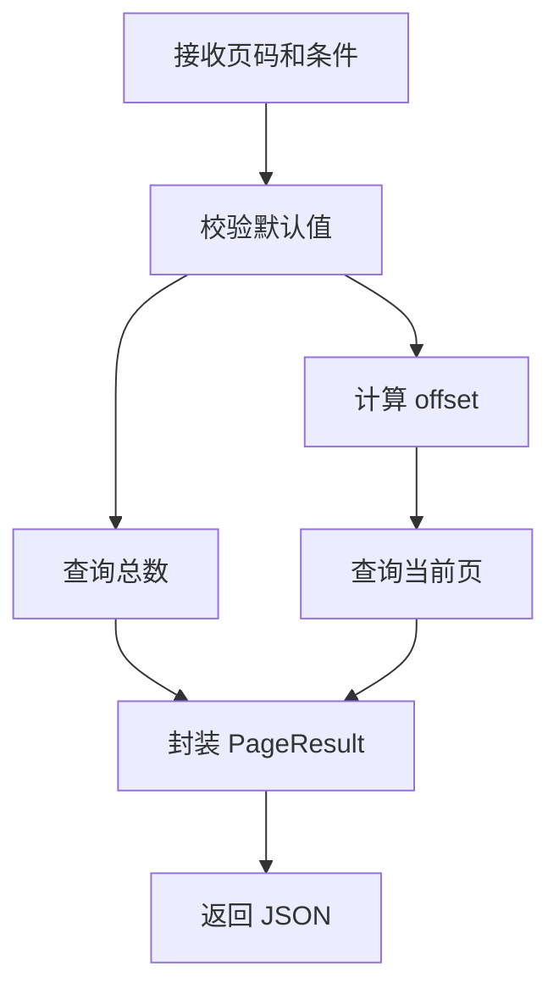
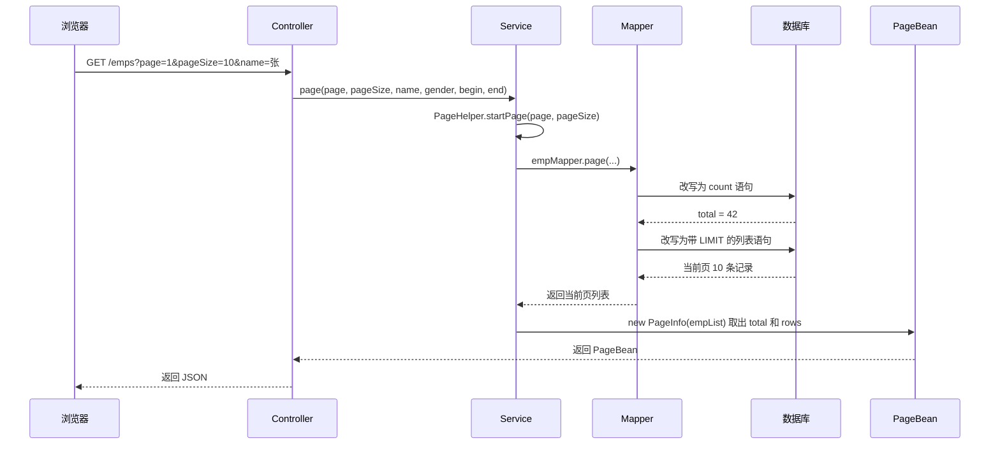

# 08 后端 Web 实战（员工管理：多表与分页）

员工管理是 Tlias 案例的核心模块：部门、员工、工作经历、项目之间存在表与表的关联，列表页还要求“带条件的模糊查询 + 分页”。本章先讲清多表关系和连接方式，再走通条件分页的完整链路，最后补齐动态 SQL、批量操作和元数据字段等细节。

## 1. 多表关系

### 1.1 三种关系对比

多表关系的本质是：同一个业务概念的数据被拆到多张表，再靠关联字段拼回来。设计顺序是“先确定谁是主表、谁是从表，再决定关联字段放在哪张表，最后决定删除策略”。

| 关系 | 举例 | 外键（关联字段）放在哪张表 | 查询时怎么连接 |
|---|---|---|---|
| 一对多 | 部门与员工 | 多的一方，员工表保存 `dept_id` | `emp e LEFT JOIN dept d ON e.dept_id = d.id` |
| 一对一 | 员工与员工档案 | 常用从表保存 `emp_id`，并加唯一索引 | `emp e JOIN emp_card c ON e.id = c.emp_id` |
| 多对多 | 员工与项目 | 两边都不放，新建中间表保存两边主键 | 连接两次：`emp` 先连中间表，中间表再连 `project` |

判断口诀：问一句“一方的记录能对应几行对方的记录”。一个部门对应多名员工是一对多；一名员工只对应一份档案是一对一；一名员工参与多个项目、一个项目也有多名员工是多对多。

### 1.2 一对多的典型场景与建表方式

一对多是最常见的关系，例如部门与员工、分类与商品、用户与订单。关联字段必须放在多的一方，因为“一”的一方没法保存多个 ID，除非存逗号分隔的字符串，那样既建不了索引，也做不了连接查询。

```sql
CREATE TABLE dept (id BIGINT PRIMARY KEY AUTO_INCREMENT, name VARCHAR(20));
CREATE TABLE emp (id BIGINT PRIMARY KEY AUTO_INCREMENT, name VARCHAR(20),
  dept_id BIGINT, KEY idx_emp_dept_id (dept_id));
```

两点注意：多的一方关联字段要建索引，否则按部门查员工时会全表扫描；`dept_id` 是否允许为 `NULL` 由业务决定，Tlias 中未分配部门的员工就是 `dept_id` 为空，这也是列表查询要用左外连接的原因。

### 1.3 一对一的典型场景与建表方式

一对一常用于“主表字段少、从表字段多或访问频率低”的拆分，例如员工基本信息与员工档案（身份证、学历、紧急联系人）。关联字段放在从表，并在从表上加唯一索引，防止一条主表记录对应出多条从表记录。

```sql
CREATE TABLE emp_card (id BIGINT PRIMARY KEY AUTO_INCREMENT,
  emp_id BIGINT NOT NULL, UNIQUE KEY uk_emp_card_emp_id (emp_id));
```

如果从表一定不能缺失，可以把主键直接当外键复用，即 `emp_card.id` 既为主键又等于 `emp.id`，省掉一个索引。

### 1.4 多对多的典型场景与建表方式

多对多必须引入中间表，例如员工与项目、学生与课程、商品与标签。中间表只存两边的 ID，联合主键天然防止重复。

```sql
CREATE TABLE emp_project (emp_id BIGINT NOT NULL, project_id BIGINT NOT NULL,
  PRIMARY KEY (emp_id, project_id));
```

如果关系本身还带属性（参与时间、角色），就给中间表补一个自增主键，改用联合唯一索引保证关系不重复。

### 1.5 物理外键与逻辑外键

项目中常使用逻辑外键，由应用层维护关系，减少数据库强约束对迁移的影响。

物理外键由数据库约束引用关系，数据一致性强，但删除和迁移限制较多；逻辑外键只保存关联 ID，由应用和业务代码保证关系，项目迁移更灵活。无论采用哪种方式，关联字段都应建立索引并在删除时明确处理策略。

| 对比项 | 物理外键（数据库 FOREIGN KEY） | 逻辑外键（只保存关联 ID） |
|---|---|---|
| 谁保证一致性 | 数据库约束，插入和删除都会被检查 | 应用代码和业务校验 |
| 一致性强度 | 强，不可能插入不存在的 `dept_id` | 靠代码，写漏就可能产生脏数据 |
| 写入性能 | 每次写操作都要检查约束，批量导入更慢 | 没有额外约束开销 |
| 删除数据 | 部门下有员工时删不掉，要先处理子表 | 数据库不拦，需要在业务层先查子表 |
| 迁移与导数据 | 有父表先于子表的顺序要求 | 顺序自由，表结构变更和导数据更方便 |
| 分库分表、微服务 | 跨库外键无法建立 | 只保存 ID，天然支持 |
| 典型场景 | 教学、强一致的小系统 | Tlias 这类项目、互联网业务 |

实际项目更常用逻辑外键的三个原因：表结构变更和数据迁移不受约束限制；分库分表或服务拆分后跨表外键根本建不起来；删除策略由业务决定，例如“部门下有员工就不允许删除”，比数据库直接抛异常更友好。代价是关系维护的责任转移到代码里，删除前必须先查子表。

一对多查询时，员工表是多的一方，通常保存 `dept_id`；一对一关系要求关联字段唯一；多对多关系需要中间表保存两边主键。设计多表关系时先确定“谁是主表、谁是从表”，再决定关联字段和删除策略：查询列表通常以员工为主表使用 `LEFT JOIN`，编辑详情时可分别查询主表和子表，避免连接多个一对多关系造成笛卡尔积。

## 2. 多表查询

连接员工和工作经历时，一名员工可能产生多行。列表查询应只连接需要展示的表，详情查询再聚合经历，或使用 resultMap 的 collection 映射。

### 2.1 五种查询方式对比

| 类型 | 语法特征 | 结果特点 | 常见用途 |
|---|---|---|---|
| 内连接 | `FROM emp e INNER JOIN dept d ON e.dept_id = d.id`（也可写成 `FROM emp e, dept d WHERE ...`） | 只保留两表都匹配的记录 | 只关注两表都有对应数据的情况 |
| 左外连接 | `FROM emp e LEFT JOIN dept d ON e.dept_id = d.id` | 保留左表全部记录，右表不匹配补 `NULL` | 列表查询，员工没有部门也要显示 |
| 右外连接 | `FROM emp e RIGHT JOIN dept d ON ...` | 保留右表全部记录 | 把左右表调换后用左外连接即可，实际少用 |
| 自连接 | `FROM emp e JOIN emp m ON e.manager_id = m.id` | 同一张表当两张表连接 | 上下级、菜单树、同类推荐 |
| 子查询 | 括号里再套一条 `SELECT` | 返回一个值、一列、多列或一张临时表 | 先统计再筛选，先查 ID 再查明细 |

### 2.2 给表起别名

多表查询里列名经常重名（`emp.name` 和 `dept.name`），表名又长，所以每张表都起简短别名：表别名紧跟表名，之后整条 SQL 都用别名引用列；列别名用 `AS` 起，让结果集列名可读，并能和实体属性、`resultMap` 对应。

```sql
SELECT e.name, d.name AS dept_name FROM emp e JOIN dept d ON e.dept_id = d.id;
```

### 2.3 内连接：隐式与显式

```sql
-- 隐式内连接：连接条件写在 WHERE 里
SELECT e.name, d.name AS dept_name FROM emp e, dept d WHERE e.dept_id = d.id;

-- 显式内连接：连接条件写在 ON 里，推荐
SELECT e.name, d.name AS dept_name FROM emp e JOIN dept d ON e.dept_id = d.id;
```

两种写法结果完全相同。显式写法把“怎么连”和“怎么筛”分开：`ON` 只写两表关系，`WHERE` 只写业务过滤条件，后续加条件时不容易漏掉连接条件，漏掉就会变成笛卡尔积。

### 2.4 外连接与 ON、WHERE 的区别

```sql
-- 保留所有员工，没有部门的员工，部门字段为 NULL
SELECT e.id, e.name, d.name AS dept_name
FROM emp e LEFT JOIN dept d ON e.dept_id = d.id;
```

左外连接保留左表全部记录，右表匹配不上时补 `NULL`。员工列表必须用它：`INNER JOIN` 会把没有分配部门的员工整行丢掉，前端看到的人数就少了。对从表加条件时要写在 `ON`，写到 `WHERE` 会把外连接退化成内连接：

```sql
-- 正确：从表条件写在 ON，左表记录仍然保留
SELECT e.id, e.name, d.name AS dept_name FROM emp e
LEFT JOIN dept d ON e.dept_id = d.id AND d.name = '研发部';

-- 错误：从表条件写到 WHERE，dept 为 NULL 的行被筛掉，等价于内连接
SELECT e.id, e.name, d.name AS dept_name FROM emp e
LEFT JOIN dept d ON e.dept_id = d.id WHERE d.name = '研发部';
```

原因是外连接先把从表不匹配的行补成 `NULL`，`WHERE` 再对这些行做过滤，而 `NULL = '研发部'` 的结果是 `UNKNOWN`，这些行会被全部丢掉。对主表（左表）加条件写在 `WHERE` 是正常的，主表本来就全保留，不会改变连接语义。

### 2.5 员工与部门联查的三种写法

| 写法 | SQL 形态 | 结果 | 是否适合员工列表 |
|---|---|---|---|
| 隐式内连接 | `FROM emp e, dept d WHERE e.dept_id = d.id` | 只显示有部门的员工 | 不适合，会漏人 |
| 显式内连接 | `FROM emp e INNER JOIN dept d ON e.dept_id = d.id` | 只显示有部门的员工 | 不适合，会漏人 |
| 左外连接 | `FROM emp e LEFT JOIN dept d ON e.dept_id = d.id` | 所有员工都显示 | 适合，未分配部门的员工也保留 |

三种写法的连接条件都是 `e.dept_id = d.id`，区别只在保留哪些行。员工列表以员工为主表，主表记录必须全部出现，所以选左外连接。

### 2.6 自连接

自连接是把同一张表当成两张表连接，至少要给其中一张起别名。它同样要选对外连接方向，领导字段为空的顶级员工不能被过滤掉：

```sql
SELECT e.name, m.name AS manager_name FROM emp e
LEFT JOIN emp m ON e.manager_id = m.id;
```

### 2.7 子查询

子查询可以返回一个值、一列、多列或一张临时表，分别用比较运算符、`IN`、`EXISTS` 或 `FROM` 接收结果：

```sql
-- 返回单个值：工资高于全体平均工资
SELECT id, name FROM emp WHERE salary > (SELECT AVG(salary) FROM emp);

-- 返回一列多行：研发部和测试部的员工
SELECT id, name FROM emp WHERE dept_id IN (SELECT id FROM dept WHERE name IN ('研发部', '测试部'));
```

能用连接表达的优先用连接：`IN` 的子查询返回大量数据时性能通常不如 `JOIN`，嵌套太深也会让执行计划难以优化。

### 2.8 条件分页 Mapper

列表查询同时用到左外连接和动态 SQL：连接条件写在 `ON`，过滤条件用 `<where>` 加 `<if>` 按需拼接。

```xml
<select id="page" resultType="com.example.Emp">
  SELECT e.*, d.name AS deptName
  FROM emp e LEFT JOIN dept d ON e.dept_id = d.id
  <where>
    <if test="name != null and name != ''">e.name LIKE CONCAT('%', #{name}, '%')</if>
    <if test="gender != null">AND e.gender = #{gender}</if>
    <if test="job != null">AND e.job = #{job}</if>
  </where>
  ORDER BY e.update_time DESC
</select>
```

### 2.9 接口格式

```text
GET /emps?page=1&pageSize=10&name=张&gender=1&job=2
```

```json
{
  "code": 1,
  "msg": "success",
  "data": { "total": 42, "rows": [] }
}
```

响应中的 `total` 是符合条件的总记录数，`rows` 是当前页数据。查询总数和查询当前页必须使用相同的过滤条件，否则页码会显示错误。

查询参数通常需要做默认值和范围校验：`page` 从 1 开始，`pageSize` 至少为 1 并设置最大值；字符串条件去除首尾空格；枚举条件只接受允许的值。分页返回空页时应返回 `rows: []`，不要返回 `null`。

## 3. 分页流程



分页必须处理页码、页大小、偏移量、总数和空结果。动态查询优先使用 MyBatis 的 where 和 if。

分页排序必须稳定，例如使用 update_time DESC, id DESC，避免同一时间数据在不同页之间跳动。pageSize 要设置上限，防止一次查询过多数据。

原始分页方式需要手动执行 count 查询和 `LIMIT offset, pageSize`；PageHelper 可以在执行 Mapper 查询前自动改写 SQL：

```java
PageHelper.startPage(page, pageSize);
List<Emp> rows = empMapper.list(name, gender, job);
PageInfo<Emp> pageInfo = new PageInfo<>(rows);
return new PageResult<>(pageInfo.getTotal(), pageInfo.getList());
```

分页插件只应作用于紧接着的一次查询，不能在一个线程中随意复用分页参数。接口还应限制最大 `pageSize`，避免一次返回过多数据。

分页 SQL 的 `ORDER BY` 必须稳定，常用 `update_time DESC, id DESC` 作为兜底排序。列表接口只返回页面需要的字段，详情接口再查询完整对象，有助于减少网络和数据库开销。

## 4. 条件分页查询的完整链路

一次带条件的员工列表请求要穿过浏览器、Controller、Service、Mapper、数据库五层，最后封装成 PageBean 返回。

### 4.1 Controller 接收参数

```java
@RestController
public class EmpController {
    @Autowired
    private EmpService empService;
    @GetMapping
    public Result<PageBean> page(@RequestParam(defaultValue = "1") Integer page,
                                 @RequestParam(defaultValue = "10") Integer pageSize,
                                 String name, Short gender,
                                 @DateTimeFormat(pattern = "yyyy-MM-dd") LocalDate begin,
                                 @DateTimeFormat(pattern = "yyyy-MM-dd") LocalDate end) {
        return Result.success(empService.page(page, pageSize, name, gender, begin, end));
    }
}
```

Spring MVC 自动把请求参数绑定到方法参数：`page` 和 `pageSize` 要给默认值，日期参数要加 `@DateTimeFormat`，否则 `yyyy-MM-dd` 字符串无法绑定到 `LocalDate`。页码从 1 开始、`pageSize` 设上限这类校验也在这里或 Service 里完成。

### 4.2 Service 组装 PageHelper 与 PageInfo

```java
@Service
public class EmpServiceImpl implements EmpService {
    @Autowired
    private EmpMapper empMapper;
    @Override
    public PageBean page(Integer page, Integer pageSize, String name,
                         Short gender, LocalDate begin, LocalDate end) {
        PageHelper.startPage(page, pageSize);
        List<Emp> empList = empMapper.page(name, gender, begin, end);
        PageInfo<Emp> pageInfo = new PageInfo<>(empList);
        return new PageBean(pageInfo.getTotal(), pageInfo.getList());
    }
}
```

三步顺序不能变：先 `startPage`，紧接着执行 Mapper 查询，再用这条查询返回的 List 构造 `PageInfo`；`PageInfo` 从被改写的查询结果里取出总数和当页数据，`PageBean` 只挑前端需要的 `total` 和 `rows` 返回。

### 4.3 Mapper 用 resultMap 做嵌套映射

员工联查部门时列表要显示部门名称。可以像 2.8 那样用 `d.name AS deptName` 平铺，也可以在实体类里放一个 `Dept` 对象，用 `resultMap` 的 `<association>` 嵌套映射：

```xml
<resultMap id="empResultMap" type="com.example.pojo.Emp">
  <id column="id" property="id"/>
  <result column="name" property="name"/>
  <association property="dept" javaType="com.example.pojo.Dept">
    <id column="dept_id" property="id"/>
    <result column="dept_name" property="name"/>
  </association>
</resultMap>
<select id="page" resultMap="empResultMap">
  SELECT e.*, d.name AS dept_name
  FROM emp e LEFT JOIN dept d ON e.dept_id = d.id
  <where>
    <if test="name != null and name != ''">e.name LIKE CONCAT('%', #{name}, '%')</if>
    <if test="gender != null">AND e.gender = #{gender}</if>
    <if test="begin != null and end != null">AND e.entry_date BETWEEN #{begin} AND #{end}</if>
  </where>
  ORDER BY e.update_time DESC, e.id DESC
</select>
```

`<id>` 标记主键，`<result>` 做列到属性的映射，`<association>` 把一个从表对象嵌进主表对象。用 `resultType` 时列名必须和属性名对应，用 `resultMap` 时列名只和 `column` 对应，映射意图更清楚；一个员工要带上多条工作经历时，把 `<association>` 换成 `<collection>` 即可。

### 4.4 一次分页请求的时序图



### 4.5 PageBean 的 total 与 rows

| 字段 | 类型 | 含义 | 来源 | 前端用法 |
|---|---|---|---|---|
| `total` | `Long` | 满足条件的总记录数，不是当前页条数 | 插件生成的 count 查询，即 `pageInfo.getTotal()` | 算总页数、显示总条数 |
| `rows` | `List<T>` | 当前页的数据列表 | 被改写的列表查询，即 `pageInfo.getList()` | 表格的数据源 |

```json
{
  "code": 1, "msg": "success",
  "data": { "total": 42, "rows": [ { "id": 1, "name": "张三", "deptId": 2, "deptName": "研发部" } ] }
}
```

### 4.6 PageHelper 注意点

- `PageHelper.startPage(page, pageSize)` 必须紧挨着真正执行的查询，中间不能插入其他数据库操作。
- 分页参数只对紧接着的第一条查询生效，执行完就被消费掉。
- 在 `startPage` 和员工查询之间先查了别的表，分页参数会被那条 SQL 用掉，员工查询就退化成全量查询。
- `new PageInfo<>(empList)` 必须用分页查询返回的那个 List，否则拿不到总数。
- 分页参数保存在线程本地变量里，只在同一个线程内有效，异步线程不会自动继承；count 语句由插件根据列表 SQL 自动生成，不要再自己写一条 count 查询。

## 5. 动态 SQL 与批量操作

动态 SQL 让一条 Mapper 语句适应不同的参数组合，不必为“只按姓名查”“姓名加性别加日期区间查”分别写一条 SQL。

### 5.1 `<if>` 与 `<where>`

`<if test="条件">` 决定这段 SQL 拼不拼，`test` 里写参数对象的属性名，多个条件用 `and` 连接；`<where>` 自动去掉开头多余的 `AND`，并在所有条件都不成立时去掉整个 `WHERE`。

```xml
<select id="page" resultType="com.example.pojo.Emp">
  SELECT e.*, d.name AS deptName
  FROM emp e LEFT JOIN dept d ON e.dept_id = d.id
  <where>
    <if test="name != null and name != ''">e.name LIKE CONCAT('%', #{name}, '%')</if>
    <if test="gender != null">AND e.gender = #{gender}</if>
    <if test="begin != null and end != null">AND e.entry_date BETWEEN #{begin} AND #{end}</if>
  </where>
  ORDER BY e.update_time DESC, e.id DESC
</select>
```

判断字符串要写成 `!= null and name != ''`，两个判断缺一不可：

| 写法 | 后果 |
|---|---|
| 只写 `name != null` | 前端传空串 `name=` 时条件成立，SQL 变成 `LIKE '%%'`，等于没筛却白扫一遍表 |
| 只写 `name != ''` | 参数为 `null` 时属性访问没有意义，还可能在拼接时出错 |

### 5.2 `<foreach>` 做批量删除

`IN` 后面的元素个数不固定，用 `<foreach>` 在运行时展开：

```xml
<delete id="deleteByIds">
  DELETE FROM emp WHERE id IN
  <foreach collection="ids" item="id" open="(" separator="," close=")">
    #{id}
  </foreach>
</delete>
```

| 属性 | 作用 | 注意点 |
|---|---|---|
| `collection` | 要遍历的集合名 | 与 `@Param("ids")` 的名字一致；不写 `@Param` 时 List 叫 `list`、数组叫 `array` |
| `item` | 每次遍历出来的临时变量名 | 用 `#{id}` 取当前元素 |
| `open` / `close` / `separator` | 包裹符和元素分隔符 | 这里拼出括号和逗号 |

Mapper 接口写成 `void deleteByIds(@Param("ids") List<Integer> ids);`。

### 5.3 `<set>` 与 `<if>` 只更新提交的字段

```xml
<update id="update">
  UPDATE emp
  <set>
    <if test="name != null and name != ''">name = #{name},</if>
    <if test="gender != null">gender = #{gender},</if>
    <if test="job != null">job = #{job},</if>
    <if test="deptId != null">dept_id = #{deptId},</if>
    <if test="updateTime != null">update_time = #{updateTime},</if>
    <if test="updateUser != null">update_user = #{updateUser},</if>
  </set>
  WHERE id = #{id}
</update>
```

`<set>` 会自动去掉最后多出来的逗号，并保证一个字段都没提交时不生成裸的 `SET` 关键字，所以逗号统一写在每个 `<if>` 内部的结尾。

### 5.4 为什么批量删除用 `<foreach>` 而不是拼字符串

`<foreach>` 生成的每一段都是 `#{id}`，最终走 `PreparedStatement` 占位符，值永远只是值；而在 Java 里拼出 `"1,2,3"` 再用 `${ids}` 替换，结果会被数据库当成 SQL 的一部分解析，用户输入可控时就能改变 SQL 语义。循环里逐条删除虽然安全，但会产生 N 次数据库往返，事务边界也更难控制。

### 5.5 `#{}` 与 `${}` 的区别

| 对比项 | `#{}` | `${}` |
|---|---|---|
| 处理方式 | 预编译参数，SQL 里生成 `?` 占位符 | 直接字符串替换，拼进 SQL 文本 |
| 是否防注入 | 防，值不会当成 SQL 解析 | 不防，输入可控就有风险 |
| 常见用途 | 所有参数值，如 `#{name}`、`#{id}` | 表名、列名、`ORDER BY` 字段等结构部分 |
| 注入示例 | 输入 `' OR '1'='1` 只是一个普通字符串 | 同样的输入变成 `WHERE name = '' OR '1'='1'`，条件被绕过 |

结论：参数值一律用 `#{}`；只有表名、排序列这类无法预编译的内容才用 `${}`，而且要先用白名单校验，只允许固定几个取值通过。

## 6. 新增员工与元数据字段

### 6.1 为什么每张表都留四个元数据字段

业务表通常都会带上 `create_time`、`update_time`、`create_user`、`update_user`，用来回答“谁在什么时候创建、修改了这条记录”：

| 字段 | 什么时候写 | 类型 | 用途 |
|---|---|---|---|
| `create_time` | 只在插入时写一次 | `datetime` | 统计新增量、按创建时间排序 |
| `update_time` | 插入时写一次，之后每次修改都更新 | `datetime` | 列表默认按它倒序，刚改过的排前面 |
| `create_user` | 插入时写当前登录用户 ID | `bigint` | 审计，能查到是谁录入的 |
| `update_user` | 每次修改时写当前登录用户 ID | `bigint` | 审计，能查到是谁改的 |

维护思路是“在 Service 里显式赋值”，而不是依赖数据库的 `ON UPDATE CURRENT_TIMESTAMP`，因为后者把逻辑写死在表结构里，换库或改规则时不好调整：

```java
public void save(Emp emp) {
    emp.setCreateTime(LocalDateTime.now());
    emp.setUpdateTime(LocalDateTime.now());
    Long currentId = BaseContext.getCurrentId();
    emp.setCreateUser(currentId);
    emp.setUpdateUser(currentId);
    empMapper.insert(emp);
}
```

当前登录用户的 ID 在第 12 章的拦截器里解析 JWT 之后已经放进了 ThreadLocal，第 13 章的 `BaseContext` 就是它的访问入口。如果每个新增、修改方法都抄这一遍赋值代码，很快就会出现漏字段，更好的做法是用 AOP 在 Service 的增改方法前统一填充。另外 `update_time` 建议建索引，因为员工列表正是按它排序的。

### 6.2 主键回填：@Options

插入员工之后常常还要用到这条记录的主键，例如接着写工作经历表（需要 `emp_id`），或者直接把新 ID 返回前端。MyBatis 的 `@Options(useGeneratedKeys = true, keyProperty = "id")` 可以让数据库生成的自增主键回填进入参对象：

```java
@Options(useGeneratedKeys = true, keyProperty = "id")
@Insert("INSERT INTO emp (name, gender, job, entry_date, dept_id, create_time, update_time, create_user, update_user) "
        + "VALUES (#{name}, #{gender}, #{job}, #{entryDate}, #{deptId}, #{createTime}, #{updateTime}, #{createUser}, #{updateUser})")
void insert(Emp emp);
```

`useGeneratedKeys = true` 表示主键由数据库自增生成，`keyProperty = "id"` 表示把主键回填到实体类的 `id` 属性（写属性名，不是列名）。XML 写法把这两个属性写在 `<insert>` 标签上即可。执行完插入后，直接 `emp.getId()` 就能拿到新主键，不需要再查一次数据库；批量插入时主键回填的行为和驱动、写法有关，不能想当然认为每条都能回填，需要实际验证后再依赖它。

## 7. 员工列表要注意的细节

### 7.1 分页与筛选条件的 SQL 拼接顺序

列表 SQL 的片段位置是固定的，按顺序写才不会互相干扰：

| 顺序 | 片段 | 作用 | 注意点 |
|---|---|---|---|
| 1 | `SELECT` | 选择返回的列 | 只查列表需要的列，别用 `SELECT *` 带出大字段 |
| 2 | `FROM emp e LEFT JOIN dept d ON ...` | 主表和从表连接 | 连接条件和从表条件都写在 `ON` |
| 3 | `<where>` 内的 `<if>` | 筛选条件 | 每个 `<if>` 内部以 `AND` 开头，多余的由 `<where>` 去掉 |
| 4 | `ORDER BY` | 排序 | 必须稳定，业务字段后面加主键兜底，`LIMIT` 由 PageHelper 自动追加 |

筛选条件只影响 `WHERE`，会被同时应用到 count 语句和列表语句；`LIMIT` 由插件拼在 `ORDER BY` 之后。新增筛选条件时只动 `<where>` 内部，别去碰 `ORDER BY` 和 `LIMIT` 的位置。如果列表排序字段由前端传参决定，必须做白名单校验，因为它最终是拼进 SQL 的结构部分。

### 7.2 日期区间查询：between 与 >= <=

| 写法 | 是否包含边界 | 适用场景 |
|---|---|---|
| `entry_date BETWEEN #{begin} AND #{end}` | 两端都包含 | 最常用，语义就是闭区间 |
| `entry_date >= #{begin} AND entry_date <= #{end}` | 两端都包含 | 与 BETWEEN 等价，条件多时换行更清晰 |
| `entry_date > #{begin} AND entry_date < #{end}` | 两端都不包含 | 确实需要开区间时才用 |

BETWEEN 就是 `>=` 加 `<=` 的简写，用哪个只是可读性差别。真正的坑在 `datetime` 类型上：如果列是 `datetime`，而前端只传 `yyyy-MM-dd`，那么 `end = '2024-12-31'` 会被当成 `2024-12-31 00:00:00`，当天零点之后的数据全部漏掉。两种处理方式：把条件改成 `entry_date < DATE_ADD(#{end}, INTERVAL 1 DAY)`，或者让前端传完整的结束时间。日期区间通常成对出现，所以 `<if>` 要判断两个参数都不为空：`<if test="begin != null and end != null">`，只判断一个会让 SQL 缺少边界。

### 7.3 总记录数不用自己写 count

手动分页要自己写一条 `SELECT COUNT(*)`，条件必须和列表 SQL 完全一致；PageHelper 会按照列表 SQL 自动派生 count 语句，所以员工列表只需要维护一条带 `<where>` 的查询。自己再写一条 count 不仅多维护一份条件，还容易和列表条件写得不一致，导致页码算错。

### 7.4 返回字段名与前端约定

数据库列名用下划线，前端约定用驼峰，中间靠 MyBatis 的下划线转驼峰来打通：

| 数据库列名 | 实体属性 / JSON 字段 | 说明 |
|---|---|---|
| `dept_id` | `deptId` | 下划线转驼峰 |
| `entry_date` | `entryDate` | 同上 |
| `create_time` | `createTime` | 同上 |
| `dept_name` | 无自动对应 | 联查出来的别名列，实体没有该属性时必须显式处理 |

MyBatis 原生默认关闭下划线转驼峰，Spring Boot 的起步依赖把它默认设为 `true`，也可以在 `mybatis.configuration.map-underscore-to-camel-case` 里显式声明，避免换依赖或改配置后字段突然变成 `null`。联查出来的 `dept_name` 这类别名列不会自动映射：要么在 SQL 里写成 `d.name AS deptName` 并给实体加 `deptName` 属性，要么用 4.3 节的 `resultMap` 嵌套映射。最后，列表接口不要把实体字段全量返回，密码、备注之类的字段应该裁掉。

## 8. 本章总结

1. 多表关系先判断“一方对应几行”，再决定关联字段放哪：一对多放多的一方，一对一放从表并加唯一索引，多对多建中间表。
2. 物理外键由数据库保证一致性，逻辑外键由应用保证灵活性；Tlias 这类项目用逻辑外键，代价是删除前必须自己查子表。
3. 内连接只保留两表都匹配的行，左外连接保留左表全部行；员工列表以员工为主表，必须用 `LEFT JOIN`。
4. 对从表加条件要写在 `ON`，写到 `WHERE` 会让外连接退化成内连接，没有部门的员工会被丢掉。
5. 每张表都要起别名，连接条件写在 `ON`，过滤条件写在 `WHERE`，两者分开后追加条件才不容易漏。
6. 子查询适合“先统计再筛选”，能用连接表达时优先用连接，避免嵌套过深影响执行计划。
7. 条件分页的链路是 Controller 接收并校验参数、Service 调 `PageHelper.startPage` 构造 `PageInfo`、Mapper 执行查询、最终返回 `PageBean` 的 `total` 和 `rows`。
8. `PageHelper.startPage` 必须紧挨着真正执行的查询，只对第一条查询生效，中间插入其他数据库操作会让分页失效。
9. 动态 SQL 用 `<if>` 配 `<where>`、`<set>`、`<foreach>` 组合，判断字符串条件要写 `!= null and name != ''`。
10. 批量删除用 `<foreach>` 生成 `IN` 列表，参数值一律用 `#{}`，只有表名、排序列这类结构部分才考虑 `${}` 并做白名单校验。
11. 新增和修改时统一维护 `create_time`、`update_time`、`create_user`、`update_user`，登录用户 ID 从 `BaseContext` 取；主键回填使用 `@Options(useGeneratedKeys = true, keyProperty = "id")`。
12. 列表 SQL 按 `SELECT`、`JOIN`、`WHERE`、`ORDER BY`、`LIMIT` 的顺序组织，日期区间注意 `datetime` 的边界，总数交给 PageHelper 统计，返回字段保持驼峰并裁剪敏感字段。
