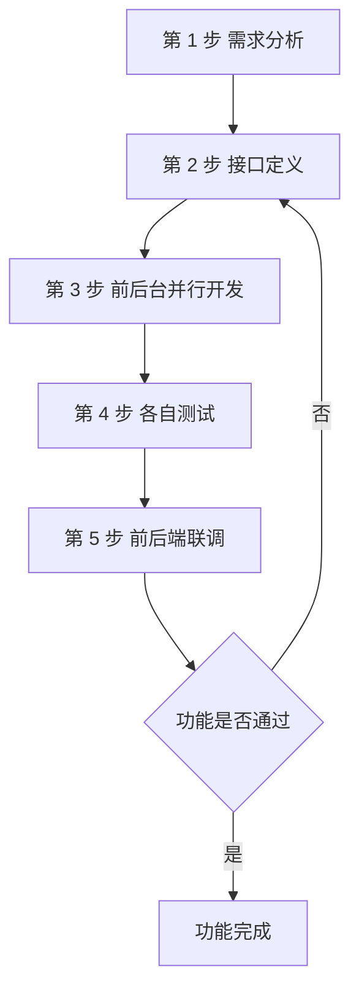
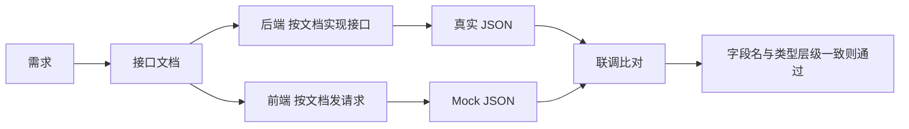
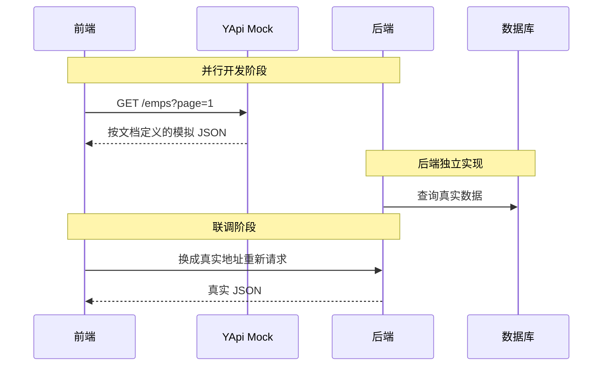

# 11 接口文档与前后端分离开发

前后端分离开发里，前端和后端是两组人并行开工的。两边不用互相等代码，靠的就是同一份约定：接口长什么样、要传什么、返回什么。这份约定就是接口文档。

## 1. 学习目标与前置知识

### 1.1 学习目标

- 说清前后端混合开发的四个问题，以及接口文档为什么能解决它们。
- 记住前后端分离开发的五步流程。
- 知道一份接口文档至少要写清楚哪几项。
- 会用 YApi 管理接口，并用它的 Mock 服务让前端提前开工。
- 能照着接口文档写出后端接口和前端请求。

### 1.2 前置知识

需要先掌握 HTTP 请求与响应（第 04 章）、统一响应结果 `Result`（第 07 章）和增删改查接口的写法（第 07 到 10 章）。

## 2. 前后端混合开发的问题

早期的做法是把 HTML 页面和后端代码写在同一个工程里，后端程序员顺手也要改页面。项目小的时候还行，项目一大就出问题：

| 问题 | 具体表现 |
| --- | --- |
| 沟通成本高 | 后端发现页面有问题，要找前端改；前端改完再交给后端验证，来回一趟才往前走一步 |
| 分工不明确 | 后端既要写业务代码，又要写页面，很难在某一方向做深 |
| 不便管理 | 所有代码在一个工程里，改动互相牵连，代码量一大就难以理清 |
| 不便维护和扩展 | 前端只是改了一个字，后端也得跟着重新打包部署整个工程 |

这四条可以归纳成一句话：页面和接口的边界没有被划出来，所以两边的开发被强行绑在了一起。

## 3. 前后端分离开发与五步流程

前后端分离的做法是：后端只负责提供接口（返回 JSON 数据），前端只负责页面和请求。两边通过接口文档对接，各自独立开发、独立部署。



| 步骤 | 谁做 | 做什么 |
| --- | --- | --- |
| 1 需求分析 | 产品 + 前后端 | 阅读需求文档，把需求理解一致 |
| 2 接口定义 | 后端为主 | 在接口文档里写清地址、参数、响应数据类型 |
| 3 并行开发 | 前端、后端各自 | 前端对着 Mock 数据写页面，后端对着文档写实现 |
| 4 各自测试 | 前端、后端各自 | 都按同一份文档自测，标准一致 |
| 5 前后端联调 | 前端 + 后端 | 前端请求真实后端工程，验证功能是否对上 |

第 3 步是这套流程最值钱的地方：接口一旦定义好，两边就不用互相等了。这也正是第 2 步必须做扎实的原因，文档写错，两边会一起错。

## 4. 接口文档要写什么

一份能用的接口文档，每个接口至少要有下面这些信息。少任何一项，前端就得回来问。

| 项目 | 说明 | 例子 |
| --- | --- | --- |
| 接口名称 | 这个接口干什么用的 | 员工分页查询 |
| 请求路径 | 相对后端的 URL | `/emps` |
| 请求方式 | GET / POST / PUT / DELETE | `GET` |
| 请求参数 | 名称、类型、是否必填、含义 | `page`（int，必填）、`name`（string，可选） |
| 请求格式 | 参数放在哪：查询串、路径、JSON 体 | 查询串 `?page=1&pageSize=10` |
| 响应格式 | 返回的数据结构 | 统一响应 `Result`，`data` 里是分页对象 |
| 响应示例 | 一段真实可对照的 JSON | 见第 6 节 |



判断文档写得好不好，有个简单标准：前端只看文档，就能写出请求代码，且不用问后端任何问题。

## 5. YApi：接口管理与 Mock 服务

YApi 是一个常用的 API 管理平台，面向开发、产品、测试人员提供接口管理服务。它对本项目最有用的是两个功能：

| 功能 | 作用 |
| --- | --- |
| API 接口管理 | 按需求撰写接口，包括地址、参数、响应等信息，形成团队共享的接口清单 |
| Mock 服务 | 模拟真实接口，生成模拟测试数据，供前端在真实接口写完之前先行测试 |

Mock 服务解决的是流程里的时间差问题：第 3 步前后端并行开发时，后端接口还没写完，但前端需要数据才能调试页面。这时前端把请求地址指向 YApi 的 Mock 地址，拿到的就是文档里定义的假数据；后端写完后再把地址换回真实后端。



## 6. 一个例子：员工分页查询接口

把前面的规则落到一个真实接口上，接口文档写成这样：

| 项目 | 内容 |
| --- | --- |
| 接口名称 | 员工分页查询 |
| 请求路径 | `/emps` |
| 请求方式 | `GET` |
| 请求参数 | `page`（int，必填，页码）、`pageSize`（int，必填，每页条数）、`name`（string，可选，姓名模糊匹配）、`gender`（int，可选，1 男 2 女） |
| 响应格式 | 统一响应 `Result`，`data` 为 `{ total, rows }` |

请求示例：

```text
GET /emps?page=1&pageSize=10&name=张
```

响应示例：

```json
{
  "code": 1,
  "message": "success",
  "data": {
    "total": 2,
    "rows": [
      { "id": 1, "name": "张三", "gender": 1, "job": 1 },
      { "id": 2, "name": "张四", "gender": 2, "job": 2 }
    ]
  }
}
```

注意 `page` 和 `pageSize` 从前端传来时是字符串，后端接口上用 `Integer` 接收，Spring 会自动转换；如果前端传了 `page=abc`，转换失败会直接报参数异常，需要在全局异常处理里兜住（见第 10 章）。

## 7. 统一响应格式

前端要处理很多接口，如果每个接口的返回结构都不一样，前端就得为每个接口写一套解析逻辑。所以项目约定用统一的响应对象：

| 字段 | 类型 | 含义 |
| --- | --- | --- |
| `code` | int | 业务状态码，本项目用 `1` 表示成功，`0` 表示失败 |
| `message` | string | 提示信息，成功时通常是 `success`，失败时是给用户看的原因 |
| `data` | 泛型 | 真正的业务数据；没有数据时为 `null` |

```java
public record Result<T>(int code, String message, T data) {
    public static <T> Result<T> success(T data) {
        return new Result<>(1, "success", data);
    }

    public static Result<Void> success() {
        return new Result<>(1, "success", null);
    }

    public static Result<Void> error(String message) {
        return new Result<>(0, message, null);
    }
}
```

写接口文档时，响应格式这一项直接写"统一响应 `Result`"，然后只描述 `data` 里是什么结构，就不用把 `code`、`message` 重复抄到每个接口里。

## 8. 接口设计规范与自动化文档

接口文档手写能起步，但人数一多、接口一多，约定就会漂移。这一节先把接口本身该怎么设计讲清楚，再讲怎么让代码自动生成文档。

### 8.1 RESTful 风格约定

RESTful 的核心想法是：URL 定位资源，HTTP 方法表达动作。资源用名词复数，动作交给方法，两者拼在一起才是一个完整的语义。

| HTTP 方法 | 语义 | 典型路径 | 对应增删改查 | 成功状态码 |
| --- | --- | --- | --- | --- |
| `GET` | 查询 | `/api/v1/emps`、`/api/v1/emps/{id}` | 查（列表、详情） | 200 |
| `POST` | 新增 | `/api/v1/emps` | 增 | 201 |
| `PUT` | 全量修改 | `/api/v1/emps/{id}` | 改 | 200 或 204 |
| `DELETE` | 删除 | `/api/v1/emps/{id}` | 删 | 204 |

路径里不要出现动词，因为动词已经由请求方法承担了：

| 写法 | 评价 | 说明 |
| --- | --- | --- |
| `GET /getUser?id=1` | 不推荐 | 路径里带动词，方法又表达了一次，同一个动作出现两遍 |
| `GET /users/1` | 推荐 | 名词复数加路径变量，方法即语义 |
| `POST /createUser` | 不推荐 | 新增应该写作 `POST /users` |
| `POST /users` | 推荐 | 在集合上发 POST 即新增，响应里带上新资源的标识 |
| `GET /users/1/orders` | 推荐 | 从属资源用嵌套路径表达归属，比 `/getUserOrders` 清晰 |

状态码表达这次请求的结果类别，不要所有情况都返回 200 再靠响应体里的 `code` 兜底：

| 状态码 | 含义 | 什么时候用 |
| --- | --- | --- |
| 200 | 成功 | 查询成功、修改成功 |
| 201 | 已创建 | 新增成功，通常在 `Location` 里返回新资源地址 |
| 204 | 无内容 | 删除或修改成功，但没有内容需要返回 |
| 400 | 请求参数错误 | 参数缺失、类型不对、格式不符 |
| 401 | 未认证 | 没带 Token 或 Token 无效 |
| 403 | 无权限 | 认证通过，但当前用户没有该操作的权限 |
| 404 | 资源不存在 | 路径正确但 `{id}` 对应的数据不存在 |
| 500 | 服务器内部错误 | 未捕获的异常，不应把堆栈信息返回给前端 |

### 8.2 接口命名与参数约定

接口一多，参数名不统一就是联调时最大的时间黑洞。下面几条是整个项目要固定下来的。

| 约定项 | 统一写法 | 反例 |
| --- | --- | --- |
| 分页参数 | `page`（页码，从 1 开始）、`pageSize`（每页条数） | `p`、`size`、`pageNum`、`limit` 混用 |
| 排序参数 | `sortBy`（排序字段）、`order`（`asc` / `desc`） | `sort`、`orderBy`、`isAsc` 混用 |
| 过滤参数 | 直接用业务字段名，可选项不加前缀 | 用 `q`、`keyword1` 这类含义不明的名字 |
| 时间格式 | `yyyy-MM-dd HH:mm:ss` | 时间戳和 `yyyy/MM/dd` 在同一份文档里混用 |
| 日期格式 | `yyyy-MM-dd` | `dd-MM-yyyy` 这类容易看错的写法 |
| 字段命名 | 小驼峰，如 `pageSize`、`createTime` | 下划线 `page_size`、大写开头 `PageSize` |
| 枚举值 | 明确的字符串，如 `status=ACTIVE` | 魔法数字 `status=3` |
| 布尔值 | `is` 开头，取值 `true` / `false` | `flag=1` 这种 0/1 约定 |

分页参数摆在第一位是因为它最常出问题：只要项目里存在两套写法，前端每接一个接口就要重新猜一次名字，文档写 `pageSize`、代码写 `size` 这种事一定会发生。时间统一成同一个格式，是为了让 `String` 与 `LocalDateTime` 的转换规则只留一条，否则同一个字段在不同接口里的表现会不一样。

枚举值用字符串而不是数字，是因为数字必须回头翻文档才知道含义，日志和联调现场都会失去可读性：

```java
public enum EmpStatus {
    ACTIVE, LEAVE, RESIGNED
}
```

```json
{
  "id": 1,
  "name": "张三",
  "status": "ACTIVE",
  "createTime": "2024-05-01 09:30:00"
}
```

比起 `"status": 3`，上面这段 JSON 不看文档也能读懂。

### 8.3 接口版本与兼容性

接口一旦被前端、App 或第三方用起来，就不能随便改。让新旧版本同时存在，是唯一现实的做法。

| 方式 | 写法 | 优点 | 缺点 |
| --- | --- | --- | --- |
| URL 版本 | `/api/v1/emps` | 直观、好调试、可缓存，看日志就知道用的是哪一版 | URL 变长，同一资源出现多个地址 |
| 请求头版本 | `Accept: application/vnd.example.v1+json`，或自定义 `X-Api-Version: 1` | URL 干净，同一个地址按内容协商返回不同版本 | 调试不直观，浏览器直接打开看不出效果 |

学习项目和小团队优先用 URL 版本，成本最低。下面这些改动属于破坏性变更，必须升版本号；只新增可选字段或新增接口，则可以在原版本内继续。

| 改动 | 是否破坏性 | 原因 |
| --- | --- | --- |
| 删除响应字段 | 是 | 依赖该字段的前端会直接拿到 `undefined` |
| 修改字段类型 | 是 | 数字变字符串会让 `===` 比较和数值运算失效 |
| 修改字段语义 | 是 | 名字没变含义变了，比改类型更难发现 |
| 把可选参数改为必填 | 是 | 原来不传也能成功的调用会开始报 400 |
| 修改状态码约定 | 是 | 前端按原状态码写的分支会走错 |
| 新增可选请求参数 | 否 | 老调用不传也能按原逻辑工作 |
| 新增响应字段 | 否 | 老调用忽略多余字段即可 |
| 新增接口 | 否 | 不影响已有调用 |

### 8.4 OpenAPI 与 Swagger：让代码生成文档

手写文档最大的问题是它会过期：代码改了，文档没改。OpenAPI 是一套描述 HTTP 接口的规范，Swagger 是围绕这套规范的工具集；在 Spring Boot 项目里用 `springdoc-openapi`，让注解和代码一起生成文档，页面就再也和实现对不上了。

先在 `pom.xml` 里加依赖（Spring Boot 3 用 2.x 版本）：

```xml
<dependency>
    <groupId>org.springdoc</groupId>
    <artifactId>springdoc-openapi-starter-webmvc-ui</artifactId>
    <version>2.3.0</version>
</dependency>
```

再到 `application.yml` 里做最小配置：

```yaml
springdoc:
  api-docs:
    path: /v3/api-docs
  swagger-ui:
    path: /swagger-ui.html
```

启动后访问 `http://localhost:8080/swagger-ui.html`，如果该路径被改写，就用 `http://localhost:8080/swagger-ui/index.html`，页面上会按分组列出所有接口，并可以直接发请求调试。

接着用注解把接口描述补全：

```java
@Tag(name = "员工管理")
@RestController
@RequestMapping("/api/v1/emps")
public class EmpController {

    @Operation(summary = "员工分页查询")
    @GetMapping
    public Result<PageResult> page(
            @Parameter(description = "页码，从 1 开始") @RequestParam Integer page,
            @Parameter(description = "每页条数") @RequestParam Integer pageSize) {
        return Result.success(empService.page(page, pageSize));
    }

    @Operation(summary = "根据 ID 查询员工")
    @GetMapping("/{id}")
    public Result<Emp> getById(@Parameter(description = "员工 ID") @PathVariable Long id) {
        return Result.success(empService.getById(id));
    }
}
```

四个注解的分工要分清：

| 注解 | 位置 | 作用 |
| --- | --- | --- |
| `@Tag` | 类 | 给一组接口起名字，页面上按它分组 |
| `@Operation` | 方法 | 描述单个接口，`summary` 是短标题 |
| `@Parameter` | 参数 | 描述参数含义，可标注是否必填 |
| `@Schema` | 实体类或其字段 | 描述模型字段的含义、类型和示例值 |

实体类上用 `@Schema`：

```java
@Schema(description = "员工信息")
public class Emp {
    @Schema(description = "员工 ID", example = "1")
    private Long id;

    @Schema(description = "姓名", example = "张三")
    private String name;

    @Schema(description = "状态", example = "ACTIVE")
    private String status;
}
```

Swagger 在 2020 年前后换过一次注解体系：老项目里常见的 `springfox` 用的是 `@Api`、`@ApiOperation`、`@ApiModelProperty`，而 `springdoc-openapi` 用的是 Swagger 3 的 `@Tag`、`@Operation`、`@Schema`。Spring Boot 3 之后 `springfox` 基本处于停更状态，新项目直接用 `springdoc-openapi`；网上搜注解用法时，要留意自己看的是哪一套。

### 8.5 Knife4j：Swagger 的增强界面

`springdoc-openapi` 自带的 `swagger-ui` 界面能用，但中文项目里更常见的是 Knife4j。Knife4j 的定位是 Swagger 的增强 UI，底层文档数据仍然来自 OpenAPI，它替换的是展示层。

| 能力 | 作用 |
| --- | --- |
| 文档增强 | 接口分组、搜索、字段级说明比原生界面更清爽 |
| 调试增强 | 全局参数、请求头、鉴权 Token 配一次，所有接口复用 |
| 离线文档 | 可导出 Markdown、HTML、Word 等格式，便于交付 |
| 排序与折叠 | 接口多时可按标签分组折叠、按需排序 |

接入要点是加依赖，注解继续沿用 Swagger 3 那一套：

```xml
<dependency>
    <groupId>com.github.xiaoymin</groupId>
    <artifactId>knife4j-openapi3-jakarta-spring-boot-starter</artifactId>
    <version>4.4.0</version>
</dependency>
```

```yaml
knife4j:
  enable: true
  setting:
    language: zh_cn
```

配置完成后访问 `http://localhost:8080/doc.html` 就是 Knife4j 的界面。它和 `springdoc` 不冲突，注解、`/v3/api-docs` 都是共用的，只是换了一个更好用的页面。

### 8.6 与 YApi 的对比

YApi 解决的是"接口还没写代码时，文档和 Mock 从哪来"；代码生成文档解决的是"接口写完代码后，文档怎么不落伍"。两者不是替代关系，用在不同阶段最省力。

| 对比项 | YApi | 代码生成文档（OpenAPI / Knife4j） |
| --- | --- | --- |
| 文档来源 | 人在平台上手工撰写 | 从 Controller、注解和实体类生成 |
| 是否自动同步 | 否，代码改了要回平台改 | 是，代码即文档 |
| Mock 能力 | 强，内置 Mock 服务，前端可以先拿假数据 | 弱，原生界面主要用于真实请求调试 |
| 接口定义时机 | 编码之前，先定契约 | 编码同时或之后，先有代码 |
| 适合阶段 | 需求分析与接口定义、前后端并行开发 | 接口已实现，需要持续维护和对外交付 |
| 变更成本 | 双份维护，容易与代码脱节 | 只改代码，文档自动跟上 |

落到第 3 节的五步流程上：第 2 步接口定义用 YApi 最顺手，因为那时还没有代码；第 3 步之后代码长出来了，再让 `springdoc` 生成真实文档，联调时以代码生成的文档为准。两者并存，就是各自干各自最擅长的活。

### 8.7 一份最小可用的接口文档模板

不管写在 YApi 里还是由注解生成，一个接口最少要有下面这些内容：

| 项目 | 员工分页查询 |
| --- | --- |
| 接口名称 | 员工分页查询 |
| 请求方式与路径 | `GET /api/v1/emps` |
| 请求参数 | `page`（int，必填，页码，从 1 开始）、`pageSize`（int，必填，每页条数）、`name`（string，可选，姓名模糊匹配）、`status`（string，可选，取值 `ACTIVE` / `LEAVE` / `RESIGNED`）、`sortBy`（string，可选，排序字段）、`order`（string，可选，`asc` / `desc`） |
| 请求示例 | `GET /api/v1/emps?page=1&pageSize=10&status=ACTIVE&sortBy=id&order=desc` |
| 响应字段 | `code`（int，1 成功 0 失败）、`message`（string，提示信息）、`data.total`（long，总记录数）、`data.rows`（array，当前页数据）、`data.rows[].id`（long）、`data.rows[].name`（string）、`data.rows[].status`（string）、`data.rows[].createTime`（string，格式 `yyyy-MM-dd HH:mm:ss`） |
| 错误码 | 400 参数缺失或类型错误、401 未登录、403 无权限、404 资源不存在、500 服务器内部错误 |
| 响应示例 | 见下方 JSON |

```json
{
  "code": 1,
  "message": "success",
  "data": {
    "total": 2,
    "rows": [
      {
        "id": 1,
        "name": "张三",
        "status": "ACTIVE",
        "createTime": "2024-05-01 09:30:00"
      }
    ]
  }
}
```

同一份内容写成 OpenAPI 片段，字段含义、类型和示例值就能被工具直接读取：

```yaml
paths:
  /api/v1/emps:
    get:
      tags: [员工管理]
      summary: 员工分页查询
      parameters:
        - name: page
          in: query
          required: true
          schema: { type: integer, example: 1 }
        - name: pageSize
          in: query
          required: true
          schema: { type: integer, example: 10 }
        - name: status
          in: query
          required: false
          schema: { type: string, enum: [ACTIVE, LEAVE, RESIGNED] }
      responses:
        "200":
          description: 查询成功
        "400":
          description: 请求参数错误
        "401":
          description: 未认证
        "500":
          description: 服务器内部错误
```

## 9. 小白易错点

- 请求方式写错：查询用 `GET`，新增用 `POST`，修改用 `PUT`，删除用 `DELETE`。用错会让前端对不上。
- 路径少写或多写斜杠：`/emps` 和 `/emps/` 在部分配置下不是同一个地址，要在文档里定死一个。
- 参数名前后端不一致：文档写 `pageSize`，前端传 `page_size`，接口就收不到值。文档是唯一标准。
- 字段类型不一致：文档写 `id` 是数字，前端收到字符串，`===` 比较就会失效。
- 只写成功不写失败：失败时的 `code`、`message` 约定也要写，否则前端无法提示用户。
- 文档改了不同步：接口一改就要立刻更新文档，否则联调时两边按不同版本对，问题很难查。
- 把 Mock 地址带上线：联调完成后要记得把前端请求地址换回真实后端。

## 10. 练习清单

1. 为部门管理的增删改查四个接口各写一份接口文档条目。
2. 为文件上传接口补充请求格式，说明为什么用 `multipart/form-data` 而不是 JSON。
3. 在 YApi 里建一个接口，配置 Mock 的响应示例，然后用浏览器直接访问 Mock 地址验证。
4. 故意把文档里的字段名改一个字母，观察前后端联调时出现什么现象。
5. 给统一响应 `Result` 补一个 `error` 方法，并写出它对应的响应示例。

## 11. 资料对应关系

- 《JavaWeb笔记》第六章"前后台分离开发"：混合开发的问题、五步流程、YApi 的两个功能。
- 第 04 章：HTTP 请求与响应的基础，是理解文档里"请求方式、参数、响应"的前提。
- 第 07 章：统一响应对象 `Result` 的来源。
- 第 16 到 18 章：前端实战里会看到这份文档是怎么被真正用起来的。
- YApi 官网：<http://yapi.smart-xwork.cn/>

## 12. 本章总结

1. 前后端混合开发的问题（沟通成本高、分工不明确、不便管理、不便维护和扩展）根源是页面和接口的边界没有划出来；前后端分离用一份接口文档把边界定死，两边才能各自独立开发、独立部署。
2. 分离开发的五步流程顺序固定：需求分析、接口定义、前后台并行开发、各自测试、前后端联调。接口定义是整套流程的枢纽，文档写错，两边会一起错。
3. 第 3 步是全流程最值钱的地方：接口一旦定义好，前端就能对着 Mock 数据写页面，后端对着文档写实现，谁也不用等谁。YApi 的 Mock 服务就是为这个时间差准备的，联调完成后必须把请求地址换回真实后端。
4. 一份能用的接口文档，每个接口至少要有接口名称、请求路径、请求方式、请求参数（名称、类型、是否必填、含义）、请求格式、响应格式和响应示例；标准是前端只看文档就能写出请求代码，且不用问后端任何问题。
5. 统一响应 `Result`（`code`、`message`、`data`）的价值在于让前端只写一套解析逻辑；写文档时直接写"统一响应 `Result`"，只描述 `data` 里的结构，不必把 `code`、`message` 抄进每个接口。
6. RESTful 风格的三条主线：资源用名词复数（`/users` 而不是 `/getUser`）、动作交给 HTTP 方法（`GET` 查、`POST` 增、`PUT` 改、`DELETE` 删）、结果用状态码表达（200 成功、201 已创建、204 无内容、400 参数错误、401 未认证、403 无权限、404 资源不存在、500 服务器内部错误）。
7. 参数命名要全项目统一：分页固定用 `page` 与 `pageSize`，排序用 `sortBy` 与 `order`，时间格式固定为 `yyyy-MM-dd HH:mm:ss`，字段统一小驼峰，枚举值用 `ACTIVE` 这类明确字符串而不是 `3` 这样的魔法数字。
8. 接口版本常用 URL 版本（`/api/v1/emps`）和请求头版本两种写法，小团队优先 URL 版本；删字段、改类型、改语义、把可选参数改成必填、改状态码约定都属于破坏性变更，必须升版本，而新增可选字段或新增接口可以留在原版本内。
9. 手写文档会过期，用 `springdoc-openapi` 让代码生成文档：类上用 `@Tag`，方法上用 `@Operation`，参数上用 `@Parameter`，实体字段上用 `@Schema`，访问 `/swagger-ui.html` 或 `/swagger-ui/index.html` 就能查看并调试；Spring Boot 3 用 `springdoc`，不要再用已经停更的 `springfox`。
10. Knife4j 的定位是 Swagger 的增强 UI，底层文档仍然来自 OpenAPI，优势在于分组搜索、全局鉴权参数和离线文档导出，加依赖并开启后访问 `/doc.html`，注解与 `springdoc` 共用。
11. YApi 与代码生成文档各有各的阶段：YApi 在编码前手写契约并自带 Mock，适合需求分析和接口定义阶段；`springdoc`、Knife4j 从代码生成、自动同步，适合接口已实现后的持续维护，两者并存最省力。
12. 文档是前后端唯一的标准：参数名、字段类型、请求方式、失败时的 `code` 与 `message` 都要写清楚，接口一改就立刻更新文档，否则联调时两边会按不同版本对，问题很难查。
