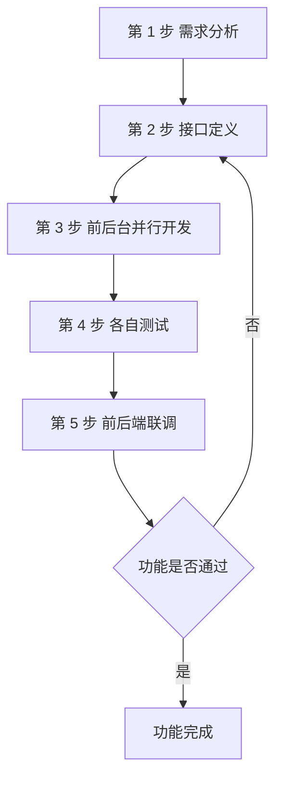
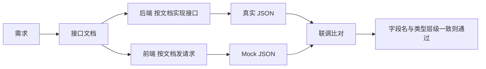
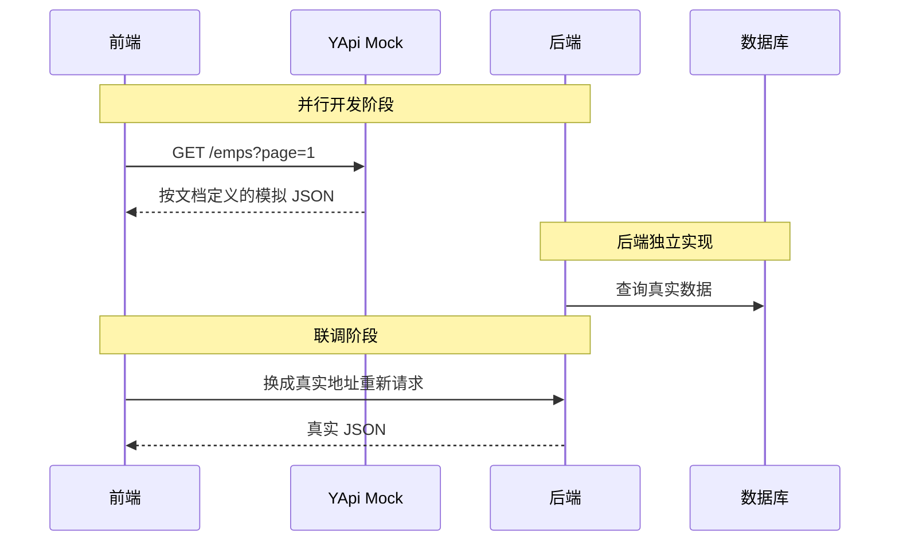

# 11 接口文档与前后端分离开发

前后端分离开发里，前端和后端是两组人并行开工的。两边不用互相等代码，靠的就是同一份约定：接口长什么样、要传什么、返回什么。这份约定就是接口文档。

## 1. 学习目标与前置知识

### 1.1 学习目标

- 说清前后端混合开发的四个问题，以及接口文档为什么能解决它们。
- 记住前后端分离开发的五步流程。
- 知道一份接口文档至少要写清楚哪几项。
- 会用 YApi 管理接口，并用它的 Mock 服务让前端提前开工。
- 能照着接口文档写出后端接口和前端请求。

### 1.2 前置知识

需要先掌握 HTTP 请求与响应（第 04 章）、统一响应结果 `Result`（第 07 章）和增删改查接口的写法（第 07 到 10 章）。

## 2. 前后端混合开发的问题

早期的做法是把 HTML 页面和后端代码写在同一个工程里，后端程序员顺手也要改页面。项目小的时候还行，项目一大就出问题：

| 问题 | 具体表现 |
| --- | --- |
| 沟通成本高 | 后端发现页面有问题，要找前端改；前端改完再交给后端验证，来回一趟才往前走一步 |
| 分工不明确 | 后端既要写业务代码，又要写页面，很难在某一方向做深 |
| 不便管理 | 所有代码在一个工程里，改动互相牵连，代码量一大就难以理清 |
| 不便维护和扩展 | 前端只是改了一个字，后端也得跟着重新打包部署整个工程 |

这四条可以归纳成一句话：页面和接口的边界没有被划出来，所以两边的开发被强行绑在了一起。

## 3. 前后端分离开发与五步流程

前后端分离的做法是：后端只负责提供接口（返回 JSON 数据），前端只负责页面和请求。两边通过接口文档对接，各自独立开发、独立部署。



| 步骤 | 谁做 | 做什么 |
| --- | --- | --- |
| 1 需求分析 | 产品 + 前后端 | 阅读需求文档，把需求理解一致 |
| 2 接口定义 | 后端为主 | 在接口文档里写清地址、参数、响应数据类型 |
| 3 并行开发 | 前端、后端各自 | 前端对着 Mock 数据写页面，后端对着文档写实现 |
| 4 各自测试 | 前端、后端各自 | 都按同一份文档自测，标准一致 |
| 5 前后端联调 | 前端 + 后端 | 前端请求真实后端工程，验证功能是否对上 |

第 3 步是这套流程最值钱的地方：接口一旦定义好，两边就不用互相等了。这也正是第 2 步必须做扎实的原因，文档写错，两边会一起错。

## 4. 接口文档要写什么

一份能用的接口文档，每个接口至少要有下面这些信息。少任何一项，前端就得回来问。

| 项目 | 说明 | 例子 |
| --- | --- | --- |
| 接口名称 | 这个接口干什么用的 | 员工分页查询 |
| 请求路径 | 相对后端的 URL | `/emps` |
| 请求方式 | GET / POST / PUT / DELETE | `GET` |
| 请求参数 | 名称、类型、是否必填、含义 | `page`（int，必填）、`name`（string，可选） |
| 请求格式 | 参数放在哪：查询串、路径、JSON 体 | 查询串 `?page=1&pageSize=10` |
| 响应格式 | 返回的数据结构 | 统一响应 `Result`，`data` 里是分页对象 |
| 响应示例 | 一段真实可对照的 JSON | 见第 6 节 |



判断文档写得好不好，有个简单标准：前端只看文档，就能写出请求代码，且不用问后端任何问题。

## 5. YApi：接口管理与 Mock 服务

YApi 是一个常用的 API 管理平台，面向开发、产品、测试人员提供接口管理服务。它对本项目最有用的是两个功能：

| 功能 | 作用 |
| --- | --- |
| API 接口管理 | 按需求撰写接口，包括地址、参数、响应等信息，形成团队共享的接口清单 |
| Mock 服务 | 模拟真实接口，生成模拟测试数据，供前端在真实接口写完之前先行测试 |

Mock 服务解决的是流程里的时间差问题：第 3 步前后端并行开发时，后端接口还没写完，但前端需要数据才能调试页面。这时前端把请求地址指向 YApi 的 Mock 地址，拿到的就是文档里定义的假数据；后端写完后再把地址换回真实后端。



## 6. 一个例子：员工分页查询接口

把前面的规则落到一个真实接口上，接口文档写成这样：

| 项目 | 内容 |
| --- | --- |
| 接口名称 | 员工分页查询 |
| 请求路径 | `/emps` |
| 请求方式 | `GET` |
| 请求参数 | `page`（int，必填，页码）、`pageSize`（int，必填，每页条数）、`name`（string，可选，姓名模糊匹配）、`gender`（int，可选，1 男 2 女） |
| 响应格式 | 统一响应 `Result`，`data` 为 `{ total, rows }` |

请求示例：

```text
GET /emps?page=1&pageSize=10&name=张
```

响应示例：

```json
{
  "code": 1,
  "message": "success",
  "data": {
    "total": 2,
    "rows": [
      { "id": 1, "name": "张三", "gender": 1, "job": 1 },
      { "id": 2, "name": "张四", "gender": 2, "job": 2 }
    ]
  }
}
```

注意 `page` 和 `pageSize` 从前端传来时是字符串，后端接口上用 `Integer` 接收，Spring 会自动转换；如果前端传了 `page=abc`，转换失败会直接报参数异常，需要在全局异常处理里兜住（见第 10 章）。

## 7. 统一响应格式

前端要处理很多接口，如果每个接口的返回结构都不一样，前端就得为每个接口写一套解析逻辑。所以项目约定用统一的响应对象：

| 字段 | 类型 | 含义 |
| --- | --- | --- |
| `code` | int | 业务状态码，本项目用 `1` 表示成功，`0` 表示失败 |
| `message` | string | 提示信息，成功时通常是 `success`，失败时是给用户看的原因 |
| `data` | 泛型 | 真正的业务数据；没有数据时为 `null` |

```java
public record Result<T>(int code, String message, T data) {
    public static <T> Result<T> success(T data) {
        return new Result<>(1, "success", data);
    }

    public static Result<Void> success() {
        return new Result<>(1, "success", null);
    }

    public static Result<Void> error(String message) {
        return new Result<>(0, message, null);
    }
}
```

写接口文档时，响应格式这一项直接写"统一响应 `Result`"，然后只描述 `data` 里是什么结构，就不用把 `code`、`message` 重复抄到每个接口里。

## 8. 小白易错点

- 请求方式写错：查询用 `GET`，新增用 `POST`，修改用 `PUT`，删除用 `DELETE`。用错会让前端对不上。
- 路径少写或多写斜杠：`/emps` 和 `/emps/` 在部分配置下不是同一个地址，要在文档里定死一个。
- 参数名前后端不一致：文档写 `pageSize`，前端传 `page_size`，接口就收不到值。文档是唯一标准。
- 字段类型不一致：文档写 `id` 是数字，前端收到字符串，`===` 比较就会失效。
- 只写成功不写失败：失败时的 `code`、`message` 约定也要写，否则前端无法提示用户。
- 文档改了不同步：接口一改就要立刻更新文档，否则联调时两边按不同版本对，问题很难查。
- 把 Mock 地址带上线：联调完成后要记得把前端请求地址换回真实后端。

## 9. 练习清单

1. 为部门管理的增删改查四个接口各写一份接口文档条目。
2. 为文件上传接口补充请求格式，说明为什么用 `multipart/form-data` 而不是 JSON。
3. 在 YApi 里建一个接口，配置 Mock 的响应示例，然后用浏览器直接访问 Mock 地址验证。
4. 故意把文档里的字段名改一个字母，观察前后端联调时出现什么现象。
5. 给统一响应 `Result` 补一个 `error` 方法，并写出它对应的响应示例。

## 10. 资料对应关系

- 《JavaWeb笔记》第六章"前后台分离开发"：混合开发的问题、五步流程、YApi 的两个功能。
- 第 04 章：HTTP 请求与响应的基础，是理解文档里"请求方式、参数、响应"的前提。
- 第 07 章：统一响应对象 `Result` 的来源。
- 第 16 到 18 章：前端实战里会看到这份文档是怎么被真正用起来的。
- YApi 官网：<http://yapi.smart-xwork.cn/>
