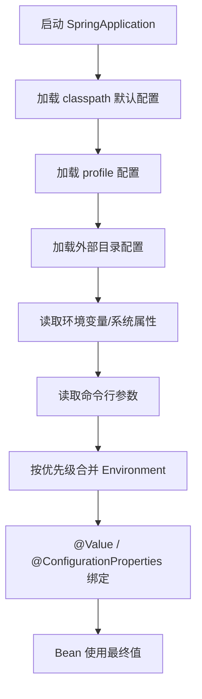

# 14B 后端 Web 进阶：Spring Boot 原理

本章不要求一开始就读完 Spring 源码，而是先建立一张“Spring Boot 为什么能少写配置”的地图：配置如何生效、Bean 如何进入容器、起步依赖和自动配置如何协作。

## 1. 学习目标与前置知识

- 理解配置文件的覆盖关系。
- 会获取和声明 Bean，理解 Bean 作用域。
- 能解释起步依赖和自动配置。
- 能看懂组件扫描、条件装配和自动配置类。
- 能理解自定义 Starter 的基本结构。

前置内容是已有 04 文档、《JavaWeb笔记》第十章和第十六章，以及 Spring IoC/DI、Bean 注解和 Maven 依赖基础。

## 2. 配置文件优先级

Spring Boot 支持 `application.properties`、`application.yml` 和 `application.yaml`。项目中不要在多个文件重复配置同一属性，否则排查覆盖关系会很困难。

```yaml
server:
  port: 8080

spring:
  datasource:
    url: jdbc:mysql://localhost:3306/tlias
```

实际项目还会受到命令行参数、环境变量、外部配置文件和 Profile 的影响。重要原则是：距离运行环境越近的配置，通常优先级越高。学习时要用 Spring Boot 当前版本的官方规则验证具体优先级，不要只记一张旧表。

## 3. Bean 管理

### 3.1 获取 Bean

Spring 启动时创建 IoC 容器。除了自动注入，也可以通过 `ApplicationContext` 获取：

```java
ApplicationContext context = SpringApplication.run(App.class, args);
UserService service = context.getBean(UserService.class);
```

业务代码优先使用依赖注入，不要到处手动获取 Bean，否则会增加隐藏依赖和测试难度。

### 3.2 Bean 作用域

默认作用域是 singleton：一个容器中只有一个实例。常见作用域还有 prototype，Web 环境还可使用 request、session 等作用域。

```java
@Scope("prototype")
@Component
public class TemporaryObject { }
```

Controller、Service 和 Mapper 通常设计为无状态单例，不要把用户请求数据放在成员变量中。

### 3.3 第三方 Bean

第三方类不能直接加 `@Component`，可以在配置类中用 `@Bean`：

```java
@Configuration
public class OssConfig {
    @Bean
    public OssClient ossClient(OssProperties properties) {
        return new OssClient(properties.getEndpoint(), properties.getAccessKey());
    }
}
```

## 4. 起步依赖

传统 Spring 项目需要手动选择许多相互匹配的依赖。Spring Boot 用 Starter 把一个场景的常用依赖组合起来，例如 Web、Validation、MyBatis 等。

```xml
<dependency>
    <groupId>org.springframework.boot</groupId>
    <artifactId>spring-boot-starter-web</artifactId>
</dependency>
```

Starter 主要解决“依赖配置繁琐”和“版本不兼容”问题，但它不是魔法：最终仍然是普通 Jar 依赖，通过 Maven 传递进项目。

## 5. 自动配置

自动配置的目标是：根据类路径中的依赖、配置属性和条件，自动向 IoC 容器注册合适的 Bean。

可以把它理解为：

```text
引入依赖
  ↓
Spring Boot 发现相关类和配置
  ↓
加载自动配置类
  ↓
满足条件时创建 Bean
  ↓
业务代码直接注入使用
```

### 5.1 组件扫描

启动类上的 `@SpringBootApplication` 组合了配置、自动配置和组件扫描能力。默认扫描启动类所在包及其子包，因此启动类通常放在项目根包。

如果自定义模块不在扫描范围内，可能出现 Bean 找不到的问题，可以调整包结构或使用显式导入配置。

### 5.2 条件装配

自动配置常用条件注解判断是否创建 Bean，例如：

- 类路径中存在某个类。
- 容器中还没有同类型 Bean。
- 配置文件打开了某个开关。
- 当前环境满足指定 Profile。

这就是为什么“引入依赖后功能自动出现”，同时又允许业务代码覆盖默认 Bean。

## 6. 自定义 Starter

当公司内部有一套重复配置的组件，例如 OSS 工具、统一日志或业务 SDK，可以封装为自定义 Starter。

### 6.1 基本结构

```text
aliyun-oss-spring-boot-starter
├── OssProperties.java       配置属性
├── OssAutoConfiguration.java 自动配置类
└── resources/               自动配置声明
```

配置属性示例：

```java
@ConfigurationProperties(prefix = "aliyun.oss")
public class OssProperties {
    private String endpoint;
    private String bucketName;
}
```

自动配置类示例：

```java
@AutoConfiguration
@EnableConfigurationProperties(OssProperties.class)
public class OssAutoConfiguration {
    @Bean
    @ConditionalOnMissingBean
    public OssClient ossClient(OssProperties properties) {
        return new OssClient(properties);
    }
}
```

不同 Spring Boot 大版本的自动配置声明文件位置可能不同，实施时必须按照项目实际版本和官方文档配置，不能机械照搬旧版路径。

## 7. 原理排查方法

遇到“Bean 没有注入”时，按以下顺序排查：

1. 类是否被组件扫描或自动配置导入。
2. 配置文件前缀和属性名称是否正确。
3. 条件注解是否满足。
4. 是否存在同类型 Bean 冲突。
5. 是否被 `@Profile`、`@ConditionalOnMissingBean` 等条件排除。
6. 启动日志中是否有自动配置报告或异常原因。

## 8. 小白易错点

- Starter 是依赖组合，不等于业务代码已经完成。
- 自动配置创建的 Bean 也可以被业务 Bean 覆盖，但要理解条件规则。
- 启动类包位置错误会导致组件扫描不到。
- 单例 Bean 中不要保存请求级数据。
- 自定义 Starter 必须考虑配置缺失、默认值和条件装配。

## 9. 练习清单

1. 创建一个第三方工具 Bean 并注入 Service。
2. 修改配置文件，观察属性覆盖结果。
3. 用日志定位一个 Bean 为什么没有创建。
4. 编写一个带 `@ConfigurationProperties` 的配置类。
5. 尝试把 OSS 工具封装为简单 Starter。

## 10. 资料对应关系

- 《JavaWeb笔记》：第十六章 Spring Boot 原理。
- 《JavaWeb笔记》：第十四章“配置文件、OSS、登录认证”提供配置化案例。
- 本章与 14A 的关系：Spring Boot 原理解释运行时装配，Maven 高级解释项目和依赖的组织方式。

## 11. 关键补充：配置文件不是唯一配置来源

Spring Boot 会合并多个 `PropertySource`。在常见运行场景中，外部配置、环境变量、系统属性和命令行参数可以覆盖 JAR 包内的默认配置；同一位置同时存在 `.properties` 与 YAML 时，应尽量只保留一种格式，避免误判优先级。



生产环境更推荐通过环境变量或密钥管理系统注入密码和 Token 密钥；不要把数据库密码、OSS AccessKey 等提交到仓库。

### 11.1 `@Value` 与 `@ConfigurationProperties`

```java
@ConfigurationProperties(prefix = "aliyun.oss")
public class OssProperties {
    private String endpoint;
    private String bucketName;
    // getter/setter
}
```

`@Value` 适合少量简单值；`@ConfigurationProperties` 适合一组有层次的配置，支持类型转换、校验和集中管理。配置属性类要被扫描或通过 `@EnableConfigurationProperties` 注册。

### 11.2 自动配置的真实加载链路

```mermaid
flowchart LR
    A[@SpringBootApplication] --> B[@EnableAutoConfiguration]
    B --> C[ImportSelector]
    C --> D[读取 AutoConfiguration.imports]
    D --> E[候选自动配置类]
    E --> F{@Conditional 条件满足?}
    F -- 否 --> G[跳过]
    F -- 是 --> H[执行 @Bean 方法]
    H --> I[注册到 IOC 容器]
```

Spring Boot 3.x 的自动配置候选通常来自 `META-INF/spring/org.springframework.boot.autoconfigure.AutoConfiguration.imports`；较老版本资料中常见 `META-INF/spring.factories`。阅读旧讲义时要先确认 Spring Boot 版本，不能机械地把两个文件混为一谈。

除了自动配置文件，`@Import` 也是理解“第三方 Bean 如何进入容器”的关键：

```java
@Configuration
@Import({TokenParser.class, HeaderConfig.class, MyImportSelector.class})
public class ThirdPartyConfig { }
```

`@Import` 可以导入普通类、配置类或 `ImportSelector` 实现；`@EnableXxx` 注解通常只是把这些导入动作封装起来，便于业务项目一行启用。

### 11.3 自定义 Starter 的最小结构

```text
my-oss-spring-boot-starter       # 只负责依赖聚合
└── pom.xml
my-oss-spring-boot-autoconfigure # 自动配置代码
├── OssProperties.java
├── OssAutoConfiguration.java
└── src/main/resources/META-INF/spring/
    └── org.springframework.boot.autoconfigure.AutoConfiguration.imports
```

```java
@AutoConfiguration
@EnableConfigurationProperties(OssProperties.class)
@ConditionalOnClass(AliyunOSSOperator.class)
public class OssAutoConfiguration {
    @Bean
    @ConditionalOnMissingBean
    public AliyunOSSOperator aliyunOSSOperator(OssProperties p) {
        return new AliyunOSSOperator(p);
    }
}
```

`@ConditionalOnMissingBean` 允许业务项目用自己的 Bean 覆盖默认实现；自动配置应提供合理默认值，但不应强行覆盖用户显式配置。

### 11.4 自动配置排查方法

启动时加 `--debug` 可以查看条件评估报告；也可以检查依赖树、确认 `AutoConfiguration.imports` 是否打包进 JAR、检查配置前缀和当前 profile。遇到“Bean 找不到”时按“依赖是否存在 → 配置类是否被发现 → 条件是否满足 → Bean 是否被覆盖”的顺序排查。

## 12. 本章总结

1. Spring Boot 支持 `application.properties`、`application.yml` 和 `application.yaml`，同一属性不要在多个文件重复配置；配置合并遵循“距离运行环境越近优先级越高”，外部配置、环境变量、系统属性和命令行参数可以覆盖 JAR 包内的默认配置，具体顺序应以当前版本文档为准。
2. Spring 启动时创建 IoC 容器，业务代码优先使用依赖注入而不是到处手动 `getBean`；第三方类不能直接加 `@Component`，要在配置类中用 `@Bean` 注册。
3. Bean 默认作用域是 singleton，还有 prototype 以及 Web 环境的 request、session 等；Controller、Service、Mapper 应设计成无状态单例，不要把请求级数据放进成员变量。
4. Starter 把一个场景常用的依赖组合起来，解决依赖配置繁琐和版本不兼容问题，但它最终仍是普通 Maven 依赖传递，不等于业务代码已经完成。
5. 自动配置根据类路径中的依赖、配置属性和条件注解自动注册 Bean；`@SpringBootApplication` 组合了配置、自动配置和组件扫描，默认扫描启动类所在包及其子包，所以启动类要放在根包。
6. 条件装配是“引入依赖后功能自动出现、同时又允许业务覆盖默认 Bean”的原因，常见条件包括类路径存在某个类、容器中还没有同类型 Bean、配置开关打开和 Profile 匹配。
7. 自动配置的加载链路是：`@SpringBootApplication` 引入 `@EnableAutoConfiguration`，由 `ImportSelector` 读取候选配置文件，条件满足的自动配置类执行 `@Bean` 方法注册到 IoC 容器；Spring Boot 3.x 用 `AutoConfiguration.imports`，较老版本用 `spring.factories`，阅读旧讲义前要先确认版本。
8. `@Import` 可以导入普通类、配置类或 `ImportSelector` 实现，`@EnableXxx` 通常只是把这些导入动作封装起来，便于业务项目一行启用。
9. 自定义 Starter 的最小结构通常是 starter 模块只做依赖聚合，autoconfigure 模块放 `@ConfigurationProperties` 属性类和 `@AutoConfiguration` 自动配置类，用 `@ConditionalOnMissingBean` 允许业务项目覆盖默认实现。
10. “Bean 找不到”的排查顺序是：依赖是否存在、配置类是否被发现、配置前缀与属性名是否正确、条件注解是否满足、是否与同类型 Bean 冲突或被条件排除；启动时加 `--debug` 可以查看条件评估报告。`@Value` 适合少量简单值，`@ConfigurationProperties` 适合一组有层次的配置。

## 13. 联网核对与延伸阅读

- [Spring Boot 外部化配置与属性优先级](https://docs.spring.io/spring-boot/reference/features/external-config.html)
- [Spring Boot 配置属性](https://docs.spring.io/spring-boot/how-to/properties-and-configuration.html)
