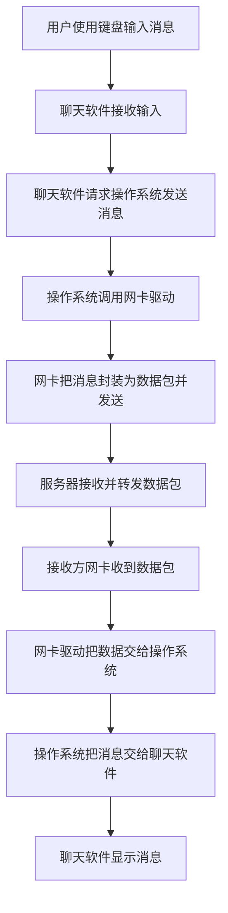
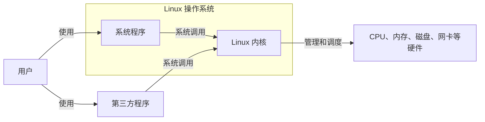
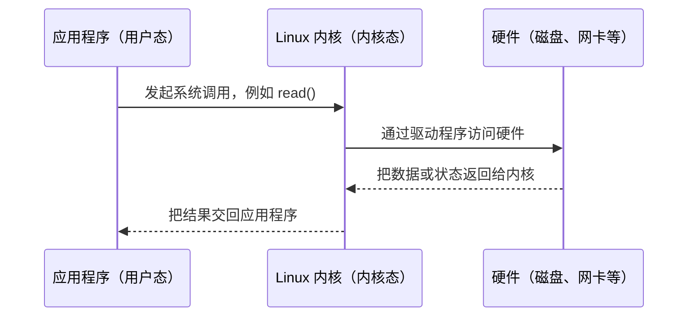

# 初识 Linux（1）：操作系统与 Linux 概念

> 学习目标：知道 Linux 在计算机中做什么，理解“内核”和“发行版”的区别。

## 1. 计算机、软件与操作系统

计算机可以分成两部分：

- 硬件：看得见、摸得着的物理设备，例如 CPU、内存、硬盘、显示器和网卡。
- 软件：让人能够使用硬件的程序，例如浏览器、微信、播放器和操作系统。

操作系统（Operating System，OS）是最基础的一类软件。它站在用户和硬件之间：用户通过应用发出需求，操作系统负责协调硬件来完成工作。

例如，发一条微信消息时，应用程序不必自己管理网络设备、CPU 或存储；它向操作系统请求服务，再由操作系统调度相应硬件。

从这个过程可以看出，操作系统会调度键盘完成文字输入、调度显示器显示内容、调度 CPU 和内存运行应用，也会调度网卡发送和接收网络数据。

### 1.1 操作系统的五项职责

操作系统站在用户和硬件之间，日常主要承担五项职责。前四项直接管理硬件资源，最后一项负责与用户打交道。

| 职责 | 做什么 | 对应的 Linux 常用命令 |
| --- | --- | --- |
| 进程管理 | 创建、调度、暂停和结束进程，决定 CPU 什么时候给谁用 | `ps`、`top`、`kill` |
| 内存管理 | 为进程分配和回收内存，必要时把暂时不用的数据换出到磁盘 | `free`、`top` |
| 文件系统管理 | 组织磁盘上的文件与目录，负责读写、权限和空间统计 | `ls`、`mkdir`、`df` |
| 设备驱动与 I/O | 通过驱动程序控制键盘、磁盘、网卡等设备，处理输入输出 | `lsblk`、`dmesg` |
| 用户接口 | 提供图形界面和命令行两种使用方式，把用户请求转成系统调用 | `bash`、`ssh` |

其中进程管理、内存管理、文件系统管理合称操作系统的三大核心职责。设备驱动与 I/O 是把上层请求真正落到硬件上的通道，用户接口则是我们实际敲命令的地方。

### 1.2 应用发送网络消息的过程

下面以聊天软件发送和接收消息为例。应用程序负责接收用户操作，操作系统负责调用驱动程序并调度网卡，服务器负责转发数据。



操作系统在这个过程中会同时调度 CPU、内存、键盘、显示器和网卡。应用程序只需调用操作系统提供的接口，无需了解每种硬件的具体控制方式。

常见操作系统：

| 使用场景 | 例子 |
| --- | --- |
| 个人电脑 | Windows、Linux、macOS |
| 移动设备 | Android、iOS、鸿蒙系统 |

## 2. Linux 由什么组成

一个可使用的 Linux 系统可以简单理解为：

```text
Linux 系统 = Linux 内核 + 系统级应用程序
```

### 2.1 Linux 内核

内核（kernel）是操作系统的核心，直接负责管理和调度硬件资源，主要包括：

- 调度 CPU：决定哪个程序在什么时候运行；
- 管理内存：给程序分配和回收内存；
- 管理文件系统：让文件能够保存、读取和组织；
- 管理网络通信：收发网络数据；
- 管理 I/O：协调键盘、磁盘、显示器等输入输出设备。

无论你用的是系统自带音乐播放器还是第三方播放器，最终播放声音都需要经由内核使用相关硬件。

调用关系可以记为：用户使用系统程序或第三方程序；程序调用内核；内核调度硬件。



图中系统程序属于 Linux 系统的一部分，第三方程序虽然不属于系统本身，但也必须通过内核访问硬件。

### 2.2 内核态与用户态

CPU 在运行时有两种特权级别。内核态可以执行全部指令、访问全部内存和硬件；用户态只能执行普通指令，访问空间也受到限制。内核代码运行在内核态，应用程序运行在用户态。

| 对比项 | 用户态 | 内核态 |
| --- | --- | --- |
| 运行对象 | 应用程序与库函数 | 内核代码 |
| 可用特权指令 | 不可以执行特权指令 | 可以执行全部指令 |
| 可访问空间 | 只能访问分配给自己进程的内存 | 可以访问全部内存与硬件 |
| 出错影响 | 一般只让当前进程崩溃 | 可能导致整个系统崩溃 |
| 如何进入 | 由用户态主动发起 | 由系统调用、中断或异常触发 |

程序本身不能直接读写磁盘或网卡，必须先请求内核代为操作。这条路径可以表示成：



### 2.3 系统调用与库函数

系统调用是内核暴露给应用程序的入口，库函数则是运行库提供的普通函数。库函数只在需要的时候才调用系统调用。

| 对比项 | 系统调用（`open`/`read`/`write`） | 库函数（`printf`/`malloc`） |
| --- | --- | --- |
| 由谁提供 | Linux 内核 | C 库（glibc）等运行库 |
| 运行状态 | 进入内核态执行 | 在用户态执行，必要时再进入内核态 |
| 可移植性 | 与具体内核和体系结构相关 | 跨平台，换系统通常仍能编译 |
| 能否直接访问硬件 | 可以，由内核代为操作 | 不可以，只能请求内核 |

一句话记法：应用程序调用库函数，库函数必要时通过系统调用进入内核。

查资料时可以借助 man 手册的分节：`man 1` 查命令，`man 2` 查系统调用，`man 3` 查库函数。

### 2.4 系统级应用程序

系统级应用程序是随操作系统提供的基础工具，例如文件管理器、任务管理器、图片查看器和音乐播放器。它们方便用户完成日常操作，但通常不直接操作硬件，而是通过内核请求服务。

### 2.5 Linux 发行版

Linux 内核是开源、免费的。不同组织或社区会把内核与安装程序、桌面、软件管理工具和系统工具整合为完整系统，这个完整系统称为 Linux 发行版（distribution）。

常见发行版包括：

- Ubuntu：对初学者较友好，资料多，WSL 中常用；
- CentOS 7：本课程原文以 CentOS 7.6 为例；
- 其他发行版：Debian、Fedora、Rocky Linux、openSUSE 等。

要记住：内核不是完整系统；发行版才是可以安装和使用的 Linux 系统。

原文提供的内核官网：[kernel.org](https://www.kernel.org/)。

### 2.6 发行版族谱

发行版数量很多，但大部分可以归入两个大家族：Debian 系和 RHEL 系。它们的差别不只是名字，包格式、包管理器、配置目录和服务名都不一样。

| 对比项 | Debian 系 | RHEL 系 |
| --- | --- | --- |
| 代表发行版 | Debian、Ubuntu | RHEL、CentOS、Rocky Linux、AlmaLinux |
| 包格式 | `.deb` | `.rpm` |
| 包管理器 | `apt`（旧命令为 `apt-get`） | `yum`（新版为 `dnf`） |
| 软件源配置目录 | `/etc/apt/sources.list`、`/etc/apt/sources.list.d/` | `/etc/yum.repos.d/` |
| 网络配置目录 | `/etc/netplan/` 或 `/etc/network/` | `/etc/sysconfig/network-scripts/` |
| SSH 服务名 | `ssh` | `sshd` |
| 默认提权方式 | `sudo` | 常用 `su -` 切到 root，也可自行配置 `sudo` |

三点补充：

1. RHEL 是商业发行版，使用官方软件源需要购买订阅。
2. Rocky Linux 和 AlmaLinux 是 CentOS 转向 CentOS Stream 之后，由社区重建的兼容版本。
3. CentOS 7 已经停止维护，不会再有安全更新；作为实验环境够用，但不适合长期对外提供服务。

## 3. Linux 目录结构

Linux 的文件系统是一棵以 `/` 为根的树，每个目录都有约定俗成的用途。先记住下面这些常用目录，后面敲命令时就不会迷路。

| 目录 | 存放什么 | 常见例子 |
| --- | --- | --- |
| `/bin` | 所有用户都要用的基础命令 | `ls`、`cp`、`bash` |
| `/sbin` | 主要给管理员使用的系统管理命令 | `fdisk`、`reboot`、`ifconfig` |
| `/etc` | 系统和软件的配置文件 | `/etc/passwd`、`/etc/ssh/sshd_config` |
| `/var` | 经常变化的数据，例如日志、缓存、邮件 | `/var/log/messages`、`/var/log/secure` |
| `/home` | 普通用户的家目录 | `/home/tom` |
| `/root` | root 用户的家目录 | `/root/.ssh/` |
| `/usr` | 系统自带的程序、库和文档 | `/usr/bin`、`/usr/local` |
| `/tmp` | 临时文件，所有用户都可以写 | 程序运行产生的临时缓存 |
| `/opt` | 手动安装的第三方大型软件 | `/opt/google` |
| `/proc` | 内核与进程信息的虚拟文件系统 | `/proc/cpuinfo`、`/proc/1/` |
| `/dev` | 设备文件，对应真实硬件 | `/dev/sda`、`/dev/null` |

四个容易混淆的点：

1. `/bin` 面向所有用户，`/sbin` 面向管理员；不少新发行版把它们链接到 `/usr/bin` 和 `/usr/sbin`，效果不变。
2. `/usr/bin` 放发行版自带的命令，`/usr/local` 放手动编译安装的软件，后者优先级更高，也不容易被包管理器覆盖。
3. `/proc` 和 `/dev` 里的内容是内核实时生成的虚拟条目，不能当成普通文件去修改或备份。
4. `/tmp` 可能在重启时被清空，重要数据不要放在这里。

## 4. 绝对路径、相对路径与路径简写

路径就是描述“文件在哪里”的一串字符。绝对路径从根目录写起，相对路径从当前目录写起，Linux 还提供了几个简写符号。

| 写法 | 起始点 | 示例 |
| --- | --- | --- |
| 绝对路径 | 根目录 `/` | `/etc/sysconfig/network-scripts/ifcfg-ens33` |
| 相对路径 | 当前工作目录 | `sysconfig/network-scripts` |
| `.` | 当前目录 | `./run.sh` |
| `..` | 上一级目录 | `../conf/app.conf` |
| `~` | 当前用户的家目录 | `~/notes` |
| `-` | 上一次所在的目录 | `cd -` |

连续执行几条命令就能体会它们的区别：

```bash
cd /etc
cd sysconfig
cd ..
cd ~/notes
cd -
pwd
```

两点提醒：

1. 执行当前目录下的脚本要写 `./run.sh`。Linux 默认不把当前目录放进 PATH，直接敲 `run.sh` 会报 command not found；也不建议把 `.` 加进 PATH，那样容易被同名脚本坑到。
2. `~` 写在双引号里不会展开，`"~/notes"` 会被当成名为 `~` 的普通目录；要家目录路径时让它出现在引号外，或改用 `$HOME`。

## 5. 本部分要记住的词

| 词语 | 用自己的话理解 |
| --- | --- |
| 硬件 | 真正完成计算、存储、显示、联网的设备 |
| 软件 | 指挥硬件完成任务的程序 |
| 操作系统 | 管理硬件、为应用提供基础服务的软件 |
| 内核 | 操作系统中最核心的资源管理部分 |
| 发行版 | 内核加上各种工具、安装程序和应用组成的完整 Linux 系统 |
| 内核态 | 内核代码运行的高特权状态，可执行特权指令、访问全部内存 |
| 用户态 | 应用程序运行的受限状态，不能直接操作硬件 |
| 系统调用 | 内核提供给应用程序的入口，进入内核态执行 |
| 库函数 | 运行库提供的普通函数，必要时通过系统调用进入内核 |
| Debian 系 | 使用 `.deb` 包和 `apt` 的家族，例如 Ubuntu |
| RHEL 系 | 使用 `.rpm` 包和 `yum`/`dnf` 的家族，例如 CentOS |

## 6. 自测

1. 浏览器访问网页时，为什么不需要自己驱动网卡？
2. Linux 内核和 Ubuntu 有什么关系？
3. “Linux 发行版”为什么不能只理解为 Linux 内核？
4. 用户态的应用程序想读写磁盘上的文件，中间要经过哪些步骤？
5. `/etc` 和 `/var` 分别适合放什么？

## 7. 本篇总结

1. 操作系统站在用户和硬件之间，应用程序只需提出请求，硬件调度由操作系统完成。
2. 操作系统的五项职责是进程管理、内存管理、文件系统管理、设备驱动与 I/O、用户接口，前三项合称三大核心职责。
3. Linux 系统等于 Linux 内核加系统级应用程序，内核只负责管理和调度硬件资源。
4. 应用程序运行在用户态，内核运行在内核态；用户态不能直接执行特权指令、访问硬件。
5. 用户态通过系统调用进入内核态，内核通过驱动程序访问硬件，再把结果返回给应用程序。
6. 系统调用由内核提供并运行在内核态，库函数由运行库提供、通常运行在用户态。
7. 记法是：应用程序调用库函数，库函数必要时通过系统调用进入内核。
8. 查资料时按 man 分节区分：`man 1` 命令、`man 2` 系统调用、`man 3` 库函数。
9. 发行版分成 Debian 系和 RHEL 系，差别体现在包格式、包管理器、配置目录和 SSH 服务名。
10. Linux 目录以 `/` 为根，`/etc` 放配置、`/var` 放变化的数据、`/home` 放普通用户文件。
11. 绝对路径从 `/` 写起，相对路径从当前目录写起，`.`、`..`、`~`、`-` 是常用简写。
12. 执行当前目录的脚本要写 `./run.sh`，而 `~` 写在双引号里不会展开。
