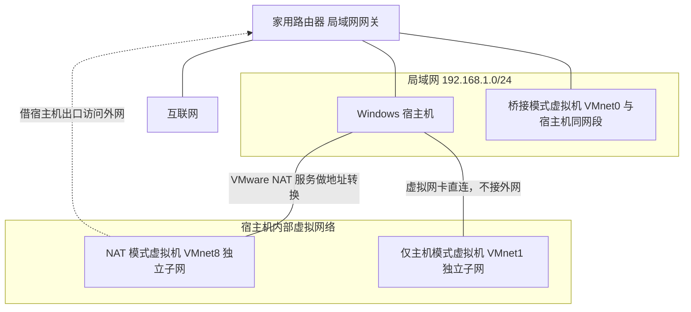

# 初识 Linux（2）：VMware 虚拟机与远程连接

> 学习目标：理解虚拟机的用途，完成一台 Linux 虚拟机的创建，并知道如何用终端工具连接它。

## 1. 什么是虚拟机

虚拟机（Virtual Machine，VM）是通过软件模拟出来的一台计算机。虚拟机软件会在你的真实电脑中虚拟出 CPU、内存、硬盘和网卡等硬件，再在这台“虚拟电脑”中安装一个真实的操作系统。

它的价值是：一台物理电脑可以运行多台彼此独立的虚拟电脑，不必为每套实验环境额外购买设备。学习 Linux 时，即使误操作损坏虚拟机，也不会直接影响 Windows 主机。

## 2. 使用 VMware Workstation 创建 Linux 环境

课程原文使用 VMware Workstation。安装时按向导完成许可协议、安装位置和快捷方式等设置即可；图中建议保留“将 VMware Workstation 控制台工具添加到系统 PATH”的选项。

安装完成后检查虚拟网络适配器是否正常：在 Windows 中按 `Win + R`，输入 `ncpa.cpl` 并回车，确认可看到并已启用 `VMware Network Adapter VMnet1` 和 `VMnet8`。

### 2.1 准备安装镜像

安装 Linux 前，需要下载 ISO 镜像文件，它相当于一张用于安装操作系统的虚拟光盘。原文以 `CentOS-7-x86_64-DVD-1810.iso` 为例。

图中选择的文件为 `CentOS-7-x86_64-DVD-1810.iso`。它是用于安装的 DVD 镜像，不要误选 `.torrent` 文件或体积明显不同的 `Everything` 镜像。

### 2.2 创建并安装虚拟机

大致流程：

1. 在 VMware 中新建虚拟机；
2. 选择下载好的 ISO 镜像；
3. 按向导设置虚拟机名称、保存位置与资源；
4. 完成创建并启动虚拟机；
5. 等待系统安装完成。

创建时可选择“典型”配置，并浏览选择 ISO 镜像。设置 Linux 用户名和密码时，这个用户名/密码会用于以后登录系统。

虚拟机名称和保存位置可以自行设置。课程截图建议虚拟硬盘设为 20–40 GB；拆分为多个文件更便于移动虚拟机。完成后启动虚拟机，等待系统安装结束并登录。

### 2.3 虚拟机网络的三种模式

VMware 装好后会在宿主机上创建若干块虚拟网卡，对应三种虚拟网络模式。模式决定了虚拟机的 IP 从哪里来、能不能上外网、局域网里的其他机器能不能连它。

| 模式（虚拟网络） | IP 从哪来 | 能否访问外网 | 能否被局域网其他机器访问 | 适用场景 |
| --- | --- | --- | --- | --- |
| 桥接（VMnet0） | 由局域网路由器的 DHCP 分配，与宿主机处于同一网段 | 能，直接使用局域网的出口 | 能，虚拟机在路由器眼中就是一台独立主机 | 需要把虚拟机当成一台真实服务器，供同一网段的其他设备访问 |
| NAT（VMnet8） | 由 VMware 的虚拟 DHCP 服务分配，属于独立子网，默认网关是 `.2` 结尾的地址 | 能，由宿主机做地址转换后上网 | 默认不能，只有宿主机能访问 | 宿主机能上网、只想让虚拟机也能联网，课程环境的默认选择 |
| 仅主机（VMnet1） | 由 VMware 的虚拟 DHCP 服务分配，属于独立子网 | 不能 | 不能，只有宿主机能访问 | 做纯本地实验，例如练 SSH、试防火墙规则，不希望虚拟机联网 |

三种模式的连接关系可以用下面这张图表示：



图上可以看出区别：桥接虚拟机直接挂在路由器上，和宿主机是平等的两台主机；NAT 与仅主机虚拟机都藏在宿主机内部，只有 NAT 能借宿主机的出口访问互联网。

切换模式后 IP 会变，连接工具里的地址要跟着改。例如同一台虚拟机从 NAT 切到桥接，网段会从 `172.16.x.x` 变成 `192.168.1.x`，FinalShell 里原先保存的地址就失效了。切换后要在虚拟机里重新执行 `ifconfig`（或 `ip addr`）查询新地址，再更新连接配置。

查看网段和网关的位置在 VMware 菜单的“编辑 → 虚拟网络编辑器”。打开后能看到 `VMnet0`、`VMnet1`、`VMnet8` 各自的类型、子网地址和子网掩码；点击“更改设置”并授权后，还能在 NAT 设置里看到网关地址。需要给虚拟机配固定 IP 时，就在这个子网范围内挑一个没人使用的地址。

### 2.4 CPU、内存与磁盘规划建议

创建虚拟机的向导会要求分配资源。给得太多会拖慢宿主机，给得太少虚拟机自己会卡，可以先参考下面的经验值。

| 资源 | 建议下限 | 推荐值 | 说明 |
| --- | --- | --- | --- |
| CPU | 1 核 | 2 核 | 命令行学习对 CPU 不敏感，2 核足够；分配总数不要超过宿主机物理核数 |
| 内存 | 1 GB | 2–4 GB | 图形化安装程序比纯命令行更吃内存 |
| 磁盘 | 20 GB | 20–40 GB，并选择“将虚拟磁盘拆分为多个文件” | 拆分后单个文件较小，便于复制和移动 |
| 网络适配器 | 能联网即可 | NAT | 先在 NAT 下把系统装好、网络连通，再按需切换 |

几条经验：

1. 内存给太小最直接的后果是安装程序卡住甚至失败；系统装好后也容易出现界面卡顿、命令响应慢，进程还可能被系统的内存管理机制直接杀掉。
2. 宿主机必须留出空闲内存。给虚拟机分配 4 GB 时，宿主机最好保有 4 GB 以上空闲内存，否则 Windows 自己开始换页，两台机器一起变慢。
3. 磁盘后续扩容比较麻烦。虚拟磁盘虽然可以扩容，但扩容后还要在 Linux 内部扩展分区和文件系统，步骤多且容易出错，一开始就按 20–40 GB 规划更省事。
4. 装完系统、确认能正常启动和登录后，先拍一个快照再做实验；具体做法见第 03 篇。

## 3. 图形界面和命令行

操作系统一般都提供两种交互方式：

- 图形界面（GUI）：通过窗口、图标和鼠标操作，Windows 常用这种方式；
- 命令行（CLI）：在终端中输入文字命令完成操作，Linux 服务器常用这种方式。

Linux 常通过命令行管理，原因是命令行便于远程操作、占用资源较少，也适合把重复操作写成脚本。

图形界面和命令行都能完成同一类任务，例如查看目录内容；区别在于前者通过文件管理器点击，后者通过终端输入命令。

## 4. 使用 FinalShell 远程连接虚拟机

在 VMware 窗口里输入命令不够方便。可以使用 FinalShell 等 SSH 客户端，在 Windows 中连接 Linux 虚拟机并操作终端。

### 4.1 找到虚拟机 IP 地址

启动虚拟机，打开终端，执行：

```bash
ifconfig
```

在输出中找到网卡的 IPv4 地址并记下。某些较新的系统没有预装 `ifconfig`，后续也可学习使用 `ip addr`。

在输出中寻找实际网卡（示例为 `ens33`）下的 `inet` 地址；示例地址为 `172.16.226.130`。不要把回环地址 `127.0.0.1` 当作远程连接地址。

### 4.2 新建连接

在 FinalShell 中新建 SSH 连接，填写：

| 项目 | 填写内容 |
| --- | --- |
| 主机 | 虚拟机查到的 IP 地址 |
| 端口 | `22`（SSH 的默认端口） |
| 用户名 | 安装 Linux 时创建的用户，或课程环境指定的用户 |
| 密码 | 该 Linux 用户的密码 |

安装 FinalShell 时按向导完成安装即可。打开连接管理器，选择“SSH 连接（Linux）”，填写上表后保存。在连接管理器中双击该连接；终端能够显示登录信息和命令提示符，即表示连接成功。

### 4.3 常见问题

- 虚拟机重启后，IP 地址可能变化；连接不上时先重新查询 IP，再更新客户端中的主机地址。
- 确保虚拟机已开机，且网络适配器正常。
- 主机与虚拟机必须处于能够互相访问的网络中。

### 4.4 命令行 ssh 连接

FinalShell 这类工具只是把 SSH 协议包装成图形界面。底层命令 `ssh` 在 Windows、macOS 和 Linux 上都能直接使用，服务器端不需要为它做额外配置。

```bash
# 用默认端口 22 登录指定主机
ssh 用户名@${SERVER_IP}

# 指定端口：注意 -p 是小写，端口号紧跟其后
ssh -p 2222 用户名@${SERVER_IP}

# 用私钥登录，私钥文件要先设置好权限
ssh -i ~/.ssh/id_rsa 用户名@${SERVER_IP}

# 退出当前连接，回到本地终端
exit
```

| 写法 | 作用 |
| --- | --- |
| `ssh 用户名@地址` | 以指定用户登录目标主机，端口默认 22 |
| `-p 端口` | 指定 SSH 端口，端口不是 22 时必须显式写出 |
| `-i 私钥文件` | 指定用于免密登录的私钥文件 |
| `exit` | 断开当前会话，也可以在会话中按 `Ctrl + D` |

第一次连接一台新机器时，本地会看到类似下面的提示：

```text
The authenticity of host '${SERVER_IP} (${SERVER_IP})' can't be established.
ECDSA key fingerprint is SHA256:xxxxxxxxxxxxxxxxxxxxxxxxxxxxxxxxxxxxxxxxxxx.
Are you sure you want to continue connecting (yes/no/[fingerprint])?
```

输入 `yes` 并回车后，这台主机的指纹会被记录到本地的 `~/.ssh/known_hosts` 文件中，以后再连接同一台机器就不再提示。

重装系统、更换机器或给虚拟机重新分配了 IP 之后，指纹通常会变化，此时连接会被拒绝，提示里会出现 `Host key verification failed` 或 `REMOTE HOST IDENTIFICATION HAS CHANGED`。如果确认是自己主动做了变更，可以编辑 `~/.ssh/known_hosts`，删除对应主机的那一行，然后重新连接。用 `ssh-keygen -F ${SERVER_IP}` 可以先确认本地记录的是哪一行。

但指纹变化也可能是中间人攻击的信号。看到提示要先判断原因：刚重装过系统、换过机器，删掉旧记录是合理的；如果什么都没做，就不要急着删文件，而应核对服务器给出的新指纹是否与运维提供的一致，再决定是否继续。

## 5. 常用远程连接工具对比

远程连接工具很多，选哪个主要看习惯和使用平台。下面列举几种常见选择。

| 工具 | 平台 | 主要特点 | 适合谁 |
| --- | --- | --- | --- |
| Xshell | Windows | 老牌 SSH 客户端，支持会话管理、多标签、端口转发，免费版有会话数量限制 | 习惯传统 SSH 客户端的 Windows 用户 |
| FinalShell | Windows、macOS、Linux | 中文界面，集成 SSH 与服务器监控（CPU、内存、网络），课程常用 | 中文用户，以及想边连边看资源占用的初学者 |
| MobaXterm | Windows | 内置 X 服务器，支持 SSH、SFTP、RDP、VNC 等多种协议 | 需要图形界面转发或同时管理多种协议的用户 |
| VS Code Remote - SSH | Windows、macOS、Linux | 以编辑器为中心，直接编辑远程文件，内置终端 | 主要写代码，希望在本地编辑器里改远程文件的人 |
| Windows Terminal + `ssh` 命令 | Windows（自带 OpenSSH） | 无需额外安装，配置可写进 `~/.ssh/config`，轻量 | 已经熟悉命令行、不想装第三方工具的用户 |

这些工具底层都是 SSH 协议，配置项也基本相同，只有四项：主机（IP 或域名）、端口（默认 22）、用户名、口令或私钥。换工具只是换了一层外壳，服务器端的 `sshd` 配置和 Linux 用户都不用改，原有连接参数照抄即可。

## 6. 自测

1. ISO 文件在安装 Linux 时扮演什么角色？
2. 连接 Linux 前为什么要先查询 IP 地址？
3. 为什么虚拟机重启后 FinalShell 可能连接不上？

## 7. 本篇总结

1. 虚拟机用软件模拟出完整的硬件环境，一台物理机可以同时运行多台互不影响的虚拟电脑，实验出错也不会直接损坏 Windows 主机。
2. VMware Workstation 安装完成后，用 `ncpa.cpl` 确认 `VMnet1` 和 `VMnet8` 两块虚拟网卡存在并已启用。
3. 安装 Linux 使用 ISO 镜像，下载时要认准版本和体积，不要误取 `.torrent` 文件或版本不同的镜像。
4. 虚拟机网络分桥接（VMnet0）、NAT（VMnet8）、仅主机（VMnet1）三种模式，区别在 IP 来源、能否上网、能否被局域网其他机器访问。
5. 网络模式一改，虚拟机 IP 就会变，连接工具里的主机地址必须重新查询并更新。
6. 网段与网关可以在 VMware 的“编辑 → 虚拟网络编辑器”里查看，需要固定 IP 时就按这里显示的子网挑选地址。
7. 资源规划可以参考 CPU 2 核、内存 2–4 GB、磁盘 20–40 GB 并拆分为多个文件，同时给宿主机留足空闲内存。
8. 系统刚装好、环境确认正常时先拍快照，再做实验，出问题可以快速回退。
9. 连接虚拟机需要主机地址、端口、用户名、口令四项信息，端口默认是 22。
10. 命令行 `ssh 用户名@地址` 与图形化客户端等价，`-p` 指定端口，`-i` 指定私钥，`exit` 退出会话。
11. 首次连接会提示确认主机指纹，输入 `yes` 后写入 `~/.ssh/known_hosts`；指纹变化要先判断原因，再决定是否删除记录。
12. Xshell、FinalShell、MobaXterm、VS Code Remote - SSH 等工具底层都是 SSH 协议，换工具不影响服务器端配置。
