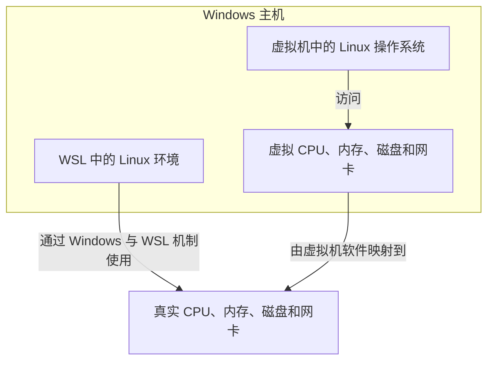

# 初识 Linux（3）：WSL 与虚拟机快照

> 学习目标：知道 WSL 和虚拟机两种学习环境的区别，并学会在动手前创建虚拟机快照。

## 1. WSL：Windows 中的 Linux 环境

WSL（Windows Subsystem for Linux）是 Windows 提供的 Linux 子系统。它让你在 Windows 中安装并运行 Linux 发行版，通常用于命令行学习、开发和日常工具使用。

原文将 WSL 的特点概括为：不需要先用 VMware 虚拟出完整硬件，即可在 Windows 上得到 Linux 环境。

WSL 可以理解为直接使用 Windows 主机硬件资源的 Linux 环境；完整虚拟机则会额外模拟 CPU、内存、磁盘、显示器等硬件。



这张图表示资源使用关系：WSL 与 Windows 的集成更直接；虚拟机先使用虚拟硬件，再由虚拟机软件把操作映射到真实硬件。

### 1.1 WSL 与 VMware 虚拟机怎么选

两种方案都能提供 Linux 环境，但定位不同。先看逐项对比，再看结论。

| 对比维度 | WSL（WSL2） | VMware 虚拟机 |
| --- | --- | --- |
| 资源占用 | 小，与 Windows 共享内存和磁盘，启动后通常只占几百 MB | 大，创建时就要固定分出 CPU、内存和磁盘 |
| 启动速度 | 快，几秒就能进入终端 | 慢，要等虚拟硬件自检和系统启动 |
| 与 Windows 文件互访 | 方便，`/mnt/c` 直接读写 C 盘，Windows 侧也能通过 `\\wsl$` 访问 | 较麻烦，一般要用共享文件夹或 SFTP 传输 |
| 图形界面 | 默认只有命令行，跑图形程序需要额外配置 | 完整支持，可以安装桌面环境 |
| 内核 | WSL2 使用微软定制的真实 Linux 内核 | 使用发行版自带内核，与物理机完全一致 |
| 网络 | 与 Windows 共享网络，IP 由 Windows 侧管理，默认不易被外部访问 | 有独立网卡和 IP，可配桥接，便于做网络实验 |
| 系统服务（systemd） | 需要较新版本并手动开启，默认行为与标准发行版有差异 | 与标准发行版一致，systemd 开箱可用 |
| 适用场景 | 学常用命令、写代码、用 Git、跑单个开发工具 | 学完整的 Linux 系统、网络、多机实验、服务部署 |
| 误操作后如何恢复 | 重装发行版，或用 `wsl --export` 的备份重新导入 | 用快照回退到拍摄时的状态 |

结论：

1. 初学命令、写代码、使用 Git，优先选 WSL：启动快，与 Windows 文件和终端的协作最省心。
2. 要学习完整 Linux 系统、网络或多机实验，选 VMware 虚拟机：环境更独立，便于模拟完整主机。
3. 害怕误操作时两者都可以：WSL 可以重装发行版，虚拟机可以用快照恢复。
4. 两者不冲突，可以同时安装：日常用 WSL，需要完整环境时再打开虚拟机。

关于 WSL 的版本：WSL1 通过系统调用转换层把 Linux 调用翻译成 Windows 调用，兼容性较差，不少程序无法运行；WSL2 使用微软定制的真实 Linux 内核，运行在轻量虚拟化环境中，兼容性和标准发行版基本一致。现在的 Windows 默认安装的就是 WSL2，不需要特意选择。

## 2. 部署 WSL 与 Ubuntu

原文的图形化操作流程如下：

1. 右键开始菜单，依次打开“应用和功能” → “程序和功能” → “启用或关闭 Windows 功能”；勾选“适用于 Linux 的 Windows 子系统”，确认后按提示重启；
2. 在 Microsoft Store 获取并安装 Ubuntu；
3. 第一次启动 Ubuntu 时，设置 Linux 用户名；
4. 输入两次密码完成用户创建；
5. 使用 Windows Terminal 作为更方便的终端工具。

在 Microsoft Store 搜索 `Ubuntu`，选择所需版本并点击“获取”。首次启动会解压发行版并要求创建默认 UNIX 用户；该用户名不需要与 Windows 用户名相同。

注意：Linux 终端输入密码时，屏幕通常不会显示星号或其他反馈。这是正常的；确认输入后直接按 Enter 即可。

安装成功后，终端提示符通常会显示为 `用户名@计算机名:~$`。需要管理员权限时可在命令前加 `sudo`，例如 `sudo apt update`。在 Microsoft Store 搜索并安装 Windows Terminal，打开后通过下拉菜单选择 Ubuntu，也可以将 Ubuntu 设为默认启动配置文件。

### 2.1 在 WSL 中访问 Windows 文件

WSL 启动时会自动把 Windows 的各个盘符挂载到 `/mnt` 下，所以在 Linux 里可以直接读写 Windows 文件，反向也能从 Windows 访问 WSL 的文件系统。

| 想访问的位置 | 在 WSL 中的路径 | 在 Windows 中的路径 |
| --- | --- | --- |
| Windows C 盘 | `/mnt/c/` | `C:\` |
| Windows D 盘 | `/mnt/d/` | `D:\` |
| Windows 桌面 | `/mnt/c/Users/用户名/Desktop` | `C:\Users\用户名\Desktop` |
| WSL 主目录 | `~`，即 `/home/用户名` | `\\wsl$\Ubuntu\home\用户名` 或 `\\wsl.localhost\Ubuntu\home\用户名` |

常用操作示例：

```bash
# 进入 Windows 桌面目录
cd /mnt/c/Users/用户名/Desktop

# 把当前目录下的文件复制到 Windows 桌面
cp hello.txt /mnt/c/Users/用户名/Desktop/

# 用 Windows 资源管理器打开当前目录
explorer.exe .

# 用 Windows 记事本打开某个文件
notepad.exe hello.txt
```

几点提醒：

1. 跨系统读写大量小文件会明显变慢。`/mnt/c` 下的每次读写都要经过 Windows 与 WSL 之间的转换，编译项目或批量解压时最好先把文件放到 WSL 自己的文件系统里。
2. 在 `/mnt/c` 下执行 `chmod`、`chown` 往往看不到效果。Windows 的文件系统不支持 Linux 的权限模型，WSL 只能按固定权限处理这些文件。
3. 练习权限相关内容时，把文件放在 WSL 自己的文件系统（例如 `/home/用户名` 或 `/tmp`）里，`chmod`、`chown` 的行为才会和真正的 Linux 一致。

## 3. WSL 常用管理命令

这些命令都在 Windows 侧执行：打开 PowerShell 或 CMD 就能运行 `wsl`，不需要先进入 Linux 终端。

```bash
# 查看 WSL 版本、内核版本和默认发行版
wsl --status

# 安装 WSL 及默认发行版，较新的 Windows 可以一条命令完成
wsl --install

# 列出已安装的发行版及其版本，-l -v 是 --list --verbose 的简写
wsl --list --verbose

# 把新安装的发行版默认版本设为 WSL2
wsl --set-default-version 2

# 把已有的 Ubuntu 发行版从 WSL1 转成 WSL2
wsl --set-version Ubuntu 2

# 设置默认启动的发行版
wsl --set-default Ubuntu

# 关闭所有发行版和 WSL 虚拟机，不删除数据
wsl --shutdown

# 只关闭某一个发行版
wsl --terminate Ubuntu

# 把发行版导出为 tar 归档，用于备份或迁移
wsl --export Ubuntu D:\backup\ubuntu-backup.tar

# 从 tar 归档导入成新的发行版
wsl --import UbuntuNew D:\wsl\UbuntuNew D:\backup\ubuntu-backup.tar

# 注销发行版，同时删除它的整个文件系统，不可恢复
wsl --unregister Ubuntu
```

每个命令该在什么时候用，可以对照下表：

| 什么时候用 | 用什么命令 |
| --- | --- |
| 刚装完 WSL，想确认版本和默认发行版 | `wsl --status` |
| 全新环境或重装系统后快速搭好 WSL | `wsl --install` |
| 查看装了哪些发行版，各自是 WSL1 还是 WSL2 | `wsl --list --verbose` |
| 沿用默认版本前统一设置为 WSL2 | `wsl --set-default-version 2` |
| 老发行版兼容性差，想升级成 WSL2 | `wsl --set-version Ubuntu 2` |
| 打开 Windows Terminal 后想直接进入某个发行版 | `wsl --set-default Ubuntu` |
| 改了网络或挂载配置，需要让 WSL 重启生效 | `wsl --shutdown` |
| 某个发行版卡死，只想重启它 | `wsl --terminate Ubuntu` |
| 换电脑前备份，或把环境迁移到另一台机器 | `wsl --export` 配合 `wsl --import` |
| 不再需要某个发行版，想彻底清理 | `wsl --unregister Ubuntu` |

三条容易踩的坑：

1. `wsl --shutdown` 只是关闭，下次启动数据还在；`wsl --unregister` 会连同该发行版的整个文件系统一起删除，无法恢复，执行前务必确认已经导出备份。
2. `wsl --export` 导出的是 tar 归档，包含整个发行版的文件系统，很适合做备份和迁移，可以放到 Windows 磁盘或移动硬盘上保存。
3. `wsl --set-version` 的转换过程比较慢，而且要求该发行版当前没有运行；执行前先用 `wsl --shutdown` 或 `wsl --terminate` 退出。

## 4. 虚拟机快照

快照（snapshot）是某一时刻虚拟机状态的保存点。以后可以把虚拟机恢复到这个保存点。

它特别适合学习 Linux：在安装完成且一切正常时先拍一个快照；进行高风险实验前再拍一个。发生错误后可以恢复，不必从头重装系统。

### 4.1 创建快照

在 VMware Workstation Pro 中，打开快照相关功能，填写快照名称和描述，然后执行“拍摄快照”。名称应能说明当时状态，例如：`01-刚安装完成`、`02-网络配置成功`。

先关闭虚拟机，再从 VMware 的“快照”菜单打开“快照管理器”。选择“拍摄快照”，填写名称和描述后确认。

### 4.2 恢复快照

需要回退时，选择目标快照并执行恢复。恢复会使虚拟机回到拍摄快照时的状态，因此快照之后创建的文件和配置可能会丢失。

在快照管理器中选中目标快照，点击“转到”即可恢复。恢复提示会明确说明：恢复后，当前状态将丢失；确认前先保存快照之后的重要文件。

### 4.3 什么时候该拍快照

快照不是越多越好，关键是挑对时机。下面这些时机拍快照性价比最高。

| 时机 | 理由 |
| --- | --- |
| 系统刚装完、能正常登录 | 这是最干净的状态，出问题可以直接回到这里，不必从头重装 |
| 配好网络、固定了 IP | 网络配置是实验失败最常见的原因，回退后还能用熟悉的地址连接 |
| 安装成套工具之前 | 装 JDK、数据库、中间件等一串软件前留一个还原点，装坏了不用逐个卸载 |
| 改 hosts、权限、防火墙之前 | 这三类改动最容易把远程连接自己断掉，留好快照才能救回来 |
| 需要演示从零开始时 | 演示前恢复快照就能得到一致的初始界面，不用手动清理历史痕迹 |

### 4.4 快照的局限

快照很方便，但它不是备份，也解决不了所有问题。

| 局限 | 说明 |
| --- | --- |
| 不是独立备份 | 快照文件与虚拟机磁盘文件在同一块物理磁盘上，磁盘损坏时两者一起丢失 |
| 占用磁盘空间 | 快照保存的是拍摄之后发生的变化，改动越多占用越大，宿主机的空间也被吃掉 |
| 数量多了会变慢 | 快照越多，写入时要维护的差异层越多，虚拟机的读写性能会下降 |
| 恢复会丢修改 | 恢复快照会丢弃拍摄之后的所有改动，包括新建的文件和改过的配置 |
| 恢复后要重新确认 IP | 快照里保存的是当时的网络配置，恢复后 IP 可能与现在不一致，连接工具里的地址要重新核对 |

## 5. 动手建议

1. 只学习常用命令：优先尝试 WSL + Ubuntu。
2. 需要跟随课程中的 VMware 截图：使用 VMware，并在安装成功后立即创建第一个快照。
3. 每次做可能影响网络、用户权限或系统配置的实验前，先拍快照。

## 6. 自测

1. WSL 和 VMware 虚拟机的用途有什么不同？
2. 为什么输入 Linux 密码时屏幕没有字符显示？
3. 恢复快照后，快照创建之后的数据可能发生什么？

## 7. 本篇总结

1. WSL 是 Windows 提供的 Linux 子系统，不需要先虚拟出完整硬件，就能在 Windows 里使用 Linux 命令。
2. WSL 与 VMware 虚拟机的差别集中在资源占用、启动速度、文件互访、图形界面、内核、网络、systemd 和恢复方式上，按场景选即可。
3. 初学命令、写代码、用 Git 选 WSL；要学完整 Linux 系统、做网络或多机实验选 VMware 虚拟机。
4. WSL1 通过系统调用转换层实现，兼容性较差；WSL2 使用微软定制的真实 Linux 内核，现在的 Windows 默认安装 WSL2。
5. WSL 会把 Windows 盘符挂载到 `/mnt` 下，C 盘是 `/mnt/c/`，D 盘是 `/mnt/d/`；Windows 侧则可以用 `\\wsl$` 或 `\\wsl.localhost` 访问 WSL 主目录。
6. 跨系统读写大量小文件较慢，而且在 `/mnt/c` 下 `chmod`、`chown` 往往无效，练权限要把文件放在 WSL 自己的文件系统里。
7. `wsl --status` 和 `wsl --list --verbose` 用来查看状态，`--set-default-version`、`--set-version`、`--set-default` 用来调整版本和默认发行版。
8. `wsl --shutdown` 与 `wsl --terminate` 只关闭不删数据，`wsl --unregister` 会删除整个发行版且不可恢复。
9. `wsl --export` 与 `wsl --import` 用 tar 归档完成备份和迁移；`--set-version` 转换较慢，执行前要先退出运行中的发行版。
10. 快照适合在系统刚装完、网络配好、安装成套工具前、改 hosts 与权限防火墙前，以及需要演示从零开始时拍摄。
11. 快照与虚拟机磁盘文件在同一块磁盘上，会占空间、堆多了会变慢，恢复会丢失之后的修改，恢复后要重新确认 IP。
12. 学 Linux 的稳妥顺序是：先搭好环境、拍好快照，再动手做可能影响系统的实验。
