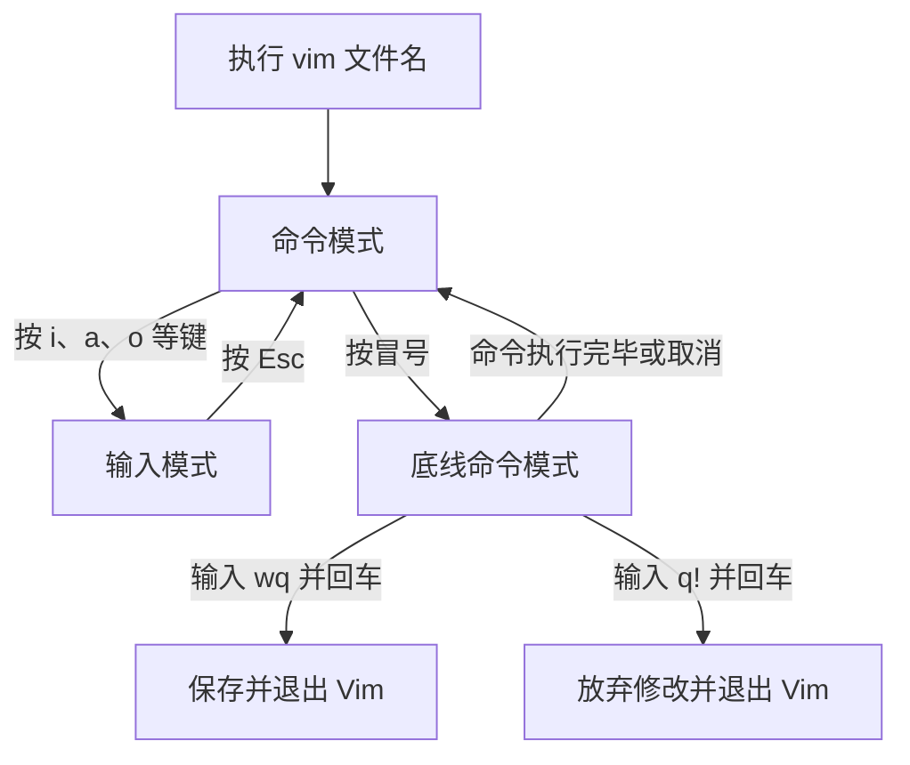

# 二、Linux 基础命令

> 学习目标：掌握 Linux 路径、命令格式，以及文件和目录的查看、切换、创建、复制、移动、删除、查找、过滤、统计、重定向和编辑方法。

## 1. Linux 目录结构与路径

### 1.1 根目录与 HOME 目录

Linux 只有一个统一的根目录，用 / 表示。所有文件和目录都从根目录向下组织；Windows 常用 C:\、D:\ 等多个盘符，Linux 没有这种盘符层级。

常见目录：

~~~text
/
├── home/       # 普通用户的家目录
├── root/       # root 管理员的家目录
├── etc/        # 系统配置文件
├── usr/        # 用户程序和库
├── var/        # 日志等经常变化的数据
└── tmp/        # 临时文件
~~~

普通用户的 HOME 目录通常是 /home/用户名。终端启动后，当前工作目录一般就是 HOME。

~~~bash
pwd                 # 查看当前目录
cd ~                # 回到当前用户的 HOME 目录
~~~

## 2. Linux 命令基础格式

### 2.1 通用语法

~~~text
command [-options] [parameter]
~~~

| 部分 | 含义 | 是否必填 |
| --- | --- | --- |
| command | 命令本身 | 是 |
| -options | 控制命令行为的选项 | 否 |
| parameter | 要处理的文件、目录等目标 | 否 |

~~~bash
ls -l /home       # ls 是命令，-l 是选项，/home 是参数
~~~

### 2.2 选项合并

~~~bash
ls -a -l /
ls -la /
ls -al /
~~~

以上三条命令效果相同：详细查看根目录，并显示隐藏内容。

## 3. 查看目录：ls

### 3.1 概念与语法

ls 用于列出目录内容，省略路径时查看当前工作目录。

~~~bash
ls [-a] [-l] [-h] [Linux路径]
~~~

### 3.2 选项比较

| 写法 | 作用 | 示例 |
| --- | --- | --- |
| -a | 显示隐藏文件和目录 | ls -a |
| -l | 使用列表形式显示详细信息 | ls -l |
| -h | 以 K、M、G 等易读单位显示大小，通常与 -l 搭配 | ls -lh |
| 路径 | 查看指定目录 | ls /etc |

~~~bash
ls                  # 平铺显示当前目录
ls -la              # 详细显示当前目录，包括隐藏内容
ls -lh /var/log     # 以易读单位查看 /var/log
~~~

## 4. 切换目录与路径

### 4.1 cd 与 pwd

cd（change directory）用于切换当前工作目录；不带参数时回到 HOME。pwd（print working directory）用于显示当前绝对路径。

~~~bash
cd /etc             # 切换到 /etc
cd Desktop          # 进入当前目录下的 Desktop
cd                  # 回到 HOME
pwd                 # 打印当前目录
~~~

### 4.2 路径类型比较

| 类型 | 起点 | 特征 | 示例 |
| --- | --- | --- | --- |
| 绝对路径 | 根目录 / | 以 / 开头 | /home/itheima/Desktop |
| 相对路径 | 当前目录 | 不以 / 开头 | Desktop |
| . | 当前目录 | 当前目录的简写 | ./Desktop |
| .. | 上一级目录 | 可连续使用 | ../.. |
| ~ | 当前用户 HOME | HOME 的简写 | ~/Desktop |

假设当前目录是 /home/itheima，以下两条命令效果相同：

~~~bash
cd Desktop
cd /home/itheima/Desktop
~~~

## 5. 创建目录：mkdir

### 5.1 概念与语法

mkdir（make directory）用于创建目录，路径参数必填。

~~~bash
mkdir [-p] Linux路径
~~~

### 5.2 -p 的作用

没有 -p 时，父目录必须存在；加上 -p 后，不存在的父目录会一并创建。

~~~bash
mkdir project                 # 创建一个目录
mkdir -p project/src/main    # 连续创建多级目录
~~~

创建目录需要权限，初学时建议在自己的 HOME 目录中操作。

## 6. 文件操作命令

### 6.1 touch：创建文件

~~~bash
touch notes.txt              # 创建空文件
touch ~/project/main.py      # 使用 HOME 路径创建文件
~~~

### 6.2 cat 与 more：查看文件

| 命令 | 适用场景 | 特点 |
| --- | --- | --- |
| cat | 内容较少的文件 | 一次性输出全部内容 |
| more | 内容较多的文件 | 分页查看，空格翻页，q 退出 |

~~~bash
cat notes.txt                # 直接显示全部内容
more /var/log/messages       # 分页查看，按 q 退出
~~~

### 6.3 cp：复制文件或目录

~~~bash
cp [-r] 源路径 目标路径
~~~

-r 表示递归复制，复制目录时必须使用；复制普通文件时可省略。

~~~bash
cp notes.txt backup.txt      # 复制文件
cp -r project project_bak    # 递归复制目录
~~~

### 6.4 mv：移动或重命名

~~~bash
mv 源路径 目标路径
~~~

目标是已有目录时执行移动；目标不存在时，mv 会把源文件改名为目标名称。

~~~bash
mv notes.txt docs/           # 移动文件
mv test01.txt test02.txt     # 重命名文件
~~~

### 6.5 rm：删除文件或目录

~~~bash
rm [-r] [-f] 路径1 [路径2 ...]
~~~

| 选项 | 作用 | 使用要求 |
| --- | --- | --- |
| -r | 递归删除目录及其内容 | 删除目录时必须使用 |
| -f | 强制删除，不询问确认 | 谨慎使用 |

~~~bash
rm old.txt                  # 删除文件
rm -r old_project           # 删除目录
rm -f cache.txt             # 强制删除文件
~~~

删除前先用 ls 确认路径。绝不要执行：

~~~bash
rm -rf *                    # 可能删除当前目录下几乎所有内容
rm -rf /*                   # 可能删除整个系统文件树
~~~

### 6.6 通配符 *

* 匹配任意长度的内容，包括空内容。

| 模式 | 匹配示例 |
| --- | --- |
| test* | test.txt、testing |
| *test | mytest、test |
| *test* | test.txt、mytest.log |

~~~bash
ls *.txt                     # 查看所有 .txt 文件
rm -i test*.log              # 逐个确认后删除 test 开头的日志
~~~

## 7. 查找命令

### 7.1 which：查找命令程序

~~~bash
which cp                    # 常见结果：/usr/bin/cp
which python3               # 查看 python3 的程序路径
~~~

### 7.2 find：查找文件和目录

#### 7.2.1 按名称查找

~~~bash
find 起始路径 -name "文件名或匹配模式"
~~~

~~~bash
find . -name "*.txt"         # 从当前目录查找 txt 文件
find / -name "test*"         # 从根目录查找 test 开头的内容
~~~

#### 7.2.2 按大小查找

~~~bash
find 起始路径 -size [+|-]n[kMG]
~~~

+ 表示大于，- 表示小于；k、M、G 表示 KB、MB、GB。

~~~bash
find . -size +100M           # 大于 100 MB
find . -size -10M            # 小于 10 MB
find / -name "*test*" -size -10M -size +1M
# 名称含 test，大小在 1 MB 到 10 MB 之间
~~~

## 8. 内容过滤、统计与管道

### 8.1 grep：按关键字筛选行

~~~bash
grep [-n] "关键字" 文件路径
~~~

-n 显示匹配行的行号；关键字含空格或特殊符号时，用引号包围。

~~~bash
grep -n "error" app.log  # 显示包含 error 的行及行号
~~~

### 8.2 wc：统计文件信息

~~~bash
wc [-c] [-m] [-l] [-w] 文件路径
~~~

| 选项 | 统计内容 |
| --- | --- |
| -c | 字节数 |
| -m | 字符数 |
| -l | 行数 |
| -w | 单词数 |

~~~bash
wc notes.txt              # 默认显示行数、单词数、字节数
wc -l notes.txt           # 只统计行数
~~~

### 8.3 管道符 |

管道符将左侧命令的输出交给右侧命令作为输入，可以组合多个处理步骤。

~~~bash
cat app.log | grep "ERROR"       # 读取日志，再筛选 ERROR
cat itheima.txt | grep itcast | grep itheima
# 依次筛选含 itcast、itheima 的行
~~~

## 9. echo、重定向与 tail

### 9.1 echo：输出内容

~~~bash
echo "Hello Linux"           # 输出字符串
echo pwd                     # 输出文字 pwd，不执行 pwd
echo \`pwd\`                   # 反引号中的 pwd 会先执行
echo "当前目录：$(pwd)"      # 推荐使用 $(...) 命令替换
~~~

### 9.2 > 与 >>

| 符号 | 行为 | 示例 |
| --- | --- | --- |
| > | 覆盖写入；文件不存在时创建 | echo "one" > a.txt |
| >> | 追加写入，保留旧内容 | echo "two" >> a.txt |

~~~bash
echo "Hello Linux" > message.txt      # 覆盖旧内容
echo "再次记录" >> message.txt          # 追加到末尾
~~~

执行 `>` 要格外小心：重定向是在命令真正运行之前就打开并清空目标文件的，所以哪怕后面的命令一行输出都没有、甚至直接报错，原文件也已经变成空文件了。养成习惯：不确定就先 `cp` 备份，或者改用 `>>` 追加。

如果不希望被误覆盖，可以打开防覆盖开关：

~~~bash
set -o noclobber          # 开启后，> 不能覆盖已存在的文件
echo "x" > existing.txt   # 会报 cannot overwrite existing file
echo "x" >| existing.txt  # 确定要覆盖时用 >| 强制写入
set +o noclobber          # 关闭防覆盖
~~~

同族的重定向还有几个常用写法：

| 写法 | 作用 |
| --- | --- |
| `>` | 覆盖写入标准输出 |
| `>>` | 追加写入标准输出 |
| `<` | 从文件读取作为标准输入 |
| `2>` | 覆盖写入标准错误 |
| `2>>` | 追加写入标准错误 |
| `2>&1` | 把标准错误合并到标准输出（顺序很重要，要写在输出重定向之后） |
| `&>` | 标准输出和标准错误一起重定向 |
| `/dev/null` | 黑洞设备，用来丢弃输出 |

~~~bash
ls /not/exist 2> err.log            # 只把错误存进文件
ls /not/exist > out.log 2>&1        # 正确和错误都存进同一个文件
ls /not/exist > out.log 2>/dev/null # 只保留标准输出，错误丢掉
~~~

如果 `2>&1` 写在 `> out.log` 前面，它复制的是"重定向前"的终端描述符，shell 会报语法错误或达不到预期效果，所以合并顺序要记牢。

### 9.3 tail：查看尾部和跟踪变化

~~~bash
tail [-f] [-num] Linux路径
~~~

| 写法 | 作用 |
| --- | --- |
| tail file.log | 默认显示末尾 10 行 |
| tail -n 20 file.log | 显示末尾 20 行 |
| tail -f file.log | 持续跟踪追加内容，按 Ctrl+C 结束 |

~~~bash
touch test.txt                 # 终端 A：创建文件
tail -f test.txt               # 终端 A：持续等待新内容
echo "第一条" >> test.txt       # 终端 B：追加内容，终端 A 会显示
~~~

## 10. vi/vim 编辑器

### 10.1 基本概念

vi 是经典命令行编辑器，vim 是兼容 vi 的增强版本，支持语法高亮。文件不存在时，打开命令会创建新文件。

~~~bash
vim hello.txt
~~~

### 10.2 三种工作模式

| 模式 | 作用 | 进入方式 | 切换方式 |
| --- | --- | --- | --- |
| 命令模式 | 移动、复制、删除、撤销 | 打开 vim 默认进入 | i/a 进入输入模式，: 进入底线命令模式 |
| 输入模式 | 自由输入和修改 | 命令模式按 i 等 | Esc 回到命令模式 |
| 底线命令模式 | 保存、退出、设置 | 命令模式按 : | 输入命令并回车 |

Vim 始终以命令模式作为模式切换的中心。在输入模式中先按 `Esc` 回到命令模式，才能输入 `:wq` 等底线命令。

### 10.3 最小编辑流程

~~~text
1. vim hello.txt       # 打开文件，进入命令模式
2. 按 i                # 进入输入模式
3. 输入 Hello Linux
4. 按 Esc              # 回到命令模式
5. 输入 :wq 并回车      # 保存并退出
~~~

### 10.4 常用快捷键

#### 命令模式

| 按键 | 作用 |
| --- | --- |
| i / a | 在光标处 / 光标后进入输入模式 |
| I / A | 跳到行首 / 行尾并进入输入模式 |
| o / O | 在当前行下方 / 上方新建一行 |
| Esc | 回到命令模式 |
| h、j、k、l | 左、下、上、右移动 |
| 0 / $ | 跳到行首 / 行尾 |
| dd / ndd | 删除当前行 / 当前行及下面 n 行 |
| yy / nyy | 复制当前行 / 当前行及下面 n 行 |
| p | 粘贴 |
| u / Ctrl+r | 撤销 / 重做 |
| gg / G | 跳到文件首行 / 末行 |
| /关键字、n、N | 搜索、向下继续、向上继续 |
| dG | 从当前行删除到文件末尾 |

#### 底线命令模式

| 命令 | 作用 |
| --- | --- |
| :wq | 保存并退出 |
| :q | 退出（无未保存修改时） |
| :q! | 放弃修改并强制退出 |
| :w | 只保存 |
| :set nu | 显示行号 |
| :set paste | 设置粘贴模式 |

## 11. 查看帮助和手册

### 11.1 --help

大多数命令支持 --help，用于快速查看用法和选项。

~~~bash
ls --help                    # 查看 ls 的简要帮助
find --help                  # 查看 find 的帮助
~~~

### 11.2 man

man 是 manual（手册）的缩写，用于查看完整命令手册。手册中按 /关键字 搜索，按 n 查看下一处匹配，按 q 退出。

~~~bash
man cd                       # 查看 cd 手册
man ls                       # 查看 ls 手册
~~~

## 12. 本篇知识点总结

1. Linux 只有一个根目录 /；绝对路径从根目录开始，相对路径从当前目录开始。
2. .、..、~ 分别表示当前目录、上一级目录和 HOME 目录。
3. 命令格式是 command [-options] [parameter]；选项控制行为，参数指定目标。
4. ls 查看，cd 切换，pwd 定位，mkdir 创建目录。
5. touch 创建文件，cat/more 查看，cp 复制，mv 移动或重命名，rm 删除。
6. which 查找命令位置，find 按名称和大小查找；* 用于模糊匹配。
7. grep 过滤，wc 统计，| 连接命令；echo 输出，> 覆盖，>> 追加，tail -f 跟踪变化。
8. vim 有命令、输入、底线命令三种模式；用 Esc 回到命令模式，用 :wq 保存退出。
9. 遇到不会的命令先试 命令 --help，需要完整说明时使用 man 命令。
