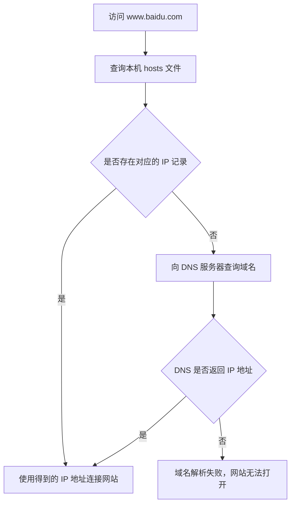

# 四、Linux 实用操作（三）：IP、主机名、域名解析与固定 IP

## 1. IP 地址

### 1.1 IPv4 与查看地址

IPv4 由四个 0～255 的数字组成。`ifconfig` 查看网卡信息。

~~~bash
ifconfig                      # 查看网卡和 IPv4
sudo yum -y install net-tools # 安装 ifconfig
~~~

### 1.2 子网掩码、网关与 CIDR 表示法

| 名词 | 含义 | 关键点 |
|---|---|---|
| 子网掩码 | 标出 IP 里哪部分是网络号、哪部分是主机号 | `255.255.255.0` 表示前三段是网络号 |
| 网关 | 本网段的出口地址 | 跨网段通信必须经过它 |
| 网络地址 | 主机号全为 0 的地址 | 代表整个网段，不能分配给主机 |
| 广播地址 | 主机号全为 1 的地址 | 用于本网段广播，也不能分配给主机 |
| 可用地址范围 | 网络地址与广播地址之间的地址 | 才是能真正配给主机的地址 |

网络号与主机号不一定按整段切分，Linux 里更常用 CIDR 表示法（斜杠后的数字表示掩码里 1 的个数）。网络地址与广播地址各占一个，所以 `/24` 的可用主机数是 254 而不是 256：

| CIDR 写法 | 掩码 | 可用主机数 | 常见用途 |
|---|---|---|---|
| `192.168.88.0/24` | `255.255.255.0` | 254 | 家庭与虚拟机实验环境最常用 |
| `192.168.0.0/16` | `255.255.0.0` | 65534 | 一个较大的内网 |
| `10.0.0.0/8` | `255.0.0.0` | 一千六百多万 | 大型企业内网 |
| `192.168.88.130/32` | `255.255.255.255` | 1 | 只表示这一台主机，常用于单条路由或防火墙规则 |

RFC 1918 规定的私网地址段不会在公网上被路由，内网可以反复使用：

| 私网地址段 | 掩码 | 地址数量 |
|---|---|---|
| `10.0.0.0/8` | `255.0.0.0` | 一千六百多万 |
| `172.16.0.0/12` | `255.240.0.0` | 约一百万 |
| `192.168.0.0/16` | `255.255.0.0` | 65534 |

判断两台机器是否在同一网段，方法是把各自的 IP 与子网掩码按位与，比较得到的网络地址是否相同：相同就是同网段，可以直接通信；不同就必须经网关转发。学习阶段最常见的问题就是“虚拟机与主机不在同一网段所以连不上”：VMware 的 NAT 或仅主机模式会给虚拟机分配某个网段（例如 `192.168.88.0/24`），如果把虚拟机 IP 手工改成别的网段（例如 `192.168.1.130`），网关 `192.168.88.2` 就不可达，表现是能 ping 通自己却 ping 不通主机。遇到这种情况先用 `ip addr` 和 `ip route` 核对网段与网关，再改配置。

### 1.3 特殊 IP

| 地址 | 含义 |
|---|---|
| `127.0.0.1` | 本机回环地址，只能在本机访问，外部访问不到 |
| `0.0.0.0` | 通配地址，含义取决于它出现的位置，见下表 |
| `255.255.255.255` | 受限广播地址，只在当前网段内广播 |

`0.0.0.0` 不是单一含义，"所有本地网卡或任意来源"只是其中一种，容易记混：

| 出现位置 | 含义 |
|---|---|
| 作为服务的监听地址（如 `bind 0.0.0.0`） | 监听本机所有网卡，外部可以访问；只写 `127.0.0.1` 则只能本机访问 |
| 作为路由表的目标地址（`ip route` 里的 `default via ...`） | 默认路由，表示没有匹配到其他条目时走这一条 |
| 作为服务端看到的对端地址 | 表示来源地址未知或任意，例如 `netstat` 里未连接 socket 显示的对端 |

把服务监听在 `0.0.0.0` 等于对外暴露，生产环境要配合防火墙和 `bind` 白名单，不要无脑监听全网。相对的，如果只想让本机或内网访问，就应该绑到具体的网卡地址。

## 2. 主机名

主机名是给机器起的名字，既是提示符上的标识，也可以配合 hosts 用来代替 IP 访问。

~~~bash
hostname                                # 查看当前主机名
hostname -I                             # 查看本机所有 IPv4 地址，最快捷的确认方式
hostname -f                             # 查看完整域名（FQDN）
sudo hostnamectl set-hostname web01     # 永久修改静态主机名
hostnamectl status                      # 查看静态/瞬态主机名与系统信息
cat /etc/hostname                       # 直接看静态主机名的配置文件
~~~

| 命令 | 作用 |
|---|---|
| `hostname` | 显示当前主机名，看的是内核里的值 |
| `hostname -I` | 列出本机所有 IPv4 地址，排查网卡地址最快 |
| `hostname -f` | 显示完整域名，配了 DNS 时才有意义 |
| `hostnamectl set-hostname` | 写入 `/etc/hostname`，重启后依然生效 |
| `hostnamectl status` | 同时显示静态主机名、瞬态主机名与系统信息 |

主机名分两种：静态主机名保存在 `/etc/hostname` 里，开机时由系统读取；瞬态主机名由内核维护，可能被 DHCP 或云平台改写成随机名字。所以 `hostnamectl set-hostname` 是永久生效的，而 `hostname 新名字` 只改当前会话，重启就没了。

## 3. 常用网络诊断命令

排查网络故障时，先搞清楚每条命令回答的是哪个问题，再按顺序问下去。

| 命令 | 解决什么问题 | 常用写法 |
|---|---|---|
| `ping` | 目标是否连通、延迟多少、有没有丢包 | `ping -c 3 114.114.114.114` |
| `ip addr` / `ifconfig` | 本机有哪些网卡、各自是什么地址（`ifconfig` 是老工具，需装 net-tools） | `ip addr`、`ip -br addr` |
| `ip route` | 默认网关是谁，数据从哪块网卡出去 | `ip route` |
| `traceroute` | 数据包经过哪些路由器，在哪一跳断了 | `traceroute -n 114.114.114.114` |
| `nslookup` / `dig` | 域名解析成了什么 IP | `nslookup www.baidu.com` |
| `hostname -I` | 本机地址的快速一览 | `hostname -I` |

~~~bash
ip addr                          # 查看所有网卡的地址信息
ip -br addr                      # 精简输出，一行一块网卡
ip route                         # 查看路由表与默认网关
ping -c 3 114.114.114.114        # 只发 3 个包，检查能否出网
traceroute -n 114.114.114.114    # 不反查域名，逐跳看路径
nslookup www.baidu.com           # 检查域名解析
dig +short www.baidu.com         # 只输出解析结果，便于脚本处理
~~~

~~~text
2: ens33: <BROADCAST,MULTICAST,UP,LOWER_UP> mtu 1500 qdisc fq_codel state UP group default qlen 1000
    link/ether 00:0c:29:1a:2b:3c brd ff:ff:ff:ff:ff:ff
    inet 192.168.88.130/24 brd 192.168.88.255 scope global noprefixroute ens33
       valid_lft forever preferred_lft forever
~~~

- `2: ens33` 是网卡序号与网卡名称，写固定 IP 配置时要写对这块网卡的名字。
- `state UP` 表示网卡已启用；如果显示 `DOWN`，先执行 `sudo ip link set ens33 up`。
- `link/ether 00:0c:29:1a:2b:3c` 是 MAC 地址，属于网卡的硬件地址，不是 IP。
- `inet 192.168.88.130/24` 是本机 IPv4 地址，`/24` 是子网掩码位数，等价于 `255.255.255.0`。
- `brd 192.168.88.255` 是本网段的广播地址，对应“主机号全 1”。

排查建议按顺序走，每一步排除一类原因：

1. `ip addr` 确认本机有地址：没地址说明网卡没启用或 DHCP 没拿到，属于本机配置问题。
2. `ping 网关`（如 `ping -c 3 192.168.88.2`）确认网段内能通：不通说明网段、掩码或网关写错了，属于局域网配置问题。
3. `ping 公网 IP`（如 `ping -c 3 114.114.114.114`）确认能出网：网段通但出网不通，属于网关或外网链路问题。
4. `nslookup www.baidu.com` 确认解析正常：能 ping 通公网 IP 却打不开域名，属于 DNS 问题。

`traceroute` 默认可能没有安装，先补上：`sudo yum -y install traceroute` 或 `sudo apt install traceroute`。

## 4. 域名解析

系统先查询 hosts，再向 DNS 查询。

这个过程说明 hosts 的优先级高于 DNS。若 hosts 中存在错误映射，即使 DNS 记录正确，系统也可能访问到错误的地址。

| 系统 | hosts 文件 |
|---|---|
| Windows | `C:\Windows\System32\drivers\etc\hosts` |
| Linux | `/etc/hosts` |

~~~text
192.168.88.130  centos  # 主机名映射
~~~

~~~bash
ssh itheima@centos  # 使用主机名连接
~~~

## 5. 配置固定 IP

DHCP 动态分配地址，重启后可能变化。VMware 网段、网关和 Linux 配置必须一致。

动手前先确认三件事：

1. 虚拟机网段：在 VMware“虚拟网络编辑器”里看 NAT 或仅主机模式用的网段，例如 `192.168.88.0/24`。
2. 网关地址：同一界面里显示的网关，例如 `192.168.88.2`，不能想当然写成 `.1`。
3. 要使用的 IP 未被占用：在网段内 `ping` 一下目标地址，没有回应通常说明空闲。

### 5.1 RHEL 系：ifcfg 文件

RHEL/CentOS 的配置放在 `/etc/sysconfig/network-scripts/ifcfg-<网卡名>` 里，几个关键项如下：

~~~ini
BOOTPROTO=static
ONBOOT=yes
IPADDR=192.168.88.130       # 选择未占用地址
NETMASK=255.255.255.0
GATEWAY=192.168.88.2
DNS1=114.114.114.114
~~~

完整写法还会加上网卡类型与开机自启开关，逐行含义如下：

~~~conf
TYPE=Ethernet                  # 网卡类型，有线以太网
BOOTPROTO=static               # 静态地址；改成 dhcp 就是动态获取
ONBOOT=yes                     # 开机自动启用这块网卡
NAME=ens33                     # 连接名称，一般与网卡名相同
DEVICE=ens33                   # 对应的网卡设备名，必须与实际网卡一致
IPADDR=192.168.88.130          # 固定的 IP，要在虚拟机网段内且未被占用
NETMASK=255.255.255.0          # 子网掩码，也可以用 PREFIX=24 代替
GATEWAY=192.168.88.2           # 网关，与虚拟网络编辑器里的保持一致
DNS1=114.114.114.114           # 首选 DNS
DNS2=8.8.8.8                   # 备用 DNS，主 DNS 不可用时兜底
~~~

改完重启网络并验证：

~~~bash
sudo systemctl restart network   # 重启网络（CentOS 7 及同代系统）
nmcli connection reload          # 让 NetworkManager 重新读取配置文件
ip addr                          # 验证 IP
ifconfig                         # 验证 IP（老工具）
ping -c 3 192.168.88.2           # 检查网关
ping -c 3 114.114.114.114        # 检查公网
~~~

CentOS 8+/RHEL 8+ 上 `network` 服务已被 NetworkManager 取代，重启命令通常是 `sudo nmcli connection reload` 或 `sudo systemctl restart NetworkManager`。

### 5.2 Ubuntu：netplan

Ubuntu 18.04 之后用 netplan，配置文件放在 `/etc/netplan/` 下，是 YAML 格式：

~~~yaml
network:
  version: 2
  renderer: networkd
  ethernets:
    ens33:
      dhcp4: no
      addresses:
        - 192.168.88.130/24
      routes:
        - to: default
          via: 192.168.88.2
      nameservers:
        addresses: [114.114.114.114, 8.8.8.8]
~~~

缩进必须用空格、不能用 Tab，冒号后面要有空格，否则 netplan 直接报错。生效方式有两种，区别很重要：

| 命令 | 行为 | 适用场景 |
|---|---|---|
| `sudo netplan try` | 应用配置并倒计时等待确认，超时或回车不确认就自动回滚 | 远程 SSH 操作，改错也能自动恢复连接 |
| `sudo netplan apply` | 直接应用，没有回滚 | 本地控制台操作，配置已确认无误 |

远程改 IP 时一定先 `netplan try`：万一地址写错导致断连，等它超时回滚就能重新连上。

### 5.3 Debian 系：/etc/network/interfaces

更老的 Debian/Ubuntu 用 `/etc/network/interfaces`，段落式写法：

~~~conf
auto lo
iface lo inet loopback        # 回环接口，保留默认配置

auto ens33
iface ens33 inet static       # 静态地址
    address 192.168.88.130
    netmask 255.255.255.0
    gateway 192.168.88.2
    dns-nameservers 114.114.114.114 8.8.8.8
~~~

改完重启网络：`sudo systemctl restart networking`，很老的系统用 `sudo /etc/init.d/networking restart`。

### 5.4 三种写法对比

| 发行版 | 文件位置 | 格式 | 固定 IP 关键项 | 生效命令 | 注意点 |
|---|---|---|---|---|---|
| RHEL 系 | `/etc/sysconfig/network-scripts/ifcfg-ens33` | key=value | `BOOTPROTO=static`、`IPADDR`、`NETMASK` 或 `PREFIX` | `systemctl restart network`、`nmcli connection reload` | `DEVICE` 必须与实际网卡名一致 |
| Ubuntu | `/etc/netplan/*.yaml` | YAML | `dhcp4: no`、`addresses`、`routes`、`nameservers` | `netplan try`、`netplan apply` | 严格缩进，远程改先 `try` |
| Debian 系 | `/etc/network/interfaces` | 段落式 | `iface ens33 inet static` 下的 address/netmask/gateway | `systemctl restart networking` | 只对传统 ifupdown 生效 |

## 6. 本篇知识点总结

1. IPv4 地址由四段 0～255 数字组成。
2. `127.0.0.1` 表示本机，`0.0.0.0` 常表示所有地址。
3. `hostname` 查看名称，`hostnamectl` 修改名称。
4. 域名解析先查 hosts，再查询 DNS。
5. 固定 IP 要匹配 VMware 网段、网关和网卡配置。
6. 子网掩码标出网络号与主机号的边界，网关是本网段的出口，网络地址与广播地址不能分配给主机。
7. CIDR 的斜杠数字表示掩码位数：`/24` 有 254 个可用地址，`/32` 只表示一台主机；`10.0.0.0/8`、`172.16.0.0/12`、`192.168.0.0/16` 是私网段。
8. 网络排查顺序：`ip addr` 看有没有地址，`ping` 网关看网段通不通，`ping` 公网 IP 看能不能出网，`nslookup` 看解析正不正常。
9. 固定 IP 有三种写法：RHEL 系的 ifcfg、Ubuntu 的 netplan、Debian 系的 interfaces。
