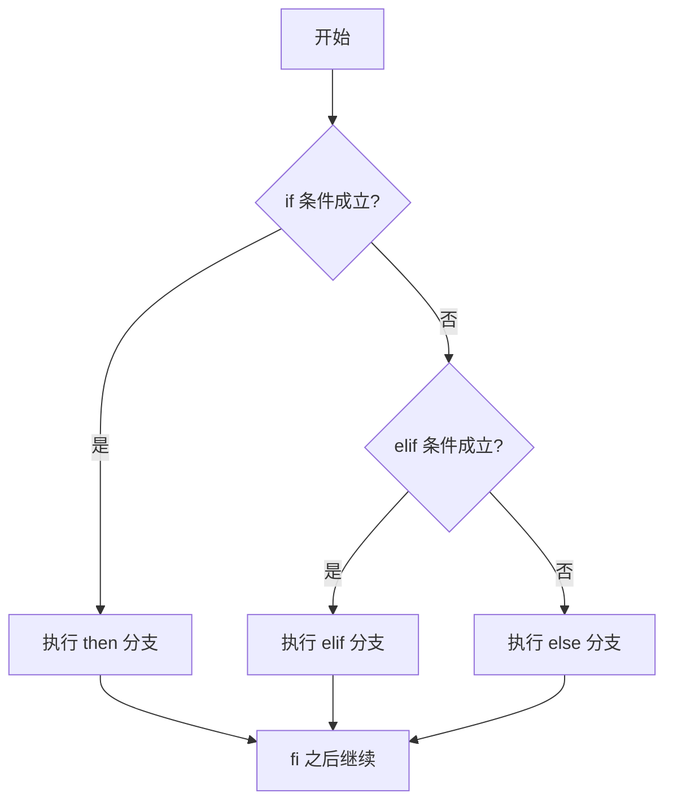

# 五、Shell 脚本与定时任务

> 把一条条命令写进文件就是脚本，再交给 crontab 定时执行，机器就能自己干活。

## 1. 学习目标与前置知识

读完本篇应能：

1. 说清 Shell、bash、脚本三者的关系与三种执行方式的区别，用变量、位置参数、引号和命令替换写出可读的脚本。
2. 用 `if`、`case`、`for`、`while` 控制流程，用函数和退出码组织脚本。
3. 用 `crontab` 配置定时任务，并能在任务没按时执行时定位原因。

前置知识：[04-Linux基础命令](04-Linux基础命令.md) 的管道与重定向、[05-Linux用户和权限](05-Linux用户和权限.md) 的执行权限、[11-Linux实用操作-环境变量与文件传输](11-Linux实用操作-环境变量与文件传输.md) 的 PATH 与 export、[12-Linux实用操作-压缩与解压](12-Linux实用操作-压缩与解压.md) 的 tar。

## 2. 什么是 Shell

Shell 是用户和内核之间的命令解释器：输入一行文本，Shell 把它拆成命令、选项、参数，找到对应程序交给内核执行，再把结果送回终端。

| 名称 | 含义 |
| --- | --- |
| Shell | 一类程序的总称，负责解释并执行命令 |
| bash | Bourne Again Shell，Linux 上最常见的 Shell 实现 |
| 脚本 | 把命令写进文本文件，交给 Shell 一次性解释执行 |

用 `echo "${SHELL}"` 查看当前 Shell，`cat /etc/shells` 列出已安装的 Shell。脚本第一行的 `#!` 称为 shebang：`#!/bin/bash` 表示用 bash 解释，`#!/usr/bin/env bash` 更通用，会先去 PATH 里找 bash。

### 2.1 三种执行方式

| 方式 | 是否要执行权限 | 在哪个进程运行 | 变量是否留在当前终端 |
| --- | --- | --- | --- |
| `bash a.sh` | 不需要 | 新建子进程执行 bash | 不保留 |
| `chmod +x` 后 `./a.sh` | 需要 | 按 shebang 新建子进程 | 不保留 |
| `source a.sh` 或 `. a.sh` | 不需要 | 当前 Shell 进程内 | 保留 |

```bash
bash a.sh                 # 显式指定 bash 执行，调试时最常用
chmod +x a.sh && ./a.sh   # 加执行权限后按 shebang 执行
source a.sh               # 在当前 Shell 执行，变量与 cd 结果都留下
bash -x a.sh              # 打印每一步的展开过程，排查脚本问题
```

需要脚本改变当前终端状态（加载环境变量、切换目录）时用 `source`，正式运行的脚本用 `./a.sh` 并把 shebang 写全；`./a.sh` 报“权限不够”，就是缺了 `chmod +x`。

## 3. 变量

变量是给一块数据起的名字，Shell 变量的值默认按字符串处理。赋值时等号两边不能有空格，写 `A = "x"` 会被当成执行命令 A；使用时在变量名前加 `$`，推荐用花括号界定边界。

```bash
NAME="study"                 # 等号两侧不能有空格
echo "${NAME}"               # 花括号界定变量名边界
echo "${NAME}note"           # 输出 studynote；$NAMEnote 会去找变量 NAMEnote
```

### 3.1 环境变量

环境变量是可以被子进程继承的变量：普通变量只存在于当前 Shell，`export` 之后子进程才看得到。PATH 就是最典型的环境变量，细节见 [11-Linux实用操作-环境变量与文件传输](11-Linux实用操作-环境变量与文件传输.md)。

```bash
export APP_HOME="/usr/local/app"   # 导出为环境变量，子进程可见
```

脚本默认继承 `PATH`、`HOME`、`USER`、`PWD`、`SHELL`、`LANG`。crontab 里的 PATH 与登录终端不同，这是很多脚本“手敲能跑、定时不跑”的根因。

### 3.2 位置参数与特殊变量

| 变量 | 含义 |
| --- | --- |
| `$0` | 脚本自身的名字 |
| `$1` `$2` ... `${10}` | 第 1、2、10 个参数，两位数以上必须用花括号 |
| `$#` | 参数个数 |
| `$@` | 所有参数，`"$@"` 保留每个参数原有的边界 |
| `$?` | 上一条命令的退出码，0 表示成功 |

`bash args.sh a b c` 里的 a、b、c 就是 `$1`、`$2`、`$3`，脚本名在 `$0` 里。需要逐个参数处理时写 `for P in "$@"; do echo "${P}"; done`。

## 4. 引号与命令替换

单引号完全原样，双引号里变量与命令会展开，反引号本身就是命令替换。

| 写法 | 变量是否展开 | 命令是否执行 | 建议 |
| --- | --- | --- | --- |
| `'${HOME}'` | 否，原样输出 | 否 | 写固定文本时用 |
| `"${HOME}"` | 是 | 是 | 引用变量时默认用双引号 |
| `` `pwd` `` | 是 | 是 | 老写法，不支持嵌套 |
| `$(pwd)` | 是 | 是 | 推荐写法，可嵌套 |

```bash
NAME="study"
echo "${NAME}"               # 输出 study
echo "今天：$(date +%F)"     # 命令替换后拼进字符串
```

给变量赋值、判断字符串相等、把关键字传给 grep 时都写 `"${VAR}"`：变量为空或含空格时，不加引号会让后续命令少一个参数或多出几个参数。

## 5. 运算符与判断

判断靠 test 命令：`[ ]` 是 test 的另一种写法，`[[ ]]` 是 bash 的关键字。中括号内侧必须留空格，`[ "$A" = "$B" ]` 合法，`[$A=$B]` 会报错。

| 写法 | 本质 | 特点 |
| --- | --- | --- |
| `test 表达式` | 命令 | 最原始的写法，结果放进 `$?` |
| `[ 表达式 ]` | 命令 | 最常见；逻辑与或写 `-a`、`-o`；变量必须加引号 |
| `[[ 表达式 ]]` | bash 关键字 | 支持 `&&`、`||`、`=~` 正则，不做单词拆分 |

数值比较不能用 `>` 和 `<`（会被当成重定向），要用运算符：

| 比较 | 数值写法 | 字符串写法 | 含义 |
| --- | --- | --- | --- |
| 相等 | `-eq` | `=` 或 `==` | 两边相同 |
| 不等 | `-ne` | `!=` | 两边不同 |
| 大于 | `-gt` | 无直接运算符 | 左边大于右边 |
| 小于 | `-lt` | 无直接运算符 | 左边小于右边 |

文件测试是最常用的一类判断：

| 运算符 | 成立条件 | 典型用途 |
| --- | --- | --- |
| `-e` | 路径存在 | 判断文件或目录在不在 |
| `-f` | 存在且是普通文件 | 判断 jar 包、配置文件在不在 |
| `-d` | 存在且是目录 | 判断备份目录是否存在 |
| `-z` `-n` | 字符串为空 / 非空 | 判断参数是否传了值 |

```bash
FILE="/usr/local/app/app.jar"
[ -f "${FILE}" ] && echo "文件存在" || echo "文件不存在"
[[ "${NAME}" =~ ^[0-9]+$ ]] && echo "是纯数字"
[[ "${NAME}" == stud* ]] && echo "以 stud 开头"
```

`&&` 前面成功才执行后面，`||` 前面失败才执行后面，`!` 取反；`[ a ] && [ b ]` 是两个命令的短路，`[ a -a b ]` 才是一个 test 表达式里的逻辑与。

## 6. 条件与循环

### 6.1 if / elif / else

```bash
SIZE=$(du -sm /data | cut -f1)
if [ "${SIZE}" -ge 5000 ]; then
    echo "告警：数据目录超过 5 GB"
elif [ "${SIZE}" -ge 1000 ]; then
    echo "注意：数据目录超过 1 GB"
else
    echo "正常：${SIZE} MB"
fi
```

判断从上到下走，遇到第一个成立的分支就执行，然后跳到 `fi` 之后：



### 6.2 case

`case` 相当于编程语言的 switch：`;;` 结束一个分支，`*)` 是兜底分支，模式里用 `|` 表示“或”、用 `*` 做通配。

```bash
case "$1" in
    start)          echo "启动服务" ;;
    restart|reload) echo "重启服务" ;;
    *)              echo "用法：$0 {start|stop|restart}" ;;
esac
```

### 6.3 for、while 与 read

```bash
while IFS= read -r LINE; do               # 逐行读取文件
    echo "服务器：${LINE}"
done < /usr/local/app/hosts.txt           # 用 < 把文件喂给循环
```

`for` 遍历空格分隔的列表，列表可以手写，也可以由通配符或命令替换生成；`while` 在条件成立时反复执行，循环体里必须改变条件变量，否则会死循环；`while read` 是逐行处理文件的固定套路，`IFS= read -r` 能保留行首尾空格与反斜杠。

`break` 立即结束整个循环，`continue` 跳过本次进入下一次：

```bash
for FILE in /data/logs/*.log; do
    [ -s "${FILE}" ] || continue          # 空文件跳过
    grep -q "ERROR" "${FILE}" && break    # 发现错误就停止巡检
done
```

## 7. 函数与退出码

函数把一段逻辑封装起来重复使用：函数内部的 `$1`、`$2` 表示函数自己的参数，`local` 声明的变量只在函数内有效；`return` 结束函数并返回状态码，`exit` 结束整个脚本。

```bash
log() {
    echo "[$(date +'%F %T')] $1"
}

check_dir() {
    local DIR="$1"
    [ -d "${DIR}" ] && return 0 || return 1
}

log "开始检查"
check_dir "/data/backup" || { log "目录不存在"; exit 1; }
exit 0
```

| 退出码 | 含义 | 使用建议 |
| --- | --- | --- |
| `0` | 成功 | 一切正常 |
| `1` | 一般错误 | 参数错误、文件不存在、命令不可用 |

脚本结尾显式写 `exit 0`，中间失败用 `exit 1`，能让 `&&`、`||` 和 crontab 日志都看清结果。

## 8. 定时任务：crond 与 crontab

crond 是常驻后台的定时任务服务，每分钟醒来一次检查有没有任务该执行；用户用 crontab 提交任务，任务保存在 `/var/spool/cron/` 目录下。

| 命令 | 作用 |
| --- | --- |
| `crontab -e` | 编辑当前用户的任务 |
| `crontab -l` | 列出当前用户的任务 |
| `crontab -r` | 删除当前用户的全部任务，慎用 |

每条任务一行，格式为 `分 时 日 月 周 命令`：

| 字段 | 取值 | 说明 |
| --- | --- | --- |
| 分 | 0-59 | 第几分钟 |
| 时 | 0-23 | 第几小时 |
| 日 | 1-31 | 每月第几天 |
| 月 | 1-12 | 第几月 |
| 周 | 0-7 | 星期几，0 和 7 都表示周日 |

| 需求 | 写法 | 说明 |
| --- | --- | --- |
| 每分钟 | `* * * * *` | 测试任务时常用 |
| 每天 3 点 | `0 3 * * *` | 分和时写死，其余用星号 |
| 每周一 3 点 | `0 3 * * 1` | 周字段写 1 |
| 每月 1 号 3 点 | `0 3 1 * *` | 日字段写 1 |

```bash
sudo systemctl status crond        # CentOS 系：查看 crond 服务
sudo systemctl enable crond        # 设置开机自启；Debian 系服务名是 cron
crontab -l                         # 确认任务已写入
```

任务执行记录在 `/var/log/cron`（CentOS 系）或 `/var/log/syslog`（Debian 系），systemd 系统也可以 `journalctl -u crond` 查看。

| 常见坑 | 现象 | 处理办法 |
| --- | --- | --- |
| 命令没写绝对路径 | 手敲正常，定时失败 | 命令、脚本、日志都写全路径 |
| 没有重定向输出 | 任务跑了但看不到结果 | 命令末尾加 `>> /var/log/x.log 2>&1` |
| 环境变量缺失 | 脚本里 java、python 找不到 | 脚本里显式 export PATH，或先 source 环境文件 |
| 命令里含 `%` | 任务被截断执行 | `%` 要转义成 `\%` |

## 9. 实战：每天 3 点备份并保留最近 7 天

把下面内容保存为 `/usr/local/bin/backup_app.sh`，再 `chmod +x`：

```bash
#!/bin/bash
SRC="/usr/local/app/data"
DST="/data/backup"
DATE=$(date +%F_%H%M%S)
mkdir -p "${DST}"
tar -zcf "${DST}/app-data-${DATE}.tar.gz" -C "${SRC}" .
if [ $? -eq 0 ]; then
    echo "$(date +'%F %T') 备份成功：${DATE}"
    find "${DST}" -name "app-data-*.tar.gz" -mtime +7 -delete
else
    echo "$(date +'%F %T') 备份失败" >&2
    exit 1
fi
```

脚本做了四件事：准备带时间戳的文件名、确保目标目录存在、用 tar 打包、成功后用 `find -mtime +7` 删掉 7 天前的旧包。对应的 crontab 配置如下，输出追加到日志里方便事后检查：

```bash
0 3 * * * /usr/local/bin/backup_app.sh >> /var/log/backup_app.log 2>&1
```

## 10. 小白易错点

| 易错点 | 后果 | 正确做法 |
| --- | --- | --- |
| `if [ $A = x ]` 变量没加引号 | 变量为空时报语法错误 | 写 `[ "${A}" = "x" ]` |
| `while` 循环体没改变条件变量 | 死循环，CPU 跑满 | 循环体里更新计数或读取新数据 |
| `crontab -r` 误用 | 当前用户全部任务被删除 | 只删单条任务时用 `crontab -e` 编辑 |
| 脚本里用相对路径 | 换目录执行就找不到文件 | 路径写绝对路径 |

## 11. 练习清单

1. 写一个脚本，接收目录路径作为 `$1`，不存在就用 `-d` 判断并给出提示，退出码为 1。
2. 用 `case` 实现 `start`、`stop`、`restart` 三个分支，其他输入打印用法。
3. 配置一个每 5 分钟执行一次的任务，把当前时间写入 `/tmp/hello.log`，用 `crontab -l` 和日志确认结果。

## 12. 资料对应关系

- 命令基础与重定向：[04-Linux基础命令](04-Linux基础命令.md)
- 执行权限：[05-Linux用户和权限](05-Linux用户和权限.md)
- 服务管理：[06-Linux实用操作-快捷键与软件服务](06-Linux实用操作-快捷键与软件服务.md)
- 环境变量：[11-Linux实用操作-环境变量与文件传输](11-Linux实用操作-环境变量与文件传输.md)

## 13. 本篇总结

1. Shell 是命令解释器，bash 是最常见的实现；`bash a.sh` 与 `./a.sh` 在子进程执行，`source` 在当前 Shell 执行。
2. 变量赋值等号两侧不能有空格，`export` 后的变量子进程可见。
3. 位置参数 `$1`、`$#`、`$@` 接收参数，`$?` 是上一条命令的退出码。
4. 单引号原样、双引号展开变量与命令、`$()` 做命令替换。
5. `[ ]` 与 `[[ ]]` 做判断，数值用 `-eq/-ne/-gt/-lt`，文件用 `-f/-d/-e`。
6. `if/elif/else`、`case`、`for`、`while` 控制流程，`break` 与 `continue` 控制循环。
7. 函数用 `local` 声明局部变量，`return` 返回状态码，`exit` 结束脚本。
8. crontab 五个时间字段是分、时、日、月、周，`*/n` 表示步长，日志看 `/var/log/cron`。
9. 定时任务的脚本要写绝对路径、重定向输出、自己设置 PATH，命令里的 `%` 要转义。
10. 备份脚本用 tar 打包加 `find -mtime` 清理，配合 crontab 实现每天 3 点保留最近 7 天。
