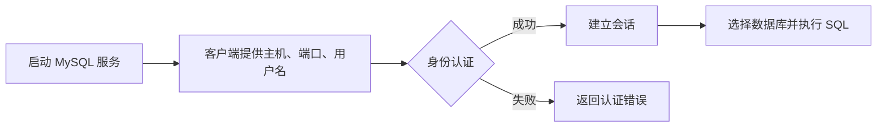
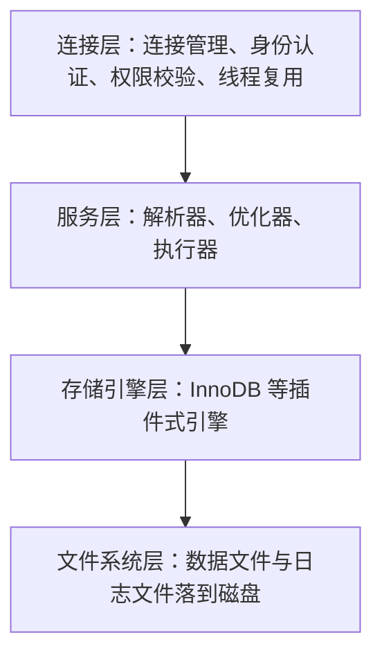

# MySQL概述

> 本章建立数据库和 MySQL 的基本认识，并完成本地安装、启动与连接。


## 1.数据库相关概念

### 1.1 数据库、数据库管理系统与 SQL 的关系

数据库（DB）：按照一定的数据结构来组织、存储和管理数据的仓库。

数据库管理系统（DBMS）：一种操纵和管理数据库的大型软件，用于创建、使用和维护数据库。

结构化查询语言（SQL）：一种操作关系型数据库的编程语言，定义了一套操作关系型数据库的统一 SQL 标准。

三者的关系是：数据库负责存放数据，数据库管理系统负责管理数据库，SQL 是用户和应用程序指挥数据库管理系统的语言。用户不会直接读写磁盘上的数据文件，所有请求都以 SQL 语句的形式交给 DBMS，由 DBMS 解析、优化、执行并落盘。


MySQL 只是众多 DBMS 中的一种，SQL 也不是 MySQL 专有的语言：换用其他关系型数据库时，SQL 的写法大部分仍然通用，差异主要在函数、数据类型和扩展语法上。

### 1.2 关系型数据库基本术语

关系型数据库（RDBMS）：由多张相互连接的二维表组成的数据库。下面这些术语会在本章及后续每一篇里反复出现。

|术语|含义|示例|
|---|---|---|
|数据库（Database）|存放多张表的容器，一个 MySQL 实例上可以建多个数据库|`db_shop`、`db_user`|
|表（Table）|同一类数据的二维集合，由行和列组成|`t_user`、`t_order`|
|行 / 记录（Row / Record）|表中的一条完整数据|一条用户信息|
|列 / 字段（Column / Field）|表中的一类属性，建表时必须声明类型|`user_name VARCHAR(32)`|
|主键（Primary Key）|唯一标识一行数据的列或列组合，非空且唯一|`id BIGINT PRIMARY KEY`|
|外键（Foreign Key）|指向另一张表主键的列，用来表达表与表的关联|`t_order.user_id` 指向 `t_user.id`|
|索引（Index）|为加速查询建立的额外数据结构，本质是排好序的目录|`KEY idx_user_name (user_name)`|
|约束（Constraint）|对列取值范围的强制性规则|非空、唯一、默认值、检查约束|

三点说明：

1. 主键在一张表里只能有一个，但主键可以由多列组合而成，称为复合主键。
2. 外键表达的是逻辑关联，物理上是否真的建立外键约束由设计决定；很多互联网项目为了写入性能与后续分库分表，只保留关联字段而不建外键约束。
3. 索引能加速查询但会拖慢写入，因为每次 `INSERT`、`UPDATE`、`DELETE` 都要同步维护索引。

### 1.3 关系型数据库与非关系型数据库

非关系型数据库（NoSQL）泛指非关系型数据库，是对关系型数据库的补充，常见类型有键值、文档、列族和图形数据库。

|对比维度|关系型数据库|非关系型数据库|
|---|---|---|
|数据结构|结构化的二维表，建表时字段与类型固定|键值、文档、列族、图等灵活结构，字段可随时增减|
|事务|普遍支持 ACID 事务，多行多表可回滚|多数只保证单条记录的原子性，跨记录事务能力弱或没有|
|扩展方式|以纵向扩展（提升单机配置）为主，分库分表需要额外改造|天生支持水平扩展，靠分片把数据自动分散到多台机器|
|典型产品|MySQL、Oracle、SQL Server、PostgreSQL|Redis、MongoDB、HBase、Neo4j、Elasticsearch|
|适用场景|数据关系复杂、一致性要求高、需要多表关联统计|高并发读写、数据结构多变、按 key 快速取整块数据|

两者不是替代关系：实际系统里常常用 MySQL 保存主体业务数据，用 Redis 缓存热点数据，用 Elasticsearch 做全文检索。
## 2.MySQL数据库概述

### 2.1 安装和卸载

下载地址：

[MySQL 官方下载页面](https://dev.mysql.com/downloads/windows/installer/8.0.html)

Windows 和 Linux 的安装步骤请以 [MySQL 官方文档](https://dev.mysql.com/doc/refman/8.0/en/installing.html) 为准。不同发行版的包管理器命令可能不同，安装前请确认目标系统和 MySQL 版本。

### 2.2 启动与停止

1.管理员连接（以管理员方式打开命令行窗口）：

启动：`net start mysql80`

停止：`net stop mysql80`

- 默认mysql是开机自动启动的

2.客户端连接：

方式一：开始菜单找到MySQL提供的客户端命令行工具`MySQL 8.0 Command Line Client`

方式二：系统自带的命令行工具执行指令`mysql [-h 127.0.0.1] [-P 3306] -u root -p`

- 方式二需要配置环境变量`C:\Program Files\MySQL\MySQL Server 8.0\bin\`
### 2.3 MySQL 客户端连接流程



客户端连接成功只代表身份认证通过；执行具体 SQL 还需要目标数据库存在，并且当前用户拥有相应权限。

#### 2.3.1 连接参数

`mysql -h 主机 -P 端口 -u 用户名 -p` 是最常用的客户端命令，各参数含义如下。

|参数|含义|默认值|示例|
|---|---|---|---|
|-h / --host|MySQL 服务所在的主机名或 IP，写 localhost 时走本机连接|localhost|`-h 192.168.1.10`|
|-P / --port|MySQL 服务监听的端口，注意这是大写 P|3306|`-P 3307`|
|-u / --user|登录用户名，与 `-u` 之间可以有空格也可以连写|当前系统用户|`-u root`|
|-p / --password|提示输入密码；后面直接跟密码会留在命令历史里，不推荐|无密码时省略|`-p`，回车后再输入|
|-D / --database|登录后直接切换到指定数据库|无|`-D db_shop`|
|-e|不进入交互界面，执行一条 SQL 后退出，常用于脚本|无|`mysql -uroot -p -e "SHOW DATABASES;"`|

```bash
# 连接本机 3306 端口的 MySQL，回车后再输入密码
mysql -h 127.0.0.1 -P 3306 -u root -p

# 连上以后先确认身份、当前库与版本
SELECT USER(), CURRENT_USER(), DATABASE(), VERSION();
```

小写 `-p` 后面紧跟的字符会被当成密码，而 `-P` 才是端口，把两者写反是新手最常见的连接问题之一。

#### 2.3.2 认证插件 caching_sha2_password

MySQL 8.0 默认的身份认证插件是 `caching_sha2_password`，而 MySQL 5.7 及更早版本、以及部分旧客户端与旧驱动只支持 `mysql_native_password`，首次连接时会出现下面的报错。

```text
ERROR 2059 (HY000): Authentication plugin 'caching_sha2_password' cannot be loaded
```

这不是密码错误，而是客户端与服务端协商认证插件失败：服务端要求使用新插件，客户端没有对应实现。三种解决方向如下。

|方向|做法|说明|
|---|---|---|
|升级客户端或驱动|换用新版 mysql 命令行工具与 8.x 的 `mysql-connector-j` 驱动|首选方案，保留 8.0 的默认安全特性|
|改用兼容插件|`ALTER USER 'root'@'%' IDENTIFIED WITH mysql_native_password BY '${DB_PASSWORD}';`|改动小，但该插件安全性低于默认值，只适合内网测试|
|连接串显式声明|内网测试可加 `allowPublicKeyRetrieval=true&useSSL=false`，跨网段使用 `sslMode=REQUIRED`|不改服务端配置，但要清楚明文传输的风险|

#### 2.3.3 常见连接错误码

|错误码|现象|原因|排查命令|
|---|---|---|---|
|2003|`Can't connect to MySQL server on '127.0.0.1' (10061)`|服务没启动、端口不对、防火墙拦截，或服务只监听了本机以外的地址|`net start mysql80`，再用 `netstat -ano` 确认 3306 是否处于 LISTENING|
|1045|`Access denied for user 'root'@'localhost'`|用户名或密码错误，或该账号没有从当前主机登录的权限|`mysql -u root -p` 手工确认密码，再看 `SELECT user, host FROM mysql.user;`|
|1049|`Unknown database 'xxx'`|连接的库不存在，或 `-D` 后面写错了库名|`SHOW DATABASES;`|
|1044|`Access denied for user 'xxx'@'%' to database 'yyy'`|账号能登录，但没有目标库的权限|`SHOW GRANTS FOR 'xxx'@'%';`|
|1251|`Client does not support authentication protocol requested by server`|客户端太旧，不支持服务端要求的认证插件|升级客户端，或把账号改为 `mysql_native_password`|

### 2.4 MySQL 的系统架构

MySQL 采用分层架构，从上到下分成四层。记住这四层，后面排查问题时很容易判断"毛病出在哪一层"。



|层次|主要职责|一句话说明|
|---|---|---|
|连接层|连接管理、身份认证、权限校验、线程复用|客户端连上来的第一站，负责让不让进、进来后由哪个线程服务|
|服务层|SQL 解析、查询优化、执行调度、内置函数|把一条 SQL 文本变成可执行的计划，决定怎么取数据|
|存储引擎层|事务、锁、索引、数据的实际读写|真正干活的执行者，决定数据怎么存、怎么取|
|文件系统层|数据文件、redo 与 undo 日志、binlog 的读写|与操作系统打交道，数据最终以文件形式保存在磁盘上|

服务层内部的三个核心组件依次是解析器、优化器、执行器。

|组件|作用|典型产物|
|---|---|---|
|解析器|词法分析与语法分析，检查 SQL 是否合法、表与列是否存在|语法树；语法错误在这一步就报出来|
|优化器|决定用哪个索引、多表连接的顺序、是否使用覆盖索引|执行计划，可以用 `EXPLAIN` 查看|
|执行器|按执行计划调用存储引擎接口，逐行或按批取出数据|最终结果集；权限校验也在这一步|

同一条 SQL 换存储引擎行为会不同，原因是 SQL 只描述"要什么数据"，至于数据怎么存、怎么加锁、怎么保证事务，全部由存储引擎实现。服务层生成的执行计划形式相同，但调用不同引擎得到的语义并不一样。

|对比点|InnoDB|MyISAM|
|---|---|---|
|事务|支持，可回滚|不支持|
|锁粒度|行级锁，并发写入互不影响|表级锁，写入会阻塞整张表|
|外键|支持|不支持|
|崩溃恢复|依靠 redo log 恢复到崩溃前的状态|崩溃后可能丢数据、索引损坏|

所以建表时 `ENGINE=InnoDB` 不是可选项而是基本要求，只有明确了特殊需求才考虑其他引擎。

### 2.5 版本与安装方式

|版本|默认认证插件|默认字符集与排序规则|关系与注意点|
|---|---|---|---|
|MySQL 5.7|`mysql_native_password`|utf8 / utf8_general_ci|老项目的常见版本，官方已停止维护，新项目不建议再选|
|MySQL 8.0|`caching_sha2_password`|utf8mb4 / utf8mb4_0900_ai_ci|当前主流版本，支持窗口函数、CTE、降序索引|
|MySQL 9.x|同 8.0 系列|同 8.0 系列|延续 8.x 的路线，学习阶段用 8.0 即可|
|MariaDB|`mysql_native_password`|取决于版本与发行版|由 MySQL 原作者另起的开源分支，协议与大部分语法兼容，但认证插件、JSON 实现和部分参数名并不相同|

MariaDB 不能理解成"另一个版本的 MySQL"：它的版本号自成体系（10.x、11.x），驱动与工具虽然大多通用，但遇到报错时不要直接拿 MySQL 的文档硬套。

安装方式各有取舍，按下表选择即可。

|安装方式|做法|优点|缺点|适用场合|
|---|---|---|---|---|
|Windows 安装包|运行 MSI 安装向导，按默认选项一路继续|图形化操作，自动注册服务，自带 Workbench|体积大、组件多、卸载不干净|个人电脑上的学习环境|
|Linux yum/apt|`yum install mysql-server` 或 `apt install mysql-server`|一条命令完成，依赖自动解决|版本受仓库限制，配置路径因发行版而异|服务器上快速部署|
|二进制压缩包|解压 tar.gz 或 zip 后手动初始化|版本与路径完全可控，不需要 root 权限|要自己建用户、初始化数据目录、写服务脚本|需要指定版本或离线环境|
|Docker|`docker run -d -p 3306:3306 -e MYSQL_ROOT_PASSWORD=${DB_PASSWORD} mysql:8.0`|秒级启动、环境隔离、删掉即恢复干净|数据必须挂载卷，容器网络与磁盘性能有额外开销|开发联调、临时验证、CI 环境|
|云数据库|购买云厂商的 RDS 实例|免运维，自带备份、监控与扩容能力|按量付费，参数与权限受平台限制|生产环境，尤其是没有专职运维的团队|

学习阶段推荐 Windows 安装包或 Docker：前者能直观看到服务名、配置文件与安装目录，后者便于随时推倒重来；生产环境优先选云数据库。

### 2.6 客户端工具

|工具|形态|特点|适用场景|
|---|---|---|---|
|mysql 命令行|官方自带的命令行客户端|无图形界面、启动快、脚本友好、结果可直接重定向|服务器上排查问题、写自动化脚本|
|MySQL Workbench|官方图形化客户端|免费，支持表结构建模与 ER 图，自带迁移工具|学习阶段画表结构、查看执行计划|
|Navicat|第三方图形化客户端|操作直观，支持多种数据库，数据传输与同步方便|日常开发与运维，习惯图形界面的用户|
|DataGrip|JetBrains 出品的图形化客户端|代码补全与重构能力强，多数据源统一管理|已有 JetBrains 全家桶的开发者|
|IDEA Database|IDE 内置的数据库工具|不用切换窗口，与 Java 代码里的 SQL 字符串联动|Java 项目开发，希望少开一个软件|

选择上只需注意一点：图形化工具在服务器上通常装不了，生产环境排障最终仍要回到 `mysql` 命令行，因此常用参数与错误码必须熟悉。

### 2.7 字符集与排序规则

字符集决定"一个字符用几个字节表示、能表示哪些字符"，排序规则决定"字符串之间怎么比较和排序"。两者成对出现，写法是 `字符集_排序规则`。

#### 2.7.1 utf8 与 utf8mb4 的历史差别

|名称|实际实现|最多字节|能否存 emoji|说明|
|---|---|---|---|---|
|utf8|MySQL 自己实现的 3 字节版本，等价于 utf8mb3|3|不能|历史遗留命名，只覆盖基本多文种平面|
|utf8mb3|与 utf8 完全等价|3|不能|8.0 起推荐的显式写法，用于标识旧的 3 字节行为|
|utf8mb4|真正的 UTF-8 编码|4|能|可以存 emoji、生僻汉字和特殊符号|

标准 UTF-8 是 1 到 4 字节的变长编码，MySQL 早期为了省空间把 `utf8` 实现成最多 3 字节，于是 4 字节字符（emoji、部分中日韩扩展字符）无法存入，写入时直接报错。

```text
Incorrect string value: '\xF0\x9F\x98\x80' for column 'nickname' at row 1
```

所以结论很简单：新库一律使用 `utf8mb4`；看到 `utf8` 就把它理解成"存不了 emoji 的那个旧字符集"。

#### 2.7.2 utf8mb4_0900_ai_ci 与 utf8mb4_general_ci

|排序规则|归属版本|比较依据|特点|
|---|---|---|---|
|utf8mb4_general_ci|5.7 及更早版本的默认值|按码点粗略比较|不区分大小写与重音，速度快，但对部分语言排序不准确|
|utf8mb4_0900_ai_ci|8.0 的默认值|基于 Unicode 9.0 的排序权重|排序更符合语言习惯，速度略慢|
|utf8mb4_bin|各版本通用|直接比较二进制值|区分大小写，适合口令、token 这类需要严格比较的列|

`ci` 表示不在乎大小写，`cs` 表示区分大小写，`ai` 表示不在乎重音。8.0 里沿用 5.7 的建表语句写 `utf8mb4_general_ci` 并不报错，但新表建议直接用 `utf8mb4_0900_ai_ci`，避免同一个库里两种排序规则混用，导致关联查询报"排序规则不一致"。

#### 2.7.3 库、表、列、连接四级字符集

同一个字符集可以在多个层级上设置，实际生效值按就近覆盖决定：列级优先于表级，表级优先于库级，库级则继承服务器的 `character_set_server`。

|层级|设置方式|查看方式|
|---|---|---|
|库级|`CREATE DATABASE db_shop CHARACTER SET utf8mb4;`|`SHOW CREATE DATABASE db_shop;`|
|表级|`CREATE TABLE t_user (...) DEFAULT CHARSET=utf8mb4;`|`SHOW CREATE TABLE t_user;`|
|列级|`nickname VARCHAR(64) CHARACTER SET utf8mb4`|`SHOW FULL COLUMNS FROM t_user;`|
|连接级|连接时加 `--default-character-set=utf8mb4`，或 JDBC 连接串加 `characterEncoding=utf8`|`SHOW VARIABLES LIKE 'character_set_client';`|

```SQL
-- 服务器默认字符集与排序规则，决定新建库的默认值
SHOW VARIABLES LIKE 'character_set_server';
SHOW VARIABLES LIKE 'collation_server';

-- 当前会话收发数据使用的字符集
SHOW VARIABLES LIKE 'character_set_client';
SHOW VARIABLES LIKE 'character_set_results';
```

连接级最容易被忽略：库、表、列都声明了 `utf8mb4`，只要客户端按 Latin-1 发送数据，服务端就会按错误的编码解读，写进库里依然是乱码。`character_set_connection` 是服务端内部转换时使用的编码，一般随 `character_set_client` 一起设置，不需要手工调整。

#### 2.7.4 乱码的三种典型现象

|现象|典型输出|原因|排查方向|
|---|---|---|---|
|问号|`?????`|目标字符集无法表示这些字符，转换时被替换成问号，信息已经丢失|检查列与表的字符集是不是 `utf8`，确认写入的是否为 4 字节字符|
|方框|`□□□`|客户端字体或终端不支持这些字符，数据本身可能没有问题|换用支持该字符的字体与终端，并先用 `SELECT HEX(列名)` 看真实字节|
|编码错位|`天`、`测试`|原始 UTF-8 字节被当成 Latin-1 解读，属于显示错位而不是数据损坏|对齐连接字符集，确认 `character_set_client` 与终端编码一致|

```bash
# 连接时显式指定字符集，排除客户端默认编码的干扰
mysql --default-character-set=utf8mb4 -h 127.0.0.1 -u root -p
```

判断数据是否真的坏了，最可靠的办法是看十六进制：执行 `SELECT HEX(nickname) FROM t_user WHERE id = 1;`，如果字节序列符合 UTF-8 的编码规则，就说明数据没问题，只是某一层的字符集声明不一致。

### 2.8 配置文件与服务名

#### 2.8.1 配置文件位置

|系统|配置文件|说明|
|---|---|---|
|Windows|安装目录或数据目录下的 `my.ini`，常见路径是 `C:\ProgramData\MySQL\MySQL Server 8.0\my.ini`|MSI 安装包自动生成，安装目录里的 `my-default.ini` 只是模板，改了没用|
|Linux|`/etc/my.cnf` 或 `/etc/mysql/my.cnf`|具体路径以 `mysqld --verbose --help` 的输出为准|
|Linux 附加目录|`/etc/my.cnf.d/`、`/etc/mysql/conf.d/`|用于拆分配置文件，主文件里通过 `!includedir` 引入|

```ini
[mysqld]
port = 3306
bind-address = 0.0.0.0
datadir = /var/lib/mysql
character-set-server = utf8mb4
collation-server = utf8mb4_0900_ai_ci
max_connections = 500
```

#### 2.8.2 常用参数

|参数|作用|默认值|调整后的影响|
|---|---|---|---|
|datadir|数据文件存放目录|Windows 与 Linux 各不相同|更换目录必须先停服务并搬迁数据，否则服务起不来|
|port|监听端口|3306|改端口后客户端与应用连接串都要同步修改|
|bind-address|监听哪些网络接口|多数发行版是 0.0.0.0，部分发行版是 127.0.0.1|改成 127.0.0.1 只允许本机连接，是内网环境的常见加固手段|
|max_connections|最大并发连接数|151|调大能容纳更多连接，但每个连接都占内存，过高会拖垮机器|
|character-set-server|服务器默认字符集|latin1 或 utf8mb4，取决于版本与发行版|必须显式设为 utf8mb4，否则新建的库可能不是 utf8mb4|

#### 2.8.3 服务名与重启

Windows 下服务名不一定叫 mysql，安装时可以自定义，先用下面的命令确认真实名称与状态。

```bash
# Windows：列出所有 MySQL 相关服务
sc query type= service state= all | findstr /i mysql

# 启动、停止服务，服务名以实际查询结果为准
net start mysql80
net stop mysql80
```

```bash
# Linux：systemd 环境下确认服务名与状态
systemctl status mysqld
systemctl restart mysqld
```

配置文件只在服务启动时读取一次，改完必须重启服务才会生效。`max_connections` 这类参数虽然支持用 `SET GLOBAL` 动态修改，但重启后会回到配置文件里的值，所以正确做法是先改配置文件再重启，动态修改只用于临时验证。

## 7.小白易错点

1. 把 `utf8` 当成 `utf8mb4` 用。现象：插入 emoji 或生僻字时报 `Incorrect string value`；原因是 MySQL 的 `utf8` 最多只存 3 字节，装不下 4 字节字符，新库必须显式声明 `utf8mb4`。
2. 装了 MySQL 却分不清服务名与实际进程。现象：`net start mysql` 提示服务名无效，但 MySQL 明明在运行；原因是安装时自定义了服务名（常见为 `mysql80`），服务名与进程名、安装目录名并不统一，应先用 `sc query` 列出真实服务名。
3. 改了配置文件却没重启服务。现象：参数改了怎么都不生效；原因是 `my.ini`、`my.cnf` 只在服务启动时读取一次，改完必须重启，`SHOW VARIABLES` 看到的仍是旧值。
4. 用 root 直连生产库。现象：一次误操作 `DELETE` 影响全表，或账号泄露后整库被拖走；原因是 root 拥有全部权限且没有权限边界，生产环境应按应用分配最小权限账号，root 只留给 DBA 应急。
5. 把 `-p` 和 `-P` 写反。现象：连接报端口错误，或提示密码不对；原因是大写 `P` 是端口、小写 `p` 是密码，小写 `p` 后面紧跟的内容会被直接当成密码。
6. 在 `-p` 后面直接写密码。现象：密码明文留在命令历史与 shell history 里；原因是命令行参数对同机其他用户可见，正确做法是只写 `-p` 再交互输入。
7. 以为连接成功就能执行任何 SQL。现象：登录后执行 `SELECT` 报 `ERROR 1044` 或 `ERROR 1142`；原因是登录只完成了身份认证，具体库和表的权限要单独授予。
8. 把 `ERROR 1045` 一律当成密码错。现象：反复改密码仍然连不上；原因是 MySQL 的账号是"用户名加主机"的组合，`root@localhost` 与 `root@%` 是两个不同账号，从别的机器连过来要用后者。
9. 建库建表不指定字符集。现象：本机测试正常，换台机器插入同一条数据就乱码；原因是没显式指定时会继承服务器默认值，而不同安装方式的默认值并不一致。
10. 看到 `天` 就以为数据坏了。现象：判定为乱码后直接重导数据；原因是这多半只是终端把 UTF-8 字节按 Latin-1 显示，用 `SELECT HEX(列名)` 看字节才能确认数据是否真的损坏。
11. 认为 5.7 与 8.0 的数据可以随便互导。现象：从 5.7 导出的数据在 8.0 上连不上，或迁移后报排序规则不一致；原因是两个版本的默认认证插件与默认排序规则都变了，迁移时要显式指定并升级驱动。
12. 把 `bind-address` 改成 `0.0.0.0` 后直接暴露到公网。现象：错误日志里出现大量来自陌生 IP 的登录失败；原因是服务监听了所有网卡且 3306 对公网开放，正确做法是限制来源 IP 或用安全组只放行内网。
13. 只在意库表字符集，忽略连接字符集。现象：表和列都是 `utf8mb4`，客户端读出来仍然是乱码；原因是 `character_set_client`、`character_set_results` 决定了收发时的编码，需要用 `--default-character-set=utf8mb4` 或连接串参数对齐。
14. 以为数据就存在安装目录里。现象：换目录或重装后发现数据"消失"；原因是 Windows 安装包的数据目录默认在 `C:\ProgramData\MySQL\...`，Linux 默认在 `/var/lib/mysql`，与安装目录不是同一个地方。
15. 用图形化工具代替命令行，就以为不用学命令。现象：服务器上只有终端，出故障时无从下手；原因是生产与容器环境通常不装图形客户端，命令行与错误码才是排障的基本工具。

## 8.本章小结

1. 数据库负责存数据，数据库管理系统负责管数据库，SQL 是操作关系型数据库的统一语言，三者的关系可以概括为"用户通过 SQL 指挥 DBMS 管理 DB"。
2. 关系型数据库的核心概念是表、行、列、主键、外键、索引与约束，后续的 SQL、事务、索引内容都建立在这些概念之上。
3. 关系型数据库强在事务与多表关联，非关系型数据库强在水平扩展与灵活结构，实际系统通常是两者配合使用。
4. MySQL 自上而下分为连接层、服务层、存储引擎层、文件系统层：连接层管进不来，服务层管怎么取，存储引擎层管怎么存，文件系统层管落到哪里。
5. 同一条 SQL 换存储引擎行为会不同，原因是事务、锁粒度、外键与崩溃恢复都由存储引擎实现，建表默认且应当使用 InnoDB。
6. 版本上优先选 MySQL 8.0，它的默认认证插件 `caching_sha2_password` 与默认排序规则 `utf8mb4_0900_ai_ci` 都与 5.7 不同，是迁移时最容易踩的两个坑。
7. 安装方式按场景选：学习用 Windows 安装包或 Docker，服务器部署用包管理器或二进制包，生产环境优先云数据库。
8. 客户端工具按习惯挑即可，但服务器排障最终依赖 `mysql` 命令行，`-h`、`-P`、`-u`、`-p`、`-D`、`-e` 与 2003、1045、1049、1044、1251 这几个错误码必须记住。
9. 字符集一律使用 `utf8mb4`，MySQL 的 `utf8` 只有 3 字节存不了 emoji；8.0 下的排序规则用 `utf8mb4_0900_ai_ci`。
10. 字符集有库、表、列、连接四个层级，生效值按就近原则覆盖；出现乱码先分清是 `?????`、方框还是编码错位，再决定改数据还是改显示。
11. 配置文件改完必须重启服务才生效：Windows 看 `my.ini`，Linux 看 `/etc/my.cnf` 与 `conf.d` 目录，动手前先确认真实的 Windows 服务名。
12. `datadir`、`port`、`bind-address`、`max_connections`、`character-set-server` 是最常调整的五个参数，改动前要清楚它们的连带影响。

## 小练习

安装并连接 MySQL 8.0，依次执行 `SELECT VERSION();`、`SHOW DATABASES;` 和 `SELECT DATABASE();`，记录每条命令的作用。
