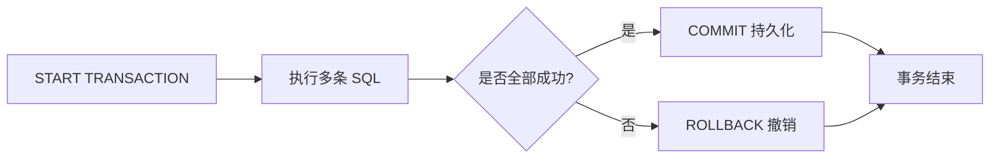
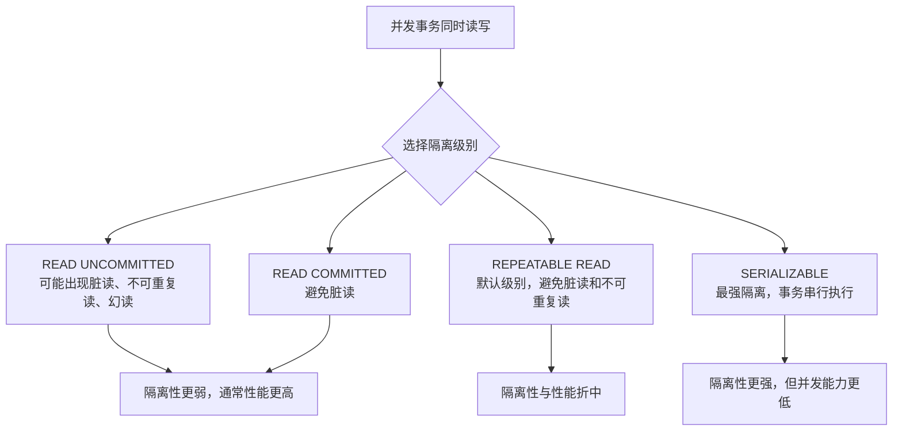
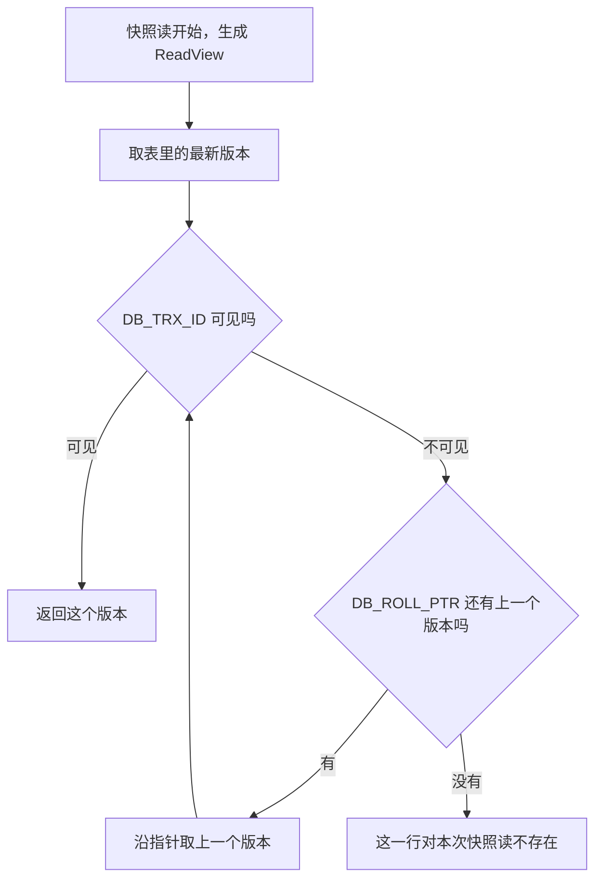

# 事务

> 本章说明如何把多条 SQL 作为一个整体执行，并理解并发访问下的数据一致性问题。


事务是一组操作的集合，事务会把所有操作作为一个整体一起向系统提交或撤销操作请求，即这些操作要么同时成功，要么同时失败。

## 1.代码设置

### 1.1 方式一

查看/设置事务提交方式

```SQL
SELECT @@AUTOCOMMIT;
SET @@AUTOCOMMIT = 0;
```

- @@AUTOCOMMIT的值有两种：1为自动提交，0为手动提交，该设置只对当前会话有效

提交事务

```SQL
COMMIT;
```

回滚事务

```SQL
ROLLBACK;
```

### 1.2 方式二

开启事务

```SQL
START TRANSACTION 或 BEGIN [TRANSACTION];
```

提交事务

```SQL
COMMIT;
```

回滚事务

```SQL
ROLLBACK;
```

## 2.事务的四大特性(ACID)

- 原子性(**A**tomicity)：事务是不可分割的最小操作单元，要么全部成功，要么全部失败

- 一致性(**C**onsistency)：事务完成时，必须使所有数据都保持一致状态

- 隔离性(**I**solation)：数据库系统提供的隔离机制，保证事务在不受外部并发操作影响的独立环境下运行

- 持久性(**D**urability)：事务一旦提交或回滚，它对数据库中的数据的改变就是永久的

## 3.并发事务问题

|问题|描述|
|---|---|
|脏读|一个事务读到另一个事务还没提交的数据|
|不可重复读|一个事务先后读取同一条记录，但两次读取的数据不同|
|幻读|一个事务按照条件查询数据时，没有对应的数据行，但是再插入数据时，又发现这行数据已经存在|
## 4.事务隔离级别

四种隔离级别分别能挡住哪些并发问题：

|隔离级别|脏读|不可重复读|幻读|是否 InnoDB 默认|
|---|---|---|---|---|
|读未提交 READ UNCOMMITTED|不能防止|不能防止|不能防止|否|
|读已提交 READ COMMITTED|能防止|不能防止|不能防止|否|
|可重复读 REPEATABLE READ|能防止|能防止|普通快照读能防止，锁定读由间隙锁和临键锁兜底|是|
|串行化 SERIALIZABLE|能防止|能防止|能防止|否|

读未提交能读到别的事务尚未提交的数据，所以三种问题都挡不住；读已提交只保证读到的都是已提交数据，但同一事务内两次同样的查询可能得到不同结果；可重复读让一个事务内的快照读始终读同一份视图，再用间隙锁、临键锁阻止别的事务往查询范围里插入新行；串行化让事务排队执行，隔离最彻底，并发能力也最差。

MySQL 的默认隔离级别是可重复读(REPEATABLE READ)，由系统变量 `transaction_isolation` 控制。隔离级别依次升高时数据越安全，但需要更多锁或更严格的版本控制，并发性能随之下降。

查看事务隔离级别

```SQL
SELECT @@TRANSACTION_ISOLATION;
```

设置事务隔离级别

```SQL
SET SESSION TRANSACTION ISOLATION LEVEL READ COMMITTED;
-- 或对之后建立的会话设置全局默认值
SET GLOBAL TRANSACTION ISOLATION LEVEL READ COMMITTED;
```

- SESSION 是会话级别，表示只针对当前会话有效，GLOBAL 表示对所有会话有效

- 上例以 READ COMMITTED 为例，可按需要替换为 READ UNCOMMITTED、REPEATABLE READ 或 SERIALIZABLE。InnoDB 的普通一致性读和 `FOR UPDATE` 等锁定读在幻读表现上不同，不能只根据隔离级别表格判断。

- 事务隔离级别越高，数据安全性越安全，但是性能越低，Read uncommitted事务隔离级别最低，Serializable事务隔离级别最高

### 保存点

保存点可以在一个事务内部建立局部回滚位置，不必撤销整个事务：

```SQL
SAVEPOINT sp1;
ROLLBACK TO SAVEPOINT sp1;
RELEASE SAVEPOINT sp1;
```

`ROLLBACK TO SAVEPOINT` 只撤销保存点之后的操作，事务仍然保持活动状态；最终仍需要 `COMMIT` 或 `ROLLBACK` 结束事务。

MySQL 8.0 的 InnoDB 默认隔离级别是 `REPEATABLE READ`。普通 `SELECT` 通常是非加锁的一致性读；需要读取最新版本并阻止并发修改时，才使用 `FOR UPDATE` 等锁定读。详见 [InnoDB Transaction Model](https://dev.mysql.com/doc/refman/8.0/en/innodb-transaction-model.html)。
### 事务生命周期



事务边界要明确；如果开启了自动提交，每条写入语句可能都会单独提交。

### 隔离级别与并发问题



隔离级别越高，通常需要更多锁或更严格的版本控制；实际选择应结合一致性要求和并发压力。

## 5.当前读与快照读

同一个 `SELECT`，在有的场景下读到的是历史版本，有的场景下读到的是最新数据，原因就在于 InnoDB 把读分成了两类。

快照读又叫一致性读；当前读又叫锁定读。两者的区别如下：

|对比项|快照读（一致性读）|当前读（锁定读）|
|---|---|---|
|读到的数据|ReadView 判断出的一个可见版本，可能是历史数据|记录的最新已提交版本|
|是否加锁|不加锁|加锁|
|是否阻塞其他事务|不阻塞，其他事务可以继续修改|锁冲突时等待，阻塞其他事务|
|典型语句|普通 `SELECT`|`SELECT ... FOR UPDATE`、`SELECT ... LOCK IN SHARE MODE`、`UPDATE`、`DELETE`、`INSERT`|

- 普通 `SELECT` 是快照读。它按 MVCC 的规则挑一个可见版本返回，读到的是什么取决于事务的隔离级别和 ReadView 的生成时机，读的过程中不加锁，也不会拖住别的事务的写入。

- `SELECT ... FOR UPDATE` 是当前读，会给读到的记录加排他锁；`SELECT ... LOCK IN SHARE MODE` 也是当前读，加的是共享锁。这两句都会读到最新版本，并阻止别的事务在锁定期间改动这些记录。

- `UPDATE`、`DELETE` 在执行前要先定位到目标行并读取它当前的值，`INSERT` 也要先确认唯一键没有冲突，所以它们都是当前读，读到最新版本并加排他锁。这也是为什么“我查出来还有空间，插入时却提示重复”的怪现象会出现在快照读之后：查询用的是旧版本，写入用的是最新版本。

加锁行为（共享锁、排他锁、间隙锁、临键锁）的细节见 [11-锁](11-锁.md)。

## 6.MVCC 多版本并发控制

MVCC 全称 Multi-Version Concurrency Control，即多版本并发控制。它的思路是：修改数据时不覆盖旧值，而是把旧值留成历史版本；读取时按一套规则挑出对当前事务可见的那个版本。这样一来读和写互不阻塞，快照读就有了“非阻塞读”的能力。

MVCC 由三部分配合实现：记录上的隐藏字段、undo log 串起来的版本链、快照读时生成的 ReadView。

### 6.1 记录的隐藏字段

InnoDB 在每一行记录上都会维护用户看不到的隐藏列，MVCC 靠它们定位版本：

|隐藏字段|含义|
|---|---|
|`DB_TRX_ID`|最近一次修改这一行的事务 id，每改一次就更新|
|`DB_ROLL_PTR`|回滚指针，指向 undo log 中这一行的上一个版本|
|`DB_ROW_ID`|表既没有主键也没有唯一非空索引时，InnoDB 自动生成的 6 字节行标识|

每修改一行，InnoDB 会把当前事务 id 写进 `DB_TRX_ID`，把修改前的旧数据写进 undo log，再让 `DB_ROLL_PTR` 指向这条旧数据。

### 6.2 版本链

一条记录每被修改一次，undo log 里就多出一个旧版本。`DB_ROLL_PTR` 把这些版本串成一条单向链表：最新的版本留在表里，越旧的版本越靠链尾，这条链表就是版本链。

```text
表内当前记录  DB_TRX_ID=4
             DB_ROLL_PTR ──> undo 版本 DB_TRX_ID=3 ──> undo 版本 DB_TRX_ID=2 ──> ...
```

事务读取某一行的过程是：先从表里的最新版本开始，判断它对自己是否可见；不可见就顺着 `DB_ROLL_PTR` 取上一个版本再判断，直到找到可见版本；如果整条链都不可见，就说明这一行对当前快照读根本不存在。

### 6.3 ReadView 与可见性判断

ReadView 是快照读开始时生成的一份“活跃事务名单”，它决定版本链上的哪个版本能被当前事务看到。四个关键字段：

|字段|含义|
|---|---|
|`m_ids`|生成 ReadView 时，所有活跃（已开启但未提交）事务的 id 列表|
|`min_trx_id`|`m_ids` 中的最小值，即活跃事务里最小的 id|
|`max_trx_id`|系统下一个将要分配的事务 id，大于等于它的 id 都属于“还没开启”的事务|
|`creator_trx_id`|生成这个 ReadView 的事务自己的 id|

拿到版本链上的一个版本后，用它的 `DB_TRX_ID` 按下面顺序判断：

|判断条件|结论|原因|
|---|---|---|
|`DB_TRX_ID` 等于 `creator_trx_id`|可见|自己改的数据，当然看得见|
|`DB_TRX_ID` 小于 `min_trx_id`|可见|这个版本由已经提交的事务产生|
|`DB_TRX_ID` 大于等于 `max_trx_id`|不可见|这个版本由之后才开启的事务产生|
|`DB_TRX_ID` 在 `m_ids` 中|不可见|这个版本由还没提交的活跃事务产生|
|其余情况|可见|已提交且不在活跃名单里|

不可见就顺着 `DB_ROLL_PTR` 取上一个版本重新判断，直到找到可见版本。



读已提交与可重复读的差别，就在 ReadView 的生成时机：

|隔离级别|ReadView 生成时机|效果|
|---|---|---|
|读已提交 READ COMMITTED|每次快照读都重新生成|能读到别的事务刚提交的数据，所以会出现不可重复读|
|可重复读 REPEATABLE READ|只在事务内第一次快照读时生成一次，之后一直复用|整个事务看到同一份视图，所以不会出现不可重复读|

这也解释了为什么可重复读下同一事务两次查询结果相同：不是数据没变，而是它一直用第一次生成的 ReadView 判断可见性。而 `UPDATE`、`DELETE` 属于当前读，读的是最新版本，所以“快照读没查到、写的时候却冲突”是完全正常的现象。

## 小练习

关闭自动提交，模拟一次转账：先执行更新，再分别测试 `COMMIT` 和 `ROLLBACK` 的效果。
