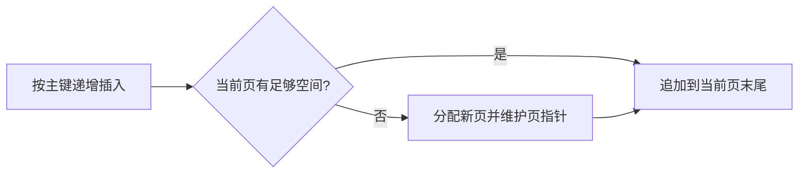
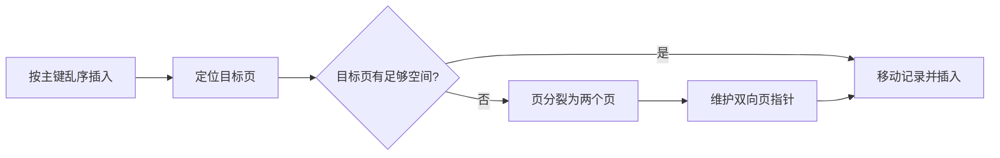
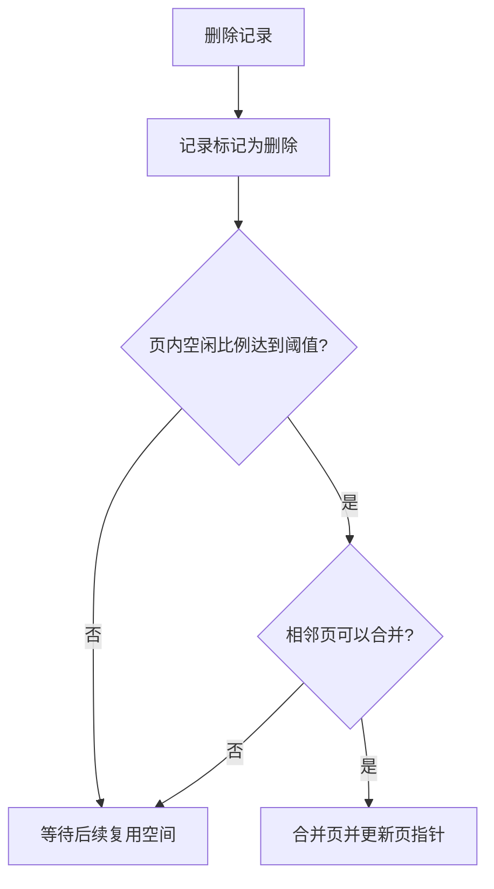

# SQL优化

> 本章将索引知识应用到插入、排序、分组、分页、统计和更新等常见场景。


## 1.插入数据

### 1.1 普通插入

1. 采用批量插入（一次插入的数据不建议超过1000条）

2. 手动提交事务

3. 主键顺序插入

### 1.2 大批量插入

如果一次性需要插入大批量数据，使用insert语句插入性能较低，此时可以使用MySQL数据库提供的load指令插入

```PowerShell
# 客户端连接服务端时，加上参数 --local-infile（这一行在bash/cmd界面输入）
mysql --local-infile -u root -p
# 设置全局参数local_infile为1，开启从本地加载文件导入数据的开关
set global local_infile = 1;
select @@local_infile;
# 执行load指令将准备好的数据，加载到表结构中
load data local infile '/root/sql1.log' into table tb_user fields terminated by ',' lines terminated by '\n';
```

- 在Windows的cmd命令行中进行load导入数据时，`/root/sql1.log`路径应使用绝对路径，格式为`C:\\path\\to\\file.log`（注意转义反斜杠）或 `C:/path/to/file.log`（使用正斜杠），而且需要根据不同文件的默认换行符使用合适的换行符替换`\n`

## 2.主键优化

数据组织方式：在InnoDB存储引擎中，**表数据都是根据主键顺序组织存放**的，这种存储方式的表称为索引组织表（Index organized table, IOT）

### 2.1 页分裂

页可以为空，也可以填充一半，也可以填充100%，每个页包含了2-N行数据（如果一行数据过大，会行溢出），根据主键排列

#### 2.1.1 主键顺序插入

当主键是顺序递增时，InnoDB会将新记录插入到当前页的末尾。如果当前页已满或剩余空间不足以插入这条记录，则分配一个新页并维护一个双向指针建立两个页的联系，然后继续插入，依次类推，直到插入完毕

按照顺序插入1,2,3,4,5,6,7,8,9,10,11,12,13,14



#### 2.1.2 主键乱序插入

当主键无序时，InnoDB需要找到合适的插入位置进行插入。如果目标页已满或剩余空间不足以插入这条记录，会触发页分裂，即从当前页中间处分裂成两个子页并维护双向指针建立页之间的联系，然后继续插入，依次类推，直到插入完毕

插入50


#### 2.1.3 应插入位置不在页末尾的情况

若插入点位于页中间且页内有空间，InnoDB会执行以下操作：

- 页内空间充足：移动页内现有记录，为新记录腾出空间

- 页内空间不足：触发页分裂

### 2.2 页合并

当删除一行记录时，实际上记录并没有被物理删除，只是记录被标记（flagged）为删除并且它的空间变得允许被其他记录重新使用。当页中删除的记录到达 MERGE_THRESHOLD（默认为页的50%），InnoDB会开始寻找最靠近的页（前后）看看是否可以将这两个页合并（将要合并的页合并到被删除元素的页中）以优化空间使用。

MERGE_THRESHOLD：合并页的阈值，可以自己设置，在创建表或创建索引时指定



### 2.3 主键设计原则

- 满足业务需求的情况下，尽量降低主键的长度

- 插入数据时，尽量选择顺序插入，选择使用 AUTO_INCREMENT 自增主键

- 尽量不要使用 UUID 做主键或者是其他的自然主键，如身份证号

- 业务操作时，避免对主键的修改

## 3.order by优化

1. Using filesort：通过表的索引或全表扫描，读取满足条件的数据行，然后在排序缓冲区 sort buffer 中完成排序操作，所有不是通过索引直接返回排序结果的排序都叫 FileSort 排序

2. Using index：通过有序索引顺序扫描直接返回有序数据，这种情况即为 using index，不需要额外排序，操作效率高

这里有几个前提要说清楚：能用索引排序的条件不止"方向一致"，还要排序字段的组合满足最左前缀、并且与索引的列顺序对得上。另外 MySQL 5.7 的索引都是按升序存储的，"全部降序"实际是反向扫描索引，同样能走索引；MySQL 8.0 起才支持建真正的降序索引。所以准确的说法是：排序字段与索引顺序一致、方向统一时通常能走索引；方向混合时，只有建了对应方向的降序索引才能直接用索引排序。比如要优化 `order by age asc, phone desc`，就需要另建一个方向混合的索引，如：`create index idx_user_age_phone_ad on tb_user(age asc, phone desc);`，此时 `select id, age, phone from tb_user order by age asc, phone desc;` 才能全部走索引

对于语句`explain select id,age,phone from tb_user order by phone,age;`Using filesort和Using index都会出现，原因是底层会先排序phone字段，由于缺少age，不满足最左前缀法则，不会使用idx_user_age_phone索引，出现Using filesort，然后排序age字段，满足最左前缀法则，使用索引idx_user_age_phone，出现Using index

总结：

- 根据排序字段建立合适的索引，多字段排序时，也遵循最左前缀法则

- 尽量使用覆盖索引

- 多字段排序，一个升序一个降序，此时需要注意联合索引在创建时的规则（ASC/DESC）

- 如果不可避免出现filesort，大数据量排序时，可以适当增大排序缓冲区大小 sort_buffer_size（默认256k）

## 4.group by优化

- 在分组操作时，可以通过索引来提高效率

- 分组操作时，索引的使用也是满足最左前缀法则的

如索引为`idx_user_pro_age_stat`，则句式可以是`select ... where profession='软件工程' group by age`，这样也符合最左前缀法则

## 5.limit优化

常见的问题如`limit 2000000, 10`，此时需要 MySQL 排序前2000010条记录，但仅仅返回2000000 - 2000010的记录，其他记录丢弃，查询排序的代价非常大。

> **疑问**：这里明明没有使用order by，为什么要先排序前2000010条记录？
>
> **MySQL并不能保证数据插入顺序和读取顺序一致。**因为必须存在一个聚集索引，所以数据在插入时实际是按照主键顺序插入到B+树（索引底层结构就是一个树）中，所以实际存储是按照主键顺序存储的，但是插入时主键不一定有序，例如插入1、3、5、4、2，但`select * from table`却是1、2、3、4、5，因此`select * from table limit 2000000, 10`本质上是`select * from table order by id limit 2000000, 10`，所以这里需要先排序再返回。
>
>

优化方案：一般分页查询时，通过创建覆盖索引能够比较好地提高性能，可以通过覆盖索引加子查询形式进行优化

```SQL
-- 此语句耗时很长
select * from tb_sku limit 9000000, 10;
-- 通过覆盖索引加快速度，直接通过主键索引进行排序及查询
select id from tb_sku order by id limit 9000000, 10;
-- 下面的语句是错误的，因为 MySQL 不支持 in 里面使用 limit
-- select * from tb_sku where id in (select id from tb_sku order by id limit 9000000, 10);
-- 通过连表查询即可实现第一句的效果，并且能达到第二句的速度
select * from tb_sku as s, (select id from tb_sku order by id limit 9000000, 10) as a where s.id = a.id;
```

## 6.count优化

MyISAM 引擎把一个表的总行数存在了磁盘上，因此执行 `count(*)` 的时候会直接返回这个数，效率很高（前提是不适用where）

InnoDB 在执行 count(\*) 时，需要把数据一行一行地从引擎里面读出来，然后累计计数。

优化方案：自己计数，如创建key-value表存储在内存或硬盘，或者使用redis。

### 6.1 count的几种用法

- 如果count函数的参数（count里面写的那个字段）不是NULL（字段值不为NULL），累计值就加一，最后返回累计值

- 用法：count(\*)、count(主键)、count(字段)、count(1)

    - `count(主键)`跟`count(*)`一样，因为主键不能为空

    - count(字段)只计算字段值不为NULL的行

    - count(1)引擎会为每行添加一个1，然后就count这个1，返回结果也跟`count(*)`一样，也可用其他非0数字代替1

    - count(null)返回0

### 6.2 各种用法的性能

- `count(主键)`：InnoDB引擎会遍历整张表，把每行的主键id值都取出来，返回给服务层，服务层拿到主键后，直接按行进行累加（主键不可能为空）

- `count(字段)`：没有not null约束的话，InnoDB引擎会遍历整张表把每一行的字段值都取出来，返回给服务层，服务层判断是否为null，不为null，计数累加；有not null约束的话，InnoDB引擎会遍历整张表把每一行的字段值都取出来，返回给服务层，直接按行进行累加

- `count(1)`：InnoDB 引擎遍历整张表，但不取值。服务层对于返回的每一层，放一个数字 1 进去，直接按行进行累加

- `count(*)`：InnoDB 引擎并不会把全部字段取出来，而是专门做了优化，不取值，服务层直接按行进行累加

**按效率排序**：`count(字段)` < `count(主键)` ≈ `count(1)` ≈ `count(*)`

只有"字段可为 NULL 的 `count(字段)`"明显更慢，因为它必须把每行的值取出来判断是否为 NULL。在 MySQL 8.0 里，`count(主键)`、`count(1)`、`count(*)` 都被优化成按行累加，实测差距可以忽略。所以结论是优先用 `count(*)`：它语义最清晰，而且被专门优化过；不要为了让语句"更快"把 `count(*)` 改写成 `count(1)`，这个替换的收益可以忽略。

## 7.update优化（避免锁住过多记录）

InnoDB 的行锁是针对**索引记录或索引范围**加的锁。索引失效后，语句可能扫描并锁住大量记录和间隙，但不会自动升级为真正的表锁。

如以下两条语句：

1. `update student set no = '123' where id = 1;`，这句由于id有主键索引，所以只会锁这一行

2. `update student set no = '123' where name = 'test';`，这句由于name没有索引，可能扫描并锁住大量记录，解决方法是给name字段添加合适的索引
## 小练习

找出一条分页查询的低效写法，使用合适的索引或覆盖查询改写，并用 `EXPLAIN` 验证。
