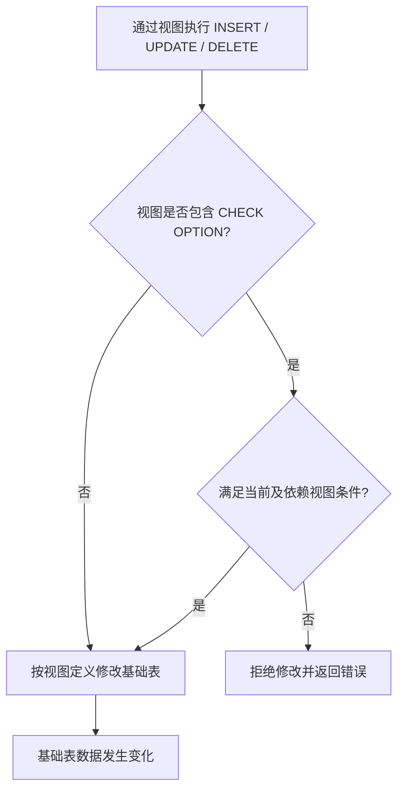

# 视图、存储过程、触发器

> 本章先从整体上认识三类数据库对象，理解它们分别解决什么问题。

存储过程的完整内容见 [09-存储过程](09-存储过程.md)，本篇只做要点梳理。


## 1.视图

视图(View)是一种虚拟存在的表。视图中的数据并不在数据库中实际存在，行和列数据来自定义视图的查询中使用的表，并且是在使用视图时动态生成的。

通俗的讲，视图只保存了查询的SQL逻辑，不保存查询结果。所以我们在创建视图的时候，主要的工作就落在创建这条SQL查询语句上。

### 1.1 语法

> 下列代码是语法模板，方括号表示可选部分，竖线表示多选一；实际执行时请替换为具体的视图名、列名和查询语句。

创建视图

```SQL
CREATE [OR REPLACE] VIEW 视图名称(列名列表) AS SELECT 语句 [WITH [CASCADED | LOCAL] CHECK OPTION];
```

查看创建视图语句

```SQL
SHOW CREATE VIEW 视图名称;
```

查看视图数据

```SQL
SELECT * FROM 视图名称;
```

查看数据库中所有视图

```SQL
SHOW FULL TABLES IN 数据库名 WHERE Table_type = 'VIEW';
```

修改视图

```SQL
CREATE [OR REPLACE] VIEW 视图名称(列名列表) AS SELECT语句 [WITH [CASCADED|LOCAL] CHECK OPTION];  或
ALTER VIEW 视图名称(列名列表) AS SELECT语句 [WITH [CASCADED|LOCAL] CHECK OPTION];
```

删除视图

```SQL
DROP VIEW [IF EXISTS] 视图名称[,视图名称];
```

### 1.2 检查选项

当使用WITH CHECK OPTION子句创建视图时，MySQL会通过视图检查正在更改的每一行，例如插入、更新、删除，以使其符合视图的定义。MySQL允许基于另一个视图创建视图，它还会检查依赖视图中的规则以保持一致性。

视图的插入、删除、更新语句和基本表的语句一致，当执行增删改操作时，实际改变的是基本表中的数据，但是不建议通过视图更改基本表。

为了确定检查的范围，mysql 提供了两个选项:CASCADED 和 LOCAL，默认值为CASCADED

**cascaded：在对视图进行更删改操作时，会核查该视图及所有直接或间接依赖的视图创建语句中的条件，只有当所有条件**都满足才能够操作成功，例如：

- `create view v1 as select id,name from student where id<=20;`因为没有指定WITH CHECK OPTION子句，插入时不会核查条件id\<=20，直接插入成功

- `create view v2 as select id,name from v1 where id>10 with cascaded check option;`插入时会核查v2中的条件id\>10和v1中的条件id\<=20，只有全部满足时才会插入成功，相当于给v1添加了with cascaded check option子句

- `create view v3 as select id,name from v2 where id<=15;`由于v3没有指定WITH CHECK OPTION子句，不会核查条件id\<=15，但是由于v2指定了with cascaded check option子句，所以会核查v2的条件id\>10和v1的条件id\<=20;

**local：在对视图进行更删改操作时，会核查该视图及所有直接或间接依赖的且使用WITH CHECK OPTION子句的视图创建语句中的条件，只有当所有条件**都满足才能够操作成功，例如：

- `create view v4 as select id,name from student where id<=20;`因为没有指定WITH CHECK OPTION子句，插入时不会核查条件id\<=20，直接插入成功

- `create view v5 as select id,name from v4 where id>10 with local check option;`插入时会核查v5中的条件id\>10，因为v4中没有使用WITH CHECK OPTION子句，所以不会核查v4中的条件id\<=20，也就是说，不会给v4添加with local check option子句

- `create view v6 as select id,name from v5 where id<=15;`因为没有指定WITH CHECK OPTION子句，插入时不会核查条件id\<=15，由于v5使用了with local check option子句，所以会核查v5中的条件id\>10，又因为v4中没有使用WITH CHECK OPTION子句，所以不会核查v4中的条件id\<=20，也就是说，仅仅核查有with local check option子句的视图中的条件



### 1.3 更新及作用

要使视图可更新，视图中的行与基础表中的行之间**必须存在一对一的关系**，即视图中的每一行必须直接对应基础表中的**唯一一行**，不能有多行映射到视图中的同一行，也不能有视图中的一行映射到基础表中的多行

如果视图包含以下任何一项，则该视图不可更新或插入：

1. 聚合函数或窗口函数SUM()、MIN()、MAX()、COUNT()等

2. DISTINCT

3. GROUP BY

4. HAVING

5. UNION 或者 UNION ALL

### 1.4 视图的作用

- **简单**
视图不仅可以简化用户对数据的理解，也可以简化他们的操作。那些被经常使用的查询可以被定义为视图，从而使得用户不必为以后的操作每次指定全部的条件。

- **安全**
数据库可以授权，但不能授权到数据库特定行和特定的列上。通过视图用户只能查询和修改他们所能见到的数据。

- **数据独立**
视图可帮助用户屏蔽真实表结构变化带来的影响。
## 2.存储过程要点

存储过程的完整讲解（基本语法、变量、流程控制、游标、条件处理程序、存储函数）见 [09-存储过程](09-存储过程.md)，这里只保留结论性要点：

- 存储过程是事先编译并存储在数据库中的一段 SQL 语句集合，用 `CREATE PROCEDURE` 创建、用 `CALL` 调用，作用是封装可复用的逻辑并减少应用与数据库之间的网络交互

- 参数分 IN（输入，默认）、OUT（输出）、INOUT（输入输出）三种；存储函数只能使用 IN 参数，并且必须有返回值

- 过程体内部可以声明局部变量（`DECLARE`），并使用 `IF`、`CASE`、`WHILE`、`REPEAT`、`LOOP` 等流程控制语句

- 需要逐行处理结果集时使用游标（`DECLARE ... CURSOR`、`OPEN`、`FETCH`、`CLOSE`）；游标取不到数据时状态码为 `02000`，通常用 `DECLARE ... HANDLER FOR NOT FOUND` 退出循环

- 在命令行中创建存储过程需要先用 `DELIMITER` 临时更换语句结束符，否则过程体内的分号会提前结束整条语句

- 代价也要一并考虑：逻辑集中在数据库侧后，版本管理、调试和迁移都比应用代码更困难

## 小练习

用一句话分别说明视图、存储过程和触发器的用途，并为每类对象写出一个适用场景。
