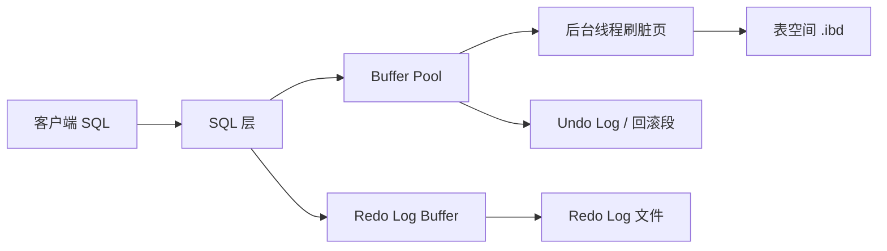
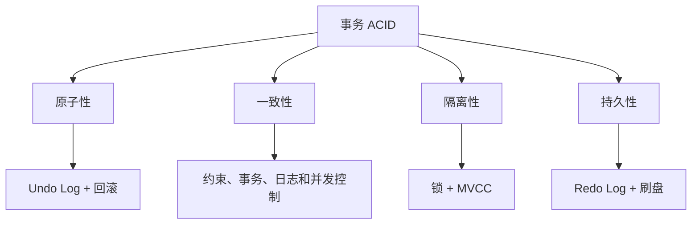
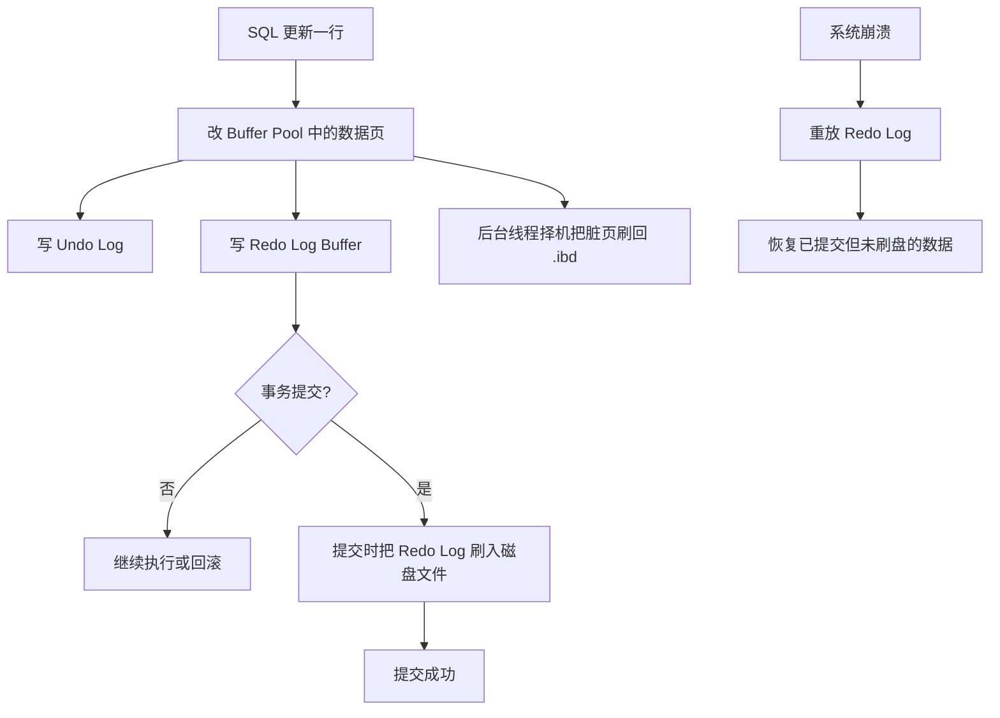
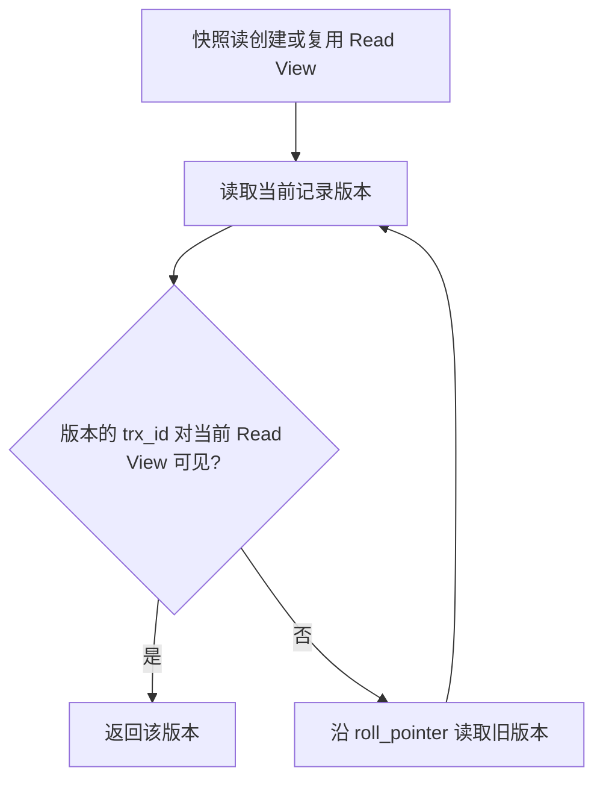
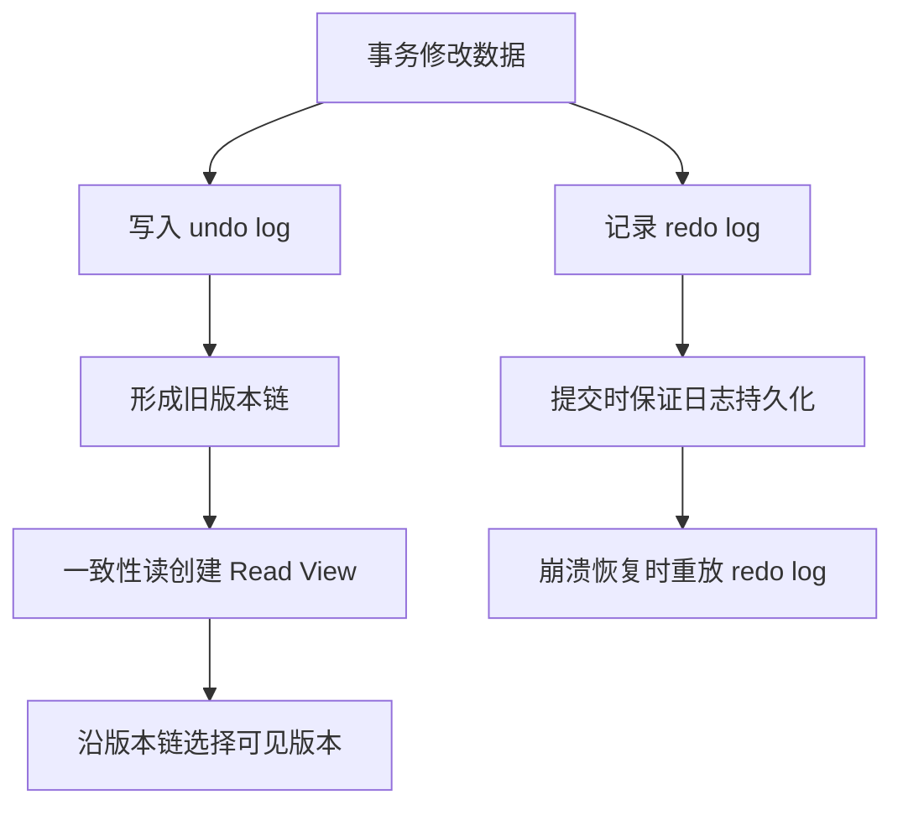

# InnoDB引擎

> 本章把 InnoDB 的存储结构、日志和 MVCC 串联起来，建立底层工作原理的整体图景。


## 1.逻辑存储结构
**表空间（ibd文件）**：一个mysql实例可以对应多个表空间，用于存储记录、索引等数据。

**段**：分为数据段（Leaf node segment）、索引段（Non-leaf node segment）、回滚段（Rollback segment），InnoDB 是索引组织表，数据段就是B+树的叶子节点， 索引段即为B+树的非叶子节点。段用来管理多个Extent（区）。

**区**：表空间的单元结构，每个区的大小为1M。 默认情况下， InnoDB存储引擎页大小为16K， 即一个区中一共有64个连续的页。

**页**：是InnoDB 存储引擎磁盘管理的最小单元，每个页的大小默认为 16KB。为了保证页的连续性，InnoDB 存储引擎每次从磁盘申请 4-5 个区。

**行**：InnoDB 存储引擎数据是按行进行存放的。

- `Trx_id`：每次对某条记录进行改动时，都会把对应的事务id赋值给trx_id隐藏列。

- `Roll_pointer`：每次对某条引记录进行改动时，都会把旧的版本写入到undo日志中，然后这个隐藏列就相当于一个指针，可以通过它来找到该记录修改前的信息。

## 2.架构

MySQL 5.5 版本开始，默认使用InnoDB存储引擎，它擅长事务处理，具有崩溃恢复特性，在日常开发中使用非常广泛。下面是InnoDB架构图，左侧为内存结构，右侧为磁盘结构：



Buffer Pool 缓存数据页和索引页；Redo Log 先保证已提交修改可恢复；Undo Log 支持回滚和 MVCC 旧版本读取。
### 2.1 内存架构

内存结构由几个缓冲区和链表组成，它们共同的目标是减少磁盘 IO：能命中内存的操作就不读盘，写操作先在内存完成、攒批之后再落盘。

| 内存组件 | 关键参数 | 缓存的内容 | 作用 |
| --- | --- | --- | --- |
| Buffer Pool（缓冲池） | `innodb_buffer_pool_size` | 数据页、索引页、undo 页等 | 把热点页留在内存，读写先经过内存，减少磁盘 IO |
| Change Buffer（写缓冲） | `innodb_change_buffer_max_size` | 对非唯一二级索引的写操作 | 把随机写延后并合并，避免为了写一行而读入整个索引页 |
| Adaptive Hash Index（自适应哈希索引） | `innodb_adaptive_hash_index` | 热点等值查询的哈希索引 | 由 InnoDB 自动建立，把 B+Tree 查找降为一次哈希查找 |
| Log Buffer（日志缓冲） | `innodb_log_buffer_size` | 待写入 redo log 的日志记录 | 攒批后一次写入 redo log 文件，减少频繁落盘 |

- `innodb_adaptive_hash_index`：控制是否启用自适应哈希索引，ON表示开启，OFF表示关闭，默认值是ON；具体操作参考系统变量。

#### 2.1.1 Buffer Pool（缓冲池）

Buffer Pool 是 InnoDB 在内存中开辟的缓冲池，也是整个内存结构的核心。磁盘上的数据页和索引页被访问时，会先按页（默认 16KB）复制到 Buffer Pool，之后的读和写都在这份内存副本上进行；它相当于磁盘页在内存中的副本，一个页在磁盘上有唯一位置，在缓冲池里也有唯一的缓存项。

| 参数 | 默认值 | 说明 |
| --- | --- | --- |
| `innodb_buffer_pool_size` | 128MB | 缓冲池大小，通常是 InnoDB 最该优先调大的参数，生产环境一般设为物理内存的 50%~70% |
| `innodb_buffer_pool_instances` | 1 | 把缓冲池切成多个实例，各自有独立的锁和 LRU 链表，减少并发竞争（缓冲池较大时才有意义） |
| `innodb_old_blocks_time` | 1000（毫秒） | 页进入冷端后至少停留多久，之后再次被访问才能升入热端 |
| `innodb_page_size` | 16KB | 页大小，在初始化数据库时确定，之后不能更改 |

内部的 LRU 链表与冷热分区：Buffer Pool 用一条改良的 LRU 链表管理缓存页，链表被切成两段：

- young 区（热端，约占 5/8）：最近被频繁访问的页。
- old 区（冷端，约占 3/8）：新读入的页先放在两段交界处（midpoint），而不是直接放到链表头部。

一个页刚被读入时先落在 old 区头部，只有在 old 区停留超过 `innodb_old_blocks_time` 之后再次被访问，才会被移动到 young 区头部。这样设计的目的是防止预读和全表扫描污染缓存：一次扫描会读入大量页，但它们很快被淘汰，不会把真正的热点页挤出缓冲池。

为什么能减少磁盘 IO：

- 命中 Buffer Pool 的读操作完全不需要访问磁盘。内存访问是纳秒级，磁盘随机 IO 是毫秒级，相差几个数量级。
- 写操作先在 Buffer Pool 中修改页，并把该页标记为脏页（与磁盘不一致），由后台线程择机批量刷回磁盘，把多次随机的页写合并成更接近顺序的写。
#### 2.1.2 Change Buffer（写缓冲）

Change Buffer 缓存的是对非唯一二级索引的写操作（insert、delete-mark、update）。

- 触发场景：要修改一条记录的非唯一二级索引，而对应的索引页并不在 Buffer Pool 中。此时 InnoDB 不立刻把该索引页从磁盘读进内存，而是把"这个页需要做这样一次修改"记录到 Change Buffer。
- 合并时机：等该索引页因为其他读写被读入 Buffer Pool 时，Change Buffer 中针对这个页的记录会一并合并（merge）到页上；除此之外，后台 Master Thread 会定期合并，系统正常关闭或崩溃恢复时也会把剩余记录全部合并。
- 只对非唯一二级索引生效的原因：唯一索引必须把页读进来才能判断唯一性，判断没法推迟；聚簇索引按主键顺序插入，页通常已经在内存里，也不需要缓冲。所以 Change Buffer 主要让"写多读少、且带较多非唯一二级索引"的场景受益。
- 相关参数：`innodb_change_buffer_max_size` 控制 Change Buffer 最多占 Buffer Pool 的百分比（默认 25），`innodb_change_buffering` 控制对哪些操作启用缓冲。
- 注意：MySQL 5.5 之前只有 Insert Buffer，只缓冲 insert 操作；8.0 的 Change Buffer 是它的扩展。Change Buffer 是会持久化的，内容记录在系统表空间中，并不只是内存里的一份数据。

#### 2.1.3 Adaptive Hash Index（自适应哈希索引）

自适应哈希索引是 InnoDB 根据实际访问模式自动建立的哈希索引，用来加速热点等值查询。

- 自动建立：InnoDB 会统计索引页的访问模式，当同一个等值查询模式反复出现并达到一定次数后，就为这个页在 Buffer Pool 中建立哈希索引项，把原本要沿 B+Tree 自上而下比较多次的查找变成一次哈希定位。
- 用户无法手动控制：不能指定为哪张表、哪个索引或哪条 SQL 建立哈希索引，也看不到它的具体条目；只能通过 `innodb_adaptive_hash_index`（默认 ON）整体开关，或用 `innodb_adaptive_hash_index_parts` 调整分区数。
- 适用与代价：只对等值查询（`=`、`IN`）有效，范围查询、排序等用不上；哈希索引会占用 Buffer Pool 空间，并且每次修改页都要维护哈希项，在写入并发很高或访问模式不适合哈希的场景下可能反而拖慢性能，必要时可以临时关闭对比效果。

#### 2.1.4 Log Buffer（日志缓冲）

Log Buffer 是 redo log 在内存中的缓冲区：事务执行过程中产生的 redo 记录先写入 Log Buffer，再由 Log Buffer 按策略刷入磁盘上的 redo log 文件。

| 参数 | 默认值 | 说明 |
| --- | --- | --- |
| `innodb_log_buffer_size` | 16MB | Log Buffer 大小；大事务、批量写入频繁刷盘时可以调大 |
| `innodb_flush_log_at_trx_commit` | 1 | 决定事务提交时如何把 Log Buffer 刷入 redo log 文件并 fsync |

何时刷入 redo log 文件：

1. 事务提交时：`innodb_flush_log_at_trx_commit=1` 时每次提交都写入文件并 fsync，这是默认值，也是"已提交事务不丢"的前提。
2. Log Buffer 使用超过约 1/2 时：先把日志写入文件，为后续日志腾出空间。
3. 后台线程每秒一次定时刷盘：兜底的节奏，即使没有事务提交也会把日志刷出去。
4. redo log 做 checkpoint 或切换日志文件时：配合 checkpoint 机制推进。

| `innodb_flush_log_at_trx_commit` 取值 | 提交时的行为 | 崩溃时可能丢失 |
| --- | --- | --- |
| 0 | 不刷盘，只等后台线程每秒刷一次 | 最多最近 1 秒已提交事务 |
| 1（默认） | 每次提交都写入文件并 fsync | 不丢已提交事务 |
| 2 | 每次提交写入文件，每秒 fsync 一次 | MySQL 进程崩溃不丢；操作系统崩溃或断电可能丢最近 1 秒 |

### 2.2 磁盘结构

InnoDB 的数据最终都落在表空间里。表空间可以理解为"存放页的容器"，一个表空间由一个或多个磁盘文件组成，页按区（1MB，64 个页）为单位分配。

| 表空间类型 | 磁盘文件 | 关键参数 | 主要存放内容 |
| --- | --- | --- | --- |
| 系统表空间 System Tablespace | `ibdata1`（可以配置成多个文件） | `innodb_data_file_path` | 数据字典、Change Buffer、未独立时的双写缓冲、系统表 |
| 独立表空间 File-Per-Table | 每张表一个 `.ibd` | `innodb_file_per_table` | 单表的数据和索引，可随表单独回收空间 |
| 通用表空间 General Tablespace | 自定义 `.ibd` | 建表时 `TABLESPACE 名称` | 多张表共用一个文件，便于按业务组织、控制文件数量 |
| Undo 表空间 | `undo_001`、`undo_002` | `innodb_undo_tablespaces` 等 | undo log，用于事务回滚和 MVCC 读取旧版本 |
| 临时表空间 | `ibtmp1` 与各会话临时表空间 | `innodb_temp_data_file_path` | 临时表、排序等中间结果，重启后重建 |
| 双写缓冲文件 Doublewrite | `#ib_16384_0.dblwr` 等 | `innodb_doublewrite` | 脏页刷盘前的副本，用于崩溃后修复写坏的页 |

#### 2.2.1 系统表空间与独立表空间

系统表空间是 InnoDB 最基础的表空间，由 `ibdata1` 等文件组成，用来存放数据字典、Change Buffer、系统自带表的数据等内容，初始化数据库时创建，一般不要手工删除或改名。

- `innodb_data_file_path`：用于定义InnoDB的系统表空间（System Tablespace）的文件路径、大小和属性。
- `innodb_file_per_table`：控制InnoDB是否为每个表创建独立的表空间文件，ON表示每个表都有自己的表空间文件，OFF表示所有表的数据和索引存储在系统表空间中，默认值是ON。

`innodb_file_per_table` 的作用不只是决定"数据放在哪里"：开启时每张表有独立的 `.ibd` 文件，`DROP TABLE`、`TRUNCATE TABLE` 会把文件真正删除、把空间还给操作系统，表碎片也更容易整理；关闭时所有表混在系统表空间里，删表只释放内部空间，文件本身不会变小。

#### 2.2.2 通用表空间

通用表空间：将多个表的数据存储在一个共享的文件中，方便管理和维护。

创建通用表空间文件

```SQL
CREATE TABLESPACE tablespace_name
ADD DATAFILE 'file_name.ibd'
[FILE_BLOCK_SIZE = value]
[ENGINE [=] InnoDB];

tablespace_name：通用表空间的名称
file_name.ibd：表空间文件的路径和名称，要确保指定的文件路径是MySQL可访问的，并且有足够的权限
FILE_BLOCK_SIZE：可选参数，指定表空间的文件块大小（通常与表的页大小一致），必须与表的页大小一致（例如16K）
ENGINE：指定存储引擎，默认为 InnoDB。
```

创建表时指定表空间

```SQL
CREATE TABLE ...[TABLESPACE tablespace_name];

tablespace_name：指定表存储的通用表空间名称
```

将现有表移动到通用表空间

```SQL
ALTER TABLE table_name TABLESPACE tablespace_name;
```

删除通用表空间

```SQL
DROP TABLESPACE tablespace_name;
```
#### 2.2.3 Undo 表空间

undo log 存放在 Undo 表空间里，从 MySQL 8.0 起默认有两个 Undo 表空间（`undo_001`、`undo_002`），支持在线增减（`innodb_undo_tablespaces`、`CREATE UNDO TABLESPACE`）。

- undo log 是逻辑日志，记录的是"如何把这条记录改回去"。事务提交后，如果还有一致性读（快照读）需要读取旧版本，对应的 undo 就不能立刻回收，要等 Purge Thread 判断没有依赖之后再清理。
- 长事务会让 undo 一直无法回收，Undo 表空间持续膨胀甚至写满，进而影响写入。排查问题时，这类文件的空间占用和长事务要一起看。

#### 2.2.4 临时表空间

临时表空间用来存放临时表，以及排序、分组等操作的中间结果，包括全局的 `ibtmp1` 和每个会话自己的临时表空间。它只在实例运行期间有效，重启后会重建，所以不需要备份。

#### 2.2.5 双写缓冲（Doublewrite Buffer）

双写缓冲解决的是"页写到一半断电"的问题。

为什么需要它：InnoDB 的页是 16KB，而磁盘或操作系统的一次写入单位（扇区）通常是 512B 或 4KB，一个页的写入并不是原子操作。如果刷脏页写到一半发生断电，磁盘上这个页可能一半是新内容、一半是旧内容，成为损坏的页（部分写、页撕裂）。而 redo log 记录的是页内偏移的物理修改，重放的前提是页本身完整，坏页没法只靠 redo log 修回来。

工作方式：

1. 刷脏页时，先把页顺序写入双写缓冲（一块连续区域；MySQL 8.0.20 起是独立的 `.dblwr` 文件，更早版本放在系统表空间里）。
2. 双写缓冲落盘成功后，再把页写到它在表空间中的真实位置。
3. 崩溃恢复时，如果发现某个页损坏，就从双写缓冲里取出完好的副本恢复该页，然后再按 redo log 重放已提交的修改。

代价与取舍：同一个页要写两次，相当于用约两倍的写放大换取页的可靠性。参数 `innodb_doublewrite` 可以关闭，但除非文件系统或存储设备本身能保证页的原子写（例如支持原子写的 SSD），否则不建议关闭。

### 2.3 后台线程

InnoDB 是多线程模型，后台有多个不同的线程负责处理不同的任务，主要包括四类：

|线程|数量相关参数|职责|
|---|---|---|
|Master Thread|内部固定|核心后台线程，负责缓冲池数据的异步刷盘，包括脏页刷新、合并插入缓冲、回收 Undo 页等，按每秒和每十秒的节奏调度执行|
|IO Thread|`innodb_read_io_threads`、`innodb_write_io_threads`|负责异步 IO 请求的回调处理，分为读线程、写线程、插入缓冲线程和日志线程四类|
|Purge Thread|`innodb_purge_threads`|回收已经提交事务不再需要的 Undo 页|
|Page Cleaner Thread|`innodb_page_cleaners`|将脏页的刷新操作从 Master Thread 中拆分出来，减轻 Master Thread 的压力|

- **Master Thread**：InnoDB 最核心的后台线程，主要负责将缓冲池中的数据异步刷新到磁盘，保证数据的一致性，包括脏页的刷新、合并插入缓冲、回收 Undo 页等。它内部的循环分为主循环、后台循环、刷新循环和暂停循环，主循环中又以每秒、每十秒为单位调度不同的任务

- **IO Thread**：在 InnoDB 1.0.x 之前只有一个 IO Thread，负责所有异步 IO 请求的处理；从 1.0.x 开始使用多个 IO Thread，分为 write、read、insert buffer、log 四类。读线程与插入缓冲线程的数量由 `innodb_read_io_threads` 控制，写线程与日志线程的数量由 `innodb_write_io_threads` 控制：

```properties
innodb_read_io_threads=4
innodb_write_io_threads=4
```

- **Purge Thread**：事务提交后，其对应的 undo log 可能不再需要，Purge Thread 负责回收这些已经使用并分配的 Undo 页。在 InnoDB 1.1 之前，Undo 页的回收由 Master Thread 完成；从 InnoDB 1.2 开始可以单独由 Purge Thread 执行。参数 `innodb_purge_threads` 控制其数量，MySQL 8.0 中默认值为 4：

```properties
innodb_purge_threads=4
```

- **Page Cleaner Thread**：InnoDB 1.2.x 引入，作用是把之前 Master Thread 中脏页刷新的操作放到单独的线程中完成，从而减轻 Master Thread 的工作，提高刷新效率和整体性能

可以查看 InnoDB 的运行状态，其中包含各线程与 IO 的信息：

```sql
show engine innodb status\G
```

## 3.事务原理

特性原理分类图：


- 原子性主要依靠 Undo Log 和事务回滚，持久性主要依靠 Redo Log，隔离性依靠锁和 MVCC；一致性由约束、事务、日志和并发控制共同保证

更准确地说，`redo log` 主要服务于崩溃恢复和持久性，`undo log` 主要服务于事务回滚和 MVCC 的旧版本读取；一致性是事务、约束、日志和并发控制共同作用的结果。不要把 redo log 理解成“回滚日志”。

### 3.1 redo log

重做日志，记录的是事务提交时数据页的物理修改，是用来实现事务的**持久性**。

该日志文件由两部分组成:重做日志缓冲(redo log buffer)以及重做日志文件(redo log file)，前者是在内存中，后者在磁盘中。当事务提交之后会把所有修改信息都存到该日志文件中,用于在刷新脏页到磁盘,发生错误时,进行数据恢复使用。

Buffer Pool在产生脏页数据的时候，会先将数据存储到 redo log buffer，再按日志持久化策略写入 redo log。系统异常（比如突然断电）后，InnoDB 可以通过 redo log 重做已经提交但尚未刷入表空间的数据变更；事务回滚主要依赖 undo log。过程如下图：
当用户执行UPDATE或DELETE操作时，数据页会被加载到内存的Buffer Pool中进行修改，同时生成Redo Log记录并暂存于Redo Log Buffer中。事务提交时，Redo Log Buffer中的日志会先写入磁盘的Redo Log文件（ib_logfile0/1），确保事务的持久性，而数据页的修改则通过后台线程异步刷入磁盘的表空间文件（.ibd）。这种WAL机制保证了即使系统崩溃，也能通过Redo Log恢复未刷盘的数据变更，从而确保数据的一致性和持久性。



上面的顺序可以概括成一句：一次更新先改内存中的页，同时把"怎么改"记进 undo log 和 redo log buffer；提交时先把 redo log 落盘保证可恢复，脏页本身则交给后台线程择机刷回磁盘。


问题：数据为什么要通过redolog写入ibd表空间文件，而不是直接从Buffer Pool直接刷新到磁盘ibd文件？

答：Buffer Pool 刷盘是**随机写**：数据页在磁盘上的位置是分散的、随机的，每次刷盘都需要寻址，性能较低。Redo Log 是**顺序写**：每次写入都是追加到日志文件的末尾，性能非常高。

### 3.2 undo log

回滚日志，用于记录数据被修改前的信息，作用包含：提供回滚 和 MVCC(多版本并发控制)。

undo log 和 redo log 记录物理日志不一样，它是逻辑日志。可以认为当 delete 一条记录时，undo log中会记录一条对应的insert记录，反之亦然，当 update 一条记录时，它记录一条对应相反的 update 记录。当执行 rollback 时，就可以从 undo log 中的逻辑记录读取到相应的内容并进行回滚。

- Undo log 销毁：undo log 在事务执行时产生，事务提交时并不会立即删除 undo log，因为这些日志可能还用于 MVCC

- Undo log 存储：undo log 采用段的方式进行管理和记录，存放在前面介绍的 rollback segment 回滚段中，内部包含1024个 undo log segment

### 3.3 MVCC

#### 3.3.1 基本概念

**当前读**：读取的是记录的最新版本，读取时还要保证其他并发事务不能修改当前记录，会对读取的记录进行加锁。对于我们日常的操作，如:select…lock in share mode(共享锁)，select… for update、update、insert、delete(排他锁)都是一种当前读

**快照读**：简单的select(不加锁)就是快照读，快照读，读取的是记录数据的可见版本，有可能是历史数据，不加锁，是非阻塞读

- Read committed：每次select，都生成一个快照读

- Repeatable Read：开启事务后第一个select语句才是快照读的地方

- Serializable：快照读会退化为当前读

**MVCC**：全称 Multi-Version Concurrency Control，多版本并发控制。指维护一个数据的多个版本，使得读写操作没有冲突，快照读为MySQL实现MVCC提供了一个非阻塞读功能。MVCC的具体实现，还需要依赖于数据库记录中的三个隐式字段、undo log日志、read View

#### 3.3.2 记录中的隐藏字段

每一张创建的表都有两个或三个隐藏字段：DB_TRX_ID、DB_ROLL_PTR、DB_ROW_ID（表没有主键时存在）
#### 3.3.3 undo log

回滚日志，在insert、update、delete的时候产生的便于数据回滚的日志。

当 insert 的时候，产生的 undo log 主要在回滚时需要，在事务提交且没有其他一致性读依赖后才可回收。

当update、delete的时候，产生的undo log日志不仅在回滚时需要，在快照读时也需要，不会立即被删除。

那么何时删除？

- 当所有依赖于该undo log的快照读取操作结束后，undo log才会被删除。这意味着如果有一个事务正在进行快照读取，并且依赖于某个undo log，那么这个undo log会一直保留直到该事务结束。

**undo log版本链**：
#### 3.3.4 readview

ReadView(读视图)是 快照读 SQL执行时MVCC提取数据的依据，记录并维护系统当前活跃的事务(未提交的)id

ReadView中包含了四个核心字段：

|字段|含义|
|---|---|
|m_ids|当前活跃的事务ID集合|
|min_trx_id|最小活跃事务ID|
|max_trx_id|预分配事务ID，当前最大事务ID+1（因为事务ID是自增的）|
|creator_trx_id|ReadView创建者的事务ID|

### MVCC 版本链读取流程



**ReadView 的可见性判断规则（版本链数据访问规则）**

一个版本记录能不能被当前快照读看到，靠下面五条规则依次判断。先明确三个值（字段含义与 [03-事务](03-事务.md) 第 6 节一致）：`m_ids` 是创建 ReadView 时"仍在活跃（已开始但未提交）"的事务 id 集合，`min_trx_id` 是 `m_ids` 中的最小值，`max_trx_id` 是下一个将要分配的事务 id，`creator_trx_id` 是创建这个 ReadView 的事务自己的 id。

| 序号 | 判断条件 | 结论 | 原因 |
| --- | --- | --- | --- |
| 1 | `DB_TRX_ID` 等于 `creator_trx_id`（当前事务自己的 id） | 可见 | 自己改的数据自己能看见 |
| 2 | `DB_TRX_ID` 小于 `min_trx_id` | 可见 | 该版本在 ReadView 创建之前就已提交 |
| 3 | `DB_TRX_ID` 大于等于 `max_trx_id` | 不可见 | 该事务在 ReadView 创建之后才开启 |
| 4 | `DB_TRX_ID` 落在 `min_trx_id` 与 `max_trx_id` 之间，并且存在于 `m_ids` 中 | 不可见 | 该事务当时还在活跃、尚未提交 |
| 5 | 落在 `min_trx_id` 与 `max_trx_id` 之间，但不在 `m_ids` 中 | 可见 | 该事务当时已经提交 |

判断为不可见时，就顺着 `roll_pointer` 找到 undo log 里的上一个版本，回到第一条规则重新判断，直到找到可见版本。如果整条版本链走完都没有可见版本，说明这一行对当前快照读不可见，查询结果里就不会出现这条记录。

**READ COMMITTED**
针对事务5的两条查询语句，第一条查询语句：记录一次ReadView读视图，拿着当前事务id即DB_TRX_ID=4根据版本链数据访问规则依次判断，判断到第4条发现trx_id=4在集合m_ids中，在链表结构找到下一个DB_TRX_ID=3，再次进行判断，发现3仍然在集合m_ids中，再次在链表结构找到下一个DB_TRX_ID=2，发现满足第2条规则，所以查询到0x00002指向的记录（id: 30, age: 3, name: A30）;

事务5的第二条查询语句重新记录一次ReadView读视图，然后根据新的ReadView读视图重新判断，直到找到满足版本链数据访问规则的一条版本记录为止，所以两次查询结果不一定一致

**REPEATABLE READ**

查询过程和READ COMMITTED相同，只是事务5的第二条查询语句不会重新生成ReadView读视图，会复用第一条查询语句的ReadView读视图，所以两次查询的结果一致

InnoDB 的事务和锁模型可参考 [InnoDB Transaction Model](https://dev.mysql.com/doc/refman/8.0/en/innodb-transaction-model.html)；日志、缓冲池和表空间的完整说明见 [InnoDB Storage Engine](https://dev.mysql.com/doc/refman/8.0/en/innodb-storage-engine.html)。
### InnoDB 事务日志与 MVCC



## 小练习

结合两个事务的读写操作，说明 undo log、Read View 和版本链分别发挥了什么作用。
