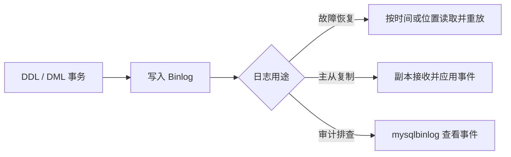

# 日志

> 本章梳理错误日志、二进制日志、查询日志和慢查询日志的用途与查看方式。

慢查询日志的定位与使用方法见 [05-性能分析](05-性能分析.md)，本章只介绍日志本身的配置与查看。


## 1.错误日志

错误日志是 MySQL 中最重要的日志之一，它记录了当 mysqld 启动和停止时，以及服务器在运行过程中发生任何严重错误时的相关信息，当数据库出现任何故障导致无法正常使用时，建议首先查看此日志。

该日志是默认开启的，默认存放目录 /var/log/，默认的日志文件名为 mysqld.log 。

查看日志位置：

```SQL
show variables like '%log_error%'; -- log_error
```

## 2.二进制日志

### 2.1 介绍

二进制日志(BINLOG)记录了所有的 DDL(数据定义语言)语句和 DML(数据操纵语言)语句，但不包括数据查询(SELECT、SHOW)语句。

作用：

1. 灾难时的数据恢复

2. MySQL的主从复制



在MySQL 8.0版本中，默认二进制日志是开启着的，涉及到的参数如下：

```SQL
show variables like '%log_bin%'; -- log_bin
```
### 2.2 日志格式

MySQL服务器中提供了多种格式来记录二进制记录，具体格式及特点如下：

MySQL 8.0 的 Binlog 主要用于数据恢复和复制。它记录会改变数据或表结构的事件，普通 `SELECT` 不会因为“查询”本身写入 Binlog。

|日志格式|含义|
|---|---|
|statement|基于SQL语句的日志记录，记录的是SQL语句，对数据进行修改的SQL都会记录在日志文件中。|
|row|基于行的日志记录，记录的是每一行的数据变更。(默认)|
|MIXED|混合了 STATEMENT 和 ROW 两种格式，默认采用 STATEMENT，在某些特殊情况下会自动切换为 ROW 进行记录。|

查看参数方式

```SQL
show variables like '%binlog_format%'; -- binlog_format
```

修改参数

```SQL
SET SESSION binlog_format = 'ROW';
```

> 修改 Binlog 格式会影响复制和恢复，请先确认业务兼容性；如需永久配置，应在配置文件中设置并重启服务。

生产环境选择 Binlog 格式时要考虑确定性、日志体积和复制兼容性：`ROW` 通常更容易准确重放，`STATEMENT` 日志较小但对非确定性语句更敏感，`MIXED` 由服务器在两者间选择。详见 [Replication Formats](https://dev.mysql.com/doc/refman/8.0/en/replication-formats.html)。

### 2.3 日志查看

由于日志是以二进制方式存储的，不能直接读取，需要通过二进制日志查询工具 mysqlbinlog 来查看。

```Properties
mysqlbinlog [参数选项] logfilename

参数选项：
    -d    指定数据库名称，只列出指定的数据库相关的操作。
    -o    忽略掉日志中的前n行命令。
    -v    将行事件(数据变更)重构为SQL语句。
    -w    将行事件(数据变更)重构为SQL语句，并输出注释信息
```

### 2.4 日志删除

对于比较繁忙的业务系统，每天生成的binlog数据巨大，如果长时间不清除，将会占用大量磁盘空间。可以通过以下几种方式清理日志：

|指令|含义|
|---|---|
|`RESET MASTER;`|删除全部 binlog 日志，删除之后日志编号从 `binlog.000001` 重新开始。注意 MySQL 8.0.29 起该语句改名为 `RESET BINARY LOGS AND GTIDS;`，旧写法仍兼容|
|`PURGE MASTER LOGS TO 'binlog.000010';`|删除指定编号之前的所有日志|
|`PURGE MASTER LOGS BEFORE 'yyyy-mm-dd hh24:mi:ss';`|删除该时间点之前产生的所有日志|

> `RESET MASTER` 和 `PURGE MASTER LOGS` 会删除用于恢复或复制的日志。执行前必须确认已有备份、复制状态和保留策略，禁止在不了解影响时直接执行。

也可以在mysql的配置文件中配置二进制日志的过期时间，设置了之后，二进制日志过期会自动删除.

```SQL
show variables like '%binlog_expire_logs_seconds%'; -- binlog_expire_logs_seconds
```

设置过期时间

```SQL
set global binlog_expire_logs_seconds = seconds;
```

## 3.查询日志

查询日志中记录了客户端的所有操作语句，而二进制日志不包含查询数据的SQL语句。默认情况下，查询日志是未开启的。如果需要开启查询日志，可以设置一下配置：

修改MySQL的配置文件my.cnf或my.ini 文件，添加如下内容：

```Properties
#该选项用来开启查询日志，可选值：0或者1；0代表关闭，1代表开启
general_log=1
#设置日志的文件名，如果没有指定，默认的文件名为 host_name.log
general_log_file=mysql_query.log
```

## 4.慢查询日志

慢查询日志记录了所有执行时间超过参数 long_query_time 设置值并且扫描记录数不小于 min_examined_row_limit 的所有的SQL语句的日志，默认未开启。long_query_time 默认为 10 秒，最小为0，精度可以到微秒。

```Properties
#慢查询日志
slow_query_log=1
#执行时间参数
long_query_time=2
```

默认情况下，不会记录管理语句，也不会记录不使用索引进行查找的查询。可以使用log_slow_admin_statements和更改此行为log_queries_not_using_indexes

```Properties
#记录执行较慢的管理语句
log_slow_admin_statements = 1
#记录执行较慢的未使用索引的语句
log_queries_not_using_indexes = 1
```
## 小练习

查看当前 Binlog 是否开启，执行一条数据变更后用 `SHOW BINARY LOGS;` 和 `SHOW BINLOG EVENTS;` 观察结果。
