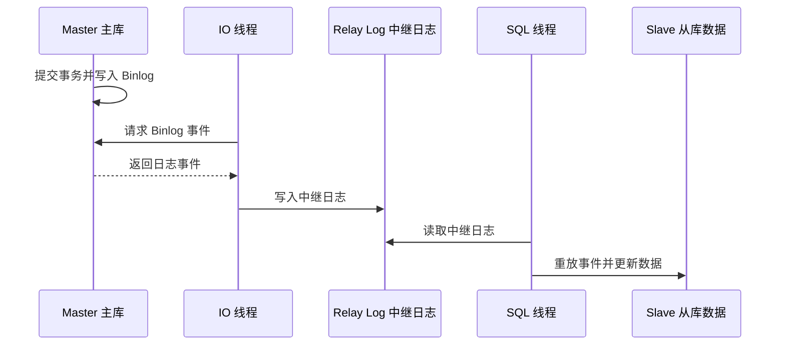

# 主从复制

> 本章介绍基于 Binlog 的主从复制架构、工作流程和基本验证方法。


## 1.概述

主从复制（官方文档逐步使用 source/replica，即源库/副本库术语）是指将源数据库的 DDL 和 DML 操作通过二进制日志传到副本服务器中，然后在副本上重放这些事件，使副本数据尽量追上源库。

MySQL支持一台主库同时向多台从库进行复制， 从库同时也可以作为其他从服务器的主库，实现链状复制。

MySQL 8.0 的复制默认是异步的：源库提交事务后不会等待副本完成应用，因此可能存在复制延迟。GTID（全局事务标识符）复制用事务 ID 代替手工维护 Binlog 文件名和位置，故障切换和重新指向通常更容易管理。

MySQL 复制的主要特点包含以下三个方面：

1. 主库出现问题，可以快速切换到从库提供服务

2. 实现读写分离，降低主库的访问压力

3. 可以在从库中执行备份，以避免备份期间影响主库服务
## 2.原理

MySQL主从复制原理：
复制可以概括为三个阶段：

1. Master 主库在事务提交时，会把数据变更记录为二进制日志 Binlog 事件；STATEMENT 格式主要记录 SQL，ROW 格式主要记录行变更

2. 从库的IO线程读取主库的二进制日志文件 Binlog ，写入到从库的中继日志 Relay Log

3. slave 的 SQL 线程重放中继日志中的事件，并将变更应用到自己的数据；ROW 格式下重放的是行事件，不是原始 SQL 文本

## 3.搭建实现

### 3.1 主库配置

主库要开启二进制日志并为实例指定唯一的 `server-id`。Linux 下通常编辑 `/etc/my.cnf`，在 `[mysqld]` 段落中加入以下配置：

```properties
[mysqld]
# 每个 MySQL 实例的 server-id 必须唯一，主库为 1，从库则使用其他值
server-id=1
# 开启二进制日志并指定日志文件前缀
log-bin=mysql-bin
# 复制推荐使用 ROW 格式，记录行变更，避免语句重放导致数据不一致
binlog_format=ROW
# 可选：只记录指定库的变更，多个库可重复配置该项
# binlog_do_db=db01
# 可选：忽略指定库的变更，与 binlog_do_db 互斥使用
# binlog_ignore_db=mysql
```

`server-id` 用于区分复制拓扑中的每个实例，不能与从库或其他实例重复；`binlog_do_db` 与 `binlog_ignore_db` 都是可选项，不配置表示记录所有库的变更。

修改完成后重启 MySQL 使配置生效：

```bash
systemctl restart mysqld
```

接着登录主库，创建复制账号并授予复制权限（`REPLICATION SLAVE`）：

```sql
-- MySQL 8.0 推荐先创建用户再授权
CREATE USER 'itcast'@'%' IDENTIFIED BY '${DB_PASSWORD}';
GRANT REPLICATION SLAVE ON *.* TO 'itcast'@'%';
FLUSH PRIVILEGES;
```

```sql
-- MySQL 5.7 及以前可以一条语句完成，8.0 已不再支持在 GRANT 中设置密码
GRANT REPLICATION SLAVE ON *.* TO 'itcast'@'%' IDENTIFIED BY '${DB_PASSWORD}';
```

授权成功后执行下面的语句查看主库的二进制日志状态：

```sql
SHOW MASTER STATUS;
```

输出中要记下两个值，从库配置时会用到：

- `File`：当前正在写入的二进制日志文件名，例如 `mysql-bin.000001`

- `Position`：当前日志的写入位置，例如 `156`

从库通过这两个值确定从哪个位点开始同步主库的变更；如果主库数据已发生变化，应在备份并锁定后再记录位点，保证从库与主库的起始状态一致。

### 3.2 从库配置
- 设置read_only=1后，超级管理员不是只读，如果想要让超级管理员也是只读，就需要额外配置`super_read_only=1`
- 当 `Replica_IO_Running` 和 `Replica_SQL_Running` 都显示 `Yes` 时，通常表示复制线程正在运行，但仍要检查错误号、延迟和数据一致性。

在 MySQL 8.0.22 及以后版本，优先使用：

```SQL
SHOW REPLICA STATUS\G
```

旧命令 `SHOW SLAVE STATUS` 已被弃用。复制状态与 GTID 配置详见 [MySQL 8.0 Replication](https://dev.mysql.com/doc/refman/8.0/en/replication.html) 和 [Checking Replication Status](https://dev.mysql.com/doc/refman/8.0/en/replication-administration-status.html)。

## 4.测试

1. 在主库上创建数据库、表，并插入数据

```SQL
create database db01;
use db01;
create table tb_user(
        id int(11) primary key not null auto_increment,
        name varchar(50) not null,
        sex varchar(1)
)engine=innodb default charset=utf8mb4;
insert into tb_user(id, name, sex) values (null, 'Tom', '1'), (null, 'Trigger', '0'), (null, 'Dawn', '1');
```

2. 在从库中查询数据，验证主从是否同步
### 主从复制流程



## 小练习

画出 Master、IO 线程、中继日志和 SQL 线程之间的数据流，并说明两个复制线程各自的职责。
