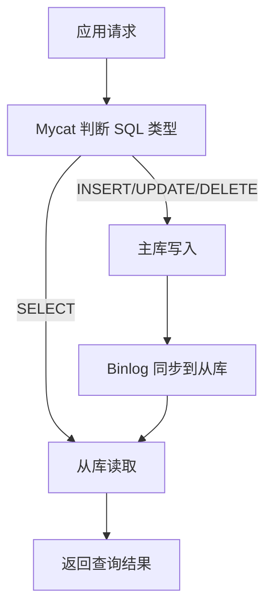

# 读写分离

> 本章说明如何让写请求进入主库、读请求进入从库，并理解 Mycat 在其中的作用。


## 1.介绍

主从复制在进行数据库操作时，客户端服务器会先判断目前操作是读还是写，再决定是分配到哪个服务器，压力较大。

读写分离,简单地说就是把对数据库的读和写操作分开,以对应不同的数据库服务器。主数据库提供写操作，从数据库提供读操作，这样能有效地减轻单台数据库的压力。

读写分离不是“自动获得强一致性”：写入主库后，副本可能尚未应用对应 Binlog。对刚写入数据有立即读取要求的请求，可以短时间固定访问主库，或在应用层根据复制位点/业务版本做一致性控制。

通过MyCat即可轻易实现上述功能，不仅可以支持MySQL，也可以支持Oracle和SQL Server。
## 2.一主一从

MySQL的主从复制，是基于二进制日志（binlog）实现的。
**环境准备**：

|主机|角色|用户名|密码|
|---|---|---|---|
|master-1|master|root|`your-password`|
|slave-1|slave|root|`your-password`|

主从复制的搭建，可以参考[十五、主从复制](https://mcnerzykwkel.feishu.cn/wiki/I8Tyw4doGimwFhkQ9imc02kfnVd?fromScene=spaceOverview#share-DXSRdYUp0ovDPMxDwwEcaO5unOg)

## 3.一主一从读写分离

### 3.1 配置

MyCat控制后台数据库的读写分离和负载均衡由schema.xml文件datahost标签的balance属性控制。
|参数值|含义|
|---|---|
|0|不开启读写分离机制 所有读操作都发送到当前可用的writeHost上|
|1|全部的readHost与writeHost备用的 都参与select语句的负载均衡（主要针对于双主双从模式）|
|2|所有的读写操作都随机在writeHost、readHost上分发|
|3|所有的读请求随机分发到writeHost对应的readHost上执行，writeHost不负担读压力|

### 3.2 测试

连接Mycat，并在Mycat中执行DML、DQL查看是否能够进行读写分离。

- 主节点Master宕机之后，业务系统就只能够读，而不能写入数据了，可以通过双主双从

## 4.双主双从

一个主机 Master1 用于处理所有写请求，它的从机 Slave1 和另一台主机 Master2 还有它的从机 Slave2 负责所有读请求。当 Master1 主机宕机后，Master2 主机负责写请求，Master1 、Master2 互为备机：
### 4.1 准备工作

我们需要准备5台服务器，具体的服务器及软件安装情况如下：

|编号|IP|安装软件|角色|
|---|---|---|---|
|1|mycat-host|Mycat、MySQL|Mycat中间件服务器|
|2|master-1|MySQL|M1|
|3|slave-1|MySQL|S1|
|4|master-2|MySQL|M2|
|5|slave-2|MySQL|S2|

测试环境中临时放通所需端口即可，不建议关闭防火墙；生产环境应使用最小端口和来源地址规则：

仅按部署需要放通 MySQL、Mycat 和管理端口，并限制来源地址；不要为了实验方便停用系统防火墙。

### 4.2 主库配置（ Master1-master-1 ）

下面用 `192.168.200.101` 表示 master-1、`192.168.200.102` 表示 slave-1、`192.168.200.103` 表示 master-2、`192.168.200.104` 表示 slave-2，实际部署时替换为真实主机地址。

修改 Master1 的配置文件 `my.cnf`（Linux 下通常是 `/etc/my.cnf`），在 `[mysqld]` 段中加入服务器编号和 binlog 文件名：

```properties
[mysqld]
server-id=1
log-bin=master1-bin
```

改完后重启 MySQL 服务，让配置生效：

```bash
systemctl restart mysqld
```

重启完成后登录 Master1，查看主库的 binlog 状态，记下 `File` 和 `Position` 两个值，4.5 节配置从库时要用：

```sql
SHOW MASTER STATUS;
```

### 4.3 主库配置（ Master2-master-2 ）

Master2 的配置与 Master1 相同，只是服务器编号和 binlog 文件名不能重复。修改 Master2 的 `my.cnf`：

```properties
[mysqld]
server-id=3
log-bin=master2-bin
```

改完后同样重启 MySQL 服务：

```bash
systemctl restart mysqld
```

重启完成后登录 Master2，执行 `SHOW MASTER STATUS;`，记下 `File` 和 `Position`，4.6 节配置 Slave2、4.8 节配置 Master1 时都要用到：

```sql
SHOW MASTER STATUS;
```

说明：四台服务器的 `server-id` 必须两两不同（这里规划为 Master1 = 1、Slave1 = 2、Master2 = 3、Slave2 = 4），`log-bin` 分别指定不同的文件名前缀，便于区分是哪台主库产生的日志。

### 4.4 两台主库创建账户并授权

从库要用一个专门的账号去拉取主库的 binlog，这个账号只需要复制权限，不要用 root。在 Master1 和 Master2 上分别执行：

```sql
CREATE USER 'repl'@'192.168.200.%' IDENTIFIED BY '${DB_PASSWORD}';
GRANT REPLICATION SLAVE ON *.* TO 'repl'@'192.168.200.%';
FLUSH PRIVILEGES;
```

主机名部分用网段通配，是为了让另一台主库和两台从库都能连进来。生产环境应把这里收窄到具体的四台机器 IP，或者至少限制在业务网段内。

授权完成后可以验证一下账号是否建好：

```sql
SELECT user, host FROM mysql.user WHERE user = 'repl';
```

### 4.5 从库配置（ Slave1-slave-1 ）

Slave1 的 `my.cnf` 只需要一个不能与别人重复的 `server-id`：

```properties
[mysqld]
server-id=2
read-only=1
```

`read-only=1` 让这个实例只接受来自复制线程和具有 SUPER 权限账号的写操作，能挡住误往从库写数据的情况。

改完重启服务，然后用复制账号指向 Master1。位点参数取自 4.2 节记下的 `File` 与 `Position`：

```sql
CHANGE MASTER TO
    MASTER_HOST='192.168.200.101',
    MASTER_PORT=3306,
    MASTER_USER='repl',
    MASTER_PASSWORD='${DB_PASSWORD}',
    MASTER_LOG_FILE='master1-bin.000001',
    MASTER_LOG_POS=154;

START SLAVE;
```

MySQL 8.0.22 起这套语句改名为 `CHANGE REPLICATION SOURCE TO` 与 `START REPLICA`，旧写法仍然兼容，新版本建议用新名字。

检查复制状态：

```sql
SHOW SLAVE STATUS\G
```

重点看两个字段，都必须为 `Yes`，否则复制没有真正跑起来：`Slave_IO_Running` 表示从库拉取 binlog 的线程是否正常，`Slave_SQL_Running` 表示从库回放 binlog 的线程是否正常。如果 `Slave_IO_Running` 为 `No`，先看 `Last_IO_Error`，常见原因是复制账号密码错、主机名授权范围不匹配或网络不通。

### 4.6 从库配置（ Slave2-slave-2 ）

Slave2 的步骤与 Slave1 完全一样，只是 `server-id` 和指向的主库不同：

```properties
[mysqld]
server-id=4
read-only=1
```

```sql
CHANGE MASTER TO
    MASTER_HOST='192.168.200.102',
    MASTER_PORT=3306,
    MASTER_USER='repl',
    MASTER_PASSWORD='${DB_PASSWORD}',
    MASTER_LOG_FILE='master2-bin.000001',
    MASTER_LOG_POS=154;

START SLAVE;
SHOW SLAVE STATUS\G
```

到这里，双主双从的拓扑就搭好了：Slave1 只从 Master1 同步，Slave2 只从 Master2 同步，两台从库负责承担读请求。

### 4.7 两台从库配置关联的主库

双主双从里从库与主库是一对一固定关联，不能交叉：

| 从库 | 关联的主库 | server-id | 作用 |
| --- | --- | --- | --- |
| slave-1（192.168.200.103） | master-1（192.168.200.101） | 3 | 承担读请求，同时备份 master-1 |
| slave-2（192.168.200.104） | master-2（192.168.200.102） | 4 | 承担读请求，同时备份 master-2 |

配置时四个关键参数的含义与取值来源：

| 参数 | 取值来源 |
| --- | --- |
| `MASTER_HOST` | 从库所关联的主库 IP |
| `MASTER_USER`、`MASTER_PASSWORD` | 主库上创建的复制账号，见 4.4 节 |
| `MASTER_LOG_FILE`、`MASTER_LOG_POS` | 在对应主库上执行 `SHOW MASTER STATUS;` 得到 |
| `MASTER_PORT` | 主库端口，默认 3306 |

执行完 `START SLAVE` 后，用下面的命令确认状态：

```sql
SHOW SLAVE STATUS\G
```

需要重点看这几个字段：

| 字段 | 期望值 | 不符合时的排查方向 |
| --- | --- | --- |
| `Slave_IO_Running` | `Yes` | 检查网络、`MASTER_HOST`、复制账号密码、防火墙 |
| `Slave_SQL_Running` | `Yes` | 检查主键冲突、表结构不一致等数据问题 |
| `Seconds_Behind_Master` | 0 或很小 | 从库压力大、有大事务时会出现延迟 |
| `Last_IO_Error`、`Last_SQL_Error` | 为空 | 里面会写明具体失败原因 |

```sql
-- 修复数据问题后，先停再开
STOP SLAVE;
START SLAVE;
```

两台从库都要确认一遍，四个节点的两个 Running 都是 `Yes`，才算搭建完成。

### 4.8 两台主库相互复制

双主的意义在于：任何一台主库宕机，另一台都能顶上继续写，所以两台主库要互为对方的从库。做法就是在 Master1 上执行一遍指向 Master2 的 `CHANGE MASTER TO`，在 Master2 上执行一遍指向 Master1 的，两台的位点分别取自对方的 `SHOW MASTER STATUS;`。

在 Master1 上执行（位点取 Master2 的）：

```sql
CHANGE MASTER TO
    MASTER_HOST='192.168.200.102',
    MASTER_PORT=3306,
    MASTER_USER='repl',
    MASTER_PASSWORD='${DB_PASSWORD}',
    MASTER_LOG_FILE='master2-bin.000001',
    MASTER_LOG_POS=154;

START SLAVE;
SHOW SLAVE STATUS\G
```

在 Master2 上执行（位点取 Master1 的）：

```sql
CHANGE MASTER TO
    MASTER_HOST='192.168.200.101',
    MASTER_PORT=3306,
    MASTER_USER='repl',
    MASTER_PASSWORD='${DB_PASSWORD}',
    MASTER_LOG_FILE='master1-bin.000001',
    MASTER_LOG_POS=154;

START SLAVE;
SHOW SLAVE STATUS\G
```

这里有一个必须处理的问题：两台主库都能写，如果都用默认的自增策略，双方都可能生成同一个主键值，复制过去就会主键冲突，从库的 `Slave_SQL_Running` 会变成 `No`，报 `Duplicate entry`。

解决办法是让两台主库的自增值错开，各自只取序列中的一部分：

```properties
# Master1 的 my.cnf
[mysqld]
auto_increment_increment=2
auto_increment_offset=1
```

```properties
# Master2 的 my.cnf
[mysqld]
auto_increment_increment=2
auto_increment_offset=2
```

`auto_increment_increment` 是每次自增的步长，`auto_increment_offset` 是起始偏移。这样 Master1 产生 1、3、5、7……，Master2 产生 2、4、6、8……，两台主库的 ID 永远不会撞车。改完需要重启 MySQL 服务。

代价也要知道：自增 ID 不再连续，业务上一段递增的 ID 中间会出现空缺，任何"依赖 ID 连续"的逻辑都不能有。

### 4.9 测试

分别在两台主库 Master1、Master2 上执行 DDL 与 DML 语句，再到四台服务器上检查数据同步情况。

```sql
create database db01;
use db01;
create table tb_user(
        id int not null primary key,
        name varchar(50) not null,
        sex varchar(1)
) engine=innodb default charset=utf8mb4;

insert into tb_user(id,name,sex) values(1,'Tom','1');
insert into tb_user(id,name,sex) values(2,'Trigger','0');
insert into tb_user(id,name,sex) values(3,'Dawn','1');
insert into tb_user(id,name,sex) values(4,'Jack Ma','1');
insert into tb_user(id,name,sex) values(5,'Coco','0');
insert into tb_user(id,name,sex) values(6,'Jerry','1');
```

上面用的是 `int` 而不是老笔记里的 `int(11)`：整数后面的显示宽度在 MySQL 8.0.17 起已被废弃，写了会有警告，实际存储和取值范围不受影响。

验证步骤：

| 步骤 | 操作 | 期望结果 |
| --- | --- | --- |
| 1 | 在 Master1 上建库建表并插入数据 | Master1 本地写入成功 |
| 2 | 在 Slave1 上查询 `tb_user` | 能看到 Master1 写入的 6 行 |
| 3 | 在 Master2 上建另一个库或表并写入 | Master2 本地写入成功 |
| 4 | 在 Slave2 上查询对应数据 | 能看到 Master2 写入的内容 |
| 5 | 在 Master1 上查询 Master2 新建的库 | 能看到，说明两台主库互为主从生效 |

## 5.双主双从读写分离

### 5.1 配置

MyCat 控制后台数据库的读写分离与负载均衡，靠的是 `schema.xml` 里 `dataHost` 标签的三个属性：`balance` 决定读请求往哪发，`writeType` 决定写请求往哪发，`switchType` 决定主库故障后是否自动切换。

双主双从的典型配置：

```xml
<dataHost name="localhost1" maxCon="1000" minCon="10" balance="1"
          writeType="0" dbType="mysql" dbDriver="native"
          switchType="1" slaveThreshold="100">
    <heartbeat>select user()</heartbeat>
    <writeHost host="hostM1" url="192.168.200.101:3306" user="root" password="${DB_PASSWORD}">
        <readHost host="hostS1" url="192.168.200.103:3306" user="root" password="${DB_PASSWORD}" />
    </writeHost>
    <writeHost host="hostM2" url="192.168.200.102:3306" user="root" password="${DB_PASSWORD}">
        <readHost host="hostS2" url="192.168.200.104:3306" user="root" password="${DB_PASSWORD}" />
    </writeHost>
</dataHost>
```

`balance` 的取值与含义：

| 取值 | 读请求的分配方式 | 适用场景 |
| --- | --- | --- |
| 0 | 不开启读写分离，所有读都发给写库 | 调试、主从延迟不可接受时 |
| 1 | 所有 readHost 与闲置的 writeHost 一起参与读 | 双主双从的常用取值 |
| 2 | 读请求随机发到所有 writeHost 与 readHost | 读写压力都需要分摊 |
| 3 | 读请求只发到 writeHost 对应的 readHost | 一主多从、主库不想被读打扰 |

其余三个属性：

| 属性 | 取值与含义 |
| --- | --- |
| `writeType` | `0` 表示所有写发往第一个 writeHost，它挂了才切到第二个；`1` 表示随机发往某个 writeHost；`2` 表示不切换 |
| `switchType` | `-1` 不自动切换；`1` 默认值，自动切换；`2` 基于主从同步状态决定是否切换；`3` 基于 Galera 集群状态切换 |
| `slaveThreshold` | 从库延迟阈值，配合 `switchType="2"` 使用，`Seconds_Behind_Master` 超过阈值就不再把读请求发过去 |

改完 `schema.xml` 与 `server.xml` 后需要重启 MyCat 服务才生效。

### 5.2 测试

登录 MyCat（默认端口 8066），依次验证读写分离与故障切换：

| 验证项 | 操作 | 期望结果 |
| --- | --- | --- |
| 读请求分摊 | 反复执行同一条查询 | 读请求在不同从库之间轮换，结果一致 |
| 写请求路由 | 执行 `INSERT` | 默认写入 master-1，再同步到其余三台 |
| 数据一致性 | 写入后立即查询 | 数据可见；若从库有延迟，可能短暂读不到 |
| 故障切换 | 停掉 master-1 的 MySQL 服务 | 写请求自动切到 master-2，读请求切到 slave-2 |
| 恢复回切 | 重新启动 master-1 | 视 `switchType` 配置决定是否回切 |

故障切换一定要实测一次，因为 `switchType` 配置错误时，主库宕机后应用会直接写失败，而这个问题在平时看不出来。

### 5.3 读写分离流程



读写分离依赖复制状态；从库延迟时，刚写入的数据可能暂时无法立即读到。

## 小练习

为一个读多写少的业务画出读写分离架构，并列出主从延迟可能带来的一个问题及应对方式。
