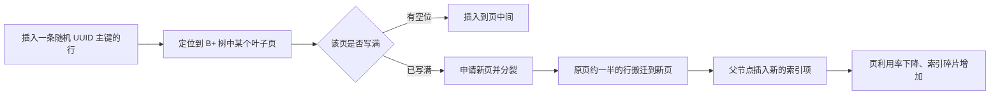
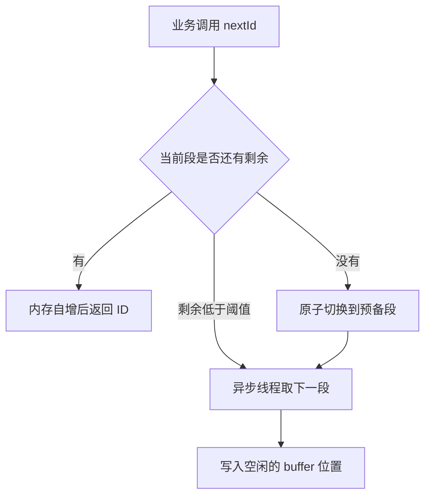

# 分布式 ID 方案

> 本章说明单机自增主键在分库分表与多实例写入下失效的原因，并对比常用的全局唯一 ID 生成方案。

分库分表把一张表拆到多个库、多张表之后，原来的自增主键不再全局唯一；多实例同时写入同一张逻辑表时，各自的自增序列还会互相重复。本篇要解决的问题是：在分布式环境下，怎样为每条新记录拿到全局唯一的 ID，以及怎样根据业务对有序性、吞吐量和外部依赖的要求选出合适的方案。

## 1.为什么需要分布式 ID

### 1.1 自增主键的唯一性从哪里来

`AUTO_INCREMENT` 之所以能保证唯一，是因为唯一性由单个 MySQL 实例上的计数器维护：每个连接申请下一个值时，都要先取得这个计数器上的锁（InnoDB 中使用 `AUTO-INC` 锁或轻量级互斥量），再递增并返回。可以认为，自增主键的唯一性范围等于"这一个实例、这一张表"。

`INSERT` 语句如果没有显式给出主键值，MySQL 才使用自增计数器；如果业务自己传了主键值，计数器不受影响，这也意味着跨库合并数据时冲突不会被数据库拦住。

### 1.2 分布式环境下这个前提不成立

拆库拆表之后，"单实例单表"的边界被打破，出现下面几类问题。

|问题|产生原因|后果|
|---|---|---|
|分片后主键冲突|每个分片都有自己的自增计数器，`t_order_0` 与 `t_order_1` 都从 1 开始计数|多个分片出现相同的订单 ID，按 ID 定位分片时可能命中错误的数据|
|依赖单库自增成为瓶颈|所有分片都向同一个库申请号，或所有写入都挤在一张自增表上|发号环节变成串行点，吞吐受限，同时成为单点故障|
|迁移合并主键重复|历史数据从多个库合并到新库，或分片扩容后重新分布数据|不同来源的数据携带相同主键，合并时必须重写主键，所有引用该主键的关联数据都要跟着改|
|自增 ID 可被推测业务量|自增序列连续，外部隔一段时间下两次单，用差值就能算出这段时间的订单量|竞对能推测业务规模，攻击者还能按 ID 遍历接口拿到本不该看到的数据|

### 1.3 问题场景对照

把上面的问题放进具体场景，更容易判断自己是否真的需要分布式 ID。

|场景|是否需要全局 ID|说明|
|---|---|---|
|单库单表、单实例写入|不需要|自增主键足够，引入发号组件只是增加复杂度|
|单库单表、数据来自多次迁移|需要|需要为迁移数据重新分配主键，或直接改用全局 ID|
|分库分表、按自增主键分片|需要|分片键就是主键时，各分片自增必然重复|
|分库分表、按业务字段（如 user_id）分片|需要|同一用户的订单落在同一分片，但主键仍要全局唯一，后续重新分片也不能重复|
|多实例写入同一张逻辑表|需要|两个实例的计数器互相独立，重复概率随写入量上升|

结论：只要出现"多实例写入"或"数据分片后要跨分片唯一定位"，自增主键就不再满足要求，需要一套独立的全局 ID 生成机制。下面先给出方案总表，再逐个展开。

## 2.方案对比总表

表中的"性能量级"是单机粗略值，具体取决于硬件与配置，数字只用于横向比较。

|方案|原理|有序性|依赖外部组件|性能量级|缺点|适用场景|
|---|---|---|---|---|---|---|
|UUID|128 位随机数，本地生成|完全无序|无|单机每秒百万级|做主键导致页分裂与索引碎片，占空间大|日志、消息、链路追踪等不要求有序的标识|
|数据库自增（单表）|依赖单实例的 `AUTO_INCREMENT`|严格递增|数据库自身|受单表写入能力限制，每秒数千到数万|多实例下重复，单点瓶颈，扩容困难|单库单表的小系统|
|数据库多实例步长自增|各实例用不同的起始偏移与步长|趋势递增，不连续|数据库自身|随实例数线性提升|扩容时要重新规划步长，ID 空洞明显|对成本敏感、实例数固定的中小系统|
|号段模式|一次从数据库取一段 ID 缓存到内存|趋势递增，有空洞|数据库|每秒十万级|重启会丢掉未用完的号段，依赖数据库高可用|分库分表中的订单号、自增型业务 ID|
|Redis INCR|利用 Redis 单线程原子自增|严格递增|Redis|每秒十万级|持久化配置不当会丢号，重启后可能回退|已有 Redis 集群、能接受号段跳变的系统|
|雪花算法|时间戳与机器号拼成 64 位整数|趋势递增（按毫秒）|无（仅需分配 workerId）|单机每秒数十万|依赖系统时钟，回拨会导致重复或不可用|分库分表自建发号、订单号等高并发场景|
|美团 Leaf|号段模式与雪花模式二合一，号段模式复用数据库|趋势递增|数据库或 ZooKeeper|每秒十万级|需要额外部署与运维|公司内部统一发号服务|
|百度 UidGenerator|雪花变种，借用未来时间|趋势递增|数据库（分配 workerId）|每秒百万级|实现较重，依赖时间与 workerId 分配|超大规模、能接受自研成本|

选择时先确定三件事：是否需要趋势递增（影响主键写入性能与范围查询）、能接受多少次号段跳变（影响是否允许 ID 空洞）、是否愿意维护一个发号服务及其依赖的中间件。

## 3.UUID

### 3.1 生成方式

UUID 是一个 128 位的值，标准写法是 32 个十六进制字符加 4 个连字符，共 36 个字符。全流程在本地完成，不需要任何外部组件，因此是最容易落地的方案。

MySQL 端可以直接生成：

```sql
SELECT UUID();
-- 例如：3f2504e0-4f89-11d3-9a0c-0305e82c3301
```

Java 端使用 `java.util.UUID`：

```java
import java.util.UUID;

public class UuidDemo {
    public static void main(String[] args) {
        // 版本 4：基于伪随机数生成，碰撞概率可以忽略
        String id = UUID.randomUUID().toString();
        System.out.println(id);

        // 拆成高低两个 long，便于用更紧凑的方式存储
        UUID uuid = UUID.randomUUID();
        long high = uuid.getMostSignificantBits();
        long low = uuid.getLeastSignificantBits();
        System.out.println(high + "," + low);
    }
}
```

存储时有两种选择：`char(36)` 保存带连字符的字符串，或者去掉连字符后存成 `binary(16)`。后者省一半以上空间，但读写都要做转换，可读性差。

### 3.2 作为 InnoDB 主键的致命缺点

InnoDB 的主键就是聚簇索引，行数据按主键顺序存放在 B+ 树的叶子页里。主键递增时新行总是追加到最右边的页，页写满后分裂一次，页利用率高、顺序读多。随机 UUID 打破了这个顺序：



由此带来的代价：

|代价|说明|
|---|---|
|随机写放大|每次插入都可能落在不同的页上，缓冲池中的热页被快速挤出，磁盘随机 IO 显著增加|
|页分裂与碎片|频繁的页分裂让页利用率从接近 100% 降到约 50%，同一份数据占用的页数变多|
|索引体积大|`char(36)` 比 `bigint` 大 4 倍以上，二级索引的叶子节点都会存一份主键值，索引整体膨胀|
|范围查询失效|相邻时间写入的数据在聚簇索引中分散，按时间范围扫描变成大量离散读|
|调试不友好|出现问题时无法根据 ID 判断插入先后|

补充两点：`binary(16)` 能缓解体积问题，但随机性带来的页分裂依然存在，所以 UUID 不适合做写入量大、以主键为聚集维度的表的主键；它更适合做对外暴露的标识、消息 ID、链路追踪 ID 这类不需要参与聚簇索引排序的场景。

## 4.数据库自增

### 4.1 单表自增

最传统的做法是把发号职责交给数据库自己，直接依赖业务表主键的自增：

```sql
CREATE TABLE t_order (
    id BIGINT UNSIGNED NOT NULL AUTO_INCREMENT COMMENT '订单主键',
    order_no VARCHAR(32) NOT NULL COMMENT '业务订单号',
    user_id BIGINT UNSIGNED NOT NULL COMMENT '下单用户',
    amount DECIMAL(10,2) NOT NULL DEFAULT 0.00 COMMENT '订单金额',
    create_time DATETIME NOT NULL DEFAULT CURRENT_TIMESTAMP COMMENT '创建时间',
    PRIMARY KEY (id),
    UNIQUE KEY uk_order_no (order_no)
) ENGINE = InnoDB DEFAULT CHARSET = utf8mb4 COMMENT = '订单表';
```

InnoDB 的自增值分配受 `innodb_autoinc_lock_mode` 控制：

|取值|名称|行为|适用场景|
|---|---|---|---|
|0|传统模式|每条插入语句的整个生命周期内持有表级 `AUTO-INC` 锁|需要按语句顺序回放 binlog 恢复数据的场景|
|1|连续模式|对"插入行数可确定"的语句改用轻量级互斥量，语句结束即释放|默认值，单机场景的常见选择|
|2|交错模式|完全使用轻量级互斥量，同一条语句内分配的值也可能不连续|并发最高，须配合 `binlog_format=ROW`|

`DELETE FROM` 不会重置计数器，只有 `TRUNCATE TABLE` 会把它归零，所以清空数据后 ID 仍会从上次的位置继续变大。

单表自增的优点是实现最简单、ID 紧凑连续、天然可排序；缺点是唯一性只在一个实例内成立，实例一多就重复，而且所有写请求都要先拿到这个计数器。

### 4.2 多实例按步长自增

如果写入必须分散到多个实例，可以让各实例错开取值的起点和间距。思路与主从复制里错开自增值完全一样，只是把实例数量从 2 扩展到 n：

```properties
# 实例 1 的 my.cnf
[mysqld]
auto_increment_increment=3
auto_increment_offset=1
```

```properties
# 实例 2 的 my.cnf
[mysqld]
auto_increment_increment=3
auto_increment_offset=2
```

|实例|`auto_increment_increment`|`auto_increment_offset`|生成的序列|
|---|---|---|---|
|实例 1|3|1|1、4、7、10……|
|实例 2|3|2|2、5、8、11……|
|实例 3|3|3|3、6、9、12……|

偏移值必须落在 1 到步长之间，超过步长时会被按模折算，达不到预期的错开效果。修改配置后需要重启 MySQL 才生效。

### 4.3 扩容与运维问题

这种做法把"改配置"变成了"改 ID 规则"，扩容时最麻烦：

|扩容方式|做法|问题|
|---|---|---|
|成倍扩容|初始步长取 2 的幂（例如 8），每台实例先占 8 个号中的一个，扩容时再按二级步长细分|必须提前规划，ID 空洞明显，序列看起来不连续|
|改步长重启|停机把步长从 3 改成 4，同时调整各实例的偏移|存量 ID 与新增 ID 可能撞车，只能停机迁移|
|新实例用大偏移|新实例从一个很大的偏移开始取号|只是把冲突推迟，无法根治|
|迁移到号段模式|发号职责收敛到一张表，各实例按段取号|改动较大，但之后扩容不再受制于步长|

因此，多实例步长自增更适合实例数量长期固定、对成本敏感、能接受 ID 空洞的系统；一旦预期会持续扩容，应直接考虑号段模式或雪花算法。

## 5.号段模式

号段模式把"每次取一个 ID"改为"每次取一段 ID"：发号服务先从数据库加载一段连续数值到内存，分配时只在内存里自增，用完这一段再向数据库申请下一段。数据库只承担批量取段的压力，因此吞吐量取决于内存操作速度，而不是数据库写入速度。

### 5.1 号段表结构

```sql
CREATE TABLE leaf_alloc (
    biz_tag VARCHAR(128) NOT NULL DEFAULT '' COMMENT '业务标识，每个业务一行',
    max_id BIGINT NOT NULL DEFAULT 1 COMMENT '当前已分配出去的最大 ID',
    step INT NOT NULL DEFAULT 1000 COMMENT '每段长度，即一次取多少个 ID',
    description VARCHAR(256) DEFAULT '' COMMENT '业务描述',
    update_time TIMESTAMP NOT NULL DEFAULT CURRENT_TIMESTAMP ON UPDATE CURRENT_TIMESTAMP COMMENT '最近一次取段时间',
    PRIMARY KEY (biz_tag)
) ENGINE = InnoDB DEFAULT CHARSET = utf8mb4 COMMENT = '号段分配表';

INSERT INTO leaf_alloc (biz_tag, max_id, step, description)
VALUES ('order', 1, 1000, '订单号');
```

|字段|作用|
|---|---|
|biz_tag|业务标识，各业务互不影响，可以按业务单独调整 step|
|max_id|已分配出去的最大 ID，也是下一段的起点|
|step|段长度，越大则访问数据库越少，重启时丢掉的号也越多|
|description|业务说明，便于运维辨认|
|update_time|监控取段频率，取段过快说明 step 偏小|

取段的 SQL 只有一条，靠数据库行锁保证多实例不会取到同一段：

```sql
UPDATE leaf_alloc SET max_id = max_id + step, update_time = NOW() WHERE biz_tag = 'order';
```

读出新的 max_id 后，本次可用区间是 (max_id - step, max_id]。取号本身只在进程内完成，不再访问数据库。

### 5.2 双 buffer 预加载

单 buffer 的问题是号段耗尽那一刻才去数据库取下一段，这次取段要走网络，所有并发请求都要等它返回，表现为周期性的取号抖动。双 buffer 同时保留当前段与预备段，当前段消费到一定比例时异步加载下一段，耗尽时可以立即切换。



正常情况下业务线程不会阻塞，只有预备段也来不及准备时才会短暂等待取段，因此取号延迟稳定在微秒以内。

### 5.3 优点与代价

|维度|说明|
|---|---|
|性能|step 取 1000 或 10000 时，数据库压力被摊薄到千分之一，单机每秒可发十万级 ID|
|依赖|只依赖一张普通 InnoDB 表，可以用主从与多库提升可用性|
|趋势递增|同一段内严格递增，跨段也递增，适合做聚簇主键|
|代价|重启会丢掉当前段中未使用的号，产生 ID 空洞，step 越大空洞越明显|
|代价|多实例并发取段时各段在数值上交错，全局不是严格连续|

ID 空洞在多数业务里可以接受，但有两点要注意：不能把 ID 当作订单总数来统计；外部系统若假设 ID 连续，需要提前沟通。

## 6.Redis INCR

Redis 的 INCR 由单线程原子执行，天然满足多客户端取到不重复数值的要求，实现也最简单：

```bash
SET order:id 1000
INCR order:id       # 返回 1001
INCRBY order:id 10  # 一次要 10 个号，返回 1011
```

```java
// 一次申请一段，减少网络往返
Long max = redisTemplate.opsForValue().increment("order:id", 1000L);
// 本次可用区间是 (max - 1000, max]
```

优点是不用建表、直接使用现成的原子操作、性能在十万级；缺点是 ID 严格连续递增，业务量会被外部推算，发号能力也绑定在 Redis 的可用性上。

最大的风险是丢数据导致重复发号：

|持久化配置|风险|后果|
|---|---|---|
|只开 RDB|两次快照之间的自增结果没有落盘|重启后计数器回退|
|AOF everysec|最多丢失约 1 秒的写命令|重启后可能回退|
|主从切换|写命令可能尚未同步到从节点|从节点升主后计数器回退|

可以按业务定期重置计数器，或者同时开启 RDB 与 AOF 并配合主从与哨兵，但都无法完全消除回退，对唯一性要求极高的场景应改用号段模式或雪花算法。

## 7.雪花算法

雪花算法（Snowflake）把一个 64 位 long 按位切成若干段，高位放时间、中位放机器标识、低位放同毫秒内的序列号，因此在本地就能生成全局唯一且趋势递增的 ID。


|位数|字段|含义|
|---|---|---|
|1|符号位|固定为 0，因为 long 的最高位是符号位|
|41|毫秒时间戳|当前时间与自定义起始时间的毫秒差，可用约 69 年|
|5|数据中心 id|最多 32 个机房|
|5|机器 id|每个机房最多 32 台机器|
|12|序列号|同一毫秒内的自增计数，每毫秒最多 4096 个|

41 位能表示 2 的 41 次方毫秒，约 69.7 年，因此必须自定义一个起始时间（例如项目上线时间），否则时间戳很快会用完。12 位序列号意味着单机同一毫秒最多生成 4096 个 ID，即每秒理论上限约 409.6 万个，实际还受 CPU 与锁竞争影响。数据中心 id 与机器 id 合计 10 位，最多支持 1024 个节点，超过这个规模就需要复用机器号，并保证复用同一号的两台机器不同时发号。

### 7.1 时钟回拨的三种应对

雪花算法的唯一性依赖"时间只会前进"，NTP 校准、虚拟机迁移、人工改时间都可能让时钟倒退。

|回拨幅度|处理方式|代价|
|---|---|---|
|几毫秒以内|短暂等待，等系统时钟追上上次记录的时间戳|这段时间的请求有延迟，但不会丢号|
|超过阈值或无法判断|直接抛异常，让调用方失败或重试|服务短暂不可用，但绝不产生重复 ID|
|难以预估|预留备用 workerId，回拨时切换到备用号继续发号|需要提前占用机器号，切换期间旧号不能复用|

在"可能重复"与"短暂不可用"之间，发号服务必须选后者：重复 ID 会污染数据，事后很难修复。

### 7.2 workerId 的分配方式

|方式|做法|缺点|
|---|---|---|
|配置文件写死|每台机器的配置里写着唯一的 workerId|扩容要改配置并重启|
|数据库分配|启动时向 worker 表申请未占用的号，并定期上报心跳|依赖数据库，需要处理宕机后的回收|
|ZooKeeper 顺序节点|用临时顺序节点分配，会话断开时自动释放|依赖 ZooKeeper|
|Redis 抢占|用 SETNX 或 INCR 分配，配合过期时间判断存活|依赖 Redis，过期时间不好设|
|按机器标识推导|用 IP 或主机名哈希后取模|哈希冲突无法完全避免，容器环境下 IP 会变|

不管用哪种方式，都必须保证同一时刻不存在两台机器使用相同的 workerId 发号。

## 8.开源方案简介

### 8.1 美团 Leaf

Leaf 提供两种模式，通过配置切换：

|模式|原理|特点|
|---|---|---|
|Leaf-segment|号段模式，双 buffer 预加载，号段信息存在数据库|继承号段模式的优缺点，可通过多库水平扩展|
|Leaf-snowflake|标准雪花算法，workerId 由 ZooKeeper 分配|启动时校验时间戳，运行时周期性上报时钟状态|

Leaf-snowflake 对时钟回拨的处理是启动校验加运行时上报，并缓存最近的时间戳，本质是上面"小幅等待、大幅拒绝"的组合。

### 8.2 百度 UidGenerator

UidGenerator 的默认实现把号段思想搬进了雪花算法：workerId 由数据库分配，运行时用 RingBuffer 缓存一批已生成的 ID，生成线程与消费线程解耦，因此不必每次取号都计算时间戳。它还借鉴了借用未来时间的思路，即允许序列号消耗到一定程度后直接使用下一毫秒的时间戳，用时间位换并发能力，代价是时间位被提前消耗。

两者都属于"自己实现一遍并长期维护"的方案，适合有中间件团队的公司；中小团队在号段模式与普通雪花算法之间选择即可。

## 9.Java 代码示例

### 9.1 简化版雪花算法

下面的实现省略了 workerId 分配与位参数的完整校验，只保留位拼接、加锁与时间回拨处理这三件核心事情。

```java
public class SimpleSnowflake {
    // 自定义起始时间，决定 41 位时间戳的可用年限
    private static final long START_EPOCH = 1704067200000L;
    private static final long WORKER_ID_BITS = 5L;
    private static final long DATA_CENTER_BITS = 5L;
    private static final long SEQUENCE_BITS = 12L;
    private static final long MAX_SEQUENCE = ~(-1L << SEQUENCE_BITS);
    // 允许的最大回拨毫秒数，超过则直接抛异常
    private static final long MAX_BACKWARD_MS = 5L;

    private final long workerId;
    private final long dataCenterId;
    private long sequence = 0L;
    private long lastTimestamp = -1L;

    public SimpleSnowflake(long dataCenterId, long workerId) {
        this.dataCenterId = dataCenterId;
        this.workerId = workerId;
    }

    public synchronized long nextId() {
        long now = System.currentTimeMillis();
        if (now < lastTimestamp) {
            long backward = lastTimestamp - now;
            if (backward > MAX_BACKWARD_MS) {
                // 回拨过大：宁可拒绝服务，也不生成可能重复的 ID
                throw new IllegalStateException("时钟回拨 " + backward + " 毫秒，拒绝发号");
            }
            // 小幅回拨：等系统时钟追上上次的时间戳
            now = waitUntil(lastTimestamp);
        }
        if (now == lastTimestamp) {
            sequence = (sequence + 1) & MAX_SEQUENCE;
            if (sequence == 0) {
                // 同一毫秒的 4096 个号已用完，等下一毫秒
                now = waitUntil(lastTimestamp + 1);
            }
        } else {
            sequence = 0L;
        }
        lastTimestamp = now;
        // 时间戳左移 22 位，数据中心左移 17 位，机器号左移 12 位，低位放序列号
        return ((now - START_EPOCH) << 22)
                | (dataCenterId << 17)
                | (workerId << 12)
                | sequence;
    }

    private long waitUntil(long target) {
        long ts = System.currentTimeMillis();
        while (ts < target) {
            ts = System.currentTimeMillis();
        }
        return ts;
    }
}
```

`nextId()` 用 `synchronized` 保证单实例内串行，避免两个线程拿到同一个序列号；真正压测时这里的锁竞争会成为瓶颈，可以改成每个线程一个 Sequence 对象来减少争用。分布式部署还必须保证各实例的 dataCenterId 与 workerId 组合唯一，否则加锁只能保证单机唯一。

### 9.2 MyBatis-Plus 的两种选择

MyBatis-Plus 通过 `@TableId` 的 `type` 决定主键由谁生成，最常用的是下面两种：

```java
@TableName("t_order")
public class Order {
    // 由 MyBatis-Plus 内置的雪花算法生成，插入时不需要赋值
    @TableId(type = IdType.ASSIGN_ID)
    private Long id;

    // 由数据库 AUTO_INCREMENT 生成，插入后回填到对象里
    @TableId(type = IdType.AUTO)
    private Long autoId;
}
```

|取值|生成方式|依赖数据库自增|适用场景|注意点|
|---|---|---|---|---|
|IdType.AUTO|使用数据库自增，插入语句不带主键，之后回填|是|单库单表，想复用 MySQL 自增|多实例或分库分表写入时会重复|
|IdType.ASSIGN_ID|默认用内置雪花算法生成，数值字段得到 long，字符串字段得到对应的数字字符串|否|分库分表、需要全局唯一|ID 不连续，不能当序号使用|
|IdType.ASSIGN_UUID|生成去连字符的 32 位 UUID|否|对有序性没有要求的标识|做主键仍有页分裂问题|
|IdType.INPUT|不生成，由业务自己赋值|否|已有统一发号服务、历史数据迁移|忘记赋值会报错|
|IdType.NONE|跟随全局配置，默认与 ASSIGN_ID 表现一致|取决于全局配置|统一在全局配置里指定策略|不要误以为它等同于 AUTO|

## 10.选型建议

|场景|推荐方案|理由|
|---|---|---|
|单库小系统，没有分片计划|数据库自增|实现成本最低，ID 连续且便于排查|
|分库分表且要自建发号|号段模式，并发极高时用雪花算法|号段模式实现简单但依赖数据库，雪花算法无外部依赖但受时钟影响|
|公司已有统一发号服务|直接调用现有服务|避免重复建设、口径统一，只需关注接口的超时与幂等|
|要求趋势递增|雪花算法或号段模式|生成的 ID 随时间递增，适合做聚簇主键|
|不能接受 ID 空洞|数据库自增或 Redis INCR|号段模式与雪花算法都会产生空洞|
|要求 ID 不可被外部推算|雪花算法，或对外另发一套编码|自增与 INCR 都能被外部推算业务量|

判定的顺序建议是：先看是否分片，再看是否必须趋势递增，最后看能不能接受空洞与外部依赖。

## 11.总结

1. 自增主键的唯一性范围只是单个 MySQL 实例的单张表，多实例写入或分片之后必然重复。
2. UUID 本地即可生成且几乎不会重复，但随机写入会让 InnoDB 聚簇索引频繁页分裂，只适合做对外标识。
3. 数据库自增最简单，代价是单点与扩容困难；多实例步长自增能分散压力，但扩容时要停机重排。
4. 号段模式把数据库从每次取号解放为批量取段，用双 buffer 预加载避免取号抖动，代价是重启会丢掉一段未用的号。
5. Redis INCR 实现成本极低，但持久化与主从切换都可能让计数器回退，不能作为强唯一来源。
6. 雪花算法用时间戳加机器号加序列号拼出 64 位 ID，无外部依赖、趋势递增，但必须处理时钟回拨与 workerId 分配。
7. 时钟回拨的底线是宁可短暂拒绝服务，也不生成可能重复的 ID。
8. Leaf 与 UidGenerator 把号段与雪花工程化，适合有中间件团队的公司，中小团队不必自研。
9. 选型本质上只看三件事：是否需要趋势递增、能否接受 ID 空洞、是否愿意维护发号组件及其依赖的中间件。
10. 无论选哪种方案，都要设计好 ID 的对外暴露策略，避免通过连续的序列泄露业务规模。
