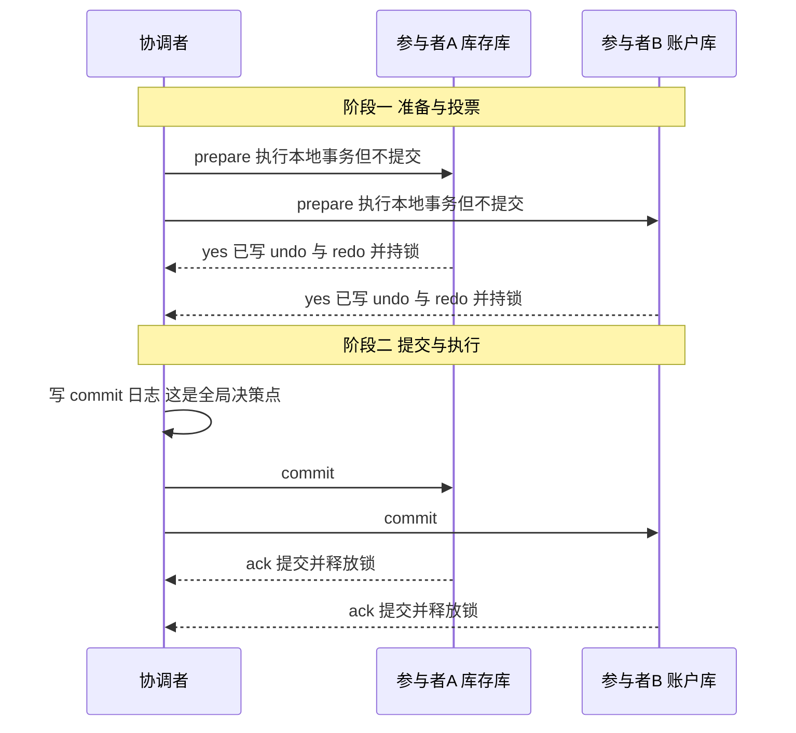
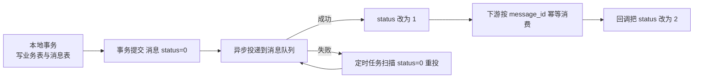

# 分布式事务

> 本章说明本地事务为什么在跨库、跨服务的调用链上失效，并对比 2PC、TCC、可靠消息与 Seata 各模式的一致性强度与落地代价。

单个数据库上的事务由 MySQL 自己保证：连接开启事务后，`BEGIN` 到 `COMMIT` 之间的多条语句要么全部生效，要么全部回滚。但这个保证的作用范围只有"一个连接、一个实例"，一旦一次下单要同时扣库存、扣余额、写订单，而这些操作落在不同的库或不同的服务上，MySQL 就无能为力了。本篇要解决的问题是：跨库或跨服务的业务操作怎样保证数据一致，以及在不同一致性要求下应该选哪种方案。

本篇承接第 19 篇《分布式 ID 方案》：那篇解决"数据落在哪个分片、主键怎样全局唯一"，本篇解决"数据分散之后，一次业务操作怎样保持一致"。

## 1.为什么需要分布式事务

### 1.1 本地事务的边界

本地事务的 ACID 由 InnoDB 在单实例内实现：原子性与持久性靠 redo log，一致性靠 undo log 回滚，隔离性靠锁与 MVCC。这些机制全部围绕"一个连接上的一条事务"工作，因此本地事务的作用边界可以概括成一句话：同一个数据库连接、同一个实例。

不同连接之间没有事务语义：连接 A 提交或回滚，连接 B 感知不到，数据库也不会把两个连接的修改合并成一个原子单位。所谓分布式事务，就是在这条边界之外重新建立"要么全成功、要么全回滚"的能力。

|场景|事务边界|本地事务是否够用|
|---|---|---|
|单库单表多条写入|一个连接|够用，直接 `@Transactional`|
|单库多表多条写入|一个连接|够用，InnoDB 支持多表事务|
|同库不同连接分别提交|两个连接|不够用，两个连接各自提交，互不感知|
|跨库（订单库与库存库）|两个连接、两个实例|不够用，任一库提交失败都无法整体回滚|
|跨服务（订单服务与账户服务）|两次远程调用|不够用，远程调用没有事务语义|

### 1.2 `@Transactional` 为什么失效

Spring 的 `@Transactional` 只是声明式包装：它在本方法开始时通过数据源拿到连接、关闭自动提交，方法正常返回时提交，抛异常时回滚。它能力的天花板是"一个数据源、一个连接"。

跨服务调用时，`ServiceA.methodA()` 内部通过 HTTP 或 RPC 调用 `ServiceB.methodB()`，两个方法运行在不同进程、不同连接上：

```text
订单服务（order_db）
  BEGIN
    扣减订单库的优惠券  OK
    RPC 调用库存服务  ->  扣减库存（stock_db）  已提交，无法撤回
  COMMIT / ROLLBACK 只能作用于订单库这一个连接
```

库存服务自己提交完就结束了，订单服务之后回滚，库存不会跟着恢复。若在订单服务里再写一段"调用失败后远程补偿"，那已经不是事务，而是人工补偿逻辑，要自己处理重试、幂等与对账。

几种常见的失效写法：

|写法|预期|实际结果|
|---|---|---|
|在调用方方法上加 `@Transactional`，方法内 RPC 调远程服务|远程失败时整体回滚|只回滚调用方所在库，远程已提交的数据留在库里|
|在被调用方方法上加 `@Transactional`|调用方异常时被调用方回滚|被调用方已提交，调用方异常与它无关|
|在方法内 `try` 住异常后不抛出|事务整体回滚|异常被吞掉，事务照常提交|
|把 `@Transactional` 加在 `private` 方法或同类内部调用|事务生效|Spring 代理不拦截，事务完全不生效|
|跨库操作使用同一个 `@Transactional`，但配了多个数据源|两个库一起回滚|默认只有一个数据源参与事务，另一个独立提交|

最后一行尤其容易踩：多数据源场景下，`@Transactional` 只绑定其中一个数据源，另一个库的写入是自动提交的独立事务。

### 1.3 半成功的危害：下单扣库存与扣余额

把问题具体化。一次下单需要做两件事：库存库把商品库存减 1，账户库把用户余额减去订单金额。两个操作在两个库上，任意一步失败，另一侧都已经提交，数据库里就留下了"半成功"的中间状态。

|失败位置|库存库状态|账户库状态|业务后果|
|---|---|---|---|
|扣库存成功、扣余额失败|已减 1|余额未扣|货少卖了，钱没收，库存凭空减少，需人工核对补回|
|扣余额成功、扣库存失败|未减|已扣款|用户付了钱拿不到货，必须退款，客诉与资损同时发生|
|扣库存成功、扣余额成功、写订单失败|已减|已扣款|订单不存在但钱货已动，无法按订单号定位这笔业务，对账困难|
|先扣余额再扣库存，扣库存时超时|状态未知|已扣款|超时不等于失败，重试可能导致重复扣款|

两张表拆解这两类错误的方向：

|错误方向|含义|后果|
|---|---|---|
|少扣（漏做）|两边都没做或只有一侧做，业务量被低估|少卖货、少收钱，业务规模与账目对不上|
|多扣（重复做）|重试导致同一笔业务被扣两次|用户资金受损，属于资损事故，比少扣更严重|
|扣了又退|一侧成功后走人工或自动退款|退款次数、对账周期、财务流程都要额外设计|

半成功的根本原因是"两次提交不在一个原子单位里"，而且第二次提交的结果在超时场景下是不确定的：超时可能是对端未收到请求，也可能是请求已执行但响应丢了。数据库层面已经没有办法解决，只能引入分布式事务方案，让"提交"这件事在多个资源上有统一的决策点。

在讨论方案之前，先明确目标：分布式事务要尽量减少半成功的时间窗口，而不是简单地把两个操作放进一个方法里。这个目标有代价，代价就是一致性、可用性与性能之间的取舍，也就是下一节的 CAP 与 BASE。

## 2.CAP 与 BASE

方案之间的差异，归根到底是"一致性、可用性、分区容忍度"三者取舍位置不同。先把三个词的含义与组合关系讲清楚，后面的参数对比才有落脚点。

### 2.1 三者为什么不可同时满足

|字母|全称|含义|在业务里的表现|
|---|---|---|---|
|C|Consistency，一致性|任意时刻所有节点读到的都是同一份最新数据|刚扣完的余额，任何节点读到的都是扣完后的值|
|A|Availability，可用性|每个请求都能在有限时间内得到非错误响应|请求不排队、不报错，但可能读到旧值|
|P|Partition tolerance，分区容忍度|节点间消息丢失或延迟时系统仍能对外提供服务|机房链路抖动时系统继续读写|

结论常被误读成"三者选两个"，正确的读法是：

- P 是网络属性，不是可以主动放弃的选项：数据分布在多台机器上，分区迟早会发生。
- 分区一旦发生，系统必须即时在 C 和 A 之间决策：要么拒绝部分请求保证一致（CP），要么接受请求允许读到旧值（AP）。
- 真正可选的是 CP 与 AP；CA 只存在于"永不分区"的假设里，单机 MySQL 就是这种假设的产物。

|组合|放弃|含义|能否成立|典型系统|
|---|---|---|---|---|
|CA|P|既一致又可用，但假设网络不出错|不成立，分区必然发生|单机 MySQL，做主从后就要重新衡量|
|CP|A|分区时拒绝或阻塞部分请求，保证一致|成立|ZooKeeper、etcd、多数派提交的分布式数据库|
|AP|C|分区时各节点继续读写，数据短暂不一致后收敛|成立|Eureka、Cassandra、DNS、多数互联网业务库|

### 2.2 为什么分布式系统通常选 AP 加最终一致

- 网络分区与节点故障是常态，"分区时拒绝服务"要先问业务是否接受不可用。
- 用户体验上"稍后重试成功"优于"当场报错"：读商品详情晚几百毫秒没人投诉，页面打不开才会投诉。
- CP 的代价不只是不可用：多数派协议要额外 RPC 与日志持久化，跨机房写入延迟从毫秒级涨到几十毫秒。
- 业务对短时不一致的容忍度常比想象的高：积分晚到几分钟、物流状态晚更新一次，都不构成事故。

|判据|倾向 AP|倾向 CP|
|---|---|---|
|短时间读到旧数据|可以接受，例如商品列表、积分余额|不可接受，例如扣款是否成功|
|请求被拒绝|不可接受，例如下单、支付|可以接受，例如后台报表、批量任务|
|数据冲突|少见，或可事后合并|必须提前避免，例如库存超卖|

### 2.3 BASE 的三个含义

选了 AP，就要给"不一致的中间状态"一个说法和收敛方式，这就是 BASE：

|缩写|英文|含义|实现手段|
|---|---|---|---|
|BA|Basically Available，基本可用|允许损失部分可用性：降级、限流、排队、只读，而不是整体不可用|非核心功能关闭、读走缓存、请求排队、返回兜底数据|
|S|Soft state，软状态|允许数据存在中间状态，且中间状态不阻塞后续操作|订单"支付中"、库存"预占中"、消息"待投递"|
|E|Eventually consistent，最终一致|不保证任意时刻一致，只保证没有新写入后各副本最终收敛|定时任务补正、消息重投、定期对账|

BASE 与 ACID 的差别不在术语，而在"中间状态是否被业务承认"：

|对比项|ACID|BASE|
|---|---|---|
|一致性|强一致，提交那一刻对所有读者可见|最终一致，存在可观察到旧值的窗口|
|中间状态|不允许，事务要么全做要么全不做|允许，软状态本身就是业务语义的一部分|
|优先级|为一致可以牺牲可用|为可用可以牺牲短时一致|
|典型实现|本地事务、2PC/XA|TCC、可靠消息、本地消息表、最大努力通知|
|代价落点|并发度与吞吐|业务复杂度：幂等、补偿、对账都要自己写|

BASE 不是"不用管一致性"，而是把一致性从数据库的责任转成业务的责任：中间状态谁可见、失败怎么补、怎么确认最终确实一致了，这三个问题必须由业务回答，定期对账是最后一道验证。

## 3.方案总览

在动手选方案之前，先把候选方案放在同一张表里对齐。"一致性强度"指方案承诺的一致性语义，"对业务侵入程度"指业务代码要为这个方案额外写多少东西。

### 3.1 方案横向对比

|方案|一致性强度|性能开销|对业务侵入程度|是否依赖中间件|适用场景|
|---|---|---|---|---|---|
|2PC / XA|强一致，提交阶段存在极短的不一致窗口|高，准备阶段起全程持锁，同步阻塞|低，改动集中在事务管理器|否，需要数据库支持 XA|同构数据库、并发不高、能接受锁等待的存量系统|
|3PC|理论强一致，实际仍可能不一致|比 2PC 更高，多一轮 RPC 与更复杂的超时判断|低|否|几乎不用于生产，主要用于理解协议演进|
|TCC|业务层面强一致，全局层面最终一致|中，三次业务调用，不长持有数据库锁|高，每个参与方要实现 Try、Confirm、Cancel|否，需要协调器与幂等基础设施|资金、库存等需要预留资源的核心链路|
|可靠消息最终一致|最终一致|低，主链路只写一次，下游异步化|中，要处理消息回查与消费幂等|是，需要消息队列|订单成功后驱动积分、优惠券、物流等下游|
|本地消息表|最终一致|中低，每次业务多写一张表|中，需要额外的表结构与定时任务|否，数据库本身就充当队列|不能引入 MQ、希望复用现有数据库的团队|
|最大努力通知|最终一致，且不保证送达|低|低，但必须配套对账|否|对外通知类场景，例如支付结果回调第三方|
|Seata XA|强一致|高，本质是把 XA 交给 Seata 调度|低，接入即用|是，需要 Seata Server|已有 XA 能力、希望统一接入 Seata 的场景|
|Seata AT|最终一致，默认近似读未提交|低，一阶段即提交本地事务|极低，加一个注解|是，需要 Seata Server|大多数基于关系型数据库的业务|
|Seata TCC|最终一致|中|高，与手写 TCC 相当|是|需要预留资源、对回滚精度要求高的场景|
|Seata SAGA|最终一致|中低，长流程逐段推进|中，每个节点要定义正向与补偿动作|是|步骤多、流程长、每步都能定义补偿的业务|

读这张表有三条经验：

- 强一致方案的开销集中在锁：2PC/XA 与 Seata XA 一阶段就锁住资源，参与者越多、链路越长，锁等待越严重。
- 侵入度低不等于总成本低：Seata AT 只加一个注解，但隔离性弱、脏写检测依赖全局锁，异常场景要人工介入。
- 最终一致方案的成本都落到了业务侧：幂等、重试、对账三件事，无论选哪种柔性方案都躲不掉。

### 3.2 两条主线：强一致与最终一致

抛开具体产品，方案可以归成两条主线：

|主线|做法|代表|适合什么业务|
|---|---|---|---|
|强一致主线|提交前先让所有参与方"准备好"，只有全体同意才真正提交|2PC/XA、3PC、Seata XA|参与者少、并发低、对锁等待不敏感的内部系统|
|最终一致主线|先让某一方确认成功，再通过重试、补偿或消息把其余各方追平成一致|TCC、可靠消息、本地消息表、最大努力通知、Seata AT/TCC/SAGA|高并发互联网业务，能接受秒级到分钟级的一致性窗口|

选哪条主线，回到第 2 节的三条判据即可：短时旧数据能否接受、请求能否被拒绝、冲突能否事后合并。能接受最终一致的，就不要为了"看起来更严谨"去选强一致方案，付出的通常是吞吐和可用性。

## 4.2PC 与 3PC

2PC（Two-Phase Commit，两阶段提交）是最早被标准化的分布式事务协议，XA 就是它在数据库层面的实现：数据库作为参与者提供 prepare 与 commit 接口，事务管理器作为协调者统一指挥。

### 4.1 协调者与参与者

|角色|职责|在 XA 里的对应物|
|---|---|---|
|协调者（事务管理器）|分配全局事务 ID，向所有参与者下发 prepare 与 commit/rollback，并记录全局决策日志|应用侧的 JTA 事务管理器，或中间件里的事务协调组件|
|参与者（资源管理器）|执行本地事务、持有本地资源锁，按指令提交或回滚，把结果回报给协调者|支持 XA 的数据库连接，例如 MySQL 的 XA 事务|

参与者不知道别人投了什么票，也不知道全局结果是提交还是回滚，它只服从协调者的指令，这一点是所有缺点的根源。

### 4.2 两个阶段

阶段一（准备，也叫投票）：

- 协调者生成全局事务 ID，向所有参与者发送 prepare。
- 参与者执行本地事务但不提交，把 undo 与 redo 写入日志，并锁住涉及的资源。
- 参与者回复 yes（可以提交）或 no（无法提交）。

阶段二（提交，也叫执行）：

- 协调者汇总投票：全体 yes 就写 commit 日志并向所有参与者发送 commit，否则写 abort 日志并发送 rollback。
- 参与者收到 commit 就提交本地事务并释放锁，收到 rollback 就回滚并释放锁，最后回复 ack。



只要有参与者投 no，或协调者在超时时间内收不齐投票，第二阶段就改成下发 rollback，双方回滚后释放锁。

### 4.3 缺点

|缺点|成因|具体表现|缓解思路|
|---|---|---|---|
|同步阻塞|准备阶段就持有资源锁，直到第二阶段结束才释放|并发越高锁冲突越重，吞吐随参与者增多而下降，热点行容易锁等待超时|缩小事务范围、减少参与者、避开热点行|
|协调者单点|全局决策只在协调者手里，参与者只能等指令|协调者宕机后参与者长期持锁，整条链路卡死|协调者高可用、决策日志持久化、超时后由补偿程序或人工介入|
|参与者准备后宕机|参与者已投 yes 并持锁，重启后既没收到 commit 也没收到 rollback|协调者重发 commit 时该参与者不可达，其余参与者已提交，恢复后数据不一致|靠协调者反复重试加本地日志，这是 2PC 无法根除的问题|
|决策信息丢失|协调者发完一部分 commit 后崩溃|部分参与者提交、部分未提交，且没有日志可查|决策必须先写日志再发送，重启后按日志重发|

在 MySQL 上还有一个具体表现：参与者在 `XA PREPARE` 之后如果连接断开，这个 XA 事务会一直挂在实例上占着锁，只能靠 `XA RECOVER` 找到它，再人工决定提交还是回滚。

### 4.4 3PC 做了什么，又为什么不够

3PC 在 2PC 前面加了一轮 CanCommit，把准备阶段拆成"只问不做"和"做了但没提交"两步：

|阶段|协调者做什么|参与者做什么|与 2PC 的关系|
|---|---|---|---|
|CanCommit|询问参与者能否执行本次事务|只做可行性判断，不写日志也不加锁|2PC 没有，用来过滤注定失败的参与者|
|PreCommit|收到全体 yes 后下发 preCommit|执行本地事务、写 undo 与 redo、加锁，回复 ack|相当于 2PC 的准备阶段|
|DoCommit|收到全体 ack 后写 commit 日志并下发 commit|提交本地事务并释放锁|相当于 2PC 的提交阶段|

3PC 的关键改动是超时提交：参与者进入 PreCommit 之后如果等 DoCommit 超时，默认选择提交。理由是能走到 PreCommit 说明全体参与者都投过 yes，此时提交是更可能正确的选择。

但它并不能彻底解决问题：

- 网络分区下，一部分参与者因超时选择提交，另一部分因没进入 PreCommit 而回滚，结果仍然不一致，只是把不一致的窗口换了位置。
- 多一轮 RPC、多一层超时判断，性能比 2PC 更差，协调者与参与者的状态机也更难实现正确。
- 生产环境几乎不用 3PC，它的价值在于说明"多问一轮加超时提交"能缓解阻塞，但绕不开 CAP：分区发生时，要么牺牲一致，要么牺牲可用。

## 5.TCC

TCC（Try-Confirm-Cancel）把"提交"这件事从数据库层搬到业务层：每个参与方提供三个业务接口，协调器按顺序调用它们完成一次全局事务。

### 5.1 三个动作

|动作|做什么|失败后怎么办|
|---|---|---|
|Try|检查并预留资源，把资源从"可用"转到"预占"|返回失败，协调器改调 Cancel|
|Confirm|确认使用预留的资源，让预占变成真实消耗|重试直到成功，Confirm 不允许"失败后回滚"|
|Cancel|释放预留资源，让资源回到"可用"|重试直到成功，必须幂等|

用扣库存与扣余额举例，三个动作的业务含义如下：

|参与方|Try|Confirm|Cancel|
|---|---|---|---|
|库存服务|可用库存减 1，预占库存加 1|预占库存减 1，真实出库|可用库存加 1，预占库存减 1|
|账户服务|余额减 100，冻结金额加 100|冻结金额减 100，真实扣款|余额加 100，冻结金额减 100|
|订单服务|插入订单，状态为待确认|订单状态改为已完成|订单状态改为已取消|

```sql
-- Try：可用库存转入预占，条件里带上"可用库存足够"，避免出现负库存
UPDATE stock SET available = available - #{count}, frozen = frozen + #{count}
WHERE sku_id = #{skuId} AND available >= #{count};

-- Confirm：预占转真实出库，不再校验可用库存
UPDATE stock SET frozen = frozen - #{count} WHERE sku_id = #{skuId};

-- Cancel：预占退回可用
UPDATE stock SET available = available + #{count}, frozen = frozen - #{count}
WHERE sku_id = #{skuId};
```

TCC 与 2PC 最本质的差别是锁的位置：2PC 锁在数据库的行上，跨越前后两个阶段；TCC 用业务字段（available、frozen）记录状态，数据库事务只在单个接口内短暂存在，因此不存在跨阶段的数据库锁。

### 5.2 三个经典问题与各自的解法

|问题|表现|成因|解法|
|---|---|---|---|
|空回滚|Try 还没执行，Cancel 先到了，回滚把没有预占的资源又退了一次|Cancel 由协调器在自己超时后主动发起，与 Try 是否执行无关|Cancel 先查事务状态记录：查不到 Try 记录就直接返回成功，不执行业务操作|
|幂等|Confirm 或 Cancel 被重复调用，余额被多扣或多退|协调器重试、网络重发都会让同一接口被调用多次|用唯一业务标识（全局事务 ID 加分支 ID）建去重表，重复请求直接返回上次结果|
|悬挂|Cancel 先执行完，之后迟到的 Try 又执行成功，预留的资源再没有人释放|网络延迟让 Try 晚到，而这段全局事务已经结束|状态表里标记"已回滚"，Try 执行前先检查标记，发现已回滚就拒绝执行|

三个问题共用一个基础设施：事务状态记录表。它同时承担去重、标记与查询三件事。

```sql
CREATE TABLE tcc_transaction_log (
    tx_id       VARCHAR(64)  NOT NULL COMMENT '全局事务 ID',
    branch_id   VARCHAR(64)  NOT NULL COMMENT '分支事务 ID',
    biz_key     VARCHAR(128) NOT NULL COMMENT '唯一业务标识，例如订单号',
    tx_status   TINYINT      NOT NULL COMMENT '1=Try 成功 2=Confirm 成功 3=Cancel 成功 4=已回滚拦截',
    retry_count INT          NOT NULL DEFAULT 0 COMMENT '重试次数，用于告警',
    update_time DATETIME     NOT NULL DEFAULT CURRENT_TIMESTAMP ON UPDATE CURRENT_TIMESTAMP,
    PRIMARY KEY (tx_id, branch_id),
    UNIQUE KEY uk_biz_key (biz_key)
) ENGINE = InnoDB DEFAULT CHARSET = utf8mb4 COMMENT = 'TCC 事务状态与幂等去重表';
```

三个接口按同一套流程使用这张表：

- Try 先按 biz_key 插入状态记录，唯一键冲突说明这是重复请求，直接返回成功；插入成功后预留资源并写入 tx_status。
- Cancel 先按 tx_id 与 branch_id 查记录：查不到说明 Try 未执行，写入一条 tx_status = 4 的拦截记录并返回成功，这就是空回滚的解法；查到且已经是 Cancel 状态，说明是重复调用，直接返回成功。
- Cancel 执行过之后，迟到的 Try 查表会看到 tx_status = 3 或 4，于是拒绝执行，这就是悬挂的解法。

落地时还要注意两点：三个接口都要按幂等实现，Confirm 与 Cancel 不允许抛业务失败，失败只能重试或进人工；预留资源要设置过期时间，长期挂起的预占会让库存永远卖不出去。

## 6.可靠消息最终一致与最大努力通知

这两类方案都靠重试兜底，区别在于谁来保证消息送到下游：一个是消息中间件或本地消息表，一个是通知方的重试任务。

### 6.1 本地消息表

思路是把"要发给下游的消息"与业务数据写进同一个本地事务：同库同连接，本地事务天生保证原子性，"业务成功但消息丢失"这个窗口就此消失，剩下的只是把消息异步投递出去。

```sql
CREATE TABLE local_message (
    id            BIGINT       NOT NULL AUTO_INCREMENT,
    message_id    VARCHAR(64)  NOT NULL COMMENT '消息唯一 ID，消费端用它做幂等',
    biz_type      VARCHAR(32)  NOT NULL COMMENT '业务类型，例如 ORDER_PAID',
    payload       TEXT         NOT NULL COMMENT '消息体，通常是 JSON',
    status        TINYINT      NOT NULL DEFAULT 0 COMMENT '0=待投递 1=已投递 2=消费确认',
    retry_count   INT          NOT NULL DEFAULT 0 COMMENT '已重试次数',
    next_retry_at DATETIME     DEFAULT NULL COMMENT '下次投递时间，退避用',
    create_time   DATETIME     NOT NULL DEFAULT CURRENT_TIMESTAMP,
    PRIMARY KEY (id),
    UNIQUE KEY uk_message_id (message_id),
    KEY idx_status_next (status, next_retry_at)
) ENGINE = InnoDB DEFAULT CHARSET = utf8mb4 COMMENT = '本地消息表';
```

投递流程：



定时任务兜住所有投递失败，扫描频率决定一致性窗口的长度：

```sql
-- 每分钟扫描一次：捞出到期的待投递消息，失败后按退避时间推迟重试
SELECT id, message_id, biz_type, payload FROM local_message
WHERE status = 0 AND (next_retry_at IS NULL OR next_retry_at <= NOW())
ORDER BY id LIMIT 200;
```

本地消息表的优势是不引入新组件，数据库本身就是消息存储；代价是消息表与业务表抢同一份数据库资源，消息量大时这张表的清理与索引都要单独设计。

### 6.2 RocketMQ 事务消息

事务消息把本地消息表的思路搬进了消息中间件，用"半消息加回查"替代业务自己建表。半消息指已经写入 Broker 但对消费者不可见的消息。

|步骤|谁做|动作|失败或超时怎么办|
|---|---|---|---|
|1|生产者|发送半消息，消息落在 Broker，对消费者不可见|发送失败直接抛异常，本地事务不执行|
|2|生产者|执行本地事务，例如写订单表|本地事务失败就发 rollback，半消息被丢弃|
|3|生产者|按本地事务结果发送 commit 或 rollback|二次确认丢失时进入回查|
|4|Broker|长时间收不到二次确认，按间隔回查生产者|回查次数超过上限，消息按回滚处理|
|5|生产者|回查时按消息内容查本地事务表并回复状态|必须能查出结果，不能只依赖内存状态|
|6|Broker|收到 commit 后让消息对消费者可见并投递|消费失败由消息队列重投，消费端必须幂等|

回查是这套机制的关键：生产者崩溃或二次确认丢失时，Broker 会反复询问本地事务的结果，所以生产者必须能从持久化的地方（通常还是本地事务表）查出这次操作到底成功没有，只把结果放在内存变量里，重启后就丢了判断依据。

### 6.3 最大努力通知

最大努力通知的语义是：通知方尽力重试，但不承诺送达，被通知方必须能主动查询或对账。它适合对方系统不可控的场景，例如支付结果通知外部商户。

- 通知方按阶梯间隔重试：15 秒、30 秒、1 分钟、5 分钟、30 分钟、1 小时，超过最大次数后停止。
- 每次通知携带唯一通知 ID，被通知方据此做幂等，处理成功返回约定应答。
- 停止重试不等于放弃：被通知方的对账流程会定期拉取账单或调用主动查询接口，以对账结果为准修正本地状态。

|对比项|可靠消息最终一致|最大努力通知|
|---|---|---|
|是否保证送达|保证至少一次，靠中间件或定时任务重投|不保证，靠重试加定期对账|
|消息存储|消息中间件或本地消息表持久化|没有持久化队列，只有重试任务|
|对下游的要求|必须实现幂等消费|必须实现主动查询接口与对账流程|
|典型场景|内部服务之间的状态同步|对外部合作方的异步回调|

## 7.Seata

Seata 是阿里开源并捐给 Apache 的分布式事务框架，它把前面的协议收进同一套模型：一个全局事务（Global Transaction）下挂若干分支事务（Branch Transaction），由 TC、TM、RM 三种角色协作决定提交还是回滚，业务侧只加少量注解。

|角色|全称|职责|
|---|---|---|
|TC|Transaction Coordinator，事务协调者|独立部署的 Seata Server，维护全局事务与分支事务状态，驱动全局提交与回滚|
|TM|Transaction Manager，事务管理者|发起方一侧，负责开启全局事务、提交或回滚全局事务|
|RM|Resource Manager，资源管理者|参与方一侧，用数据源代理接管本地事务，向 TC 注册分支并上报执行结果|

### 7.1 四种模式对比

|模式|一致性强度|是否有全局锁|回滚依赖什么|性能|适用场景|
|---|---|---|---|---|---|
|XA|强一致|有，数据库行锁从一阶段持到二阶段|数据库自身的 XA 回滚能力|最差，锁持有时间覆盖整个全局事务|已有 XA 能力、并发不高、能接受锁等待的存量系统|
|AT|默认全局读未提交，最终一致|有，本地事务提交前申请全局锁|undo_log 里记录的前后镜像|好，一阶段就提交本地事务并释放本地锁|大多数基于关系型数据库的业务，改动最小|
|TCC|业务层面强一致，全局层面最终一致|无全局锁，资源靠业务字段预占|业务自己实现的 Cancel 接口|中，远程调用次数变成普通写法的三倍|资金、库存等需要预留资源的核心链路|
|SAGA|最终一致，只有补偿没有回滚|无|每个正向操作对应的补偿动作|中低，长流程逐段推进|步骤多、流程长的跨系统业务|

只有 XA 依赖数据库的 XA 能力，其余三种都把回滚逻辑写在业务代码或 Seata 生成的回滚日志里，所以 AT 能在不支持 XA 的库上铺开。还要分清两种锁：数据库行锁保护单分支的本地事务，全局锁保护整个全局事务，AT 用后者换掉了 XA 那种跨阶段的行锁等待。

### 7.2 AT 模式的两个阶段

AT（Auto Transaction）的目标是去掉 XA 的锁等待：一阶段就让每个分支直接提交本地事务，把"回滚时怎么办"提前写进 undo_log。

一阶段由 RM 在数据源代理里完成：解析业务 SQL 取出类型、表名、主键与条件，查出更新前的数据作为前镜像，执行业务 SQL 后按主键回查得到后镜像，向 TC 注册分支并申请这条记录的全局锁，最后把前后镜像与 SQL 信息写入 undo_log，与业务数据在同一个本地事务里提交，本地行锁随之释放。

二阶段由 TC 决定，只有两种结果：

|二阶段结果|触发条件|各分支做什么|
|---|---|---|
|全局提交|所有分支一阶段都成功|把请求放进异步队列后立即回复 TC，再异步批量删除对应的 undo_log，业务数据不需要再动|
|全局回滚|任一分支失败，或 TC 判定超时|开启新的本地事务，按 undo_log 中的前镜像反向补偿业务数据，再删除 undo_log|

全局回滚不是无脑覆盖，undo_log 里的校验才是关键：用后镜像与当前数据行比对，字段值相同说明这一行没有被本全局事务之外的动作改过，可以安全地用前镜像覆盖回去；字段值不同说明数据已被别人改过，直接覆盖会抹掉对方的修改，此时按配置策略处理，默认是抛出异常并留给人工核对。校验只比较本事务修改过的字段，未参与更新的字段不参与比较。

每个参与库都要有这张表，下面是 Seata 官方给出的 MySQL 版本：

```sql
CREATE TABLE undo_log (
    id            BIGINT       NOT NULL AUTO_INCREMENT,
    branch_id     BIGINT       NOT NULL COMMENT '分支事务 ID，由 TC 生成',
    xid           VARCHAR(100) NOT NULL COMMENT '全局事务 ID',
    context       VARCHAR(128) NOT NULL COMMENT '回滚信息的序列化方式，例如 serializer=jackson',
    rollback_info LONGBLOB     NOT NULL COMMENT '前后镜像与业务 SQL 信息，序列化后的二进制',
    log_status    INT          NOT NULL COMMENT '0=正常 1=全局已完成待清理',
    log_created   DATETIME     NOT NULL COMMENT '记录创建时间',
    log_modified  DATETIME     NOT NULL COMMENT '记录修改时间',
    PRIMARY KEY (id),
    UNIQUE KEY ux_undo_log (xid, branch_id)
) ENGINE = InnoDB DEFAULT CHARSET = utf8mb4 COMMENT = 'Seata AT 模式回滚日志表';
```

xid 与 branch_id 上的唯一键保证同一个分支不会写入两条日志；log_status 只标记这条日志还能不能清理，与事务隔离级别无关。

### 7.3 全局锁与写隔离

AT 一阶段提交本地事务后本地行锁立刻释放，两个全局事务完全可能交叉修改同一行：g1 先把 m 从 1000 改成 900 并提交，g2 再把它改成 800 并提交，此时 g1 若回滚，就会用前镜像 1000 覆盖回去，g2 的修改凭空消失，这就是脏写。全局锁的作用是让同一行在同一时刻只属于一个全局事务：后到的分支申请不到全局锁只能重试等待，超出重试范围就回滚自己的本地事务，因此不会出现两个全局事务都写过、回滚时互相覆盖的局面。

|锁|谁管|什么时候加|什么时候放|
|---|---|---|---|
|本地行锁|数据库|执行 DML 时|本地事务提交或回滚时，AT 一阶段提交即释放|
|全局锁|TC|本地事务提交前由 RM 申请|全局提交时在二阶段释放，全局回滚时在补偿完成后释放，也就是整个全局事务结束前一直持有|

写隔离的语义可以概括成三句：全局事务之间不会脏写；全局事务之间是串行的，同一热点行上的并发写会退化成排队；不经过 Seata 代理的写入不在保护范围内，这类写入要靠 `@GlobalLock` 或数据库约束自己兜住。

### 7.4 读隔离

Seata 官方文档的表述是：在数据库本地事务隔离级别为读已提交或以上的基础上，AT 模式的默认全局隔离级别是读未提交。这里有两层隔离，容易混在一起：

|层次|隔离级别|含义|
|---|---|---|
|本地事务|MySQL 默认是可重复读|每个分支自己的本地事务内，反复读同一行得到同一个快照版本|
|全局事务|AT 模式默认读未提交|某分支一阶段提交后数据即可见，即使整个全局事务还没提交|

本地事务的可重复读只保证自己这个连接看到的版本稳定，管不了别的连接；而全局事务的中间状态（某分支已提交、全局未提交）在默认配置下是能被别人读到的，业务若按本地事务的直觉写查询逻辑，就可能读到一个最终会回滚的值。确实需要全局读已提交时，Seata 的做法是代理 `SELECT ... FOR UPDATE`：这条语句会申请全局锁，锁被占用时先释放本地锁再重试，查询被阻塞直到拿到全局锁才返回，此时读到的是已提交数据；出于性能考虑，只有 FOR UPDATE 的 SELECT 会被代理，普通查询仍然是读未提交语义。

### 7.5 @GlobalTransactional 用法

发起方在业务入口方法上加注解，各分支的本地事务由 Seata 的数据源代理接管：

```java
// 发起方：一个注解决定全局提交还是回滚
@Service
public class OrderService {

    @Autowired
    private OrderMapper orderMapper;
    @Autowired
    private StockClient stockClient;

    @GlobalTransactional(name = "create-order", rollbackFor = Exception.class)
    public void createOrder(OrderDTO dto) {
        orderMapper.insert(dto.toOrder());        // 本地分支，代理会记录 undo_log
        stockClient.deduct(dto.getSkuId(), 1);    // 远程分支，同样跑在代理数据源上
    }
}

// 参与方：数据源换成 DataSourceProxy 后，原有的 @Transactional 语义不变
@Service
public class StockService {

    @Autowired
    private StockMapper stockMapper;

    @Transactional(rollbackFor = Exception.class)
    public void deduct(Long skuId, Integer count) {
        if (stockMapper.deduct(skuId, count) == 0) {
            throw new IllegalStateException("库存不足: " + skuId);
        }
    }
}
```

- `@GlobalTransactional` 由 Seata 的 TM 与 TC 接管，管的是跨库跨服务的一次全局决策；`@Transactional` 由 Spring 与数据库接管，管的是一个连接上的原子性，两者各管一层，可以叠加。
- 分支方法保留 `@Transactional` 是对的：先把本地事务回滚干净再上报 TC，由 TC 决定其他分支的命运。
- 只加 `@Transactional` 而漏掉 `@GlobalTransactional`，就退回第 1 节讲的失效写法：各自提交，谁也不管谁。

### 7.6 适用范围与注意事项

- 只支持能自动回滚的关系型数据库，SQL 要能被 Seata 解析出前后镜像，否则该分支会退回 XA 或直接报错。
- 跨服务调用必须也通过 Seata 代理的数据源访问数据库，绕开代理的 JDBC 连接不受管理，回滚不会带上它。
- 性能开销来自多次远程调用加全局锁：一次全局事务多了分支注册、全局锁申请、undo_log 读写与二阶段清理，热点行上的全局锁会把并发写变成排队。
- 避免大事务：一阶段 SQL 越多、涉及行越多，undo_log 越大，回滚越慢，全局锁持有时间也越长。
- undo_log 要定期清理，Seata Server 要高可用部署，否则 TC 单点会让所有全局事务一起卡住。

## 8.选型建议

|场景|推荐方案|理由|要额外做的事|
|---|---|---|---|
|资金类强一致要求高的场景|TCC，或 Seata XA|资金不允许出现中间状态被误读，宁可牺牲吞吐也要锁住资源|三个接口都要幂等，Confirm 与 Cancel 只能重试不能失败，预占资源要能过期回收|
|允许最终一致的订单与积分场景|可靠消息最终一致，或本地消息表|主链路只写一次，下游异步化，吞吐最好|消费端幂等、定时补投、定期对账|
|跨公司系统对接|最大努力通知加对账|对方系统不可控，无法要求对方参与你的事务|通知幂等、主动查询接口、以对账结果修正本地状态|
|单库多表事务|本地事务就够|同一个连接上的多表写入由 InnoDB 保证原子性|不要为了"看起来分布式"引入 Seata 或 MQ|
|已有 MQ 的团队|复用 MQ 做可靠消息|省掉 Seata Server 与 undo_log 的运维成本|回查或定时补投要做好，否则一致性无处落地|
|需要与外部系统对账的场景|最终一致方案加对账任务|对账是最终一致的最后一道验证|对账规则、差错处理流程、人工介入预案|

## 9.总结

1. 本地事务的边界只有"一个连接、一个实例"，跨库与跨服务调用没有事务语义，只加 `@Transactional` 挡不住已经提交的远程数据。
2. 一致性、可用性与分区容忍度不能同时满足，真正可选的是 CP 与 AP，互联网业务通常选 AP 加最终一致，并用 BASE 给中间状态一个说法。
3. 强一致方案的代价集中在锁，2PC/XA 与 Seata XA 一阶段就锁住资源；最终一致方案的代价落在业务侧，幂等、重试、对账三件事躲不掉。
4. 2PC 的缺点是同步阻塞、协调者单点、参与者准备后宕机与决策信息丢失；3PC 用多一轮 CanCommit 与超时提交缓解阻塞，但绕不开 CAP。
5. TCC 用 Try、Confirm、Cancel 把锁从数据库搬到业务字段，必须同时处理空回滚、幂等与悬挂三个问题，靠一张事务状态表统一解决。
6. 可靠消息最终一致的关键是让消息与业务数据在同一个本地事务里落盘；RocketMQ 事务消息用半消息加回查实现同一目标，生产者必须能从持久化存储查回本地事务结果。
7. 最大努力通知不承诺送达，被通知方必须能主动查询并对账，适合对方系统不可控的对外通知场景。
8. Seata AT 一阶段提交本地事务并写 undo_log，二阶段提交时异步删除 undo_log，回滚时用前镜像补偿、用后镜像校验，数据被别人改过就报错交人工。
9. AT 用全局锁实现写隔离，全局锁在一阶段申请、到全局事务结束才释放；读隔离默认是全局读未提交，需要全局读已提交时只能靠 `SELECT ... FOR UPDATE` 的代理。
10. 选型回到场景：本地事务够用的不引入中间件，资金类走 TCC，订单与积分走可靠消息，跨公司走最大努力通知加对账；分布式事务只缩短不一致窗口，定期对账才是最后一道验证。
