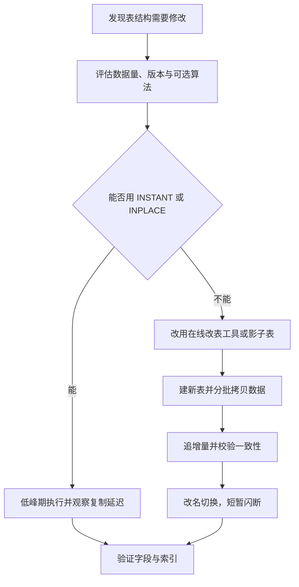
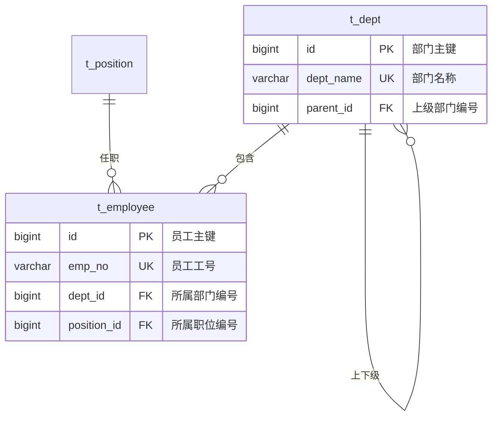

# 数据库设计规范与范式

> 本章说明建表之前必须先定下来的几组决策，以及范式、字段类型、主键索引与命名规范背后的取舍。

数据库设计里最贵的改动是表结构：字段类型一旦选定并落入大量数据，后续修改往往要重建整张表；主键一旦被别的表引用，替换它就要牵动所有关联数据。所以本篇的主线是先设计后建表，先算清改表的代价，再给出范式取舍、字段类型、主键与索引、命名这几组可以直接照着执行的规范，最后用一个完整的建表脚本把规范落到具体语句上。

## 1.为什么先设计后建表

改表结构不是不能做，而是代价随数据量增长：几百行的表毫秒级完成，上亿行的表可能要锁写好几分钟。要判断哪些决定必须提前想清楚，先要知道代价从哪里来。

### 1.1 各类改表操作的代价

MySQL 5.6 起引入在线 DDL，把 DDL 的执行方式分成三种算法：`COPY` 需要重建表并阻塞写，`INPLACE` 在原有表空间上修改、多数情况允许并发读写，`INSTANT` 只改数据字典、不碰数据文件。能不能用上后两种，取决于版本和具体操作。

|操作|默认算法|是否重建表|是否阻塞写入|说明|
|---|---|---|---|---|
|末尾加可空列|INSTANT（8.0.12 起）|否|否|只改数据字典，秒级完成|
|中间位置加列|INPLACE|是|允许并发写|列顺序变化要重排行的存储格式|
|扩大 varchar 长度|INPLACE|否|否|字节长度不超过 255 时可只改元数据|
|缩小 varchar 长度、改字段类型|COPY|是|阻塞写|每一行都要转换，还可能丢精度|
|加普通二级索引|INPLACE|否|允许并发写|要扫全表构建 B+ 树|
|加唯一索引|INPLACE|否|允许并发写|构建期间还要校验唯一性，耗时更长|
|加主键|COPY|是|阻塞写|要重建整个聚簇索引|
|修改表字符集|COPY|是|阻塞写|所有字符列都要转换|

经验上，只要操作落到 `COPY` 这一行，就要按"重建整张表"来估算耗时：磁盘上要能放下新表，执行期间还要占用双份 IO。

### 1.2 代价会沿着链路扩散

一次 DDL 的影响不限于执行它的那个实例：

|影响面|具体表现|
|---|---|
|业务写入|COPY 算法全程持有元数据锁，期间对该表的写请求排队，超时后直接报错|
|主从复制|DDL 会写进 binlog，从库要重放同样的操作，重放期间复制延迟上升|
|备份与恢复|元数据在 DDL 期间变化，可能让正在进行的备份作废|
|索引重建|改字段类型会同时重建该字段上的所有二级索引，耗时比想象的长|
|回滚困难|DDL 无法靠事务回滚，中途失败只能靠备份恢复|



大表 DDL 通常交给在线改表工具（`pt-online-schema-change`、`gh-ost`）完成：先建一张结构正确的新表，再分批拷贝数据并追同步增量，最后改表名切换。代价是整个过程要额外占一份磁盘和一段时间的双写开销。

### 1.3 必须提前定下来的决策

|决策|为什么难改|
|---|---|
|主键类型|被所有关联表和二级索引引用，替换等于全量改数据|
|字段类型与长度|类型变化通常要重建表，长度变化可能让已有数据超限|
|字符集与排序规则|全库统一之后改动等于重写所有文本列|
|分片键|决定数据分布，事后更换要重新分布全部数据|
|是否使用外键约束|上线后再加约束，历史脏数据会让约束根本加不上|
|时间字段语义|是存本地时间还是存 UTC，混用之后无法统一|

反过来，普通列、字段注释、非唯一的普通索引都可以随时调整，不必在设计阶段反复纠结。

## 2.三范式与反范式

范式是减少数据冗余的规则，反范式是为了查询性能主动引入冗余。两者不是对错关系，而是针对读写比例和一致性要求做的取舍。

### 2.1 第一范式：字段保持原子

第一范式要求每个字段只存一个不可再分的值。把多个值拼成一个字符串塞进字段，就违反了它：

|反例|问题|改法|
|---|---|---|
|`skill varchar(255)` 存"Java,Python,Redis"|无法用索引按单个技能查询，统计要拆字符串|拆出员工技能关联表，一行一个技能|
|`phone` 存"138xxxx,139xxxx"|一个人多个号码时长度不可控，校验无法做|拆出联系电话表，加类型字段|

### 2.2 第二范式：非主键字段依赖整个主键

第二范式要求非主键字段完全依赖于完整主键，不能只依赖主键的一部分。这主要针对联合主键的表：

|表|主键|问题字段|违反原因|
|---|---|---|---|
|订单明细|(order_id, product_id)|product_name|只依赖 product_id，属于部分依赖|
|员工项目|(emp_id, project_id)|emp_name|只依赖 emp_id，属于部分依赖|

改法是把只依赖部分主键的字段搬回它真正依赖的那张表：商品名放回商品表，员工姓名放回员工表。明细表只保留关系本身的属性，比如数量、加入时间。

### 2.3 第三范式：非主键字段之间不能互相依赖

第三范式要求非主键字段之间没有传递依赖。员工表里同时存部门编号和部门名称，就是典型的传递依赖：`emp_id` 决定 `dept_id`，`dept_id` 又决定 `dept_name`，于是 `dept_name` 传递依赖于主键。

```sql
-- 反例：同一张表里既存部门编号，又存部门名称和负责人
CREATE TABLE t_employee_bad (
    id BIGINT UNSIGNED NOT NULL COMMENT '员工主键',
    emp_name VARCHAR(64) NOT NULL COMMENT '员工姓名',
    dept_id BIGINT UNSIGNED NOT NULL COMMENT '所属部门编号',
    dept_name VARCHAR(64) NOT NULL COMMENT '部门名称，冗余',
    dept_leader VARCHAR(64) NOT NULL DEFAULT '' COMMENT '部门负责人，冗余',
    PRIMARY KEY (id)
) ENGINE = InnoDB DEFAULT CHARSET = utf8mb4 COMMENT = '员工表反例';
```

部门改名时，这张表里属于该部门的每一行都要改，漏改一行就出现同一部门两个名字。按第三范式拆成两张表：

```sql
CREATE TABLE t_dept (
    id BIGINT UNSIGNED NOT NULL AUTO_INCREMENT COMMENT '部门主键',
    dept_name VARCHAR(64) NOT NULL COMMENT '部门名称',
    leader VARCHAR(64) NOT NULL DEFAULT '' COMMENT '部门负责人',
    create_time DATETIME NOT NULL DEFAULT CURRENT_TIMESTAMP COMMENT '创建时间',
    update_time DATETIME NOT NULL DEFAULT CURRENT_TIMESTAMP ON UPDATE CURRENT_TIMESTAMP COMMENT '更新时间',
    PRIMARY KEY (id),
    UNIQUE KEY uk_dept_name (dept_name)
) ENGINE = InnoDB DEFAULT CHARSET = utf8mb4 COLLATE = utf8mb4_0900_ai_ci COMMENT = '部门表';

CREATE TABLE t_employee (
    id BIGINT UNSIGNED NOT NULL AUTO_INCREMENT COMMENT '员工主键',
    emp_no VARCHAR(32) NOT NULL COMMENT '员工工号',
    emp_name VARCHAR(64) NOT NULL COMMENT '员工姓名',
    dept_id BIGINT UNSIGNED NOT NULL DEFAULT 0 COMMENT '所属部门编号',
    create_time DATETIME NOT NULL DEFAULT CURRENT_TIMESTAMP COMMENT '创建时间',
    PRIMARY KEY (id),
    UNIQUE KEY uk_emp_no (emp_no),
    KEY idx_dept_id (dept_id)
) ENGINE = InnoDB DEFAULT CHARSET = utf8mb4 COMMENT = '员工表';
```

三个范式在员工与部门这对表上的检查点：

|范式|要求|员工表的检查点|拆分结果|
|---|---|---|---|
|第一范式|字段不可再分|技能不能存成"Java,Python"|拆出员工技能表|
|第二范式|非主键字段依赖完整主键|主键是单列，天然满足|联合主键的关系表要按主键拆|
|第三范式|非主键字段之间无依赖|部门名只依赖于部门编号|部门信息整体移到部门表|

### 2.4 什么时候主动反范式

范式化之后关联变多，列表页查一屏数据可能要连三张表。读多写少的场景里，这个代价常常比冗余更大，这时才值得主动反范式：

|场景|反范式做法|收益|
|---|---|---|
|列表页要显示部门名|员工表冗余一列 `dept_name`|省掉与部门表的关联，列表只扫一张表|
|报表统计|按天预计算，落到汇总表|把实时聚合变成一次范围查询|
|读多写少|文章表冗余 `author_name`、`comment_count`|详情页不关联用户表，也不实时 count|
|历史快照|订单明细冗余下单时的单价与商品名|商品改价改名不影响历史订单，符合业务语义|
|计数器|冗余 `like_count`，用原子更新维护|避免每次展示都去聚合明细表|

注意倒数第二行与前几行性质不同：下单时的单价是业务事实，即使范式上也说得通（它依赖订单行而不是商品），这类字段的价值在于保留快照，不叫冗余。

### 2.5 反范式的代价

|代价|表现|兜底手段|
|---|---|---|
|冗余字段不一致|员工换部门后 `dept_name` 还是旧的|放在同一个事务里更新，写入统一收口到服务层|
|漏更新|新增的入口直接写库，绕过了同步逻辑|所有写路径收敛到一个方法，禁止跨服务直连写库|
|错误长期无人发现|冗余字段错了一直没人核对|定时对账任务比对冗余值与真实值，差异告警|
|写放大|一次变更要更新多张表或多次更新同一行|热点行会变成锁竞争点，计数器可分批或异步更新|

判断标准只有一条：被冗余的数据是否很少变化，而查询是否非常频繁。反过来的情形（字段经常变、查询很少）没有任何理由冗余。

### 2.6 范式与反范式对比

|维度|范式化|反范式|
|---|---|---|
|数据冗余|少|多|
|一致性|由结构和事务天然保证|靠应用逻辑与对账保证|
|查询方式|多表 join|少 join 或不 join|
|写入成本|改动点单一|一次业务写入可能更新多处|
|查询性能|关联多时下降|单表查询快|
|存储占用|低|高|
|适用场景|写多、以事务为主的系统|读多写少、列表与报表|

实际项目里几乎都是混合方案：核心交易相关的表按范式拆分，展示与统计用冗余列或汇总表补齐。

## 3.字段类型选择规范

字段类型的选择有三条原则：能用最小的类型就不放大；同一个含义在所有表里用同一个类型；金额和时间这类精度敏感的值只能用专门类型。

### 3.1 整数类型

|类型|字节|有符号范围|无符号范围|典型用途|
|---|---|---|---|---|
|tinyint|1|-128 到 127|0 到 255|状态、性别、是否删除等小枚举|
|smallint|2|-32768 到 32767|0 到 65535|年份、排序号、小规模计数|
|mediumint|3|-8388608 到 8388607|0 到 16777215|中等规模的计数，实际项目很少用|
|int|4|-2147483648 到 2147483647|0 到 4294967295|数量、普通业务数值|
|bigint|8|-9223372036854775808 到 9223372036854775807|0 到 18446744073709551615|主键、关联字段、以分存金额、大计数|

三条硬性约定：

|约定|写法|理由|
|---|---|---|
|主键统一用 bigint|`id BIGINT UNSIGNED NOT NULL AUTO_INCREMENT`|int 上限约 21 亿，高写入业务几年就会逼近；改主键类型要重建表并同步改所有引用它的表|
|关联字段与主键同类型|`dept_id BIGINT UNSIGNED NOT NULL`|类型不一致会触发隐式类型转换，让关联字段上的索引失效|
|状态用 tinyint 加注释|`status TINYINT NOT NULL DEFAULT 0 COMMENT '1 在职 2 离职'`|比 varchar 省空间，也不会出现 '1 ' 与 '1' 两个值|

`int(11)` 里的 11 是显示宽度，不改变存储空间与取值范围；MySQL 8.0.17 起已废弃整数类型的显示宽度（`zerofill` 除外），建表时不必再写。无符号类型的取舍要谨慎：它能扩大正数范围，但 Java 语言没有无符号整数，且两个无符号值相减可能直接报错，只在确定不为负且确实需要更大范围时使用。

### 3.2 字符类型

|维度|char|varchar|
|---|---|---|
|存储方式|定长，不足部分用空格补足|变长，额外用 1 到 2 字节记录实际长度|
|尾部空格|写入时补空格，读取时自动去掉尾部空格|原样保存|
|读写性能|定长，更新不会引起行长度变化|变长，更新变长时可能要移动行|
|最大长度|255 字符|受行大小与索引前缀长度限制，通常不超过 65535 字节|
|适用场景|长度固定的编码：MD5、国家代码、性别、去掉连字符的 UUID|长度可变的名称、标题、地址、备注|

选择依据很简单：长度几乎恒定且很短就用 `char`，其余用 `varchar`。长度按业务实际需要给，不要一律写 255，过长的定义会让临时表和排序缓冲区按更大长度分配内存。

字符集统一用 `utf8mb4`，原因在于历史坑：

|字符集|每字符最大字节|能否存 emoji 与生僻字|说明|
|---|---|---|---|
|utf8（即 utf8mb3）|3|不能|插入 4 字节字符会报 Incorrect string value，或被截断成乱码|
|utf8mb4|4|能|MySQL 8 的默认字符集，JDBC 连接也建议统一到它|
|latin1|1|不能|只适用于纯 ASCII 的编码类字段|

配套注意三点：

|事项|说明|
|---|---|
|连接与表字符集一起改|表的字符集对了，但连接字符集是 utf8mb3 时，写入 emoji 同样报错；Connector/J 5.x 会把 UTF-8 映射到 utf8mb3，8.x 映射到 utf8mb4|
|排序规则影响不相等判断|`utf8mb4_general_ci` 较快但不完全符合 Unicode；`utf8mb4_unicode_ci` 更准确；MySQL 8 默认 `utf8mb4_0900_ai_ci`。两端排序规则不同时，带条件的关联可能用不上索引|
|索引前缀有长度上限|InnoDB 单列索引前缀最多 3072 字节，utf8mb4 下约等于 768 个字符；旧版本 767 字节的限制对应 `varchar(191)`|

### 3.3 金额与小数

金额必须用 `decimal`，不能用 `float` 或 `double`：

|类型|精度|表现|结论|
|---|---|---|---|
|float / double|二进制近似值|无法精确表示 0.1，`0.1 + 0.2` 得到 0.30000000000000004，累加后出现分级误差|禁止用于金额|
|decimal|十进制精确值|按十进制存整数部分与小数部分，运算结果精确|金额、单价、费率的标准选择|
|bigint（存分）|精确|用整数保存最小货币单位，运算全在整数域|高频计算与对账场景的替代方案|

`decimal(M,D)` 的含义是：一共 M 位有效数字，其中小数点后 D 位，整数部分最多 M 减 D 位。`decimal(10,2)` 能表示的最大值是 99999999.99，最小值是对应的负数；如果业务数据超出整数位，写入会报 Out of range 而不是静默截断。小数位要按业务定，通常取 2；涉及汇率、单价分摊时可用 4，避免中间计算被反复舍入。

用整数存分的方式是另一条路：

|维度|decimal(10,2)|bigint 存分|
|---|---|---|
|精度|精确|精确|
|存储|约 5 字节|8 字节|
|运算速度|慢于整数|与整数相同，聚合更快|
|可读性|直接可读|每次显示要除以 100，容易漏换算|
|对外接口|直接返回金额|接口通常也以分为单位返回，需与前端约定|

两种方式都可行，关键是全库统一，最怕同一套系统里两种单位并存，一处写成 100 表示 100 分、另一处表示 100 元。

### 3.4 时间类型

|维度|datetime|timestamp|
|---|---|---|
|占用字节|5 字节（MySQL 5.6 起，不含小数秒）；5.6 之前是 8 字节|4 字节（不含小数秒），加小数秒后与 datetime 的规律一致|
|时区行为|原样存储，不随时区转换|存的是 UTC 时间戳，读写时按会话的 `time_zone` 转换|
|取值范围|1000-01-01 00:00:00 到 9999-12-31 23:59:59|1970-01-01 00:00:01 UTC 到 2038-01-19 03:14:07 UTC|
|2038 年问题|没有，范围到 9999 年|有，32 位有符号整数存秒，超过 2038-01-19 便会溢出|
|自动填充|5.6.5 起支持默认值与自动更新|原生支持 `DEFAULT CURRENT_TIMESTAMP` 与 `ON UPDATE CURRENT_TIMESTAMP`|
|时间加减|`DATE_ADD` 等函数直接参与计算|需要先按会话时区转换，跨时区运算容易出错|

选择时可以照下面这张表对照：

|场景|推荐类型|理由|
|---|---|---|
|业务发生时间（下单、支付）|datetime|不受 2038 限制，存什么读什么，排查问题时不会因时区解读出两个时间|
|记录创建与更新时间|datetime，团队统一一种|语义清晰；若团队习惯用 timestamp 的自动更新，也要全库统一|
|只需要日期（生日、账单日）|date|3 字节，语义明确，避免把时间部分当默认值|
|需要毫秒或微秒|datetime(3) 或 datetime(6)|小数位会额外占用字节，按需选择|
|全球多时区统一存储|timestamp，或 datetime 存 UTC|timestamp 由数据库负责换算；用 datetime 存 UTC 则换算要由应用保证|

无论选哪种，都不要用 `varchar` 存时间字符串：无法按时间范围走索引，比较时还要隐式转换。同一张表也不要混用 datetime 和 timestamp，否则时区口径会出现两套。需要临时切换时区时用 `SET time_zone = '+08:00'`，只影响当前会话。

### 3.5 大文本与 JSON

|类型|适用内容|注意事项|
|---|---|---|
|varchar|短文本，几行以内|受行大小限制，太长会触发行溢出|
|text|长文本、富文本、日志正文|超出一定长度后行内只留指针，数据放到溢出页，读取要多一次随机 IO|
|blob|图片、文件等二进制|多数场景应存对象存储，库里只存地址|
|json|结构不固定、字段经常增减的扩展属性|自动校验格式，二进制存储，但本身不能直接建普通索引|

大字段与热点字段放在同一张表是常见的性能问题：行越长，一个数据页能装的行越少，缓冲池能缓存的行数下降，扫描时还要跳过溢出页。正确做法是把大字段拆到独立的扩展表（例如 `t_article_content` 只存 `article_id` 与正文），主表保持窄行。

JSON 的正确用法是先确认结构真的不确定；常用过滤条件的键应通过生成列加索引暴露出来：

```sql
ALTER TABLE t_employee
    ADD COLUMN level_no INT GENERATED ALWAYS AS (JSON_EXTRACT(ext_info, '$.level')) VIRTUAL COMMENT '从 ext_info 提取的职级',
    ADD KEY idx_level_no (level_no);
```

每个连接都应显式指定字符集与时区，密码等敏感信息用占位符替代：

```text
jdbc:mysql://${DB_HOST}:3306/study?useUnicode=true&characterEncoding=UTF-8&serverTimezone=Asia/Shanghai&user=${DB_USER}&password=${DB_PASSWORD}
```

## 4.主键与索引设计规范

### 4.1 主键为什么用自增 bigint

|理由|说明|
|---|---|
|聚簇索引按主键组织|InnoDB 的行数据就存在主键这棵 B+ 树的叶子上，行与主键绑定在一起|
|递增插入只追加最右页|自增值总插在最后，只有最右侧页写满才分裂，页利用率接近 100%|
|随机主键导致页分裂|UUID、哈希值插入位置随机，目标页写满后要拆成两页并搬走一半数据，页利用率掉到一半左右|
|分裂留下碎片|空洞让表空间虚高，顺序读要扫更多页，只能靠重建表回收|
|二级索引叶子存主键值|每个二级索引的叶子都记录对应行的主键值，主键越短，全部二级索引越小|
|主键类型被全库引用|换成别的类型要同步改所有关联表和二级索引，是最难回退的改动|

|维度|代理主键加业务唯一索引|业务主键直接做主键|
|---|---|---|
|主键形式|自增 bigint，与业务无关|工号、身份证号、订单号等业务值|
|插入顺序|递增，只向右扩展|字符串或随机分布，插入点分散|
|二级索引大小|小|大，字符串主键会被复制到每个二级索引叶子|
|业务值变更|改唯一索引的值即可|被引用后几乎无法修改|
|适用判断|绝大多数业务表的选择|仅用于关联少、写入量小、业务值永不变且足够短的表|

默认选择是代理主键加业务唯一索引：业务编号用 `uk_` 唯一索引保证唯一，主键只负责定位。

### 4.2 索引命名规范

命名要让 DBA 一眼看出用途：看到 `uk_` 就知道它承担唯一约束，删除前要确认业务是否依赖；看到 `idx_` 就知道是普通查询索引，替换相对安全。

|索引类型|命名前缀|示例|
|---|---|---|
|主键|PRIMARY|`PRIMARY KEY (id)`，名字由 MySQL 固定，不能自定义|
|唯一索引|uk_|`UNIQUE KEY uk_emp_no (emp_no)`，多字段用下划线连接|
|普通索引|idx_|`KEY idx_dept_id (dept_id)`|
|前缀索引|idx_|`KEY idx_emp_name (emp_name(10))`，长度写在定义里，名字不额外区分|
|外键|fk_|`CONSTRAINT fk_emp_dept FOREIGN KEY (dept_id) REFERENCES t_dept (id)`|

### 4.3 哪些字段适合建索引

|适合建索引的字段|原因|
|---|---|
|频繁出现在 WHERE 中|每次查询都要扫全表，代价随数据量线性上升，索引收益最大|
|区分度高|基数大，能一步把候选集缩到少数几行|
|作为关联条件|join 时用它驱动被关联表，逻辑外键列都应建索引|
|用于排序与分组|借助索引的有序性省掉文件排序|
|唯一性字段|既表达业务约束，又天然是高效的查询入口|

|不适合建索引的字段|原因|替代做法|
|---|---|---|
|基数很低的字段|命中一半行时优化器干脆放弃索引|放进联合索引靠后的位置，或干脆不建|
|频繁更新的字段|每次更新都要同步维护索引，写放大明显|控制该列上的索引数量|
|几乎不查询的字段|占空间、拖慢写入，却几乎用不到|等真的出现慢查询再补|
|大字段与长字符串|索引本身占空间，还可能超出前缀长度限制|改用前缀索引，或先算哈希再对哈希列建索引|
|被函数或计算包裹的列|`DATE(create_time) = ?` 让列无法直接比较，索引失效|改成范围条件，或用生成列加索引|

### 4.4 联合索引与最左前缀

|规则|说明|
|---|---|
|最左前缀|索引 `(a, b, c)` 只能从 a 开始连续使用，单独用 b 或 c 做条件用不上它|
|等值在前范围在后|范围条件之后的列无法再用于定位，`WHERE a = ? AND b > ?` 适合建 `(a, b)`|
|区分度高的列在前|先缩小范围，剩下的列过滤才有意义，`(emp_no, status)` 优于 `(status, emp_no)`|
|避免冗余索引|已有 `(a, b)` 时单列 `(a)` 是重复的；`(b, a)` 不算冗余，它能独立服务 b|
|覆盖索引|要返回的列都在索引里就不必回表，但 `SELECT *` 会让覆盖失效|

区分度用下面的语句估算，结果越接近 1，越适合作为联合索引的第一列：

```sql
SELECT COUNT(DISTINCT emp_no) / COUNT(*) AS emp_no_sel,
       COUNT(DISTINCT status) / COUNT(*) AS status_sel
FROM t_employee;
```

`emp_no` 每个工号唯一，比值接近 1；`status` 只有几个取值，比值通常在千分之一量级。低区分度的列放在最前面，优化器会低估收益，甚至不如直接全表扫描。

### 4.5 单表建几个索引

|原因|说明|
|---|---|
|写放大|每多一个索引，插入、更新、删除都要同步维护一次，索引越多写越慢|
|空间占用|索引是独立结构，上亿行的表上每个索引都要占可观磁盘|
|优化器开销|候选索引变多，执行计划的选择空间变大，选错计划的概率上升|
|缓冲池命中率|索引页会挤占缓冲池，把本该常驻的热点数据页换出去|
|DDL 代价|加列、改类型要重建每个二级索引，索引越多改表越慢|

含主键在内控制在 5 个左右，最多 6 到 7 个。索引要跟着查询需求逐条加：先写查询，再用 `EXPLAIN` 确认它真的会被用上，而不是先堆一批索引再去猜哪些查询受益。

## 5.命名与表结构规范

命名与结构规范的目的只有一个：让不看文档的人也能看懂这张表在存什么。

|项目|规范|理由|
|---|---|---|
|表名|小写字母加下划线，统一单数或统一前缀|不同操作系统对标识符大小写的处理不同，混用会让建表脚本换环境后直接失败|
|字段名|小写字母加下划线，不用驼峰|驼峰映射到实体类要额外配置，未加引号时大小写还可能被统一|
|保留字|避开 `order`、`group`、`desc`，必须用时加反引号|不加引号会语法报错，全都加引号又让 SQL 难读|
|布尔字段|用 `is_` 前缀，类型 tinyint，取值 0 与 1|MySQL 的 `bool` 只是 `tinyint(1)` 的别名，`is_` 让语义一眼可见|
|时间字段|创建时间统一叫 `create_time`，更新时间统一叫 `update_time`|避免 `gmt_create`、`created_at`、`ctime` 混用，让同步与统计脚本写错字段|
|字段注释|每个字段都写 `COMMENT`|取值含义只写在注释里，三个月后没人记得 `status = 3` 表示什么|

时间字段要守住语义边界：业务发生时间另起名字（如 `pay_time`、`hire_date`），不要用 `update_time` 兼职表达业务时点。能 NOT NULL 加默认值就不要允许 NULL：

|维度|允许 NULL|NOT NULL 加默认值|
|---|---|---|
|唯一约束|唯一索引允许多行 NULL，看起来唯一却挡不住重复空值|唯一约束真正生效|
|索引与比较|`IS NULL` 与相等、范围条件的语义更绕，统计容易漏行|比较逻辑简单，不会掉进三值逻辑|
|聚合统计|`COUNT(col)` 跳过 NULL，`SUM` 结果可能不是预期|统计结果稳定|
|程序映射|Java 基本类型接不了 null，业务代码到处要判空|映射简单，不必逐个字段判空|

不用外键约束时，约束责任就转移到了应用层：

|事项|说明|
|---|---|
|外键的去留|每次写子表都要校验父表，高并发下增加锁与检查开销，也阻碍分库分表与归档，所以很多团队只在文档里声明关系|
|应用层要保证的|写子表前校验父记录存在，删父记录前先处理子记录，写路径统一收口，并定期用 `LEFT JOIN` 检查孤儿数据|
|关联字段建索引|没有外键之后数据库不再自动为关联列建索引，join 与删除前的检查都会退化成全表扫描|

也不要靠预留字段应付未来需求：`ext1`、`ext2` 这类列没人知道约定，最终要么被不同模块塞进不同格式的数据，要么一直闲置。做法是按确定的需求建模，不确定的扩展属性用 JSON 列并写清键的含义；末尾加可空列的代价很低，真的需要时再加。

## 6.一个完整的建表示例

下面这条语句把前面几节的规范落到具体写法上。

```sql
CREATE TABLE t_employee (
    id          BIGINT UNSIGNED NOT NULL AUTO_INCREMENT COMMENT '员工主键',
    emp_no      VARCHAR(32)     NOT NULL                COMMENT '员工工号，业务唯一编号',
    emp_name    VARCHAR(64)     NOT NULL                COMMENT '员工姓名',
    dept_id     BIGINT UNSIGNED NOT NULL DEFAULT 0      COMMENT '所属部门编号，逻辑外键',
    position_id BIGINT UNSIGNED NOT NULL DEFAULT 0      COMMENT '所属职位编号，逻辑外键',
    salary      DECIMAL(12, 2)  NOT NULL DEFAULT 0.00   COMMENT '月薪，单位元',
    hire_date   DATE            NOT NULL DEFAULT '1970-01-01' COMMENT '入职日期',
    status      TINYINT         NOT NULL DEFAULT 0      COMMENT '状态 1 在职 2 离职 3 试用',
    is_deleted  TINYINT         NOT NULL DEFAULT 0      COMMENT '逻辑删除 0 未删除 1 已删除',
    create_time DATETIME        NOT NULL DEFAULT CURRENT_TIMESTAMP COMMENT '创建时间',
    update_time DATETIME        NOT NULL DEFAULT CURRENT_TIMESTAMP ON UPDATE CURRENT_TIMESTAMP COMMENT '更新时间',
    PRIMARY KEY (id),
    UNIQUE KEY uk_emp_no (emp_no),
    KEY idx_dept_id (dept_id),
    KEY idx_position_id (position_id),
    KEY idx_dept_id_status (dept_id, status),
    KEY idx_emp_name (emp_name(10))
) ENGINE = InnoDB
  DEFAULT CHARSET = utf8mb4
  COLLATE = utf8mb4_0900_ai_ci
  COMMENT = '员工表';
```

|设计点|为什么这样写|
|---|---|
|自增 bigint 主键|递增写入只追加到最右页，页分裂少；bigint 避免几年后逼近 int 上限，而改主键类型要重建整张表|
|`uk_emp_no`|工号是业务唯一编号，用唯一索引保证不重复，而不是靠应用层自觉|
|关联字段与主键同类型|`dept_id`、`position_id` 都用 bigint unsigned，类型一致才不会触发隐式转换让索引失效|
|`idx_dept_id_status` 与 `idx_emp_name`|按最常出现的查询组合建联合索引；姓名不唯一，只用前十字符做前缀索引控制大小|
|`decimal(12, 2)` 存金额|十进制精确值，整数部分十位够用；float 与 double 的误差会在累计发薪与对账时暴露|
|`date` 与 `tinyint` 存日期和状态|日期只要日期语义，3 字节，不会默认带上 00:00:00；状态取值只有几种，1 字节足够，用 varchar 存枚举既占空间又容易混入大小写不同的取值|
|`is_deleted` 与时间字段|`is_` 表达布尔语义、默认 0；`create_time` 与 `update_time` 统一命名与类型，默认值填充创建时间，`ON UPDATE` 自动维护更新时间，应用层不必手动赋值|
|引擎、字符集与表注释|InnoDB 支持事务、行级锁与崩溃恢复；utf8mb4 能存 emoji 与生僻字；排序规则与 MySQL 8 默认一致，避免关联时因规则不同用不上索引；表注释说明用途|

## 7.常见反例

|反例|问题|改法|
|---|---|---|
|用 `varchar(20)` 存日期|无法走范围索引，比较时隐式转换，还会同时出现 `2024-1-1` 与 `2024-01-01` 两种写法|改成 `date` 或 `datetime`|
|用 float 或 double 存金额|二进制近似值表示不了 0.1，累加后出现分级误差，对账永远对不平|改成 `decimal(M, 2)`，或用 bigint 存分|
|把 `int(11)` 的显示宽度当成存储长度|11 只影响显示，不改变 4 字节存储；误以为能存 11 位数，超范围写入直接报 Out of range|按范围选类型：普通数量用 int，主键与大计数用 bigint；8.0.17 起显示宽度已废弃|
|用字符串存枚举|`varchar(10)` 存 `ACTIVE` 既占空间，又容易混入大小写或空格不同的重复取值|改成 tinyint 加注释，取值含义放在代码或字典表里|
|把大字段与热点字段放同一张表|行变长后一页装的行数减少，缓冲池能缓存的热点行变少，扫描还要跳过溢出页|把 text、blob 拆到独立扩展表，主表保持窄行|
|主键用 UUID|插入位置随机导致页分裂与碎片，二级索引叶子还要复制 36 字节的主键值|用自增 bigint 做主键，需要对外标识时另加一列业务编号|
|一张表建几十个索引|每个索引都要在写入时维护，写放大、占空间、挤占缓冲池，优化器也更容易选错计划|含主键控制在 5 个左右，按查询需求逐条加并先用 `EXPLAIN` 验证|
|字段允许 NULL 又参与唯一索引|唯一索引允许多行 NULL，约束等于没生效，重复的空值插进来也不报错|改成 `NOT NULL DEFAULT ''` 或 `DEFAULT 0`，让唯一约束真正起作用|

## 8.表关系图

员工表、部门表、职位表三张表的关系可以画成一张 ER 图：



三条连线对应三组关系：`t_employee.dept_id` 指向部门表，一个部门有多名员工，一名员工只属于一个部门；`t_employee.position_id` 指向职位表，一个职位可以被多名员工担任；`t_dept.parent_id` 指向自身，表达上下级部门，形成一棵树。

新系统从零建模、涉及五张表以上、或者要讲给非技术人员听时，值得单独画一张 ER 图：关系还没定下来，图能把一对多、多对多以及漏掉的关联过一遍。

只改局部字段、或者关系已经稳定时，写在文档里就够了：讲清字段与关联即可，图反而要跟着改，很容易过期。字段级别的细节始终以建表脚本为准，避免图和脚本变成两份互相矛盾的事实来源。

## 9.总结

1. 表结构是最贵的改动：先设计后建表，把主键类型、字段类型、字符集、分片键、是否使用外键这类事后难改的决定全部前置。
2. 范式负责减少冗余，反范式负责查询性能；核心交易表按范式拆，展示与统计用冗余列或汇总表补齐，判断标准是被冗余的数据是否很少变化、查询是否非常频繁。
3. 字段类型能用小就不用大：状态用 tinyint，只需要日期用 date，关联字段与主键同类型，同一含义在所有表里保持同一个类型。
4. 金额只能用 decimal，或用 bigint 存分；float 与 double 的误差一定会在累加、分摊和对账时暴露。
5. 主键统一用自增 bigint：递增写入让聚簇索引只向右扩展，主键越短二级索引越小；业务唯一编号用 `uk_` 唯一索引表达，不要用 UUID 或哈希值占主键。
6. 索引命名要能自解释：主键固定叫 PRIMARY，唯一索引 `uk_`、普通索引 `idx_`、外键 `fk_`、联合索引按列顺序拼名字。
7. 只给频繁查询、区分度高、用于关联或排序、具有唯一性的字段建索引；基数低、频繁更新、很少查询、大字段和被函数包裹的列都不值得。
8. 联合索引按最左前缀生效，等值条件在前、范围条件在后、区分度高的列在前；估算区分度用 `COUNT(DISTINCT col) / COUNT(*)`，越接近 1 越适合放在第一列。
9. 单表索引含主键控制在 5 个左右，最多 6 到 7 个；索引按查询需求逐条加，加完先用 `EXPLAIN` 确认会被用到。
10. 命名与结构统一小写加下划线、避开保留字、布尔字段用 `is_` 前缀、时间字段统一 `create_time` 与 `update_time`，每个字段都写注释。
11. 能 NOT NULL 加默认值就不要允许 NULL，尤其不要让它参与唯一索引；不用外键约束时，关联字段的索引与一致性校验都要由应用层承担，并定期检查孤儿数据。
12. 不靠预留字段猜未来需求，也不用 varchar 存日期、字符串存枚举、UUID 做主键；字段级别的细节最终以建表脚本为准。
