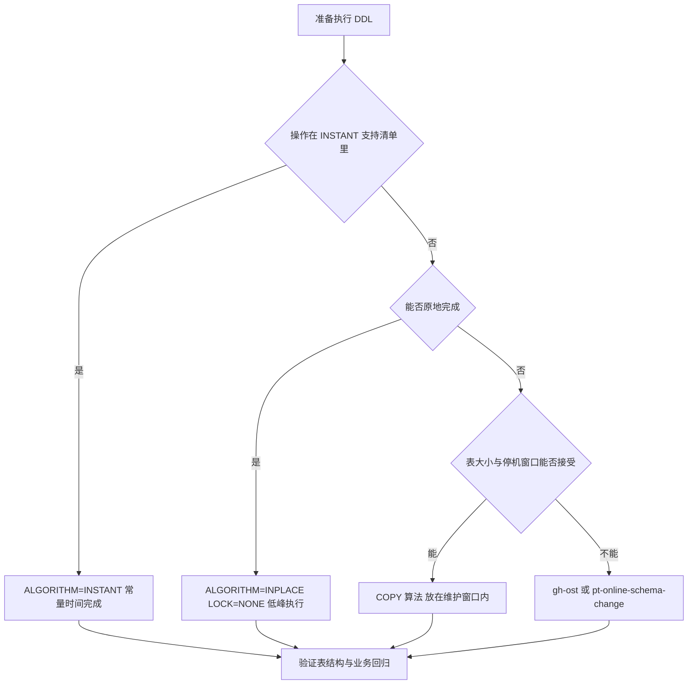

# MySQL 8.0 新特性与升级

> 本章梳理 MySQL 5.7 到 8.0 的主要变化，重点是升级路上最容易踩的坑：认证插件、数据字典、原子 DDL、默认字符集、sql_mode 与默认参数。窗口函数、索引结构等原理性内容只给指引，不在本章重复展开。

## 1.学习目标与前置知识

读完本章你应该能够：

- 说清 5.7 到 8.0 的关键变化分别影响哪个环节，判断自己的系统会不会踩到
- 处理 8.0 默认认证插件导致的老客户端、老驱动连接失败
- 理解数据字典改造对备份、巡检脚本和运维习惯的影响
- 在 8.0 上用 INSTANT 算法安全地加列、加索引，知道什么时候该上在线工具
- 按清单完成一次 5.7 到 8.0 的升级评估、执行与验证

前置知识：

|主题|说明|参考|
|---|---|---|
|SQL 基础与窗口函数|窗口函数、CTE 的语法基础|[02-SQL](02-SQL.md)|
|索引与执行计划|降序索引、函数索引、索引下推的原理|[06-索引](06-索引.md)|
|系统库与客户端工具|数据字典改造后要看的系统库和工具|[13-MySQL管理](13-MySQL管理.md)|
|日志与主从复制|升级后要验证 binlog 与复制链路|[14-日志](14-日志.md)、[15-主从复制](15-主从复制.md)|
|备份与恢复|升级前必须备份，回退也只能靠备份|[21-备份与恢复](21-备份与恢复.md)|

## 2.从 5.7 到 8.0 的主要变化总览

先把变化摆出来，每一项标注版本门槛和影响面，后面的小节再逐个展开。

|变化项|版本门槛|影响面|
|---|---|---|
|默认字符集改为 utf8mb4|8.0 起，5.7 默认 latin1|连接、表、列、排序规则、索引前缀字节数、磁盘与内存占用|
|默认排序规则改为 utf8mb4_0900_ai_ci|8.0 起，5.7 为 latin1_swedish_ci|中文与重音比较结果、大小写敏感度、跨库 JOIN 的隐式转换|
|默认存储引擎与文件结构|InnoDB 自 5.5 起为默认引擎；8.0 起元数据进数据字典，不再生成 .frm、.opt 等文件|表结构备份、巡检脚本、直接读文件判断表变更的老习惯|
|默认认证插件 caching_sha2_password|8.0 起，8.0.4 起成为用户账号默认值|老驱动、老客户端、复制账号、备份工具的连接失败|
|数据字典与原子 DDL|8.0 起|DDL 崩溃安全、information_schema 的底层实现、升级停机方式|
|窗口函数|8.0 起|排名、累计、移动平均等报表 SQL 的写法|
|公用表表达式 CTE（含递归）|8.0 起|层级与树形查询、复杂 SQL 的可读性拆分|
|真正的降序索引|8.0 起，5.7 接受 DESC 语法但会忽略|混合方向 ORDER BY 能否走索引|
|函数索引（表达式索引）|8.0.13 起|对表达式结果建索引，免去手写冗余生成列|
|JSON 增强|8.0.4 起有 JSON_TABLE；8.0.17 起有多值索引、JSON_OVERLAPS 等|JSON 数组检索、报表拆解、JSON 字段走索引|
|统计信息持久化|5.6.6 引入、5.7 已默认开启；8.0 起统计表纳入数据字典并固定为 InnoDB|执行计划稳定性，升级后可能需要重新采样|
|innodb_autoinc_lock_mode 默认值改为 2|8.0 起，5.7 为 1|自增值连续性、批量插入并发、STATEMENT 格式复制的安全性|
|GROUP BY 取消隐式排序|8.0 起|依赖隐式排序的 SQL 结果顺序会变|
|保留字新增|8.0 起|列名、别名或表名与新增保留字冲突时报语法错误|

三点阅读提示：

1. 门槛写 8.0 表示该系列首发即生效；写具体小版本号（如 8.0.13、8.0.17）表示那个小版本才引入，5.7 和更早的 8.0 都没有。
2. 影响面写的是升级时最可能出问题的地方，不是功能清单，升级评估按影响面逐项过一遍即可。
3. [02-SQL](02-SQL.md) 已写过窗口函数与多表查询基础，[06-索引](06-索引.md) 已写过索引下推与降序索引的原理，本章不重复推导，只在需要时引用。

规律可以概括成一句：越靠近"默认值"的变化越容易在升级后突然生效，越靠近"新语法"的变化越不影响存量代码，所以评估顺序要先过默认值，再看新特性。

## 3.默认认证插件的变化

### 3.1 两个插件的区别

|对比项|mysql_native_password|caching_sha2_password|
|---|---|---|
|引入时间|MySQL 4.1 起的传统插件|8.0 起成为默认，5.7 没有这个插件|
|密码哈希|SHA-1 两次哈希|SHA-256|
|握手方式|无安全通道时口令交互强度弱|要求 TLS 或 RSA 公钥加密通道，否则客户端要显式声明允许不安全连接|
|服务端缓存|无|服务端缓存已认证用户，命中缓存时跳过完整握手，重复连接更快|
|客户端支持|几乎所有老驱动都支持|需要较新的驱动，Connector/J 5.1 的早期版本、老 PHP 扩展等不支持|
|官方态度|8.0.34 起被标记弃用，只作为兼容选项|推荐的默认方式|

### 3.2 老客户端连不上时看到什么

报错发生在客户端侧，服务端日志通常看不到异常，典型输出如下：

```text
ERROR 2059 (HY000): Authentication plugin 'caching_sha2_password' cannot be loaded:
  /usr/lib/mysql/plugin/caching_sha2_password.so: cannot open shared object file

# 另一种表现：连接直接失败，提示客户端不支持该认证方式
```

同一个账号换新版客户端能连、老客户端连不上，基本就是这个原因。排查思路是先看账号用的插件，再看服务端默认值。

```SQL
-- 看具体账号用的是哪个插件
SELECT user, host, plugin FROM mysql.user WHERE user = 'app';

-- 看服务端默认值：8.0 下通常是 caching_sha2_password
SHOW VARIABLES LIKE 'default_authentication_plugin';
```

### 3.3 三种解决办法

办法一，升级客户端驱动（首选）。Connector/J 用 8.0.x 及以上，其它语言用官方支持 caching_sha2_password 的驱动版本，并把连接参数补齐（如 JDBC 的 `serverTimezone`、是否需要 `useSSL`）。这一步只改应用，不动数据库，是唯一不需要回退的方案。

办法二，把这个账号改成旧插件，做临时过渡。

```SQL
-- 只改这一个账号，影响面最小；密码用占位符，不要写进脚本历史
ALTER USER 'app'@'%' IDENTIFIED WITH mysql_native_password BY '${DB_PASSWORD}';

-- 确认修改结果
SELECT user, host, plugin FROM mysql.user WHERE user = 'app';
```

办法三，在配置文件里把默认插件改回旧插件，让后续新建账号都用旧插件。

```conf
[mysqld]
# 过渡方案：新建账号默认使用旧插件，老客户端才连得上
# 8.0.27 起该参数被标记弃用，8.4 起移除，改为 authentication_policy
default_authentication_plugin = mysql_native_password
```

改完要重启实例才生效，重启属于计划内操作，生产环境不要随手做。

### 3.4 为什么长期应该升级驱动

- mysql_native_password 用 SHA-1 哈希，安全性明显弱于 SHA-256，且没有服务端缓存，重复握手开销更大。
- 它已经被官方标记弃用，后续版本默认不再启用，压着旧插件等于把升级问题往后推。
- 办法二、办法三都只是止血：一个账号一个账号地改会让脚本越攒越多，改配置则把所有新账号都拖回旧插件，等于放弃 8.0 的安全改进。

正确顺序是先升级驱动，再逐步把账号迁到 caching_sha2_password，最后删掉配置里的兼容项；暂时动不了驱动时用办法二，并设置明确的清理时间点。

## 4.数据字典的变化与影响

### 4.1 元数据挪到了哪里

8.0 之前，每个表的定义放在数据目录下的 .frm 文件里（还有记录库选项的 .opt、记录分区定义的 .par、记录触发器的 .TRG 与 .TRN 等），服务端靠读写这些文件维护元数据。8.0 起元数据统一放进 InnoDB 的数据字典表，再通过 information_schema、performance_schema 和 mysql 库以表或视图的形式暴露出来。数据字典表本身不能让用户直接读写，直接 SELECT 会被服务器拒绝。

|项目|5.7 及更早|8.0|
|---|---|---|
|表结构|每表一个 .frm 文件|数据字典表（InnoDB 存储）|
|库级选项|db.opt 文件|数据字典表|
|分区定义|.par 文件|数据字典表|
|统计信息表|可为 MyISAM|固定 InnoDB，随数据字典一起管理|
|DDL 原子性|无，失败可能留下半截状态|原子 DDL|
|information_schema|多数表是临时表，查询可能落磁盘|由数据字典直接提供，查询更轻|
|系统表（mysql.user 等）|可为 MyISAM|InnoDB，且要走正常语法修改|

### 4.2 带来的好处

- 原子 DDL：元数据变更和数据变更绑在一次事务里，DDL 失败不会留下半截状态（下一节展开）。
- 崩溃安全：数据字典走 InnoDB 的事务与 redo 保护，不会再出现 .frm 与真实表结构不一致的情况。
- 查询更轻、管理更集中：information_schema 不再靠临时表拼结果，表信息统一存放也便于检查与修复。

### 4.3 需要注意的地方

- 不能再靠文件时间判断表是否变更。过去用 `ls -lt table.frm` 做巡检的脚本，在 8.0 里会找不到文件，直接失效。
- 表结构的备份方式要换。直接拷贝 .frm 已经不成立，改用 `mysqldump --no-data`，或使用与 8.0 配套的物理备份工具。
- 统计信息表（innodb_table_stats、innodb_index_stats）固定为 InnoDB，升级前如果它们被人改成 MyISAM 会失败，需要先改回来。
- mysql 系统表也是 InnoDB 数据字典的一部分，不能靠改文件绕过权限检查，部分表不允许直接 DML 修改。
- 物理备份工具必须与 8.0 数据字典配套，用旧版 XtraBackup 备份 8.0 会直接报错；升级后也要重新采样统计信息，否则部分表的执行计划可能和升级前差异很大。

```SQL
-- 8.0 里判断表"最近有没有变"，只能拿到数据字典给出的近似时间
SELECT table_schema, table_name, create_time, update_time, table_rows
FROM information_schema.tables
WHERE table_schema = 'tlias' AND table_name = 'emp';

-- 看表结构与表选项，等价于老版本去读 .frm 和 db.opt
SHOW CREATE TABLE tlias.emp\G
```

InnoDB 的 update_time 是缓存值，不保证精确，只适合做粗略筛选。需要精确的变更审计时，应该从 binlog 入手，做法见 [14-日志](14-日志.md)。

## 5.原子 DDL 与在线 DDL

### 5.1 原子 DDL 的含义

一次 DDL 会牵动三类动作：数据字典更新、存储引擎内部操作、binlog 写入。8.0 把这套动作放在一个事务里，要么全部生效，要么全部回滚：

- 不会出现"表建了一半""索引建了一半""列删了但元数据还指向它"的半截状态。
- DDL 执行到一半崩溃，重启后要么看到完整结果，要么看不到任何改动，不用手工清理残留文件。
- 只有 InnoDB 支持，8.0 里业务表基本都是 InnoDB，实际等于默认具备；对照 5.7，CREATE TABLE 写文件失败可能留下 .frm，DROP TABLE 失败可能只删掉部分文件。

要区分两个概念：原子 DDL 说的是"失败不留半截状态"，不是"变更很快"。改列类型这类操作照样要重建表、照样要等。

### 5.2 ALGORITHM=INSTANT 支持哪些操作

|操作|最早版本|说明|
|---|---|---|
|ADD COLUMN|8.0.12|加列只改数据字典，常量时间内完成，默认值必须是常量|
|设置或删除列默认值|8.0.12|只改元数据，不碰数据文件|
|把列加到任意位置、删除列、调整列顺序、改列名|8.0.29 起|INSTANT 不再只支持"追加到最后一列"|
|修改列类型、字符集、排序规则|仍走 INPLACE 或 COPY|必须重写已有数据，INSTANT 覆盖不到|

INSTANT 的代价与限制：

- 操作本身很快，但表上仍要短暂持有元数据锁，长事务或大查询会把 DDL 卡住。
- 数据文件里的旧行不会立刻消失。删列、改默认值只影响读取时的解释方式，空间要等表被重建（OPTIMIZE TABLE、或后续触发 rebuild 的 ALTER）才真正释放，所以磁盘不会马上变小。
- 同一个表累积的行版本有上限（官方文档给出的数字是 64 个行版本），超过后下一次 ALTER 要退化成重建表。长期频繁小改动要安排一次重建。
- 带非恒定默认值（函数、表达式）的加列不走 INSTANT。

### 5.3 INSTANT、INPLACE 与 COPY 的代价对比

|算法|是否重建数据|并发 DML|耗时与代价|典型场景|
|---|---|---|---|---|
|INSTANT|不改数据文件|允许|秒级以内，只写数据字典|加列（常量默认值）、改默认值、8.0.29 的部分改列|
|INPLACE|不复制整表，但可能重建索引或表|视操作而定，配合 LOCK=NONE 允许|与表、索引大小成正比，占 IO 与 CPU|加删索引、部分改列、重建表|
|COPY|建临时表并复制全部数据|8.0 中默认不允许并发写|最慢，磁盘可能翻倍，大表按小时计|改列类型、改字符集等无法原地完成的变更|

两条实用规律：不显式指定算法时，服务器默认选代价最小的可用算法；想避免"悄悄退化成 COPY"，就在语句里写死 `ALGORITHM=INPLACE, LOCK=NONE`，不支持时让它直接报错（如 ERROR 1845 不支持指定算法），而不是默默变成几小时的复制。

### 5.4 加列与加索引的推荐做法

加列优先用 INSTANT，并显式声明算法：

```SQL
-- 8.0.12 起，带常量默认值的加列走 INSTANT，常量时间内完成
ALTER TABLE tlias.emp
  ADD COLUMN remark VARCHAR(200) NOT NULL DEFAULT '' COMMENT '备注',
  ALGORITHM=INSTANT;
```

加索引优先用 INPLACE + LOCK=NONE，并利用 8.0 的不可见索引降低风险：

```SQL
-- 普通二级索引：原地构建，允许并发读写
ALTER TABLE tlias.emp
  ADD INDEX idx_emp_name (name),
  ALGORITHM=INPLACE, LOCK=NONE;

-- 先在从库建好、确认无问题，再让它对优化器可见
ALTER TABLE tlias.emp ADD INDEX idx_emp_phone (phone) INVISIBLE;
ALTER TABLE tlias.emp ALTER INDEX idx_emp_phone VISIBLE;
```

什么情况下该上 gh-ost 或 pt-online-schema-change：

- 变更只能走 COPY（改列类型、改字符集、改主键），而表很大、停机窗口给不出来。
- 需要限速、可暂停、可中断的变更，或必须先在从库改好结构再切换上线。

两者的差异：pt-online-schema-change 靠触发器同步增量，并发高时影响更明显；gh-ost 解析 binlog 同步增量，不建触发器、对写入影响更小，但需要 binlog 权限和额外连接。它们在切换阶段都要短暂加锁，仍要放在低峰执行，并先备份。



## 6.窗口函数与 CTE

### 6.1 窗口函数只做指引

8.0 引入窗口函数之后，"组内排名、组内累计、移动平均"这类需求不用再用自连接或用户变量硬凑。语法、排名函数对比和每个部门取前三名的例子，见 [02-SQL](02-SQL.md) 第 9 节，本章不重复。升级相关只需要记住一条：窗口函数在 5.7 上直接报语法错误，把这类 SQL 写进应用前，要确认目标实例真的升到了 8.0。

### 6.2 CTE 与递归查询

CTE（公用表表达式）用 WITH 定义一个临时结果集，可以拆长 SQL、也可以被多次引用；下面的递归写法才是升级后最常用、5.7 完全写不出来的能力，适合组织层级、分类树这种自己引用自己的结构：

```SQL
-- 从顶层节点逐层往下展开，lvl 记录层级
WITH RECURSIVE org AS (
  SELECT id, name, manager_id, 1 AS lvl
  FROM employee
  WHERE manager_id IS NULL
  UNION ALL
  SELECT e.id, e.name, e.manager_id, org.lvl + 1
  FROM employee e
  JOIN org ON e.manager_id = org.id
)
SELECT id, name, lvl FROM org ORDER BY lvl, id;
```

两个容易踩的点：递归必须有终止条件（上面的写法靠"JOIN 不到下一层"自然结束），否则会无限展开；`cte_max_recursion_depth` 默认是 1000 层，树很深时要先评估这个上限够不够。

## 7.降序索引与函数索引

### 7.1 降序索引

8.0 才真正支持降序索引；5.7 能写下 DESC 语法，但服务器会忽略方向，索引实际仍是升序。

```SQL
-- 混合方向索引：先按部门升序，再按工资降序
ALTER TABLE emp ADD INDEX idx_dept_salary (dept_id ASC, salary DESC);
```

- 真正有价值的场景是混合方向排序：`ORDER BY dept_id ASC, salary DESC` 在 8.0 可以直接顺着索引读，5.7 只能额外排序。
- 限制：降序索引只有 InnoDB 支持；方向不写默认升序；升序查询仍可能选中降序索引，具体以执行计划为准；B+Tree 与索引分类原理见 [06-索引](06-索引.md)。

### 7.2 函数索引

8.0.13 起支持对表达式建索引，表达式要用一对括号包起来：

```SQL
ALTER TABLE emp ADD INDEX idx_abs_salary ((ABS(salary)));
ALTER TABLE emp ADD INDEX idx_lower_name ((LOWER(name)));
```

- 解决的问题：`WHERE ABS(salary) = 100` 这类条件过去必然全表扫描，因为函数把索引列包住了；有了函数索引就能直接定位。
- 限制：表达式必须是确定性的，不能包含子查询、存储函数或 NOW() 这类非确定函数；表达式索引本质是一个隐藏的虚拟列，写入时会有额外的计算开销；`SHOW CREATE TABLE` 能看到它，`SHOW COLUMNS` 看不到隐藏列。
- 能用普通列或显式生成列表达清楚时优先用更直白的方案，函数索引留给表达式固定、查询确实高频的场景。

## 8.JSON 增强

8.0 的 JSON 变化集中在两件事：能把 JSON 结构查成行、能让数组判断走索引。这里只给要点和示例。

### 8.1 路径表达式与 -> 和 ->>

```SQL
SELECT
  info ->> '$.name'              AS name_text,  -- 返回去引号的文本
  info -> '$.name'               AS name_json,  -- 返回 JSON 值，字符串带引号
  JSON_UNQUOTE(info -> '$.name') AS name_same   -- 与 ->> 等价
FROM goods;
```

- `->` 返回 JSON 类型值，结果里的字符串带引号，适合继续套 JSON 函数；`->>` 等价于 `JSON_UNQUOTE(列 -> 路径)`，直接给应用使用或做字符串比较。
- 路径从 `$` 起：`$.a.b` 取对象字段，`$[0]` 取数组元素，`$[*]` 匹配所有元素；这两个运算符 5.7 就有，升级时不涉及改写。

### 8.2 JSON_TABLE 与多值索引

JSON_TABLE 把 JSON 数组摊开成行，可以像普通表一样 JOIN 和聚合（8.0.4 起）：

```SQL
SELECT o.id, jt.name, jt.qty
FROM orders o,
     JSON_TABLE(o.items, '$[*]' COLUMNS (
       name VARCHAR(20) PATH '$.name',
       qty  INT         PATH '$.qty'
     )) AS jt
WHERE jt.qty > 1;
```

多值索引（8.0.17 起）让数组判断也能走索引：

```SQL
ALTER TABLE goods ADD INDEX idx_tags ((CAST(tags AS CHAR(20) ARRAY)));

SELECT id FROM goods WHERE 'mysql' MEMBER OF (tags);
```

多值索引只对 `MEMBER OF`、`JSON_CONTAINS`、`JSON_OVERLAPS` 这三类数组判断有效，且必须建在同一个 JSON 列的数组转换表达式上。

### 8.3 新函数用途

|函数|版本|用途|
|---|---|---|
|`JSON_OVERLAPS`|8.0.17|判断两个 JSON 文档或数组是否有交集，常用于标签匹配|
|`JSON_VALUE`|8.0.17|按路径取标量值并做类型转换，语义比 `->>` 更明确|
|`JSON_SCHEMA_VALID`|8.0.17|按 JSON Schema 校验文档是否合法|

## 9.升级路径与注意事项

### 9.1 小版本与大版本的区别

|维度|小版本升级（如 8.0.30 到 8.0.36）|大版本升级（5.7 到 8.0）|
|---|---|---|
|数据字典|格式兼容，一般无需转换|启动时重建为 8.0 数据字典|
|默认值与行为|基本不变|字符集、认证插件、sql_mode、参数默认值都可能变|
|SQL 兼容性|基本无感|新保留字、取消隐式排序、严格 sql_mode 都可能让老 SQL 报错|
|回退|换回旧二进制即可|不能降回 5.7，只能靠备份或逻辑导出重建|
|验证重点|新修复是否引入回归|认证、字符集、执行计划、复制链路全面验证|

### 9.2 升级前检查清单

|检查项|要点|
|---|---|
|备份|全量备份加恢复演练，确认备份真的能用，这是唯一的回退手段|
|版本与工具|确认目标小版本，备好与 8.0 配套的备份、监控工具；5.7 可以就地升到 8.0，但不能从 5.6 直接跳升|
|兼容性扫描|用官方检查工具（MySQL Shell 的 checkForServerUpgrade）扫一遍，重点看被移除的参数与特性|
|应用与驱动|驱动、连接池、ORM 方言是否支持 8.0，认证方式是否匹配|
|字符集|库、表、列、连接四层都要梳理；latin1 变 utf8mb4 后磁盘占用与索引字节数都会变|
|索引长度|utf8mb3 表改 utf8mb4 后索引前缀可能超限，行格式是 COMPACT 时限额只有 767 字节|
|SQL 兼容|排查含新保留字的标识符、依赖 GROUP BY 隐式排序、依赖宽松 sql_mode 的老 SQL；ONLY_FULL_GROUP_BY 在 5.7 已是默认值，8.0 只是延续，曾手工关掉它的实例要重新确认是否还要继续关|
|参数配置|被移除的旧参数（如 innodb_large_prefix、sql_mode 里的 NO_AUTO_CREATE_USER）要清掉，否则可能起不来|
|磁盘与窗口|预留重建数据字典所需空间和维护窗口，主从都要规划升级顺序|

### 9.3 升级方式

- 原地升级：备份、兼容性检查、停库、替换二进制、启动（8.0.16 起服务器自动完成数据字典升级）、验证。数据不用搬，失败只能靠备份回退。
- 逻辑导出导入：在 5.7 上用 mysqldump 导出，再导入 8.0 新实例（做法见 [21-备份与恢复](21-备份与恢复.md)）。可以借机清理字符集、重建结构，代价是数据量大时耗时长、对停机窗口要求高。
- 混合做法最常用：先建 8.0 从库、导入数据、切读流量验证，再择期切换主库。

### 9.4 升级后要验证什么

- 连接与认证：所有应用账号实连一遍，确认不再报认证插件错误。
- 字符集：看 `SHOW VARIABLES LIKE 'character_set%'`，抽样 `SHOW CREATE TABLE` 查有无 latin1 表残留。
- sql_mode 与参数：比对升级前后的关键参数，确认没有意外变化。
- 慢查询与执行计划：对比慢日志和核心 SQL 的执行计划，重新 ANALYZE TABLE 后再评估。
- 复制链路：确认复制无报错、延迟正常，binlog 格式与 GTID 状态一致。
- 业务回归：核心读写、批处理、报表各跑一遍，重点看结果顺序与聚合数字。

## 10.参数与行为默认值变化对照表

|参数|5.7 默认值|8.0 默认值|升级影响|
|---|---|---|---|
|character_set_server|latin1|utf8mb4|新建库表的默认字符集变了，老 latin1 表与新表混用时要显式转换|
|collation_server|latin1_swedish_ci|utf8mb4_0900_ai_ci|比较与排序规则变化，可能影响排序结果和唯一键冲突判定|
|default_authentication_plugin|mysql_native_password|caching_sha2_password|老客户端、老驱动、复制账号可能连不上|
|sql_mode|含 NO_AUTO_CREATE_USER|去掉 NO_AUTO_CREATE_USER|配置里残留旧值会导致启动失败，升级前要清理|
|innodb_autoinc_lock_mode|1（consecutive）|2（interleaved）|自增值可能不连续，并发插入更好；STATEMENT 格式复制下需谨慎|
|max_allowed_packet|4MB|64MB|大 SQL、大字段传输更少报错，同时要留意会话内存占用|
|explicit_defaults_for_timestamp|OFF|ON|TIMESTAMP 列的隐式默认值与 NULL 行为变化，老表要抽样核对|
|binlog_format|ROW|ROW（无变化）|重点不是它，而是复制账号的认证插件与两版默认都为 OFF 的 gtid_mode|

另外，按天过期 binlog 的 expire_logs_days 在 8.0 已被弃用，改用 binlog_expire_logs_seconds（默认 30 天），配置文件里的老写法要一起改掉。

## 11.常见回退与排错

|现象|可能原因|处理方式|
|---|---|---|
|报 `Authentication plugin 'caching_sha2_password' cannot be loaded`|客户端或驱动过旧|升级驱动；临时用 `ALTER USER ... IDENTIFIED WITH mysql_native_password` 过渡（见第 3 节）|
|中文写入报 `Incorrect string value` 或读出乱码|连接层字符集仍是 latin1|连接串指定 utf8mb4，必要时 `SET NAMES utf8mb4`，并修正列字符集|
|报 `You have an error in your SQL syntax ... near 'rank'`|标识符撞上 8.0 新增保留字|给列名或别名加反引号，或改名|
|GROUP BY 查询结果顺序变了|8.0 取消了 GROUP BY 隐式排序|SQL 里显式补 ORDER BY，不要依赖隐式顺序|
|报 `Specified key was too long; max key length is 767 bytes`|utf8mb4 下索引前缀超过行格式上限|把行格式改为 DYNAMIC，或缩短索引前缀长度|
|驱动报时区无法识别（如 `The server time zone value ... is unrecognized`）|老驱动不认识 8.0 返回的时区名|升级驱动，或在连接串加 serverTimezone|
|ALTER TABLE 报不支持指定算法|该操作不支持 INSTANT 或 INPLACE|去掉算法限制，或改用 gh-ost、pt-online-schema-change|

回退的通用前提是有可用的备份：8.0 不能直接降回 5.7，只能恢复 5.7 的备份或按逻辑导出重建，所以第 9 节的备份项不能省。

## 12.总结

1. 5.7 到 8.0 的变化里，默认字符集、默认认证插件、参数默认值这三类最容易被忽略，却最容易在升级后立刻生效。
2. 默认认证插件是 caching_sha2_password；老客户端连不上时先升级驱动，mysql_native_password 只作短期过渡。
3. 数据字典进了 InnoDB，.frm、.opt 等文件不再存在，靠文件时间判断表变更、靠拷贝文件备份结构的脚本都要改写。
4. 原子 DDL 保证 DDL 失败不留半截状态，但它不等于变更快；加列优先 INSTANT，INSTANT、INPLACE、COPY 的代价依次递增。
5. 窗口函数和 CTE 在 5.7 完全不可用，写法见 [02-SQL](02-SQL.md)；递归 CTE 适合组织层级与分类树，注意终止条件与深度上限。
6. 降序索引解决混合方向排序，函数索引让表达式条件走索引，两者的原理见 [06-索引](06-索引.md)。
7. JSON 的新增主要在多值索引、JSON_TABLE 和新函数，配合 `MEMBER OF`、`JSON_OVERLAPS` 才能让数组检索走索引。
8. 升级前必须备份并跑兼容性检查，升级后验证连接认证、字符集、sql_mode、慢查询与主从复制才算闭环；回退只能靠备份。
