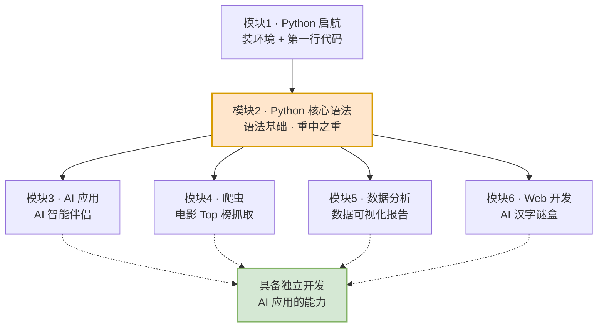
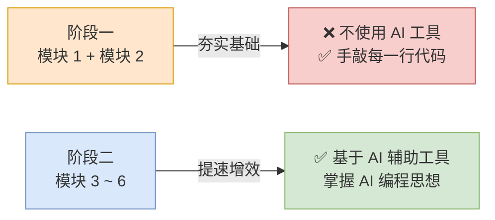

# 第00篇 · 课程导学 —— 这门课到底怎么学

> **本篇定位**：这是整门课的"地图"。你不需要记住任何代码，只需要搞清楚三件事——**我要学什么、学完能做什么、该怎么学**。花 20 分钟看完，后面 200 小时都会更顺。

---

## 一、先看全景：这门课由 6 大模块组成

### 1.1 概念定义

这门课的名字叫 **「Python + AI 从入门到大神一套通关」**。它不是一个只讲语法的课，而是把 Python 当成**工具**，带着你一路做出 4 个能拿得出手的项目。

整门课拆成 **6 个模块**，顺序是固定死的，因为后面的模块全都依赖前面的基础。

### 1.2 六大模块横向对比表

| 序号 | 模块名称 | 学习内容 | 学完你能做出什么 | 难度 | 依赖前置 |
|:---:|---|---|---|:---:|---|
| 1 | **Python 启航** | Python 初识、解释器、开发工具、入门程序 | 装好环境，跑出第一行代码 | ⭐ | 无 |
| 2 | **Python 核心语法** | 数据存储与运算、流程控制、数据容器、函数、模块、面向对象基础 | 用 Python 写出完整的控制台小程序 | ⭐⭐⭐ | 模块 1 |
| 3 | **Python 实战 · AI 应用** | AI 大模型基础、HTTP 协议、接入 DeepSeek、Prompt 工程、Streamlit | 一个能和 AI 聊天的"AI 智能伴侣" | ⭐⭐⭐ | 模块 2 |
| 4 | **Python 实战 · 爬虫** | 爬虫入门与合规性、HTML 页面结构、正则表达式、爬虫项目 | 自动抓取豆瓣/TMDB 电影排行榜并存成表格 | ⭐⭐⭐ | 模块 2 |
| 5 | **Python 实战 · 数据分析** | 数据分析初体验、Jupyter Notebook、Pandas、Matplotlib | 把一堆乱数据变成漂亮的图表和结论 | ⭐⭐⭐ | 模块 2 |
| 6 | **Python 实战 · Web 应用** | 面向对象高级、FastAPI、Web 应用案例 | 一个带前后端的"AI 汉字谜盒"网站 | ⭐⭐⭐⭐ | 模块 2 |

> **一句话总结**：模块 1-2 是**打地基**，模块 3-6 是**盖四栋不同的楼**。四栋楼互相之间没有依赖，你可以按顺序学，也可以学完模块 2 后挑感兴趣的先学。

### 1.3 学习路线流程图

**流程说明**：

1. **模块 1 是所有内容的入口**，没装好 Python 环境，后面一步都走不动。
2. **模块 2 是整门课的心脏**——它占了全部课时的一半以上。四栋楼用的砖头（变量、循环、函数、类）全部在这里生产。这里偷懒，后面必然卡死。
3. **模块 3/4/5/6 之间是并列关系**，彼此不依赖，可以按兴趣调整顺序。
4. 四个模块最终都汇聚到同一个能力上：**独立用 Python 解决实际问题**。

---

## 二、AI 时代，为什么还要学 Python？

### 2.1 一个真实的行业背景

| 时间 | 事件 |
|---|---|
| 2022.11.30 | ChatGPT 发布，AI 进入大众视野 |
| 2025.01.20 | DeepSeek 发布，AI 应用开发成本大幅下降 |

现在 AI 已经渗透进几乎所有行业：

| 行业 | AI 落地场景 |
|---|---|
| IT 行业 | AI 辅助学习、AI 辅助开发、自动化测试、智能运维、故障预测 |
| 金融 / 保险 | 智能投研、量化交易、风险控制、自动化核保、智能客服 |
| 娱乐行业 | AIGC 动画短剧、AI 游戏 NPC、AI 作曲、AI 视频生成 |
| 办公 / 教育 | 智能会议纪要、个性化辅导、AI 助教、智能批改、智能文档 |
| 医疗健康 | 智能导诊分诊、医疗影像诊断、临床决策辅助、药物研发 |
| 电商零售 | 个性化推荐与导购、智能客服、AI 数字人直播、智能仓储 |
| 政务 / 法律 | 政务服务智能体、法律文书审阅、合同智能审查、舆情分析 |
| 农业 / 林业 | 农事决策、基因组辅助育种、智能无人机作业、山林防护预警 |
| 工业制造 | 智能质检、生产工艺优化、智能仓库与物料分拣 |

### 2.2 深入讲解：AI 时代的两条路

很多人有个误区："AI 都能写代码了，我还学什么编程？"

这话只对了一半。真实的行业里，AI 相关岗位分成两条完全不同的路：

| 方向 | 做什么 | 需要什么能力 | 门槛 |
|---|---|---|---|
| **大模型开发 / 算法** | 从零训练、微调大模型本身 | 数学、算法、海量算力 | 极高 |
| **AI 应用开发** | 把大模型的能力接进业务，做出产品 | **Python + 工程能力** | 中等，可速成 |

**大白话打个比方**：

> 大模型开发好比是**造发动机**——需要一整个工厂和顶级工程师。
> AI 应用开发好比是**造汽车**——发动机可以买现成的（调用 API），但你得懂怎么把它装进车里、怎么设计方向盘和刹车。
>
> 现实情况是：**造发动机的公司就那么几家，但造汽车的公司有几万家。** 绝大多数岗位属于后者。

而"造汽车"这件事，目前最主流的工具语言就是 **Python**。原因很简单：

- 语法接近英语，读起来像伪代码，上手快；
- 生态极其丰富——调 AI、抓网页、算数据、搭网站，每一件事都有现成的库；
- 社区庞大，遇到问题一搜就有答案。

> **结论**：AI 不会让编程失业，它让"只会敲重复代码的人"失业，同时让"会用 AI + 懂业务 + 能写 Python 的人"更值钱。这门课教的就是后者。

---

## 三、课程四大特色

| 特色 | 具体说明 | 对你的实际意义 |
|---|---|---|
| **1. 知识全面，体系完整** | 系统构建 Python 技能树，涵盖语言核心、AI、网络爬虫、数据分析、Web 应用 | 不用东拼西凑找资料，一条主线走到底 |
| **2. 项目驱动，实战教学** | 用多元案例驱动学习：AI 应用、爬虫、数据分析可视化、Web 应用 | 每一步都有"看得见的成果"，不容易半途而废 |
| **3. AI 赋能，高效开发** | 深度整合 AI 编程工具，覆盖代码生成 → 调试 → 优化全流程 | 学会用 AI 给自己加速，而不是被 AI 替代 |
| **4. 工程实践，规范开发** | 融入异常处理、日志管理、调试技巧、模块化开发 | 写出的是"企业级代码"，不是"能跑就行的玩具" |

---

## 四、学完你能收获什么

### 4.1 四项核心收获

| 序号 | 收获 | 对应模块 |
|:---:|---|---|
| 1 | **扎实的基本功 + 优秀的编程思维** | 模块 1-2 |
| 2 | **AI 编程、调试的思想，开发效率翻倍** | 全课程贯穿 |
| 3 | **AI 应用、爬虫、数据分析可视化、Web 应用等多元开发能力** | 模块 3-6 |
| 4 | **AI 大模型基础知识，能独立开发基础 AI 应用** | 模块 3 |

### 4.2 这门课适合谁

| 人群 | 为什么适合 |
|---|---|
| **完全零基础的小白** | 从"什么是编程语言"讲起，不假设你有任何基础 |
| 对 AI 大模型、爬虫、数据分析感兴趣的技术爱好者 | 有 4 个完整实战项目可以练手 |
| 想转行做 AI 大模型开发的从业者 | 覆盖了 AI 应用开发岗的核心技能栈 |
| 应对考试、竞赛、面试的大学生 | 计算机二级、ACM 竞赛、面试八股全覆盖 |

> **特别说明**：这份学习笔记（也就是你正在看的这一系列文档）就是为**第一类人**准备的。所有专业术语第一次出现时都会有解释，所有抽象概念都会配生活化的例子。

---

## 五、学习方法：四条铁律

### 5.1 分阶段使用 AI 工具（最重要的一条）

这是整门课最反直觉、但最关键的一条建议：

**为什么第一阶段不能用 AI？**

> 学语法就像学游泳。你可以看 100 个"如何游泳"的 AI 回答，但不下水，你永远学不会。
>
> 第一阶段的目标不是"把程序跑起来"，而是**建立肌肉记忆和排错直觉**——看到 `IndentationError` 能立刻反应过来是缩进问题，看到 `NameError` 知道是变量名打错了。这种直觉，只有亲手敲错 100 次才能长出来。

**第二阶段为什么可以用 AI？**

> 到了实战阶段，你已经知道代码该"长什么样"了。这时 AI 是**加速器**而不是**拐杖**——它能帮你快速生成模板代码、解释报错、优化写法，但你始终有能力判断它给的东西对不对。

### 5.2 四条铁律汇总表

| 序号 | 铁律 | 具体做法 | 违反的后果 |
|:---:|---|---|---|
| 1 | **夯实基础，手敲代码** | 模块 1-2 全程不使用 AI 生成代码 | 基础虚浮，后面全靠复制粘贴，一改就崩 |
| 2 | **基于 AI 辅助提高效率** | 模块 3-6 主动使用 AI 工具，学习"如何指挥 AI" | 效率低下，学不会现代开发方式 |
| 3 | **不要只看视频** | 视频看懂 ≠ 会写。看完一节立刻自己敲一遍 | "眼睛会了手不会"，合上视频大脑空白 |
| 4 | **多敲、多练** | 每个案例至少独立实现一次，敢于改动参数看结果 | 知识停留在"听说过"层面，无法内化 |

### 5.3 一个自查清单

学完每一节后，问自己三个问题：

1. **能不能不看资料，把这个知识点讲给一个完全不懂的人听？**（讲不出来 = 没懂）
2. **能不能不看代码，自己从空白文件重新写一遍？**（写不出来 = 只是眼熟）
3. **如果我把某个参数改掉，能不能预测结果会怎样？**（预测不出来 = 没理解原理）

三个都能做到，才算是真正学完了这一节。

---

## 六、本篇小结

| 关键问题 | 答案 |
|---|---|
| 这门课学什么？ | 6 大模块：启航 → 核心语法 → AI 应用 / 爬虫 / 数据分析 / Web 开发 |
| 哪个模块最重要？ | **模块 2 核心语法**，占课时一半以上，是所有实战的地基 |
| AI 时代为什么学 Python？ | 大模型开发门槛极高，但 **AI 应用开发**岗位大量需要 Python |
| 前期该不该用 AI 写代码？ | **不该**。模块 1-2 必须手敲，模块 3-6 才开始用 AI 提速 |
| 怎么判断一节学没学会？ | 能讲出来 + 能重写出来 + 能预测改动结果 |

> **下一步** → 打开 `01-第1章-Python启航.md`，我们从"Python 到底是个什么东西"开始。
