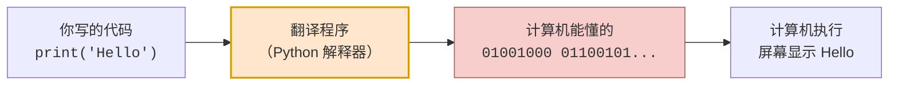
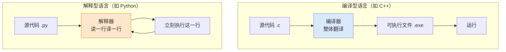
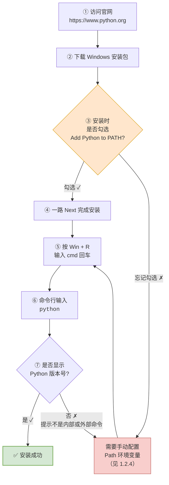
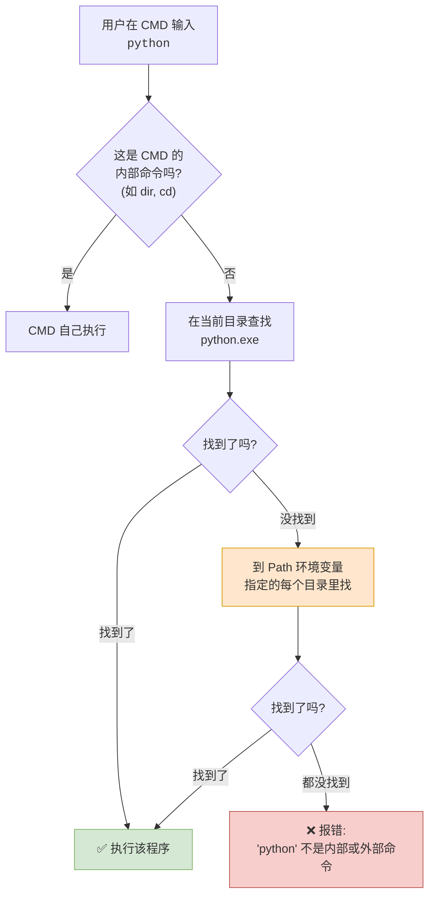
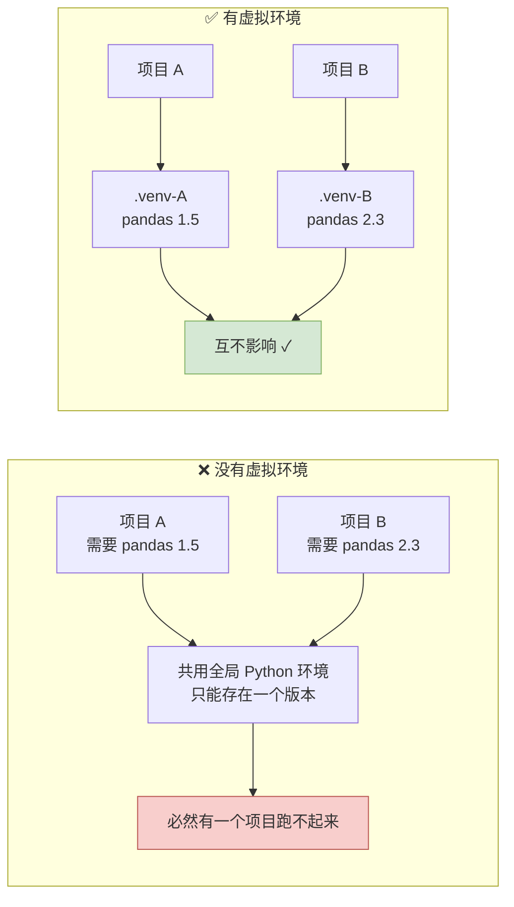

# 第01篇 · Python 启航

> **本篇定位**：把自己从"完全不懂编程的人"变成"能写出并运行第一行 Python 代码的人"。重点不是代码，而是**把环境装对、把概念理清**。环境装错了，后面 90% 的报错都解决不了。

---

## 1.1 什么是 Python

### 1.1.1 概念定义

**Python** 是荷兰计算机科学家 **吉多·范罗苏姆**（Guido van Rossum，国内程序员昵称他"**龟叔**"）在 **1991 年**发布的一门**语法简单、容易上手的编程语言**。

拆成三个关键词来理解：

| 关键词 | 含义 | 为什么重要 |
|---|---|---|
| **1991 年发布** | 已经发展 30 多年，非常成熟 | 生态稳定，遇到问题一定有现成答案 |
| **语法简单** | 代码读起来接近英语 | 学习曲线平缓，适合零基础 |
| **容易上手** | 装好就能写，不用配置一堆东西 | 新手能快速获得正反馈 |

### 1.1.2 深入讲解：什么是"语言"，什么是"编程语言"

这里有个容易混淆的地方，我们用递进的方式讲清楚：

**第一层：什么是"语言"？**

> **语言**是人类进行沟通交流的主要表达方式。

比如：
- 中国人说："嗨，哥们儿，最近在学什么呢？"
- 对方回答："当然是 AI 大模型啊！"
- 你回一句："Well done ~"
- 对方："Thanks, I appreciate it."

你看，**只要有双方都懂的规则，信息就能传递**。语言就是这套规则。

**第二层：什么是"编程语言"？**

> **编程语言**是人类与计算机之间进行信息交流的一种特殊的语言。

关键差异在这里：

| 对比项 | 人类语言 | 编程语言 |
|---|---|---|
| 沟通双方 | 人 ↔ 人 | **人 ↔ 计算机** |
| 规则严格度 | 宽松，说错语法对方也能猜懂 | **极其严格，错一个符号就罢工** |
| 歧义容忍度 | 高（"差不多"能听懂） | **零容忍**（必须精确到标点） |
| 表达方式 | 口语、书面语、方言 | 特定语法 + 符号 |

**第三层（关键）：计算机只认识 0 和 1**

这是所有新手必须接受的第一个残酷事实：

> **计算机的"母语"是二进制（0 和 1），它完全看不懂 `print("Hello")`。**

那为什么我们写 `print("Hello")` 它就能懂？因为中间有个**翻译官**——**解释器**。



**流程说明**：

1. 你写的是**人类可读**的代码。
2. Python 解释器逐行读取，把它**翻译成二进制**。
3. 计算机执行二进制指令。
4. 结果输出到屏幕。

> **大白话比喻**：你（程序员）说中文，计算机说"二进制外语"，中间必须站一个翻译。这个翻译就是**解释器**。没有它，你的代码对计算机来说就是一堆乱码。

### 1.1.3 Python 的 8 大应用范围

这是新手最关心的问题："学完 Python 到底能干嘛？"

| 序号 | 应用领域 | 具体能做什么 | 对应课程模块 |
|:---:|---|---|---|
| 1 | **AI 大模型开发 / 机器学习 / 深度学习** | 训练模型、调用大模型、做 AI 应用 | 模块 3 |
| 2 | **数据分析 / 可视化图表制作** | 分析订单数据、生成报表图表 | 模块 5 |
| 3 | **Web 应用 / 网站服务端程序开发** | 做网站后端、写 API 接口 | 模块 6 |
| 4 | **网络爬虫程序 / 数据采集程序开发** | 自动抓取网页数据 | 模块 4 |
| 5 | **自动化测试 / 测试开发 / 运维开发** | 自动跑测试用例、自动化部署 | 进阶方向 |
| 6 | **大数据开发 / 分布式计算开发** | 处理海量数据 | 进阶方向 |
| 7 | **办公自动化（Excel/Word/PDF...）** | 批量处理表格文档，解放双手 | 进阶方向 |
| 8 | **Python 课程 / 计算机二级 / ACM 竞赛** | 考试、比赛 | 考试方向 |

> **一句话**：Python 是目前**应用面最广**的编程语言之一，从"帮我把 1000 个 Excel 合并一下"到"训练一个 AI 模型"，它都能干。

---

## 1.2 Python 环境准备（上）：解释器

### 1.2.1 概念定义

**解释器**（Interpreter）是**把人类写的代码翻译成计算机能执行的二进制指令的程序**。

### 1.2.2 深入讲解：为什么 Python 是"解释型语言"

编程语言按"翻译时机"分成两大类，这是理解 Python 运行方式的关键：

| 类型 | 代表语言 | 翻译时机 | 运行方式 | 特点 |
|---|---|---|---|---|
| **编译型** | C、C++、Go | 运行**前**一次性全部翻译 | 先编译成 `.exe`，再执行 | 运行快，但改一行要重新编译 |
| **解释型** | **Python**、JavaScript | 运行**时**逐行翻译 | 解释器边读边翻译边执行 | 改完直接跑，开发快；但运行慢一些 |



**流程说明**：

1. 编译型：先"整个翻译完"，再"开始运行"。两次动作分开。
2. 解释型：一边翻译一边运行，交替进行。
3. 所以 Python 可以直接 `python xxx.py` 就跑，不需要先编译。

> **大白话比喻**：
> - **编译型**像**同声传译前的笔译**——先把整本书翻译完印出来，读者拿到成品。翻一次可以给一万个人看，但改一个字就要重印全书。
> - **解释型**像**现场同声传译**——演讲者说一句，翻译翻一句。改了随时改，但每次都要重新翻。

### 1.2.3 Python 安装流程



**流程说明**：

1. 到官网下载安装包。
2. **第 ③ 步是整个安装过程中最关键的一步**——必须勾选 `Add Python to PATH`（把 Python 加入环境变量）。这一步忘了，后面命令行就用不了 `python` 命令。
3. 验证方法：打开 CMD，输入 `python`，能显示版本号就成功。

> ⚠️ **安装目录铁律**：作为一名专业的开发工程师，与开发相关的所有软件，**尽量都安装在没有中文、不带空格的目录下**。
>
> 原因：很多开发工具处理中文路径时会出莫名其妙的错误（编码问题、转义问题）。比如装在 `D:\我的软件\Python` 里，后面可能有你排查半天都找不到原因的 bug。
>
> ✅ 推荐：`D:\DevTools\Python`、`C:\Python312`
> ❌ 避免：`D:\我的软件\Python 3.12`、`C:\Program Files\My Tools\Python`

---

## 1.3 Python 环境准备（下）：Path 环境变量

### 1.3.1 概念定义

**环境变量**（Environment Variables）一般指**在操作系统中存储的、用来指定程序运行时所需参数的一些配置项**，比如临时文件夹位置、系统文件的访问路径等。

**Path 环境变量**是其中最重要的一个，它的作用是：

> **告诉操作系统，当你在命令行输入一个命令时，应该去哪些目录里寻找这个命令对应的可执行文件。**

### 1.3.2 深入讲解：Path 到底解决什么问题

先理解操作系统的"找程序"机制：



**流程说明**：

1. 你在命令行敲 `python`，操作系统并不知道 `python.exe` 藏在哪里。
2. 它先看当前目录有没有，没有就去 **Path 环境变量列出的那一串目录**里挨个找。
3. 全都没找到，就报那句经典的错：`'python' 不是内部或外部命令，也不是可运行的程序`。

> **大白话比喻**：
>
> Path 环境变量就是操作系统的**通讯录/导航地址簿**。
>
> 你让司机（操作系统）去接"张三"（python），司机不知道张三住哪。你给他一本地址簿（Path），里面列着 `C:\Python312\`、`D:\DevTools\` 等等。司机挨个找，找到了就把人接来。地址簿里没写，司机就只能回你一句"查无此人"。
>
> **装 Python 时勾选 `Add Python to PATH`，本质上就是把 `C:\Python312\` 这个地址自动写进了地址簿。**

### 1.3.3 用户变量 vs 系统变量

Path 环境变量分两层，这是新手最容易搞混的地方：

| 对比项 | 用户变量 (User Variables) | 系统变量 (System Variables) |
|---|---|---|
| **生效范围** | 仅对**当前登录的这一个用户**有效 | 对**所有用户**有效 |
| **典型场景** | 只给自己电脑上的自己用 | 公司电脑多人共用，或需要全局生效 |
| **修改权限** | 普通用户即可修改 | 通常需要管理员权限 |
| **优先级** | 先读用户变量，再读系统变量 | 后读 |

> **实际建议**：个人电脑就改**用户变量**，够用且安全。公司共用电脑、或者你是管理员账号要配置给所有人用，才动系统变量。

---

## 1.4 Python 开发工具（IDE）

### 1.4.1 概念定义

**IDE**（Integrated Development Environment，**集成开发环境**）是**集成了代码编写、分析、调试等功能于一体化的开发软件**。

### 1.4.2 为什么需要 IDE

不用 IDE 行不行？行，但很痛苦：

| 痛点 | 说明 |
|---|---|
| **无提示** | 打错函数名不会有任何提醒，运行才发现 |
| **效率低** | 没有自动补全、没有跳转，全靠手打 |
| **易出错** | 缩进、括号配对全靠肉眼，出错率极高 |

### 1.4.3 三方工具横向对比

| 工具 | 类型 | 优点 | 缺点 | 推荐度 |
|---|---|---|---|---|
| **记事本 / 文本编辑器** | 纯文本 | 轻量、自带 | **无代码提示、无调试、极易出错** | ⭐ 不推荐 |
| **VSCode** | 轻量级 IDE | 启动快、插件丰富、前后端通吃 | 需要自己装插件配置环境 | ⭐⭐⭐ 进阶推荐 |
| **PyCharm** | 专业 Python IDE | 专为 Python 设计、功能强大、开箱即用 | 占用内存较大、启动稍慢 | ⭐⭐⭐⭐⭐ **本课程使用** |

**PyCharm 背景**：由 **JetBrains 公司**出品，是目前**使用最广泛的 Python 开发工具**。下载地址：`https://www.jetbrains.com/pycharm/download/?section=windows`

> **说明**：PyCharm 有 **Professional（专业版，收费）** 和 **Community（社区版，免费）** 两个版本。新手学 Python 用**社区版完全够用**。

---

## 1.5 Python 入门程序

### 1.5.1 两种运行代码的方式

| 运行方式 | 操作 | 优点 | 缺点 | 适用场景 |
|---|---|---|---|---|
| **交互式** | 命令行输入 `python` 进入交互模式，直接敲代码回车 | 立刻看到结果 | 关掉窗口代码就没了，不能保存 | 临时测试一两行代码 |
| **文件式** | 把代码写进 `.py` 文件，用 `python xxx.py` 运行 | 可保存、可修改、可复用 | 需要多一步保存 | **实际开发都用这个** |

> **新手建议**：两种都试一遍感受一下。日常开发**永远用文件式**。

### 1.5.2 超重要的注意事项：全部使用英文符号

这是新手踩坑排行榜 **第一名**：

```python
# ✅ 正确：英文双引号
print("Hello World")

# ❌ 错误：中文引号（看起来几乎一模一样！）
print("Hello World")
```

两个引号在屏幕上**肉眼极难分辨**，但程序会直接报错。同样的问题还会出现在：

| 符号 | 英文（正确） | 中文（错误） |
|---|---|---|
| 双引号 | `"` | `"` `"` |
| 单引号 | `'` | `'` `'` |
| 逗号 | `,` | `，` |
| 冒号 | `:` | `：` |
| 括号 | `()` | `（）` |

> **记住这条铁律**：**编写程序时，所有符号一律使用英文符号。** 输入法记得切换到英文状态。

### 1.5.3 第一个程序：Hello World

在 PyCharm 中新建项目，再新建一个 Python 文件，命名为 `01.快速入门.py`：

```python
# 输出 Hello World
print("Hello World")
print("Hello Python")
```

运行后控制台显示：

```
Hello World
Hello Python
```

**逐行解释**：

| 代码片段 | 含义 |
|---|---|
| `# 输出 Hello World` | **注释**：给开发人员看的说明，Python 解释器会**完全忽略**它 |
| `print(...)` | **函数调用**：把括号里的内容输出到控制台 |
| `"Hello World"` | **字符串字面量**：双引号包起来的一串文本 |

### 1.5.4 注释详解

**概念定义**：

> **注释**就是对代码的解释和说明，**是给开发人员看的**，目的就是让开发人员容易看懂程序，**计算机（Python 解释器）会完全忽略它**。

| 项目 | 说明 |
|---|---|
| **写法** | 以 `#` 开头，后面的内容都是注释 |
| **作用** | 解释代码意图、临时屏蔽某行代码、做分区标记 |
| **快捷键** | `Ctrl + /`（选中多行后按，可批量注释/取消注释） |
| **是否被执行** | ❌ 完全不执行 |

```python
# 这是单行注释，解释器看不见我
print("Hello")   # 也可以写在代码后面，叫行尾注释
```

### 1.5.5 Python 语句的分隔符

| 符号 | 作用 |
|---|---|
| `;`（分号） | **语句分隔符**，可以用分号把多条语句写在一行 |
| 换行 | **语句终止符**，正常一行写一条语句 |

```python
print("A"); print("B")   # 用分号分隔，一行写两条
print("C")                # 正常写法：一行一条，靠换行结束
```

> **实际建议**：**平时一行写一条语句就好**，分号法了解即可，写多了反而不易读。

---

## 1.6 PyCharm 项目结构剖析

### 1.6.1 目录结构一览

新建项目后，PyCharm 会自动生成一些文件夹：

| 文件夹 / 文件 | 作用 | 要不要管它 |
|---|---|---|
| `.idea` | **保存项目的配置信息**（比如你设的主题、字体、运行配置） | 一般不用动 |
| `.venv` | **虚拟环境**，保存项目的环境信息（装了什么第三方库） | 不用手动改 |
| 你写的 `.py` 文件 | 你的源代码 | 📌 主战场 |

### 1.6.2 深入讲解：什么是虚拟环境，为什么要它

**概念**：`.venv` 提供的是一个**虚拟的、隔离的运行环境**。

**为什么需要隔离？**

想象两个项目：

- **项目 A** 需要 `pandas 1.5` 版本
- **项目 B** 需要 `pandas 2.3` 版本

如果全公司共用一套 Python 环境，那这两个项目**必然打架**——装了这个版本，另一个就崩了。



**流程说明**：

1. 没有虚拟环境时，所有项目抢同一套库，版本必然冲突。
2. 有了虚拟环境，**每个项目一套独立的"厨房"**，你放什么调料都不影响别人。

> **大白话比喻**：虚拟环境就像**合租公寓里的独立厨房**。虽然住在同一栋楼（同一台电脑），但你的锅碗瓢盆、油盐酱醋都是你自己的一套，室友怎么折腾都影响不到你。

### 1.6.3 PyCharm 常用配置

| 配置项 | 位置 | 建议 |
|---|---|---|
| **主题颜色** | Settings → Appearance & Behavior → Appearance → Theme | 长时间看代码，选深色主题（Dark）护眼 |
| **字体类型** | Settings → Editor → Font | 选等宽字体（如 Consolas、JetBrains Mono） |
| **字体大小** | 同上 | 14-16 比较舒服 |
| **行高** | 同上 | 1.2 倍行距阅读更轻松 |

---

## 1.7 本篇小结

### 1.7.1 核心概念一览表

| 概念 | 一句话定义 | 白话比喻 |
|---|---|---|
| **Python** | 龟叔 1991 年发布的一门简单易上手的编程语言 | 一门"人机通用语" |
| **编程语言** | 人类与计算机交流的特殊语言 | 和计算机说话的规则 |
| **解释器** | 把 Python 代码翻译成二进制的程序 | 现场同声传译 |
| **Path 环境变量** | 告诉系统去哪找可执行文件的地址清单 | 操作系统的通讯录 |
| **IDE** | 集编写、分析、调试于一体的开发软件 | 程序员的"全套工具箱" |
| **注释** | 给开发人员看的说明，解释器忽略 | 书页边上的便利贴 |
| **虚拟环境** | 项目独立的隔离运行环境 | 合租公寓里的独立厨房 |

### 1.7.2 踩坑清单

| 坑 | 现象 | 解法 |
|---|---|---|
| 安装时忘记勾选 Add to PATH | 命令行报"不是内部或外部命令" | 手动配置 Path 环境变量 |
| 用了中文符号 | `SyntaxError: invalid character` | 输入法切英文，检查引号/逗号/冒号 |
| 安装目录带中文或空格 | 各种莫名其妙的路径错误 | 重装到纯英文无空格目录 |
| 忘记 `Ctrl + S` 保存 | 运行的是旧代码，改了没效果 | PyCharm 默认自动保存，但改配置前先确认 |
| 忘记写 `.py` 后缀 | 文件不被识别为 Python 文件 | 新建文件时选 Python File |

### 1.7.3 动手练习

> **需求**：在控制台输出一首诗，分为六行输出。
>
> **提示**：用 `print()` 输出六次即可。
>
> **参考代码**：
> ```python
> print("静夜思")
> print("李白")
> print("床前明月光，")
> print("疑是地上霜。")
> print("举头望明月，")
> print("低头思故乡。")
> ```

> **下一步** → 打开 `02-第2章01节-数据存储与运算.md`，开始正式学语法。
