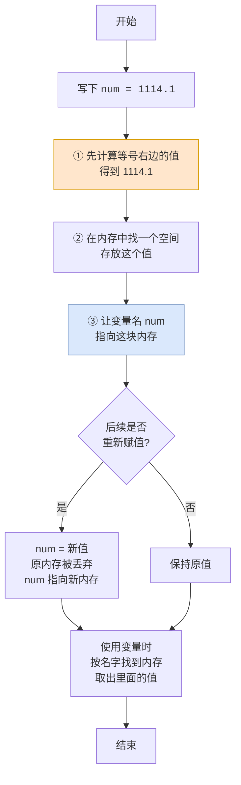
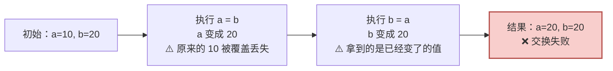
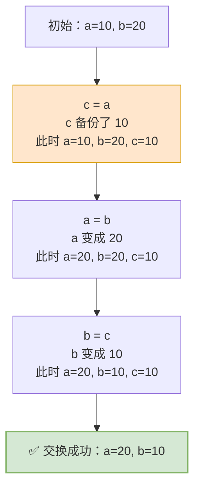
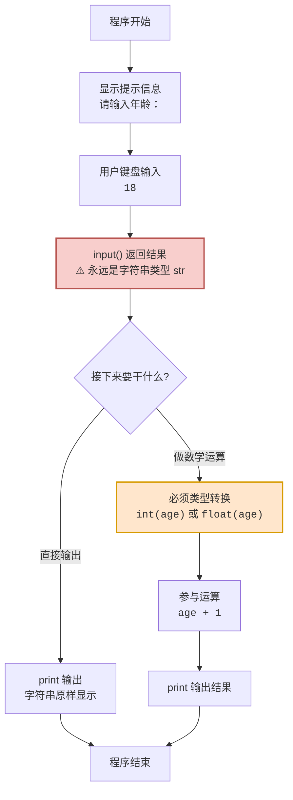
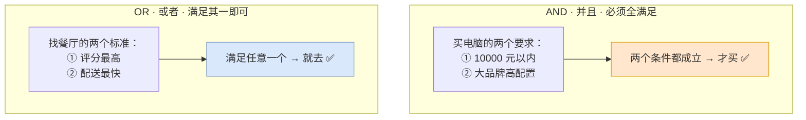
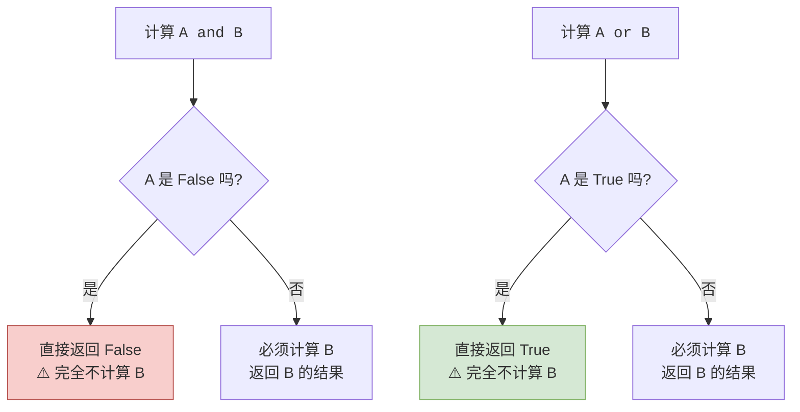

# 第02篇 · 数据存储与运算

> **本篇定位**：这是编程的**第一块砖**。学完这一篇，你就能让程序"记住数据"并"算点东西"。
>
> 全篇围绕两个最根本的问题展开：
> - **怎么写？** —— 数据长什么样（字面量）
> - **怎么存？** —— 数据放哪里（变量）
>
> 然后再解决"数据分几类""怎么进出程序""怎么运算"。

---

## 2.1 字面量：数据长什么样

### 2.1.1 概念定义

**字面量**（Literal）指**程序中直接书写的固定值（数据）**。

拆开理解：

| 关键词 | 含义 |
|---|---|
| **直接书写** | 你写 `18`，它就代表 18，不需要任何解释 |
| **固定值** | 写死了，就是它，不会变 |
| **数据** | 程序要处理的对象 |

```python
18            # 一个字面量
3.1415        # 一个字面量
"Python"      # 一个字面量
True          # 一个字面量
```

### 2.1.2 深入讲解：字面量的种类与书写格式

Python 里的字面量分成这几大类：

| 字面量类型 | 标准名称 | 书写格式 | 举例 |
|---|---|---|---|
| **数字 · 整数** | `int` | 直接写数字 | `10` `18` `-5` `0` |
| **数字 · 浮点数** | `float` | 带小数点的数字 | `8.5` `3.14` `1.0` `-3.5` |
| **布尔** | `bool` | `True` 或 `False` | `True` `False` |
| **字符串** | `str` | 用引号包起来 | `"人生苦短，我用 Python"` |
| **空值** | `NoneType` | 只有 `None` 一个值 | `None` |
| **数据容器** | list/tuple/set/dict | 后面第 4 篇详细讲 | `[1,2,3]` `{"name":"张三"}` |

> ⚠️ **布尔类型的本质**：布尔类型**本质就是数字类型**。在涉及数学运算时，Python 会自动把 `True` 转为 `1`，把 `False` 转为 `0`。
>
> ```python
> print(True + 1)    # 输出 2
> print(False + 1)   # 输出 1
> ```

### 2.1.3 新手最容易踩的坑：引号一加，性质全变

这是**必须牢记**的对照表：

| 写法 | 类型 | 值 | 说明 |
|---|---|---|---|
| `10010` | `int`（整数） | 一万零一十 | 能参与数学运算 |
| `"10010"` | `str`（字符串） | 一串字符 | **不能**当数字用 |
| `True` | `bool`（布尔） | 真 | 本质是 1 |
| `"True"` | `str`（字符串） | 四个字母 | **不是**布尔值 |

```python
print(10010 + 1)      # 输出 10011  ✅ 数字相加
print("10010" + "1")  # 输出 100101 ❌ 这是字符串"拼接"，不是加法！
```

> **大白话比喻**：
>
> - `10010` 是**一沓真钞**，能花能存能算。
> - `"10010"` 是**印着"10010"五个数字的纸板**，看起来像钱，但花不出去。
>
> 加引号 = 把数字变成了"文本"，它记录的是**长相**，不是**数值**。

---

## 2.2 变量：数据放哪里

### 2.2.1 概念定义

**变量**是**程序中用来存储单个数据的容器**，通常会把**经常发生变化**的数据存储在变量中。

**定义格式**：

```python
变量名 = 变量的值
```

举个大白话的例子：

```python
num = 1114.1
```

拆解这一行：

| 部分 | 名称 | 含义 | 比喻 |
|---|---|---|---|
| `num` | **变量名** | 每一个容器（空间）的名字 | 盒子上的标签 |
| `=` | **赋值** | 把等号**右侧**的值，赋予**左侧**的变量 | 把东西放进盒子 |
| `1114.1` | **变量值** | 每一个变量都有自己存储的值（数据） | 盒子里装的东西 |

### 2.2.2 深入讲解：变量的三个关键认知

#### 认知一：变量是"盒子"，不是"盒子里的东西"

> ⚠️ **注意**：变量是指**存储数据的容器（空间）**，而**不是容器里面存储的数据**。

这有什么实际区别？看这个例子：

```python
num = 1114.1
print(num)   # 输出 1114.1
num = 1114.2 # 同一个盒子，换了里面的东西
print(num)   # 输出 1114.2
```

盒子还是那个盒子（`num` 这个名字没变），但**里面的东西换了**。这就是"变量"——**内容可以变**的量。

> **大白话比喻**：变量就像一个**贴了标签的储物盒**。
> - 标签上写着 `num`
> - 盒子里可以放 `1114.1`，也可以拿出来换成 `1114.2`
> - 我们说"`num` 变了"，其实是指**盒子里的内容变了**，盒子本身一直存在。

#### 认知二：Python 是动态类型语言

> **Python 是动态类型语言**，在程序运行时才进行类型检查，**变量的类型可以在程序运行过程中改变**（一个变量可以接收不同类型的值）。

```python
num = 1114.1      # 此刻 num 装的是 float
num = "我是字符串"  # 现在 num 装的是 str，完全合法！
num = True        # 现在装的是 bool，依然合法！
```

对比一下**静态类型语言**（如 Java、C++）：

| 对比项 | 动态类型（Python） | 静态类型（Java / C++） |
|---|---|---|
| 类型检查时机 | **运行时** | **编译时** |
| 变量能否换类型 | ✅ 可以，随时换 | ❌ 不行，声明时定死 |
| 灵活度 | 高 | 低 |
| 出错风险 | 相对高（运行才发现类型错） | 相对低（编译就拦住了） |

> **大白话**：Python 的变量是"**万能盒子**"，装什么都可以；Java 的变量是"**专用盒子**"，声明成"只能装整数"就一辈子只能装整数。

#### 认知三：变量的三大使用场景与注意事项

| 使用场景 | 说明 |
|---|---|
| **输出打印** | `print(num)` |
| **参与计算** | `total = num * 2` |
| **记录数据** | 循环累加、保存用户输入 |

**注意事项**：

| 注意点 | 说明 | 反例 |
|---|---|---|
| 一个变量只能存一个值 | 新的值会覆盖旧值 | `a = 1; a = 2` → `a` 最终是 2 |
| 必须先赋值才能使用 | 未赋值就引用会报 `NameError` | `print(x)` 会报错 |
| 可以一行定义多个变量 | 用逗号分隔 | `a, b = 1, "Python"` |
| 也可以连续赋值 | 链式赋值 | `a = b = c = 100` |

### 2.2.3 变量赋值流程图



**流程说明**：

1. **先算右边，再赋给左边**。这一点极其重要，后面的"交换变量"案例全靠这个规则。
2. 变量名保存的其实是**内存地址的指向**，而不是数据本身。
3. 重新赋值时，变量名会"改嫁"到新的内存空间，旧数据如果没人引用就会被系统回收。

### 2.2.4 实战案例：交换两个变量的值

**需求**：现有 `a = 10`，`b = 20`，交换它们的值后输出。

#### ❌ 错误写法（新手必踩）

```python
a = 10
b = 20

a = b    # 此时 a 变成了 20（原来的 10 丢了！）
b = a    # b 也变成 20

print(a, b)   # 输出 20 20  ❌ 失败
```

**为什么失败？**



#### ✅ 正确写法：借助中间变量

```python
a = 10
b = 20

c = a    # 把 a 的值存到临时变量 c，保护起来
a = b    # a 拿到 b 的值 → a = 20
b = c    # b 拿到 c 里保护的 10 → b = 10

print(a, b)   # 输出 20 10  ✅ 成功
```



**流程说明**：

1. **第一步先备份**——把 `a` 的值存进 `c`，防止被覆盖。
2. **第二步搬运**——`a` 拿 `b` 的值。
3. **第三步还原**——`b` 从备份 `c` 里取回原来的 `a`。

> **大白话比喻**：两杯水要交换，你不能直接把 A 杯倒进 B 杯（那样 B 杯原来的水就溢出来没了）。你需要**第三个空杯子**：A→C，B→A，C→B。

> 💡 **彩蛋**：Python 其实有更优雅的写法 `a, b = b, a`，一行搞定。这个写法用到了**元组解包**，我们会在第 04 篇《数据存储容器》里详细讲。现在先记住"要用中间变量"这个思路。

---

## 2.3 标识符：给变量起名字

### 2.3.1 概念定义

**标识符**是**程序员在代码中为变量、函数、类等元素所起的名字**。

### 2.3.2 命名规则（硬规定，必须遵守）

这是**语法层面的强制要求**，违反了程序直接报错：

| 规则 | 说明 | ✅ 合法 | ❌ 非法 |
|---|:---:|---|---|
| 只能包含**字母、数字、下划线** | `a-z` `A-Z` `0-9` `_` | `name` `na_me` `name6` | `na$me` `na-me` |
| **不能以数字开头** | 首字符必须是字母或下划线 | `name6` `_name` | `6name` |
| 不能使用**关键字** | `True` `False` `None` `and` `or` `if` `else` `elif` `for` `while` 等 | `and_or` `my_if` | `and` `or` `true` |
| **严格区分大小写** | `age` `Age` `AGE` 是三个不同变量 | `name` 和 `Name` 并存 | — |

**合法 / 非法对照速查表**：

| 标识符 | 是否合法 | 原因 |
|---|:---:|---|
| `name` | ✅ | 全小写字母 |
| `_name` | ✅ | 下划线开头合法 |
| `__name` | ✅ | 双下划线开头合法 |
| `Name` | ✅ | 大写开头合法（但不推荐用于变量） |
| `na_me` | ✅ | 含下划线合法 |
| `naME` | ✅ | 混合大小写合法 |
| `name_` | ✅ | 下划线结尾合法 |
| `name6` | ✅ | 数字不在开头 |
| `6name` | ❌ | **数字开头** |
| `and` | ❌ | **是关键字** |
| `true` | ❌ | 关键字必须是 `True`（大写 T） |
| `na$me` | ❌ | **含非法字符 `$`** |

### 2.3.3 命名规范（软约定，推荐遵守）

规则是"必须"，规范是"建议"。**不遵守不会报错，但会被同事嫌弃**。

**PEP8** 是 Python 的官方代码风格指南（`https://peps.python.org/pep-0008`），其中对变量命名的规范是：

| 规范 | 说明 | ✅ 好名字 | ❌ 差名字 |
|---|---|---|---|
| **见名知意** | 看到名字就知道存什么 | `update_time` `user_name` | `a` `a1` `a2` `updatetime` `myname` |
| **多个部分用下划线连接** | 这叫**蛇形命名法**（snake_case） | `my_name` `user_first_name` | `myName`（驼峰，变量不推荐） |
| **英文字母全小写** | 变量不用大写 | `color` `age` `name` | `COLOR` `Age` |

> **大白话**：`a1`、`a2`、`a3` 这种命名，你自己写的时候可能记得住，但**三天后你自己都忘了 `a2` 是干嘛的**。名字是给未来的自己看的，多打几个字母不亏。

---

## 2.4 常见数据类型

### 2.4.1 概念定义

Python 中常见的基础数据类型有 5 种：

| 标准名称 | 中文 | 描述 | 举例 |
|---|---|---|---|
| `int` | 整数 | 数字类型，存放整数 | `10` `-5` |
| `float` | 浮点数 | 数字类型，存放小数 | `8.5` `3.14` `1.0` `-3.5` |
| `str` | 字符串 | 用引号引起来的都是字符串 | `"Python"` |
| `bool` | 布尔 | 描述真和假 | `True` `False` |
| `NoneType` | 空值 | 表示空或无值，仅包含一个值 | `None` |

### 2.4.2 深入讲解：怎么查看数据的类型

#### 方法一：`type()` 函数

**语法**：`type(要查看类型的数据)`

```python
print(type("Hello"))   # <class 'str'>
print(type(10))        # <class 'int'>
print(type(3.14))      # <class 'float'>

num = 5.0
print(num)             # 5.0
print(type(num))       # <class 'float'>
```

> ⚠️ **重要说明**：**变量本身是没有类型的**。`type(变量)` 输出的类型是**变量中存储的数据的类型**。
>
> 这正好呼应了前面说的"变量是盒子"——盒子没有类型，**盒子里装的东西才有类型**。

#### 方法二：`isinstance()` 函数

**语法**：`isinstance(数据, 类型)`，返回一个布尔值。

```python
num = 5.0
print(isinstance(num, int))    # False —— num 不是整数
print(isinstance(num, float))  # True  —— num 是浮点数
```

**`type()` vs `isinstance()` 对比表**：

| 对比项 | `type()` | `isinstance()` |
|---|---|---|
| **作用** | 返回数据的**确切类型** | 判断数据**是否属于**某类型 |
| **返回值** | 类型对象（如 `<class 'int'>`） | 布尔值（`True` / `False`） |
| **典型用法** | `print(type(x))` 调试时查看 | `if isinstance(x, int):` 做类型判断 |
| **推荐场景** | 排查问题、打印日志 | 条件判断 |

---

## 2.5 字符串

### 2.5.1 概念定义

**字符串**是**用引号引起来的一段文本**。

**三种定义方式**：

```python
# 方式一：单引号
s1 = 'Hello'

# 方式二：双引号（最常用）
s2 = "Python"

# 方式三：三引号（多行字符串）
s3 = """
尊敬的客户:
    感谢您选择我们公司的产品。
    我们将为您竭诚服务。
    祝好~
"""
```

**三种方式对比表**：

| 方式 | 写法 | 特点 | 适用场景 |
|---|---|---|---|
| 单引号 | `'abc'` | 与双引号等效 | 内容里含双引号时用 |
| 双引号 | `"abc"` | 与单引号等效 | **项目中最常用**，保持统一即可 |
| 三引号 | `"""abc"""` | 可跨行，保留换行格式 | 多行文本、函数的说明文档 |

> **使用原则**：单引号与双引号是**等效**的，项目中**保持一种写法即可**（推荐双引号）。三引号专用于多行字符串等场景。

### 2.5.2 深入讲解：转义字符

**问题**：如果字符串内容本身就包含引号怎么办？

```python
s = 'It's very interesting'   # ❌ 报错！Python 以为字符串在 It 后面就结束了
```

**解法**：用**转义字符**，在特殊符号前加反斜杠 `\`。

```python
s = 'It\'s very interesting'  # ✅ 正确
```

**常见转义字符表**：

| 转义字符 | 名称 | 作用 | 举例 | 输出结果 |
|---|---|---|---|---|
| `\'` | 单引号 | 表示一个单引号 `'` | `'It\'s'` | `It's` |
| `\"` | 双引号 | 表示一个双引号 `"` | `"他说：\"你好\""` | `他说："你好"` |
| `\n` | 换行符 | 开始新的一行 | `"第一行\n第二行"` | 分两行显示 |
| `\t` | 制表符 | 增加缩进（一个 Tab 大小） | `"姓名\t年龄"` | 姓名&nbsp;&nbsp;&nbsp;&nbsp;年龄 |

> **补充概念：字符**
>
> **字符**是**文本世界的基本单位**。一个字母、一个数字、一个标点符号、一个汉字，**都是一个字符**。
>
> 所以 `"Python"` 这个字符串由 **6 个字符**组成：`P` `y` `t` `h` `o` `n`。

### 2.5.3 字符串拼接：三种方式对比

#### 方式一：`+` 号拼接

```python
slogan = "黑马程序员" + "成就 IT 黑马"
print(slogan)   # 黑马程序员成就 IT 黑马

s1 = "人生苦短"
s2 = "我用 Python"
print("吉多·范罗苏姆: " + s1 + ", " + s2)
```

> ⚠️ **限制**：`+` 号可以用来拼接两个字符串，但**无法将非字符串与字符串拼接**。
>
> ```python
> age = 18
> print("我今年" + age + "岁")     # ❌ 报错 TypeError
> print("我今年" + str(age) + "岁") # ✅ 先用 str() 转换
> ```

> 💡 **小技巧**：多个字符串**字面量**直接写在一起，Python 会自动拼接：
> ```python
> slogan = "黑马程序员" "成就 IT 黑马"   # 自动拼接
> print(slogan)   # 黑马程序员成就 IT 黑马
> ```

#### 方式二：`%` 占位符格式化

```python
s1 = "人生苦短"
s2 = "我用 Python"
print("吉多·范罗苏姆: %s , %s" % (s1, s2))

name = "涛哥"
print("大家好, 我是 %s , 欢迎大家进入 Python 课程的学习" % name)
```

**`%s` 的含义**：`%` 表示"**我要占位**"，`s` 表示"**把变量转为字符串放进这个位置**"。

> ⚠️ **注意**：前面有多少个占位符（`%s`），后面就需要有多少个变量（或数据），**前后数量必须一致**。

#### 方式三：`f-string` 格式化（⭐ 强烈推荐）

```python
s1 = "人生苦短"
s2 = "我用 Python"
print(f"吉多·范罗苏姆: {s1} , {s2}")

name = "涛哥"
print(f"大家好, 我是 {name} , 欢迎大家进入 Python 课程的学习")
```

**语法**：`f"内容 {变量/表达式}"`。在字符串前加个 `f`，然后在 `{}` 里直接写变量名。

#### 三种拼接方式横向对比表（⭐ 重点）

| 对比项 | `+` 号拼接 | `%` 占位符 | `f-string` |
|---|---|---|---|
| **语法** | `"a" + b` | `"%s" % b` | `f"{b}"` |
| **能否拼非字符串** | ❌ 不能，必须 `str()` 转换 | ✅ 能，自动转 | ✅ 能，自动转 |
| **可读性** | 差（一堆 `+` 和引号） | 中 | **最好** |
| **能否写表达式** | ❌ 不能 | ❌ 不能 | ✅ 可以，如 `f"{a+b}"` |
| **是否容易出错** | 容易漏 `str()` | 数量对不上会报错 | 极少出错 |
| **推荐度** | ⭐ | ⭐⭐ | ⭐⭐⭐⭐⭐ |

**实战对比：输出一句个人信息**

```python
name = "涛哥"
age = 18
pro = "软件工程"
hobby = "Python、Java"

# ❌ 方式一：拼接繁琐 + 需要类型转换 + 破坏字符串完整性
message = "大家好，我是" + name + "，今年" + str(age) + "岁，学习的专业是" + pro + "，爱好" + hobby

# ✅ 方式三：一目了然
message = f"大家好，我是{name}，今年{age}岁，学习的专业是{pro}，爱好{hobby}"

print(message)
# 输出：大家好，我是涛哥，今年18岁，学习的专业是软件工程，爱好Python、Java
```

> **结论**：**平时写代码无脑用 f-string**。`%` 格式化的写法主要是为了看懂老代码。

---

## 2.6 输入与输出

### 2.6.1 概念定义

| 函数 | 作用 | 语法 |
|---|---|---|
| `input()` | 获取**键盘输入**的数据 | `s = input(提示信息)` |
| `print()` | 将数据**输出**到控制台 | `print(数据...)` |

### 2.6.2 input 输入详解

```python
name = input("请输入您的姓名：")
print(f"欢迎您, {name}")

age = input("请输入您的年龄：")
print(f"您今年 {age} 岁")
```

运行效果：

```
请输入您的姓名：张三
欢迎您, 张三
请输入您的年龄：18
您今年 18 岁
```

> ⚠️ **超重要**：**无论键盘输入什么类型的数据，`input()` 获取到的数据永远都是字符串类型（str）**。
>
> ```python
> age = input("请输入年龄：")   # 用户输入 18
> print(type(age))              # <class 'str'>  ← 注意！是字符串
> print(age + 1)                # ❌ 报错！字符串不能和数字相加
> ```

### 2.6.3 深入讲解：数据类型转换

因为 `input()` 永远返回字符串，所以**想要做数学运算，必须先转换类型**。

**转换函数表**：

| 函数 | 作用 | 举例 | 结果 |
|---|---|---|---|
| `int(x)` | 转为整数 | `int("18")` | `18` |
| `int(x)` | 浮点转整数（**直接截断小数，不四舍五入**） | `int(3.9)` | `3` |
| `float(x)` | 转为浮点数 | `float("3.14")` | `3.14` |
| `str(x)` | 转为字符串 | `str(18)` | `"18"` |
| `bool(x)` | 转为布尔值 | `bool(1)` / `bool(0)` | `True` / `False` |

**哪些能转，哪些不能转？**

| 转换 | 例子 | 结果 | 说明 |
|---|---|---|---|
| 字符串数字 → int | `int("123")` | `123` | ✅ |
| 字符串小数 → int | `int("3.14")` | ❌ 报错 | 不能直接转，先 `float` 再 `int` |
| 字符串文字 → int | `int("abc")` | ❌ 报错 | 不是数字，转不了 |
| 浮点 → int | `int(3.9)` | `3` | ✅ 截断，**不是四舍五入** |
| 数字 → str | `str(123)` | `"123"` | ✅ |
| 空字符串 → bool | `bool("")` | `False` | 空即假 |
| 非空字符串 → bool | `bool("abc")` | `True` | 非空即真 |
| 数字 0 → bool | `bool(0)` | `False` | 0 即假 |
| 非零数字 → bool | `bool(5)` `bool(-1)` | `True` | 非 0 即真 |

### 2.6.4 完整输入输出流程图



**流程说明**：

1. `input()` 一定返回**字符串**，这是新手 90% 类型错误的根源。
2. 只要涉及数学运算，**第一步就是类型转换**。
3. 转换后再运算，再输出。

> **大白话比喻**：`input()` 就像一个**只认纸条不认数字的门卫**。你告诉他"18"，他递给你的是一张写着"18"的**纸条**，不是数字 18。要拿去算数，得先把纸条上的数字"读"出来变成真正的数字——这个过程就是 `int()`。

### 2.6.5 实战案例：ATM 取款

**需求**：小智的银行卡中有 10000 元，到 ATM 取钱，根据输入的金额执行取钱操作，取完后展示余额。

**步骤**：
1. 输入密码
2. 输入取款金额
3. 计算余额并输出

```python
# 1. 输入密码
password = input("请输入密码：")

# 2. 输入取款金额（注意转换类型！）
money = float(input("请输入取款金额："))

# 3. 计算余额并输出
balance = 10000 - money
print(f"取款成功！当前余额为：{balance} 元")
```

---

## 2.7 运算符

运算符是程序做运算的"扳手"。Python 有 4 类常用运算符：

| 类别 | 作用 | 结果类型 |
|---|---|---|
| **算术运算符** | 数学计算 | 数字 |
| **赋值运算符** | 把值存进变量 | 无（是动作） |
| **比较运算符** | 比较两个值的关系 | 布尔值 |
| **逻辑运算符** | 连接多个条件 | 布尔值 |

### 2.7.1 算术运算符

**概念定义**：算术运算符是**用于执行基本数学运算的符号**，作用于一个或多个操作数上，并产生一个计算结果。

| 运算符 | 描述 | 举例 | 结果 | 说明 |
|:---:|---|---|---|---|
| `+` | 加法 | `1 + 5` | `6` | |
| `-` | 减法 | `8 - 3` | `5` | |
| `*` | 乘法 | `3 * 8` | `24` | |
| `/` | 除法 | `10 / 5` | `2.0` | ⚠️ **结果一定是小数** |
| `//` | 整除 | `10 // 3` | `3` | ⚠️ **结果一定是整数**（向下取整） |
| `%` | 取余 / 求模 | `10 % 3` | `1` | 10 除以 3 的余数 |
| `**` | 幂指数 | `10 ** 3` | `1000` | 10 的 3 次方 |

**重点辨析：`/` 与 `//` 的区别**

| 表达式 | `/` 的结果 | `//` 的结果 |
|---|---|---|
| `10 / 5` | `2.0` | `2` |
| `10 / 3` | `3.3333333333333335` | `3` |
| `7 / 2` | `3.5` | `3` |
| `-7 // 2` | `-3.5` | `-4`（向下取整，不是截断！） |

> 💡 **取余的实用价值**：`%` 最常见的用途是**判断奇偶**和**判断整除**。
> ```python
> num = 7
> print(num % 2 == 0)   # False → 不是偶数
> print(num % 2 == 1)   # True  → 是奇数
> print(num % 3 == 0)   # False → 不能被 3 整除
> ```

> ⚠️ **浮点数精度陷阱**（重要）：
>
> 由于计算机底层是基于**二进制**来存储和处理数据的，而**二进制无法精确表示所有的小数**，因此涉及浮点数的运算时**可能损失精度**。
>
> ```python
> print(0.1 + 0.2)        # 输出 0.30000000000000004  ← 不是 0.3！
> print(0.1 + 0.2 == 0.3) # 输出 False
> ```
>
> **原因**：`0.1` 在二进制里是无限循环小数，就像 `1/3` 在十进制里是 `0.3333...` 一样，存不下只能截断，截断就有误差。
>
> **应对**：涉及金额计算时，通常先转成整数（以"分"为单位）计算，最后再转回元；或者用 `decimal` 模块。

### 2.7.2 赋值运算符

**概念定义**：赋值运算符是**用于将值（或表达式的结果）保存到变量中的运算符**。一句话：**把右边的值，赋给左边的变量**。

| 运算符 | 描述 | 实例 | 等效于 |
|:---:|---|---|---|
| `=` | 赋值 | `num = 1 + 2` | `num` 的值为 `3` |
| `+=` | 加法赋值 | `num += 2` | `num = num + 2` |
| `-=` | 减法赋值 | `num -= 2` | `num = num - 2` |
| `*=` | 乘法赋值 | `num *= 2` | `num = num * 2` |
| `/=` | 除法赋值 | `num /= 2` | `num = num / 2` |
| `%=` | 取模赋值 | `num %= 2` | `num = num % 2` |
| `//=` | 取整除赋值 | `num //= 2` | `num = num // 2` |
| `**=` | 幂赋值 | `num **= 2` | `num = num ** 2` |

> **大白话**：`num += 2` 就是"**在原来的基础上再加 2**"，写起来比 `num = num + 2` 简洁。这在**循环累加**时用得极多，第 03 篇会大量出现。

### 2.7.3 比较运算符

**概念定义**：比较运算符（也称**关系运算符**）用于**比较两个值之间的关系**。会计算运算符两边的表达式，然后**返回一个布尔值**作为结果：

- `True` —— 表示比较关系**成立**
- `False` —— 表示比较关系**不成立**

| 运算符 | 描述 | 实例 | 说明 |
|:---:|---|---|---|
| `==` | 等于 | `a == b` | 判断 a 是否**等于** b |
| `!=` | 不等于 | `a != b` | 判断 a 是否**不等于** b |
| `>` | 大于 | `a > b` | 判断 a 是否大于 b |
| `>=` | 大于等于 | `a >= b` | 判断 a 是否**大于或等于** b |
| `<` | 小于 | `a < b` | 判断 a 是否小于 b |
| `<=` | 小于等于 | `a <= b` | 判断 a 是否**小于或等于** b |

> ⚠️ **新手头号坑**：`=` 和 `==` 完全不同！
>
> | 符号 | 名称 | 作用 | 结果 |
> |:---:|---|---|---|
> | `=` | 赋值运算符 | 把右边**存进**左边 | 变量被赋值 |
> | `==` | 比较运算符 | 判断两边**是否相等** | `True` 或 `False` |
>
> ```python
> a = 10        # 赋值：把 10 存进 a
> a == 10       # 比较：a 等于 10 吗？→ True
> ```

**生活场景判断题**（练习选运算符）：

| 场景 | 需要的运算符 | 表达式 |
|---|---|---|
| 判断一个数是否为偶数 | `%` 和 `==` | `num % 2 == 0` |
| 电商支付：判断银行卡余额是否足够 | `>=` | `余额 >= 商品价格` |
| 电商购买：判断库存是否足够 | `>=` | `库存 >= 购买数量` |
| 点餐筛选：不超过 100 元的商品 | `<=` | `价格 <= 100` |

### 2.7.4 逻辑运算符

**概念定义**：逻辑运算符用于**连接多个条件（布尔）表达式**，并返回一个最终的布尔结果。

| 运算符 | 描述 | 记忆口诀 | 真值规则 |
|:---:|---|---|---|
| `and` | 逻辑与（并且） | 同时成立才符合条件 | 左右**都为 `True`**，结果才为 `True` |
| `or` | 逻辑或（或者） | 有一个满足即可 | 左右**有一个为 `True`**，结果就为 `True` |
| `not` | 逻辑非（取反） | 反着来 | `True` 变 `False`，`False` 变 `True` |

**真值表（★必须背下来）**：

| 左操作数 | 运算符 | 右操作数 | `and` 结果 | `or` 结果 |
|:---:|:---:|:---:|:---:|:---:|
| True | | True | **True** | **True** |
| True | | False | False | **True** |
| False | | True | False | **True** |
| False | | False | False | False |

> **记忆技巧**：
> - `and` 很"严格"：**必须全都满足**（像一个挑剔的面试官）
> - `or` 很"宽容"：**有一个就行**（像一个好说话的面试官）
> - `not` 就是"唱反调"

**生活场景理解**：



> **大白话**：
> - **`and`（并且）**：就像**相亲要求**——"又高又帅又有钱"，**三条全中**才见面。
> - **`or`（或者）**：就像**点外卖**——"评分最高"或"配送最快"，**有一条满足**就下单。

**真实业务场景**：

| 场景 | 逻辑 | 表达式 |
|---|---|---|
| 密码登录：用户名和密码都要对 | `and` | `账号正确 and 密码正确` |
| 登录方式：扫码、密码、短信任一都行 | `or` | `扫码成功 or 密码正确 or 短信验证通过` |
| 判断数字在 10-20 之间 | `and` | `10 <= num and num <= 20` |
| 判断数字不在 10-20 之间 | `or` / `not` | `num < 10 or num > 20` |

### 2.7.5 逻辑运算符的短路求值

这是 `and` / `or` 一个非常重要的**底层特性**：



**流程说明**：

- `A and B`：只要 `A` 是 `False`，整体必然是 `False`，**B 根本不会被计算**。
- `A or B`：只要 `A` 是 `True`，整体必然是 `True`，**B 根本不会被计算**。

> **为什么这个特性很重要？** 因为它可以避免程序报错：
>
> ```python
> nums = []
> # 如果 nums 为空，len(nums) 是 0，0 > 0 是 False，后面的 nums[0] 根本不会执行
> if len(nums) > 0 and nums[0] > 10:
>     print("第一个元素大于 10")
> # 结果：不报错，直接跳过
> ```
>
> 如果没有短路特性，`nums[0]` 会报 `IndexError`（列表为空，取第一个元素失败）。

---

## 2.8 综合案例

### 2.8.1 案例一：两数加减计算器

```python
x = float(input("请输入第一个数 x："))
y = float(input("请输入第二个数 y："))

print(f"{x} + {y} = {x + y}")
print(f"{x} - {y} = {x - y}")
```

### 2.8.2 案例二：求三个整数的平均数

```python
a = int(input("请输入第 1 个整数："))
b = int(input("请输入第 2 个整数："))
c = int(input("请输入第 3 个整数："))

avg = (a + b + c) / 3
print(f"三个数的平均数是：{avg}")
```

### 2.8.3 案例三：梯形面积

> 公式：面积 = (上底 + 下底) × 高 ÷ 2

```python
top = float(input("请输入上底："))
bottom = float(input("请输入下底："))
height = float(input("请输入高："))

area = (top + bottom) * height / 2
print(f"梯形面积为：{area}")
```

### 2.8.4 案例四：圆的周长与面积

> 公式：周长 = 2πr，面积 = πr²

```python
import math

r = float(input("请输入圆的半径："))
perimeter = 2 * math.pi * r
area = math.pi * r ** 2

print(f"圆的周长为：{perimeter}")
print(f"圆的面积为：{area}")
```

### 2.8.5 案例五：BMI 身体质量指数

> 公式：BMI = 体重(kg) / 身高(m)²

```python
weight = float(input("请输入体重（kg）："))
height = float(input("请输入身高（m）："))

bmi = weight / height ** 2
print(f"您的 BMI 指数为：{bmi:.1f}")   # :.1f 表示保留 1 位小数
```

---

## 2.9 本篇小结

### 2.9.1 核心概念一览表

| 概念 | 一句话定义 | 白话比喻 |
|---|---|---|
| **字面量** | 程序中直接书写的固定值 | 写死的数字/文字 |
| **变量** | 存储单个数据的容器 | 贴了标签的储物盒 |
| **标识符** | 为变量、函数、类起的名字 | 盒子的标签 |
| **数据类型** | 数据属于哪一类 | 盒子里装的是水还是米 |
| **转义字符** | 用 `\` 表示特殊符号 | 给符号"打个招呼"再让它出场 |
| **字符串格式化** | 把变量嵌进字符串 | 填空题的横线 |
| **input()** | 获取键盘输入 | 只认纸条的门卫（永远返回字符串） |
| **类型转换** | 把数据从一种类型变成另一种 | 把纸条上的数字"读"出来 |

### 2.9.2 运算符速查总表（★本章最重要的一张表）

| 类别 | 运算符 | 结果类型 | 关键提醒 |
|---|---|---|---|
| **算术** | `+ - * / // % **` | 数字 | `/` 必出小数；`//` 向下取整；浮点有精度损失 |
| **赋值** | `= += -= *= /= %= //= **=` | 无 | `=` 是"存进去"，不是"相等" |
| **比较** | `== != > >= < <=` | 布尔 | **别把 `==` 写成 `=`** |
| **逻辑** | `and or not` | 布尔 | `and` 全真才真；`or` 一真即真；有短路特性 |

### 2.9.3 易错点清单

| 易错点 | 错误写法 | 正确写法 |
|---|---|---|
| 中文符号 | `print（"Hi"）` | `print("Hi")` |
| 忘了 `input()` 返回字符串 | `age + 1` | `int(age) + 1` |
| 混淆 `=` 和 `==` | `if a = 10:` | `if a == 10:` |
| 字符串与数字相加 | `"A" + 1` | `"A" + str(1)` 或 `f"A{1}"` |
| 数字开头命名 | `6name = 1` | `name6 = 1` |
| 用关键字命名 | `and = 1` | `and_value = 1` |
| 误以为 `/` 返回整数 | `10 / 5` 以为是 `2` | 实际是 `2.0` |
| 用 `int()` 四舍五入 | `int(3.9)` 以为得 `4` | 实际得 `3`（截断） |
| 浮点直接比较 | `0.1 + 0.2 == 0.3` | 用 `round()` 或转整数比较 |

### 2.9.4 动手练习

> **练习 1**：现有三个变量 `a = 100`、`b = 200`、`c = 300`，将 `a`、`b`、`c` 的值分别赋值给 `c`、`a`、`b`，并输出。
>
> **练习 2**：判断数字是否在 10-20 之间（含边界），输出 `True` 或 `False`。
>
> **练习 3**：模拟登录逻辑：输入用户名和密码，判断是否同时等于 `admin` / `666888`。

> **下一步** → 打开 `03-第2章02节-流程控制语句.md`，让程序学会"思考"和"重复"。
