# 第03篇 · 流程控制语句

> **本篇定位**：程序之前只会"从上往下、逐行执行"。学完这一篇，程序就能**做判断（分支）**和**干重复的活（循环）**。
>
> 没有流程控制，程序就是一条直线；有了流程控制，程序才真正有了"智力"。

---

## 3.1 为什么需要流程控制

### 3.1.1 概念定义：默认的执行方式是"顺序执行"

Python 程序的默认执行方式是：**从上往下，逐行执行**，一行执行完再执行下一行。

```python
print("第 1 行")
print("第 2 行")
print("第 3 行")
```

输出必然是：

```
第 1 行
第 2 行
第 3 行
```

这种"一条道走到黑"的方式，也叫**顺序结构**。

### 3.1.2 深入讲解：三种程序结构

光有顺序结构是不够的。看两个真实场景：

| 场景 | 需求 | 顺序结构能做到吗 |
|---|---|---|
| **B 站登录** | 如果账号密码正确，进入首页；否则提示错误 | ❌ 做不到"分岔" |
| **播放列表循环** | 一首一首地播放，直到播完 | ❌ 做不到"重复" |

为了表达"分岔"和"重复"，程序引入了另外两种结构：

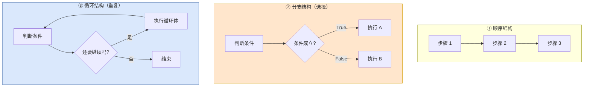

**流程说明**：

1. **顺序结构**：一条直线，从头走到尾。**所有程序的基础。**
2. **分支结构**：走到岔路口，根据条件决定往哪边走。**解决"要不要做"的问题。**
3. **循环结构**：走到一个环上，转到条件不满足为止才出去。**解决"重复做多少次"的问题。**

> **一句话总结**：**任何复杂的程序，拆到最后都是这三种结构的组合。** 就像乐高积木，只有三种基础块，但能拼出任何东西。

### 3.1.3 本篇知识地图

| 章节 | 内容 | 解决的问题 |
|---|---|---|
| 3.2 | 条件判断 `if` | 二选一、多选一 |
| 3.3 | 模式匹配 `match...case` | 针对固定值做多路分支（更清爽） |
| 3.4 | 循环 `while` / `for` | 重复执行 |
| 3.5 | 综合案例 | 把三者组合实战 |

---

## 3.2 条件判断 if

### 3.2.1 if 语句基本格式

#### 概念定义

**场景**：只有满足指定条件，才会执行对应的代码逻辑。

**语法**：

```python
if 要判断的条件:
    条件成立时，要执行对应的操作
```

```python
# 定义变量
score = 695

# 条件判断
if score > 680:
    print("欢迎你, 来清华读书")
```

#### 执行流程图

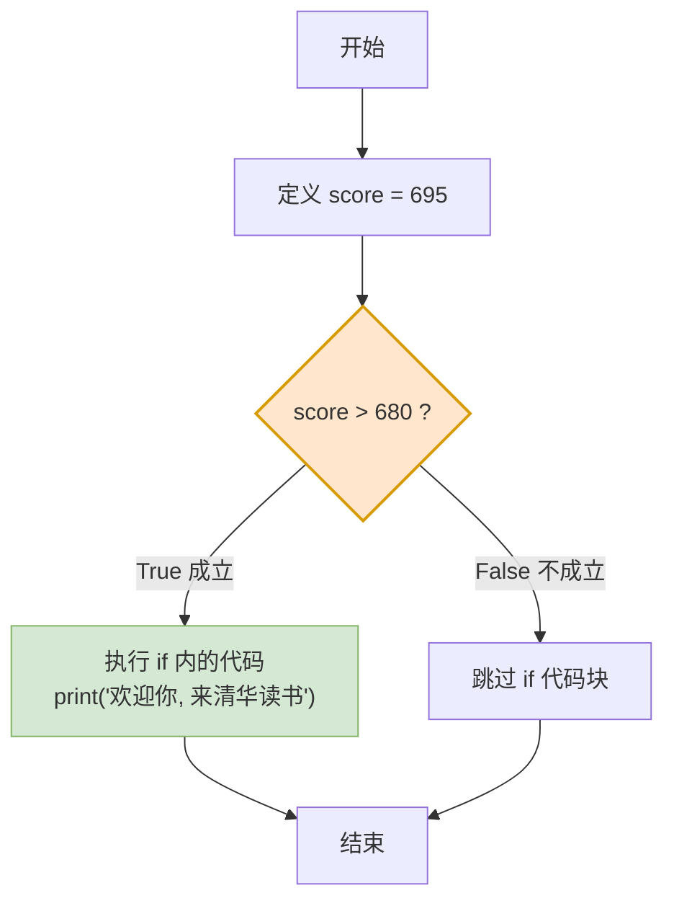

**流程说明**：

1. 先算出条件的值（这里 `score > 680` 结果是 `True`）。
2. **`True`** → 执行 `if` 里面的代码。
3. **`False`** → 直接跳过整个 `if` 代码块，什么都不做。

> **大白话比喻**：`if` 就像**门口的保安**。"如果"你带了工牌，就放你进去；没带，就从旁边走开，门里的事跟你没关系。

#### 注意事项（三条铁律）

| 注意点 | 说明 | ❌ 错误示例 | ✅ 正确示例 |
|---|---|---|---|
| **判断条件的结果必须是布尔类型** | 最终要能得出 `True` / `False` | `if score = 680:` | `if score > 680:` |
| **不要忘记条件后的冒号 `:`** | 冒号是"代码块开始"的标志 | `if score > 680` | `if score > 680:` |
| **代码块必须缩进** | 缩进描述层级关系（归属） | 顶格写 | 缩进 4 个空格 |

### 3.2.2 深入讲解：Python 的缩进规则

这是 Python 区别于其他语言（Java、C 用 `{}` 包代码块）的一个**重大特征**：

> **Python 中是通过缩进来描述代码的归属的。** 归属于 `if` 代码块的语句，需要在前方**缩进 4 个空格**（按 `Tab` 键 PyCharm 会自动转为空格）。

```python
score = 695

if score > 680:
    print("欢迎你, 来清华读书")        # ← 缩进了，属于 if 代码块
    print("也恭喜你即将踏入精彩的大学生活")  # ← 缩进了，属于 if 代码块

print("这句话和 if 无关，一定会执行")     # ← 没缩进，不属于 if
```

**归属关系对照表**：

| 代码 | 是否缩进 | 是否属于 if | 条件不成立时会执行吗 |
|---|:---:|:---:|:---:|
| `print("A")` | ✅ 缩进 4 空格 | ✅ 属于 | ❌ 不执行 |
| `print("B")` | ✅ 缩进 4 空格 | ✅ 属于 | ❌ 不执行 |
| `print("C")` | ❌ 顶格 | ❌ 不属于 | ✅ 执行 |

> **大白话比喻**：缩进就像**公司组织架构图**。缩进在 `if` 下面的，是 `if` 的"下属"，听 `if` 指挥；顶格的，是"平级同事"，`if` 管不着。

> ⚠️ **常见报错**：
> - `IndentationError: expected an indented block` —— **该缩进没缩进**
> - `IndentationError: unexpected indent` —— **不该缩进却缩进了**
> - 同一代码块缩进量不一致 —— 也会报错

### 3.2.3 if...else 结构

#### 为什么需要 else

看之前 B 站登录的需求：

```python
ok_account = "18888888888"
ok_password = "666888"

account = input("请输入 B 站账号：")
password = input("请输入 B 站密码：")

if account == ok_account and password == ok_password:
    print("登录成功 ~")
    print("进入 B 站首页 ~")

if account != ok_account or password != ok_password:
    print("登录失败 !")
    print("用户名或密码错误 !")
```

这段代码**能跑**，但**很繁琐**：明明"不成功就是失败"，却要写两个 `if`，把条件反过来再判断一遍。

#### else 的语法

```python
if 要判断的条件:
    条件成立时，执行对应的操作 1
else:
    条件不成立时，执行的操作 2
```

改写后：

```python
ok_account = "18888888888"
ok_password = "666888"

account = input("请输入 B 站账号：")
password = input("请输入 B 站密码：")

if account == ok_account and password == ok_password:
    print("登录成功 ~")
    print("进入 B 站首页 ~")
else:
    print("登录失败 !")
    print("用户名或密码错误 !")
```

#### if...else 执行流程图

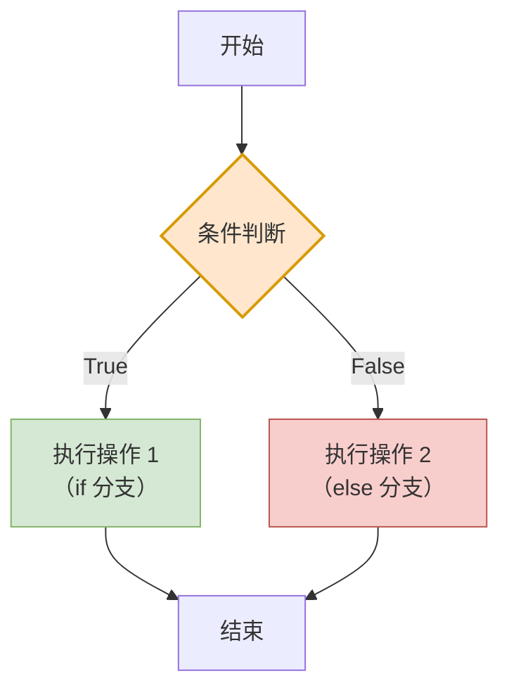

**流程说明**：

1. 判断条件。
2. `True` 走 `if` 分支，`False` 走 `else` 分支。
3. **两条路必走其一，且只走一条**，然后汇合到"结束"。

> **大白话**：`if...else` 就是**"要么这样，要么那样"**。像十字路口：红灯停，否则行。

#### 注意事项

| 注意点 | 说明 |
|---|---|
| `else` **不需要条件判断** | 当 `if` 条件不成立时，`else` 自然就执行了 |
| `else` **后面要有冒号** | `else:` |
| `else` 代码块**也要缩进** | 建议 4 个空格 |
| `else` **不能单独存在** | 必须搭配 `if` |

### 3.2.4 if...elif...else 结构

#### 问题引入

需求变了：判断输入的数字是**正数**、**负数**，还是 **0**。

用 `if...else` 只能分两种情况，不够用了：

```python
num = int(input("请输入数字："))
if num > 0:
    print(f"{num} 是正数")
else:
    if num < 0:
        print(f"{num} 是负数")
    else:
        print(f"{num} 是 0")
```

这样写**能实现**，但嵌套太深，可读性差。Python 提供了 `elif` 来解决：

#### 语法

```python
if 要判断的条件 1:
    条件成立时，执行对应的操作 1
elif 要判断的条件 2:
    条件成立时，执行对应的操作 2
else:
    条件不成立时，执行的操作 3
```

改写后：

```python
num = int(input("请输入数字："))
if num > 0:
    print(f"{num} 是正数")
elif num < 0:
    print(f"{num} 是负数")
else:
    print(f"{num} 是 0")
```

#### if...elif...else 执行流程图

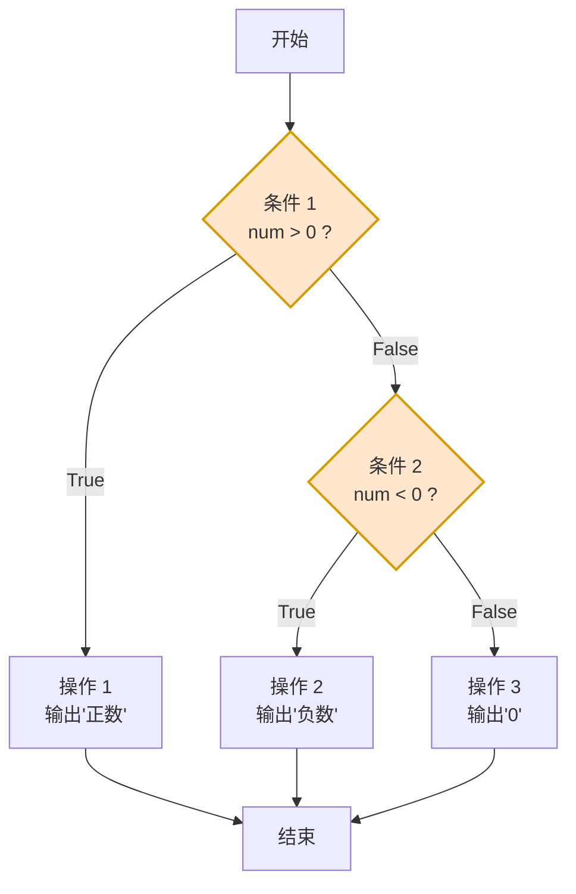

**流程说明（⚠️ 这段是本节的核心）**：

1. 先判断条件 1。**成立 → 执行操作 1，然后直接跳到"结束"**，条件 2 和 `else` 都不会再看。
2. 条件 1 不成立 → 才去判断条件 2。
3. 条件 2 成立 → 执行操作 2，跳到结束。
4. 条件 1、2 都不成立 → 才进入 `else`。

> ⚠️ **关键特性：多个条件判断是有顺序的，从上到下判断，如果前面有条件成立了，后面的条件就不会再判断了。**
>
> 这意味着：**条件的书写顺序会直接影响结果！**

**顺序陷阱实例**：

```python
# ❌ 错误顺序：分数 95 会被判成 "C"
score = 95
if score >= 60:
    print("C")
elif score >= 75:
    print("B")
elif score >= 90:
    print("A")
# 输出：C  ← 因为 95 >= 60 先成立了，后面根本不看

# ✅ 正确顺序：从大到小排
score = 95
if score >= 90:
    print("A")
elif score >= 75:
    print("B")
elif score >= 60:
    print("C")
# 输出：A  ✅
```

> **大白话**：`elif` 就像**面试排队**——第一个人被录取了，后面的人就不用再面试了。所以**把最严格的条件放前面**。

#### 三种 if 结构横向对比表（★重点）

| 结构 | 语法 | 分支数 | 适用场景 |
|---|---|:---:|---|
| **if** | `if 条件:` | 1 | 满足才做事，不满足什么都不做 |
| **if...else** | `if 条件:` / `else:` | 2 | 非此即彼，二选一 |
| **if...elif...else** | `if:` / `elif:` × N / `else:` | 多 | 多分支判断，区间分级 |

#### 注意事项汇总

| 注意点 | 说明 |
|---|---|
| `elif` **可以写多个** | 想写几个写几个 |
| `else` **可有可无** | 如果有，必须放在最后 |
| **判断顺序很重要** | 从上到下，命中即停 |
| `elif` **是 Python 特有** | 别的语言叫 `else if` |

### 3.2.5 条件判断实战案例

#### 案例一：判断闰年

> 规则：非整百年份且能被 4 整除的是闰年；整百年份（如 1900、2000）必须能被 400 整除才是闰年。

```python
year = int(input("请输入年份："))

if (year % 4 == 0 and year % 100 != 0) or year % 400 == 0:
    print(f"{year} 年是闰年")
else:
    print(f"{year} 年是平年")
```

#### 案例二：判断三角形类型

```python
a = int(input("请输入边长 a："))
b = int(input("请输入边长 b："))
c = int(input("请输入边长 c："))

# 先判断能否构成三角形：任意两边之和大于第三边
if a + b > c and a + c > b and b + c > a:
    if a == b == c:
        print("等边三角形")
    elif a == b or a == c or b == c:
        print("等腰三角形")
    else:
        print("普通三角形")
else:
    print("不能构成三角形")
```

#### 案例三：北京阶梯电费计算

> 规则：
> - 第一档：2880 度以下，单价 0.4883 元/度
> - 第二档：2880-4800 度，单价 0.5383 元/度
> - 第三档：4800 度以上，单价 0.7883 元/度

```python
degree = float(input("请输入用电度数："))

if degree <= 2880:
    cost = degree * 0.4883
elif degree <= 4800:
    cost = 2880 * 0.4883 + (degree - 2880) * 0.5383
else:
    cost = 2880 * 0.4883 + (4800 - 2880) * 0.5383 + (degree - 4800) * 0.7883

print(f"您的电费为：{cost:.2f} 元")
```

> 💡 **注意**：阶梯电价不是"全额按新单价"，而是**分段计价**——前 2880 度按第一档算，超出的部分才按第二档算。这是业务逻辑，写代码前必须先想清楚。

---

## 3.3 模式匹配 match...case

### 3.3.1 概念定义

**结构模式匹配**就是**用一个清晰的"模板"去精准地匹配数据的结构和内容**，匹配成功则执行相应的操作。

先看一个痛点场景——根据星期几输出工作安排：

```python
day = input("请输入星期几 (1-7)：")
if day == "1":
    print("周一：工作会议日")
elif day == "2":
    print("周二：学习培训日")
elif day == "3":
    print("周三：项目开发日")
elif day == "4":
    print("周四：代码审查日")
elif day == "5":
    print("周五：总结规划日")
elif day == "6" or day == "7":
    print("周末：休息放松")
else:
    print("输入错误")
```

问题很明显：**全是重复的 `day == "x"`，又长又啰嗦**。

用 `match...case` 改写：

```python
day = input("请输入星期几 (1-7)：")
match day:
    case "1":
        print("周一：工作会议日")
    case "2":
        print("周二：学习培训日")
    case "3":
        print("周三：项目开发日")
    case "4":
        print("周四：代码审查日")
    case "5":
        print("周五：总结规划日")
    case "6" | "7":
        print("周末：休息放松")
    case _:
        print("输入错误")
```

清爽多了。

### 3.3.2 语法详解

```python
match 表达式:
    case 值1:
        操作 1
    case 值2 if 条件表达式:
        操作 2
    case 值3 | 值4:
        操作 4
    case _:
        默认操作
```

| 语法元素 | 含义 |
|---|---|
| `match 表达式:` | 要匹配的"主语" |
| `case 值1:` | 匹配某个具体值 |
| `case 值2 if 条件表达式:` | 匹配值 **且** 满足额外条件（守卫） |
| `case 值3 \| 值4:` | `\|` 表示**或**的关系，匹配多个模式中的任意一个 |
| `case _:` | **匹配其他所有情况**（默认分支，相当于 `else`） |

### 3.3.3 执行流程图

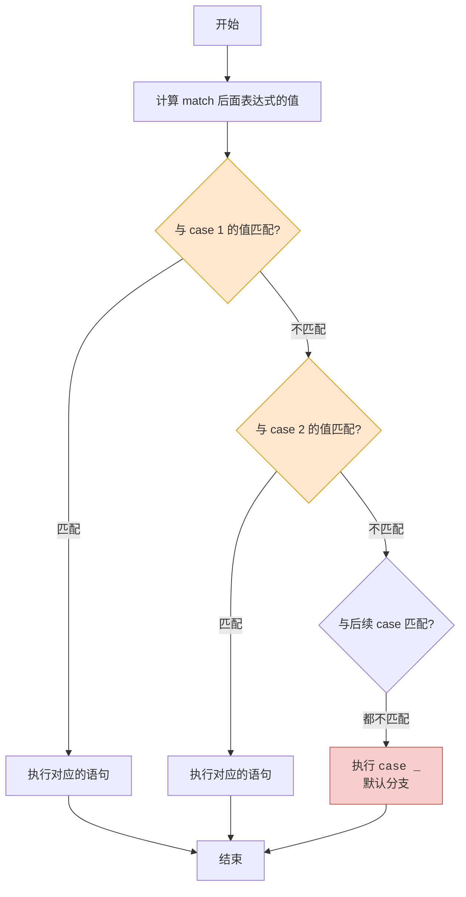

**流程说明**：

1. **首先计算 `match` 指定的表达式的值。**
2. **从上到下依次和 `case` 后面的值进行匹配，匹配正确，就执行对应语句。**
3. **如果前面所有的 `case` 都没有匹配上，就会执行默认的 `case _`。**
4. 匹配成功执行完后，**整个 `match` 结束**，不会再往下匹配。

> **大白话比喻**：`match...case` 就像**快递分拣**。包裹（表达式的值）送上传送带，第一个分拣口写着"北京"，不是就继续走；写着"上海"，还不是就继续走；一直走到最后那个"其他"口，就扔进去。

### 3.3.4 match...case vs if...elif...else 对比表（★重点）

| 对比项 | `match...case` | `if...elif...else` |
|---|---|---|
| **匹配对象** | **某个变量的多个固定值** | 任意布尔表达式 |
| **是否支持范围比较** | ❌ 不擅长 | ✅ 支持（`> < >= <=`） |
| **是否支持复杂组合条件** | 有限（可用 `if` 守卫） | ✅ 完全支持（`and` / `or` / `not`） |
| **可读性（固定值场景）** | ⭐⭐⭐⭐⭐ 更清爽 | ⭐⭐⭐ 略啰嗦 |
| **可读性（范围/逻辑场景）** | ⭐⭐ 勉强 | ⭐⭐⭐⭐⭐ |
| **Python 版本要求** | **3.10+** 新语法 | 所有版本 |
| **典型用法** | 菜单选择、指令分发、状态机 | 成绩分级、区间判断 |

**选择口诀**：

> - **基于某个变量的多个固定值进行分支判断时** → 用 `match`
> - **条件判断涉及复杂的逻辑判定、范围比较及组合条件时** → 用 `if`

**举例对照**：

| 需求 | 该用哪个 | 原因 |
|---|---|---|
| 输入 1-7 输出对应工作安排 | `match` | 固定值匹配 |
| 输入成绩判断 A/B/C/D 等级 | `if` | 范围比较 |
| 游戏指令：w/a/s/d/j 对应动作 | `match` | 固定字符匹配 |
| 判断是否为闰年 | `if` | 复杂逻辑组合 |
| 判断 BMI 属于偏瘦/正常/超重 | `if` | 范围比较 |

### 3.3.5 实战案例：游戏角色移动控制系统

**需求**：根据玩家输入的指令，控制角色执行相应动作。

| 玩家输入 | 对应动作 |
|---|---|
| 上 / w / W | 角色向上移动 |
| 下 / s / S | 角色向下移动 |
| 左 / a / A | 角色向左移动 |
| 右 / d / D | 角色向右移动 |
| 跳 / " "（空格） | 角色跳跃 |
| 攻击 / j / J | 角色发动攻击 |
| 退出 / esc / ESC | 角色退出游戏 |

```python
cmd = input("请输入指令：")

match cmd:
    case "上" | "w" | "W":
        print("角色向上移动")
    case "下" | "s" | "S":
        print("角色向下移动")
    case "左" | "a" | "A":
        print("角色向左移动")
    case "右" | "d" | "D":
        print("角色向右移动")
    case " ":
        print("角色跳跃")
    case "j" | "J":
        print("角色发动攻击")
    case "esc" | "ESC":
        print("角色退出游戏")
    case _:
        print("无效指令")
```

> 💡 **注意**：这里把大小写都列出来了。如果想更简洁，可以先用 `cmd.lower()` 统一转小写再匹配。

---

## 3.4 循环

### 3.4.1 概念定义

**循环**：**重复的执行某件事情**。

生活里的循环到处都是：

| 场景 | 重复的动作 | 结束条件 |
|---|---|---|
| 音乐播放器 | 播放一首歌 | 列表播完 |
| 跑步 | 迈步 | 跑够 5 公里 |
| 数数 | 加 1 | 数到 100 |

Python 提供两种循环：

| 循环类型 | 控制方式 | 适用场景 |
|---|---|---|
| **`while` 循环** | 通过**条件表达式**控制 | 循环**次数未知**，只知道开始/结束条件 |
| **`for` 循环** | **轮询遍历**一批数据 | 对**已知的数据集**遍历，或**已知次数**的循环 |

### 3.4.2 while 循环

#### 语法

```python
while 条件表达式:
    循环体语句 1
    循环体语句 2
    ...
else:
    条件为 False，循环正常结束时执行
```

> ⚠️ `else` 部分是可选的。

```python
i = 0
while i < 10:
    print("人生苦短, 我用 Python~")
    i += 1
else:
    print("循环正常结束, 执行完毕")
```

运行结果：打印 10 遍"人生苦短, 我用 Python~"，最后打印"循环正常结束, 执行完毕"。

#### while 循环执行流程图

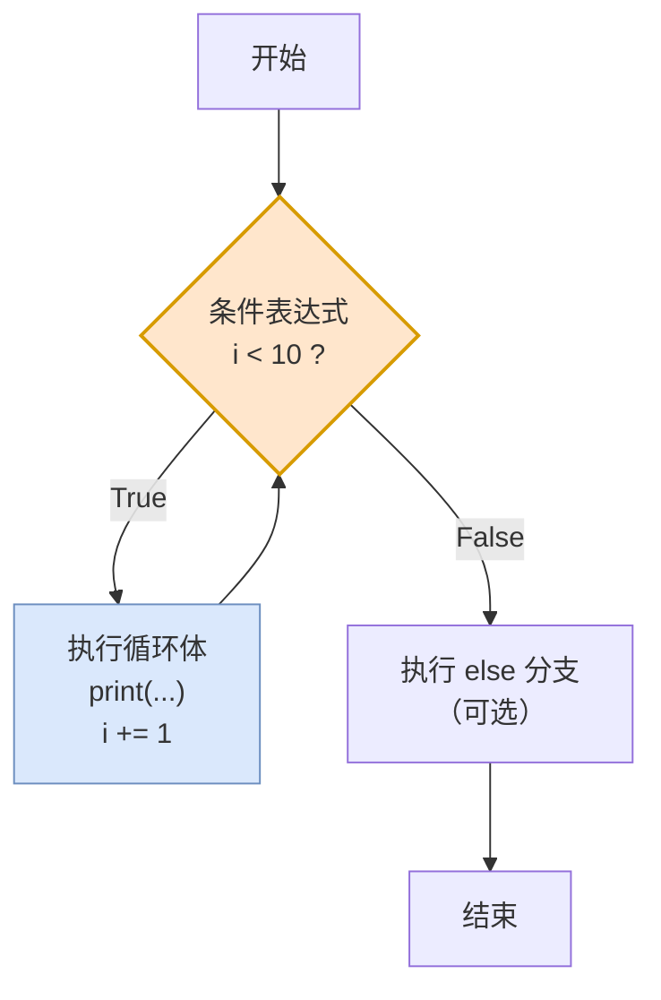

**流程说明**：

1. **先判断条件**，不是先执行循环体。所以条件一开始就为 `False` 时，循环体**一次都不执行**。
2. 条件为 `True` → 执行循环体 → **回到条件判断**。
3. 条件为 `False` → 跳出循环 → 执行 `else`（如果有）→ 结束。

> ⚠️ **循环三要素**（少一个就会出问题）：
> 1. **初始值**（`i = 0`）
> 2. **循环条件**（`i < 10`）
> 3. **让条件趋于结束的语句**（`i += 1`）
>
> 少了第 3 条 → **死循环**！

#### 注意事项

| 注意点 | 说明 |
|---|---|
| 条件表达式的结果为**布尔类型** | 必须有明确的真假 |
| **通过空格缩进表述层级关系** | 和 `if` 规则一致 |
| **规划好循环终止的条件** | 否则将**无限循环（死循环）** |
| `else` 是**可选**的 | 循环正常结束时才执行 |

> 💡 **`while...else` 的 `else` 什么时候不执行？**
>
> 当循环被 `break` 强制中断时，`else` **不会执行**。这是 `while...else` 比较反直觉的地方，后面 3.4.6 会详细讲。

#### 案例：计算 1-100 之间所有偶数的累加之和

**思考过程**：

| 问题 | 答案 |
|---|---|
| 如何获取 1-100 之间的偶数？ | `num % 2 == 0` |
| 累加运算使用什么运算符？ | `+=` |
| 从几开始，到几结束？ | 从 1 开始，到 100 结束 |

```python
num = 1
total = 0

while num <= 100:
    if num % 2 == 0:
        total += num
    num += 1

print(f"1-100 之间所有偶数的累加之和为：{total}")   # 2550
```

### 3.4.3 for 循环

#### 概念定义

> `while` 循环是通过**条件表达式**来控制是否要进行下一次循环的。而 `for` 循环，本质是一种**轮询遍历机制**，对一批内容进行逐个处理。

#### 语法

```python
for 元素 in 待处理数据集:
    循环体代码（对元素进行处理）
else:
    循环结束时，执行的代码
```

```python
# 定义要遍历的字符串
msg = "Hello-Python"

# 遍历字符串, 并处理
for i in msg:
    print(i)
else:
    print("循环结束")
```

运行结果：

```
H
e
l
l
o
-
P
y
t
h
o
n
循环结束
```

#### for 循环执行流程图

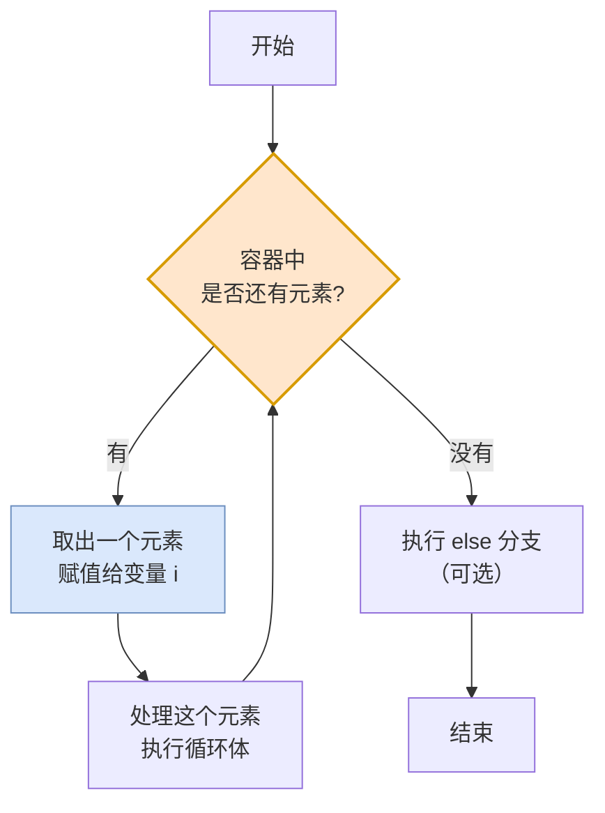

**流程说明**：

1. **`for` 不需要你手动控制索引**，它自己知道"下一个是谁"。
2. 容器里还有元素 → 取出一个 → 处理 → 回到判断。
3. 容器空了 → 循环结束。

> **大白话比喻**：
> - **`while`** 像**跑步机**：只要还能跑（条件成立），就一直跑，你得自己设定什么时候停。
> - **`for`** 像**发牌**：一副牌一张一张发，发完了自然就停，你不需要数次数。

### 3.4.4 range() 语句

**问题**：`for` 循环需要"一个数据集"才能遍历。那"计算 1-100 之间所有奇数之和"怎么办？总不能手写 `[1, 3, 5, ..., 99]` 吧？

`range()` 就是来解决这个问题的。

#### 概念定义

**作用**：**生成指定规则的数字序列**。

#### 三种用法

| 用法 | 语法 | 含义 | 举例 | 得到的数据 |
|---|---|---|---|---|
| **用法 1** | `range(end)` | 从 **0** 开始，到 `end` 结束（**不含 end 本身**） | `range(5)` | `0, 1, 2, 3, 4` |
| **用法 2** | `range(start, end)` | 从 `start` 开始，到 `end` 结束（**不含 end**） | `range(2, 8)` | `2, 3, 4, 5, 6, 7` |
| **用法 3** | `range(start, end, step)` | 从 `start` 开始，到 `end` 结束，步长为 `step` | `range(0, 10, 2)` | `0, 2, 4, 6, 8` |

> ⚠️ **"包前不包后"是 `range` 最容易记错的地方**：
>
> ```python
> range(5)          # 0,1,2,3,4       ← 共 5 个数
> range(1, 101)     # 1,2,...,100     ← 共 100 个数，"要含 100 就得写到 101"
> ```

**步长为负数的用法**：

```python
list(range(10, 0, -2))   # [10, 8, 6, 4, 2]  倒着数
```

#### 用 range 解决之前的练习

```python
# 计算 1-100 之间所有奇数之和
total = 0
for i in range(1, 101):
    if i % 2 != 0:
        total += i
print(total)   # 2500

# 计算 100-500 之间所有 3 的倍数的数字之和
total = 0
for i in range(100, 501):
    if i % 3 == 0:
        total += i
print(total)
```

### 3.4.5 while 与 for 的对比（★重点）

#### 全方位对比表

| 对比项 | `while` 循环 | `for` 循环 |
|---|---|---|
| **控制方式** | 条件表达式 | 遍历数据集 |
| **循环次数** | 通常**未知** | 通常**已知** |
| **关注点** | **循环的条件** | **遍历每一个元素** |
| **是否需要手动控制变量** | ✅ 需要（`i += 1`） | ❌ 不需要 |
| **死循环风险** | ⚠️ 高（忘了自增就死循环） | 低（数据遍历完自然结束） |
| **典型场景** | 猜数字、登录重试、不确定次数的循环 | 遍历列表/字符串/字典、已知次数的循环 |
| **`else` 子句** | 支持 | 支持 |

#### 选择口诀

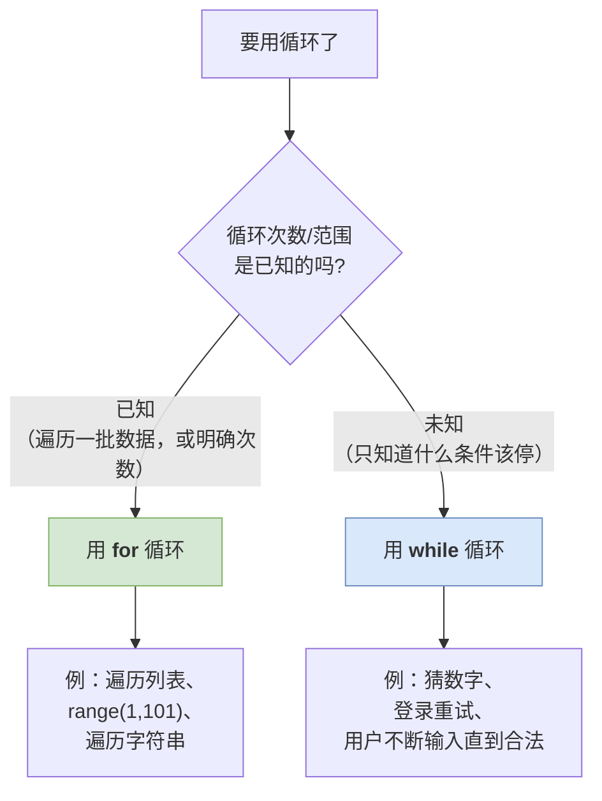

> **一句话**：**知道要转几圈用 `for`，只知道什么时候该停用 `while`。**

### 3.4.6 嵌套循环

#### 概念定义

**嵌套循环**就是**在一个循环里再写一个循环**。

```python
for 元素 in 待处理数据集1:
    循环体的代码 1
    循环体的代码 2
    ...
    for 元素 in 待处理数据集2:
        循环体的代码 1
        循环体的代码 2
        ...
    ...
```

| 位置 | 名称 | 作用 |
|---|---|---|
| 外层 | **外层循环** | 控制"大轮次" |
| 内层 | **内层循环** | 每一轮里做的小循环 |

#### 嵌套循环执行流程图（以打印 99 乘法表为例）

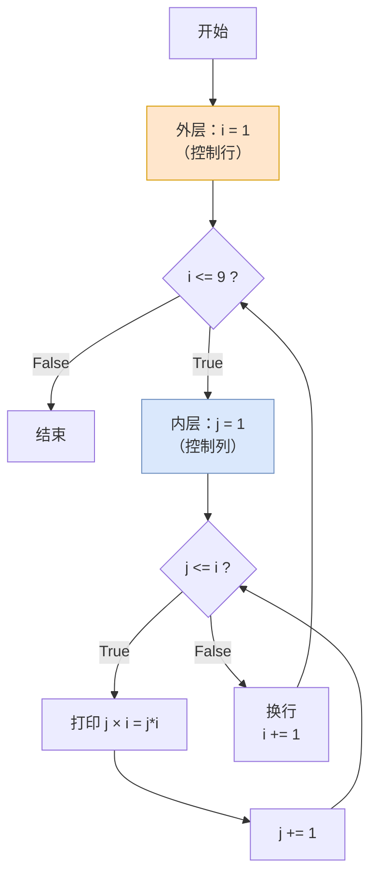

**流程说明**：

1. 外层循环走一步，**内层循环要走完整整一圈**。
2. 所以总执行次数 = 外层次数 × 内层次数。
3. 例：外层 9 次，内层平均 5 次 → 内层循环体总共执行约 45 次。

> **大白话比喻**：嵌套循环就像**时钟**。
> - **外层循环 = 时针**：走 1 格。
> - **内层循环 = 分针**：时针走 1 格的过程中，分针要转满 1 圈（60 秒）。
> - **再嵌套一层 = 秒针**：分针走 1 格的过程中，秒针要转满 1 圈。
>
> 这就是为什么"时钟每走 1 小时，秒针要跳 3600 次"。

#### 案例：打印 99 乘法表

```python
for i in range(1, 10):        # 外层循环控制行（第二个数）
    for j in range(1, i + 1): # 内层循环控制列（第一个数）
        print(f"{j}×{i}={i*j}", end="\t")
    print()                   # 每行结束后换行
```

输出：

```
1×1=1
1×2=2	2×2=4
1×3=3	2×3=6	3×3=9
...
```

### 3.4.7 break 与 continue

#### 概念定义

| 关键字 | 作用 | 记忆 |
|---|---|---|
| **`break`** | 表示**结束、跳出**整个循环 | "我不玩了" |
| **`continue`** | 表示**中断本次循环，直接进入下一次循环** | "这次跳过，继续下一个" |

> ⚠️ **两个关键字都不能够单独书写，只能出现在循环中。**

#### 执行流程对比图

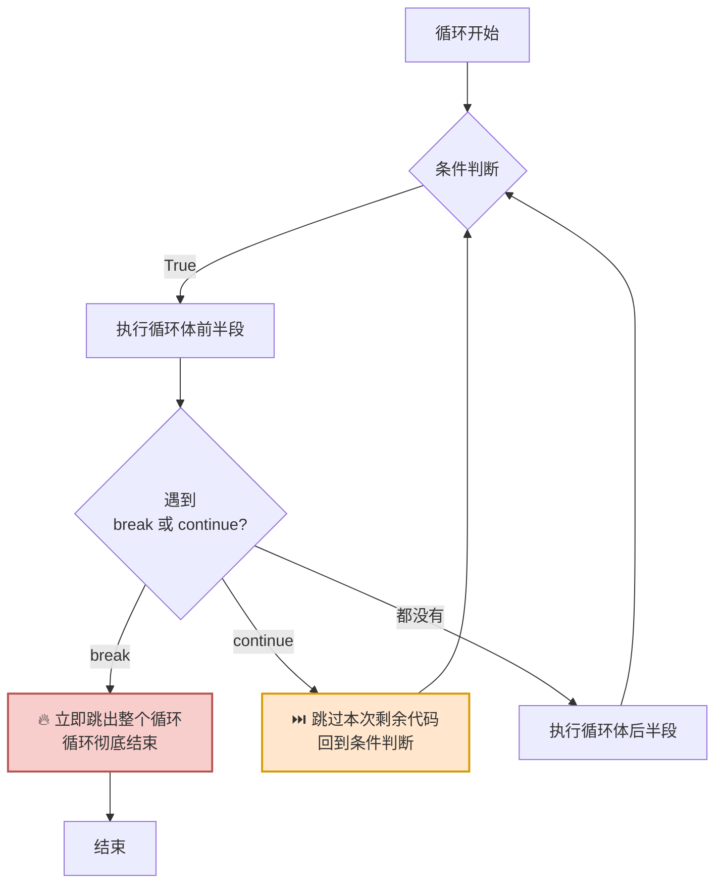

#### 对照实例

```python
# break 示例：遇到 5 就彻底停
for i in range(1, 11):
    if i == 5:
        break          # 直接跳出整个循环
    print(i)
# 输出：1 2 3 4

# continue 示例：遇到 5 只是跳过它
for i in range(1, 11):
    if i == 5:
        continue       # 跳过 5，继续 6、7、8...
    print(i)
# 输出：1 2 3 4 6 7 8 9 10
```

#### 对比表

| 对比项 | `break` | `continue` |
|---|---|---|
| **作用范围** | 结束**整个循环** | 只结束**本次**迭代 |
| **循环还继续吗** | ❌ 不继续 | ✅ 继续下一次 |
| **类比** | 辞职不干了 | 请一天假，明天还来 |
| **典型场景** | 找到了就停、密码输错 5 次锁定 | 跳过不合格的数据 |

> ⚠️ **`break` 与 `while...else` 的关系**：
>
> 当循环被 `break` 中断时，`else` **不会执行**。
>
> ```python
> i = 0
> while i < 5:
>     if i == 3:
>         break
>     i += 1
> else:
>     print("循环正常结束")   # ← 不会执行！
> ```
>
> 所以 `else` 常用来判断"循环是正常跑完的，还是被 break 打断的"。

---

## 3.5 综合案例

### 3.5.1 案例一：登录验证（while 循环 + break）

**需求**：正确的用户名和密码为 `admin/666888`、`zhangsan/123456`、`taoge/888666`。输入用户名和密码进行登录，直到登录成功程序结束；如果失败则继续输入。用户名和密码不能为空。

```python
users = {
    "admin": "666888",
    "zhangsan": "123456",
    "taoge": "888666",
}

while True:
    username = input("请输入用户名：").strip()
    password = input("请输入密码：").strip()

    if not username or not password:
        print("用户名和密码不能为空，请重新输入！")
        continue

    if username in users and users[username] == password:
        print("登录成功，进入 B 站首页 ~")
        break
    else:
        print("用户名或密码错误, 请重新输入 !")
```

**关键点解析**：

| 代码 | 作用 |
|---|---|
| `while True:` | 条件恒为真，配合 `break` 使用（"无限循环 + 出口"模式） |
| `.strip()` | 去掉首尾空格，防止用户误输入空格 |
| `if not username` | 空字符串是假值，所以 `not ""` 为 `True` |
| `continue` | 输入为空时跳过本次，重新输入 |
| `break` | 登录成功才跳出循环 |

### 3.5.2 案例二：限制登录次数（5 次机会）

**需求**：同上，但只有 5 次登录机会，输错 5 次不允许再操作。

```python
users = {
    "admin": "666888",
    "zhangsan": "123456",
    "taoge": "888666",
}

for attempt in range(5):
    username = input(f"请输入用户名（第 {attempt + 1}/5 次）：")
    password = input("请输入密码：")

    if username in users and users[username] == password:
        print("登录成功，进入 B 站首页 ~")
        break
    else:
        print(f"用户名或密码错误！还剩 {4 - attempt} 次机会")
else:
    print("错误次数过多，账号已锁定！")
```

> 💡 **这里 `for...else` 用得恰到好处**：只有 5 次全部用完（没有被 `break` 打断），`else` 才会执行，提示"账号已锁定"。

### 3.5.3 案例三：猜数字游戏

**需求**：系统随机生成一个随机数，用户猜数字。猜错了提示"猜大了"或"猜小了"，猜对了自动退出。

```python
import random

target = random.randint(1, 100)   # 生成 1-100 的随机整数
count = 0

while True:
    guess = int(input("请输入你猜的数字（1-100）："))
    count += 1

    if guess > target:
        print("猜大了！")
    elif guess < target:
        print("猜小了！")
    else:
        print(f"恭喜你，猜对了！答案就是 {target}，你一共猜了 {count} 次。")
        break
```

### 3.5.4 案例四：统计字符串中指定字符的个数

**需求**：统计字符串 `"akiwksjakdiklowiqaamnvbamvaxnsjdsjkaaxkjd"` 中有多少个 `a` 和 `k`。

```python
text = "akiwksjakdiklowiqaamnvbamvaxnsjdsjkaaxkjd"
count_a = 0
count_k = 0

for ch in text:
    if ch == "a":
        count_a += 1
    elif ch == "k":
        count_k += 1

print(f"a 出现了 {count_a} 次，k 出现了 {count_k} 次")
```

---

## 3.6 本篇小结

### 3.6.1 核心结构速查表

| 结构 | 语法骨架 | 用途 |
|---|---|---|
| **if** | `if 条件:` | 单分支 |
| **if...else** | `if 条件:` / `else:` | 二选一 |
| **if...elif...else** | `if:` / `elif:`×N / `else:` | 多分支、区间分级 |
| **match...case** | `match x:` / `case 值:` / `case _:` | 固定值多路分支 |
| **while** | `while 条件:` | 次数未知的循环 |
| **for** | `for x in 数据集:` | 遍历已知数据集 |
| **range** | `range(start, end, step)` | 生成数字序列（包前不包后） |
| **嵌套循环** | 循环里套循环 | 二维问题（乘法表、图形打印） |
| **break** | 循环中 | 跳出整个循环 |
| **continue** | 循环中 | 跳过本次，进入下一次 |

### 3.6.2 流程结构总览图

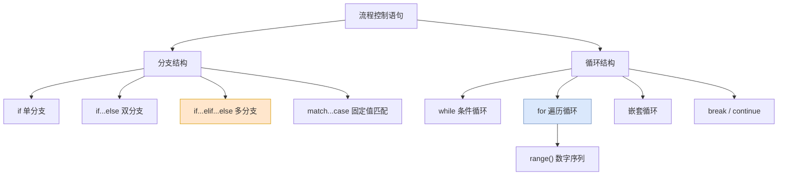

### 3.6.3 易错点清单

| 易错点 | 现象 | 正确做法 |
|---|---|---|
| **忘记冒号** | `SyntaxError` | `if x > 1:` 别忘了 `:` |
| **忘记缩进** | `IndentationError` | 代码块缩进 4 空格 |
| **混用 Tab 和空格** | 难以排查的缩进错误 | 统一用 4 个空格 |
| **`=` 写成 `==`** | `if a = 1:` 报错 | `if a == 1:` |
| **while 忘记自增** | 死循环，程序卡死 | 循环体内必须有让条件趋假的语句 |
| **`range(1, 100)` 想含 100** | 少了最后一个数 | 写成 `range(1, 101)` |
| **`elif` 顺序颠倒** | 分数 95 判成 C | 严格条件放前面 |
| **`break` 写在循环外** | `SyntaxError` | `break`/`continue` 只能在循环内 |
| **混淆 `break` 和 `continue`** | 该跳过的却全停了 | 记住：`break` 全停，`continue` 只跳一次 |
| **多分支写成多个 if** | 逻辑重复、效率低 | 用 `elif` 串起来 |

### 3.6.4 动手练习

> **练习 1**：根据输入的成绩判断等级。≥90 为 A，≥75 为 B，≥60 为 C，其余为 D。
>
> **练习 2**：购物折扣计算。金额 ≥500 打 8 折，300 ≤ 金额 < 500 打 9 折，100 ≤ 金额 < 300 打 95 折，金额 < 100 无折扣。
>
> **练习 3**：根据输入的直角边边长，打印等腰直角三角形（边长 5 时输出 5 行，第 n 行有 n 个 `*`）。
>
> **练习 4**：打印国际象棋棋盘（8×8 黑白交替）。
>
> **练习 5**：将 1-1000 之间（含 1000）所有 5 的倍数的数字累加起来。

> **下一步** → 打开 `04-第2章03节-数据存储容器.md`，学习如何用一个变量装下一堆数据。
