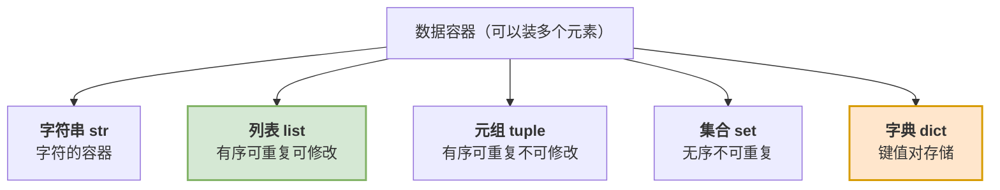
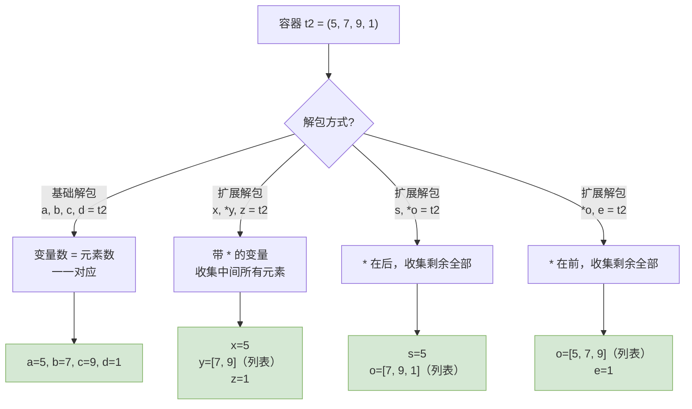
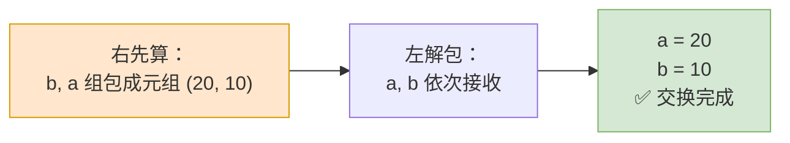
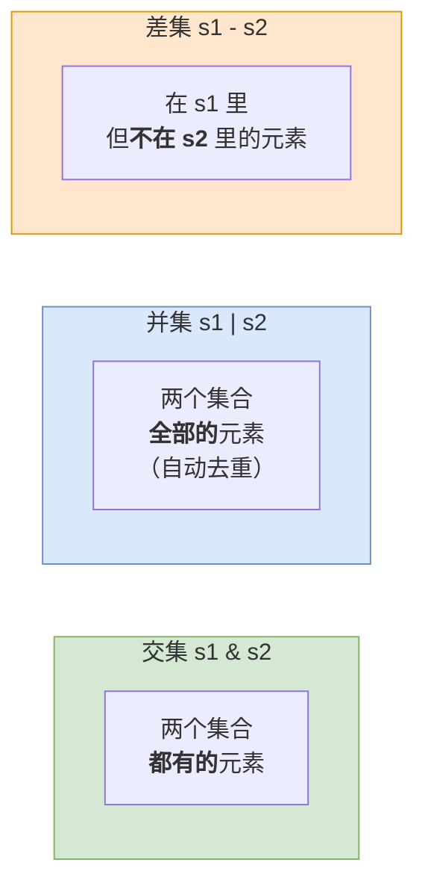
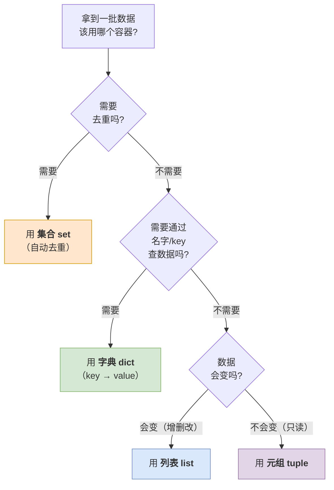

# 第04篇 · 数据存储容器

> **本篇定位**：之前一个变量只能装**一个**数据。但现实中我们经常要处理"一批"数据——全班 50 个成绩、购物车里的 10 个商品。这一篇就是教你**怎么用一个变量装下一堆数据**。
>
> 本篇是全课程**概念最密集**的一篇，最后那张【五大容器对比总表】是整门课最重要的表，务必吃透。

---

## 4.1 为什么需要数据容器

### 4.1.1 问题引入

需求：记录 10 个学生的成绩，然后求最大值、最小值、平均值。

用之前学的变量怎么写？

```python
score1 = 695
score2 = 558
score3 = 622
score4 = 589
score5 = 645
score6 = 607
score7 = 577
score8 = 552
score9 = 475
score10 = 602
# ... 如果有 100 个学生呢？
```

两个致命问题：

| 问题 | 说明 |
|---|---|
| **繁琐** | 100 个学生要写 100 行，还要给 100 个变量起名字 |
| **无法批量处理** | 想算平均值，得手动把 100 个变量一个个加起来 |

### 4.1.2 概念定义

> **数据容器**是一种**可以容纳多份数据**的数据类型。容纳的每一份数据称之为 **1 个元素**，每一个元素都可以是**任意类型**的数据（如：字符串、数字、布尔等）。

用容器改写上面的需求：

```python
score_list = [695, 558, 622, 589, 645, 607, 577, 552, 475, 602]
```

一行搞定，而且可以配合 `for` 循环批量处理：

```python
score_list = [695, 558, 622, 589, 645, 607, 577, 552, 475, 602]
print(f"最高分：{max(score_list)}")
print(f"最低分：{min(score_list)}")
print(f"平均分：{sum(score_list) / len(score_list):.1f}")
```

### 4.1.3 Python 的五大容器



**选择容器时，先问三个问题**：

| 问题 | 影响 |
|---|---|
| **是否允许重复元素？** | 不允许 → 用集合 `set` |
| **是否可以修改？** | 不可以 → 用元组 `tuple` |
| **是否需要按顺序、按下标访问？** | 需要 → 用列表 `list` / 元组 / 字符串 |

---

## 4.2 列表 list

### 4.2.1 概念定义

**列表**是数据容器中的一类，**一次性可以存储多个数据（元素）**。

**定义格式**：

```python
列表名称 = [元素1, 元素2, 元素3, 元素4, 元素5...]
```

**三大特点**：

| 特点 | 说明 |
|---|---|
| **可以存储不同类型的元素** | `[1, "abc", True, 3.14]` 完全合法 |
| **元素有序** | 有固定的顺序，位置不会乱 |
| **元素可以重复** | `[1, 1, 2, 2]` 合法 |
| **元素可以修改** | 可以增删改 |

### 4.2.2 深入讲解：索引（下标）

**问题**：列表里有 7 个元素，我怎么拿到第 3 个？

**答**：通过**索引**（也叫**下标**）。

```python
s = [54, 15, 75, 108, 23, 78, 75]
```

**索引对照图**：

| 元素 | 54 | 15 | 75 | 108 | 23 | 78 | 75 |
|---|:---:|:---:|:---:|:---:|:---:|:---:|:---:|
| **正向索引** | 0 | 1 | 2 | 3 | 4 | 5 | 6 |
| **反向索引** | -7 | -6 | -5 | -4 | -3 | -2 | -1 |

> ⚠️ **两条铁律**：
> - **从前向后（正向索引）：下标从 `0` 开始**
> - **从后向前（反向索引）：下标从 `-1` 开始**

```python
s = [54, 15, 75, 108, 23, 78, 75]
print(s[0])    # 54   ← 第一个
print(s[6])    # 75   ← 最后一个（正向）
print(s[-1])   # 75   ← 最后一个（反向，更常用）
print(s[-7])   # 54   ← 第一个（反向）
```

> **大白话比喻**：索引就像**储物柜的柜门编号**。一排柜子从 0 号开始编号；如果你懒得从头数，也可以从后往前数："倒数第 1 个、倒数第 2 个……"

**序列类型**：

> 容器中的元素**按特定顺序排列的、可通过索引访问**的容器类型，称之为**序列**。

| 是否序列 | 容器 |
|---|---|
| ✅ 是序列（支持索引、切片） | 字符串 `str`、列表 `list`、元组 `tuple` |
| ❌ 不是序列 | 集合 `set`、字典 `dict` |

### 4.2.3 列表元素的查看、修改、删除

| 操作 | 语法 | 举例 | 说明 |
|---|---|---|---|
| **查看** | `列表[索引]` | `list1[0]` | 取出指定位置的元素 |
| **修改** | `列表[索引] = 新值` | `list1[0] = "A"` | 替换指定位置的元素 |
| **删除** | `del 列表[索引]` | `del list1[3]` | 删除指定位置的元素 |

```python
list1 = ["A", "B", "C", "D", "E"]

print(list1[0])      # A        查看
list1[0] = "Z"       # 修改
print(list1)         # ['Z', 'B', 'C', 'D', 'E']

del list1[3]         # 删除索引 3 的元素
print(list1)         # ['Z', 'B', 'C', 'E']
```

> ⚠️ **注意**：**如果指定的索引值超出范围，将会报错** —— `IndexError: list index out of range`

### 4.2.4 列表切片

#### 概念定义

**切片**是指**对操作的数据截取其中一部分的操作**。

> 💡 **列表、字符串、元组都支持切片操作**（因为它们都是序列）。

#### 语法

```python
序列数据[开始索引 : 结束索引 : 步长]
```

#### 三个参数的规则

| 参数 | 含义 | 不指定时的默认值 |
|---|---|---|
| **`开始索引`** | 从哪开始 | 默认为 `0`（第一个元素） |
| **`结束索引`** | 到哪结束 | 默认为**列表长度**（直到列表末尾） |
| **`步长`** | 每隔几个取一个 | 默认为 `1` |

> ⚠️ **切片不包含结束索引位置对应的元素**（这就是所谓的"**包前不包后**"）。
>
> 索引采用正向、反向索引都可以。

#### 切片示例

```python
s = ["A", "C", "E", "B", "D", "E"]

print(s[0:5:1])   # ['A', 'C', 'E', 'B', 'D']   ← 不含索引 5
print(s[0:5:2])   # ['A', 'E', 'D']             ← 每隔 1 个取 1 个
print(s[:3])      # ['A', 'C', 'E']             ← 省略开始，从 0 开始
print(s[2:])      # ['E', 'B', 'D', 'E']        ← 省略结束，取到末尾
print(s[:])       # 全部元素（复制一份）
print(s[::-1])    # ['E', 'D', 'B', 'E', 'C', 'A']  ← 反转列表
```

> 💡 **最实用的切片技巧**：`s[::-1]` 一步**反转列表/字符串**，比写循环方便得多。

#### 切片 vs 索引 对比表

| 对比项 | 索引 `s[i]` | 切片 `s[start:end:step]` |
|---|---|---|
| **返回结果** | **单个元素**（元素本身的类型） | **新的序列**（同类型） |
| **越界行为** | 报 `IndexError` | **不报错**，返回空或部分 |
| **能否省略** | 不能 | 三个参数都能省略 |
| **典型用途** | 取某一个 | 取一段 |

### 4.2.5 列表的常用方法

#### 什么是"方法"

> **方法**就像是**物品具备的能力或功能**。

| 生活类比 | 对象 | 方法 |
|---|---|---|
| 手机 | 手机 | 拍照、打电话、发短信 |
| 空调 | 空调 | 制冷、制热、通风 |
| **列表** | **列表对象** | **添加元素、删除元素、排序** |

**调用语法**：`对象.方法名(参数)`

#### 列表常用方法表（★重点）

| 方法 | 作用 | 样例 |
|---|---|---|
| `append()` | 在列表的**尾部追加**元素 | `s.append(10086)` |
| `insert()` | 在**指定索引之前**，插入该元素 | `s.insert(0, 92)` |
| `remove()` | 移除列表中**第一个匹配到的值** | `s.remove(75)` |
| `pop()` | 删除列表中**指定索引位置**的元素（未指定索引则默认删最后一个） | `s.pop(2)` / `s.pop()` |
| `sort()` | 对列表进行**排序**（元素类型需一致） | `s.sort()` |
| `reverse()` | **反转**列表元素 | `s.reverse()` |

```python
s = [54, 15, 75, 108, 23, 78, 75]

s.append(10086)
print(s)          # [54, 15, 75, 108, 23, 78, 75, 10086]

s.insert(0, 92)
print(s)          # [92, 54, 15, 75, 108, 23, 78, 75, 10086]

s.remove(75)
print(s)          # [92, 54, 15, 108, 23, 78, 75, 10086]  ← 只删了第一个 75

s.pop(2)
print(s)          # [92, 54, 108, 23, 78, 75, 10086]

s.sort()
print(s)          # 升序排列

s.reverse()
print(s)          # 反转
```

> ⚠️ **`sort()` 的前提**：**列表元素的数据类型一致，才可以进行排序**。`[1, "a"]` 排序会报错。

#### 常用统计语句

这几个不是列表的方法，而是 Python 内置函数，直接传列表进去：

| 语句 | 作用 | 举例 |
|---|---|---|
| `min()` | 获取**最小值** | `min([3, 1, 2])` → `1` |
| `max()` | 获取**最大值** | `max([3, 1, 2])` → `3` |
| `sum()` | **求和** | `sum([3, 1, 2])` → `6` |
| `len()` | 获取**元素的个数** | `len([3, 1, 2])` → `3` |

### 4.2.6 列表的合并与成员判断

| 操作 | 语法 | 说明 |
|---|---|---|
| **合并（法一）** | `列表1 + 列表2` | 使用 `+` 运算符直接合并 |
| **合并（法二）** | `[*列表1, *列表2]` | 使用 `*` 进行**解包**操作 |
| **判断存在** | `元素 in 列表` | 返回布尔值，`True` 表示存在 |

> **什么是解包？** **解包指将列表这一类数据容器"解开"成独立的元素。**

```python
list1 = [1, 2, 3]
list2 = [4, 5, 6]

print(list1 + list2)          # [1, 2, 3, 4, 5, 6]
print([*list1, *list2])       # [1, 2, 3, 4, 5, 6]

print(3 in list1)             # True
print(9 in list1)             # False
print(9 not in list1)         # True
```

### 4.2.7 列表推导式

#### 为什么需要它

需求：生成 1-20 的平方列表。

用循环写：

```python
squares = []
for i in range(1, 21):
    squares.append(i ** 2)
print(squares)
```

用**列表推导式**写：

```python
squares = [i ** 2 for i in range(1, 21)]
print(squares)
```

#### 概念定义

> **列表推导式**就是**按照一定规则快速生成一个列表**的方法。

#### 两种格式

| 格式 | 语法 | 含义 |
|---|---|---|
| **格式 1** | `[要插入列表的数据 for i in 列表]` | 对每个元素做转换 |
| **格式 2** | `[要插入列表的数据 for i in 列表 if 条件]` | 先过滤，再转换 |

```python
# 格式 1：生成 1-5 的平方
squares = [i ** 2 for i in range(1, 6)]
print(squares)   # [1, 4, 9, 16, 25]

# 格式 2：从数字列表中提取偶数并求平方
nums = [19, 23, 54, 64, 87, 20, 109, 232, 123, 43, 26, 55, 72]
even_squares = [i ** 2 for i in nums if i % 2 == 0]
print(even_squares)
```

> **大白话比喻**：列表推导式就像**一条流水线**——原料（`for i in 列表`）送进去，先过一道质检（`if 条件`），合格的再加工一下（`要插入列表的数据`），最后打包成新列表出来。

#### 列表推导式 vs 列表推导式（生成器表达式）

| 对比项 | 列表推导式 `[...]` | 生成器表达式 `(...)` |
|---|---|---|
| **语法** | `[值 for i in 数据集 if 条件]` | `(值 for i in 数据集 if 条件)` |
| **求值时机** | **立即求值**，一次性生成整个列表 | **惰性求值**，按需逐个生成 |
| **内存占用** | 大（所有元素同时存在） | 小（一次只存一个） |
| **适用场景** | 数据量不大、需要重复访问 | 处理大数据集、作为 `sum/max/min` 的参数 |

---

## 4.3 字符串 str

### 4.3.1 概念定义

> **字符串是字符的容器**，一个字符串中可以存放任意数量的字符。如：`"Python"` / `'Python'` / `"""Python"""`。

**三大特点**：

| 特点 | 含义 |
|---|---|
| **不可变性** | 无法修改（不能像列表那样 `s[0] = "X"`） |
| **有序性** | 每个字符都有固定的位置 |
| **可迭代性** | 可以用 `for` 循环逐个遍历 |

### 4.3.2 字符串的索引与切片

字符串和列表一样是**序列**，所以索引和切片的规则完全一样。

```python
s = "Python"
#   P  y  t  h  o  n
#   0  1  2  3  4  5     正向索引
#  -6 -5 -4 -3 -2 -1     反向索引
```

```python
s = "Python"
print(s[0])       # P
print(s[-1])      # n
print(s[0:5:1])   # Pytho    ← 不含索引 5
print(s[0:5:2])   # Pto
print(s[::-1])    # nohtyP   ← 反转
```

> ⚠️ **注意**：字符串**不可修改**！
> ```python
> s = "Python"
> s[0] = "J"     # ❌ 报错 TypeError: 'str' object does not support item assignment
> s = "J" + s[1:]  # ✅ 只能通过"重新拼接"生成新字符串
> ```

### 4.3.3 字符串常用方法表（★重点）

| 方法 | 作用 | 样例 | 结果 |
|---|---|---|---|
| `find()` | 查找子串，返回**第一次出现的索引**，找不到返回 `-1` | `"Python".find("t")` | `2` |
| `count()` | 统计子串出现的次数 | `"Hello".count("l")` | `2` |
| `upper()` | 所有字母转**大写** | `"abc".upper()` | `"ABC"` |
| `lower()` | 所有字母转**小写** | `"ABC".lower()` | `"abc"` |
| `split()` | 按指定分隔符**分割成列表** | `"a,b,c".split(",")` | `['a','b','c']` |
| `strip()` | 去除**两端**的空白字符或指定字符 | `"  hi  ".strip()` | `"hi"` |
| `replace()` | 把指定子串**替换**为新子串 | `"Hello".replace("H","C")` | `"Cello"` |
| `startswith()` | 检查是否**以指定子串开头**，返回布尔值 | `"Python".startswith("P")` | `True` |

> 💡 **判断子串是否存在，用 `in` 更简单**：
> ```python
> print("th" in "Python")   # True
> ```

### 4.3.4 实战案例

#### 案例一：邮箱格式验证

> 需求：验证邮箱格式是否正确（包含一个 `@` 和至少一个 `.`）

```python
email = input("请输入邮箱：")

if "@" in email and "." in email:
    print("邮箱格式正确")
else:
    print("邮箱格式错误")
```

#### 案例二：判断回文串

> 回文：正着读和反着读一样，如"黄山落叶松叶落山黄"、"上海自来水来自海上"

```python
s = input("请输入字符串：")

if s == s[::-1]:
    print("是回文串")
else:
    print("不是回文串")
```

#### 案例三：字符串反转并转大写

```python
result = []
for _ in range(10):
    s = input("请输入字符串：")
    result.append(s[::-1].upper())

for item in result:
    print(item)
```

---

## 4.4 元组 tuple

### 4.4.1 为什么需要元组

先看列表的特点：**元素可重复、有序、可以修改**。

那如果有些信息**不能被修改，只能查询**呢？（比如一年的 12 个月份、一周的 7 天、坐标点）用列表就不合适了——万一不小心改了怎么办？

这时就用**元组**。

> **元组与列表最大的不同点在于：元组一旦定义完成，不可修改。**

### 4.4.2 概念定义

> **元组**是**不可变的序列**，类似于列表，但**创建后不能修改**。

**特点**：

| 特点 | 说明 |
|---|---|
| 可以存储**不同类型的元素** | `(1, "abc", True, 3.14)` 完全合法 |
| 元素**可以重复** | `(1, 1, 2, 2)` 合法 |
| 元素**有序** | 有固定的顺序，位置不会乱 |
| 元素**不可以修改** | ⚠️ 创建后不能增删改，也不能重新赋值 |
| 支持**索引访问、切片** | 用法与列表一致，`t[0]`、`t[1:3]` 都合法 |

**定义**：

```python
元组名称 = (元素1, 元素2, ...)

# 定义空元组
元组名称 = ()
元组名称 = tuple()
```

**元组的两个方法**：

| 方法 | 作用 |
|---|---|
| `count()` | 统计某元素在元组中出现的次数 |
| `index()` | 查找某个元素的索引位置（第一次出现的位置） |

```python
t1 = (5, 7, 9, 1, 2, 3, 10, 6, 4, 8, 12, 7, 5)

print(t1.count(7))    # 2
print(t1.index(9))    # 2
```

> ⚠️ **元组使用注意事项**：**定义单元素元组时，需要在结尾加上逗号**！
>
> ```python
> t = ("A")     # ❌ 这不是元组，这是字符串！
> print(type(t))  # <class 'str'>
>
> t = ("A",)    # ✅ 这才是元组
> print(type(t))  # <class 'tuple'>
> ```
>
> 为什么？因为 `()` 同时也是数学运算的括号，Python 需要靠那个逗号来确认你的意图。

### 4.4.3 组包与解包（★重点）

#### 概念定义

| 概念 | 定义 |
|---|---|
| **组包（Packing）** | 将多个值**合并到一个容器**（元组、列表）中 |
| **解包（Unpacking）** | 将容器（元组、列表）**解开成独立的元素**，分别赋值给多个变量 |

#### 组包

```python
t1 = (5, 7, 9, 1)     # 带括号组包
t2 = 5, 7, 9, 1       # 不带括号也可以，Python 自动组包成元组
```

#### 解包

```python
t1 = (5, 7, 9, 1)
t2 = 5, 7, 9, 1

# 基础解包：变量个数必须与元素个数一致
a, b, c, d = t1
print(a, b, c, d)     # 5 7 9 1

# (*) 扩展解包：* 收集剩余的所有元素
x, *y, z = t2
print(x)   # 5
print(y)   # [7, 9]     ← 注意：是列表！
print(z)   # 1

s, *o = t2
print(s)   # 5
print(o)   # [7, 9, 1]

*o, e = t2
print(o)   # [5, 7, 9]
print(e)   # 1
```

**说明**：在元组解包时，`*` 表示**收集剩余的所有元素**，允许我们处理**不确定数量**的元素（生成列表，以便于可以进行进一步的处理）。

#### 解包流程图



### 4.4.4 解包的经典应用：一行交换两个变量

还记得第 02 篇那个"用中间变量交换两杯水"的案例吗？有了元组解包，一行就能搞定：

```python
a = 10
b = 20

a, b = b, a     # ✅ 一行交换！

print(a, b)     # 20 10
```

**原理**：



**流程说明**：

1. **先算等号右边**：`b, a` 自动组包成一个元组 `(20, 10)`。
2. **再解包到左边**：`a, b` 依次接收，`a` 拿 20，`b` 拿 10。
3. 完美交换，不需要中间变量。

**三个变量交换同理**：

```python
a, b, c = 100, 200, 300
c, a, b = a, b, c       # 将 a,b,c 的值分别赋给 c,a,b
print(a, b, c)          # 200 300 100
```

---

## 4.5 集合 set

### 4.5.1 为什么需要集合

**场景**：业务中需要存储一批**用户的手机号**——手机号是**唯一**的，不能重复。

列表和元组能存吗？

> **不可以**，因为这两种类型**可以存储重复元素**。

这时用**集合 `set`**：**会自动去重，存储不重复的元素**。

### 4.5.2 概念定义

> **集合**是一种**无序的、不可重复、可修改**的数据容器。

**定义**：

```python
# 定义集合
s1 = {"C", "D", "X", "T", "O", "U"}

# 定义空集合
s2 = set()
```

> ⚠️ **两个重要注意点**：
> 1. **空集合的定义不可以使用 `{}`** —— `{}` 表示的是**空字典**！
> 2. **由于集合是无序的，因此不支持下标索引访问**（`s1[0]` 会报错）。

**三大特点**：

| 特点 | 说明 |
|---|---|
| **无序** | 元素的存储顺序和定义顺序无关（不要依赖显示顺序） |
| **不可重复** | 自动去重 |
| **可修改** | 可以增删元素（但不能改某个具体元素） |

### 4.5.3 集合的常用方法

| 操作 | 方法 | 含义 |
|---|---|---|
| **添加** | `add(..)` | 添加元素到集合中 |
| **删除** | `remove(..)` | 移除指定元素（**不存在将报错**） |
| | `pop()` | **随机**删除一个元素并返回 |
| | `clear()` | 清空集合 |
| **差集** | `difference()` | 包含在第一个集合但**不包含在第二个**集合的元素 |
| **并集** | `union()` | 两个集合的**全部**元素 |
| **交集** | `intersection()` | **两个集合都有**的元素 |

```python
s1 = {"A", "B", "C"}
s2 = {"B", "C", "D"}

s1.add("E")
print(s1)                        # {'A', 'B', 'C', 'E'}

s1.remove("E")
print(s1)                        # {'A', 'B', 'C'}

print(s1.difference(s2))         # {'A'}      ← 在 s1 不在 s2
print(s1.union(s2))              # {'A','B','C','D'}   ← 全部
print(s1.intersection(s2))       # {'B','C'}  ← 都有
```

### 4.5.4 交并差的运算符写法

| 运算符 | 含义 | 等价方法 |
|:---:|---|---|
| `&` | **交集** | `s1.intersection(s2)` |
| `\|` | **并集** | `s1.union(s2)` |
| `-` | **差集** | `s1.difference(s2)` |

> 💡 运算符写法更简洁，实际开发中更常用。

### 4.5.5 交并差图解



> **大白话比喻**（用班级选课理解）：
>
> 假设足球课名单是 `s1`，篮球课名单是 `s2`。
> - **交集 `s1 & s2`** = **既选了足球又选了篮球**的同学
> - **并集 `s1 | s2`** = **选了足球或篮球（至少一门）**的所有同学
> - **差集 `s1 - s2`** = **选了足球但没选篮球**的同学

### 4.5.6 集合推导式

和列表推导式写法一样，只是把 `[]` 换成 `{}`：

```python
# 格式 1
变量名称 = {i 表达式 for i in 列表}

# 格式 2
变量名称 = {i 表达式 for i in 列表 if 条件}
```

### 4.5.7 实战案例：班级选课分析

```python
football_set = {"王林", "曾牛", "徐立国", "遁天", "天运子", "韩立", "厉飞雨", "乌丑", "紫灵"}
basketball_set = {"张铁", "墨居仁", "王林", "姜老道", "曾牛", "王蝉", "韩立", "天运子", "李化元", "厉飞雨", "云露"}
french_set = {"许木", "王卓", "十三", "虎咆", "姜老道", "天运子", "红蝶", "厉飞雨", "韩立", "曾牛"}
art_set = {"遁天", "天运子", "韩立", "虎咆", "姜老道", "紫灵"}

# 1. 同时选修了法语和艺术的学生
print("法语+艺术：", french_set & art_set)

# 2. 同时选修了所有四门课程的学生
print("四门全选：", football_set & basketball_set & french_set & art_set)

# 3. 选修了足球，但没有选修篮球的学生
print("足球但没篮球：", football_set - basketball_set)
```

---

## 4.6 字典 dict

### 4.6.1 为什么需要字典

**需求**：存储班级学员的高考成绩——王林(670)、韩立(556)、李慕婉(582)、紫灵(435)、许立国(608)...

用列表怎么存？

```python
name_list = ["王林", "韩立", "李慕婉", "紫灵", "许立国"]
score_list = [670, 556, 582, 435, 608]
```

**问题**：想知道"韩立考了多少分"，得先在 `name_list` 里找到韩立的下标，再用这个下标去 `score_list` 里取值。**两步操作，繁琐又低效**。

用字典：

```python
dict1 = {
    "王林": 670,
    "韩立": 556,
    "李慕婉": 582,
    "紫灵": 435,
    "许立国": 608,
}

print(dict1["韩立"])    # 556   ← 一步到位！
```

### 4.6.2 概念定义

> **字典**使用**键值对（key: value）**来存储数据，每一个键都对应一个值，**通过键（key）可以快速找到对应的值（value）**。

**三大特点**：

| 特点 | 说明 |
|---|---|
| **键值对存储** | `key: value` 成对出现 |
| **键（key）不能重复** | 重复定义时，**后面的覆盖前面的** |
| **可修改** | 可以增删改 |

**定义**：

```python
# 定义字典
字典名称 = {key: value, key: value, key: value …}

# 定义空字典
字典名称 = {}
字典名称 = dict()

# 根据 key 获取 value
值 = 字典名称[key]
```

```python
dict1 = {"王林": 675, "李慕婉": 608, "许立国": 478}
score = dict1["王林"]
print(score)   # 675
```

> **大白话比喻**：字典就像**查真正的字典**。
> - **key** = 要查的**字/词**
> - **value** = 这个字对应的**解释**
> - 每个字对应一个解释，**字（key）不能重复**
>
> 也叫做**映射（map）**或**哈希表（hash）**。

### 4.6.3 注意事项（三条）

| 注意点 | 说明 |
|---|---|
| **value 可以是任何类型的数据** | 数字、字符串、列表、甚至另一个字典 |
| **key 不能为可变类型** | 不能是 `list`、`set`、`dict`（因为它们是可变的，无法稳定计算哈希值） |
| **key 不允许重复** | 重复定义时后面的覆盖前面的 |
| **字典没有索引下标** | 不能根据索引获取值，**只可以根据 key 获取 value** |

### 4.6.4 字典的增删改查（★核心表）

| 类型 | 操作 | 含义 | 样例 |
|---|---|---|---|
| **添加** | `字典名称[key] = value` | 往指定字典中添加键值对（key 不存在时） | `dict1["涛哥"] = 688` |
| **删除** | `字典名称.pop(key)` | 删除指定的 key，**并返回该 key 对应的 value** | `score = dict1.pop("涛哥")` |
| | `del 字典名称[key]` | 删除指定的键值对 | `del dict1["涛哥"]` |
| **修改** | `字典名称[key] = value` | 修改指定的 key 对应的值（key 存在时） | `dict1["小智"] = 658` |
| **查询** | `字典名称[key]` | 根据 key 获取 value（**key 不存在会报错**） | `dict1["涛哥"]` |
| | `字典名称.get(key)` | 根据 key 获取 value（**key 不存在返回 None，不报错**） | `dict1.get("涛哥")` |
| | `字典名称.keys()` | 获取所有的 key | `dict1.keys()` |
| | `字典名称.values()` | 获取所有的 value | `dict1.values()` |
| | `字典名称.items()` | 获取所有的键值对 | `dict1.items()` |

> ⚠️ **重点辨析：`dict[key]` vs `dict.get(key)`**
>
> | 写法 | key 存在 | key 不存在 |
> |---|---|---|
> | `dict1[key]` | 返回 value | ❌ **报 KeyError** |
> | `dict1.get(key)` | 返回 value | ✅ 返回 `None` |
>
> **不确定 key 是否存在时，用 `.get()` 更安全。**

### 4.6.5 字典的遍历

字典支持 `for` 循环遍历，通过三种方法实现：

| 遍历方式 | 代码 | 变量拿到的是 |
|---|---|---|
| **遍历 key** | `for k in dict1.keys():` | 每个 key |
| **遍历 value** | `for v in dict1.values():` | 每个 value |
| **遍历键值对** | `for k, v in dict1.items():` | key 和 value（**最常用**） |

```python
dict1 = {"小智": 675, "李思": 608, "李琪": 478}

for k in dict1.keys():
    print(k)

for v in dict1.values():
    print(v)

for k, v in dict1.items():
    print(f"{k} 的成绩是 {v}")
```

> 💡 **注意**：`for k in dict1:` 直接遍历字典，拿到的也是 **key**，等价于 `dict1.keys()`。

### 4.6.6 字典的嵌套

字典的 value 可以是**任何类型**，包括另一个字典或列表。这让字典可以表达非常复杂的结构。

```python
# 购物车：商品名 → {价格, 数量}
shopping_cart = {
    "Meta80": {"price": 6999, "num": 2},
    "鼠标": {"price": 199, "num": 1},
}

# 取值
print(shopping_cart["Meta80"]["price"])   # 6999

# 遍历
for name, info in shopping_cart.items():
    print(f"商品名称: {name}, 商品价格: {info['price']}, 商品数量: {info['num']}")
```

**常见的数据结构设计对比**（以购物车为例）：

| 设计方案 | 结构 | 优点 | 缺点 |
|---|---|---|---|
| **方案一：单个字典** | `{"name": "Meta80", "price": 6999, "num": 2}` | 简单 | 只能存**一个**商品 |
| **方案二：字典列表** | `[{"name":"Meta80","price":6999,"num":2}, {...}]` | 有序，可遍历 | 查某个商品要遍历 |
| **方案三：嵌套字典** | `{"Meta80": {"price":6999,"num":2}, ...}` | **按商品名秒查**，最优雅 | 稍复杂 |

> ✅ **实际开发推荐方案三**：因为购物车最常见的操作就是"根据商品名查/改/删"，用商品名做 key 效率最高。

---

## 4.7 ★五大容器终极对比总表

**这是整门课最重要的一张表，建议背下来。**

| 特性 | 字符串 `str` | 列表 `list` | 元组 `tuple` | 集合 `set` | 字典 `dict` |
|---|---|---|---|---|---|
| **定义符号** | `'...'` / `"..."` | `[...]` | `(...)` | `{...}` | `{k: v}` |
| **有序性** | ✅ 有序 | ✅ 有序 | ✅ 有序 | ❌ **无序** | ✅ 有序（3.7+） |
| **允许重复元素** | ✅ 允许 | ✅ 允许 | ✅ 允许 | ❌ **不允许** | key 不允许重复 |
| **可变性** | ❌ **不可变** | ✅ 可变 | ❌ **不可变** | ✅ 可变 | ✅ 可变 |
| **支持索引访问** | ✅ 支持 | ✅ 支持 | ✅ 支持 | ❌ **不支持** | ❌ 不支持（用 key） |
| **支持切片操作** | ✅ 支持 | ✅ 支持 | ✅ 支持 | ❌ **不支持** | ❌ 不支持 |
| **空值写法** | `""` | `[]` | `()` | `set()` ⚠️ | `{}` |
| **典型使用场景** | 文本处理 | 有序可重复的数据集合 | 固定不变的记录 | 去重的数据集合 | 键值对映射 |

### 4.7.1 记忆口诀



---

## 4.8 综合案例

### 4.8.1 案例一：成绩统计

**需求**：将用户输入的 10 个数字存入列表，排序后输出最小值、最大值、平均值。

```python
nums = []
for i in range(10):
    num = float(input(f"请输入第 {i + 1} 个数字："))
    nums.append(num)

nums.sort()
print(f"排序后：{nums}")
print(f"最小值：{min(nums)}")
print(f"最大值：{max(nums)}")
print(f"平均值：{sum(nums) / len(nums):.2f}")
```

### 4.8.2 案例二：列表合并去重排序

**需求**：合并两个列表，去重后输出。

```python
num_list1 = [19, 23, 54, 64, 875, 20, 109, 232, 123, 54]
num_list2 = [55, 80, 72, 35, 60, 123, 54, 29, 91]

# 方法一：用集合去重（最简洁）
result = sorted(set(num_list1 + num_list2))
print(result)

# 方法二：用循环去重（保持原顺序）
result = []
for n in num_list1 + num_list2:
    if n not in result:
        result.append(n)
result.sort()
print(result)
```

> 💡 **两种方法怎么选？**
> - **要"去重 + 排序"** → 直接用 `set`（代码最短）
> - **要"去重但保持原顺序"** → 用循环 + `not in` 判断

### 4.8.3 案例三：列表推导式综合

```python
# 1. 生成 1-20 的平方列表
squares = [i ** 2 for i in range(1, 21)]

# 2. 提取偶数并求平方
nums = [19, 23, 54, 64, 87, 20, 109, 232, 123, 43, 26, 55, 72]
even_squares = [i ** 2 for i in nums if i % 2 == 0]

# 3. 提取正数
mixed = [11, 2, 31, 4, -5, 15, 17, 28, 49, 10, -11, 16, 54, -14, 36, -16, 87, -39]
positives = [i for i in mixed if i > 0]
```

### 4.8.4 案例四：购物车管理系统（字典版）

```python
shopping_cart = {}

while True:
    print("\n===== 购物车管理系统 =====")
    print("1. 添加购物车")
    print("2. 修改购物车")
    print("3. 删除购物车")
    print("4. 查询购物车")
    print("5. 退出购物车")

    choice = input("请选择操作：")

    if choice == "1":
        name = input("请输入商品名称：")
        price = float(input("请输入商品价格："))
        num = int(input("请输入商品数量："))
        shopping_cart[name] = {"price": price, "num": num}
        print("添加成功！")

    elif choice == "2":
        name = input("请输入要修改的商品名称：")
        if name in shopping_cart:
            price = float(input("请输入新的价格："))
            num = int(input("请输入新的数量："))
            shopping_cart[name] = {"price": price, "num": num}
            print("修改成功！")
        else:
            print("商品不存在！")

    elif choice == "3":
        name = input("请输入要删除的商品名称：")
        if name in shopping_cart:
            shopping_cart.pop(name)
            print("删除成功！")
        else:
            print("商品不存在！")

    elif choice == "4":
        if not shopping_cart:
            print("购物车为空！")
        else:
            for name, info in shopping_cart.items():
                print(f"商品名称: {name}, 商品价格: {info['price']}, 商品数量: {info['num']}")

    elif choice == "5":
        print("退出购物车")
        break

    else:
        print("输入有误，请重新选择！")
```

### 4.8.5 案例五：教务管理系统

**需求**：维护学员成绩信息，支持添加、修改、删除、查询、列出全部、统计班级成绩。

```python
students = {}

def add_student():
    name = input("请输入学生姓名：")
    chinese = float(input("请输入语文成绩："))
    math = float(input("请输入数学成绩："))
    english = float(input("请输入英语成绩："))
    students[name] = {"语文": chinese, "数学": math, "英语": english}
    print("添加成功！")

def modify_student():
    name = input("请输入要修改的学生姓名：")
    if name in students:
        students[name]["语文"] = float(input("请输入新的语文成绩："))
        students[name]["数学"] = float(input("请输入新的数学成绩："))
        students[name]["英语"] = float(input("请输入新的英语成绩："))
        print("修改成功！")
    else:
        print("学生不存在！")

def delete_student():
    name = input("请输入要删除的学生姓名：")
    if name in students:
        students.pop(name)
        print("删除成功！")
    else:
        print("学生不存在！")

def query_student():
    name = input("请输入要查询的学生姓名：")
    if name in students:
        info = students[name]
        print(f"{name}：语文 {info['语文']}，数学 {info['数学']}，英语 {info['英语']}")
    else:
        print("学生不存在！")

def list_all():
    if not students:
        print("暂无学生信息！")
        return
    for name, info in students.items():
        print(f"{name}：语文 {info['语文']}，数学 {info['数学']}，英语 {info['英语']}")

def statistics():
    if not students:
        print("暂无学生信息！")
        return
    for subject in ["语文", "数学", "英语"]:
        scores = [info[subject] for info in students.values()]
        print(f"{subject}：最高分 {max(scores)}，最低分 {min(scores)}，平均分 {sum(scores)/len(scores):.1f}")

while True:
    print("\n===== 教务管理系统 =====")
    print("1.添加  2.修改  3.删除  4.查询  5.列出全部  6.统计  7.退出")
    choice = input("请选择：")

    match choice:
        case "1": add_student()
        case "2": modify_student()
        case "3": delete_student()
        case "4": query_student()
        case "5": list_all()
        case "6": statistics()
        case "7":
            print("再见！")
            break
        case _:
            print("输入有误！")
```

> 💡 **这就是一个完整的"增删改查"系统骨架**。后面学完函数（第 05 篇）和面向对象（第 07 篇），你会看到同样功能的更优雅写法。

---

## 4.9 本篇小结

### 4.9.1 五大容器核心方法速查

| 容器 | 添加 | 删除 | 查询 | 其他 |
|---|---|---|---|---|
| **列表 list** | `append()` `insert()` | `remove()` `pop()` `del` | `[i]` `in` | `sort()` `reverse()` |
| **字符串 str** | ❌ 不可变 | ❌ 不可变 | `find()` `in` | `upper()` `lower()` `split()` `strip()` `replace()` |
| **元组 tuple** | ❌ 不可变 | ❌ 不可变 | `[i]` `index()` | `count()` |
| **集合 set** | `add()` | `remove()` `pop()` `clear()` | `in` | `& \| -` |
| **字典 dict** | `[k]=v` | `pop()` `del` | `[k]` `get()` | `keys()` `values()` `items()` |

### 4.9.2 易错点清单

| 易错点 | 错误写法 | 正确写法 |
|---|---|---|
| 索引从 1 开始数 | `s[1]` 想取第一个 | `s[0]` 才是第一个 |
| 切片以为"含结束" | `s[0:5]` 以为取 6 个 | 实际取 5 个（不含索引 5） |
| 想修改字符串 | `s[0] = "X"` | 重新拼接：`s = "X" + s[1:]` |
| 单元素元组忘了逗号 | `t = ("A")` 得到字符串 | `t = ("A",)` |
| 空集合写成 `{}` | `s = {}` 得到空字典 | `s = set()` |
| 集合用下标访问 | `s[0]` | 集合无序，不支持索引 |
| 字典用 `[]` 取不存在的 key | `d["x"]` 报 KeyError | 用 `d.get("x")` 返回 None |
| `sort()` 混类型 | `[1, "a"].sort()` | 类型要一致 |
| 解包数量不匹配 | `a, b = (1, 2, 3)` | 用 `a, *b = (1, 2, 3)` |

### 4.9.3 动手练习

> **练习 1**：合并三个列表并去重、排序后输出。
> ```python
> list1 = ['M','A','C','E','F','G','H','L','N','I','J','K','O']
> list2 = ['X','Z','T','Y','D','E','F','G']
> list3 = ['W','A','S','D']
> ```
>
> **练习 2**：将 `[1..30]` 中能被 3 或 5 整除的元素提出来，求平方组成新列表。
>
> **练习 3**：根据学生成绩单，计算每个学生的总分和平均分，统计各科最低/最高/平均分，找出平均分大于 90 的学生。
>
> **练习 4**：用元组解包实现三个变量的循环交换。

> **下一步** → 打开 `05-第2章04节-函数.md`，学会把重复的代码"打包"起来。
