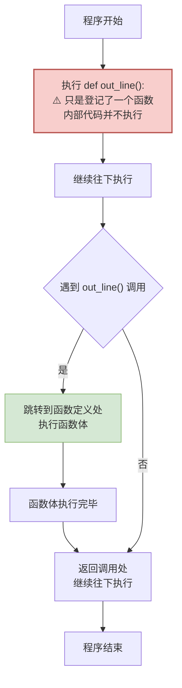
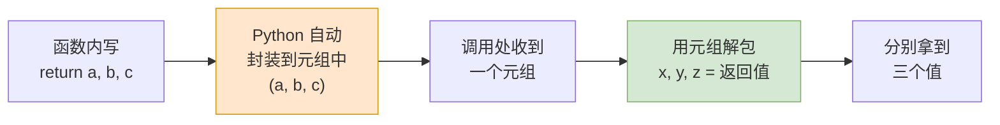
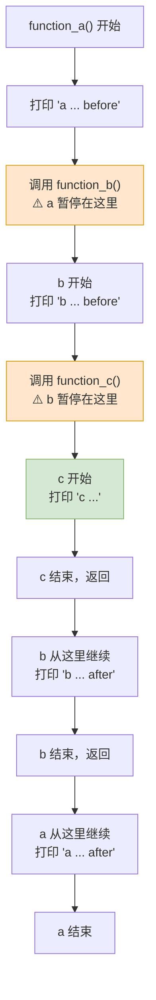
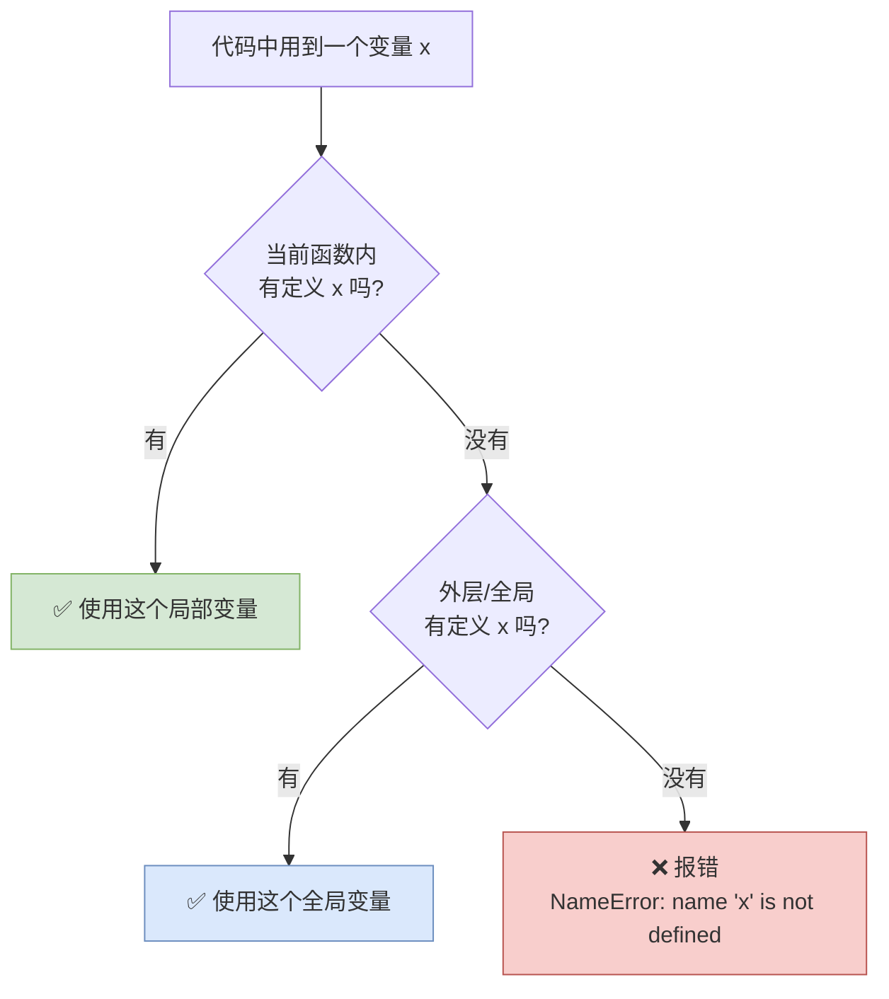
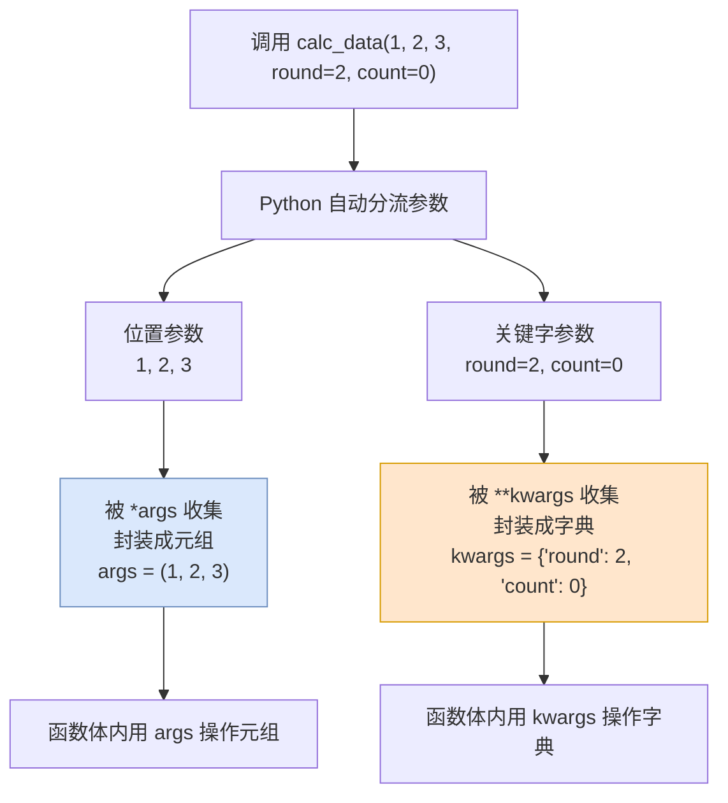
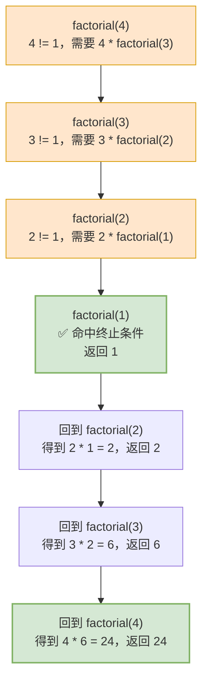
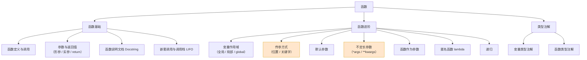

# 第05篇 · 函数

> **本篇定位**：之前写的代码都是"一次性的"——换个数据就要重抄一遍。函数就是教你**把一段代码打包成一个"工具"**，用的时候喊一声就行。
>
> 这是从"会写代码"到"会写程序"的分水岭。学完这一篇，你的代码会开始变得**整洁、可复用、可维护**。

---

## 5.1 什么是函数

### 5.1.1 概念定义

> **函数**是**组织好的、可重复使用的、用来实现特定功能的代码片段**。

拆解三个关键词：

| 关键词 | 含义 |
|---|---|
| **组织好的** | 代码有结构、有边界，不是散落一地的 |
| **可重复使用的** | 定义一次，可以调用无数次 |
| **实现特定功能的** | 一个函数只干一件事 |

### 5.1.2 深入讲解：你早就在用函数了

回顾之前用过的东西：

```python
name = input("请输入姓名：")     # 要输入，直接调用 input()
print(f"你好, {name}")           # 要输出，直接调用 print()
print(max([1, 5, 3]))            # 要最大值，直接调用 max()
print(min([1, 5, 3]))            # 要最小值，直接调用 min()
print(len("Python"))             # 要长度，直接调用 len()
print(sum([1, 2, 3]))            # 要求和，直接调用 sum()
```

**为什么可以直接用？** 因为 `input()`、`print()`、`max()`、`min()`、`len()`、`sum()` 都是 **Python 的内置函数**——它们的共同点是：

| 共同点 | 说明 |
|---|---|
| **是提前定义好的** | Python 官方已经写好了，你不用管内部怎么实现 |
| **可以重复使用** | 用多少次都行 |
| **实现特定功能** | `max()` 就是求最大值，不会干别的 |

> **关键洞察**：如果 Python 没有 `max()` 函数，你要写一段循环来求最大值；有了它，一行搞定。**函数就是这样一种"封装复杂性"的工具。**

### 5.1.3 为什么要自己写函数

看一段真实的痛点代码：

```python
print("---------------------------")
print("     学员管理系统 v1.0")
print("---------------------------")

# ... 中间一堆业务代码 ...

print("---------------------------")
print("     学员管理系统 v1.0")
print("---------------------------")
```

问题：这个分隔线要打印很多次，每次都得抄 3 行。如果哪天要改成 `*` 号，得改几十处。

**用函数改写**：

```python
def out_line():
    print("---------------------------")

out_line()
print("     学员管理系统 v1.0")
out_line()

# ... 中间一堆业务代码 ...

out_line()
print("     学员管理系统 v1.0")
out_line()
```

**优势对照表**：

| 对比项 | 不用函数 | 用函数 |
|---|---|---|
| **代码量** | 每次 3 行 | 每次 1 行 |
| **修改成本** | 改 N 处 | 改 1 处 |
| **出错概率** | 高（可能抄错） | 低 |
| **可读性** | 看不出意图 | `out_line()` 一眼看懂 |

### 5.1.4 函数的定义与调用

**语法**：

```python
# 定义函数
def 函数名(参数列表):
    函数体
    ......
    return 返回值

# 调用函数
函数名(参数)
```

**实例**：

```python
# 定义函数
def out_line():
    print('---------------------------')

# 调用函数
out_line()
```

### 5.1.5 函数定义与调用流程图



**流程说明（⚠️ 核心要点）**：

1. **函数定义时，内部代码并未执行。** Python 只是"记住"了有这么个函数。
2. **只有在调用函数时，函数体的逻辑才会运行。**
3. 调用完，**回到调用处**继续往下执行。

> **大白话比喻**：
> - **定义函数** = 把菜谱**写进笔记本**。写的时候不炒菜。
> - **调用函数** = 翻开笔记本，**照着菜谱做一次菜**。做几次翻几次。

### 5.1.6 三个注意事项

| 注意点 | 说明 |
|---|---|
| **必须先定义，后调用** | 定义在前，调用在后；反过来会报 `NameError` |
| **定义时不执行，调用时才执行** | 这是理解函数的关键 |
| **通过缩进描述归属关系** | 函数体要缩进 4 个空格（和 `if`、`for` 规则一致） |
| **参数列表与 return 是可选的** | 由需求决定，不是必须的 |

> ⚠️ **注意**：**函数定义时的参数列表与返回值语句是可有可无的**（由需求确定）。

---

## 5.2 函数的参数与返回值

### 5.2.1 概念定义

| 概念 | 定义 |
|---|---|
| **参数** | 调用函数时**传给函数的数据**（输入） |
| **返回值** | 函数**执行完交回给调用者的结果**（输出） |

**完整语法**：

```python
def 函数名(参数列表):
    函数体
    ......
    return 返回值
```

> **大白话比喻**：函数就像一台**料理机**。
> - **参数** = 你放进去的**原料**（苹果、牛奶）
> - **函数体** = 机器内部的**加工过程**
> - **返回值** = 出来的**果汁**

### 5.2.2 有参数有返回值的实例

```python
# 计算圆的面积
def circle_area(r):
    area = 3.14 * r * r
    return area

# 调用函数
c_area = circle_area(10)
print(c_area)          # 314.0


# 计算长方形的面积
def rectangle_area(l, w):
    area = l * w
    return area

# 调用函数
r_area = rectangle_area(20, 10)
print(r_area)          # 200
```

> ⚠️ **多个参数之间使用逗号（`,`）分隔。**

### 5.2.3 深入讲解：形参 vs 实参

| 概念 | 定义 | 位置 | 作用范围 | 例子中的值 |
|---|---|---|---|---|
| **形参**（形式参数） | 函数**定义时**括号里的参数 | `def circle_area(r)` 里的 `r` | **只能在函数内使用**（局部变量） | `r` |
| **实参**（实际参数） | 函数在**实际调用时**传入的参数 | `circle_area(10)` 里的 `10` | 调用处 | `10` |

```python
def circle_area(r):        # ← r 是形参
    return 3.14 * r * r

result = circle_area(10)   # ← 10 是实参
```

> **大白话比喻**：
> - **形参** = 菜谱上写的"**适量盐**"——是个**占位符**，还没填具体值。
> - **实参** = 你实际下厨时放的"**3 克盐**"——**具体的数据**。

### 5.2.4 深入讲解：return 的真相

这是新手最容易混淆的地方：

> ⚠️ **`return` 语句只有"返回"功能，而没有"输出打印"的功能。如果要输出，需要结合 `print()` 函数来实现。**

**对照实验**：

```python
def add1(x, y):
    return x + y          # 返回结果，但屏幕上什么都不显示

def add2(x, y):
    print(x + y)          # 打印到屏幕，但没有返回值

r1 = add1(10, 20)
r2 = add2(10, 20)

print(f"r1 = {r1}")       # r1 = 30
print(f"r2 = {r2}")       # r2 = None   ← 因为没有 return！
```

| 写法 | 屏幕输出 | 返回值 | 能否继续参与运算 |
|---|---|---|---|
| `return x + y` | 无 | `30` | ✅ 能 |
| `print(x + y)` | `30` | `None` | ❌ 不能 |

> **一句话**：**`return` 是"交货给调用者"，`print` 是"喊一嗓子给大家听"。** 前者结果能被程序继续使用，后者只是显示出来。

### 5.2.5 多返回值

**问题**：函数可以有多个返回值吗？

**答**：**可以。**

```python
def calc_data(scores):
    return max(scores), min(scores), sum(scores) / len(scores)

result = calc_data([85, 92, 78])
print(result)          # (92, 78, 85.0)   ← 本质是一个元组

# 用元组解包接收
max_v, min_v, avg_v = calc_data([85, 92, 78])
print(max_v, min_v, avg_v)   # 92 78 85.0
```

**原理**：



**流程说明**：

1. 写多个返回值时，Python 会**自动把它们封装成一个元组**。
2. 调用处用**元组解包**就能拆开（这正是第 04 篇学的知识）。

> **注意**：`return` 会**立即结束函数**，`return` 后面的代码不会执行。
> ```python
> def test():
>     print("A")
>     return
>     print("B")     # ← 永远不会执行
> ```

---

## 5.3 函数说明文档（Docstring）

### 5.3.1 为什么需要它

函数写多了之后会出现三个问题：

| 问题 | 说明 |
|---|---|
| **难维护** | 三个月后自己都忘了这个函数干嘛的 |
| **不友好** | 同事调用你的函数，不知道参数该传什么 |
| **难理解** | 返回值是什么含义？单位是元还是分？ |

### 5.3.2 概念定义

> **函数的说明文档（Docstring）**是写在函数开头、用**三个引号包裹的字符串**，用于解释函数的**功能、参数、返回值**等信息，方便调用者清楚函数的具体作用及细节。

### 5.3.3 写法

```python
def circle_area_len(r):
    """
    该函数用于根据圆的半径, 计算圆的面积和圆的周长
    :param r: 圆的半径
    :return: 圆的面积, 圆的周长
    """
    return 3.14 * r * r, 2 * 3.14 * r

al = circle_area_len(10)
print(al)
```

**结构说明**：

| 部分 | 作用 |
|---|---|
| 第一段 | **描述函数功能** |
| `:param 参数名:` | **描述每个参数的含义** |
| `:return:` | **描述返回值的含义** |

### 5.3.4 怎么查看说明文档

| 方式 | 操作 | 推荐度 |
|---|---|---|
| **鼠标悬浮** | 把鼠标停在函数名上，自动弹出提示 | ⭐⭐⭐⭐⭐ 推荐 |
| `help()` 函数 | `help(circle_area_len)` | ⭐⭐⭐ 详细但啰嗦 |

> **记住：好的文档，能让你的代码更容易理解、使用和维护！**

---

## 5.4 函数的嵌套调用

### 5.4.1 概念定义

> **嵌套调用**指的是**在一个函数中，又调用了另外一个函数**。

```python
def function_a():
    print("a ... before")
    function_b()          # ← 在 a 里调用了 b
    print("a ... after")

def function_b():
    print("b ... before")
    function_c()          # ← 在 b 里调用了 c
    print("b ... after")

def function_c():
    print("c ...")

function_a()
```

**输出结果**：

```
a ... before
b ... before
c ...
b ... after
a ... after
```

### 5.4.2 深入讲解：调用栈（LIFO）

> **函数调用遵循栈结构，最后被调用的函数最先返回 —— LIFO（Last In First Out，后进先出）。**

**执行流程图**：



**栈的变化过程**：

| 步骤 | 动作 | 栈内情况（底 → 顶） |
|:---:|---|---|
| 1 | 调用 `function_a()` | `[a]` |
| 2 | a 中调用 `function_b()` | `[a, b]` |
| 3 | b 中调用 `function_c()` | `[a, b, c]` |
| 4 | c 执行完返回 | `[a, b]` |
| 5 | b 继续执行完返回 | `[a]` |
| 6 | a 继续执行完返回 | `[]` |

> **大白话比喻**：函数调用就像**叠盘子**。
> - 你先把盘子 A 放上桌（`a` 入栈）
> - 在 A 上面放盘子 B（`b` 入栈）
> - 在 B 上面放盘子 C（`c` 入栈）
> - **要拿走盘子，只能从最上面开始拿**——先拿 C，再拿 B，最后才能拿 A。
>
> 这就是"**后进先出**"：最后放上去的，最先被拿走。

> 💡 **为什么这个知识点重要？** 后面学**递归**（5.8 节）时，就是靠这个"栈"的机制来理解的。

---

## 5.5 变量作用域

### 5.5.1 概念定义

> **变量的作用域**指的是**变量的作用范围**（标识这个变量在哪里可以使用，在哪儿不可以使用）。

### 5.5.2 全局变量 vs 局部变量

| 对比项 | 全局变量 | 局部变量 |
|---|---|---|
| **定义位置** | **在函数之外**定义 | **在函数内部**定义 |
| **作用范围** | 整个文件（**包括函数内**）都可以使用 | **只能在该函数内部**使用 |
| **生命周期** | 程序运行期间一直存在 | **函数执行完毕后，自动销毁** |
| **定义习惯** | 通常定义在文件的顶部 | 随用随定义 |

```python
num = 100              # ← 全局变量（函数外）

def circle_area(r):
    pi = 3.14          # ← 局部变量（函数内）
    area = pi * r * r  # ← 局部变量
    return area

count = 0              # ← 全局变量

c_area = circle_area(10)
print(c_area)
```

### 5.5.3 变量查找顺序流程图



**流程说明**：

1. **先在函数内部找**——如果有同名的局部变量，就用局部的（**局部优先**）。
2. 函数内没有，再去全局找。
3. 全局也没有，报错。

### 5.5.4 深入讲解：局部变量"覆盖"全局变量

```python
num1 = 1     # 全局变量

def fun1():
    num1 = 100   # 这是新建的局部变量，与全局的同名但不是同一个！
    print(num1)  # 100

fun1()
print(num1)      # 1   ← 全局变量没变！
```

**为什么会这样？** 因为函数内的 `num1 = 100` **不是修改全局变量**，而是**创建了一个新的局部变量**同名覆盖。函数一结束，这个局部变量就销毁了。

> **大白话比喻**：全局变量像**公司公告栏**上的信息，全公司都能看。局部变量像**你自己工位上贴的便利贴**，只有你能看。你在便利贴上写"总经理是张三"，并不会改变公告栏上的内容。

### 5.5.5 global 关键字

**问题**：如果我**真的想**在函数内部修改全局变量呢？

**答**：用 `global` 关键字。

> **`global` 关键字**用于**明确地告诉 Python 解释器，在函数中要使用全局变量**，使得可以在函数内部**修改全局变量的值**。

```python
num1 = 1     # 全局变量

def fun1():
    global num1      # ← 告诉 Python：接下来用的是全局的 num1
    num1 = 100       # 修改全局变量
    print(num1)      # 100

fun1()
print(num1)          # 100   ← 全局变量被改了！
```

**对比表**：

| 写法 | 函数内的 `num1 = 100` 是 | 函数执行后全局 `num1` |
|---|---|---|
| 不加 `global` | 创建**新的局部变量** | 仍是 `1`（没变） |
| 加 `global` | **修改全局变量** | 变成 `100` |

> ⚠️ **注意**：在基于 `global` 声明全局变量时，**要先声明，再使用**。

### 5.5.6 使用建议

| 建议 | 说明 |
|---|---|
| **尽量避免在函数中使用全局变量** | 因为会使代码**难以维护和调试** |
| **优先用参数和返回值传递数据** | 而不是依赖全局变量 |
| **`global` 主要用于** | 程序的状态、配置、计数器等场景 |

> **为什么全局变量不好？** 因为任何一个函数都能改它，改完之后你根本不知道是谁改的。项目一大，调试就是噩梦。**函数的参数和返回值就是"显式的数据通道"，一眼就能看清数据从哪来到哪去。**

---

## 5.6 函数参数详解（进阶核心）

### 5.6.1 传参方式：位置参数 vs 关键字参数

> **传参方式**指的是**在调用函数时，传递实参的方式**。

#### 方式一：位置参数

**定义**：调用函数时**根据函数定义时的位置**来传递参数。

```python
def reg_stu(name, age, gender, city):
    print(f"注册成功, 姓名: {name}, 年龄: {age}, 性别: {gender}, 城市: {city}")
    return {"name": name, "age": age, "gender": gender, "city": city}

stu = reg_stu("张三", 18, "男", "北京")
```

> **要求**：调用函数时参数**顺序与定义函数时参数顺序完全一致**。

#### 方式二：关键字参数

**定义**：调用函数时**以函数定义时形参名称作为关键字**，以 `"键 = 值"` 的形式来传递参数。

```python
stu = reg_stu(name="张三", age=18, gender="男", city="北京")

# 顺序可以打乱！
stu2 = reg_stu(gender="男", name="王武", city="上海", age=22)
```

> **要求**：**不要求顺序**。

#### 混合使用

```python
stu2 = reg_stu("赵四", 28, gender="男", city="上海")
```

> **要求**：**如果位置参数与关键字参数混用，关键字参数必须在位置参数之后**（关键字参数之间没有顺序要求）。

#### 两种方式全方位对比表（★重点）

| 对比项 | 位置参数 | 关键字参数 |
|---|---|---|
| **写法** | `calc(87, 68, 92, 85)` | `calc(math=87, chinese=68, ...)` |
| **顺序要求** | ✅ 必须严格一致 | ❌ 无要求 |
| **代码简洁度** | ⭐⭐⭐⭐⭐ 简洁 | ⭐⭐⭐ 略繁琐 |
| **可读性** | ⭐⭐ 差（不知道 87 是什么） | ⭐⭐⭐⭐⭐ 强（一眼看出含义） |
| **易出错程度** | ⚠️ 高（顺序错了结果就错了） | 低 |
| **维护难度** | 高（函数加个参数可能全崩） | 低 |
| **适用场景** | 参数少（**不超过 3 个**）且顺序自然 | 参数较多，或容易混淆的场景 |

> **黄金法则**：**半年后回头看你今天写的代码，能否一眼看出每个参数的含义？如果不能，就应该使用关键字参数。**

**实例感受差异**：

```python
# ❌ 位置参数：87 是什么？68 又是什么？
s = calc(87, 68, 92, 85)

# ✅ 关键字参数：一目了然
s = calc(math=87, chinese=68, english=92, computer=85)
```

### 5.6.2 默认参数

#### 概念定义

> **默认参数**（也叫**缺省参数**）用于在**定义函数时，为参数提供默认值**，调用函数时，**可以不传递**有默认值的参数。

```python
def reg_stu(name, age, gender, city='北京'):     # ← city 有默认值
    print(f"注册成功, 姓名: {name}, 年龄: {age}, 性别: {gender}, 城市: {city}")
    return {"name": name, "age": age, "gender": gender, "city": city}

# 不传 city，使用默认值
stu = reg_stu("张三", 18, "男")
print(stu)      # city 是 '北京'

# 传了 city，覆盖默认值
stu = reg_stu("赵四", 22, "男", "深圳")
print(stu)      # city 是 '深圳'
```

#### 两条规则

| 规则 | 说明 |
|---|---|
| **默认参数必须放在没有默认值的参数列表的后面** | `def f(a, b=1)` ✅ / `def f(a=1, b)` ❌ |
| **一个函数可以设置多个默认参数** | `def f(a, b=1, c=2)` ✅ |
| **传值则覆盖，不传则用默认值** | 函数调用时，如果为默认参数传递了值，则会修改默认的参数值 |

> **大白话**：默认参数就像**表单的预填项**。你不填，就用系统给的默认值；你填了，就以你填的为准。

### 5.6.3 不定长参数

#### 问题引入

需求：定义函数，根据传入的数据，计算最小值、最大值、平均值。

```python
def calc_data(参数列表):
    ......

# 问题是：有多少个参数呢？
calc_data(389, 39, 29, 105)                    # 4 个
calc_data(15, 18, 3, 27, 89, 35)               # 6 个
calc_data(100, 45, 78, 15, 183, 96, 27, 89, 35)  # 9 个
```

**参数个数不确定**！写死成 `def calc_data(a, b, c, d)` 只能接收 4 个。

#### 概念定义

> **不定长参数**（也叫**可变参数**）用于函数定义及调用时**参数个数不确定**（0 个或多个）的场景。

分成两类：

| 类型 | 写法 | 传递方式 | 收集成什么 |
|---|---|---|---|
| **位置传递** | `*args` | 位置参数 | **元组 `tuple`** |
| **关键字传递** | `**kwargs` | 关键字参数 | **字典 `dict`** |

#### 类型一：`*args`（不定长位置参数）

```python
def calc_data(*args):
    min_data = min(args)
    max_data = max(args)
    avg_data = sum(args) / len(args)
    return min_data, max_data, round(avg_data, 1)

# 调用函数
data = calc_data(10, 20, 30, 40, 50, 60, 70, 80, 90, 100)
print(data)      # (10, 100, 55.0)

data = calc_data(100, 200, 300, 400, 500)
print(data)      # (100, 500, 300.0)
```

> ⚠️ **注意**：
> - 传递的所有匹配的**位置参数**都会被 `args` 变量收集，这些参数会**合并封装为一个元组**，`args` 是**元组类型**（注意**并不会封装关键字参数**）。
> - `args` 只是**约定俗成的变量名**，并不是关键字，这里可以使用任何合法的变量名（如 `*data`）。

#### 类型二：`**kwargs`（不定长关键字参数）

```python
def calc_data(*args, **kwargs):
    min_data = min(args)
    max_data = max(args)
    avg_data = sum(args) / len(args)

    # 如果传了 round 参数，就按指定精度保留
    if kwargs.get('round'):
        avg_data = round(avg_data, kwargs.get('round'))

    return min_data, max_data, avg_data

data = calc_data(100, 200, 300, 400, round=2, count=0)
print(data)      # (100, 400, 250.0)

data = calc_data(33, 11, 28, 91, 32, 75, 49)
print(data)      # (11, 91, 45.57142857142857)
```

> ⚠️ **注意**：
> - 参数是以 `"键 = 值"` 形式传递的**关键字参数**，这些参数都会被 `kwargs` 接受，并**合并封装为一个字典类型**。
> - `kwargs` 同样只是约定俗成的变量名。

#### 不定长参数收集流程图



#### 应用场景对照表

| 参数 | 适用场景 | 例子 |
|---|---|---|
| `*args` | 处理**数量不确定的数据** | 计算任意个数数字的最值/平均值 |
| `**kwargs` | 处理**数量不确定的选项**（函数的配置参数，用来定制函数行为） | `round=2, unit="元", verbose=True` |

> **大白话比喻**：
> - **`*args`** 像**自助餐的盘子**——你夹多少菜都装得下，排队放进去（元组，有序）。
> - **`**kwargs`** 像**贴了标签的收纳盒**——每个东西都要写上名字再放进去（字典，key-value）。

### 5.6.4 参数类型：函数也能当参数

#### 概念定义

| 参数类型 | 说明 | 例子 |
|---|---|---|
| **普通参数** | 数字、布尔、字符串、列表、元组、集合、字典等 | `circle_area(10)` |
| **特殊参数** | **函数**（把函数本身作为参数传进去） | `calc(10, 20, add)` |

#### 实例

```python
def add(x, y):
    return x + y

def subtract(x, y):
    return x - y

def calc(x, y, oper):        # ← oper 接收一个"函数"
    return oper(x, y)

result = calc(10, 20, add)        # 传加法函数
print(result)                      # 30

result = calc(10, 20, subtract)   # 传减法函数
print(result)                      # -10
```

#### 两种参数传递的差异

| 调用 | 传的是什么 |
|---|---|
| `calc_score(s_list)` | 传递的是**实际要计算的数据** |
| `calc(10, 20, add)` | 传递的是**函数中封装的逻辑** |

> **大白话比喻**：普通参数像**把食材递进厨房**；函数参数像**把菜谱也递进厨房**——告诉厨师"这次用炖的做法，下次用炒的做法"，**同一套流程，不同的做法**。
>
> 这就是**高阶函数**的思想，也是后面学 Python 装饰器的前提。

---

## 5.7 匿名函数 lambda

### 5.7.1 概念定义

> **匿名函数**指的是**没有名称的函数**，需要通过 **`lambda` 表达式**来声明函数，可以简化简单函数的编写（**单行表达式**）。

### 5.7.2 语法对照

| 类型 | 语法 |
|---|---|
| **命名函数** | `def 函数名(参数列表):` <br/> `&nbsp;&nbsp;&nbsp;&nbsp;函数体...` |
| **匿名函数** | `lambda 参数列表 : 函数体` |

```python
# ---- 命名函数 ----
def out_line():
    print('-------------------------')

def add(x, y):
    return x + y

out_line()
print(add(10, 20))

# ---- 匿名函数 ----
out_line = lambda: print('-------------------------')
add = lambda x, y: x + y

out_line()
print(add(100, 200))
```

### 5.7.3 注意事项

| 注意点 | 说明 |
|---|---|
| **没有 `return`** | 匿名函数中可以返回结果，也可以不返回结果。**返回结果时，不需要写 `return`，表达式的运行结果就是要返回的结果。** |
| **只能写单行表达式** | 不能写多行逻辑 |
| **通常作为高阶函数的参数使用** | 函数逻辑比较简单**且只在一个地方使用时**，可以考虑使用 |

### 5.7.4 命名函数 vs 匿名函数选择指南

| 对比项 | 匿名函数 `lambda` | 命名函数 `def` |
|---|---|---|
| **函数名** | 没有 | 有 |
| **函数体长度** | 只能单行表达式 | 任意长度 |
| **可读性（简单逻辑）** | ⭐⭐⭐⭐ 简洁 | ⭐⭐⭐ 略啰嗦 |
| **可读性（复杂逻辑）** | ⭐ 完全不适合 | ⭐⭐⭐⭐⭐ |
| **能否加文档** | ❌ 不能 | ✅ 能写 Docstring |
| **复用性** | 差（通常用完就扔） | 好 |
| **推荐使用场景** | 逻辑简单、**只在一个地方调用** | 逻辑复杂、需要多步操作、需要**多处重复使用**或需要加文档说明 |

> **重要原则**：**代码的可读性和可维护性比简洁性更重要。** 不要为了少写几行而用 `lambda` 硬凑。

---

## 5.8 递归

### 5.8.1 问题引入：N 的阶乘

**需求**：定义一个函数，根据传入的数字，计算该数字阶乘的结果。

**分析过程**：

```
8 的阶乘：8 * 7 * 6 * 5 * 4 * 3 * 2 * 1
7 的阶乘：7 * 6 * 5 * 4 * 3 * 2 * 1
6 的阶乘：6 * 5 * 4 * 3 * 2 * 1
5 的阶乘：5 * 4 * 3 * 2 * 1
...
1 的阶乘：1
```

**发现规律**：

$$f(n) = n \times f(n-1)$$

```
f(8) = 8 * f(7)
f(7) = 7 * f(6)
f(6) = 6 * f(5)
...
f(2) = 2 * f(1)
f(1) = 1        ← 终止条件
```

**"自己调用自己"**——这就是**递归**。

### 5.8.2 概念定义

> **递归**是指**函数在其定义或执行过程中直接或间接地调用自身**的编程技巧。

**两个必备要素**：

| 要素 | 说明 | 例子里对应 |
|---|---|---|
| **递推关系** | 把大问题拆成同类的小问题 | $f(n) = n \times f(n-1)$ |
| **终止条件（基线条件）** | 什么时候停下来 | `n == 1` 时返回 1 |

> ⚠️ **缺少终止条件 = 无限递归 = 程序崩溃**（`RecursionError: maximum recursion depth exceeded`）

### 5.8.3 代码实现

```python
def factorial(n):
    """计算 n 的阶乘"""
    if n == 1:
        return 1              # ← 终止条件
    return n * factorial(n - 1)   # ← 递推关系（自己调用自己）

print(factorial(5))    # 120
```

### 5.8.4 递归执行流程图

以 `factorial(4)` 为例：



**流程说明（两个阶段）**：

| 阶段 | 方向 | 做什么 |
|---|---|---|
| **① 递推（下探）** | 从上往下 | 一层层调用自己，直到碰到终止条件 |
| **② 回归（回填）** | 从下往上 | 每层拿到下层的结果，算出自己的结果，再往上传 |

> **大白话比喻**：递归就像**剥洋葱**再**包洋葱**。
> - **下探阶段**：一层层剥开（4→3→2→1），直到剥到中心（`n == 1`）。
> - **回填阶段**：一层层包回去（1 的结果给 2，2 的给 3，3 的给 4）。
>
> 之所以能"包回去"，正是因为函数调用用的是**栈结构**（还记得 5.4 节讲的 LIFO 吗？）——每一层的调用都压在栈上，等下层返回了，上层继续算。

---

## 5.9 类型注解

### 5.9.1 为什么需要类型注解

Python 是**动态类型语言**，这带来一个问题：

| 问题 | 现象 |
|---|---|
| **参数类型不清楚** | 调用函数时不知道该传 `int` 还是 `list` |
| **代码补全没有任何提示** | 编辑器不知道 `scores` 是什么类型，无法智能提示方法 |

### 5.9.2 概念定义

> **类型注解**是 Python 中的一种语法特性，用于**明确标识变量、函数参数和返回值的数据类型**，从而使代码**更清晰、更安全、更易维护**。

### 5.9.3 变量的类型注解

```python
# 不加注解
a = 695
score = 98.5
hobby = "Python"
flag = True
names = ["A", "C", "E"]

# 加注解：变量名: 数据类型 = 值
a: int = 695
score: float = 98.5
hobby: str = "Python"
flag: bool = True
names: list[str] = ["A", "C", "E"]
```

**常见类型注解写法表（★重点）**：

| 数据类型 | 注解写法 | 示例 |
|---|---|---|
| 整数 | `int` | `a: int = 695` |
| 浮点数 | `float` | `score: float = 98.5` |
| 字符串 | `str` | `hobby: str = "Python"` |
| 布尔 | `bool` | `flag: bool = True` |
| 空值 | `None` | `pic: None = None` |
| 列表 | `list[元素类型]` | `names: list[str] = ["A", "C"]` |
| 集合 | `set[元素类型]` | `phones: set[str] = {"133..."}` |
| 字典 | `dict[键类型, 值类型]` | `options: dict[str, int] = {"count": 0}` |
| 元组 | `tuple[类型1, 类型2, ...]` | `goods: tuple[str, int, int] = ("手机", 5999, 1)` |
| **多类型（或）** | `类型1 \| 类型2` | `x: str \| int` |

### 5.9.4 函数的类型注解

**语法**：为**参数**和**返回值**添加注解。

```python
def calc(scores: list[int]) -> float:
    return sum(scores) / len(scores)

def calc_data(scores: list[int]) -> tuple[int, int, float]:
    max_v = max(scores)
    min_v = min(scores)
    avg_v = sum(scores) / len(scores)
    return max_v, min_v, avg_v
```

| 位置 | 写法 | 含义 |
|---|---|---|
| **参数** | `参数名: 类型` | 参数的类型 |
| **返回值** | `-> 类型` | 返回值的类型 |

### 5.9.5 深入讲解：类型注解 vs 类型推断

| 对比项 | 类型注解 | 类型推断 |
|---|---|---|
| **定义** | 开发者**显式声明**类型 | Python 解释器**自动推断**出类型 |
| **写法** | `a: int = 695` | `a = 695` |
| **谁来做** | 程序员 | 解释器 |
| **是否强制** | ❌ **只是提示，不是强制约束** | — |
| **发生场景** | 手动标注 | 直接赋值、变量运算、容器推导时自动进行 |

> ⚠️ **极其重要**：
>
> **Python 是动态类型语言，添加的类型注解只是提示，并不是强制约束！！！**
>
> ```python
> a: int = 695
> a = "我是字符串"     # ✅ 不会报错！注解只是给人看的
> print(a)            # 我是字符串
> ```
>
> 类型注解**不会在运行时拦截错误**，它的价值在于：
> - 让 IDE 给出更准确的补全提示
> - 让静态检查工具（如 mypy）提前发现问题
> - 让读代码的人一眼看懂

### 5.9.6 什么时候该用类型注解

| 场景 | 建议 |
|---|---|
| 个人小脚本、临时测试 | 可以不用 |
| **团队协作开发** | ✅ **强烈推荐** |
| **需要长期维护的项目** | ✅ **强烈推荐** |
| 对外提供 API 的函数 | ✅ 必须用 |

**好处汇总**：

| 好处 | 说明 |
|---|---|
| 代码结构更清晰 | 一眼看懂输入输出 |
| 代码逻辑更安全 | 提前发现潜在问题 |
| 更准确的代码自动提示 | IDE 知道类型后补全更智能 |
| 更易维护 | 接手的人不用猜 |

---

## 5.10 本篇小结

### 5.10.1 函数知识全图



### 5.10.2 参数类型速查表（★重点）

| 参数类型 | 语法 | 收集成 | 调用示例 |
|---|---|---|---|
| **位置参数** | `def f(a, b)` | — | `f(1, 2)` |
| **关键字参数** | 同上 | — | `f(b=2, a=1)` |
| **默认参数** | `def f(a, b=10)` | — | `f(1)` 或 `f(1, 20)` |
| **不定长位置参数** | `def f(*args)` | **元组** | `f(1, 2, 3)` |
| **不定长关键字参数** | `def f(**kwargs)` | **字典** | `f(x=1, y=2)` |
| **函数作为参数** | `def f(x, y, oper)` | — | `f(1, 2, add)` |

### 5.10.3 概念对照表

| 概念 | 一句话定义 | 白话比喻 |
|---|---|---|
| **函数** | 可重复使用的、实现特定功能的代码片段 | 料理机 |
| **形参** | 函数定义时的参数 | 菜谱上的"适量盐" |
| **实参** | 调用时实际传入的参数 | 实际放的"3 克盐" |
| **return** | 把结果交回给调用者 | 交货，不是喊话 |
| **全局变量** | 函数外定义，处处可用 | 公司公告栏 |
| **局部变量** | 函数内定义，只在本函数用 | 自己工位上的便利贴 |
| **调用栈** | 函数调用的 LIFO 结构 | 叠盘子 |
| **递归** | 函数自己调用自己 | 剥洋葱再包洋葱 |
| **类型注解** | 显式声明类型（仅提示） | 给盒子贴"内容物"标签 |

### 5.10.4 易错点清单

| 易错点 | 现象 | 正确做法 |
|---|---|---|
| 先调用后定义 | `NameError` | `def` 必须在调用之前 |
| 以为 `print` 是返回 | 拿到 `None` | 用 `return` |
| 形参实参数量不匹配 | `TypeError` | 数量或关键字要对上 |
| 默认参数写在前面 | `SyntaxError` | 默认参数放最后 |
| 不定长参数名写错 | 无报错但拿不到数据 | `*args` `**kwargs`（星号数量要对） |
| `lambda` 里写多行 | `SyntaxError` | `lambda` 只能单行 |
| 递归忘记终止条件 | `RecursionError` | 必须有基线条件 |
| 以为类型注解会校验 | 传错类型不报错 | 注解**只是提示** |
| 函数内修改全局忘记 `global` | 全局值没变 | 加 `global 变量名` |

### 5.10.5 动手练习

> **练习 1**：定义函数计算三角形面积（底 × 高 ÷ 2）。
>
> **练习 2**：定义函数统计字符串中元音字母（`aeiouAEIOU`）的个数。
>
> **练习 3**：定义函数，接收成绩列表，返回最高分、最低分、平均分（保留 1 位小数）。
>
> **练习 4**：定义函数判断回文串，返回 `bool`。
>
> **练习 5**：定义函数把秒数转换为"x 小时 x 分 x 秒"。
>
> **练习 6**：定义一个电商订单计算函数，接收商品信息、优惠信息、运费信息，计算订单总金额。
> - 优惠券需商品金额满 5000 才可用，且优惠券金额不能超过商品总价
> - 积分抵扣需商品总金额满 5000 才可用，100 积分抵扣 1 元，且只能整百抵扣

> **下一步** → 打开 `06-第2章05节-模块.md`，学会把函数分门别类放进"工具箱"。
