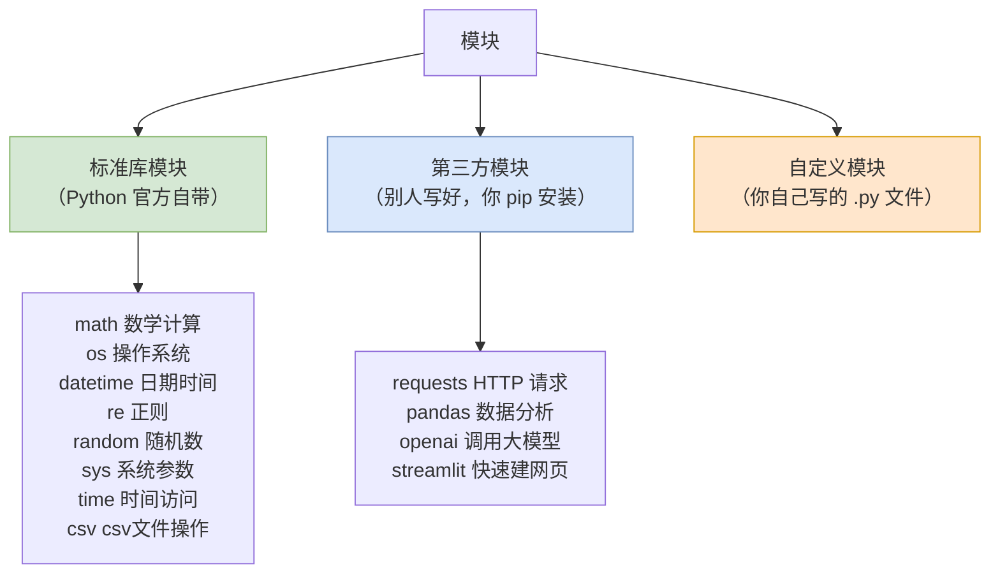
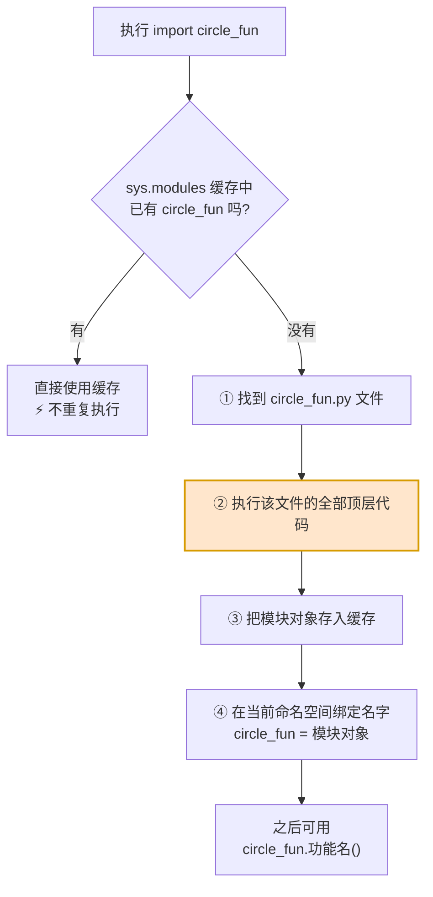
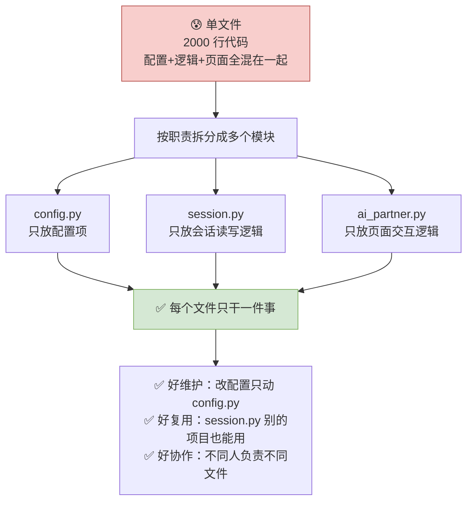
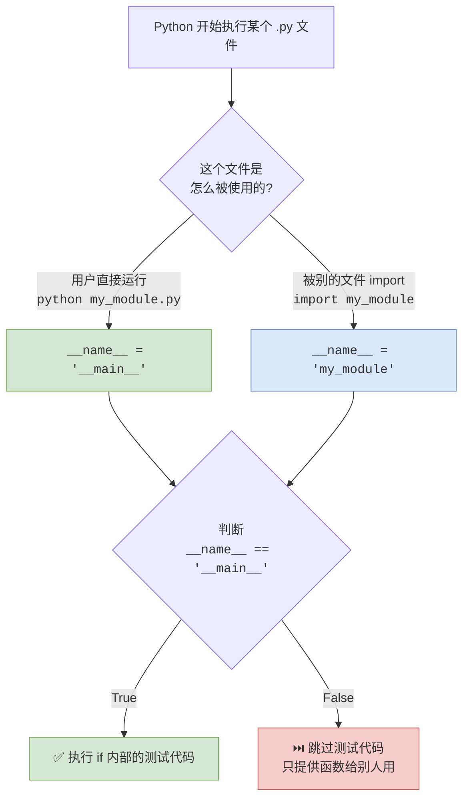
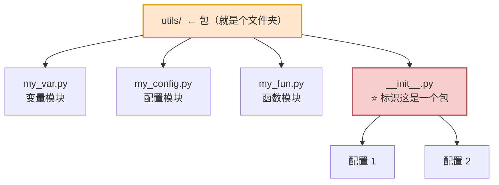
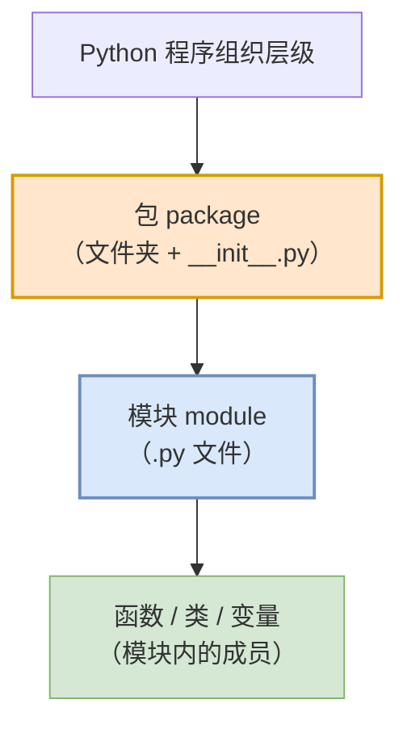

# 第06篇 · 模块与包

> **本篇定位**：函数把代码打包成了"工具"，但工具多了也需要**工具箱**。这一篇讲的是**怎么把一堆功能分门别类地组织起来**——这是从"写单文件脚本"到"写项目"的关键一步。
>
> 本篇篇幅较短，但 `__name__`、`__all__`、`__init__.py` 这三个"双下划线"概念在后端开发中无处不在，务必理解。

---

## 6.1 什么是模块

### 6.1.1 先看一个痛点

假设你在写一个"披萨成本计算"的程序：

```python
# 根据半径计算圆的面积
def circle_area(r):
    pi = 3.14
    area = pi * r * r
    return area

# 根据半径计算圆的周长
def circle_perimeter(r):
    pi = 3.14
    perimeter = 2 * pi * r
    return perimeter

# ===== 主程序 =====
print("=== 披萨成本计算 ===")

s_radius = 10    # 小号披萨
m_radius = 15    # 中号披萨
l_radius = 20    # 大号披萨

small_area = circle_area(s_radius)
medium_area = circle_area(m_radius)
large_area = circle_area(l_radius)

# 成本计算（面饼 + 配料：0.05 元/平方厘米）
small_cost = small_area * 0.05
medium_cost = medium_area * 0.05
large_cost = large_area * 0.05
# ...
```

**问题**：工具函数和业务代码混在一起。如果另一个程序也想用 `circle_area`，只能复制粘贴——一旦改了公式，所有复制的地方都要改。

**解决**：把工具函数**单独放到一个文件里**。

```python
# ===== circle_fun.py（工具模块）=====
def circle_area(r):
    pi = 3.14
    return pi * r * r

def circle_perimeter(r):
    pi = 3.14
    return 2 * pi * r
```

```python
# ===== main.py（主程序）=====
from circle_fun import circle_area

print(circle_area(10))
```

### 6.1.2 概念定义

> **Python 模块（module）**：**一个 `.py` 文件就是一个模块**，模块是 Python 程序的**基本组织单位**。在模块中可以定义**变量、函数、类，以及可执行的代码**。

**关键点**：

| 要点 | 说明 |
|---|---|
| **一个 `.py` 文件 = 一个模块** | 文件名叫 `circle_fun.py`，模块名就叫 `circle_fun` |
| **模块可以包含** | 变量、函数、类、可执行的代码 |
| **模块名 = 文件名（不含 `.py`）** | 所以建议使用 Python 标识符规范命名 |

### 6.1.3 模块的两大类



### 6.1.4 模块的三大作用

| 作用 | 说明 |
|---|---|
| **提高代码复用性** | 写一次，到处用；改一处，全部生效 |
| **降低开发门槛** | 不用自己造轮子，直接用现成的库 |
| **避免命名冲突** | 不同模块里的同名函数互不干扰 |

**实例：随机点名器**

```python
import random

names = ["王林", "李慕婉", "许立国", "韩立", "涛哥",
         "莫厉海", "十三", "虎咆", "红蝶", "天运子"]

print(random.choice(names))
```

> **如果没有 `random` 模块**，你得自己实现一套随机数算法——这涉及到复杂的数学原理。有了模块，一行搞定。

---

## 6.2 模块的导入方式

### 6.2.1 概念定义

> **在使用模块中提供的功能之前，必须先导入，再使用。**

### 6.2.2 五种导入方式对照表（★核心表）

| 序号 | 导入形式 | 代码样例 | 调用方式 | 调用样例 |
|:---:|---|---|---|---|
| 1 | `import 模块名` | `import random, os` | `模块名.功能名` | `random.randint(10, 100)` |
| 2 | `import 模块名 as 别名` | `import random as rd` | `别名.功能名` | `rd.randint(10, 100)` |
| 3 | `from 模块名 import 功能名` | `from random import randint, choice` | `功能名` | `randint(10, 100)` |
| 4 | `from 模块名 import 功能名 as 别名` | `from random import randint as rint` | `别名` | `rint(10, 100)` |
| 5 | `from 模块名 import *` | `from random import *` | `功能名` | `randint(10, 100)` |

### 6.2.3 五种方式的优劣对比

| 方式 | 代码简洁度 | 可读性 | 命名冲突风险 | 推荐场景 |
|---|---|---|---|---|
| `import 模块名` | ⭐⭐⭐ | ⭐⭐⭐⭐⭐ 最清晰 | ✅ 无风险 | **最推荐**，尤其功能多时 |
| `import 模块名 as 别名` | ⭐⭐⭐⭐ | ⭐⭐⭐⭐ | ✅ 无风险 | **模块名太长时**（如 `pandas as pd`） |
| `from 模块 import 功能` | ⭐⭐⭐⭐⭐ | ⭐⭐⭐ | ⚠️ 有风险 | 只用少数几个功能时 |
| `from 模块 import 功能 as 别名` | ⭐⭐⭐⭐⭐ | ⭐⭐⭐ | ⚠️ 有风险 | 功能名冲突时需要改名 |
| `from 模块 import *` | ⭐⭐⭐⭐⭐ | ⭐ **最差** | 🔴 **风险最高** | **不推荐**，仅临时测试用 |

> ⚠️ **为什么 `import *` 不推荐？**
>
> 因为它会把模块里**所有**功能都导进来，你根本不知道导入了什么。如果两个模块有同名函数，后面的会覆盖前面的，而且**排查起来极其困难**。
>
> ```python
> from module_a import *
> from module_b import *   # 如果 module_b 里也有 do_something，就覆盖了 a 的
> do_something()           # 到底调用的是哪个？完全看不出来
> ```

### 6.2.4 深入讲解：`import` 时发生了什么



**流程说明**：

1. **第一次导入时，模块里的顶层代码会被完整执行一遍。**
2. 第二次再 `import` 同一个模块，会直接用缓存，**不会重复执行**。
3. 所以：**模块里的"打印语句"和"直接执行的代码"，导入时就会跑起来**——这常常导致意外输出。

> **大白话比喻**：`import` 就像**去仓库取工具箱**。
> - 第一次去：仓库管理员把工具箱**打开、清点、登记**（执行模块代码），然后交给你。
> - 第二次去：管理员发现已经登记过了，**直接把工具箱给你**，不再重复清点。

> ⚠️ **实践建议**：**导入模块的语句，一般写在 `.py` 文件的开头。**

---

## 6.3 自定义模块

### 6.3.1 为什么需要自定义模块

> 当开发一些复杂的项目，为了让项目结构**更清晰**、更便于项目的**维护管理**及**代码的复用**，可能会把一个项目**拆分为若干个模块**。

**实例对比**：

```python
# ❌ 全部塞在一个 ai_partner.py 里：配置、会话逻辑、页面逻辑混在一起
# 基础配置项
st.set_page_config(page_title="AI 树洞", page_icon="🤖", layout="wide", ...)

# 加载会话列表
def load_sessions():
    ...

# 保存当前会话
def save_session(session_name):
    ...

# 页面逻辑
if st.button("新建会话"):
    ...
```

**拆分后**：

```python
# ===== config.py（配置模块）=====
PAGE_TITLE = "AI 树洞"
PAGE_ICON = "🤖"
LAYOUT = "wide"
INITIAL_SIDEBAR_STATE = "expanded"
HELP_URL = "https://www.extremelycoolapp.com/help"
SESSION_LOCATION = "sessions/"
```

```python
# ===== session.py（会话模块）=====
import os

def load_session():
    sessions = []
    if os.path.exists("sessions"):
        for filename in os.listdir("sessions"):
            if filename.endswith(".json"):
                sessions.append(filename[:-5])
    return sorted(sessions, reverse=True)

def save_session(session_name):
    ...
```

```python
# ===== ai_partner.py（主程序）=====
from session import load_session, save_session

if st.button("新建会话", icon="✏️", use_container_width=True):
    if st.session_state.current_session:
        save_session(st.session_state.current_session)
    ...
```

### 6.3.2 拆分结构流程图



### 6.3.3 命名注意事项

> ⚠️ **注意**：每一个 Python 文件都可以作为一个模块，**模块的名字就是文件的名字**（建议使用 Python 标识符定义，规范命名）。

| 规则 | ✅ 好 | ❌ 差 |
|---|---|---|
| 用标识符规范 | `circle_fun.py` | `circle-fun.py`（有横线，无法 import） |
| 见名知意 | `session.py` `config.py` | `s1.py` `aaa.py` |
| **不要和标准库重名** | `my_random.py` | `random.py` ⚠️ **会覆盖标准库！** |
| 全小写 + 下划线 | `data_utils.py` | `DataUtils.py` |

---

## 6.4 `__name__` 变量

### 6.4.1 概念定义

> **`__name__` 是 Python 中非常重要的内置变量，表示的是当前模块的名称。**

**两种取值情况**：

| 情况 | `__name__` 的值 |
|---|---|
| **当模块直接运行时** | `"__main__"` |
| **当模块被导入时** | **模块的文件名**（不含 `.py` 后缀） |

### 6.4.2 深入讲解：为什么需要它

**问题**：模块被导入时，顶层代码会执行一遍。那"测试代码"也会被执行——这显然不是我们想要的。

```python
# ===== my_module.py =====
def add(x, y):
    return x + y

# 这是我想自己测试用的
print(add(1, 2))    # ← 别人 import 时，这行也会执行！
```

**解决**：用 `if __name__ == "__main__":` 把"只在自己运行时才要执行"的代码包起来。

```python
# ===== my_module.py =====
def add(x, y):
    return x + y

if __name__ == "__main__":
    # 只有直接运行 my_module.py 时才会执行
    # 被别的文件 import 时不会执行
    print(add(1, 2))
```

### 6.4.3 执行判定流程图



**流程说明**：

1. **直接运行**时，`__name__` 就是 `"__main__"`，条件成立，测试代码执行。
2. **被导入**时，`__name__` 是模块名，条件不成立，测试代码跳过。

> **大白话比喻**：`__name__` 就像**问"你是谁？"**
>
> - 你自己站起来说"我是**主角**（`__main__`）"——那你就把自己的台词全念了。
> - 你被别人叫去帮忙，别人介绍"这是**张三**（模块名）"——那你就只做分内的事，不念自己的台词。

---

## 6.5 `__all__` 变量

### 6.5.1 概念定义

> **`__all__` 是一个模块级别的特殊变量，用于指定 `from 模块名 import *` 时会导入哪些功能**（`*` 通配了哪些功能）。

### 6.5.2 实例

```python
# ===== my.py =====
__all__ = ["log_separator1", "log_separator3", "PI"]

PI = 3.1415926
NAME = "黑马☆涛哥"

def log_separator1():
    print("- " * 30)

def log_separator2():
    print("+ " * 30)

def log_separator3():
    print("# " * 30)

def log_separator4():
    print("* " * 30)
```

```python
# ===== test.py =====
from my import *

log_separator1()    # ✅ 可以调用（在 __all__ 里）
log_separator3()    # ✅ 可以调用（在 __all__ 里）
print(PI)           # ✅ 可以调用（在 __all__ 里）

log_separator2()    # ❌ NameError（不在 __all__ 里）
log_separator4()    # ❌ NameError（不在 __all__ 里）
print(NAME)         # ❌ NameError（不在 __all__ 里）
```

### 6.5.3 作用范围

> ⚠️ **注意**：**`__all__` 控制的是 `from ... import *` 时，要导入的功能，并不会影响直接导入具体的功能。**

| 导入方式 | 是否受 `__all__` 控制 |
|---|---|
| `from my import *` | ✅ 受控制 |
| `from my import log_separator2` | ❌ **不受影响**，照样能导入 |
| `import my` + `my.log_separator2()` | ❌ **不受影响** |

### 6.5.4 `__name__` 与 `__all__` 对比表

| 对比项 | `__name__` | `__all__` |
|---|---|---|
| **含义** | 当前模块的名称 | 定义 `import *` 的白名单 |
| **取值** | 直接运行是 `"__main__"`，被导入是模块名 | 一个列表 |
| **主要用途** | 判断"我是被运行还是被导入" | 控制 `import *` 导入哪些功能 |
| **典型写法** | `if __name__ == "__main__":` | `__all__ = ["func1", "func2"]` |
| **是否必须** | 否 | 否（不写则 `import *` 导入所有非下划线开头的功能） |

---

## 6.6 软件包 package

### 6.6.1 为什么需要包

**问题**：模块多了以后，一个文件夹里躺着几十个 `.py` 文件，还是乱：

```
项目/
├── data_query.py
├── data_handle.py
├── data_model.py
├── data_analysis.py
├── web_routes.py
├── web_auth.py
├── helpers.py
├── file.py
├── format.py
├── token.py
├── log.py
└── web_service.py
```

**解决**：用**文件夹**分类。

```
项目/
├── data/           ← 数据相关的模块
│   ├── data_query.py
│   ├── data_handle.py
│   └── data_model.py
├── web/            ← Web 相关的模块
│   ├── web_routes.py
│   ├── web_auth.py
│   └── web_service.py
└── utils/          ← 工具类模块
    ├── helpers.py
    ├── file.py
    ├── format.py
    └── log.py
```

### 6.6.2 概念定义

> **包（package）**：本质就是一个**文件夹**，该文件夹中可以包含若干 Python 模块（`.py` 文件），文件夹下还包含了一个 **`__init__.py`**。
>
> **作用**：**模块文件较多时，用来管理多个模块**。（包的本质也是一个模块）

**包的结构**：



### 6.6.3 `__init__.py` 的两大作用

| 作用 | 说明 |
|---|---|
| **① 标识这是一个包** | 有这个文件，Python 才认为这是**包**；没有的话，就只是个**普通文件夹** |
| **② 控制 `import *` 时导入的模块列表** | 在里面写 `__all__ = [...]` |

> ⚠️ **注意**：在通过 `'from 包名 import *'` 导入全部模块的时候，需要在 `__init__.py` 文件中添加 `'__all__=[]'`，控制允许导入的模块列表。
>
> ```python
> # ===== utils/__init__.py =====
> __all__ = ["my_fun", "my_var"]
> ```

### 6.6.4 包的导入方式对照表

| 序号 | 导入形式 | 代码样例 | 调用方式 | 调用样例 |
|:---:|---|---|---|---|
| 1 | `import 包名.模块名` | `import utils.my_fun` | `包名.模块名.功能名` | `utils.my_fun.log_separator1()` |
| 2 | `from 包名 import 模块名` | `from utils import my_fun` | `模块名.功能名` | `my_fun.log_separator1()` |
| 3 | `from 包名 import *` | `from utils import *` | `模块名.功能名` | `my_fun.log_separator1()` |
| 4 | `from 包名.模块名 import 功能名` | `from utils.my_fun import log_separator1` | `功能名` | `log_separator1()` |
| 5 | `from 包名.模块名 import *` | `from utils.my_fun import *` | `功能名` | `log_separator1()` |

### 6.6.5 模块 vs 包 对比表

| 对比项 | 模块 module | 包 package |
|---|---|---|
| **本质** | **一个 `.py` 文件** | **一个文件夹** |
| **标识文件** | 无（`.py` 本身就是） | **必须有 `__init__.py`** |
| **包含内容** | 变量、函数、类、可执行代码 | 若干**模块** |
| **管理粒度** | 单个文件 | 一组相关模块 |
| **使用场景** | 功能较少、单一职责 | **模块文件较多时**，分类管理 |
| **导入写法** | `import module_name` | `from package import module` |

> **大白话比喻**：
> - **模块** = 一个**工具箱**（装工具的地方）
> - **包** = 一个**工具柜**（装工具箱的柜子，可以有好几层）
>
> 工具少的时候，一个工具箱就够了；工具多了，就买一个柜子，把工具箱分类摆进去。

---

## 6.7 本篇小结

### 6.7.1 三个"双下划线"变量速查表（★重点）

| 变量 | 写在哪个文件 | 作用 | 典型写法 |
|---|---|---|---|
| **`__name__`** | 任意 `.py` | 当前模块名（直接运行 = `"__main__"`） | `if __name__ == "__main__":` |
| **`__all__`** | 模块或 `__init__.py` | 控制 `from ... import *` 导入哪些功能 | `__all__ = ["func1", "func2"]` |
| **`__init__.py`** | **包文件夹下** | ① 标识这是包 ② 配置 `__all__` | 空文件也可以 |

### 6.7.2 层级关系流程图



> **一句话**：**包里有模块，模块里有函数。** 从大到小，层层组织。

### 6.7.3 易错点清单

| 易错点 | 现象 | 正确做法 |
|---|---|---|
| 模块名带横线 | `import circle-fun` 语法错误 | 用下划线：`circle_fun.py` |
| 自定义模块与标准库重名 | 导入行为诡异 | 改名，如 `my_random.py` |
| 循环导入 | `ImportError` | 拆分依赖，把公共部分抽出来 |
| 用 `import *` 导致覆盖 | 函数行为不对 | 明确导入具体功能 |
| 忘记写 `__init__.py` | 包被当普通文件夹 | 建包时创建 `__init__.py` |
| 忘记 `if __name__ == "__main__":` | 被导入时干扰别人 | 测试代码包进去 |
| 以为 `__all__` 能拦住直接导入 | 实际拦不住 | `__all__` 只管 `import *` |

### 6.7.4 动手练习

> **练习 1**：把之前写的"圆面积/周长"函数拆到 `circle_fun.py`，主程序 `main.py` 导入使用。
>
> **练习 2**：在 `circle_fun.py` 里加一段测试代码，用 `if __name__ == "__main__":` 包裹，验证导入时不会执行。
>
> **练习 3**：创建一个 `utils` 包，包含 `my_fun.py`（放分隔线函数）和 `my_var.py`（放常量），用三种方式导入并调用。

> **下一步** → 打开 `07-第2章06节-面向对象基础.md`，从"面向过程"迈向"面向对象"。
