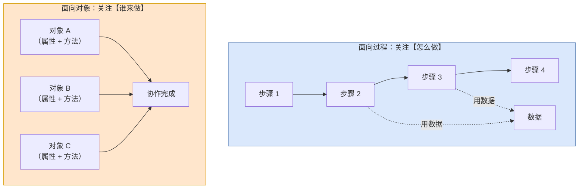
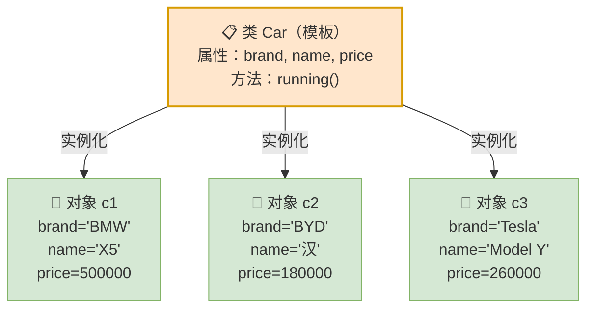
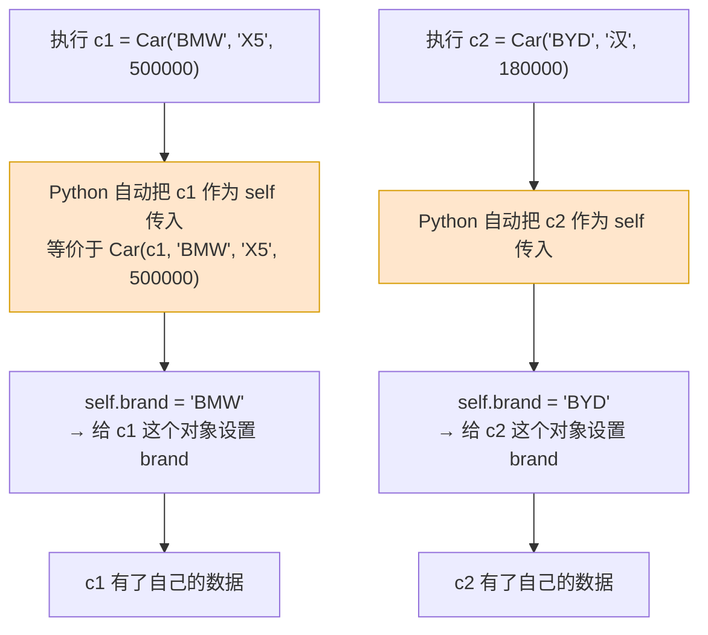
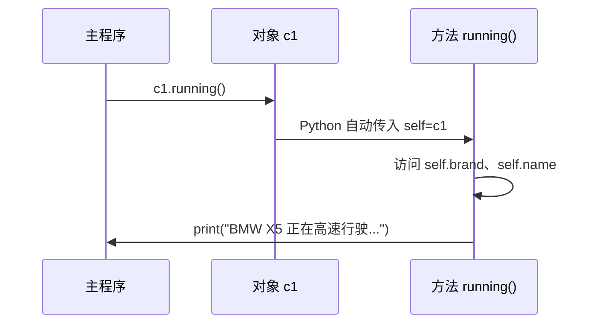
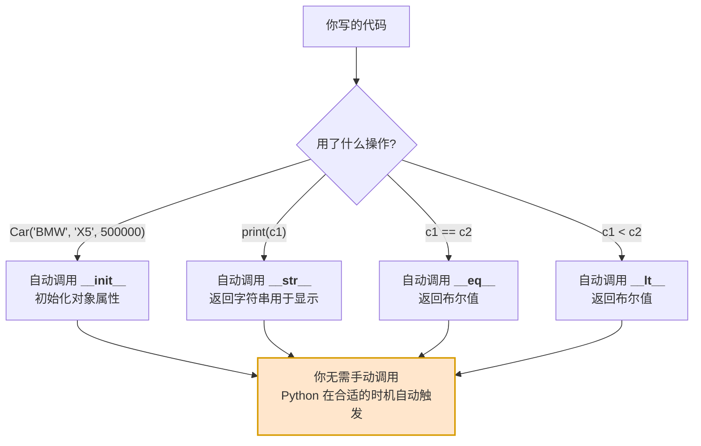
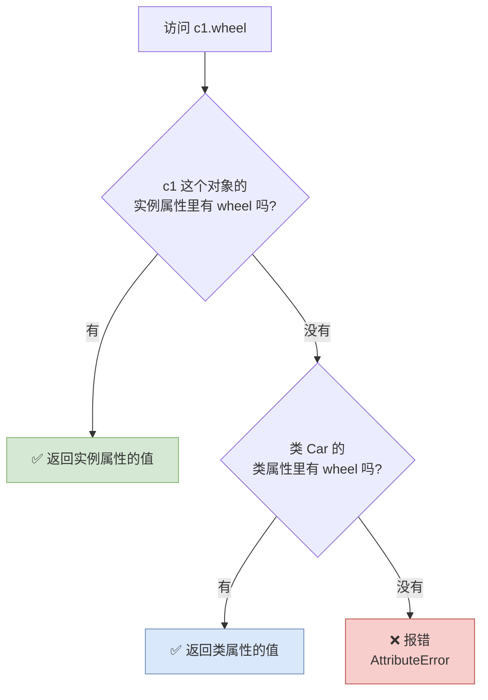
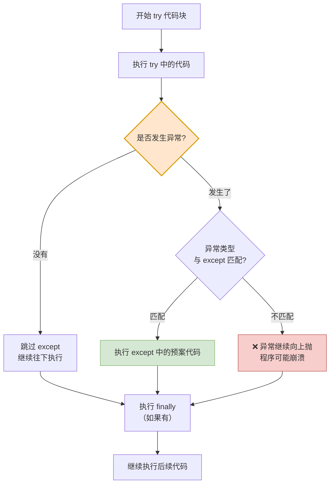
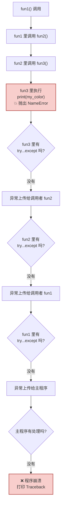
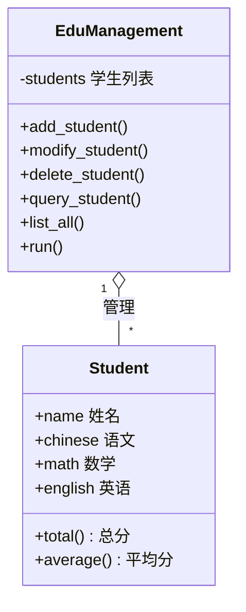
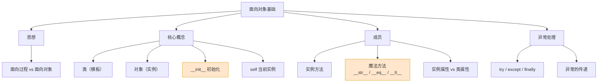

# 第07篇 · 面向对象基础

> **本篇定位**：这是**编程思想的一次升级**。之前的"面向过程"是"我自己一步步做"，"面向对象"是"我找合适的对象来做"。
>
> 这一篇的概念比较抽象，但**所有例子都会用生活场景来打比方**。学完之后，你会发现自己看待程序的方式变了。

---

## 7.1 面向过程 vs 面向对象

### 7.1.1 面向过程编程

#### 概念定义

> **核心思想**：把一个需求**分解成一系列要执行的步骤**，然后按照步骤**依次执行**这些任务（**关注的是流程、步骤**）。

**适用场景**：面向过程编程非常直接，**适合简单、线性的任务**。

**实例：盖一栋房子**

```
平整地基 → 地基打桩 → 地基浇筑 → 主体施工 → 砌墙施工 → 外墙施工 → 室内硬装 → 室内软装
```

### 7.1.2 面向对象编程

#### 概念定义

> **对象**可以理解为**现实中具体的人/物在程序中的数字化身**（**万物皆对象**）。它把一个人/物的**特征和功能打包到一起**，是面向对象编程的**基本单元**（**关注的是谁来帮我做这件事儿**）。

**实例：盖一栋房子（面向对象版）**

不是"我一步步做"，而是"**我找几个专业的对象来做**"：

| 对象 | 属性（特征） | 方法（功能） |
|---|---|---|
| **挖掘机** | 颜色、油耗、马力 | 推平、挖掘 |
| **工人** | 工种、年龄、工服颜色、技能 | 打桩、砌墙、浇筑、装修 |
| **砖块** | 类型、数量、价格、材质 | 存储、运输、焊接、铺贴 |
| **搅拌车** | 容量、颜色、臂长 | 搅拌、运输、浇筑 |

### 7.1.3 两种思想的全方位对比（★重点）



| 对比项 | 面向过程 | 面向对象 |
|---|---|---|
| **关注点** | **怎么做**（流程、步骤） | **谁来做**（对象、职责） |
| **核心单位** | 函数 | **类与对象** |
| **数据与操作** | **分离**（数据在一处，函数在另一处） | **打包在一起**（属性 + 方法） |
| **适用规模** | 小、简单、线性任务 | 大、复杂、多人协作项目 |
| **复用方式** | 函数复用 | **类继承、组合** |
| **扩展性** | 差（加需求要改流程） | 好（加个新对象就行） |
| **典型例子** | 脚本、算法题 | 大型系统、框架、游戏 |

> **大白话总结**：
> - **面向过程**像**自己下厨**：洗菜 → 切菜 → 炒菜 → 装盘。每一步你都得亲自盯着。
> - **面向对象**像**点外卖**：你只需要找"餐厅"这个对象，喊一声"来份宫保鸡丁"，剩下的它自己搞定。你不需要知道它怎么洗菜切菜。

> 💡 **重要提醒**：**面向对象不是取代面向过程，而是包含它。** 类里面的方法，本质上还是一个个"面向过程"的函数。只是我们把它们**按职责归类**了。

---

## 7.2 类与对象

### 7.2.1 概念定义

| 概念 | 定义 |
|---|---|
| **类（Class）** | 描述的是**一组具有相同属性（特征）和方法（功能/行为）的模板** |
| **对象（Object）** | **对象是类的实例**，是基于类创建出来的（**实例对象**） |

> **提示**：对象是由类创建出来的，创建对象的过程，也称为**对象的实例化**。**一个类可以创建无数个对象**。

**实例**：

- **类**：月饼模子（描述了月饼的形状、大小、厚度这些"属性"，以及"压出花纹"这个"功能"）
- **对象**：用这个模子压出来的一个个具体月饼

| 类的属性（特征） | 类的方法（功能） |
|---|---|
| 颜色、形状、大小、厚度 | 提供能量、文化传承 |

### 7.2.2 类与对象的关系图



> **大白话比喻**：
> - **类 = 月饼模子**：定义了"月饼应该长什么样、有什么属性"。模子本身不是月饼，你也不能吃它。
> - **对象 = 月饼**：用模子压出来的具体的东西，可以吃、可以包装、可以送人。
>
> **一个模子能压出无数个月饼，一个月饼只对应一个模子。**

### 7.2.3 类的定义（方式一：创建后动态添加属性）

```python
# 定义类
class Car:
    pass

# 创建对象
c1 = Car()
c1.brand = "BMW"
c1.name = "X5"
c1.price = 500000

print(c1.__dict__)    # {'brand': 'BMW', 'name': 'X5', 'price': 500000}
```

| 说明点 | 内容 |
|---|---|
| **类名命名规范** | 遵循**大驼峰命名法**（每个单词首字母大写，单词间无分隔符），如 `UserInfo`、`UserAccount` |
| **`__dict__`** | Python 中用户自定义类实例的一个特殊属性，用于**以字典形式存储对象的属性** |

> ⚠️ **这种方式不推荐**：每创建一个对象都要手动赋一遍属性，容易漏、容易错。

### 7.2.4 类的定义（方式二：用 `__init__` 初始化）⭐ 推荐

```python
# 定义类
class Car:
    def __init__(self, c_brand, c_name, c_price):
        self.brand = c_brand
        self.name = c_name
        self.price = c_price

# 创建对象
c1 = Car("BMW", "X5", 500000)
print(c1.__dict__)    # {'brand': 'BMW', 'name': 'X5', 'price': 500000}
```

### 7.2.5 深入讲解：`__init__` 与 `self`

#### 重要区分：函数 vs 方法

> **定义在类的外面的称之为"函数"，定义在类中的函数称之为"方法"。**

| 位置 | 叫法 | 第一个参数 |
|---|---|---|
| 类外面 | **函数** | 无特殊要求 |
| **类里面** | **方法** | **必须是 `self`**（实例方法） |

#### `__init__` 是什么

> **`__init__`：初始化方法，对象创建后自动调用**，主要用于**设置对象的初始状态**（设置对象属性）。

| 要点 | 说明 |
|---|---|
| **什么时候调用** | **创建对象时自动调用**，不需要手动调用 |
| **主要作用** | 设置对象的初始属性 |
| **返回值** | 不能有返回值（必须是 `None`） |

#### `self` 是什么

> **`self`：方法的第一个参数，表示当前创建的实例对象。**

```python
class Car:
    def __init__(self, brand, name, price):
        self.brand = brand     # ← self.brand 表示"这个对象的 brand 属性"
        self.name = name
        self.price = price

c1 = Car("BMW", "X5", 500000)
c2 = Car("BYD", "汉", 180000)

print(c1.brand)    # BMW
print(c2.brand)    # BYD
```

**关键理解**：`self` 让每个对象**各存各的数据**。



> **大白话比喻**：`self` 就是"**我**"。
>
> 在《员工手册》（类）里写着"员工要打卡"（方法）。但具体是谁打卡？当然是**每个员工自己**（`self`）打卡。手册上不会写"张三打卡"，只会写"我（self）打卡"。
>
> 所以 `self.brand = brand` 的意思是：**把传进来的 brand 值，存到"我"这个对象身上**。

> ⚠️ **注意**：调用方法时**不需要手动传 `self`**，Python 会自动把对象本身传进去。
>
> ```python
> c1.running()          # ✅ Python 自动传 self
> Car.running(c1)       # ✅ 等价写法（很少这么写）
> ```

### 7.2.6 两种定义方式对比表

| 对比项 | 创建后动态添加属性 | 用 `__init__` 初始化 |
|---|---|---|
| **写法** | `c1 = Car()` 然后 `c1.brand = "BMW"` | `c1 = Car("BMW", "X5", 500000)` |
| **属性是否齐整** | ❌ 可能漏写某个属性 | ✅ 必须传全，否则报错 |
| **代码行数** | 多 | 少 |
| **可维护性** | 差 | **好** |
| **推荐度** | ⭐ | ⭐⭐⭐⭐⭐ **推荐** |

---

## 7.3 实例方法

### 7.3.1 概念定义

> **实例方法**就是定义在类中的、**第一个参数为 `self`** 的方法。定义语法与之前学习的**函数定义的方式是一致的**。

### 7.3.2 语法

```python
# 定义类
class 类名:
    def __init__(self, 形参列表):
        self.属性名 = 参数值
        self.属性名 = 参数值

    def 方法名(self, 形参列表):
        ...

# 创建对象
对象名 = 类名(参数列表)

# 调用方法
对象名.方法名(实参)
```

### 7.3.3 实例

```python
class Car:
    def __init__(self, brand, name, price):
        self.brand = brand
        self.name = name
        self.price = price

    def running(self):
        print(f"{self.brand} {self.name} 正在高速行驶...")

    def total_cost(self, discount, rate):
        return self.price * discount + self.price * rate

c1 = Car("BMW", "X5", 500000)

total_price = c1.total_cost(0.9, 0.1)
print(f"提车总价为: {total_price:.0f}")

c1.running()    # BMW X5 正在高速行驶...
```

> **注意**：`self` 表示当前实例对象，**方法调用时无需传递**。

### 7.3.4 方法调用链流程图



### 7.3.5 函数 vs 方法 对比表

| 对比项 | 函数 | 方法 |
|---|---|---|
| **定义位置** | 类外面 | **类里面** |
| **第一个参数** | 无特殊要求 | **必须是 `self`** |
| **调用方式** | `函数名(参数)` | `对象名.方法名(参数)` |
| **能否访问对象属性** | ❌ 不能 | ✅ 能（通过 `self.属性名`） |
| **归属** | 属于模块 | 属于**类** |

---

## 7.4 魔法方法

### 7.4.1 概念定义

> **魔法方法**是指 Python 中提供的**以双下划线开头和结尾的特殊方法**，用于**定义类的特殊行为**，比如 `__init__`。
>
> **魔法方法是不需要我们手动调用的，Python 会在合适的时机自动调用。**

### 7.4.2 常用魔法方法表（★重点）

| 魔法方法 | 描述 | 什么时候自动触发 |
|---|---|---|
| `__init__` | 初始化方法 | 创建对象时 |
| `__str__` | 字符串表示的方法 | `print(对象)` 或 `str(对象)` 时 |
| `__eq__` | 比较两个对象是否相等（equal） | 用 `==` 比较两个对象时 |
| `__lt__` | 小于（less than） | 用 `<` 比较时 |
| `__le__` | 小于等于（less than or equal） | 用 `<=` 比较时 |
| `__gt__` | 大于（greater than） | 用 `>` 比较时 |
| `__ge__` | 大于等于（greater than or equal） | 用 `>=` 比较时 |

### 7.4.3 深入讲解：为什么需要魔法方法

先看**不定义**魔法方法时的"三大尴尬"：

```python
class Car:
    def __init__(self, brand, name, price):
        self.brand = brand
        self.name = name
        self.price = price

c1 = Car("BMW", "X5", 500000)
c2 = Car("BMW", "X5", 500000)

print(c1)          # 😰 <__main__.Car object at 0x0000021A8B3C4D90>
print(c1 == c2)    # 😰 False（明明数据一样！）
print(c1 < c2)     # 😰 TypeError（不支持比较）
```

| 尴尬 | 原因 |
|---|---|
| **打印出来是内存地址（16 进制）** | 默认使用 `__str__`，而默认实现是打印对象的内存地址 |
| **明明数据一样却 `==` 为 `False`** | 默认 `__eq__` 是**基于对象的内存地址进行比较**的 |
| **不能比较大小** | 默认自定义的对象之间**不可以进行大小比较** |

### 7.4.4 用魔法方法解决

```python
class Car:
    def __init__(self, brand, name, price):
        self.brand = brand
        self.name = name
        self.price = price

    def running(self):
        print(f"{self.brand} {self.name} 正在高速行驶...")

    def __str__(self):
        return f"{self.brand} {self.name} {self.price}"

    def __eq__(self, other):
        return (self.price == other.price
                and self.brand == other.brand
                and self.name == other.name)

    def __lt__(self, other):
        return self.price < other.price

c1 = Car("BMW", "X5", 500000)
c2 = Car("BMW", "X5", 500000)

print(c1)          # ✅ BMW X5 500000
print(c2)          # ✅ BMW X5 500000
print(c1 == c2)    # ✅ True
print(c1 < c2)     # ✅ False
```

### 7.4.5 魔法方法触发流程图



> **大白话比喻**：魔法方法就像手机的**传感器**。
>
> 你不需要手动告诉手机"现在天黑了"——光线传感器（`__str__`）自己会感知；你不需要手动说"我点了一下屏幕"——触摸传感器自己会响应。**你只管做动作，手机自动触发对应功能。**

---

## 7.5 实例属性与类属性

### 7.5.1 概念定义

**属性分为两种**：

| 类型 | 定义 | 归属 | 说明 |
|---|---|---|---|
| **实例属性** | 定义在 `__init__` 里，用 `self.属性名 = 值` | **每个具体对象** | 每个对象都是**独立的**（各个对象特有的数据） |
| **类属性** | 直接定义在类里面（`__init__` 外面） | **类本身** | **所有实例共享**（所有对象共享的数据或配置） |

### 7.5.2 实例

```python
class Car:
    wheel = 4        # ← 类属性：轮胎数量（所有车都是 4 个轮子）
    tax_rate = 0.1   # ← 类属性：购置税（税率所有车一样）

    def __init__(self, c_brand, c_name, c_price):
        self.brand = c_brand     # ← 实例属性
        self.name = c_name       # ← 实例属性
        self.price = c_price     # ← 实例属性

    def running(self):
        print(f"{self.brand} {self.name} 正在高速行驶...")

c1 = Car("BYD", "汉", 180000)
c2 = Car("Tesla", "Model Y", 260000)

print(c1.brand)          # BYD      ← 实例属性，各是各的
print(c2.brand)          # Tesla
print(c1.wheel)          # 4        ← 类属性，共享
print(Car.wheel)         # 4        ← 通过类名访问
```

### 7.5.3 访问方式对照表

| 属性类型 | 标准访问方式 | 能否用另一种方式访问 |
|---|---|---|
| **实例属性** | `实例对象.属性` （如 `c1.brand`） | ⚠️ 不能用 `Car.brand`（会报错） |
| **类属性** | `类名.属性` （如 `Car.wheel`） | ✅ 也能用 `c1.wheel`（但不推荐） |

### 7.5.4 实例属性 vs 类属性 对比表（★重点）

| 对比项 | 实例属性 | 类属性 |
|---|---|---|
| **定义位置** | `__init__` 方法内 | 类内、`__init__` 外 |
| **定义写法** | `self.属性名 = 值` | `属性名 = 值` |
| **归属** | 每个**对象**独立拥有 | 归**类**所有，所有对象共享 |
| **内存** | 每个对象各存一份 | 全类只有一份 |
| **访问方式** | `对象.属性` | `类名.属性` |
| **修改影响** | 只影响这一个对象 | **影响所有对象** |
| **典型用途** | 每个对象特有的数据（品牌、价格） | 所有对象共享的数据/配置（税率、轮子数） |

### 7.5.5 属性查找顺序流程图

> **说明**：**通过实例查找属性时，会先查找实例属性，实例属性不存在时，再查找类属性。**



**流程说明**：

1. **先在对象自己身上找**（实例属性优先）。
2. 找不到，再去**类**里找。
3. 都找不到，报 `AttributeError`。

> **大白话比喻**：
> - **实例属性**像**你钱包里的钱**——只有你有，别人没有。
> - **类属性**像**公司食堂的菜单**——全公司共用一份，谁都看得到。
>
> 你要吃饭，先看自己钱包有没有带饭卡（实例属性）；没有，就看食堂菜单（类属性）。

---

## 7.6 异常处理

### 7.6.1 概念定义

> **异常（也称为 Bug）就是程序运行过程中出现的错误，它会中断程序的正常执行流程。**

**异常的作用（别把异常当敌人）**：

| 作用 | 说明 |
|---|---|
| **保证数据、逻辑的正确性** | 避免程序执行混乱 |
| **在开发阶段尽量发现更多的问题** | 尽早解决问题，保障程序正常执行 |

> **重要观念**：**异常不是坏东西，而是编写健壮程序的重要工具。**

### 7.6.2 常见异常类型表

| 异常类型 | 中文 | 触发场景 | 例子 |
|---|---|---|---|
| `NameError` | 名称错误 | 使用了未定义的变量 | `print(my_name)` 未定义 |
| `TypeError` | 类型错误 | 类型不匹配 | `"1" + 1` |
| `IndexError` | 索引错误 | 索引越界 | `[1,2][5]` |
| `KeyError` | 键错误 | 字典中 key 不存在 | `{"a":1}["b"]` |
| `ValueError` | 值错误 | 值不合法 | `int("abc")` |
| `IndentationError` | 缩进错误 | 缩进不正确 | 该缩进没缩进 |
| `SyntaxError` | 语法错误 | 语法写错 | 少了冒号 |

### 7.6.3 两种处理方案

程序运行过程中出现异常，有**两种处理方案**：

| 方案 | 做法 | 结果 |
|---|---|---|
| **① 不做处理** | 什么都不写 | 整个程序因为一个 Bug，**中断执行** |
| **② 捕获异常** | 按照自己的处理方式处理异常 | 处理完异常，**程序继续执行** |

> **大白话比喻**：
> - **不处理异常** = **出门不看天气**。一下雨，整个行程就泡汤了。
> - **捕获异常** = **出门带把伞**。下雨了就撑伞，行程照常进行。

### 7.6.4 异常处理语法

```python
try:
    可能出现异常的业务代码 1
    可能出现异常的业务代码 2
    ...
except [异常类型 as 变量名]:
    出现异常时的预案
[finally:
    不管是否出现异常, 都会执行的代码]
```

> ⚠️ `finally` 部分**可有可无**（方括号表示可选）。

### 7.6.5 实例

```python
try:
    print("= = = = = = = = = = = =")
    print(my_name)      # ← my_name 未定义，会抛 NameError
    print("= = = = = = = = = = = =")
except NameError as e:
    print("程序运行报错, 错误信息: ", e)
finally:
    print("释放资源 ~")
```

输出：

```
= = = = = = = = = = = =
程序运行报错, 错误信息:  name 'my_name' is not defined
释放资源 ~
```

### 7.6.6 异常处理执行流程图



**流程说明**：

1. **先执行 `try` 里的代码。**
2. 没出异常 → 跳过 `except`，直接往下走。
3. 出了异常 → 看**异常类型是否和 `except` 匹配**：
   - 匹配 → 执行预案，程序**继续运行**。
   - 不匹配 → 异常继续往上抛。
4. **无论有没有异常，`finally` 都会执行**（常用于释放资源）。

### 7.6.7 深入讲解：异常的传递

#### 概念定义

> **异常传递**就是**异常在函数调用中层层上报的过程**，直到有人处理它，或者程序崩溃。

```python
def fun1():
    print("fun1 ... running ...")
    fun2()

def fun2():
    print("fun2 ... running ...")
    fun3()

def fun3():
    print("fun3 ... running ...")
    print(my_color)     # ← 这里会抛 NameError

if __name__ == '__main__':
    fun1()
```

#### 异常传递流程图



**流程说明**：

1. 异常**先在本函数找 `except`**。
2. 找不到，就把异常**"甩锅"给调用自己的那个函数**。
3. 一层层往上甩，直到有人接住，或者甩到最顶层（程序崩溃）。

> **大白话比喻**：异常传递就像**职场里踢皮球**。
>
> 实习生（`fun3`）遇到搞不定的问题 → 上报给组长（`fun2`）→ 组长也搞不定 → 上报给经理（`fun1`）→ 经理也搞不定 → 上报给老板（主程序）。**老板再搞不定，公司就出事了（程序崩溃）。**

> 💡 **实践启示**：**异常应该在"有能力处理它"的那一层被捕获**。不是所有函数都要写 `try...except`，否则异常会被"吞掉"，反而更难排查。

---

## 7.7 综合案例

### 7.7.1 案例一：面向对象版教务管理系统

**需求**：管理在校学生的成绩信息，支持添加、修改、删除、查询、展示全部。

**类设计**：



```python
class Student:
    """学生类"""
    def __init__(self, name, chinese, math, english):
        self.name = name
        self.chinese = chinese
        self.math = math
        self.english = english

    def total(self):
        return self.chinese + self.math + self.english

    def average(self):
        return self.total() / 3

    def __str__(self):
        return (f"{self.name}：语文 {self.chinese}，数学 {self.math}，"
                f"英语 {self.english}，总分 {self.total()}，平均分 {self.average():.1f}")


class EduManagement:
    """教务管理系统类"""
    def __init__(self):
        self.students = []    # 存放 Student 对象

    def add_student(self):
        name = input("请输入学生姓名：")
        chinese = float(input("请输入语文成绩："))
        math = float(input("请输入数学成绩："))
        english = float(input("请输入英语成绩："))
        self.students.append(Student(name, chinese, math, english))
        print("添加成功！")

    def find_student(self, name):
        for stu in self.students:
            if stu.name == name:
                return stu
        return None

    def modify_student(self):
        name = input("请输入要修改的学生姓名：")
        stu = self.find_student(name)
        if stu:
            stu.chinese = float(input("请输入新的语文成绩："))
            stu.math = float(input("请输入新的数学成绩："))
            stu.english = float(input("请输入新的英语成绩："))
            print("修改成功！")
        else:
            print("学生不存在！")

    def delete_student(self):
        name = input("请输入要删除的学生姓名：")
        stu = self.find_student(name)
        if stu:
            self.students.remove(stu)
            print("删除成功！")
        else:
            print("学生不存在！")

    def query_student(self):
        name = input("请输入要查询的学生姓名：")
        stu = self.find_student(name)
        print(stu if stu else "学生不存在！")

    def list_all(self):
        if not self.students:
            print("暂无学生信息！")
            return
        for stu in self.students:
            print(stu)

    def run(self):
        while True:
            print("\n===== 教务管理系统 =====")
            print("1.添加  2.修改  3.删除  4.查询  5.列出全部  6.退出")
            choice = input("请选择：")

            match choice:
                case "1": self.add_student()
                case "2": self.modify_student()
                case "3": self.delete_student()
                case "4": self.query_student()
                case "5": self.list_all()
                case "6":
                    print("再见！")
                    break
                case _:
                    print("输入有误！")


if __name__ == '__main__':
    EduManagement().run()
```

> 💡 **对比第 04 篇的字典版**，面向对象版的好处：
> - **`Student` 类把"姓名+三科成绩+总分/平均分计算"打包在一起**，数据和行为不分离。
> - `__str__` 让打印学生信息变得极简（`print(stu)`）。
> - 加新需求（如"排序"）时，只需给 `Student` 加个方法，不用改各处代码。

### 7.7.2 案例二：面向对象版购物车

```python
class Goods:
    """商品类"""
    def __init__(self, name, price, num):
        self.name = name
        self.price = price
        self.num = num

    def total(self):
        return self.price * self.num

    def __str__(self):
        return f"商品名称: {self.name}, 商品价格: {self.price}, 商品数量: {self.num}"


class ShoppingCart:
    """购物车类"""
    def __init__(self):
        self.goods_list = []

    def find_goods(self, name):
        for g in self.goods_list:
            if g.name == name:
                return g
        return None

    def add(self):
        name = input("请输入商品名称：")
        price = float(input("请输入商品价格："))
        num = int(input("请输入商品数量："))
        self.goods_list.append(Goods(name, price, num))
        print("添加成功！")

    def modify(self):
        name = input("请输入要修改的商品名称：")
        g = self.find_goods(name)
        if g:
            g.price = float(input("请输入新的价格："))
            g.num = int(input("请输入新的数量："))
            print("修改成功！")
        else:
            print("商品不存在！")

    def delete(self):
        name = input("请输入要删除的商品名称：")
        g = self.find_goods(name)
        if g:
            self.goods_list.remove(g)
            print("删除成功！")
        else:
            print("商品不存在！")

    def query(self):
        if not self.goods_list:
            print("购物车为空！")
            return
        total = 0
        for g in self.goods_list:
            print(g)
            total += g.total()
        print(f"购物车总金额：{total}")

    def run(self):
        while True:
            print("\n===== 购物车管理系统 =====")
            print("1.添加  2.修改  3.删除  4.查询  5.退出")
            choice = input("请选择：")

            match choice:
                case "1": self.add()
                case "2": self.modify()
                case "3": self.delete()
                case "4": self.query()
                case "5":
                    print("再见！")
                    break
                case _:
                    print("输入有误！")


if __name__ == '__main__':
    ShoppingCart().run()
```

---

## 7.8 本篇小结

### 7.8.1 面向对象基础全景图



### 7.8.2 核心概念对照表

| 概念 | 一句话定义 | 白话比喻 |
|---|---|---|
| **类** | 一组具有相同属性和方法的模板 | 月饼模子 |
| **对象** | 基于类创建出来的实例 | 压出来的月饼 |
| **`__init__`** | 对象创建后自动调用的初始化方法 | 出厂设置 |
| **`self`** | 方法第一个参数，表示当前实例对象 | "我" |
| **实例方法** | 定义在类中、带 `self` 的方法 | 属于每个对象的能力 |
| **魔法方法** | `__xxx__` 形式的特殊方法，自动调用 | 手机的传感器 |
| **实例属性** | 每个对象独立拥有的数据 | 你钱包里的钱 |
| **类属性** | 所有对象共享的数据 | 公司食堂的菜单 |
| **异常** | 程序运行过程中的错误 | 出门遇到下雨 |
| **异常传递** | 异常层层上报的过程 | 职场踢皮球 |

### 7.8.3 易错点清单

| 易错点 | 现象 | 正确做法 |
|---|---|---|
| 忘记写 `self` 参数 | `TypeError: takes 0 positional arguments but 1 was given` | 实例方法第一个参数必须是 `self` |
| 调用时手动传 `self` | 参数错位 | `obj.method()` 不用传 `self` |
| 类名用小写或下划线 | 不符合规范 | **大驼峰**：`UserInfo` |
| 实例属性定义在 `__init__` 外 | 所有对象共享（变成类属性） | 实例属性写在 `__init__` 里 |
| 混淆实例属性和类属性 | 改了类属性影响所有对象 | 认清"独立" vs "共享" |
| 期望 `print(对象)` 显示数据 | 显示内存地址 | 定义 `__str__` |
| 期望 `==` 比较内容 | 默认比内存地址 | 定义 `__eq__` |
| 期望对象能比大小 | `TypeError` | 定义 `__lt__` 等 |
| `except` 类型写错 | 异常没被捕获，仍崩溃 | 确认异常类型（看 Traceback） |
| `except` 吞掉所有异常 | 问题被隐藏，难排查 | 明确捕获具体类型，别滥用裸 `except` |

### 7.8.4 动手练习

> **练习 1**：定义一个 `Car` 类，包含 `brand`、`name`、`price` 三个实例属性，一个 `wheel` 类属性，以及 `running()`、`total_cost(discount, rate)` 两个实例方法。
>
> **练习 2**：给 `Car` 类加上 `__str__`、`__eq__`、`__lt__` 魔法方法，实现打印、相等比较、大小比较。
>
> **练习 3**：写一个函数 `safe_divide(a, b)`，用 `try...except` 处理除零错误。
>
> **练习 4**：把第 04 篇的教务管理系统改写成面向对象版本（参考 7.7.1）。

> **下一步** → 打开 `08-第3章-Python项目实战之AI应用.md`，用 Python 接通真正的 AI 大模型。
