# 第08篇 · Python 项目实战之 AI 应用

> **本篇定位**：这是第一个**真正能拿出手的项目**。学完你就能做出一个能和 AI 对话的"AI 智能伴侣"网页应用。
>
> 本篇内容量大（对应 PPT 89 页），但逻辑非常清晰，分成三块：
> 1. **基础**（第 8.1~8.7 节）：搞懂 AI、网络、HTTP、JSON，跑通第一次 API 调用
> 2. **实战**（第 8.8~8.13 节）：用 Streamlit 搭出完整应用
> 3. **知识扩展**（穿插其中）：文件操作、JSON 读写

---

## 8.1 认识 AI 家族

### 8.1.1 三个概念的层层递进

这三个词天天听到，但很多人分不清。我们把它们放在一起讲：

#### AI（人工智能）

> **AI**：人工智能（**A**rtificial **I**ntelligence），是一个**学科领域的统称**，目标就是**使机器能够像人类一样思考、学习、推理和解决问题**。

关键词：**思考、推理、学习、解决问题**。

#### AI 大模型（大语言模型）

> **AI 大模型**：也称为**大语言模型**（**L**arge **L**anguage **M**odels, **LLM**），是 **AI 技术的一个分支**。其实就是一个**用代码模拟人脑神经网络的程序**（参数量极其庞大，通常达到**数十亿至数千亿级别**），通过大量的数据训练后，使其具备**理解人类语言、思考、推理并输出人类语言的能力**。

**主流大模型及厂商**：

| 大模型 | 厂商 | 国家 |
|---|---|---|
| **GPT** | OpenAI | 美国 |
| **Gemini** | Google | 美国 |
| **DeepSeek** | 深度求索 | 中国 |
| **Qwen（通义千问）** | 阿里巴巴 | 中国 |

#### AI 应用

> **AI 应用**：是指**将 AI 大模型技术落地到具体的业务场景中**，用来解决实际问题的**产品或服务**。

### 8.1.2 三层关系对比表（★重点）

| 层级 | 名称 | 是什么 | 类比 | 例子 |
|:---:|---|---|---|---|
| **第 1 层** | **AI** | 一个**学科领域** | "医学"这个学科 | 机器学习、深度学习、计算机视觉 |
| **第 2 层** | **AI 大模型** | AI 的一个**技术分支**（具体的技术产物） | "某种特效药" | GPT、Gemini、DeepSeek、Qwen |
| **第 3 层** | **AI 应用** | 用大模型**落地的产品** | "某家医院的具体诊疗服务" | 智能客服、AI 伴侣、AI 助教 |

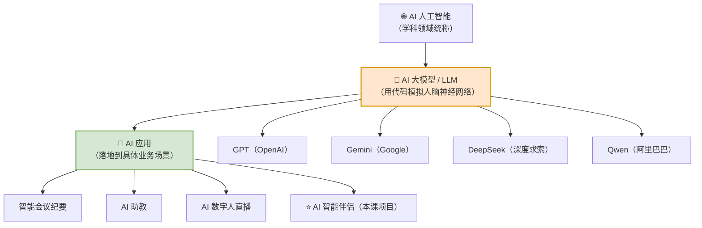

> **大白话总结**：
> - **AI** = **大领域**（就像"餐饮业"）
> - **AI 大模型** = **核心原料**（就像"面粉"）
> - **AI 应用** = **具体产品**（就像"包子铺"）
>
> 我们这门课学的是：**怎么拿"面粉"开一家"包子铺"**。

---

## 8.2 大模型部署方案

### 8.2.1 问题：大模型放在哪

要用 DeepSeek 的能力，你得先决定：**模型跑在谁的电脑上？**

三条路：

### 8.2.2 三大方案对比表（★重点）

| 方案 | 做法 | 优点 | 缺点 | 适合谁 |
|---|---|---|---|---|
| **① 本地部署** | 用 Ollama 等工具把模型下载到**自己电脑**跑 | ✅ **数据安全、自主可控**<br/>✅ **长期成本低** | ❌ 初始成本高<br/>❌ 需长期维护<br/>❌ 性能受限（受本机配置限制） | 对数据安全要求极高的企业、研究者 |
| **② 官方开放 API** | 调用 DeepSeek/Kimi 等**官方提供的接口** | ✅ **前期成本低**<br/>✅ **无需部署和维护**<br/>✅ **随时访问** | ❌ 隐私不能保障<br/>❌ 长期成本高<br/>❌ 可控性差 | **⭐ 本课程使用**、绝大多数开发场景 |
| **③ 云服务平台** | 用云厂商提供的模型服务 | ✅ 前期成本低<br/>✅ 无需部署维护<br/>✅ **选择度高**（一家平台多家模型） | ❌ 安全及隐私不能保障<br/>❌ 长期成本高 | 需要同时用多家模型的企业 |

### 8.2.3 什么是 API

> **API**：应用程序编程接口（**A**pplication **P**rogramming **I**nterface），是**软件间的标准化的"桥梁"**，允许开发者**无需知晓内部细节即可调用外部功能或数据**。

> **大白话比喻**：API 就像**餐厅的服务员**。
>
> 你想吃菜（调用 AI 能力），不需要亲自进厨房（了解模型内部算法），只需要**照着菜单点单**（按 API 规定格式发请求），服务员就会把菜端出来（返回结果）。

### 8.2.4 本地部署工具：Ollama

> **Ollama** 是一个**在本地运行、管理大语言模型的工具**。官网：`https://ollama.com/`

### 8.2.5 官方 API 接入流程（DeepSeek）

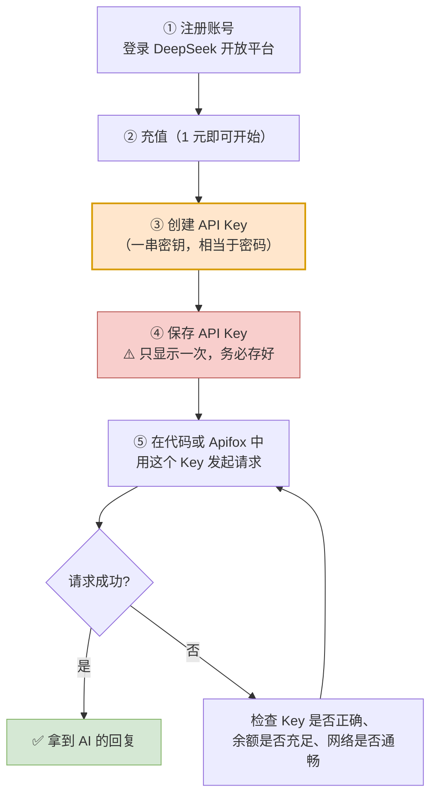

> ⚠️ **API Key 就是你的钱包密码**——泄露了别人可以拿它消耗你的余额。**绝对不要提交到 Git 仓库或公开分享。**

---

## 8.3 网络基础知识

### 8.3.1 为什么学 AI 还要学网络

因为你调用 DeepSeek 的本质是：**你的电脑（客户端）通过网络，把问题发给 DeepSeek 的服务器（服务端），服务器把答案传回来。**

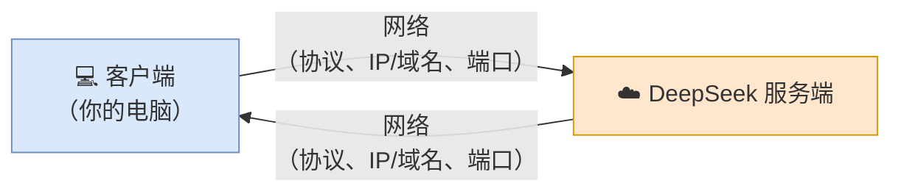

要理解这个过程，必须搞懂三个东西：**IP、域名、端口**。

### 8.3.2 网络是什么

> **网络**，也就是我们通常所说的**互联网（Internet）**，就是由**无数个计算机网络设备连接起来形成的全球性的网络基础设施**。

### 8.3.3 IP 地址

> **IP 地址**可以理解为就是**设备在互联网中的地址**（唯一身份证），每一个连入网络的设备都有一个自己的 IP 地址，用来**定位设备在互联网中的位置**。

**两种版本**：

| 版本 | 位数 | 举例 | 说明 |
|---|---|---|---|
| **IPv4** | **32 位二进制** | `132.12.86.125` | 十进制 4 段，每段 0~255 |
| **IPv6** | **128 位二进制** | — | 地址空间大得多 |

**IPv4 的组成**：

```
132  .  12  .  86  .  125
 ↓       ↓      ↓      ↓
10000100 00001100 01010110 01111101
十进制    二进制
每段范围：0~255
```

> ⚠️ **特殊 IP**：**`127.0.0.1`** 是一个非常特殊的 IP 地址，表示的是**本机地址**（也称为**本地回环地址**）。

### 8.3.4 域名

> **域名（Domain Name）**，是由**一串用点分隔的英文字母**组成的。
>
> **IP 地址不便于记忆，因此设计出了域名**，并通过 **DNS（域名解析服务器）** 来将域名和 IP 地址相互映射，便于记忆和访问。

**DNS 解析流程图**：

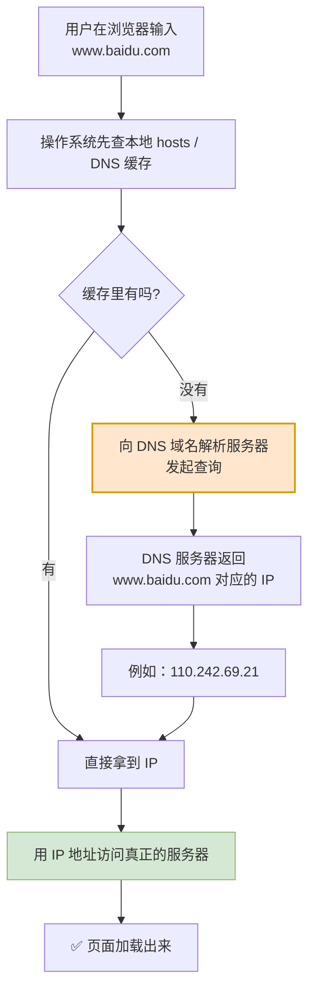

> **大白话比喻**：
> - **IP 地址** = 门牌号（`110.242.69.21`）—— 精确，但没人记得住
> - **域名** = 店铺名（`www.baidu.com`）—— 好记
> - **DNS** = **查号台/通讯录** —— 你说店铺名，它告诉你门牌号

### 8.3.5 端口

> **端口号（Port）** 是整数，**取值范围在 0-65535**，它是用来**标识计算机设备中的运行中的程序**。

**常见端口**：

| 端口 | 用途 |
|---|---|
| **80** | HTTP 协议默认端口 |
| **443** | HTTPS 协议默认端口 |
| 3306 | MySQL 数据库 |
| 8000 | 开发常用（FastAPI 默认示例） |

> **注意**：**HTTP 协议默认端口号为 80，HTTPS 协议默认端口为 443。**
>
> 所以访问 `https://www.baidu.com` 其实等价于 `https://www.baidu.com:443`。

### 8.3.6 IP / 域名 / 端口 对比表（★重点）

| 概念 | 作用 | 白话比喻 | 例子 |
|---|---|---|---|
| **IP** | **唯一定位**一台互联网上的设备 | 门牌号 | `110.242.69.21`（`127.0.0.1` 为本机） |
| **域名** | **降低 IP 地址的书写与记忆成本** | 店铺名 | `www.baidu.com`（`localhost` 为本机域名） |
| **端口** | **标识设备中运行的具体程序** | 门牌号里的**房间号** | `443`、`8000` |

> **组合理解**：
>
> ```
> https://www.baidu.com:443
>    ↑         ↑          ↑
>  协议      域名        端口
>          （→ IP）    （→ 哪个程序）
> ```
>
> **先通过域名找到设备（IP），再通过端口找到设备上的程序。**

### 8.3.7 网络模型

> 互联网（Internet）连接了数以亿计的设备，网络四通八达就如同城市的复杂道路。网络中传输的数据就像是城市道路中的车流，如果不加以管理那必然会出现混乱。国际 ISO 组织就统一了程序在网络中通信的模型和标准。

| 模型 | 说明 |
|---|---|
| **OSI 网络模型** | 全球网络互连标准模型（**七层**） |
| **TCP/IP 网络模型** | 可以认为是 OSI 的**简化版**（**四层**） |

**两层模型对照表**：

| OSI 七层 | TCP/IP 四层 | 职责 | 代表协议 |
|---|---|---|---|
| 应用层 | **应用层** | 将用户与应用程序交互的数据按照协议格式进行封装 | **HTTP**、FTP、SMTP |
| 会话层 | **应用层** | （同上） | — |
| 表示层 | **应用层** | （同上） | — |
| 传输层 | **传输层** | 负责将数据准确送到对应的**应用程序（端口）** | **TCP**、UDP |
| 网络层 | **网络层** | 负责基于 **IP 地址**将数据包路由给对应设备 | **IP** |
| 数据链路层 | **网络接口层** | 负责数据在物理网络中的传输，处理与硬件设备交互 | 以太网 |
| 物理层 | **网络接口层** | （同上） | — |

> **记忆技巧**：**TCP/IP 四层 = 应用层 + 传输层 + 网络层 + 网络接口层**（从上到下）。

**数据封装流程图**：

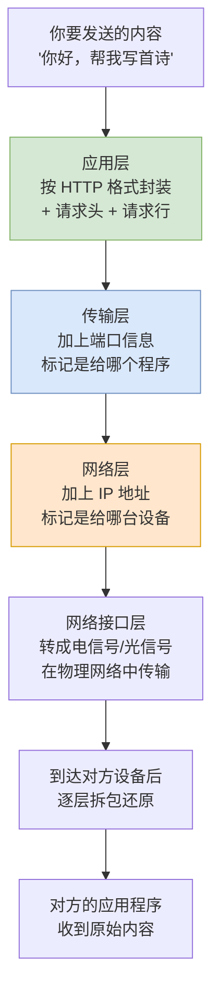

---

## 8.4 HTTP 协议

### 8.4.1 概念定义

> **HTTP**：**H**yper**T**ext **T**ransfer **P**rotocol，**超文本传输协议**，规定了**客户端和服务器之间数据传输的规则**。
>
> （只有在请求及响应中都遵循了统一的规则，服务端才能读懂客户端发送来的请求，客户端才能解析服务端响应的结果。）

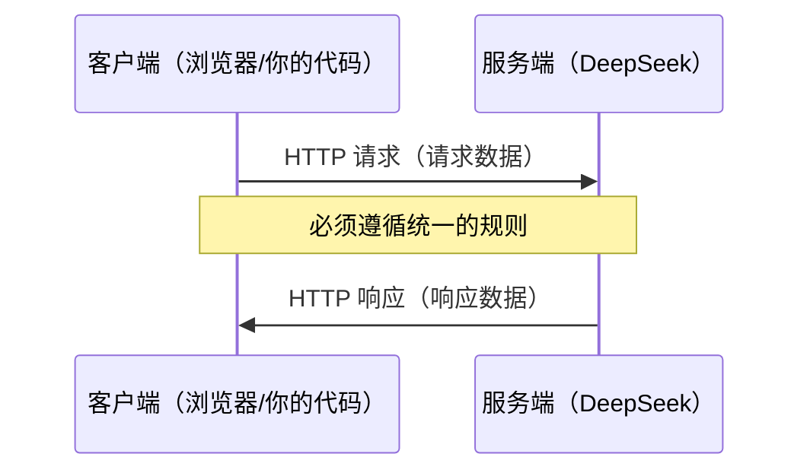

### 8.4.2 三大特点

| 特点 | 说明 |
|---|---|
| **基于文本的协议** | 请求和响应的协议内容为**文本格式**，底层通过 TCP 协议传输，**稳定性强** |
| **基于请求-响应模型** | **一次请求对应一次响应**，必须由**客户端先发起请求**，服务端才会返回响应 |
| **无状态** | 服务端**不会记忆**与客户端的历史交互信息，每次请求-响应都是**独立的** |

> ⚠️ **"无状态"这一点极其重要**——它就是后面 8.8 节"会话记忆"问题的根源，先记住它。

### 8.4.3 HTTP 请求数据格式

| 部分 | 内容 | 说明 |
|---|---|---|
| **请求行** | 请求方式、资源路径、协议 | 如 `GET /api/courses HTTP/1.1` |
| **请求头** | 格式 `key: value` | 如 `Authorization: Bearer xxx` |
| **请求体** | 请求参数部分 | **GET 方式没有，POST 可以有** |

### 8.4.4 GET vs POST 对比表（★重点）

| 对比项 | GET | POST |
|---|---|---|
| **参数位置** | **在请求行中**（URL 里） | **在请求体中** |
| **是否有请求体** | ❌ 没有 | ✅ 有 |
| **例子** | `/api/courses?name=Python&status=1` | 请求体里放 JSON |
| **大小限制** | ⚠️ **在浏览器中是有限制的** | ✅ **没有限制** |
| **典型用途** | 查询数据 | 提交/新增数据 |

### 8.4.5 HTTP 响应数据格式

| 部分 | 内容 | 说明 |
|---|---|---|
| **响应行** | 协议、**状态码** | 如 `HTTP/1.1 200 OK` |
| **响应头** | 格式 `key: value` | 如 `Content-Type: application/json` |
| **响应体** | **存放服务端响应的数据** | 实际返回的内容 |

### 8.4.6 常见状态码表

| 状态码 | 含义 | 说明 |
|:---:|---|---|
| **200** | 客户端请求**成功** | ✅ 一切正常 |
| **400** | **请求参数错误** | ⚠️ 你发的东西格式不对 |
| **404** | **请求资源不存在** | URL 输入有误，或者网站资源被删除了 |
| **500** | **服务器发生了不可预期的错误** | ⚠️ 不是你的问题，是服务器的问题 |

> **记忆技巧**：
> - **2xx** = 成功
> - **4xx** = **你的错**（客户端错误）
> - **5xx** = **服务器的错**

### 8.4.7 一次完整的请求-响应流程图

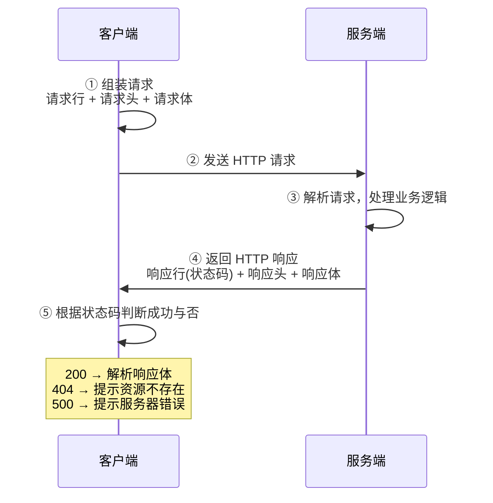

---

## 8.5 JSON 数据格式

### 8.5.1 概念定义

> **JSON**（**J**ava**S**cript **O**bject **N**otation）是**前端的一种对象表示方法**。表示形式类似于 Python 中的字典，都是 `key: value` 这种形式，不过**所有的 key 都必须使用双引号引起来**，值可以是任何类型。

### 8.5.2 JSON 实例

```json
{
    "model": "deepseek-chat",
    "messages": [
        { "role": "system", "content": "You are a helpful assistant." },
        { "role": "user", "content": "Hello!" }
    ],
    "stream": false
}
```

### 8.5.3 JSON 的五种数据类型

| 类型 | 写法 | 例子 |
|---|---|---|
| **数字** | 整数和小数都是数字 | `12`、`3.14` |
| **字符串** | 用 `""` 引起来 | `"jack"` |
| **布尔** | 有两种值 | `true` 或 `false` |
| **对象** | 用 `{}` 表示，里面是键值对（键是字符串，值可以是任意其它类型） | `{"name": "张三"}` |
| **列表** | 用 `[]` 表示，多个元素以 `,` 分割 | `["a", "b"]` |

### 8.5.4 JSON vs Python 字典 对比表（★重点）

| 对比项 | JSON | Python 字典 |
|---|---|---|
| **key 的引号** | **必须用双引号** `"` | 单引号、双引号都行 |
| **布尔值** | `true` / `false`（**全小写**） | `True` / `False`（**首字母大写**） |
| **空值** | `null` | `None` |
| **能否有注释** | ❌ 不允许 | ✅ 可以（`#`） |
| **能否有多余逗号** | ❌ 不允许（末尾不能有逗号） | ⚠️ 也尽量避免 |
| **格式严格度** | **极其严格** | 宽松 |
| **本质** | **一种数据交换格式**（字符串） | **Python 的一种数据类型** |

> ⚠️ **最常见的坑**：直接复制 Python 字典当 JSON 用，会因为 `True`、`None`、单引号而报错。

---

## 8.6 用 Apifox 测试接口

### 8.6.1 概念定义

> **Apifox** 是一款 **API 设计、开发、测试的一体化协作平台**，是项目开发中进行 **API 接口测试的神器**。

**为什么需要它？** 在写代码之前，先用工具把接口调通，可以排除"是接口问题还是代码问题"，大幅减少排查时间。

### 8.6.2 调用 DeepSeek 需要填的三块内容

| 位置 | 填什么 | 说明 |
|---|---|---|
| **URL 地址** | `https://api.deepseek.com/chat/completions` | 请求的地址 |
| **请求头（key: value）** | `Authorization: Bearer sk-xxxxxx`<br/>`Content-Type: application/json` | 身份凭证 + 数据格式声明 |
| **请求体（JSON 格式）** | 参见下方示例 | 告诉 AI 你想让它做什么 |

### 8.6.3 请求体示例

```json
{
    "model": "deepseek-chat",
    "messages": [
        { "role": "system", "content": "你是一名可爱的 AI 助手, 你的名字叫小甜甜, 请以亲切、可爱语气来回答用户的问题" },
        { "role": "user", "content": "你是谁" }
    ],
    "stream": false
}
```

---

## 8.7 代码调用 DeepSeek

### 8.7.1 关键认知：`openai` 不是官方标准库

> ⚠️ **调用 DeepSeek 用的 `openai` 库，并不是 Python 官方提供的标准库，而是第三方提供的。**

### 8.7.2 PyPI 与 pip

#### 概念定义

| 概念 | 全称 | 定义 |
|---|---|---|
| **PyPI** | **Py**thon **P**ackage **I**ndex | 由 **Python 官方和社区共同维护**的 Python **第三方软件包的官方仓库** |
| **pip** | — | Python **官方提供的 Python 包的管理工具**，提供了对 Python 包的**查找、下载、安装、卸载**等功能 |

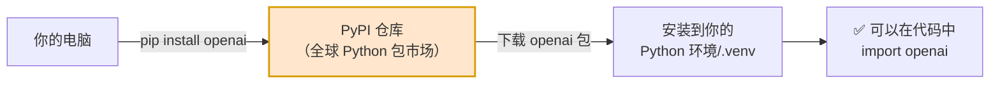

> **大白话比喻**：
> - **PyPI** = **应用商店**（Google Play / App Store）
> - **pip** = **安装器**（手机上的"安装"按钮）
> - **`pip install openai`** = **在应用商店搜索并安装 openai 这个 App**

### 8.7.3 pip 常用命令表

| 操作 | 命令 |
|---|---|
| 安装软件包（最新版本） | `pip install openai` |
| 安装软件包（**指定版本**） | `pip install openai==2.13.0` |
| **卸载**软件包 | `pip uninstall openai` |
| **列出**已安装的包 | `pip list` |
| **查看**包详情 | `pip show openai` |

> 💡 **国内加速**：如果下载慢，可以加国内镜像源：
> ```bash
> pip install openai -i https://pypi.tuna.tsinghua.edu.cn/simple
> ```

### 8.7.4 完整调用流程图

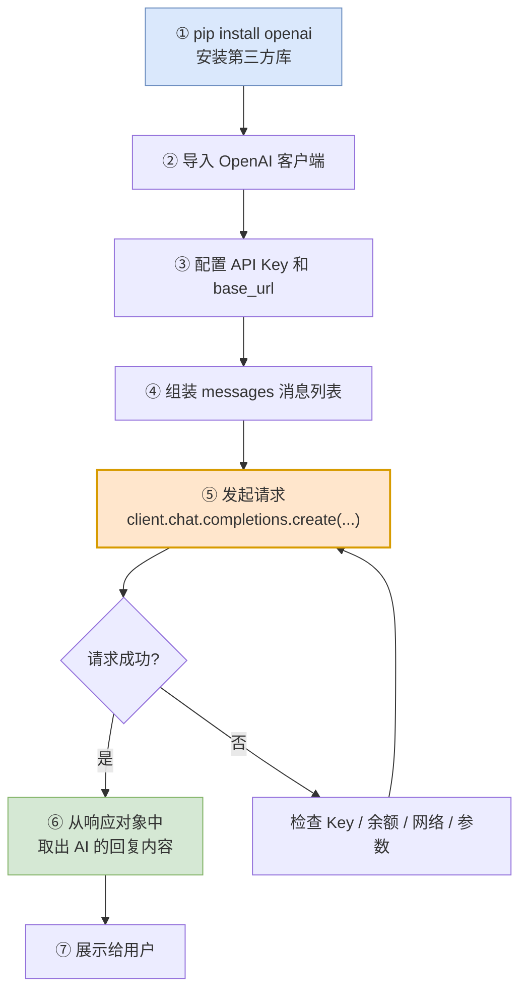

### 8.7.5 代码示例

```python
from openai import OpenAI

client = OpenAI(
    api_key="sk-你的APIKey",
    base_url="https://api.deepseek.com"
)

response = client.chat.completions.create(
    model="deepseek-chat",
    messages=[
        {"role": "system", "content": "你是一名可爱的 AI 助手, 你的名字叫小甜甜"},
        {"role": "user", "content": "你是谁"},
    ],
    stream=False
)

print(response.choices[0].message.content)
```

---

## 8.8 ★会话记忆（重点）

### 8.8.1 问题现象

先看两轮对话：

| 轮次 | 你问 | AI 答 |
|:---:|---|---|
| 第 1 轮 | "12 个苹果，3 个人怎么均分？" | "每个人可以分到 **4 个苹果**～算式是：12 ÷ 3 = 4" |
| 第 2 轮 | "那 2 个人呢？" | 😰 "**你是指哪两个人呢？**可以告诉我更多细节吗？" |

**AI 失忆了！** 明明上一句刚说过苹果，它却完全不知道你在说什么。

### 8.8.2 根本原因：HTTP 是无状态的

> **与 AI 大模型的交互本质是无状态的，每一次请求响应都是相互独立的。（AI 大模型本身没有真正的会话记忆能力）**

回顾 8.4.2 节讲的 HTTP 三大特点之一——**无状态**。这就是原因。

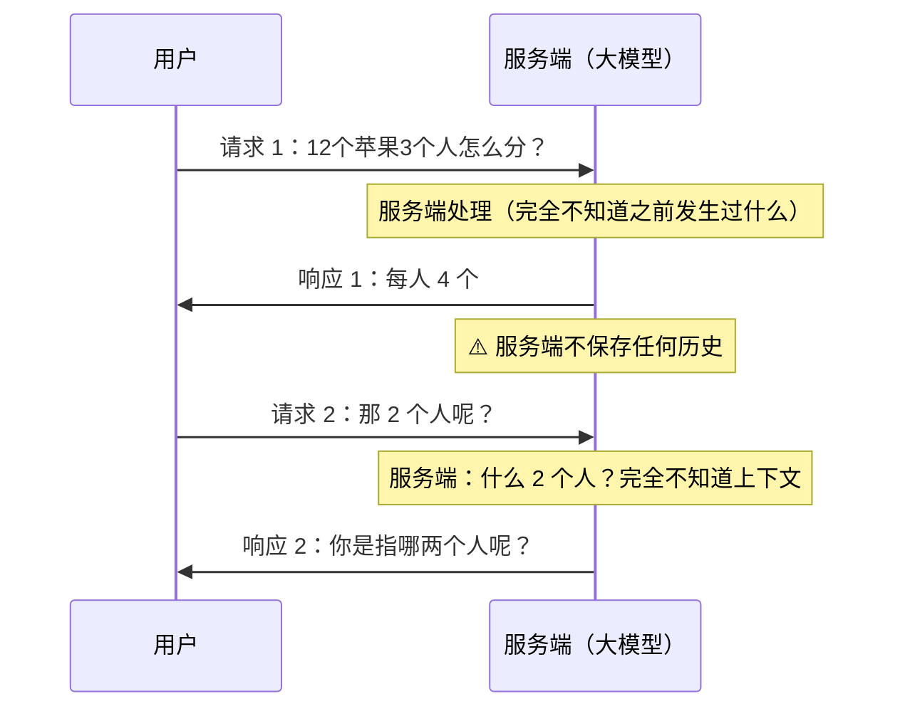

> **大白话比喻**：大模型就像**每天失忆的客服**。
>
> 你打一次电话，他热情服务；挂断电话，他立刻忘光。下次再打，是另一个"全新的他"。

### 8.8.3 解决方案：会话历史滚雪球

**核心思路**：既然 AI 记不住，那**每次请求就把之前所有的对话一起发过去**。

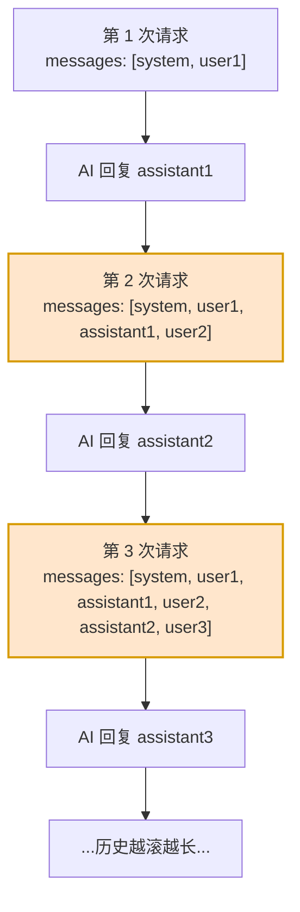

**具体演变**：

| 轮次 | 发送的 messages |
|:---:|---|
| 第 1 轮 | `[system, user: "12个苹果3个人怎么分?"]` |
| 第 2 轮 | `[system, user: "12个苹果...", assistant: "每人4个", user: "那2个人呢?"]` |
| 第 3 轮 | `[system, user: "...", assistant: "...", user: "那2个人呢?", assistant: "每人6个", user: "那4个人呢?"]` |

> **大白话比喻**：这就像**看剧要带上前情提要**。
>
> 大模型是个每天失忆的编剧。你要他接着写第 3 集，不能只说"写第 3 集"，而要把**第 1、2 集的剧本都给他**，他才能接得上。

> ⚠️ **代价**：Token 消耗会随对话轮数**线性增长**。实际项目中通常会做**截断**（只保留最近 N 轮）或**摘要压缩**。

### 8.8.4 三种消息角色（★重点）

| 角色 | `role` 值 | 作用 | 谁写的 |
|---|---|---|---|
| **系统角色** | `system` | **设定 AI 的身份和行为准则**（回答的风格、限制、规则等） | 开发者 |
| **用户角色** | `user` | **用户实际提出的问题或指令** | 用户 |
| **助手角色** | `assistant` | **AI 模型的回复/响应** | AI |

```json
"messages": [
    { "role": "system", "content": "你是一名可爱的 AI 助手, 你的名字叫小甜甜, 请以亲切、可爱语气来回答用户的问题" },
    { "role": "user", "content": "你是谁" },
    { "role": "assistant", "content": "我是小甜甜呀！一个可爱又贴心的 AI 助手，随时准备帮你解决问题或者陪你聊天哦😊" }
]
```

> 💡 **`system` 角色是"人格设定"**。同一个模型，换个 `system` 就能从"严肃律师"变成"可爱少女"。这就是 AI 智能伴侣"性格定制"的实现方式。

---

## 8.9 提示词工程

### 8.9.1 两个概念

| 概念 | 定义 |
|---|---|
| **提示词（Prompt）** | 是**引导大模型（LLM）进行内容生成的命令**（一句话、一个问题等） |
| **提示词工程（Prompt Engineering）** | **通过有技巧地编写提示词，使大模型生成出尽可能符合预期的内容**，这一**持续性的过程**就称为提示词工程 |

> **区别**：**提示词**是那个具体的"问题"；**提示词工程**是"不断优化这个问题的**过程**"。

**例子**：
- 提示词：`给我讲个故事` / `用 Python 写一个游戏` / `法国大革命爆发的原因`
- 提示词工程的**目的**：**引导 AI 思考，约束其输出范围，并明确你期望的结果**

### 8.9.2 提示词工程六大技巧（★核心表）

| 序号 | 技巧 | 作用 | 示例 |
|:---:|---|---|---|
| **01** | **给大模型设定角色与能力** | 让 AI 用专业视角回答 | "你是一名经验丰富的高中历史老师，擅长生动有趣的讲解复杂历史事件" |
| **02** | **明确核心请求与任务** | 说清楚到底要什么 | "请向一位高中生解释法国大革命爆发的主要原因" |
| **03** | **按步骤拆解复杂任务** | 让输出更有条理 | "请先概述背景，然后分政治、经济、思想三个方面阐述，每点配一个例子" |
| **04** | **提供输入输出的示例** | 让 AI 模仿风格 | "可以参考《人类群星闪耀时》的叙事风格" |
| **05** | **明确要求输出格式** | 让结果可直接使用 | "请严格按照如下结构输出: ..." |
| **06** | **指定风格与语气** | 控制表达方式 | "请使用简洁、口语化、充满热情的语气（避免使用过于学术的术语）" |

### 8.9.3 六大技巧归纳为三个维度

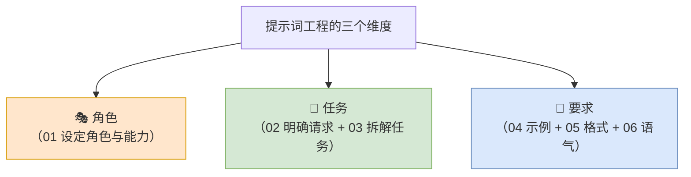

### 8.9.4 实战案例：法国大革命的提示词拆解

**❌ 差的提示词**：

```
法国大革命爆发的原因
```

**✅ 好的提示词**（融合六大技巧）：

```
你是一名经验丰富的历史老师，擅长用生动有趣的方式讲述复杂的历史事件。
现在，请完成以下任务：

1. 核心任务：向一位高中生解释法国大革命爆发的主要原因。

2. 表达要求：
   语气与风格：使用简洁、口语化、充满课堂热情的语气，避免学术黑话。
   整体叙事可以借鉴《人类群星闪耀时》中对历史关键时刻的描写手法，
   富有画面感和戏剧性。
   内容禁忌：聚焦于原因分析，不要罗列冗长的日期和事件过程表。

3. 内容与结构要求：
   开头：先用一段话，生动描述革命前法国社会的总体氛围和紧张感（背景概述）。
   主体：分别从政治、经济、思想三个层面阐述直接原因。
        每个层面提炼 2 个关键点，并为每个关键点配 1 个具体、有说服力的史实例子。
   结尾：提供一个帮助学生记忆的妙招。

4. 输出格式：请严格、完整地按照以下框架组织你的回答：
   【历史现场氛围】（在这里写你的背景概述）
   【危机根源解析】
   政治层面：
     - 关键点 1：... 例子：...
     - 关键点 2：... 例子：...
   经济层面：
     - 关键点 1：... 例子：...
     - 关键点 2：... 例子：...
   思想层面：
     - 关键点 1：... 例子：...
     - 关键点 2：... 例子：...
   【记忆法宝】（请提供一个巧妙的比喻、口诀或联想图像，
              将这三大层面串联起来，方便学生瞬间记忆）
```

**技巧对应表**：

| 技巧 | 在提示词中的位置 |
|---|---|
| 设定角色 | "你是一名经验丰富的历史老师..." |
| 核心任务 | "向一位高中生解释法国大革命爆发的主要原因" |
| 风格语气 | "简洁、口语化、充满课堂热情...借鉴《人类群星闪耀时》" |
| 内容禁忌 | "不要罗列冗长的日期和事件过程表" |
| 拆解任务 | "分政治、经济、思想三个方面，每点配一个例子" |
| 输出格式 | "请严格按照如下框架组织回答：【历史现场氛围】..." |

---

## 8.10 Streamlit 入门

### 8.10.1 概念定义

> **Streamlit** 是一个**开源的 Python 库**，专为**数据工程师及机器学习工程师**设计，用来**快速基于 Python 代码构建交互式的 web 网站**（**无需掌握前端技术**）。

官网：`https://streamlit.io`

> **大白话**：以前的 Web 开发，你要学 HTML、CSS、JavaScript；用 Streamlit，**你会写 Python 就能做网页**。

### 8.10.2 使用步骤

| 步骤 | 操作 |
|---|---|
| **① 安装** | `pip install streamlit` |
| **② 引入模块** | `import streamlit as st` |
| **③ 构建页面** | 基于 streamlit 中提供的 API 来构建 Web 应用 |
| **④ 运行程序** | `streamlit run xxxx.py` |

### 8.10.3 执行流程图

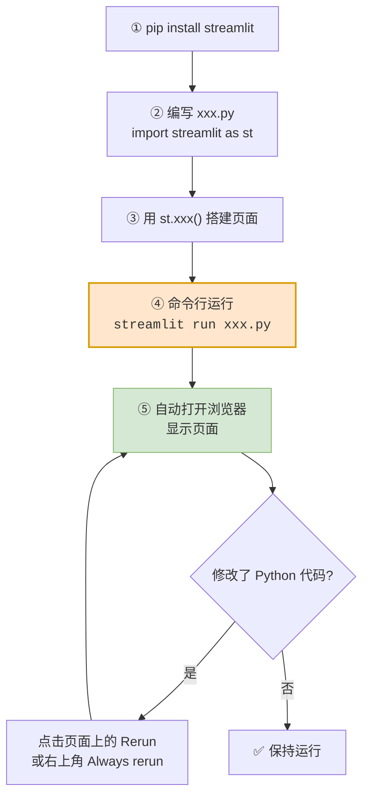

### 8.10.4 常用 API 表（★重点）

| API | 作用 | 示例 |
|---|---|---|
| `st.title()` | 标题 | `st.title("AI 智能伴侣")` |
| `st.write()` | 段落/通用输出 | `st.write("布偶猫是一种...")` |
| `st.image()` | 图片 | `st.image("cat.jpg")` |
| `st.divider()` | 分隔线 | `st.divider()` |
| `st.table()` | 表格 | `st.table(data)` |
| `st.button()` | 按钮 | `st.button("新建会话")` |
| `st.text_input()` | 文本输入框 | `st.text_input("请输入")` |
| `st.chat_message()` | 聊天气泡 | `st.chat_message("user")` |
| `st.chat_input()` | 聊天输入框 | `st.chat_input("说点什么")` |
| `st.sidebar` | 侧边栏 | `with st.sidebar:` |
| `st.session_state` | 会话状态（跨次运行保存数据） | `st.session_state.messages` |
| `st.rerun()` | 重新运行脚本 | `st.rerun()` |

### 8.10.5 入门程序

```python
import streamlit as st

# 标题
st.title("AI 智能伴侣")

# 段落
st.write("布偶猫是一种源于美国的大型半长毛猫，以温顺黏人的'小狗猫'性格、"
         "湛蓝色的眼睛和松弛柔软的抱感著称...")

# 图片
st.image("cat.jpg")

# 分隔线
st.divider()

# 表格
data = {
    "姓名": ["王林", "李慕婉", "贝罗", "莫厉海"],
    "学号": ["20230001", "20230002", "20230003", "20230004"],
    "语文": [80, 90, 85, 70],
    "数学": [87, 92, 87, 81],
    "英语": [90, 85, 90, 95],
}
st.table(data)
```

---

## 8.11 文件操作

### 8.11.1 为什么需要文件操作

> ⚠️ **内存中存放的数据在计算机关机后就会消失**，要**永久保存数据**，就需要将数据**保存在文件中**。

这正是"AI 智能伴侣"能记住历史会话的关键。

### 8.11.2 概念定义

> 日常我们操作文件时，基本分为**三步操作：打开、读/写、关闭**。

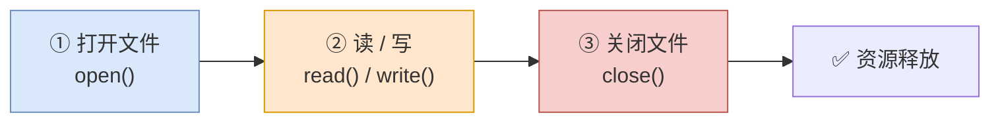

### 8.11.3 读文件与写文件

```python
# ===== 读文件 =====
# 1. 打开文件
f = open("resources/望庐山瀑布.txt", "r", encoding="utf-8")
# 2. 读取文件
content = f.read()
print(content)
# 3. 关闭文件
f.close()


# ===== 写文件 =====
# 1. 打开文件
f = open("resources/静夜思.txt", "w", encoding="utf-8")
# 2. 写入文件
f.write("窗前明月光，\n")
f.write("疑是地上霜。\n")
f.write("举头望明月，\n")
f.write("低头思故乡。\n")
# 3. 关闭文件
f.close()
```

### 8.11.4 打开模式对照表（★重点）

| 模式 | 名称 | 行为 | 文件不存在时 |
|:---:|---|---|---|
| **`r`** | 只读 | 打开文件，指针放在文件开头（**默认模式**） | ❌ 报错 |
| **`w`** | 只写 | **从头编辑，原有内容会被删除** | ✅ 创建新文件 |
| **`a`** | 追加 | 新内容会被**追加在原有内容之后** | ✅ 创建新文件 |

> ⚠️ **`w` 模式极其危险**——它会**清空原有内容**！想保留原内容只能用 `a`。

### 8.11.5 路径写法

| 类型 | 定义 | 例子 | 推荐度 |
|---|---|---|---|
| **相对路径** | 相对于**当前工作目录**的路径 | `resources/session.json` | ⭐⭐⭐⭐⭐ **推荐** |
| **绝对路径** | 从文件系统的目录开始，**完整描述文件位置** | `D:\project\resources\session.json` | ⭐⭐ |

> **提示**：在项目开发中，**推荐使用相对路径写法**，可移植性更好、路径简洁、易于阅读。

### 8.11.6 编码

> **编码**：是将**字符（文字、数字、符号）转换为计算机能够存储和处理的数字代码的规则系统**，如：ASCII、GBK、UTF-8。

| 编码 | 说明 |
|---|---|
| **ASCII** | 最早，只支持英文 |
| **GBK** | 中文编码 |
| **UTF-8** | **国际通用，推荐**（中文不会乱码） |

> 💡 **实践铁律**：**打开文件时永远显式写 `encoding="utf-8"`**，否则在 Windows 上读写中文极容易乱码。

### 8.11.7 资源释放：为什么需要 with

**问题**：如果操作文件过程中出现了异常，`close()` 就无法执行，**文件会一直被 Python 程序占用，无法操作**。

**方案对比**：

| 方案 | 写法 | 评价 |
|---|---|---|
| **方案一：`try...finally`** | 手动 `try` 包裹写操作，`finally` 里 `close()` | 繁琐 |
| **方案二：`with open()`** | `with open(...) as f:` | ⭐ **推荐，最佳实践** |

```python
# ===== 方案一：try...finally =====
f = open("resources/静夜思.txt", "w", encoding="utf-8")
try:
    f.write("静夜思 (李白)\n")
    f.write("窗前明月光，\n")
finally:
    f.close()

# ===== 方案二：with（推荐）=====
with open("resources/静夜思.txt", "w", encoding="utf-8") as f:
    f.write("静夜思 (李白)\n")
    f.write("窗前明月光，\n")
```

> **提示**：**`with` 语句（上下文管理器）的核心作用就是确保资源总是被正确获取和释放（即使发生异常，也会被正确释放）**，也是项目开发中的推荐方式。

### 8.11.8 with 语句执行流程图

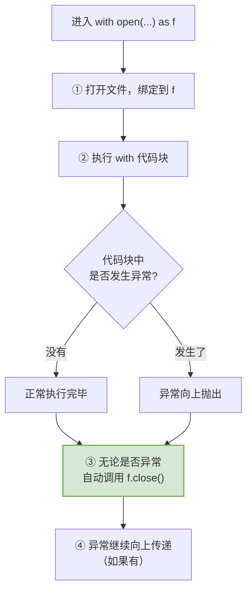

> **大白话比喻**：`with` 就像**餐厅的自动收盘服务**。
>
> 你不用记着吃完要收盘（`close()`），服务员（`with`）会在你离开时**自动收走**——不管你吃完了还是中途有事走了（异常）。**你只管吃，剩下的它负责。**

---

## 8.12 JSON 文件读写

### 8.12.1 概念定义

> **JSON 是软件开发中最常用的数据交换格式**，而为了简化 JSON 数据的处理，在 Python **标准库**中就提供了处理 JSON 数据的核心模块 **`json`**。

### 8.12.2 序列化与反序列化

| 概念 | 方向 | 方法 | 含义 |
|---|---|---|---|
| **序列化** | Python 对象 → JSON | `json.dump()` | 将 python 对象**序列化为 json 格式字符串并写入文件** |
| **反序列化** | JSON → Python 对象 | `json.load()` | 从文件中读取 json 格式数据，并将其**反序列化为 python 对象** |

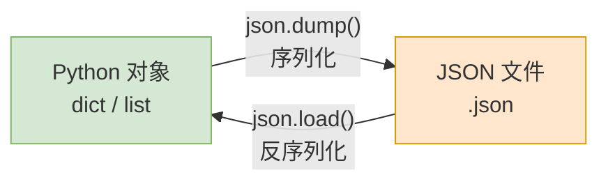

### 8.12.3 代码示例

```python
# ===== 写入 json 数据 =====
import json

obj = {
    "name": "张三",
    "age": 18,
    "gender": "男",
    "hobbies": ["reading", "swimming"]
}

with open("resources/session.json", "w", encoding="utf-8") as f:
    json.dump(obj, f, ensure_ascii=False, indent=2)
```

```python
# ===== 读取 json 数据 =====
import json

with open("resources/session.json", "r", encoding="utf-8") as f:
    obj = json.load(f)
    print(obj)
```

### 8.12.4 两个重要参数

| 参数 | 作用 | 不加的后果 |
|---|---|---|
| **`ensure_ascii=False`** | 允许中文直接写入（不转成 `\uXXXX`） | 中文会变成 `\u5f20\u4e09` 这种乱码样 |
| **`indent=2`** | 缩进 2 空格，**格式化输出** | 所有内容挤在一行，无法阅读 |

> ⚠️ **`ensure_ascii=False` 是写中文 JSON 的必备参数**，忘了它你打开文件会看到一堆 `\uXXXX`。

### 8.12.5 json 模块方法总表

| 方法 | 作用 | 用法 |
|---|---|---|
| `json.dump(obj, f)` | Python 对象 → **写入文件** | 配合 `open(..., "w")` |
| `json.load(f)` | **从文件读取** → Python 对象 | 配合 `open(..., "r")` |
| `json.dumps(obj)` | Python 对象 → **字符串** | 不涉及文件 |
| `json.loads(s)` | **字符串** → Python 对象 | 不涉及文件 |

> **记忆技巧**：**带 `s` 的是处理 String（字符串），不带 `s` 的是处理文件流。**

---

## 8.13 实战项目：AI 智能伴侣

### 8.13.1 项目整体架构图

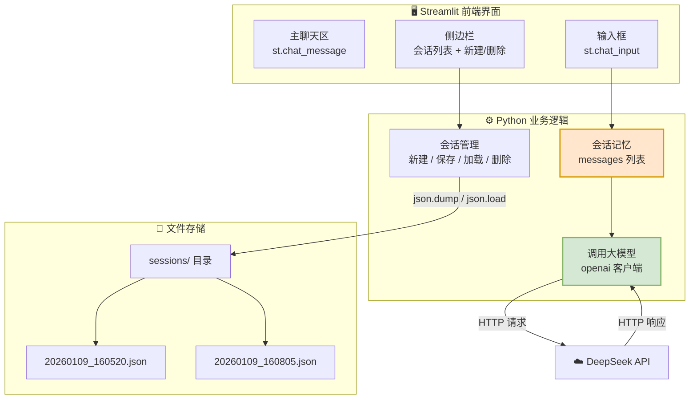

### 8.13.2 三大功能模块

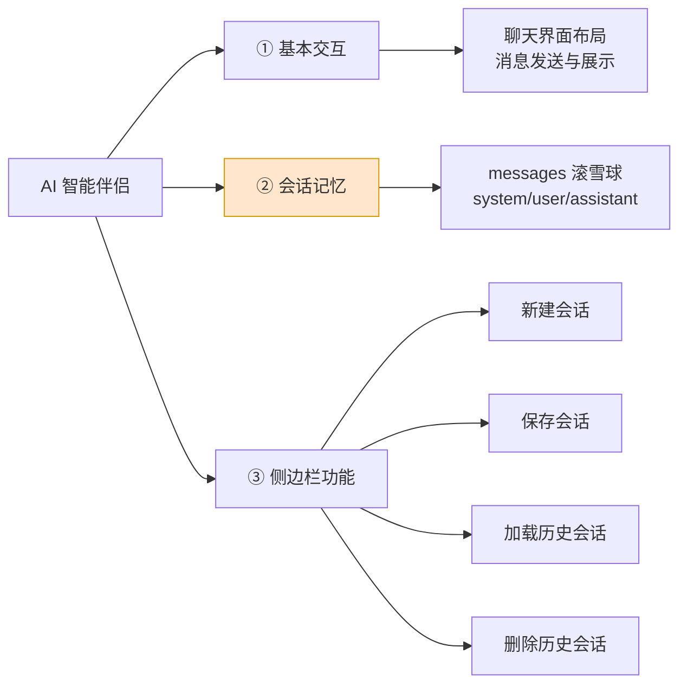

### 8.13.3 会话数据结构设计

**思考**：每一个历史会话文件中，需要保存哪些信息呢？

| 字段 | 说明 |
|---|---|
| **交互消息** | `messages` 列表（role + content） |
| **昵称** | AI 的名字 |
| **性格** | AI 的人设（写入 system 角色） |
| **会话标识** | 会话的名字（**唯一**），如 `2026-01-09_16-05-20` |

**JSON 文件示例**（`20260109_160520.json`）：

```json
{
    "messages": [
        { "role": "user", "content": "你好" },
        { "role": "assistant", "content": "哈囉~ 今天過得怎麼樣呀？💕" }
    ],
    "nick_name": "小美",
    "nature": "温柔可爱的台湾腔姑娘",
    "current_session": "2026-01-09_16-05-20"
}
```

### 8.13.4 会话管理完整流程图

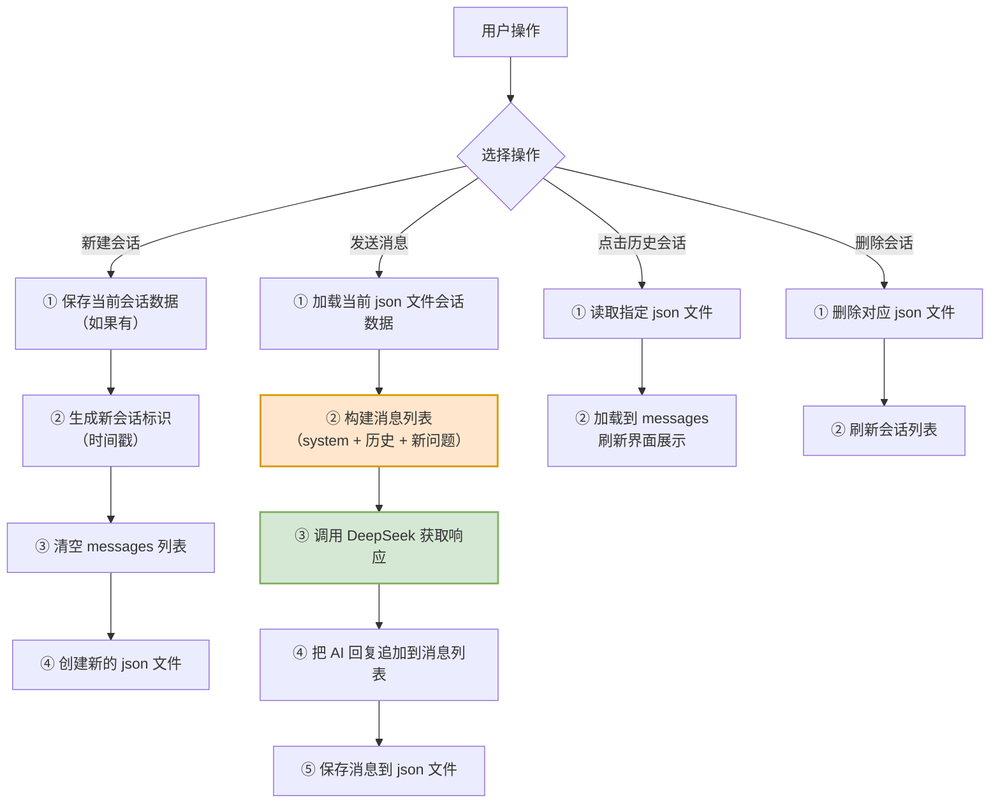

### 8.13.5 数据库目录结构

```
项目根目录/
├── ai_partner.py          # 主程序
├── config.py              # 配置模块
├── session.py             # 会话读写模块
├── .env                   # 存放 API Key（不要提交到 Git！）
└── sessions/              # 历史会话数据目录
    ├── 2026-01-11_18-00-05.json
    ├── 2026-01-11_18-04-42.json
    ├── 2026-01-11_18-08-56.json
    ├── 2026-01-11_18-14-25.json
    └── 2026-01-11_18-45-08.json
```

### 8.13.6 项目总结

| 用到的技术点 | 出自哪一节 | 在项目中的作用 |
|---|---|---|
| HTTP 协议 | 8.4 | 理解与大模型通信的原理 |
| JSON 格式 | 8.5 | 请求体和存储格式 |
| API 调用 | 8.7 | 调用 DeepSeek |
| 会话记忆方案 | 8.8 | 让 AI"记得住"上下文 |
| 提示词工程 | 8.9 | 定制 AI 性格 |
| Streamlit 构建页面 | 8.10 | 做出 Web 界面 |
| 文件基本操作 | 8.11 | 持久化保存数据 |
| json 操作 | 8.12 | 读写会话文件 |
| os / datetime 模块 | 模块篇 | 遍历目录、生成时间戳 |

---

## 8.14 小知识：三元运算符

**语法**：

```python
<true_value> if 条件表达式 else <false_value>
```

**含义**：条件成立取前面的值，否则取后面的值。

```python
age = 20
status = "成年" if age >= 18 else "未成年"
print(status)    # 成年
```

**对比表**：

| 写法 | 代码 | 行数 |
|---|---|---|
| **if...else** | `if age >= 18:`<br/>`&nbsp;&nbsp;&nbsp;&nbsp;status = "成年"`<br/>`else:`<br/>`&nbsp;&nbsp;&nbsp;&nbsp;status = "未成年"` | 4 行 |
| **三元运算符** | `status = "成年" if age >= 18 else "未成年"` | **1 行** |

> 💡 在 Streamlit 项目里常用于一些小判断，比如：
> ```python
> icon = "✏️" if is_new else "💬"
> ```

---

## 8.15 本篇小结

### 8.15.1 知识全景图

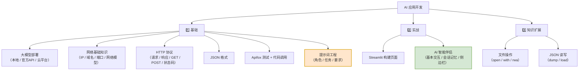

### 8.15.2 核心概念速查表

| 概念 | 一句话定义 | 白话比喻 |
|---|---|---|
| **AI 大模型** | 用代码模拟人脑神经网络的程序 | 面粉 |
| **AI 应用** | 把大模型落地到业务场景的产品 | 包子铺 |
| **API** | 软件间标准化的"桥梁" | 餐厅服务员 |
| **IP** | 设备在互联网中的地址 | 门牌号 |
| **域名** | 便于记忆的网站名 | 店铺名 |
| **DNS** | 域名和 IP 的映射服务器 | 查号台 |
| **端口** | 标识设备中运行的程序 | 房间号 |
| **HTTP** | 规定客户端与服务端传输规则的协议 | 对话礼仪 |
| **JSON** | 最常用的数据交换格式 | 通用信封 |
| **提示词工程** | 优化提示词让 AI 输出符合预期的过程 | 学会怎么问问题 |
| **会话记忆** | 每次带上全部历史对话 | 看剧带前情提要 |
| **`with`** | 自动释放资源的上下文管理器 | 餐厅自动收盘 |

### 8.15.3 易错点清单

| 易错点 | 现象 | 解决 |
|---|---|---|
| API Key 泄露 | 被别人盗用余额 | 存到 `.env`，加入 `.gitignore` |
| 忘记 `encoding="utf-8"` | 中文乱码 | 每次打开文件都显式指定 |
| 写 JSON 忘 `ensure_ascii=False` | 中文变成 `\uXXXX` | 加上这个参数 |
| 用 `w` 模式想追加 | 原内容全被清空 | 用 `a` 模式 |
| 忘记 `close()` | 文件被占用 | 用 `with open()` |
| 会话历史一直累积 | Token 消耗爆炸 | 做截断或摘要 |
| GET 塞大量参数 | 超过浏览器限制 | 改用 POST |
| 混淆 `127.0.0.1` 和真实 IP | 请求发不出 | 本机地址只在本机有效 |
| Streamlit 忘了 `streamlit run` | 用 `python xxx.py` 没反应 | 必须用 `streamlit run` |

### 8.15.4 动手练习

> **练习 1**：用 Apifox 调通一次 DeepSeek 接口，观察请求头和响应体。
>
> **练习 2**：用 Python 代码调用 DeepSeek，把 `system` 改成"你是一个毒舌吐槽大师"，看看回复风格的变化。
>
> **练习 3**：写一个程序，把一段中文文本和它的拼音写入 JSON 文件，再读出来打印，**确保中文不乱码**。
>
> **练习 4**：用 Streamlit 做一个"AI 翻译官"：输入中文，调用 DeepSeek 输出英文。

> **下一步** → 打开 `09-第4章-Python项目实战之网络机器人.md`，学习如何自动抓取网页数据。
