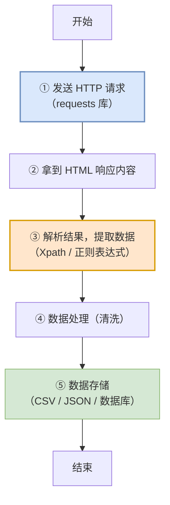
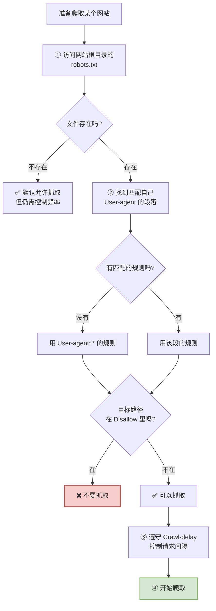
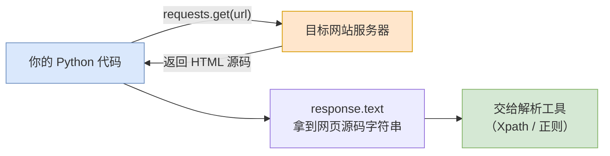
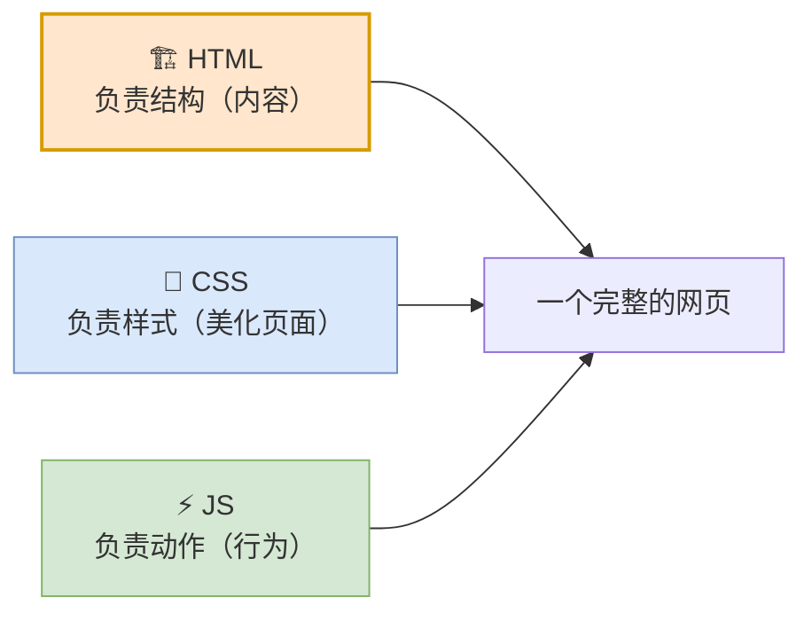
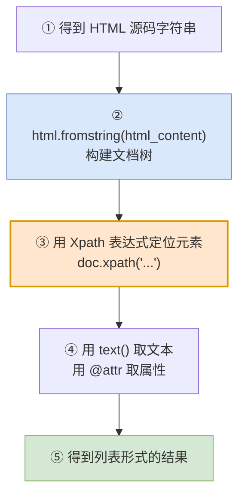
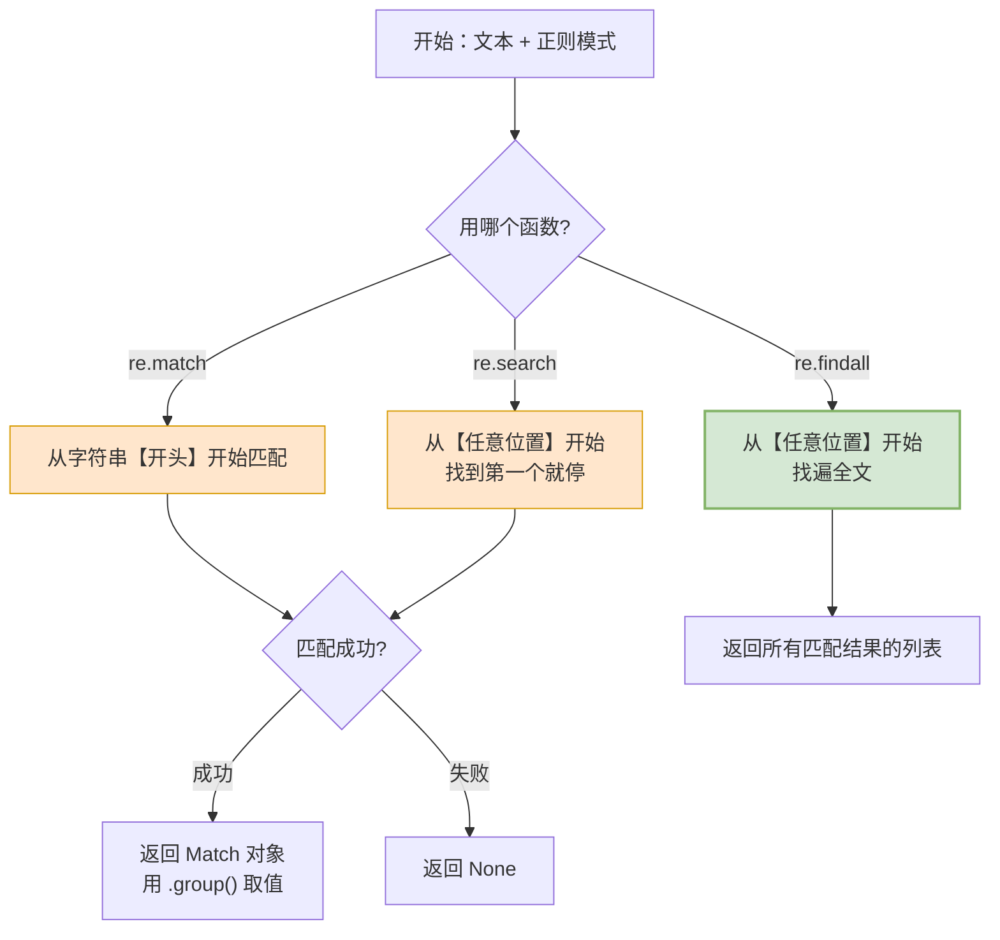
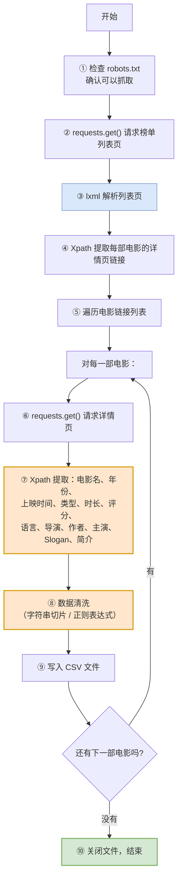
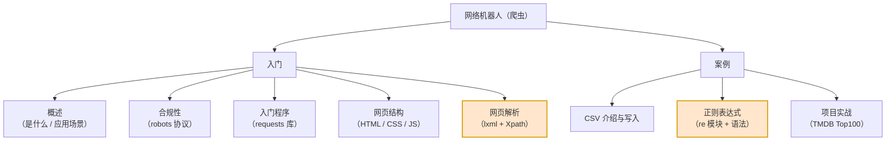

# 第09篇 · Python 项目实战之网络机器人（爬虫）

> **本篇定位**：学完这一篇，你就能让程序**自动去网页上把数据"搬"回来**——自动抓电影排行榜、自动收集商品价格、自动整理资料。
>
> 本篇的两大技术重点：**Xpath 语法** 和 **正则表达式**。这两个都是"查数据的语言"，语法表要重点记。

---

## 9.1 什么是爬虫

### 9.1.1 概念定义

> **爬虫**：也称为**网络爬虫**（**网络机器人**），是一种**按照一定的预设规则，自动浏览并抓取网络数据的程序或脚本**。

拆解关键词：

| 关键词 | 含义 |
|---|---|
| **按照一定的预设规则** | 不是乱抓，是有明确目标的 |
| **自动浏览** | 模拟人去打开网页、点击、翻页 |
| **抓取网络数据** | 把网页上的内容提取出来 |

### 9.1.2 爬虫的应用场景

| 场景 | 说明 |
|---|---|
| **搜索引擎** | 百度、Google 就是最大的爬虫系统 |
| **舆情监控** | 自动收集全网对某事件的讨论 |
| **商业分析** | 电商比价系统、竞品价格监控 |
| **AI 大模型训练语料** | 大模型的训练数据大量来自爬虫采集 |
| **数据分析的原料** | 做数据分析之前，先得有数据 |

> **大白话比喻**：爬虫就像一个**不知疲倦的实习生**。
>
> 你告诉他："去把豆瓣电影 Top250 的电影名、评分、导演都抄下来，抄到一个表格里。"
>
> 他会一页一页翻，一条一条抄，**不喊累、不出错、几秒钟干完你几天的活**。

### 9.1.3 爬虫核心流程图（★重点）



**流程说明**：

| 步骤 | 做什么 | 用什么 | 类比 |
|:---:|---|---|---|
| ① | 向目标网站发请求 | **requests** 库 | 打电话下单 |
| ② | 拿到网页源码 | — | 收到快递包裹 |
| ③ | 从一堆标签里挑出需要的数据 | **Xpath / 正则** | 拆包裹，挑出要的东西 |
| ④ | 清洗脏数据 | 字符串 / 正则 | 擦干净、摆整齐 |
| ⑤ | 存成文件 | **CSV / JSON** | 放进仓库 |

### 9.1.4 数据清洗

> **数据清洗**：是指对采集到的原始数据**进行处理、修正、转换和标准化**的过程，目的是让数据**变得规范、准确**。

**为什么要清洗？** 从网页抓下来的数据往往是"脏"的：

| 脏数据现象 | 清洗方式 |
|---|---|
| 多出空格、换行 `\n`、制表符 `\t` | `strip()` |
| 单位混杂：`144分钟`、`144 min` | 提取数字 |
| 日期格式不一：`1994/09/23`、`1994-09-23` | 统一替换 |
| 数值带千分位：`1,234` | 去掉逗号 |

---

## 9.2 robots 协议（合规性）

### 9.2.1 概念定义

> **robots 协议**也称为**爬虫协议、爬虫规则**，是指**网站根目录下存放的一份文本文件 `robots.txt`**，用于**告诉爬虫哪些页面可以抓取，哪些页面不能抓取**。（**君子协议**）

> ⚠️ **"君子协议"的含义**：它是一种**行业约定**，不是技术强制。你不遵守也不会被技术拦截，但**违反了可能面临法律风险和道德谴责**。
>
> **写爬虫之前，第一件事永远是看目标网站的 `robots.txt`。**

### 9.2.2 robots.txt 五个字段

| 字段 | 含义 |
|---|---|
| **`User-agent`** | **用户代理**，通过该请求头的标识，确认爬虫的身份 |
| **`Disallow`** | **不允许**访问的资源 |
| **`Allow`** | **允许**访问的资源 |
| **`Sitemap`** | **网站地图** |
| **`Crawl-delay`** | **访问的间隔时间** |

### 9.2.3 robots.txt 实例

```
User-agent: *
Disallow: /wp-admin/
Allow: /wp-admin/admin-ajax.php
Sitemap: https://www.tiobe.com/sitemap_index.xml
Crawl-delay: 5

User-agent: Wandoujia Spider
Disallow: /

User-agent: Mediapartners-Google
Disallow: /subject_search
Disallow: /amazon_search
Disallow: /search
Disallow: /group/s
```

**逐段解读**：

| 段落 | 含义 |
|---|---|
| `User-agent: *` + `Disallow: /wp-admin/` | **对所有爬虫**：禁止访问 `/wp-admin/` |
| `Allow: /wp-admin/admin-ajax.php` | 但允许访问这个具体的文件 |
| `Crawl-delay: 5` | 访问间隔至少 **5 秒**（别把人家服务器打崩） |
| `User-agent: Wandoujia Spider` + `Disallow: /` | **对豌豆荚爬虫**：禁止访问全站 |
| `User-agent: Mediapartners-Google` + 多条 `Disallow` | 对 Google 广告爬虫：禁止访问这些目录 |

### 9.2.4 判断能否抓取的流程图



### 9.2.5 爬虫合规三原则

| 原则 | 说明 |
|---|---|
| **① 遵守 robots.txt** | 先看规则，再决定抓不抓 |
| **② 控制请求频率** | 加 `time.sleep()`，别把人家服务器打崩 |
| **③ 不抓敏感/隐私数据** | 个人信息、付费内容、内部数据坚决不碰 |

---

## 9.3 requests 库

### 9.3.1 概念定义

> **Requests 库**是 Python 中**最流行、最优雅的 HTTP 客户端库**，让 Python 代码**发送 HTTP 请求变得极其简单**。

### 9.3.2 安装

```bash
pip install requests
```

### 9.3.3 入门案例：获取 TIOBE 编程语言排行榜

**需求**：获取 TIOBE 编程语言排行榜单。

**步骤**：

| 步骤 | 操作 |
|:---:|---|
| ① | 查看 TIOBE 网站的 `robots.txt` 文件，明确资源获取的规则 |
| ② | 安装 requests 库：`pip install requests` |
| ③ | 编写 Python 代码，访问 TIOBE 网站，获取数据 |

```python
import requests

url = "https://www.tiobe.com/tiobe-index"

response = requests.get(url)
response.encoding = "utf-8"     # 防止中文乱码

print(response.status_code)     # 200 表示请求成功
print(response.text)            # 打印网页源码
```

### 9.3.4 请求-解析流程图



### 9.3.5 常用方法表

| 方法 | 作用 |
|---|---|
| `requests.get(url)` | 发送 **GET** 请求 |
| `requests.post(url, json=data)` | 发送 **POST** 请求 |
| `response.status_code` | 获取状态码（200/404/500） |
| `response.text` | 获取响应**文本**（字符串） |
| `response.content` | 获取响应**字节**（二进制，用于图片） |
| `response.json()` | 把响应解析为 Python 对象 |
| `response.encoding = "utf-8"` | 设置编码，防中文乱码 |

---

## 9.4 网页结构：HTML / CSS / JS

### 9.4.1 网页的三个组成部分

> 一个网页是由**三个部分**组成的，分别是：**HTML、CSS、JS（JavaScript）**。

| 技术 | 全称 | 负责 | 白话理解 |
|---|---|---|---|
| **HTML** | HyperText Markup Language | **网页的结构**（页面元素和内容） | **骨架** |
| **CSS** | Cascading Style Sheets | **网页的表现**（外观、位置等样式，如颜色、大小） | **衣服/化妆** |
| **JS** | JavaScript | **网页的行为**（交互效果） | **动作/肌肉** |



> **大白话比喻**：网页就像**一个人**。
> - **HTML** = **骨架**（有头、有手、有腿）
> - **CSS** = **皮肤和衣服**（长什么样、穿什么颜色）
> - **JS** = **动作**（会走路、会打招呼、会眨眼）

> 💡 **对爬虫来说**：我们只关心 **HTML**，因为**数据都在 HTML 的标签里**。

### 9.4.2 HTML 概念定义

> **HTML**（**H**yper**T**ext **M**arkup **L**anguage）：**超文本标记语言**。
>
> - **超文本**：超越了文本的限制，比普通文本更强大。除了文字信息，还可以定义图片、音频、视频等内容。
> - **标记语言**：由标签 `"<标签名>"` 构成的语言。
>
> **HTML 标签都是预定义好的。** 例如：使用 `<h1>` 展示标题，使用 `` 展示图片，使用 `<video>` 展示视频。
>
> **HTML 代码直接在浏览器中运行，HTML 标签由浏览器解析。**

### 9.4.3 HTML 标签结构剖析

```html
<a href="https://www.itcast.cn">传智教育 - 黑马程序员</a>
 ↑   ↑                              ↑                ↑
 │   │                              │                └── 标签内容（显示给用户看）
 │   │                              └── 结束标签
 │   └── 属性（key="value"）
 └── 开始标签
```

| 组成部分 | 说明 | 例子 |
|---|---|---|
| **开始标签** | `<标签名>` | `<a>` |
| **结束标签** | `</标签名>` | `</a>` |
| **属性** | 写在开始标签里，`key="value"` | `href="https://www.itcast.cn"` |
| **标签内容** | 开始和结束标签之间 | `传智教育 - 黑马程序员` |

### 9.4.4 完整 HTML 示例

```html
<html lang="zh-CN">
<head>
    <meta charset="UTF-8">
    <title>仙逆人物志 - 修真世界</title>
</head>
<body>
    <h1>Python</h1>
    <p>一门简洁、快速、易用的编程语言。</p>
    <a href="https://www.itcast.cn">传智教育 - 黑马程序员</a>
</body>
</html>
```

**结构对照表**：

| 标签 | 作用 |
|---|---|
| `<html>` | 整个文档的根 |
| `<head>` | 文档头部（元信息，**不显示在页面上**） |
| `<meta charset="UTF-8">` | 声明字符编码 |
| `<title>` | 网页标题（显示在浏览器标签页上） |
| `<body>` | 文档主体（**显示在页面上的内容**） |
| `<h1>` | 一级标题 |
| `<p>` | 段落 |
| `<a href="...">` | 超链接 |

> 💡 **爬虫关注重点**：数据几乎都在 `<body>` 里面。

---

## 9.5 网页解析与 Xpath

### 9.5.1 概念定义

> **网页解析**指的是**从原始 HTML 文档中提取数据的过程**，也是网络爬虫的**关键步骤**——从一堆标签文本中提取出需要的数据。

**问题演示**：给你这一堆标签文本，怎么取出"Python"这个词？

```html
<html lang="zh-CN">
<head>
    <meta charset="UTF-8">
    <title>仙逆人物志 - 修真世界</title>
</head>
<body>
    <h1>Python</h1>
    <p>一门简洁、快速、易用的编程语言。</p>
    <a href="https://www.itcast.cn">传智教育 - 黑马程序员</a>
</body>
</html>
```

**答**：用**网页解析工具**——**`lxml` 库 + Xpath 语法**。

### 9.5.2 lxml 库

> **lxml**：是一个**高性能的 HTML/XML 文档的解析库**，支持基于 **Xpath 语法**来解析和获取网页数据。

**安装**：

```bash
pip install lxml
```

**入门代码**：

```python
from lxml import html

# 加载 html 文件
with open("resources/仙逆人物志.html", "r", encoding="utf-8") as f:
    html_content = f.read()

# 解析网页内容
doc = html.fromstring(html_content)

th_list = doc.xpath("//table/thead/tr[1]/th/text()")
print(th_list)

td_list = doc.xpath("//table/tbody/tr[1]/td/text()")
print(td_list)
```

### 9.5.3 Xpath 概念定义

> **Xpath**：一种在 **HTML/XML 文档中导航或定位元素的查询语言**，让你能够**准确地定位文档中的特定元素、属性或文本**。

> **大白话比喻**：Xpath 就像**给网页里的元素写"家庭住址"**。
>
> 比如"`html` 的儿子 `body` 的儿子 `div` 的儿子 `h1` 里的文字"——这就是一条 Xpath。

### 9.5.4 Xpath 语法表（★核心表，必须掌握）

以下面这段 HTML 为例：

```html
<html lang="zh-CN">
<head>
    <meta charset="UTF-8">
    <title>仙逆人物志 - 修真世界</title>
</head>
<body>
    <div>
        <h1>Python</h1>
        <p>一门简洁、快速、易用的编程语言。</p>
        <p>人生苦短，我用 Python。</p>
        <p color="red">AI 大模型开发、AI 智能应用开发。</p>
        <a href="https://www.itcast.cn">黑马程序员</a>
    </div>
</body>
</html>
```

| 表达式 | 描述 | 样例 | 取到的结果 |
|---|---|---|---|
| **`/`** | 从**根节点的直接子元素** | `/html/body/div/h1` | `<h1>Python</h1>` |
| **`//`** | 从**任意位置**选择节点 | `//h1` | 任意位置的 `h1` |
| **`.`** | **当前节点下**查找 | `./a` 与 `.//a` | 当前节点下的 a |
| **`[n]`** | 选择**第 n 个**元素 | `//p[2]` | 第二个 `<p>` |
| **`[last()]`** | 选择**最后一个**元素 | `//p[last()]` | 最后一个 `<p>` |
| **`[@attr]`** | 选择**有该属性**的元素 | `//p[@color]` | 带 `color` 属性的 `<p>` |
| **`[@attr='value']`** | 选择该属性**值等于指定值**的元素 | `//p[@color='red']` | `color="red"` 的 `<p>` |
| **`*`** | 匹配**任何元素**节点 | `//body/div/*` | div 下的所有子元素 |
| **`@*`** | 匹配元素的**任何属性** | `//body/div/a/@*` | a 标签的所有属性值 |
| **`text()`** | 获取**文本内容** | `//div/p/text()` | 所有 p 的文本 |

### 9.5.5 Xpath 表达式解读练习

试着解读下列表达式：

| 表达式 | 含义 |
|---|---|
| `/html/head/title[1]` | 从根开始，找到 head 下的第 1 个 title 元素 |
| `//div/a/text()` | 任意位置下，div 里所有 a 标签的**文本内容** |
| `//div/a/@href` | 任意位置下，div 里所有 a 标签的 **href 属性值** |
| `//div/a[@target='_blank']` | div 里所有 **target 属性为 `_blank`** 的 a 标签 |
| `//div[2]/p[last()]/text()` | 第 2 个 div 里，最后一个 p 的文本内容 |

### 9.5.6 `/` 与 `//` 对比表（★重点）

| 对比项 | `/` | `//` |
|---|---|---|
| **含义** | 从**根节点的直接子元素**开始 | 从**任意位置**选择节点 |
| **路径要求** | **必须逐层写全** | 可以**跳过中间层** |
| **例子** | `/html/body/div/h1` | `//h1` |
| **特点** | 精确，但**写起来长** | 简洁，但**可能匹配多处** |
| **常用度** | ⭐⭐ | ⭐⭐⭐⭐⭐ **最常用** |

> **实战建议**：优先用 `//`，因为它简洁且不易受页面结构调整影响。

### 9.5.7 Xpath 解析流程图



---

## 9.6 CSV 文件操作

### 9.6.1 概念定义

> **CSV**（**C**omma-**S**eparated **V**alues，**逗号分隔值**），是一种**简单、通用的文本文件格式**，用于**存储表格数据**，可以**直接使用 Excel 打开**。

> **大白话**：CSV 就是**用逗号分隔的纯文本表格**。
>
> ```csv
> 姓名,年龄,性别,爱好
> 王林,29,男,"Python,Java"
> 红蝶,18,女,Java
> ```
>
> 用 Excel 打开它，就是一张正常的表格。

### 9.6.2 两种写入方式对比表（★重点）

| 对比项 | 方式一：手动 `open` + `write` | 方式二：`csv` 模块 |
|---|---|---|
| **写法** | 手动拼字符串，加 `\n` | `csv.DictWriter` 自动处理 |
| **代码量** | 多 | 少 |
| **特殊字符处理** | ❌ **需自己处理**（如内容里有逗号） | ✅ 自动加引号包裹 |
| **表头** | 手动写 | `writer.writeheader()` |
| **出错概率** | 高 | 低 |
| **推荐度** | ⭐⭐ | ⭐⭐⭐⭐⭐ |

#### 方式一：手动写入

```python
with open("resources/01.csv", "w", encoding="utf-8") as f:
    f.write("姓名,年龄,性别,爱好\n")
    f.write("王林,29,男,'Python,Java'\n")     # ← 内容里的逗号要自己加引号
    f.write("红蝶,18,女,Java\n")
```

#### 方式二：csv 模块（推荐）

```python
import csv

with open("resources/02.csv", "w", encoding="utf-8", newline="") as f:
    writer = csv.DictWriter(f, fieldnames=["姓名", "年龄", "性别", "爱好"])
    writer.writeheader()
    writer.writerow({"姓名": "王林", "年龄": 29, "性别": "男", "爱好": "Python,Java"})
    writer.writerow({"姓名": "红蝶", "年龄": 18, "性别": "女", "爱好": "Java"})
```

> ⚠️ **注意 `newline=""`**：用 `csv` 模块写文件时**必须加这个参数**，否则 Windows 上会出现空行。

### 9.6.3 csv 模块常用方法

| 方法 | 作用 |
|---|---|
| `csv.DictWriter(f, fieldnames=[...])` | 创建字典式写入器 |
| `writer.writeheader()` | 写入表头 |
| `writer.writerow({...})` | 写入**一行**（字典形式） |
| `writer.writerows([...])` | 写入**多行** |
| `csv.reader(f)` | 读取 CSV（列表形式） |
| `csv.DictReader(f)` | 读取 CSV（字典形式） |

---

## 9.7 正则表达式（重点）

### 9.7.1 为什么需要正则

在爬虫案例中遇到问题：提取出来的年份、上映时间、时长是**混在一起的**：

| 原始数据 | 想要 |
|---|---|
| `1994` | 年份 |
| `1994-09-23` | 上映时间 |
| `144` | 时长（分钟） |

**两种解决方案**：

| 方案 | 适用 |
|---|---|
| **字符串切片、切割、截取** | 格式**固定**、位置**固定**的简单场景 |
| **正则表达式** | 格式**有规律但位置不固定**的复杂场景 |

### 9.7.2 概念定义

> **正则表达式**（**R**egular **E**xpression）是一种**用特定语法规则组成的字符串模式**，用来**描述、匹配或替换文本中符合某种规则的字符序列**。
>
> 可以理解为是**专门用于文本处理的"高级查找和匹配公式"**。

> **大白话比喻**：正则就是"**用符号描述的查找条件**"。
>
> - 普通查找：我要找"张三"——只能找这个词本身。
> - 正则查找：我要找"**1 开头、第二位是 3-9、后面跟 9 个数字的 11 位数字**"——这就描述了一类东西（手机号）。

### 9.7.3 re 模块的三个核心函数（★重点）

```python
import re

s = "我的手机号是 18809091231 你记住了吗? 我的另一个手机号是 18800001266，QQ 号是 1779989922 你记住了吗?"

result = re.match(r"1[3-9]\d{9}", s)      # match - 从字符串的开头开始匹配
print(result.group())

result = re.search(r"1[3-9]\d{9}", s)     # search - 从任意位置开始，搜索第一个匹配项
print(result.group())

result = re.findall(r"1[3-9]\d{9}", s)    # findall - 从任意位置开始，搜索所有匹配项
print(result)
```

**三函数对比表（★核心表）**：

| 函数 | 起点 | 匹配数量 | 返回值 | 找不到时 |
|---|---|---|---|---|
| **`re.match()`** | **从字符串的开头**开始匹配 | 1 个 | `Match` 对象 | 返回 `None` |
| **`re.search()`** | **从任意位置**开始 | 搜索**第一个**匹配项 | `Match` 对象 | 返回 `None` |
| **`re.findall()`** | **从任意位置**开始 | 搜索**所有**匹配项 | **列表**（list） | 返回空列表 `[]` |

> 💡 **关键差异**：
> - `match` 要求**必须从开头就匹配**，所以上面例子中 `re.match(r"1[3-9]\d{9}", s)` 会失败（因为字符串开头是"我"）。
> - `search` 和 `findall` 可以**从中间任意位置**开始找。
> - `findall` 一次返回**所有**结果，**爬虫中最常用**。

**Match 对象的常用方法**：

| 方法 | 作用 |
|---|---|
| `result.group()` | 获取**匹配到的字符串** |
| `result.start()` | 匹配开始的位置 |
| `result.end()` | 匹配结束的位置 |
| `result.span()` | 返回 `(start, end)` |

### 9.7.4 `r` 前缀的作用

> **`r` 表示当前这个字符串中的转义字符无效，作为普通字符串使用。**

```python
print("\d")     # 可能引发警告/异常（\d 不是合法转义）
print(r"\d")    # ✅ 原样输出 \d，两个字符：反斜杠 + d
```

> **为什么正则前一定要加 `r`？**
>
> 因为正则表达式里大量使用 `\d`、`\w`、`\s` 这些**反斜杠组合**。如果不用 `r`，Python 会先把 `\d` 当成**转义字符**处理，可能出错或产生歧义。加上 `r` 就是告诉 Python："**这个字符串里的反斜杠不要动，原样交给正则引擎。**"

### 9.7.5 正则语法表①：字符类（★核心表）

| 表达式 | 描述 |
|---|---|
| **普通字符** | 字母、数字、汉字及大多数字符，**直接匹配自身** |
| **`.`** | 匹配**任意一个字符**（除 `\n`） |
| **`\d`** | 匹配**数字** 0-9 |
| **`\D`** | 匹配**非数字** |
| **`\w`** | 匹配**单词字符**，即 `a-z`、`A-Z`、`0-9`、`_` |
| **`\W`** | 匹配**非单词字符** |
| **`\s`** | 匹配**空白字符**，即 空格、`\t` |
| **`\S`** | 匹配**非空白字符** |

> **记忆技巧**：
> - **小写 = 匹配"是"**，**大写 = 匹配"非"**
> - `\d`（digit 数字）、`\w`（word 单词字符）、`\s`（space 空白）

**字符类对照练习**：

| 表达式 | 含义 |
|---|---|
| `.` | 任意一个字符 |
| `\d` 与 `\D` | 数字 / 非数字 |
| `\w` 与 `\W` | 单词字符 / 非单词字符 |
| `\s` 与 `\S` | 空白字符 / 非空白字符 |

### 9.7.6 正则语法表②：量词与边界（★核心表）

| 表达式 | 描述 |
|---|---|
| **`*`** | 出现**任意次**（0 次或无数次） |
| **`+`** | **至少出现 1 次**（1 次或无数次） |
| **`?`** | **至多出现一次**（0 次或 1 次） |
| **`{m}`** | 出现 **m 次** |
| **`{m,}`** | **至少出现 m 次** |
| **`{m,n}`** | 出现 **m 到 n 次** |
| **`\|`** | **或**的意思，匹配左右任意一个表达式 |
| **`()`** | 将括号中的字符作为**一个分组** |
| **`^`** | 匹配字符串**开头** |
| **`$`** | 匹配字符串**结尾** |

**量词对比实例**（以手机号为例）：

| 表达式 | 含义 |
|---|---|
| `1[3-9]\d*` | 1、第二位 3-9、后面**任意个**数字（包括 0 个） |
| `1[3-9]\d+` | 1、第二位 3-9、后面**至少 1 个**数字 |
| `1[3-9]\d?` | 1、第二位 3-9、后面**最多 1 个**数字 |
| `1[3-9]\d{9}` | 1、第二位 3-9、后面**正好 9 个**数字 = **11 位手机号** |
| `1[3-9]\d{9,}` | 1、第二位 3-9、后面**至少 9 个**数字 |
| `^1[3-9]\d{9}$` | **整个字符串必须正好是 11 位手机号**（严格匹配） |
| `^1(3\|5\|7\|8\|9)\d{9}$` | 第二位必须是 3、5、7、8、9 之一 |
| `ab+` | a 后面跟**至少 1 个** b（`ab`、`abb`、`abbb`...） |
| `(ab)+` | **ab 作为一组**重复至少 1 次（`ab`、`abab`...） |

> ⚠️ **`ab+` 和 `(ab)+` 的区别**是新手最容易搞错的：
> - `ab+` → `+` 只管**紧挨着它的 `b`**
> - `(ab)+` → `+` 管**整个括号里的 `ab`**

### 9.7.7 手机号正则逐位拆解

**目标**：匹配中国大陆手机号（11 位，1 开头，第二位 3-9）

```
^1[3-9]\d{9}$
```

| 部分 | 含义 |
|:---:|---|
| `^` | 字符串开头 |
| `1` | 第一位必须是数字 1 |
| `[3-9]` | 第二位必须是 3 到 9 之间的数字 |
| `\d{9}` | 后面正好跟 9 个数字 |
| `$` | 字符串结尾 |

**为什么第二位是 `[3-9]` 而不是 `\d`？**
因为手机号第二位**不可能是 0、1、2**，用 `[3-9]` 可以排除非法号码。

### 9.7.8 正则匹配流程图



### 9.7.9 常见正则速查表

| 需求 | 正则 |
|---|---|
| 手机号 | `^1[3-9]\d{9}$` |
| 邮箱 | `^\w+@\w+\.\w+$` |
| 身份证（18 位） | `^\d{17}[\dXx]$` |
| 纯数字 | `^\d+$` |
| 中文 | `^[\u4e00-\u9fa5]+$` |
| 日期（YYYY-MM-DD） | `^\d{4}-\d{2}-\d{2}$` |
| 提取所有数字 | `\d+` |

---

## 9.8 综合案例：TMDB 电影 Top100 爬取

### 9.8.1 需求

> 获取高分电影榜单（Top100）数据，并保存在 CSV 文件中。
>
> 数据包括：**电影名、年份、上映时间、类型、时长、评分、语言、导演、作者、主演、Slogan、简介**。

### 9.8.2 实现步骤

| 步骤 | 操作 |
|:---:|---|
| ① | 明确网站（`https://www.themoviedb.org`）的 **`robots.txt`** 中的抓取规则 |
| ② | **查看页面的结构，拆解具体的操作步骤，按步骤开发** |
| ③ | 获取高分电影**列表**数据 |
| ④ | **遍历**电影列表，获取每一部电影的**详情信息**，并提取电影数据信息 |
| ⑤ | 将电影详情信息**保存到 CSV 文件** |

### 9.8.3 完整流程图



### 9.8.4 数据清洗示例

爬下来的是混杂数据，需要清洗：

| 原始数据 | 清洗方式 | 结果 |
|---|---|---|
| `1994-09-23` | 字符串切片 `[:4]` | `1994`（年份） |
| `2h 24m` | 正则 `\d+` 提取 | `144`（分钟） |
| `\n  Action, Drama  \n` | `strip()` + `split()` | `['Action', 'Drama']` |

```python
import re

release_date = "1994-09-23"
year = release_date[:4]                    # 字符串切片 → "1994"

runtime = "2h 24m"
nums = re.findall(r"\d+", runtime)         # 正则提取 → ['2', '24']
minutes = int(nums[0]) * 60 + int(nums[1]) # → 144
```

### 9.8.5 完整代码骨架

```python
import csv
import time
import requests
from lxml import html

BASE_URL = "https://www.themoviedb.org"

# ① 请求榜单列表页
resp = requests.get(f"{BASE_URL}/movie/top-rated", headers={"User-Agent": "Mozilla/5.0"})
resp.encoding = "utf-8"
doc = html.fromstring(resp.text)

# ② 提取所有电影的详情页链接
detail_links = doc.xpath('//div[@class="card v4 tight"]//a/@href')

# ③ 准备 CSV 文件
with open("movies_top100.csv", "w", encoding="utf-8", newline="") as f:
    writer = csv.DictWriter(f, fieldnames=[
        "电影名", "年份", "上映时间", "类型", "时长",
        "评分", "语言", "导演", "作者", "主演", "Slogan", "简介"
    ])
    writer.writeheader()

    # ④ 遍历每一部电影
    for link in detail_links[:100]:
        time.sleep(1)          # ⚠️ 控制请求频率，做有礼貌的爬虫

        detail_resp = requests.get(BASE_URL + link, headers={"User-Agent": "Mozilla/5.0"})
        detail_resp.encoding = "utf-8"
        detail_doc = html.fromstring(detail_resp.text)

        # ⑤ 提取数据（示例）
        name = detail_doc.xpath('//h2/text()')
        name = name[0].strip() if name else ""

        release = detail_doc.xpath('//span[@class="release"]/text()')
        release = release[0].strip() if release else ""
        year = release[:4]

        # ⑥ 写入一行
        writer.writerow({
            "电影名": name,
            "年份": year,
            "上映时间": release,
            # ... 其余字段
        })

print("爬取完成！")
```

> ⚠️ **重要提醒**：
> - **`time.sleep(1)` 必不可少**——这是"有礼貌的爬虫"的基本素养，也是对 `Crawl-delay` 的遵守。
> - **`User-Agent` 请求头**：有些网站会拦截没有 UA 的请求（反爬机制）。
> - **页面结构会变**：网站改版后 Xpath 可能失效，需要重新分析页面。

---

## 9.9 本篇小结

### 9.9.1 知识全景图



### 9.9.2 核心工具速查表

| 工具 / 技术 | 作用 | 关键点 |
|---|---|---|
| **robots.txt** | 看抓取规则 | `User-agent` / `Disallow` / `Allow` / `Sitemap` / `Crawl-delay` |
| **requests** | 发 HTTP 请求 | `get()` / `post()` / `.text` / `.encoding` |
| **lxml** | 解析 HTML | `html.fromstring()` |
| **Xpath** | 定位元素 | `/` 从根、`//` 任意位置、`text()` 取文本、`@attr` 取属性 |
| **csv 模块** | 存表格数据 | `DictWriter` + `writeheader()` + `writerow()` |
| **re 模块** | 文本匹配 | `match` / `search` / `findall` |
| **正则字符类** | 匹配某类字符 | `.` `\d` `\D` `\w` `\W` `\s` `\S` |
| **正则量词** | 匹配次数 | `*` `+` `?` `{m}` `{m,}` `{m,n}` |
| **正则边界** | 首尾与分组 | `^` `$` `\|` `()` |

### 9.9.3 易错点清单

| 易错点 | 现象 | 解决 |
|---|---|---|
| 不检查 robots.txt 就爬 | 法律/道德风险 | **先看规则** |
| 请求太快没加延时 | IP 被封 | `time.sleep(1)` |
| 忘记 `encoding="utf-8"` | 中文乱码 | 显式设置编码 |
| Xpath 写错层级 | 返回空列表 | 在浏览器 F12 里验证 Xpath |
| `re.match` 匹配不到 | 返回 `None` | 改用 `re.search` / `re.findall` |
| 正则忘了 `r` 前缀 | 转义警告或匹配错 | 统一写 `r"..."` |
| 混淆 `ab+` 和 `(ab)+` | 结果不符预期 | 看清 `+` 作用范围 |
| csv 写入忘记 `newline=""` | Windows 下多空行 | 加上这个参数 |
| `findall` 结果直接当字符串 | 报错 | 它返回的是**列表** |

### 9.9.4 动手练习

> **练习 1**：解读下列 Xpath 表达式的含义。
> - `/html/head/title[1]`
> - `//div/a/text()`
> - `//div/a/@href`
> - `//div/a[@target='_blank']`
> - `//div[2]/p[last()]/text()`
>
> **练习 2**：说出下列正则表达式的含义。
> - `.` / `\d` 与 `\D` / `\w` 与 `\W` / `\s` 与 `\S`
> - `*` `+` `?`
> - `{m}` 与 `{m,}` 与 `{m,n}`
> - `|` 与 `()`
> - `^` 与 `$`
>
> **练习 3**：写一个正则，匹配邮箱格式（`用户名@域名.后缀`）。
>
> **练习 4**：用 requests + lxml 抓取一个允许爬取的网站，把标题提取出来存成 CSV。

> **下一步** → 打开 `10-第5章-Python项目实战之数据分析.md`，把爬到的数据变成漂亮的图表。
