# 第10篇 · Python 项目实战之数据分析

> **本篇定位**：爬虫把数据"搬"回来了，但一堆原始数据本身没有价值。数据分析就是**从杂乱的数据里挖出结论**，最后用漂亮的图表讲清楚。
>
> 本篇两大主角：**Pandas**（处理数据）和 **Matplotlib**（画图）。Pandas 的方法最多，**表格一定要反复看**。

---

## 10.1 什么是数据分析

### 10.1.1 概念定义

> **数据分析**：从一堆看似杂乱的数据中，通过**数据清洗、分析、可视化**等手段，**找出有价值的信息和结论**，从而帮我们解决实际的问题。
>
> 例如：用户订单数据的分析、电影榜单数据分析、学校学生成绩分析等。

### 10.1.2 数据分析的四个阶段


| 阶段 | 做什么 | 大白话 |
|:---:|---|---|
| **① 数据收集** | 把原始数据弄到手 | 买菜 |
| **② 数据清洗处理** | 处理脏数据 | 洗菜、摘掉烂叶子 |
| **③ 数据分析** | 统计分析、找规律 | 切菜、配料 |
| **④ 数据可视化** | 画成图表 | 摆盘上桌 |

### 10.1.3 数据清洗的四个子任务

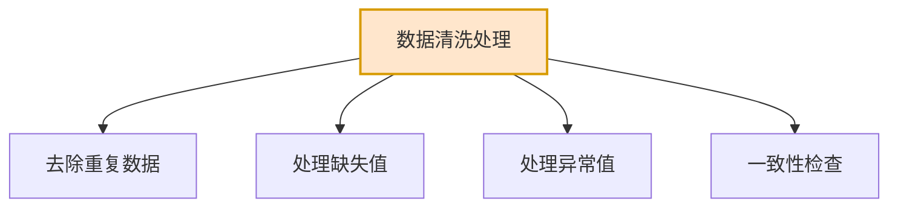

| 子任务 | 说明 | 例子 |
|---|---|---|
| **去除重复数据** | 删掉完全一样的记录 | 同一订单被记录两次 |
| **处理缺失值** | 填上或删掉空白数据 | 客户的手机号为空 |
| **处理异常值** | 处理明显不合理的数据 | 年龄填成 999 岁 |
| **一致性检查** | 统一格式 | 日期有的 `1994/01/01`，有的 `1994-01-01` |

### 10.1.4 本篇知识地图

| 章节 | 内容 | 用什么库 |
|---|---|---|
| 10.2 | 环境准备 | Jupyter Notebook |
| 10.3 | Pandas 基础 | **Pandas** |
| 10.4 | Matplotlib 基础 | **Matplotlib** |
| 10.5 | 数据分析案例 | 两者结合 |

---

## 10.2 Jupyter Notebook

### 10.2.1 概念定义

> **Jupyter Notebook** 是一个**基于 Web 网页的、交互式的编程笔记本**，让你可以把**代码、运行结果、图表和笔记**全部都放在**一个文件里**（在数据分析、机器学习、教学和科研等领域的**数据实验室**）。

### 10.2.2 与普通 Python 文件的对比

| 对比项 | Python 文件 `.py` | Jupyter 文件 `.ipynb` |
|---|---|---|
| **运行方式** | 一次运行整个文件 | **以"单元格"为单位，可单独运行** |
| **运行结果** | 全部输出到控制台 | **结果直接显示在代码下方** |
| **图表显示** | 需要额外弹窗 | **直接内嵌在文档里** |
| **能否写笔记** | 只能写注释 | ✅ **支持富文本 Markdown 笔记** |
| **变量状态** | 每次运行都重置 | **单元格之间共享变量**（可增量调试） |
| **适用场景** | 项目开发 | **数据分析、探索性实验、教学** |

> **大白话比喻**：
> - **`.py` 文件**像**写作文**——从头到尾一气呵成，改一个错别字也要重写全文。
> - **`.ipynb` 文件**像**做实验记录**——一个试管一个试管地试，随时记笔记，随时看结果，改哪一步就重跑哪一步。

### 10.2.3 特点

| 特点 | 说明 |
|---|---|
| **交互式** | 一格一格运行，立刻看到结果 |
| **图文并茂** | 代码、结果、图表、笔记混排 |
| **第一次使用自动联网下载** | Jupyter 相关软件包会自动安装 |

---

## 10.3 Pandas 基础（★本篇重点）

### 10.3.1 概念定义

> **Pandas** 是一个**功能强大的结构化数据分析的工具集**，底层是基于 **Numpy** 构建的，无论是在数据分析领域、还是大数据开发场景中都有显著的优势。

- **官网**：`https://pandas.pydata.org`
- **核心数据结构**：
  - **`DataFrame`** —— 类似**表格**
  - **`Series`** —— 类似**表格中的一列**

### 10.3.2 深入讲解：DataFrame 与 Series

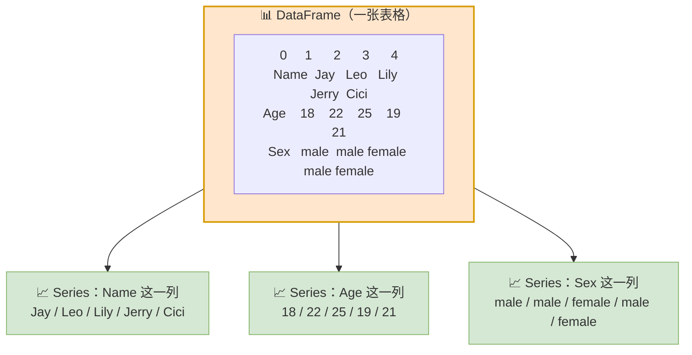

**概念定义**：

| 概念 | 定义 |
|---|---|
| **DataFrame** | 是一个**表格型的数据结构**，就像一张 **Excel 表格**，有行有列 |
| **Series** | 是**一列数据**，就像 DataFrame 中的单独一列 |

**对比表**：

| 对比项 | DataFrame | Series |
|---|---|---|
| **维度** | **二维**（行 × 列） | **一维**（只有一列） |
| **白话比喻** | 一张 Excel 表格 | 表格中的一列 |
| **组成** | 多个 Series 拼成 | 索引 + 值 |
| **`shape` 返回** | `(行数, 列数)` | `(行数,)` |
| **独有属性** | `columns`（列名） | `name`（列名） |
| **典型操作** | `df.groupby()` `df.sort_values()` | `s.max()` `s.mean()` |

### 10.3.3 Pandas 初体验

**需求**：基于 Pandas 统计班级学员的各科成绩的最高分、最低分、平均分。

**准备**：

```bash
pip install pandas==2.3.3
```

**代码**：

```python
import pandas as pd

df1 = pd.DataFrame([
    {'姓名': '张三', '语文': 85, '数学': 92, '英语': 78},
    {'姓名': '李四', '语文': 78, '数学': 88, '英语': 95},
    {'姓名': '王五', '语文': 92, '数学': 96, '英语': 89},
    {'姓名': '赵六', '语文': 85, '数学': 90, '英语': 90},
    {'姓名': '孙七', '语文': 72, '数学': 59, '英语': 66},
    {'姓名': '周八', '语文': 80, '数学': 76, '英语': 68},
    {'姓名': '吴九', '语文': 85, '数学': 85, '英语': 85},
    {'姓名': '郑十', '语文': 57, '数学': 68, '英语': 49},
])

print(f"最高分: {df1['语文'].max()}, 最低分: {df1['语文'].min()}, 平均分: {df1['语文'].mean()}")
print(f"最高分: {df1['数学'].max()}, 最低分: {df1['数学'].min()}, 平均分: {df1['数学'].mean()}")
print(f"最高分: {df1['英语'].max()}, 最低分: {df1['英语'].min()}, 平均分: {df1['英语'].mean()}")
```

> 💡 **感受一下 Pandas 的威力**：如果用纯 Python 列表，要写 `max()`、`min()`、`sum()/len()`，还要遍历；用 Pandas，一行`.`出来。

### 10.3.4 构建 DataFrame 的 4 种方式（★对比表）

| 方式 | 写法 | 特点 |
|---|---|---|
| **① 字典列表** | `pd.DataFrame([{...}, {...}])` | **最直观**，每行一个字典 |
| **② 列字典** | `pd.DataFrame({'列名': [...], ...})` | **列式思维**，适合按列组织数据 |
| **③ 元组列表 + columns** | `pd.DataFrame([(...), (...)], columns=[...])` | 紧凑，需指定列名 |
| **④ 列表的列表 + columns + index** | `pd.DataFrame([[...]], columns=[...], index=[...])` | 可同时指定索引 |

```python
import pandas as pd

# 方式一：字典列表
df1 = pd.DataFrame([
    {'姓名': '张三', '语文': 85, '数学': 92, '英语': 78},
    {'姓名': '李四', '语文': 78, '数学': 88, '英语': 95},
    {'姓名': '王五', '语文': 92, '数学': 96, '英语': 89},
])

# 方式二：列字典
df2 = pd.DataFrame({
    '姓名': ['张三', '李四', '王五'],
    '语文': [85, 78, 92],
    '数学': [92, 88, 96],
    '英语': [78, 95, 89]
})

# 方式三：元组列表
df3 = pd.DataFrame([
    ('张三', 85, 92, 78),
    ('李四', 78, 88, 95),
    ('王五', 92, 96, 89)
], columns=['姓名', '语文', '数学', '英语'])

# 方式四：列表的列表 + 自定义索引
df4 = pd.DataFrame([
    ['张三', 85, 92, 78],
    ['李四', 78, 88, 95],
    ['王五', 92, 96, 89]
], columns=['姓名', '语文', '数学', '英语'], index=['a', 'b', 'c'])
```

### 10.3.5 构建 Series 的 4 种方式

```python
import pandas as pd

# 方式一：列表
s = pd.Series([10, 20, 30, 40, 50])

# 方式二：元组 + 自定义索引
s = pd.Series((10, 20, 30, 40, 50), index=['a', 'b', 'c', 'd', 'e'])

# 方式三：字典
s = pd.Series({'a': 10, 'b': 20, 'c': 30, 'd': 40, 'e': 50})

# 方式四：从 DataFrame 中取一列
s = df1['语文']
s = df1['数学']
```

### 10.3.6 常用属性表（★重点）

| 属性 / 方法 | 作用 | 适用对象 |
|---|---|---|
| **`xx.index`** | 获取**索引** | DataFrame / Series |
| **`xx.values`** | 获取**值** | DataFrame / Series |
| **`xx.dtype`** | 获取**数据类型** | Series |
| **`xx.dtypes`** | 获取**每一列的类型** | DataFrame |
| **`xx.size`** | 获取**单元格的数量** | DataFrame / Series |
| **`xx.shape`** | 获取**数据维度** `(行, 列)` | DataFrame / Series |
| **`xx.columns`** | 获取**列名** | **DataFrame 特有** |

> 💡 **记忆技巧**：
> - **`dtype`**（单数）→ Series 用，返回一个类型
> - **`dtypes`**（复数）→ DataFrame 用，返回**每列**的类型

### 10.3.7 数据读取与写入

#### 概念定义

> 基于 Pandas 中提供的 API，可以很方便地对各类数据文件（**csv、Excel、数据库、网络数据**等）进行**读取和写入**。

**命名规律**：

| 操作 | 方法名规律 | 例子 |
|---|---|---|
| **读取** | **`read_xxx`** | `read_csv`、`read_excel` |
| **写入** | **`to_xxx`** | `to_csv`、`to_excel` |

#### 数据流转流程图


#### 代码示例

```python
import pandas as pd

# 读取：只要需要的列
df = pd.read_csv('../data/sales.csv', usecols=[
    '订单日期', '产品类别', '销售数量', '单价', '客户所在城市', '支付方式'
])

# 新增计算列
df['销售额'] = df['销售数量'] * df['单价']

# 写入：只写前 20 行，不要索引列
df.head(20).to_csv('../data/sales_02.csv', index=False)
```

**常用参数**：

| 参数 | 作用 |
|---|---|
| `usecols=[...]` | **只读取指定的列**（大数据文件必用，能大幅提速） |
| `index=False` | 写入时**不保存索引列**（否则会多一列无名数据） |
| `encoding='utf-8'` | 指定编码，防中文乱码 |
| `nrows=100` | 只读取前 100 行 |

### 10.3.8 数据查看、选择及过滤

#### 数据查看方法表

| 方法 / 属性 | 作用 |
|---|---|
| **`df.head(n)`** | 查看**前 n 行**数据 |
| **`df.tail(n)`** | 查看**结尾 n 行**数据 |
| **`df.describe()`** | **数值列的统计描述**（计数、均值、标准差、最值、四分位数） |
| **`df.info()`** | 查看**数据信息**（列名、非空计数、数据类型） |
| **`df.shape`** | **属性**，查看数据维度（行数, 列数） |
| **`df.columns`** | **属性**，查看列名 |

#### 选择列的方式

| 写法 | 结果 | 返回类型 |
|---|---|---|
| `df['列名']` 或 `df.列名` | 操作**单列** | **Series** |
| `df[['列1', '列2']]` | 操作**多列** | **DataFrame** |

> ⚠️ **注意双层方括号**：`df[['列1','列2']]` 里面是一个**列表**，所以返回的是 DataFrame（表格）；`df['列1']` 返回的是 Series（一列）。

#### ★iloc 与 loc 对比表（核心难点）

| 对比项 | `df.iloc[start:stop:step]` | `df.loc[start:stop:step]` |
|---|---|---|
| **依据** | **基于行号**完成切片 | **基于索引标签**完成切片 |
| **是否含 stop** | ❌ **不含 stop**（左闭右开） | ✅ **含 stop**（左闭右闭） |
| **能否用负数** | ✅ 可以（`iloc[-1]`） | ✅ 可以（标签为负数时） |
| **记忆** | **i**loc → **i**ndex（位置序号） | **loc** → **l**abel（标签） |

> ⚠️ **这是 Pandas 最容易搞混的地方**：
>
> | 写法 | 含义 |
> |---|---|
> | `df.iloc[0:3]` | 第 **0、1、2** 行（**3 行**） |
> | `df.loc[0:3]` | 第 **0、1、2、3** 行（**4 行**） |
>
> **`iloc` 像 Python 的列表切片（包前不包后），`loc` 像"从 A 到 B 都算"（两端都包含）。**

#### 数据的过滤操作

**语法**：`df[条件表达式]`

| 过滤类型 | 写法 | 说明 |
|---|---|---|
| **单条件（比较）** | `df[df['销售数量'] >= 10]` | 数值比较 |
| **单条件（in）** | `df[df['产品类别'].isin(['服装', '食品'])]` | 属于某个集合 |
| **单条件（区间）** | `df[df['单价'].between(50, 200)]` | 在某区间内 |
| **多条件（并且）** | `df[(条件1) & (条件2)]` | `&` 表示 **并且** |
| **多条件（或者）** | `df[(条件1) \| (条件2)]` | `\|` 表示 **或** |

> ⚠️ **多条件必须加括号**！`df[df['A'] > 1 & df['B'] < 2]` 会报错，正确写法是 `df[(df['A'] > 1) & (df['B'] < 2)]`。

#### 查看、选择、过滤 流程图

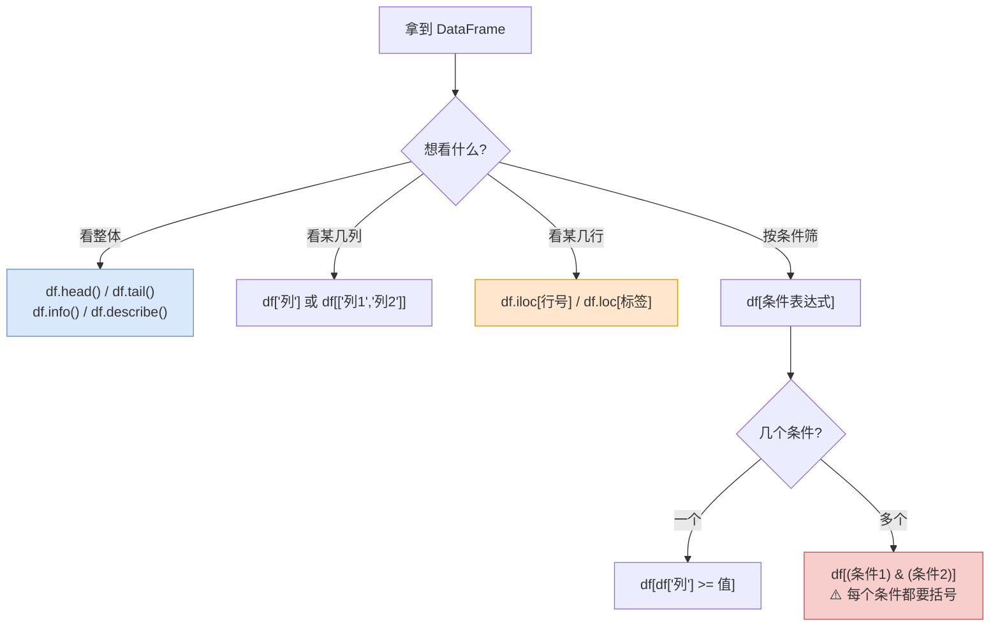

### 10.3.9 数据清洗

#### 概念定义

> **数据清洗**是指**发现并纠正数据中可识别的错误的过程**，包括处理**缺失值、重复值、异常值**，统一数据格式，保证**数据的一致性**。

#### 四个子任务

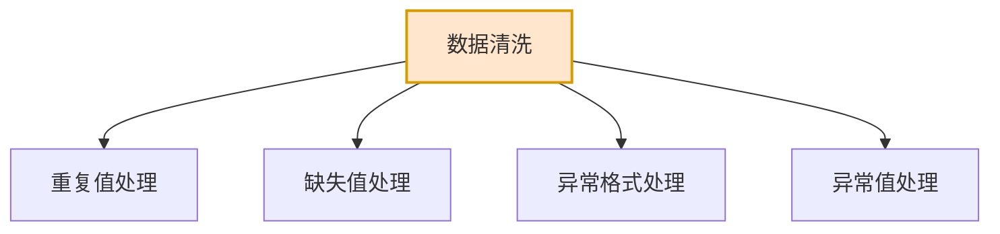

#### 常用清洗方法表（★核心表）

| 方法 | 作用 | 归类 |
|---|---|---|
| **`isnull()`** | 判断是否为空，返回布尔 Series/DataFrame | 缺失值 |
| **`dropna()`** | **删除**含有缺失值的行/列 | 缺失值 |
| **`fillna(value)`** | 用**指定值填充**缺失值 | 缺失值 |
| **`ffill()`** | **向前填充**（用上一个有效值填） | 缺失值 |
| **`bfill()`** | **向后填充**（用下一个有效值填） | 缺失值 |
| **`duplicated()`** | 判断是否重复，返回布尔 Series | 重复值 |
| **`drop_duplicates()`** | **删除重复行** | 重复值 |
| **`df['xx'] = df['xx'].abs()`** | 取**绝对值**（处理负值异常） | 异常值 |
| **`df['xxx'].str.replace('/', '-')`** | **字符串替换**（统一格式） | 异常格式 |

#### 清洗方法详解表

| 场景 | 推荐方法 | 说明 |
|---|---|---|
| 缺失值很少 | `dropna()` | 直接删掉这几行 |
| 缺失值较多，且是数值 | `fillna(平均值)` | 用均值填充 |
| 缺失值是**时间序列** | `ffill()` / `bfill()` | 用前后值填充，符合趋势 |
| 缺失值是**分类数据** | `fillna('未知')` | 填个默认值 |
| 完全重复的行 | `drop_duplicates()` | 直接删 |
| 日期格式不统一 | `.str.replace('/', '-')` | 统一分隔符 |
| 数值都是负数（录入错误） | `.abs()` | 取绝对值 |

> **大白话比喻**：数据清洗就像**洗菜**。
> - **缺失值** = 菜上有虫眼 → 挖掉（`dropna`）或者补一块（`fillna`）
> - **重复值** = 同一棵菜装了两遍 → 拿掉一份（`drop_duplicates`）
> - **异常值** = 混进来的石头 → 挑出来（`abs` / 阈值过滤）
> - **格式不统一** = 大小块切得不整齐 → 重新切（`str.replace`）

#### 数据清洗流程图

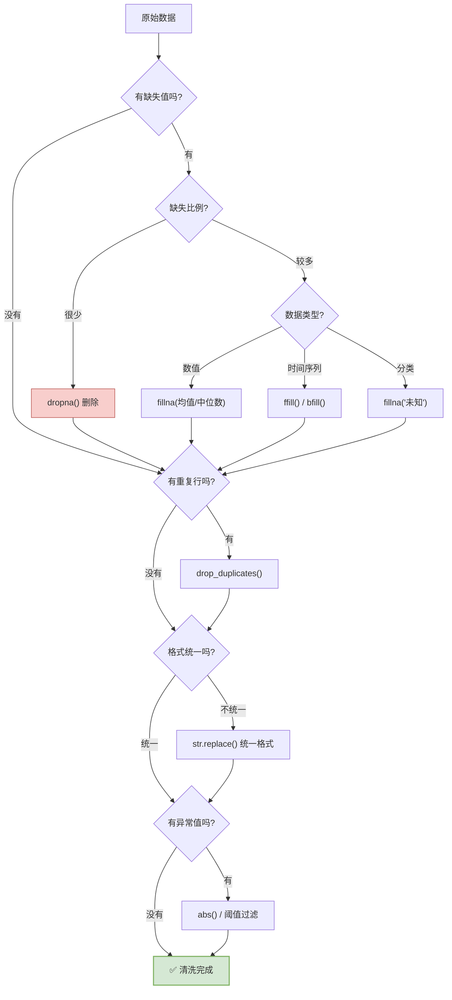

### 10.3.10 数据排序

#### 概念定义

> 在进行数据排序时，有**两种排序方式**，分别是：**升序**和**降序**。基于 Pandas 进行数据排序时，是**可以按照多个列进行排序的**。

#### 语法

```python
# 升序（默认）
df.sort_values('销售数量', ascending=True)

# 降序
df.sort_values('销售数量', ascending=False)

# 多列排序
df.sort_values(['销售数量', '单价'], ascending=[True, True])
```

#### 关键点

> **多列排序规则**：进行多个列排序时，会**先按照第一列进行排序**，**第一列的值相同时**，才会按照第二列进行排序。

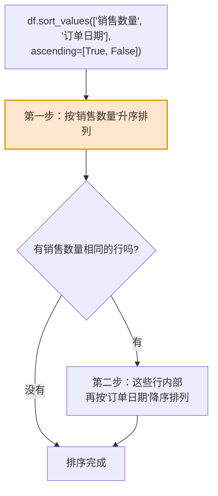

#### `ascending` 参数对照表（★易错点）

| 写法 | 含义 |
|---|---|
| `ascending=True` | 所有列都**升序** |
| `ascending=False` | 所有列都**降序** |
| `ascending=[True, False]` | 第 1 列升序，第 2 列降序 |
| `ascending=[False, True]` | 第 1 列降序，第 2 列升序 |

> ⚠️ **注意**：当传入**列表**时，列表长度必须和**排序列的数量一致**，否则报错。

#### 排序实例解读

| 写法 | 含义 |
|---|---|
| `df.sort_values('销售数量', ascending=False)` | 按销售数量**降序** |
| `df.sort_values(['销售数量', '订单日期'], ascending=[True, False])` | 先按销售数量**升序**，相同则按订单日期**降序** |
| `df.sort_values(['销售数量', '订单日期'], ascending=False)` | 两列**都降序** |

### 10.3.11 数据分组

#### 概念定义

> **分组操作就是把数据按照某个特征分成不同的组，然后对每个组分别进行统计计算。**

> **大白话比喻**：分组就像**老师分卷子**。
>
> 全班 50 份卷子混在一起（原始数据），老师先按**班级**分成几摞（分组），然后对每一摞分别算**平均分、最高分**（聚合）。

#### 分组流程图（拆分 - 应用 - 合并）

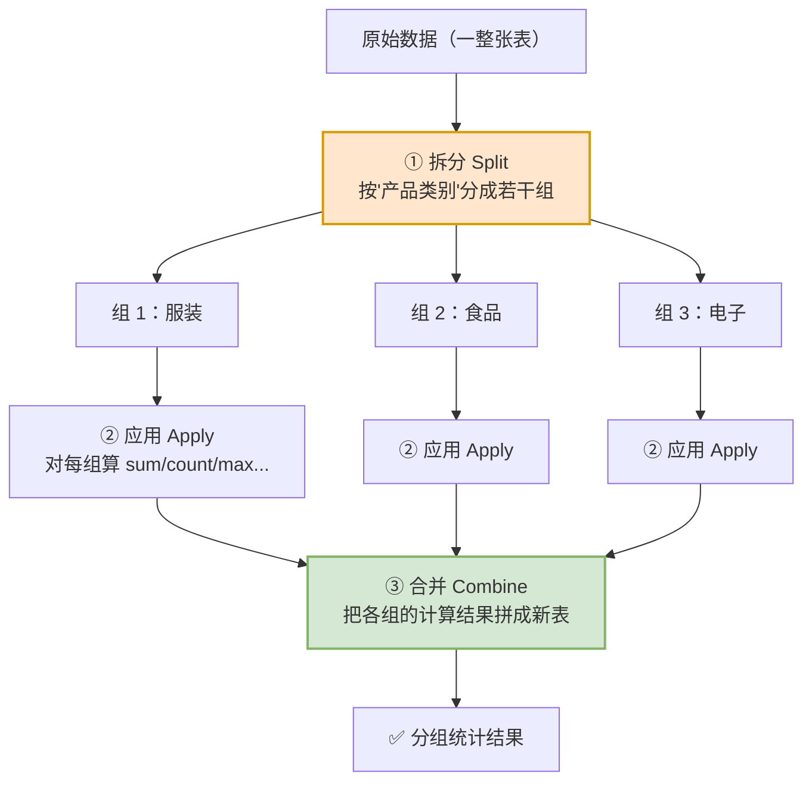

#### 分组聚合语法与对照表

| 写法 | 含义 |
|---|---|
| `df.groupby('产品类别')['销售额'].sum()` | 分组后**求和** |
| `df.groupby('产品类别')['销售额'].count()` | 分组后**统计数量** |
| `df.groupby('产品类别')['销售额'].max()` | 分组后**求最大值** |
| `df.groupby('产品类别')['销售额'].min()` | 分组后**求最小值** |
| `df.groupby('产品类别')['销售额'].mean()` | 分组后**求平均值** |
| `df.groupby('产品类别')['销售额'].agg(['sum', 'count', 'max', 'min', 'mean'])` | **一次算多个统计量** |
| `df.groupby('产品类别').agg({'销售数量':'sum', '销售金额':'sum', '单价':'mean'})` | **不同列用不同聚合方式** |

#### 常用聚合函数表

| 函数 | 作用 |
|---|---|
| `sum()` | 求和 |
| `count()` | 计数（非空个数） |
| `size()` | 计数（含空值） |
| `max()` | 最大值 |
| `min()` | 最小值 |
| `mean()` | 平均值 |
| `median()` | 中位数 |
| `std()` | 标准差 |
| `var()` | 方差 |
| `nunique()` | 去重后的个数 |

#### 分组语法结构解析

```
df.groupby('产品类别')['销售额'].sum()
   ↑          ↑           ↑       ↑
 数据源    分组依据     要统计的列  聚合方式
```

> 💡 **`agg` 的两种用法**：
> - **`agg([列表])`** —— 对**同一列**同时算多个统计量
> - **`agg({字典})`** —— 对**不同列**分别指定统计方式（更灵活）

### 10.3.12 Pandas 全流程总图（★核心）

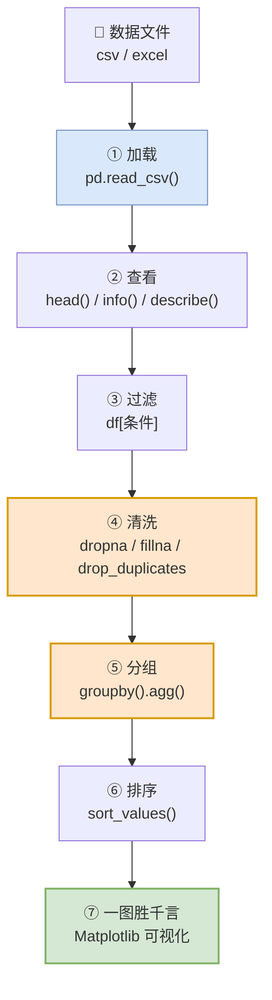

---

## 10.4 Matplotlib 基础

### 10.4.1 概念定义

> **Matplotlib** 是一个**功能强大的数据可视化开源 Python 库**，也是 Python 中**使用得最多的图形绘图库**，可以创建**静态、动态、交互式**的图表。

- **官网**：`https://matplotlib.org`
- **安装**：`pip install matplotlib`

### 10.4.2 入门程序

```python
import matplotlib.pyplot as plt

x = [1, 2, 3, 4, 5, 6, 7, 8, 9, 10]
y = [6, 2, 9, 8, 10, 1, 5, 4, 3, 7]

plt.plot(x, y)
plt.show()
```

> ⚠️ **注意**：**X 轴的数据数量与 Y 轴中的数据数量要一致。**

### 10.4.3 绘图流程图

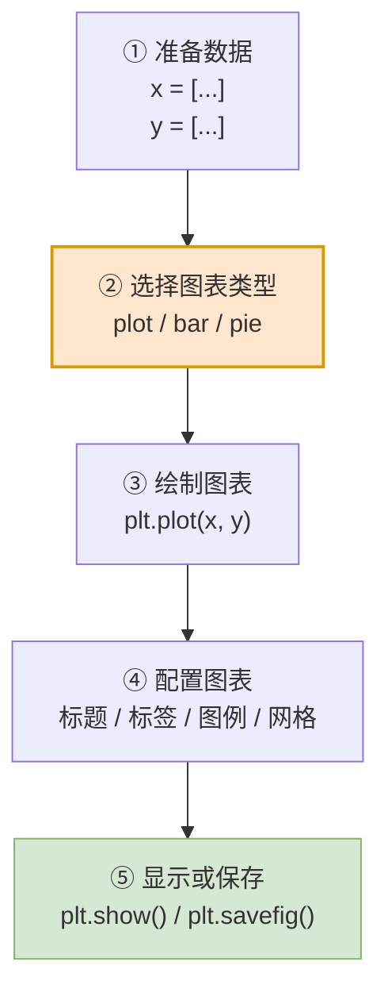

### 10.4.4 图表组成详解（★重点）

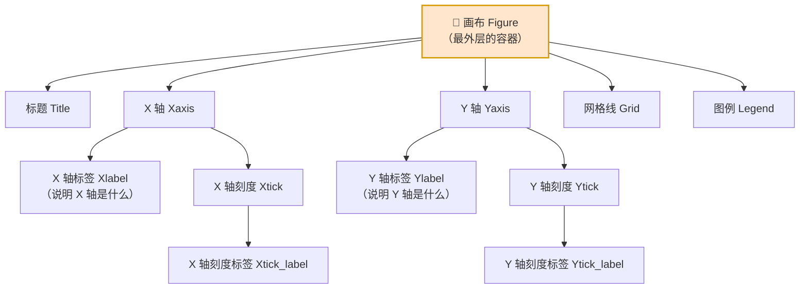

**各组成部分说明表**：

| 组成部分 | 英文 | 作用 | 设置方法 |
|---|---|---|---|
| **画布** | Figure | 最外层的容器，所有内容都画在上面 | `figsize=(20, 6)` |
| **标题** | Title | 图表说明 | `plt.title("北京气温变化曲线")` |
| **X 轴** | Xaxis | 横轴 | — |
| **Y 轴** | Yaxis | 纵轴 | — |
| **X 轴标签** | Xlabel | 说明横轴含义 | `plt.xlabel("时间")` |
| **Y 轴标签** | Ylabel | 说明纵轴含义 | `plt.ylabel("气温")` |
| **X 轴刻度** | Xtick | 横轴上的刻度位置 | `plt.xticks(...)` |
| **X 轴刻度标签** | Xtick_label | 刻度下显示的文字 | — |
| **Y 轴刻度** | Ytick | 纵轴上的刻度位置 | `plt.yticks(...)` |
| **Y 轴刻度标签** | Ytick_label | 刻度旁显示的文字 | — |
| **网格线** | Grid | 辅助读取数值 | `plt.grid(True)` |
| **图例** | Legend | 说明每条线代表什么 | `plt.legend()` |

> **大白话比喻**：一张图表就像**一张地图**。
> - **画布** = 纸张
> - **标题** = 地图名字
> - **X/Y 轴标签** = "东经"和"北纬"
> - **刻度** = 经纬度数字
> - **图例** = 地图图例（红色线是什么、绿色线是什么）
> - **网格线** = 坐标网格

### 10.4.5 三种核心图表对比表（★重点）

| 图表类型 | 绘制方法 | 适合展示 | 什么时候用 | 例子 |
|---|---|---|---|---|
| **折线图** | `plt.plot(...)` / `axes.plot(...)` | **趋势变化** | 数据随**时间**变化 | 每年上映电影数量的变化 |
| **柱状图** | `plt.bar(...)` / `axes.bar(...)` | **数量对比** | 不同**类别**之间比大小 | 不同语言电影数量对比 |
| **饼状图** | `plt.pie(...)` / `axes.pie(...)` | **比例构成** | 看**各部分占整体**的比例 | 各评分段电影的占比 |

**选择口诀**：

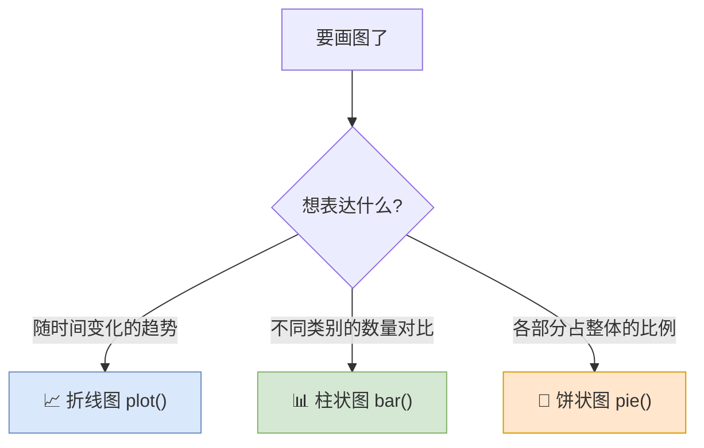

### 10.4.6 创建子图（subplots）

#### 为什么需要子图

> 为了能**同时展示多个图表**，便于图表之间**数据的直观对比和分析**，更**高效、更专业地组织和呈现**复杂的可视化信息，通常会在**一个画布上创建多个子图**。

#### 语法

```python
figure, axes = plt.subplots(nrows=1, ncols=2, figsize=(20, 6), dpi=100)
```

| 参数 | 含义 |
|---|---|
| `nrows` | 子图**行数** |
| `ncols` | 子图**列数** |
| `figsize=(宽, 高)` | 画布尺寸（英寸） |
| `dpi` | 分辨率（每英寸点数） |

#### 返回值

| 返回值 | 含义 |
|---|---|
| **`figure`** | 整个**画布**对象 |
| **`axes`** | **子图数组**，通过索引访问每个子图 |

#### 子图索引规则图

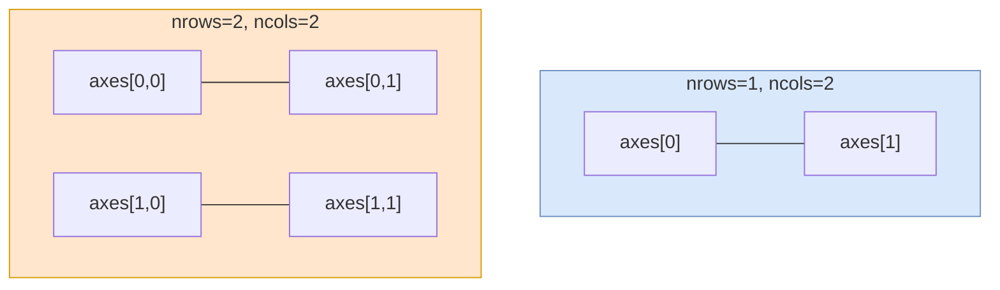

> ⚠️ **索引规则**：
> - **1 行 N 列** → 用**一维索引**：`axes[0]`、`axes[1]`
> - **多行多列** → 用**二维索引**：`axes[行, 列]`，如 `axes[0][0]` 或 `axes[0, 0]`

#### 代码示例

```python
import matplotlib.pyplot as plt

# 创建 1 行 2 列的子图
figure, axes = plt.subplots(nrows=1, ncols=2, figsize=(20, 6), dpi=100)

# 左图：柱状图
axes[0].bar(['A', 'B', 'C'], [10, 20, 15])
axes[0].set_title("柱状图")

# 右图：饼状图
axes[1].pie([30, 20, 50], labels=['X', 'Y', 'Z'])
axes[1].set_title("饼状图")

plt.show()
```

---

## 10.5 综合案例

### 10.5.1 案例一：TMDB-TOP300 电影数据统计分析

#### 需求列表

| 需求 | 图表类型 | 说明 |
|:---:|---|---|
| **需求 1** | **折线图** | 统计 TOP300 的电影中，**每一年上映的电影数量的变化** |
| **需求 2** | **柱状图** | 统计对比**不同语言**电影数量 |
| **需求 3** | **柱状图** | 统计对比**不同类型**电影数量 |
| **需求 4** | **饼状图** | 统计对比**各个电影评分的比例** |

#### 实现步骤

| 步骤 | 内容 |
|:---:|---|
| **1** | **准备工作**：导入依赖库、配置运行时参数、**创建子图完成基本布局**、加载数据 |
| **2** | 统计 TOP300 的电影中，每一年上映的电影数量的变化（**折线图**） |
| **3** | 统计对比不同语言电影数量（**柱状图**） |
| **4** | 统计对比不同类型电影数量（**柱状图**） |
| **5** | 统计对比各个评分的电影占比（**饼状图**） |

#### 完整流程图

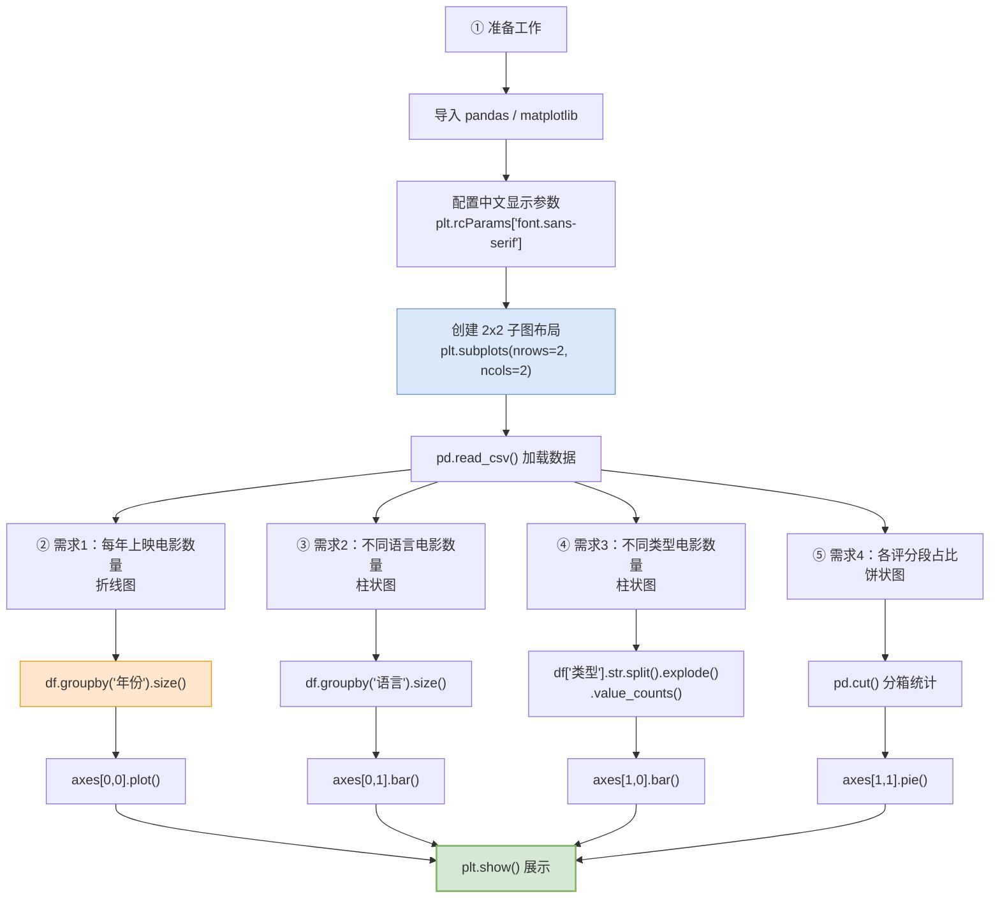

#### 代码骨架

```python
import pandas as pd
import matplotlib.pyplot as plt

# ===== ① 准备工作 =====
# 配置中文显示（否则中文会显示成方框）
plt.rcParams['font.sans-serif'] = ['SimHei']
plt.rcParams['axes.unicode_minus'] = False

# 创建 2x2 子图
figure, axes = plt.subplots(nrows=2, ncols=2, figsize=(20, 12), dpi=100)

# 加载数据
df = pd.read_csv('tmdb_top300.csv')

# ===== ② 折线图：每年上映电影数量 =====
year_count = df.groupby('年份').size()
axes[0, 0].plot(year_count.index, year_count.values)
axes[0, 0].set_title('每年上映电影数量变化')
axes[0, 0].set_xlabel('年份')
axes[0, 0].set_ylabel('电影数量')

# ===== ③ 柱状图：不同语言电影数量 =====
lang_count = df['语言'].value_counts().head(10)
axes[0, 1].bar(lang_count.index, lang_count.values)
axes[0, 1].set_title('不同语言电影数量对比')

# ===== ④ 柱状图：不同类型电影数量 =====
type_count = df['类型'].str.split(',').explode().value_counts().head(10)
axes[1, 0].bar(type_count.index, type_count.values)
axes[1, 0].set_title('不同类型电影数量对比')

# ===== ⑤ 饼状图：各评分段占比 =====
bins = [0, 7, 8, 9, 10]
labels = ['7分以下', '7-8分', '8-9分', '9分以上']
score_group = pd.cut(df['评分'], bins=bins, labels=labels).value_counts()
axes[1, 1].pie(score_group.values, labels=score_group.index, autopct='%1.1f%%')
axes[1, 1].set_title('各评分段电影占比')

plt.show()
```

### 10.5.2 案例二：某连锁店销售订单统计分析

| 需求 | 图表类型 | 说明 |
|:---:|---|---|
| **需求 1** | **折线图** | 统计**每天销售额的变化** |
| **需求 2** | **柱状图** | 统计对比**不同城市的累计销售数量** |
| **需求 3** | **饼状图** | 统计**不同产品类型**对应的订单比例 |
| **需求 4** | **饼状图** | 统计**不同支付方式**对应的订单比例 |

#### 分析流程图

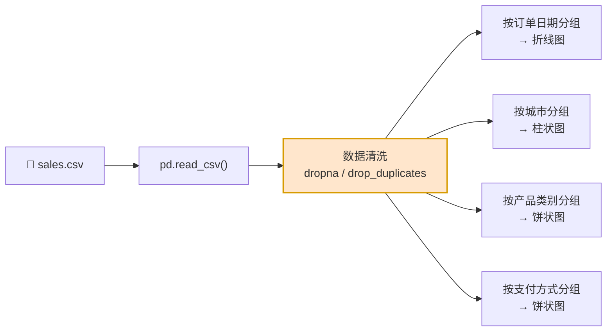

---

## 10.6 本篇小结

### 10.6.1 知识全景图

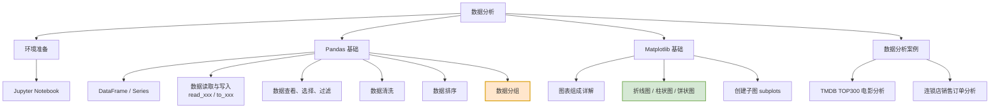

### 10.6.2 Pandas 方法速查大表（★核心）

| 分类 | 方法 / 属性 | 作用 |
|---|---|---|
| **加载** | `pd.read_csv()` `pd.read_excel()` | 读取数据 |
| | `df.to_csv()` `df.to_excel()` | 写入数据 |
| **查看** | `df.head(n)` `df.tail(n)` | 查看前/后 n 行 |
| | `df.info()` `df.describe()` | 数据概况 / 统计描述 |
| | `df.shape` `df.columns` `df.dtypes` | 维度 / 列名 / 列类型 |
| **选择** | `df['列']` `df[['列1','列2']]` | 选单列 / 多列 |
| | `df.iloc[]` / `df.loc[]` | 按行号 / 按标签切片 |
| **过滤** | `df[条件]` | 条件筛选 |
| | `.isin()` `.between()` | 成员 / 区间判断 |
| **清洗** | `isnull()` `dropna()` `fillna()` `ffill()` `bfill()` | 缺失值处理 |
| | `duplicated()` `drop_duplicates()` | 重复值处理 |
| | `.abs()` `.str.replace()` | 异常值 / 格式统一 |
| **排序** | `sort_values(列, ascending=)` | 单列排序 |
| | `sort_values([列1,列2], ascending=[..])` | 多列排序 |
| **分组** | `groupby(列)` | 分组 |
| | `.sum() .count() .max() .min() .mean()` | 聚合 |
| | `.agg([...])` / `.agg({...})` | 多聚合 / 分列聚合 |

### 10.6.3 易错点清单

| 易错点 | 现象 | 解决 |
|---|---|---|
| `iloc` 和 `loc` 搞混 | 切片范围多一行/少一行 | **`loc` 含末尾，`iloc` 不含** |
| 多条件没加括号 | `ValueError` | `df[(A) & (B)]` |
| 单列写成双括号 | 拿到 DataFrame 而不是 Series | 明确要 Series 还是 DataFrame |
| 忘记 `index=False` | CSV 多一列索引 | 写入时加上 |
| 忘记 `encoding='utf-8'` | 中文乱码 | 显式指定 |
| `w` 模式覆盖原文件 | 数据丢失 | 换文件名或备份 |
| 排序传入列表长度不符 | 报错 | `ascending` 列表长度 = 列数 |
| 分组后忘记选列 | 结果不对 | `groupby('X')['Y'].sum()` |
| Matplotlib 中文显示方框 | 中文变 `□□□` | `plt.rcParams['font.sans-serif'] = ['SimHei']` |
| X/Y 数据长度不一致 | 绘图报错 | 检查两个列表长度 |
| 1 行 N 列子图用二维索引 | 索引错误 | 1 行/1 列用**一维**索引 |

### 10.6.4 动手练习

> **练习 1**：用 Pandas 读取一个 CSV 文件，输出它的行数、列数、每列的数据类型、前 5 行。
>
> **练习 2**：对上题的数据做清洗：删除重复行、用均值填充缺失的数值列。
>
> **练习 3**：按某个分类列分组，统计每组的总和、平均值、最大值。
>
> **练习 4**：用 `subplots` 创建一个 1 行 3 列的画布，分别画折线图、柱状图、饼状图。

> **下一步** → 打开 `11-第6章-Python项目实战之Web开发.md`，学习如何做出一个真正的网站。
