# 第11篇 · Python 项目实战之 Web 开发

> **本篇定位**：这是**综合能力最强**的一篇。你会用到前面学的**所有知识**——面向对象、函数、模块、文件、JSON、AI 调用——做出一个**带前后端的完整网站**："AI 汉字谜盒"。
>
> 本篇分成两大块：
> 1. **面向对象高级**（11.1）：封装、继承、多态 —— 这是**面试必考**、也是**框架底层的基础**
> 2. **Web 开发实战**（11.2~11.6）：从 Web 概念到 FastAPI，到完整项目

---

## 11.1 面向对象高级

第 07 篇学的"面向对象基础"讲了类、对象、属性、方法。这一节讲**三大特性**——这是面向对象真正强大的地方。

### 11.1.1 封装

#### 概念定义

> **封装**：**把数据（属性）和操作数据的方法（函数）捆绑在一起，并对外部隐藏内部实现细节**，只对外暴露必要的接口。

> **大白话比喻**：封装就像**开车**。
>
> 你只需要**方向盘、油门、刹车**（对外暴露的接口）。你**不需要知道**发动机怎么点火、变速箱怎么换挡（隐藏的实现细节）。
>
> 好处是：**就算发动机技术换代了，你开车的操作方式不用变。**

#### 封装的两个层次

| 层次 | 含义 | 实现方式 |
|---|---|---|
| **① 打包** | 把属性和方法放进同一个类 | 第 07 篇已经做了 |
| **② 隐藏** | 把不想让外界直接访问的属性隐藏起来 | **私有属性 / 私有方法** |

#### 私有属性与私有方法

**Python 中通过命名约定来实现"私有"**（注意：是**约定**，不是强制）：

| 命名 | 类型 | 能否直接访问 | 说明 |
|---|---|---|---|
| `name` | 公有属性 | ✅ 能 | 正常属性 |
| `_name` | **约定私有** | ⚠️ 能，但不建议 | 单下划线开头（"别碰我"） |
| `__name` | **名称改写** | ❌ 直接访问会报错 | 双下划线开头 |
| `__method()` | 私有方法 | ❌ 直接调用会报错 | — |

```python
class BankAccount:
    def __init__(self, owner, balance):
        self.owner = owner            # 公有属性
        self.__balance = balance      # 私有属性（双下划线）

    def deposit(self, amount):        # 对外接口：存钱
        if amount <= 0:
            print("存款金额必须大于 0")
            return
        self.__balance += amount
        self.__check()                # 调用私有方法

    def withdraw(self, amount):       # 对外接口：取钱
        if amount > self.__balance:
            print("余额不足")
            return
        self.__balance -= amount
        self.__check()

    def __check(self):                # 私有方法：内部记录
        print(f"【内部日志】当前余额：{self.__balance}")

    def get_balance(self):            # 对外接口：查余额
        return self.__balance

acc = BankAccount("张三", 1000)
acc.deposit(500)          # ✅ 【内部日志】当前余额：1500
acc.withdraw(200)         # ✅ 【内部日志】当前余额：1300
print(acc.get_balance())  # ✅ 1300

print(acc.__balance)      # ❌ AttributeError（访问不到）
acc.__check()             # ❌ AttributeError（调用不到）
```

> 💡 **为什么这样设计？** 因为"余额"这种数据**不能让外部随便改**——否则 `acc.__balance = 999999` 就乱套了。所有修改必须**走 `deposit` / `withdraw` 这些有校验的接口**。

#### 公有 vs 私有 对比表

| 对比项 | 公有成员 | 私有成员 |
|---|---|---|
| **命名** | `name` | `__name`（双下划线开头） |
| **类内访问** | ✅ | ✅ |
| **类外访问** | ✅ | ❌ 报 `AttributeError` |
| **子类访问** | ✅ | ❌ |
| **目的** | 对外提供功能 | **保护内部数据不被乱改** |
| **比喻** | 汽车的**方向盘** | 汽车的**发动机内部** |

#### 封装的实现流程图

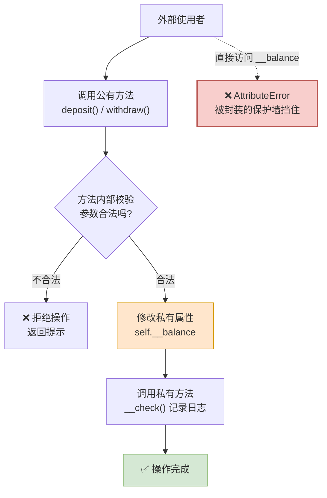

---

### 11.1.2 继承

#### 概念定义

> **继承**：**子类自动拥有父类的属性和方法**，并可以在此基础上**添加新功能**或**修改已有功能**的机制。

**相关术语**：

| 术语 | 说明 |
|---|---|
| **父类 / 基类 / 超类** | 被继承的类 |
| **子类 / 派生类** | 继承别人的类 |
| **继承** | 子类拥有父类的属性和方法 |

> **大白话比喻**：继承就像**父子传承**。
>
> 儿子（子类）天生就有爸爸（父类）的姓氏、房产、人脉（属性和方法），不用重新奋斗一遍。同时儿子也可以**学新技能**（新增方法），或者**把爸爸的某项技能做得更好**（重写方法）。

#### 继承语法

```python
class 子类名(父类名):
    # 子类可以：
    # ① 直接使用父类的属性和方法
    # ② 添加自己特有的属性和方法
    # ③ 重写父类的方法
    pass
```

#### 继承实例

```python
class Animal:
    def __init__(self, name, age):
        self.name = name
        self.age = age

    def eat(self):
        print(f"{self.name} 正在吃东西...")

    def sleep(self):
        print(f"{self.name} 正在睡觉...")


class Dog(Animal):          # Dog 继承 Animal
    def bark(self):         # 子类特有方法
        print(f"{self.name} 汪汪叫！")


class Cat(Animal):          # Cat 继承 Animal
    def meow(self):
        print(f"{self.name} 喵喵叫！")


dog = Dog("旺财", 3)
dog.eat()      # ✅ 继承自父类：旺财 正在吃东西...
dog.sleep()    # ✅ 继承自父类：旺财 正在睡觉...
dog.bark()     # ✅ 子类特有：旺财 汪汪叫！

cat = Cat("咪咪", 2)
cat.eat()      # ✅ 继承自父类
cat.meow()     # ✅ 子类特有
```

#### 继承关系图

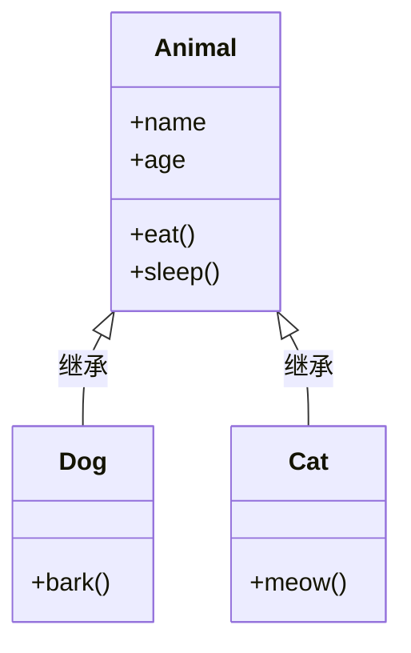

#### 方法重写（Override）

> **重写**：**子类重新定义父类中已有的方法**，用自己的实现覆盖父类的实现。

```python
class Animal:
    def __init__(self, name):
        self.name = name

    def speak(self):
        print(f"{self.name} 发出声音...")


class Dog(Animal):
    def speak(self):          # ← 重写父类的 speak 方法
        print(f"{self.name} 汪汪叫！")


class Cat(Animal):
    def speak(self):          # ← 重写父类的 speak 方法
        print(f"{self.name} 喵喵叫！")


Dog("旺财").speak()    # 旺财 汪汪叫！
Cat("咪咪").speak()    # 咪咪 喵喵叫！
```

#### 方法查找顺序流程图

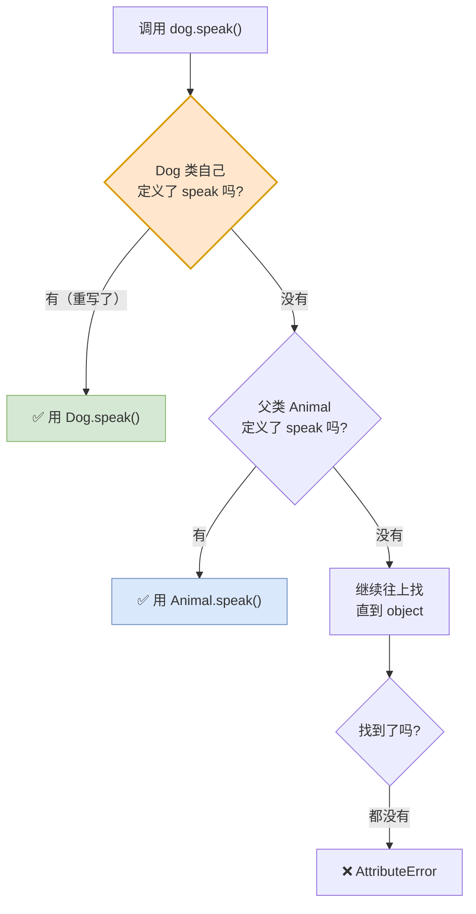

> **规则**：**先在子类找，找到就用子类的；找不到才去父类找。** 这就是"重写"能生效的原因。

#### `super()` 函数

**问题**：子类重写方法时，如果还想**保留父类的原有逻辑**，怎么办？

**答**：用 `super()`。

```python
class Animal:
    def __init__(self, name, age):
        self.name = name
        self.age = age


class Dog(Animal):
    def __init__(self, name, age, breed):
        super().__init__(name, age)     # ← 调用父类的 __init__
        self.breed = breed              # ← 子类特有的属性


dog = Dog("旺财", 3, "金毛")
print(dog.name, dog.age, dog.breed)     # 旺财 3 金毛
```

| 写法 | 含义 |
|---|---|
| `super().__init__(...)` | 调用**父类**的 `__init__` |
| `super().方法名(...)` | 调用**父类**的某个方法 |

> **大白话**：`super()` 就是**"爸，你先来"**——子类在自己的方法里，请父类先把原来的活干一遍，然后自己再补上额外的部分。

#### 多继承

**概念**：一个类可以同时继承**多个父类**。

```python
class Flyable:
    def fly(self):
        print("我能飞")

class Swimmable:
    def swim(self):
        print("我能游泳")

class Duck(Flyable, Swimmable):     # 同时继承两个父类
    pass

duck = Duck()
duck.fly()      # ✅ 我能飞
duck.swim()     # ✅ 我能游泳
```

#### MRO（方法解析顺序）

**问题**：多继承时，如果两个父类有**同名方法**，子类该用哪个？

**答**：按 **MRO（Method Resolution Order，方法解析顺序）** 决定。

**Python 3 使用 C3 线性化算法**，规则可以简化为：**从左到右，深度优先，但同一个类只出现一次**。

```python
class A:
    def show(self):
        print("A.show")

class B(A):
    def show(self):
        print("B.show")

class C(A):
    def show(self):
        print("C.show")

class D(B, C):
    pass

d = D()
d.show()             # B.show
print(D.__mro__)     # 查看 MRO 顺序
```

**MRO 查找流程图**：

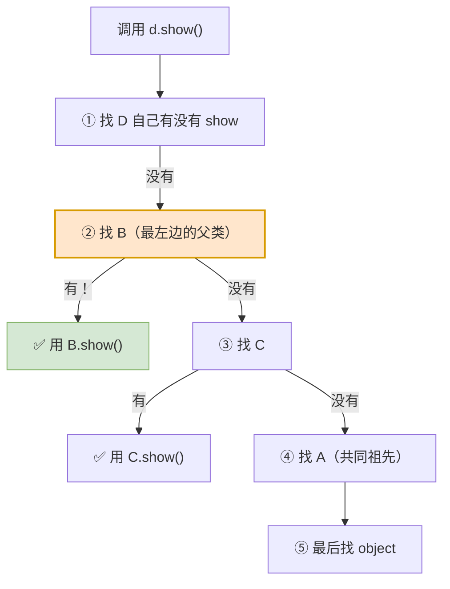

> 💡 **查看 MRO**：用 `类名.__mro__` 或 `类名.mro()` 可以打印出完整的查找顺序。
>
> ```
> D.__mro__ = (D, B, C, A, object)
> ```
>
> 意思就是：先找 D，再找 B，再找 C，再找 A，最后找 object。

---

### 11.1.3 多态

#### 概念定义

> **多态**：**同一个方法调用，作用在不同的对象上，可以产生不同的行为。**

> **大白话比喻**：多态就像**"充电"这个指令**。
>
> 你对手机说"充电"，它插 USB-C；对 iPhone 说"充电"，它用 Lightning；对电动车说"充电"，它接充电桩。
>
> **同一个指令（方法名），不同的对象有不同的响应方式。**

#### 多态的实现条件

| 条件 | 说明 |
|---|---|
| **① 有继承关系** | 多个类继承自同一个父类 |
| **② 子类重写父类方法** | 每个子类给出自己的实现 |
| **③ 父类引用指向子类对象** | 用统一的接口调用 |

#### 多态实例

```python
class Animal:
    def speak(self):
        pass

class Dog(Animal):
    def speak(self):
        print("汪汪汪！")

class Cat(Animal):
    def speak(self):
        print("喵喵喵！")

class Duck(Animal):
    def speak(self):
        print("嘎嘎嘎！")


# 统一的调用函数 —— 这就是多态的威力
def make_sound(animal):
    animal.speak()      # 同一个调用，不同结果


make_sound(Dog())       # 汪汪汪！
make_sound(Cat())       # 喵喵喵！
make_sound(Duck())      # 嘎嘎嘎！
```

#### 多态执行流程图

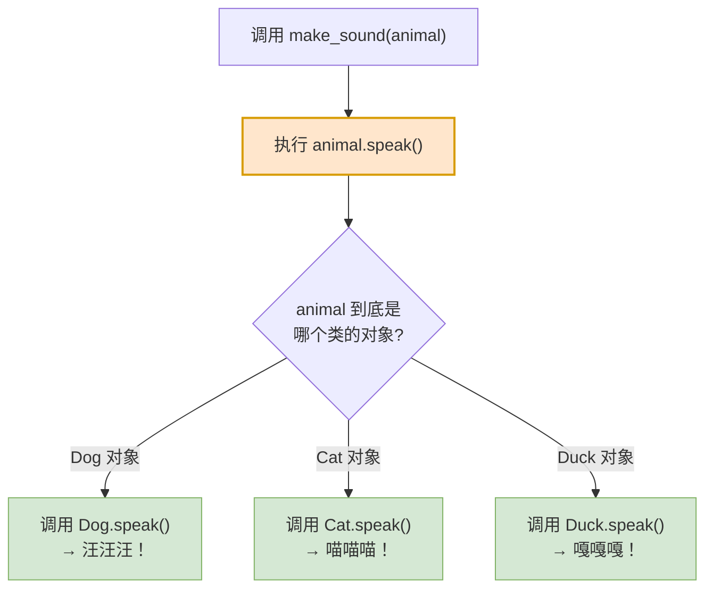

#### 鸭子类型

Python 是**动态类型语言**，所以它还有更宽松的多态形式——**鸭子类型**：

> **"如果它走起来像鸭子，叫起来像鸭子，那它就是鸭子。"**
>
> 意思是：**Python 不关心对象的类型，只关心它有没有这个方法。**

```python
class Robot:
    def speak(self):
        print("滴——滴——我是机器人")

class Alien:
    def speak(self):
        print("¥%……&*（外星语）")

# 这两个类完全没有继承关系
make_sound(Robot())     # ✅ 滴——滴——我是机器人
make_sound(Alien())     # ✅ ¥%……&*（外星语）
```

> 💡 **这就是 Python 多态的强大之处**：不需要强制继承某个父类，**只要有同名方法，就能被统一调用**。

#### 三大特性对比表（★重点）

| 特性 | 一句话定义 | 解决的问题 | 白话比喻 | 关键词 |
|---|---|---|---|---|
| **封装** | 隐藏内部细节，只暴露必要接口 | **保护数据安全** | 开车只给你方向盘 | **私有属性/方法** |
| **继承** | 子类自动获得父类的属性和方法 | **代码复用** | 父子传承 | **`class 子(父)`** |
| **多态** | 同一调用，不同对象不同行为 | **灵活扩展** | 同一个"充电"指令 | **重写 + 统一接口** |

**三者的关系**：

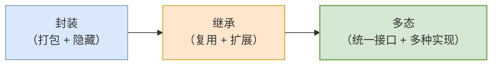

> **一句话串起来**：**封装**是把东西装进盒子，**继承**是把盒子传给下一代并加上新格子，**多态**是面对不同的盒子都能用同一个开箱方式。

---

## 11.2 Web 初识

### 11.2.1 概念定义

> **Web**（World Wide Web，万维网）是**运行在互联网上的、由无数网页和网站构成的信息系统**。
>
> **Web 开发**就是**开发网页和网站**的过程。

### 11.2.2 Web 应用的工作流程

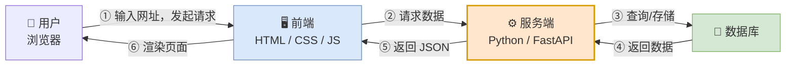

### 11.2.3 前后端分工对比表

| 部分 | 技术 | 职责 | 类比 |
|---|---|---|---|
| **前端** | **HTML** | 网页的**结构** | 房子的**框架** |
| | **CSS** | 网页的**样式** | 房子的**装修** |
| | **JS** | 网页的**行为** | 房子的**电器**（会动） |
| **后端** | Python / FastAPI | 处理业务逻辑、数据存取 | 房子的**水电燃气系统**（看不见但必须有） |
| **数据库** | MySQL / JSON | 持久化存储数据 | 房子的**仓库** |

> **注意**：在本课程的"AI 汉字谜盒"项目中，前端页面已经由 **Streamlit** 负责生成，**我们只写后端**。

---

## 11.3 FastAPI 入门

### 11.3.1 概念定义

> **FastAPI** 是一个**基于 Python 的现代、快速（高性能）的 Web 框架**，用于**构建 API 接口服务**。

- **官网**：`https://fastapi.tiangolo.com/`
- **安装**：`pip install fastapi uvicorn`

#### 什么是 API

> **API**（**A**pplication **P**rogramming **I**nterface，**应用程序编程接口**）：是**软件间的标准化的"桥梁"**，允许开发者无需知晓内部细节即可调用外部功能或数据。

> **大白话比喻**：API 就像**餐厅的窗口**。
>
> 你（前端）在窗口点单（发请求），厨房（后端）做好菜递出来（返回响应）。你不需要进厨房，也不需要知道菜怎么做。

### 11.3.2 FastAPI 四步上手流程图

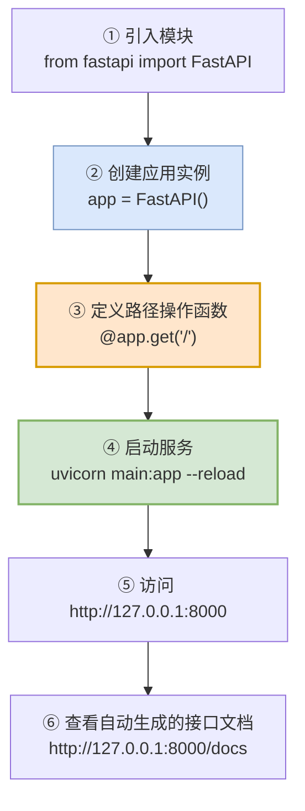

### 11.3.3 入门程序

```python
from fastapi import FastAPI

app = FastAPI()

@app.get("/")
def read_root():
    return {"message": "Hello World"}

@app.get("/users/{user_id}")
def get_user(user_id: int):
    return {"user_id": user_id, "name": "张三"}
```

**启动方式**：

```bash
uvicorn main:app --reload
```

| 部分 | 含义 |
|---|---|
| `main` | 文件名（`main.py`） |
| `app` | FastAPI 实例名 |
| `--reload` | **代码修改后自动重启**（开发时必备） |

### 11.3.4 什么是 uvicorn

> **Uvicorn** 是一个 **ASGI 服务器**，用来**运行 FastAPI 应用**。

| 概念 | 说明 |
|---|---|
| **ASGI** | Asynchronous Server Gateway Interface，异步服务器网关接口 |
| **Uvicorn 的作用** | 监听端口、接收 HTTP 请求、交给 FastAPI 处理、返回响应 |

> **大白话**：**FastAPI 是"做菜的厨师"，Uvicorn 是"餐厅的前台"**——前台负责接待客人（接收请求），把订单交给厨师（FastAPI），再把菜端出去。

### 11.3.5 路由与路径操作函数

```python
@app.get("/users")           # ← 装饰器：把这个函数绑定到 GET /users
def list_users():
    ...
```

| 部分 | 含义 |
|---|---|
| `@app` | FastAPI 应用实例 |
| `.get(...)` | **HTTP 请求方法**（GET / POST / PUT / DELETE） |
| `"/users"` | **路径**（URL 中资源的位置） |
| `def list_users():` | **路径操作函数**（收到请求时执行） |

> 💡 **装饰器是什么？** 装饰器是 Python 的一个语法特性，作用是在**不修改函数本身代码**的前提下，给函数**附加额外功能**。（`@app.get("/")` 的作用就是告诉 FastAPI："当有人访问 `/` 时，执行下面这个函数"。）

### 11.3.6 Python Web 框架对比表

| 框架 | 特点 | 性能 | 学习曲线 | 适用场景 |
|---|---|---|---|---|
| **FastAPI** | 现代、异步、**自动生成 API 文档** | ⭐⭐⭐⭐⭐ **最高** | 中等 | **API 服务、AI 应用后端（本课程）** |
| **Flask** | 轻量、灵活、生态成熟 | ⭐⭐⭐ | 低 | 小型项目、快速原型 |
| **Django** | 全栈、自带 ORM/Admin/认证 | ⭐⭐⭐ | 高 | 大型完整网站、内容管理系统 |

> 💡 **FastAPI 的杀手级特性**：**自动生成交互式 API 文档**（访问 `/docs`），可以直接在网页上测试接口，不用写测试代码。

---

## 11.4 RESTful 开发规范

### 11.4.1 概念定义

> **Restful** 指的是**遵循 REST 架构风格的 API 接口服务**，而 **REST**（**RE**presentational **S**tate **T**ransfer，**表述性状态转换**），它是一种**软件架构风格**。

### 11.4.2 核心思想

> **URL 定位资源，HTTP 动词描述操作。**

| 要素 | 说明 |
|---|---|
| **URL** | 只表示**资源**（名词），不表示动作（动词） |
| **HTTP 方法** | 表示**对资源做什么操作** |

### 11.4.3 传统风格 vs REST 风格对比表（★重点）

| 传统风格 URL | 请求方式 | 含义 | 问题 |
|---|---|---|---|
| `http://localhost:8000/user/getById?id=1` | GET | 查询 id 为 1 的用户 | ❌ **不规范、难维护** |
| `http://localhost:8000/user/saveUser` | POST | 新增用户 | URL 里带动词 |
| `http://localhost:8000/user/updateUser` | POST | 修改用户 | 全用 POST，语义不清 |
| `http://localhost:8000/user/deleteUser?id=1` | GET | 删除 id 为 1 的用户 | **用 GET 做删除，危险！** |

| REST 风格 URL | 请求方式 | 含义 |
|---|---|---|
| `http://localhost:8000/users/1` | **GET** | 查询 id 为 1 的用户 |
| `http://localhost:8000/users` | **POST** | 新增用户 |
| `http://localhost:8000/users` | **PUT** | 修改用户 |
| `http://localhost:8000/users/1` | **DELETE** | 删除 id 为 1 的用户 |

**对比结论**：

| 对比项 | 传统风格 | REST 风格 |
|---|---|---|
| **URL 形式** | `/user/getById?id=1`（**含动词**） | `/users/1`（**只有名词**） |
| **操作表示** | 靠 URL 里的动词 | 靠 **HTTP 方法** |
| **URL 数量** | 每个操作一个 URL | **一个资源一个 URL** |
| **规范性** | 差 | **简洁、规范、优雅** |
| **可维护性** | 差 | **好** |

### 11.4.4 四种 HTTP 动词对照表

| 动词 | 含义 | 对应 CRUD | 是否幂等 |
|---|---|---|:---:|
| **GET** | **查询** | Read（读） | ✅ 幂等 |
| **POST** | **新增** | Create（增） | ❌ 不幂等 |
| **PUT** | **修改**（全量更新） | Update（改） | ✅ 幂等 |
| **DELETE** | **删除** | Delete（删） | ✅ 幂等 |

> 💡 **什么是"幂等"？** 同一个请求执行**一次**和执行**多次**，结果**一样**。
>
> - `GET /users/1` 查 10 次，结果都是同一份数据 → **幂等**
> - `POST /users` 提交 10 次，会**创建 10 个用户** → **不幂等**
>
> **所以删除用 GET 是危险的**：浏览器预加载、爬虫抓取都可能"误触发"删除。

### 11.4.5 RESTful 风格设计流程图

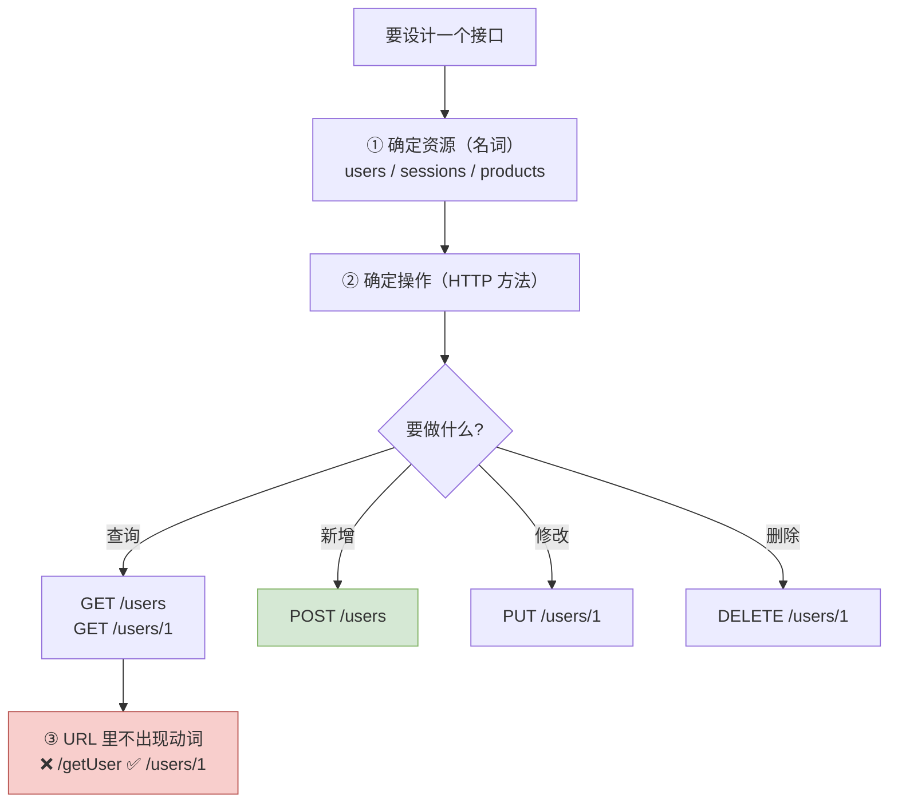

---

## 11.5 项目实战：AI 汉字谜盒

### 11.5.1 项目需求

> **需求**：基于 **FastAPI + Streamlit + DeepSeek + Sessions 持久化存储**，开发一个 **AI 汉字谜盒** Web 应用。
>
> **核心玩法**：用户根据会话 ID 与 AI 进行"AI 汉字谜盒"（猜字谜）互动。

**功能列表**：

| 功能 | 说明 |
|---|---|
| 新建会话 | 创建一个新的猜字谜会话 |
| 会话列表 | 展示所有历史会话 |
| 加载会话 | 点击历史会话，恢复对话内容 |
| 删除会话 | 删除指定的历史会话 |
| 与 AI 交互 | 用户出题/猜谜，AI 回应 |

### 11.5.2 整体架构图

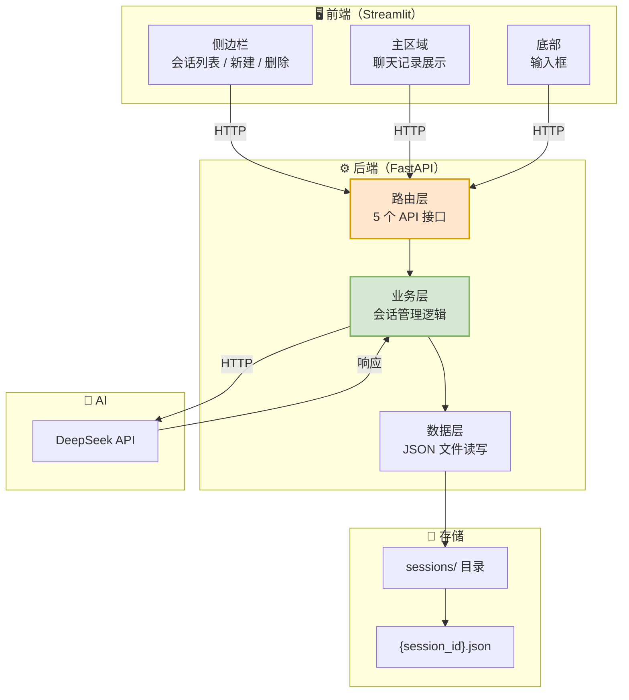

### 11.5.3 基础环境搭建流程图

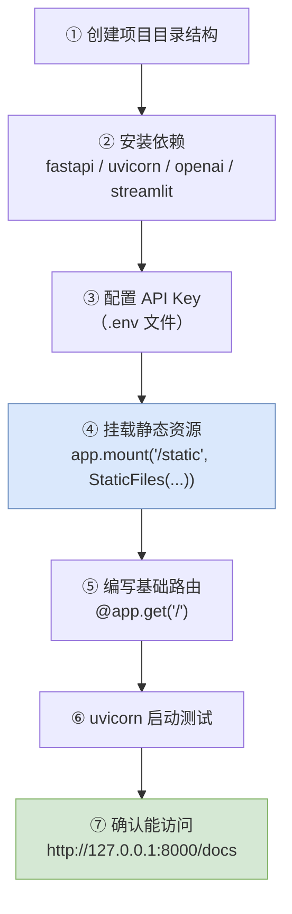

**静态资源挂载代码**：

```python
from fastapi import FastAPI
from fastapi.staticfiles import StaticFiles

app = FastAPI()

# 把 static 目录挂载到 /static 路径下
app.mount("/static", StaticFiles(directory="static"), name="static")
```

| 参数 | 含义 |
|---|---|
| `"/static"` | **URL 前缀** |
| `StaticFiles(directory="static")` | **本地目录** |
| `name="static"` | 挂载名称（FastAPI 内部使用） |

> **作用**：让前端页面可以直接通过 URL 访问本地的图片、CSS、JS 等静态文件。

### 11.5.4 ★核心功能：与 AI 交互的完整流程图

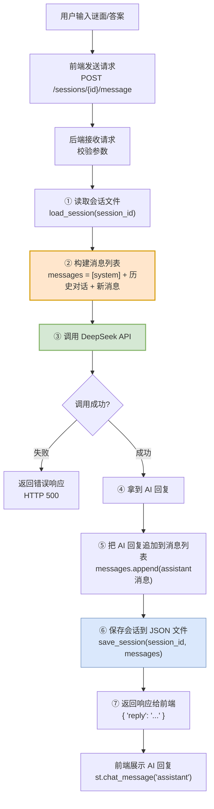

**关键点说明**：

| 步骤 | 为什么重要 |
|---|---|
| **① 读取会话文件** | 实现**会话记忆**（把历史对话读回来） |
| **② 构建消息列表** | 遵循 `system + 历史 + 新问题` 的格式（见第 08 篇 8.8 节） |
| **⑤ 追加 AI 回复** | 让下一轮对话能"记得"AI 说过什么 |
| **⑥ 保存会话** | 实现**持久化**（关掉程序数据还在） |

### 11.5.5 会话管理流程图

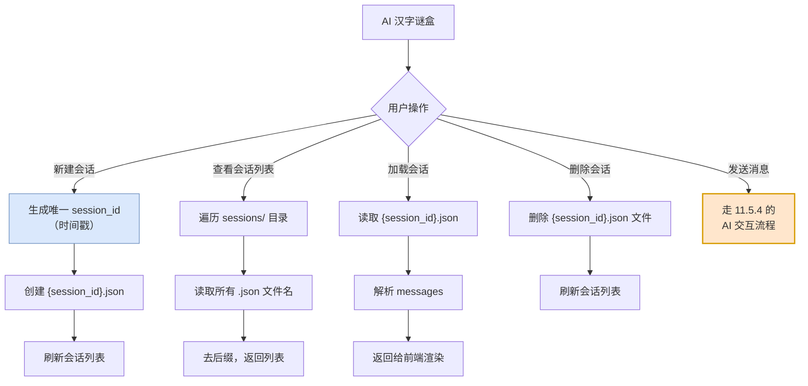

### 11.5.6 五个 API 接口一览表（★重点）

| 序号 | 请求方式 | 路径 | 作用 | 请求参数 | 响应 |
|:---:|---|---|---|---|---|
| 1 | **GET** | `/sessions` | 获取会话列表 | 无 | `{"sessions": ["id1", "id2"]}` |
| 2 | **POST** | `/sessions` | 新建会话 | 无 | `{"session_id": "xxx"}` |
| 3 | **GET** | `/sessions/{id}` | 获取指定会话详情 | 路径参数 `id` | `{"messages": [...]}` |
| 4 | **POST** | `/sessions/{id}/message` | 发送消息，与 AI 交互 | 路径参数 `id` + 请求体 `{"message": "..."}` | `{"reply": "..."}` |
| 5 | **DELETE** | `/sessions/{id}` | 删除指定会话 | 路径参数 `id` | `{"success": true}` |

> 💡 **注意这套接口完美体现了 RESTful 规范**：
> - **URL 全是名词** `/sessions`
> - **操作靠 HTTP 方法**（GET 查、POST 增、DELETE 删）
> - **用路径参数定位资源** `/sessions/{id}`

### 11.5.7 Pydantic 数据模型

**概念定义**：

> **Pydantic** 是一个**基于 Python 类型注解的数据验证和序列化库**，用于**定义数据模型**。

```python
from pydantic import BaseModel

class MessageRequest(BaseModel):
    message: str

class SessionResponse(BaseModel):
    session_id: str
```

**作用**：

| 作用 | 说明 |
|---|---|
| **数据验证** | 自动检查请求体格式，格式不对直接返回 422 错误 |
| **类型转换** | 自动把 JSON 转成 Python 对象 |
| **API 文档** | FastAPI 用它自动生成接口文档的参数说明 |

> **大白话**：Pydantic 就像**机场安检**——你提交的数据（行李）必须先过一遍检查，格式不对直接拦下，不会让脏数据流到业务代码里。

### 11.5.8 程序优化：日志

#### 概念定义

> **日志（Log）**：用于**记录程序运行过程中的信息**，便于**排查问题、监控运行状态**。

**为什么需要日志？**

| 问题 | 日志的作用 |
|---|---|
| 程序出错了，不知道哪一步 | 日志记录每一步的执行情况 |
| 线上出问题，无法调试 | 日志是**唯一的"案发现场"证据** |
| 想知道程序性能 | 日志记录耗时 |

#### 日志配置代码

```python
import logging

logging.basicConfig(
    level=logging.INFO,
    format='%(asctime)s - %(levelname)s - %(message)s',
    handlers=[
        logging.FileHandler('app.log', encoding='utf-8'),
        logging.StreamHandler()
    ]
)

logging.info("程序启动")
logging.warning("这是一个警告")
logging.error("出错了！")
```

#### 日志级别表（★重点）

| 级别 | 数值 | 含义 | 使用场景 |
|---|:---:|---|---|
| **DEBUG** | 10 | **调试信息** | 开发阶段，打印变量值 |
| **INFO** | 20 | **正常信息** | 程序启动、请求处理完成 |
| **WARNING** | 30 | **警告** | 有隐患但还能跑 |
| **ERROR** | 40 | **错误** | 出错了，功能受影响 |
| **CRITICAL** | 50 | **严重错误** | 程序可能崩溃 |

> 💡 **`level=logging.INFO`** 的含义：**只记录 INFO 及以上级别的日志**（DEBUG 会被忽略）。
>
> 生产环境通常设 `WARNING` 或 `ERROR`（日志太多会占满磁盘），开发环境设 `DEBUG`。

#### 日志三大组件

| 组件 | 作用 |
|---|---|
| **Logger** | 记录日志的入口 |
| **Handler** | 决定日志**输出到哪里**（文件 / 控制台） |
| **Formatter** | 决定日志的**格式** |

### 11.5.9 程序优化：统一异常处理

#### 为什么需要统一异常处理

**问题**：如果每个接口都写 `try...except`，代码会很啰嗦，而且**返回的错误格式不统一**，前端处理起来很麻烦。

**解决**：用 FastAPI 的**全局异常处理器**，**一处定义，全局生效**。

```python
from fastapi import FastAPI, Request
from fastapi.responses import JSONResponse

app = FastAPI()

@app.exception_handler(Exception)
async def global_exception_handler(request: Request, exc: Exception):
    logging.error(f"请求 {request.url} 出错: {exc}")
    return JSONResponse(
        status_code=500,
        content={"code": 500, "message": "服务器内部错误，请稍后重试"}
    )
```

#### 统一异常处理流程图

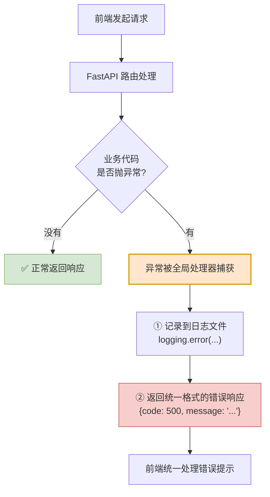

**好处**：

| 好处 | 说明 |
|---|---|
| **代码简洁** | 不用在每个接口写 `try...except` |
| **格式统一** | 前端只需处理一种错误格式 |
| **信息完整** | 日志里记录了详细错误，方便排查 |
| **安全** | 对外只返回友好提示，不暴露内部细节 |

### 11.5.10 项目整体流程图（★总结）

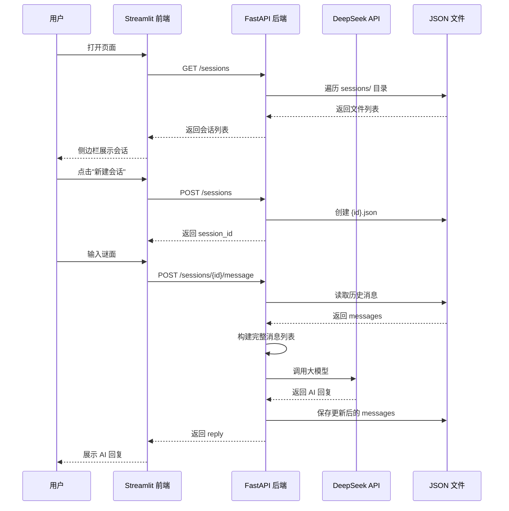

---

## 11.6 本篇小结

### 11.6.1 知识全景图

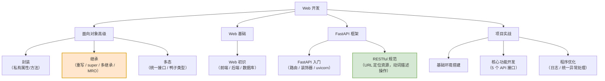

### 11.6.2 核心概念速查表

| 概念 | 一句话定义 | 白话比喻 |
|---|---|---|
| **封装** | 隐藏内部细节，暴露必要接口 | 开车只给你方向盘 |
| **继承** | 子类自动获得父类的属性和方法 | 父子传承 |
| **重写** | 子类重新定义父类的方法 | 儿子把爸爸的手艺改良了 |
| **`super()`** | 调用父类的方法 | "爸，你先来" |
| **MRO** | 多继承时的方法查找顺序 | 家族继承顺位表 |
| **多态** | 同一调用，不同对象不同行为 | 同一个"充电"指令 |
| **鸭子类型** | 只看有没有方法，不看类型 | 像鸭子就是鸭子 |
| **API** | 软件间标准化的桥梁 | 餐厅窗口 |
| **FastAPI** | 现代高性能 Python Web 框架 | 做菜的厨师 |
| **uvicorn** | 运行 FastAPI 的 ASGI 服务器 | 餐厅前台 |
| **RESTful** | URL 定位资源，动词描述操作 | 给资源发"指令" |
| **Pydantic** | 数据验证模型 | 机场安检 |
| **日志** | 记录程序运行信息 | 行车记录仪 |

### 11.6.3 三大特性对比表（★面试必考）

| 特性 | 关键词 | 解决的问题 | Python 实现 |
|---|---|---|---|
| **封装** | 私有、隐藏、接口 | **数据安全** | `__name` 双下划线 |
| **继承** | 复用、扩展、重写 | **代码复用** | `class 子(父)` + `super()` |
| **多态** | 统一接口、多种实现 | **灵活扩展** | 重写 + 统一调用 |

### 11.6.4 易错点清单

| 易错点 | 现象 | 解决 |
|---|---|---|
| 以为 `__name` 是绝对私有 | 仍可通过 `_类名__name` 访问 | Python 是**约定**不是强制 |
| 子类 `__init__` 忘记 `super()` | 父类属性没初始化 | 调用 `super().__init__(...)` |
| 多继承顺序搞不清 | 方法调用结果不符预期 | 用 `类名.__mro__` 查看顺序 |
| URL 里写动词 | 不符合 REST 规范 | `/users/1` 而不是 `/getUser?id=1` |
| 用 GET 做删除 | 危险，可能被误触发 | 用 **DELETE** |
| `uvicorn` 忘加 `--reload` | 改代码要手动重启 | 开发时加上 |
| 装饰器路径写错 | 404 | 检查 `@app.get("/xxx")` 的路径 |
| 会话 ID 重复 | 会话互相覆盖 | 用带微秒的**时间戳**做唯一 ID |
| 忘记关闭文件 | 资源泄漏 | 用 `with open()` |
| 日志级别设太低 | 日志文件爆炸 | 生产环境设 `WARNING` 以上 |
| 异常处理直接返回原始错误 | 泄露内部信息、不安全 | 返回友好提示，详情写日志 |

### 11.6.5 动手练习

> **练习 1**：定义一个 `BankAccount` 类，用私有属性保护余额，提供 `deposit` / `withdraw` / `get_balance` 三个公开接口。
>
> **练习 2**：定义一个 `Shape` 父类，派生出 `Circle`、`Rectangle`、`Triangle` 三个子类，各自重写 `area()` 方法，用同一个函数调用它们（多态）。
>
> **练习 3**：设计一套符合 RESTful 规范的"图书管理"接口（增删改查），列出 URL 和 HTTP 方法。
>
> **练习 4**：用 FastAPI 写一个最简单的接口，启动后用 `/docs` 页面测试它。

> **下一步** → 打开 `12-课程完结-学习路线.md`，回顾全课程并规划下一步。
