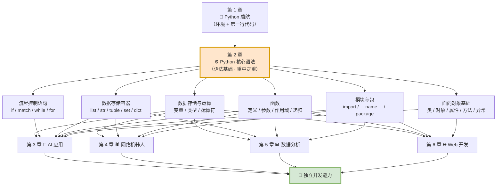
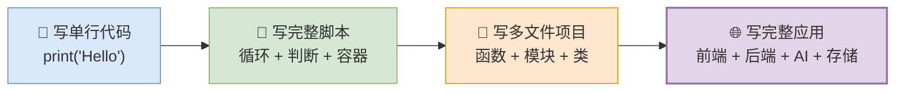
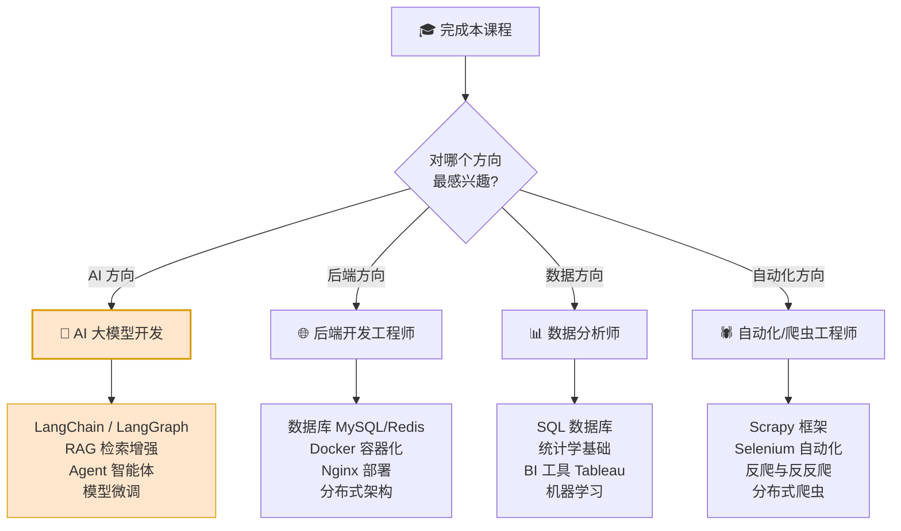
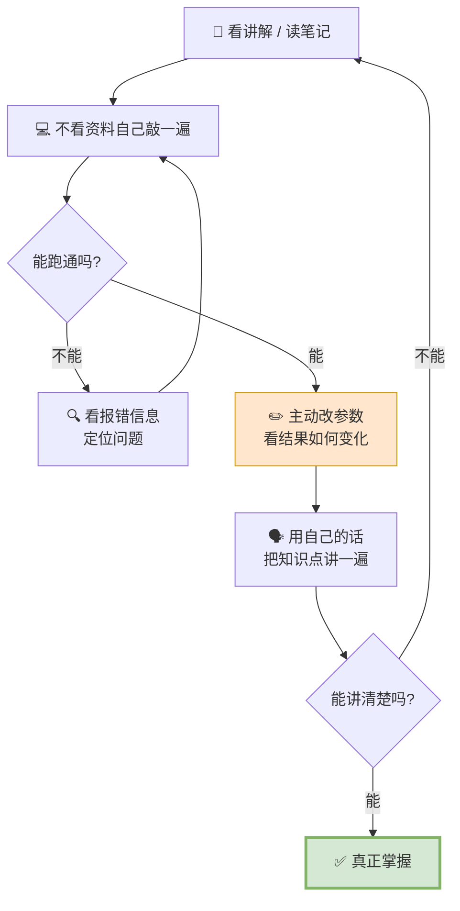
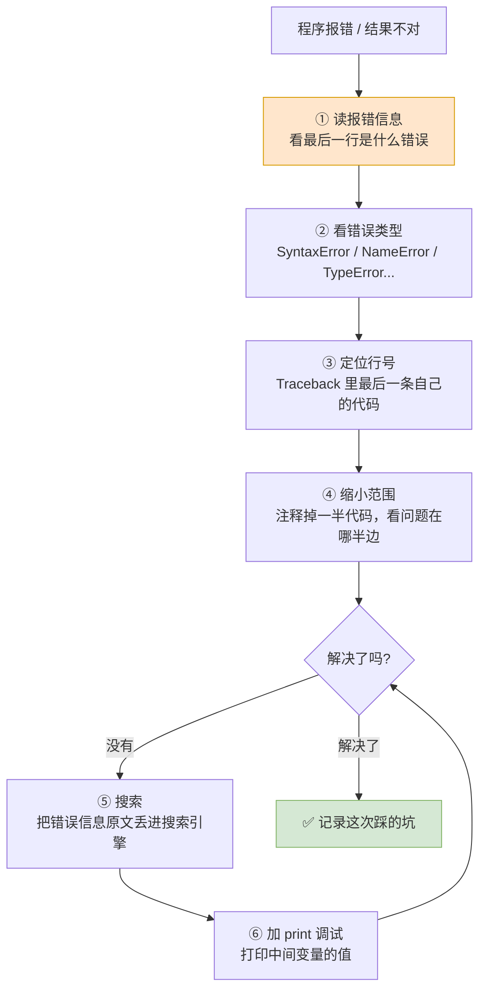

# 第12篇 · 课程完结 —— 全课程知识地图与学习路线

> **本篇定位**：这是最后一篇，也是一份**复习地图 + 行动指南**。
>
> 课程会结束，但知识的复利才刚刚开始。这一篇帮你把 11 篇笔记串成一张网，并告诉你接下来往哪走。

---

## 12.1 全课程知识地图

### 12.1.1 六大模块全景表

| 模块 | 文档 | 核心内容 | 学完的产出 |
|:---:|---|---|---|
| **1** | `00` `01` | Python 初识、解释器、开发工具、入门程序 | 装好环境，跑通第一行代码 |
| **2** | `02`~`07` | 数据存储与运算、流程控制、数据容器、函数、模块、面向对象 | 能写完整的控制台程序 |
| **3** | `08` | AI 大模型基础、HTTP 协议、接入 DeepSeek、Prompt 工程 | **AI 智能伴侣** |
| **4** | `09` | 爬虫入门与合规、HTML 结构、Xpath、正则表达式 | **TMDB 电影 Top100 爬取** |
| **5** | `10` | Jupyter、Pandas、Matplotlib | **电影数据分析 + 销售分析** |
| **6** | `11` | 面向对象高级、FastAPI、RESTful | **AI 汉字谜盒** |

### 12.1.2 学习路线总图



**流程说明**：

1. **第 2 章是唯一的必经之路**——四条实战路线全部依赖它。
2. **第 3~6 章彼此独立**，可以按兴趣调整顺序。
3. 全部汇聚到同一个终点：**独立用 Python 解决问题的能力**。

### 12.1.3 知识点分布速查表

| 文档 | 核心知识点 | 关键表格 | 关键流程图 |
|---|---|---|---|
| `00` 课程导学 | 全景地图、学习方法 | 六大模块对比表 | 学习路线图 |
| `01` Python 启航 | 编程语言、解释器、Path、IDE | 记事本/VSCode/PyCharm 对比 | Path 查找流程、安装流程 |
| `02` 数据存储与运算 | 字面量、变量、类型、字符串、运算符 | **运算符速查总表** | 变量赋值、input 转换、短路求值 |
| `03` 流程控制语句 | if、match-case、while、for、range、嵌套、break/continue | **while vs for 对比表** | if 系列、循环、嵌套循环、break/continue |
| `04` 数据存储容器 | list/str/tuple/set/dict | **五大容器终极对比总表** ★ | 容器选择决策树、解包流程 |
| `05` 函数 | 参数、返回值、作用域、不定长参数、递归、类型注解 | **参数类型速查表** | 调用栈 LIFO、递归、不定长参数收集 |
| `06` 模块 | import、`__name__`、`__all__`、package | **五种导入方式对照表** | 导入执行流程、`__name__` 判定 |
| `07` 面向对象基础 | 类、对象、self、魔法方法、属性、异常 | **实例属性 vs 类属性**、魔法方法表 | 类与对象关系、属性查找、异常传递 |
| `08` AI 应用 | 大模型、部署、IP/域名/端口、HTTP、JSON、会话记忆、Prompt、Streamlit、文件 | **部署三方案**、**GET vs POST**、**JSON vs 字典** | API 调用链、DNS 解析、会话记忆 |
| `09` 爬虫 | robots、requests、HTML、Xpath、CSV、正则 | **Xpath 语法表**、**正则语法表①②** | 爬虫核心流程、正则匹配流程 |
| `10` 数据分析 | Pandas、Matplotlib | **iloc vs loc**、**三种图表对比** | 数据清洗、分组（拆分-应用-合并）、全流程 |
| `11` Web 开发 | 封装/继承/多态、FastAPI、RESTful | **三大特性对比表**、**传统 vs REST** | MRO、多态、AI 交互完整链路 |
| `12` 课程完结 | 知识地图、下一步 | 全景表 | 学习路线图 |

---

## 12.2 必备"肌肉记忆"清单

学完这门课，下面这些**应该做到不看资料就能写出来**。这是自测清单：

### 12.2.1 基础语法（必须脱口而出）

| 检查项 | 能否做到 |
|---|:---:|
| 定义变量、变量命名规则 | ☐ |
| 用 f-string 格式化字符串 | ☐ |
| `input()` 接收输入并做类型转换 | ☐ |
| 四类运算符（算术/赋值/比较/逻辑） | ☐ |
| `if...elif...else` 多分支 | ☐ |
| `match...case` 固定值匹配 | ☐ |
| `while` 循环和 `for` 循环 | ☐ |
| `range()` 三种用法 | ☐ |
| 嵌套循环 | ☐ |
| `break` 和 `continue` | ☐ |

### 12.2.2 数据结构（必须熟练）

| 检查项 | 能否做到 |
|---|:---:|
| 列表的增删改查、切片、常用方法 | ☐ |
| 列表推导式 | ☐ |
| 字符串的索引/切片/常用方法 | ☐ |
| 元组的组包与解包 | ☐ |
| 集合的交并差 | ☐ |
| 字典的增删改查和三种遍历 | ☐ |
| 说清五大容器的区别（有序/重复/可变） | ☐ |

### 12.2.3 函数与模块

| 检查项 | 能否做到 |
|---|:---:|
| 定义函数、写 Docstring | ☐ |
| 形参实参、位置参数、关键字参数 | ☐ |
| 默认参数、`*args`、`**kwargs` | ☐ |
| 说清全局变量和局部变量 | ☐ |
| 用 `lambda` 写匿名函数 | ☐ |
| 写递归函数（含终止条件） | ☐ |
| 导入模块的 5 种方式 | ☐ |
| 说清 `__name__ == "__main__"` 的作用 | ☐ |

### 12.2.4 进阶能力

| 检查项 | 能否做到 |
|---|:---:|
| 定义类、写 `__init__`、理解 `self` | ☐ |
| 定义 `__str__`、`__eq__` 等魔法方法 | ☐ |
| 用 `try...except...finally` 处理异常 | ☐ |
| 说清封装、继承、多态三大特性 | ☐ |
| 用 `super()` 调用父类方法 | ☐ |
| 调用 DeepSeek API | ☐ |
| 说清"会话记忆"的原理和实现 | ☐ |
| 用 requests + Xpath 抓取网页数据 | ☐ |
| 用 Pandas 做分组、清洗、排序 | ☐ |
| 用 Matplotlib 画折线图/柱状图/饼状图 | ☐ |
| 用 FastAPI 写一个 RESTful 接口 | ☐ |

---

## 12.3 四个项目的完整技术栈回顾

### 12.3.1 项目技术栈对照表

| 项目 | 用到的知识 | 出自哪几篇 |
|---|---|---|
| **AI 智能伴侣** | HTTP 协议、JSON、API 调用、会话记忆、Prompt 工程、Streamlit、文件操作 | `08` |
| **TMDB 电影 Top100** | robots 协议、requests、HTML、Xpath、正则表达式、CSV | `09` |
| **电影/销售数据分析** | Jupyter、Pandas（读取/清洗/分组/排序）、Matplotlib | `10` |
| **AI 汉字谜盒** | 面向对象高级、FastAPI、RESTful、Pydantic、日志、异常处理、文件、JSON、AI 调用 | `11`（+ `07` `08`） |

### 12.3.2 能力成长曲线



---

## 12.4 下一步学什么

### 12.4.1 四个进阶方向



### 12.4.2 各方向的具体学习清单

| 方向 | 下一步学什么 | 为什么 |
|---|---|---|
| **AI 应用开发** | LangChain、RAG、Agent、向量数据库 | 从"调 API"到"做智能体应用" |
| **后端开发** | MySQL、Redis、Docker、Linux、Nginx | 项目要做大，必须有数据库和部署能力 |
| **数据分析** | SQL、统计学、Tableau、机器学习入门 | 从"会画图"到"会建模预测" |
| **爬虫/自动化** | Scrapy、Selenium、反爬对抗 | 从"抓单页"到"抓全站、抓动态页" |
| **通用基本功** | Git 版本控制、Linux 命令、数据结构与算法 | **任何方向都必需** |

### 12.4.3 通用基本功优先推荐

> **王炸组合**：**Git + Linux + SQL**。
>
> 这三样是**任何方向都要用**的：
> - **Git** —— 代码版本管理，团队协作必备
> - **Linux** —— 服务器几乎都是 Linux，部署绕不开
> - **SQL** —— 数据存在数据库里，取数据必须会 SQL

---

## 12.5 学习方法复盘

### 12.5.1 四条铁律回顾

| 铁律 | 做法 | 为什么 |
|---|---|---|
| **1. 夯实基础，手敲代码** | 模块 1-2 全程不使用 AI 生成代码 | 建立肌肉记忆和排错直觉 |
| **2. 基于 AI 辅助提高效率** | 模块 3-6 主动使用 AI 工具 | 学会"指挥 AI"，而不是被替代 |
| **3. 不要只看视频** | 看完一节立刻自己敲一遍 | 看懂 ≠ 会写 |
| **4. 多敲、多练** | 每个案例至少独立实现一次 | 知识只有用过才是你的 |

### 12.5.2 学习闭环流程图



**流程说明**：

1. **看**是输入，**敲**才是真正的学习。
2. **改参数**这一步最容易被跳过，但它才是"从懂到通"的关键——你能预测改动结果，才算真懂了。
3. **讲出来**是终极检验：讲不清楚，就是没懂。

### 12.5.3 遇到问题怎么办（排查四步法）



**常见错误速查**：

| 报错 | 大概率原因 |
|---|---|
| `SyntaxError: invalid character` | 用了中文符号 |
| `IndentationError` | 缩进不对 |
| `NameError: name 'x' is not defined` | 变量没定义 / 拼错了 |
| `TypeError: can only concatenate str` | 字符串和数字相加 |
| `IndexError: list index out of range` | 索引越界 |
| `KeyError` | 字典里没这个 key |
| `AttributeError` | 对象没这个属性/方法 |
| `ModuleNotFoundError` | 没装这个库 |
| `ValueError: invalid literal for int()` | 转换的数据不是数字 |

---

## 12.6 结语

### 12.6.1 回顾这段旅程

从 `第 1 章 · Python 启航` 到 `第 12 章 · 课程完结`，你走过了这样一条路：

| 起点 | 终点 |
|---|---|
| 不知道什么是"编程语言" | 能用 Python 写出完整的网站应用 |
| 看到报错就懵 | 能读 Traceback、定位问题 |
| 只会照抄代码 | 能独立设计类和模块结构 |
| 觉得 AI 是黑盒 | 能调用大模型、设计提示词、实现会话记忆 |
| 见到网页只能手动复制 | 能写爬虫自动采集数据 |
| 看到数据只能干瞪眼 | 能用 Pandas 分析、用 Matplotlib 可视化 |

### 12.6.2 三句话送给继续前进的你

> **第一句：所有的课程都有终章，但知识的故事永远在续写。**
>
> 这门课结束了，但 Python 的世界才刚刚向你打开。接下来你遇到的每一个新库、每一个新框架，用的都是这一路打下的地基。

> **第二句：能跑通不是目的，能改才是本事。**
>
> 照着教程敲一遍代码，谁都会。真正拉开差距的，是你能不能在没有教程的情况下，从空白文件开始写出自己想要的东西。

> **第三句：AI 时代，会提问比会背诵更值钱。**
>
> 大模型能记住所有语法，但它不知道你的业务、你的需求、你的判断。**会用 AI 解决问题的人，永远比只会背答案的人更有价值。**

### 12.6.3 感恩同行

```
感恩同行，后会有期。
```

---

## 12.7 全系列文档索引

| 编号 | 文档 | 对应 PPT |
|:---:|---|---|
| 00 | [课程导学](./00-课程导学.md) | `课程导学.pptx` |
| 01 | [第1章 · Python 启航](./01-第1章-Python启航.md) | `第1章 - Python启航.pptx` |
| 02 | [第2章01节 · 数据存储与运算](./02-第2章01节-数据存储与运算.md) | `第2章01节 - Python核心语法-数据存储与运算.pptx` |
| 03 | [第2章02节 · 流程控制语句](./03-第2章02节-流程控制语句.md) | `第2章02节 - Python核心语法-流程控制语句.pptx` |
| 04 | [第2章03节 · 数据存储容器](./04-第2章03节-数据存储容器.md) | `第2章03节 - Python核心语法-数据存储容器.pptx` |
| 05 | [第2章04节 · 函数](./05-第2章04节-函数.md) | `第2章04节 - Python核心语法-函数.pptx` |
| 06 | [第2章05节 · 模块](./06-第2章05节-模块.md) | `第2章05节 - Python核心语法-模块.pptx` |
| 07 | [第2章06节 · 面向对象基础](./07-第2章06节-面向对象基础.md) | `第2章06节 - Python核心语法-面向对象基础.pptx` |
| 08 | [第3章 · 项目实战之 AI 应用](./08-第3章-Python项目实战之AI应用.md) | `第3章-Python项目实战之AI应用.pptx` |
| 09 | [第4章 · 项目实战之网络机器人](./09-第4章-Python项目实战之网络机器人.md) | `第4章 - Python项目实战之网络机器人.pptx` |
| 10 | [第5章 · 项目实战之数据分析](./10-第5章-Python项目实战之数据分析.md) | `第5章 - Python项目实战之数据分析.pptx` |
| 11 | [第6章 · 项目实战之 Web 开发](./11-第6章-Python项目实战之Web开发.md) | `第6章 - Python项目实战之Web开发.pptx` |
| 12 | [课程完结 · 学习路线](./12-课程完结-学习路线.md) | `课程完结.pptx` |

> **祝学习顺利，早日成为一名优秀的开发者！** 🎉
