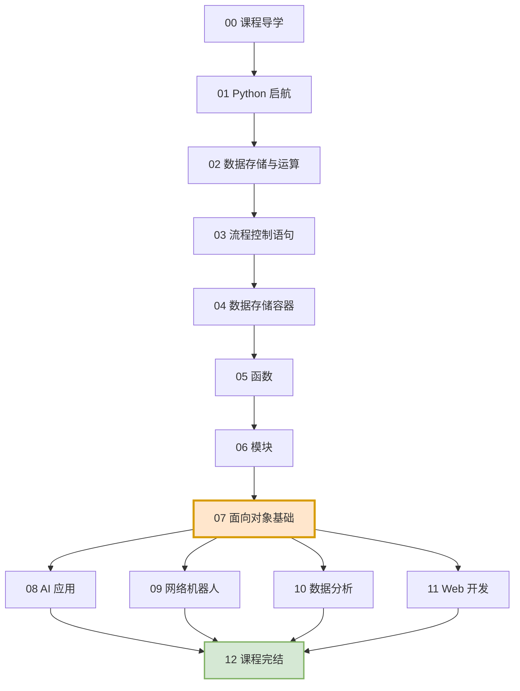

# Python + AI 从入门到大神 · 学习笔记

> 一套面向**零基础小白**的 Python 学习笔记，共 **13 篇**，严格按课程 PPT 顺序编排。
>
> 每篇都遵循统一结构：**先讲"是什么"（概念定义）→ 再讲"为什么"（深入讲解）→ 配对比表格 → 配流程图 → 配大白话和生活化例子**。

---

## 📚 文档目录

### 第 0 篇 · 导读

| 编号 | 文档 | 内容概要 |
|:---:|---|---|
| **00** | [课程导学](./00-课程导学.md) | 全课程全景地图、AI 时代为什么学 Python、四大特色、学习方法四条铁律 |

### 第 1 章 · Python 启航

| 编号 | 文档 | 内容概要 |
|:---:|---|---|
| **01** | [Python 启航](./01-第1章-Python启航.md) | 什么是编程语言、解释器原理、Path 环境变量、IDE、入门程序、PyCharm 项目结构、虚拟环境 |

### 第 2 章 · Python 核心语法（重中之重）

| 编号 | 文档 | 内容概要 |
|:---:|---|---|
| **02** | [数据存储与运算](./02-第2章01节-数据存储与运算.md) | 字面量、变量、标识符命名、五种数据类型、字符串与格式化、输入输出、四大类运算符 |
| **03** | [流程控制语句](./03-第2章02节-流程控制语句.md) | if 三形态、match...case 模式匹配、while / for 循环、range、嵌套循环、break 与 continue |
| **04** | [数据存储容器](./04-第2章03节-数据存储容器.md) | 列表、字符串、元组、集合、字典，以及**五大容器终极对比总表** |
| **05** | [函数](./05-第2章04节-函数.md) | 参数与返回值、作用域、位置/关键字/默认/不定长参数、lambda、递归、类型注解 |
| **06** | [模块](./06-第2章05节-模块.md) | 五种导入方式、自定义模块、`__name__`、`__all__`、软件包与 `__init__.py` |
| **07** | [面向对象基础](./07-第2章06节-面向对象基础.md) | 面向过程 vs 面向对象、类与对象、`self`、魔法方法、实例属性 vs 类属性、异常处理 |

### 第 3~6 章 · 项目实战

| 编号 | 文档 | 内容概要 | 项目成果 |
|:---:|---|---|---|
| **08** | [AI 应用](./08-第3章-Python项目实战之AI应用.md) | AI 大模型、部署方案、IP/域名/端口、HTTP 与 JSON、Apifox、**会话记忆**、Prompt 工程、Streamlit、文件操作 | **AI 智能伴侣** |
| **09** | [网络机器人（爬虫）](./09-第4章-Python项目实战之网络机器人.md) | robots 协议、requests、HTML 结构、**Xpath 语法**、CSV、**正则表达式** | **TMDB 电影 Top100 爬取** |
| **10** | [数据分析](./10-第5章-Python项目实战之数据分析.md) | Jupyter Notebook、Pandas（读取/查看/过滤/清洗/排序/分组）、Matplotlib 可视化 | **电影 & 销售数据分析** |
| **11** | [Web 开发](./11-第6章-Python项目实战之Web开发.md) | 封装 / 继承 / 多态、FastAPI、RESTful 规范、Pydantic、日志、统一异常处理 | **AI 汉字谜盒** |

### 第 7 篇 · 收尾

| 编号 | 文档 | 内容概要 |
|:---:|---|---|
| **12** | [课程完结 · 学习路线](./12-课程完结-学习路线.md) | 全课程知识地图、自测清单、下一步学习方向、排查问题四步法 |

---

## 🗺️ 学习路线图



> ⚠️ **重要提醒**：第 `02`~`07` 篇（Python 核心语法）是**整门课的心脏**，四条实战路线全部依赖它。这一段请务必**手敲代码、不使用 AI 生成**，把地基打牢。

---

## 📖 阅读说明

### 每篇文档的统一结构

```
# 一级大标题：第XX篇 · 章节名
## 二级小标题：知识点
   ├─ 【概念定义】一句话说清它是什么 + 大白话比喻
   ├─ 【深入讲解】为什么这样设计 / 底层原理 / 易踩的坑
   ├─ 【表格】横向对比、纵向对比
   └─ 【流程图】涉及"流程/步骤/执行顺序"的地方
## 最后：本篇小结表 + 易错点清单 + 动手练习
```

### 关于流程图

所有流程图使用 **Mermaid** 语法编写：

- **GitHub / GitLab** —— 自动渲染
- **Typora** —— 自动渲染
- **VS Code** —— 安装 `Markdown Preview Mermaid Support` 插件后渲染
- **其他编辑器** —— 若无法渲染，每张图下方都配有**文字版流程说明**，不影响理解

### 关于表格

每篇都大量使用表格做**横向对比**（同类知识点的差异）和**纵向对比**（一个概念的各个维度），便于速查和复习。

---

## 🔑 全课程最重要的 5 张表

如果时间有限，这 5 张表优先看：

| 排名 | 表格 | 位置 | 为什么重要 |
|:---:|---|---|---|
| 🥇 | **五大容器终极对比总表** | `04` 第 4.7 节 | 决定了你选数据结构的判断力 |
| 🥈 | **运算符速查总表** | `02` 第 2.9.2 节 | 所有代码的基础构件 |
| 🥉 | **while vs for 对比表** | `03` 第 3.4.5 节 | 循环选择的判断依据 |
| 4 | **参数类型速查表** | `05` 第 5.10.2 节 | 函数签名设计的基础 |
| 5 | **封装/继承/多态对比表** | `11` 第 11.6.3 节 | 面试必考、框架底层 |

---

## ✅ 学完之后你应该能做到

- [ ] 独立配置 Python 开发环境，读懂并解决常见报错
- [ ] 熟练使用变量、运算符、流程控制、五大容器编写脚本
- [ ] 用函数和模块组织代码，用类描述业务对象
- [ ] 调用 DeepSeek 等大模型 API，做出带会话记忆的 AI 应用
- [ ] 用 requests + Xpath / 正则表达式抓取网页数据
- [ ] 用 Pandas 清洗分析数据，用 Matplotlib 画图
- [ ] 用 FastAPI 设计符合 RESTful 规范的接口，做出完整 Web 应用

---

## 📂 文件清单

```
python/
├── README.md                                  ← 你正在看的这个文件
├── 00-课程导学.md
├── 01-第1章-Python启航.md
├── 02-第2章01节-数据存储与运算.md
├── 03-第2章02节-流程控制语句.md
├── 04-第2章03节-数据存储容器.md
├── 05-第2章04节-函数.md
├── 06-第2章05节-模块.md
├── 07-第2章06节-面向对象基础.md
├── 08-第3章-Python项目实战之AI应用.md
├── 09-第4章-Python项目实战之网络机器人.md
├── 10-第5章-Python项目实战之数据分析.md
├── 11-第6章-Python项目实战之Web开发.md
└── 12-课程完结-学习路线.md
```

---

> **所有的课程都有终章，但知识的故事永远在续写。**
>
> 祝学习顺利，早日成为一名优秀的开发者！ 🎉
