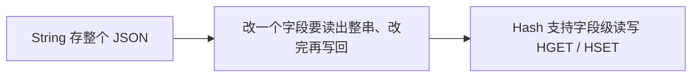

# Redis 快速入门：数据类型与常用命令

这一篇把 Redis 的 value 类型和常用命令过一遍：先给出类型总览，再逐个讲 String、Hash、List、Set、Sorted Set 的数据形态、底层定位和常用命令，最后补充所有类型都能使用的通用命令。命令按 group 分组，可以随时用 `help` 查看用法。

## 2.1 Redis 数据类型总览

Redis 是典型的 key-value 数据库，key 一般是字符串，value 则支持多种数据结构：

| 类型 | 数据形态 | 适合场景 | 常用命令 |
| --- | --- | --- | --- |
| String | 一个字符串或数字 | 缓存、计数器、验证码 | `SET`、`GET`、`INCR` |
| Hash | 字段和值的集合 | 用户对象、商品属性 | `HSET`、`HGET`、`HGETALL` |
| List | 有序可重复的字符串列表 | 消息队列、时间线 | `LPUSH`、`RPUSH`、`LPOP` |
| Set | 无序且不重复的集合 | 标签、共同好友 | `SADD`、`SMEMBERS`、`SINTER` |
| Sorted Set | 带分数的有序集合 | 排行榜、延迟队列 | `ZADD`、`ZRANGE`、`ZSCORE` |
| Bitmap | 二进制位数组 | 签到、状态标记 | `SETBIT`、`GETBIT`、`BITCOUNT` |
| HyperLogLog | 基数统计结构 | UV 统计 | `PFADD`、`PFCOUNT`、`PFMERGE` |
| GEO | 地理坐标集合 | 附近商户、距离计算 | `GEOADD`、`GEODIST`、`GEOSEARCH` |

后面三种特殊类型并不是新的底层数据结构，而是在基本类型之上构造出来的能力：

- Bitmap 基于 String 实现，把字符串当成位数组使用，最大 512M，也就是 2 的 32 次方个 bit 位。
- HyperLogLog 也基于 String 实现，单个 key 的内存占用永远小于 16kb，用来估算大集合的基数，代价是结果有小于 0.81% 的误差。
- GEO 基于 Sorted Set 实现，把经纬度编码成 score，因此可以按距离排序和范围检索。

这三种类型的详细命令放在实战篇（第 08 篇）里，结合用户签到、UV 统计和附近商户的场景展开，本篇先建立印象。

## 2.2 String：字符串

### 2.2.1 概念解释

String 是最基础的数据类型，一个 key 对应一个 value，value 可以是文本，也可以是数字。

### 2.2.2 三种 value 形态

根据 value 的格式，String 又可以分为三类：

| value 形态 | 例子 | 典型命令 | 说明 |
| --- | --- | --- | --- |
| string 字符串 | `SET k "abc"` | `GET`、`STRLEN` | 最普通的文本 |
| int 整数 | 值本身能解析为整数，例如 100 | `INCR`、`INCRBY` | 可以做原子自增、自减 |
| float 浮点数 | 值本身能解析为浮点数，例如 10.5 | `INCRBYFLOAT` | 可以做浮点数的自增 |

不管哪种格式，底层都是字节数组形式存储，只是编码方式不同；区别体现在命令行为上：只有值能解析为数字，`INCR` 这类命令才能执行。

### 2.2.3 使用示例

```text
# 保存和读取字符串
SET user:1001:name "小明"
GET user:1001:name
# 设置过期时间为 60 秒
SET login:code:1001 "938214" EX 60
TTL login:code:1001
# key 不存在时才写入，常用于防重复提交和分布式锁
SETNX lock:order:1001 1
# 写入的同时指定有效期，等价于 SET 加 EX
SETEX login:token:1001 300 "abc123"
# 批量写入多个键值对，减少网络往返次数
MSET user:1001:name "小明" user:1001:age 18
# 批量读取多个 key 的值
MGET user:1001:name user:1001:age
# 原子自增，常用于访问量统计
SET article:1001:views 0
INCR article:1001:views
# 自增并指定步长
INCRBY article:1001:views 10
# 浮点数自增，常用于金额累加
SET account:1001:balance 10.5
INCRBYFLOAT account:1001:balance 0.5
```

`EX` 可以在写入时设置过期时间，`TTL` 查看剩余秒数。计数操作由 Redis 原子执行，适合高并发场景。

### 2.2.4 用 String 存 JSON 的局限

String 也可以存一整个 JSON 字符串：

```text
SET itheima:user:1 '{"id":1, "name": "Jack", "age": 21}'
```

只读整个对象时这样很方便，但想单独修改一个字段就很别扭：必须把整串读出来、在应用层反序列化、改完再整个写回去，并发修改时还可能互相覆盖。这正是 Hash 的用武之地。



## 2.3 Hash：哈希

### 2.3.1 概念解释

Hash 也叫散列，value 是一个无序字典，类似于 Java 中的 HashMap 结构。它适合保存一个对象的多个字段，可以只读写其中某个字段。

### 2.3.2 使用示例

```text
# 保存用户对象的多个字段
HSET user:1001 name "小明" age 18 city "杭州"
# 批量添加多个 field，Redis 4.0 起 HSET 本身也支持多字段，HMSET 是早期写法
HMSET user:1002 name "小红" age 20 city "北京"
# 读取一个字段
HGET user:1001 name
# 批量读取多个字段
HMGET user:1001 name age
# 读取全部字段和值
HGETALL user:1001
# 只读取所有字段名
HKEYS user:1001
# 对指定字段做数值自增，常用于积分和计数
HINCRBY user:1001 points 10
# field 不存在时才写入，已存在则不执行
HSETNX user:1001 nickname "ming"
# 删除某个字段
HDEL user:1001 city
```

## 2.4 List：列表

### 2.4.1 概念解释

List 与 Java 中的 LinkedList 类似，可以看作一个双向链表结构，支持正向检索和反向检索。它的特点是有序、元素可以重复、头部和尾部的插入删除快、按下标查询的速度一般（因为需要沿着链表移动）。正向索引从 0 开始，反向索引从 -1 开始，想取全部元素可以用 `lrange key 0 -1`。

### 2.4.2 三种使用模型

| 模型 | 入口 | 出口 | 命令组合 |
| --- | --- | --- | --- |
| 模拟栈 | 左侧 | 左侧 | `LPUSH` + `LPOP` |
| 模拟队列 | 左侧 | 右侧 | `LPUSH` + `RPOP` |
| 模拟阻塞队列 | 左侧 | 右侧，没有元素时等待 | `LPUSH` + `BRPOP` |

栈是入口和出口在同一边，队列是入口和出口在不同边，阻塞队列则在队列的基础上让出队操作带上了等待能力。

### 2.4.3 使用示例

```text
# 右侧加入消息
RPUSH queue:email "邮件1" "邮件2"
# 左侧加入元素
LPUSH queue:email "邮件0"
# 左侧取出一条消息，取出后元素会从列表删除
LPOP queue:email
# 右侧取出一条消息
RPOP queue:email
# 查看列表长度
LLEN queue:email
# 查看下标 0 到 10 的元素，-1 表示最后一个元素
LRANGE queue:email 0 10
# 没有元素时阻塞等待指定时间（单位秒），超时返回 nil
BLPOP queue:email 5
BRPOP queue:email 5
```

一个常见队列模型是生产者使用 `LPUSH`，消费者使用 `BRPOP`，消费者没有任务时会挂起等待，而不是空转轮询。

## 2.5 Set：集合

### 2.5.1 概念解释

Set 与 Java 中的 HashSet 类似，可以看作 value 为 null 的 HashMap。它的特点是无序、元素不可重复、查找快，并支持交集、并集、差集等运算。

### 2.5.2 使用示例

```text
# 添加标签，重复添加不会产生重复元素
SADD user:1001:tags redis database redis
# 查看所有标签
SMEMBERS user:1001:tags
# 判断是否包含某个标签
SISMEMBER user:1001:tags redis
# 统计集合中的元素个数
SCARD user:1001:tags
# 求两个用户的共同标签，即交集
SINTER user:1001:tags user:1002:tags
# 求差集，属于第一个集合但不属于后面集合的元素
SDIFF user:1001:tags user:1002:tags
# 求并集
SUNION user:1001:tags user:1002:tags
# 移除指定元素
SREM user:1001:tags database
```

## 2.6 Sorted Set：有序集合

### 2.6.1 概念解释

Sorted Set 是一个可排序的集合，与 Java 中的 TreeSet 类似，但底层数据结构差别很大：每个元素都带一个 score 属性用于排序，底层由跳表（SkipList）加哈希表实现。它的特点是可以排序、元素不重复、查询速度快。排名从 0 开始依次递增，分数最低的成员排名是 0；成员本身不能重复，但 score 可以修改。

### 2.6.2 使用示例

```text
# 保存用户积分，数字是 score
ZADD leaderboard 120 user:1001 95 user:1002 150 user:1003
# 按分数从低到高查看，WITHSCORES 同时显示分数
ZRANGE leaderboard 0 -1 WITHSCORES
# 按分数从高到低查看
ZREVRANGE leaderboard 0 2 WITHSCORES
# 查看某个成员的分数
ZSCORE leaderboard user:1001
# 查看成员的排名，从 0 开始
ZRANK leaderboard user:1001
# 统计集合中的成员个数
ZCARD leaderboard
# 统计 score 落在给定范围内的成员个数
ZCOUNT leaderboard 100 150
# 给指定成员的 score 增加指定值
ZINCRBY leaderboard 10 user:1001
# 按 score 范围获取成员
ZRANGEBYSCORE leaderboard 100 150
# 删除成员
ZREM leaderboard user:1002
```

### 2.6.3 升序与降序

Sorted Set 默认按升序排序，想要降序，只需要在命令的 Z 后面加上 REV：

| 升序命令 | 降序命令 | 含义 |
| --- | --- | --- |
| `ZRANGE` | `ZREVRANGE` | 按排名范围取成员 |
| `ZRANK` | `ZREVRANK` | 取某个成员的排名 |
| `ZRANGEBYSCORE` | `ZREVRANGEBYSCORE` | 按 score 范围取成员 |

## 2.7 通用命令

通用命令是任何数据类型都能使用的命令：

```text
# 查看符合模板的所有 key，* 代表任意个字符
KEYS a*
KEYS user:*
# 判断 key 是否存在，返回 1 或 0
EXISTS user:1001
# 查看 key 的数据类型
TYPE user:1001
# 删除 key
DEL user:1001
# 设置过期时间（秒），需要 key 已经存在
EXPIRE user:1001 300
# 查看剩余过期时间，-1 表示没有设置过期时间，-2 表示 key 不存在
TTL user:1001
# 取消过期时间
PERSIST user:1001
```

`KEYS` 会扫描整个数据库，key 数量多时会长时间阻塞主线程，生产环境要慎用；确实需要遍历 key 时，应该改用 `SCAN` 做渐进式扫描。

命令按 group 分组，可以用 help 查看某一组命令或某一条命令的用法：

```text
# 查看通用命令这一组的所有命令
help @generic
# 查看某条命令的具体用法，会显示命令语法、摘要、引入版本和所属分组
help keys

KEYS pattern
summary: Find all keys matching the given pattern
since: 1.0.0
group: generic
```

删除和过期操作要谨慎，过期后数据无法通过 Redis 恢复。

## 2.8 本篇总结

1. Redis 的 value 有五种基本类型，另外还有 Bitmap、HyperLogLog、GEO 三种在基本类型之上构造出来的特殊类型。
2. String 适合单值、缓存和计数，value 有字符串、整数、浮点数三种形态，底层都是字节数组；存整串 JSON 时不便单独改字段。
3. Hash 适合保存对象的多个字段，能做到字段级读写，正好弥补 String 存 JSON 的不足。
4. List 类似 LinkedList，头尾操作快、按下标查询一般，可以模拟栈、队列和阻塞队列。
5. Set 适合去重和集合运算，支持交集、差集、并集。
6. Sorted Set 底层是跳表加哈希表，适合排行榜；排名从 0 开始，命令加 `REV` 表示降序。
7. 通用命令包括 `KEYS`、`EXISTS`、`TYPE`、`DEL`、`EXPIRE`、`TTL` 等，`KEYS` 在生产环境要慎用，查帮助用 `help @generic` 和 `help [command]`。
