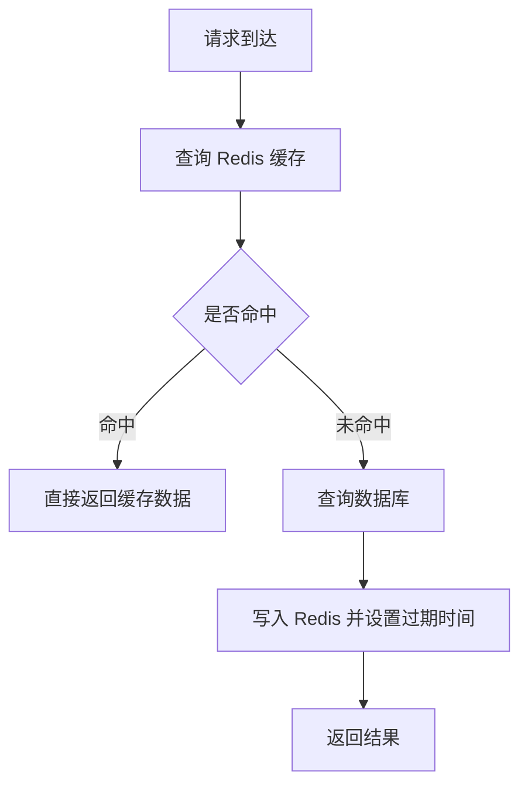
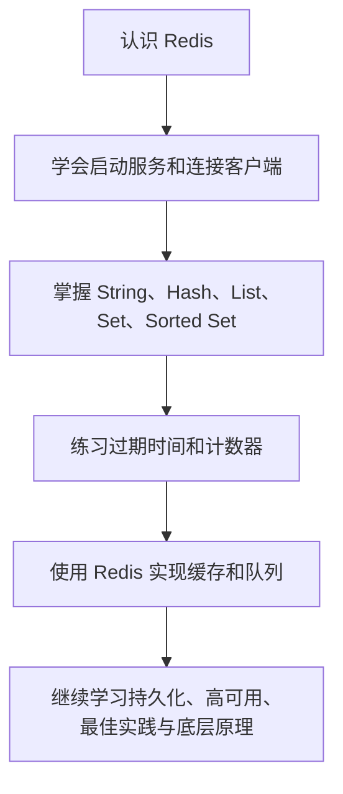

# Redis 快速入门：应用实践与总结

这一篇收尾：先讲 Java 程序怎么操作 Redis，给出 Jedis 和 Spring Data Redis 两条路线；然后把基础命令归纳成缓存、计数器、队列三个典型用法；最后给出后续篇目的学习指路。

## 3 Redis 的 Java 客户端

Redis 官网提供了各种语言的客户端。Redis 服务端通过网络协议接收命令，Java 程序通常使用客户端库连接 Redis，而不是直接在代码中手写网络协议。

Java 客户端比较多，常见的是 Jedis、Lettuce 和 Redisson 三种：Jedis 简单直接但线程不安全，需要配合连接池；Lettuce 基于 Netty、线程安全，是 Spring Boot 的默认客户端；Redisson 提供分布式数据结构和分布式锁，定位不只是客户端。Spring Data Redis 对 Jedis 和 Lettuce 做了抽象和封装，在 Spring 项目中通常直接使用它。

### 3.1 Jedis 客户端

#### 3.1.1 快速入门

Jedis 是一个轻量、直接的 Redis Java 客户端。它的 API 与 Redis 命令关系紧密，适合学习 Redis 命令和编写简单程序。

Maven 依赖示例：

```text
<!--jedis-->
<dependency>
    <groupId>redis.clients</groupId>
    <artifactId>jedis</artifactId>
    <version>5.1.0</version>
</dependency>
```

Java 使用示例：

```java
import redis.clients.jedis.Jedis;

public class JedisQuickStart {
    public static void main(String[] args) {
        // 连接本机 Redis，默认端口为 6379
        try (Jedis jedis = new Jedis("localhost", 6379)) {
            jedis.set("user:1001:name", "小明");
            String name = jedis.get("user:1001:name");
            System.out.println(name);
        }
    }
}
```

#### 3.1.2 连接池

Jedis 实例是线程不安全的，在 Web 应用中，多个请求可能同时访问 Redis。每次请求都新建连接会产生较大开销，因此通常使用 `JedisPool` 复用连接。

```java
package com.heima.jedis.util;

import redis.clients.jedis.*;

public class JedisConnectionFactory {

    private static JedisPool jedisPool;

    static {
        // 配置连接池
        JedisPoolConfig poolConfig = new JedisPoolConfig();
        poolConfig.setMaxTotal(8);
        poolConfig.setMaxIdle(8);
        poolConfig.setMinIdle(0);
        poolConfig.setMaxWaitMillis(1000);
        // 创建连接池对象，参数：连接池配置、服务端ip、服务端端口、超时时间、密码
        jedisPool = new JedisPool(poolConfig, "192.168.150.101", 6379, 1000, "123321");
    }

    public static Jedis getJedis(){
        return jedisPool.getResource();
    }
}
```

连接池中的连接使用完后必须归还。使用 try-with-resources 可以自动释放资源。

### 3.2 Spring Data Redis 客户端

Spring Data Redis 对 Redis 客户端进行了封装，并提供 `RedisTemplate`、序列化器和 Spring Boot 自动配置，适合在 Spring 项目中使用。

#### 3.2.1 快速入门

Spring Boot 项目通常添加以下依赖：

```text
<dependency>
    <groupId>org.springframework.boot</groupId>
    <artifactId>spring-boot-starter-data-redis</artifactId>
</dependency>
```

使用 `StringRedisTemplate` 操作字符串：

```java
import org.springframework.data.redis.core.StringRedisTemplate;
import org.springframework.stereotype.Service;

@Service
public class RedisStringService {
    private final StringRedisTemplate redisTemplate;

    public RedisStringService(StringRedisTemplate redisTemplate) {
        this.redisTemplate = redisTemplate;
    }

    public void saveName() {
        // opsForValue() 对应 Redis 的 String 类型操作
        redisTemplate.opsForValue().set("user:1001:name", "小明");
    }

    public String getName() {
        return redisTemplate.opsForValue().get("user:1001:name");
    }
}
```

#### 3.2.2 自定义序列化

序列化器（serializer）负责 Java 对象和字节之间的转换：

- 序列化 serialize：Java 对象 → 字节/字符串，存入 Redis、网络传输、文件
- 反序列化 deserialize：字节/字符串 → 恢复成 Java 对象

`RedisTemplate` 有 4 处要配置序列化器：

| 配置项 | 作用 |
| --- | --- |
| `keySerializer` | 普通 key 的序列化方式 |
| `valueSerializer` | 普通 value 的序列化方式 |
| `hashKeySerializer` | Hash 的 field 的序列化方式 |
| `hashValueSerializer` | Hash 的 value 的序列化方式 |

| 序列化器 | 处理对象 | Redis 存储内容 | 特点 |
| --- | --- | --- | --- |
| `StringRedisSerializer` | String | 明文字符串 | key、hash-field 首选 |
| `JdkSerializationRedisSerializer` | 实现 Serializable 的对象 | 二进制乱码 | 默认，业务不推荐 |
| `GenericJackson2JsonRedisSerializer` | 任意 POJO | 带 `@class` 的 JSON | 通用，项目常用配置 |
| `Jackson2JsonRedisSerializer` | 指定单一 Class | JSON | 限定类型，灵活性差 |

Redis 最终保存的是字节数据。序列化器决定 Java 对象如何转换为字节，以及读取时如何还原。默认配置可能使用 JDK 序列化，数据可读性较差，项目中常改为 JSON 序列化。

```java
import org.springframework.context.annotation.Bean;
import org.springframework.data.redis.connection.RedisConnectionFactory;
import org.springframework.data.redis.core.RedisTemplate;
import org.springframework.data.redis.serializer.GenericJackson2JsonRedisSerializer;
import org.springframework.data.redis.serializer.StringRedisSerializer;

@Bean
public RedisTemplate<String, Object> redisTemplate(
        RedisConnectionFactory factory) {
    RedisTemplate<String, Object> template = new RedisTemplate<>();
    template.setConnectionFactory(factory);

    // key 使用字符串序列化，value 使用 JSON 序列化
    template.setKeySerializer(new StringRedisSerializer());
    template.setValueSerializer(new GenericJackson2JsonRedisSerializer());
    template.setHashKeySerializer(new StringRedisSerializer());
    template.setHashValueSerializer(new GenericJackson2JsonRedisSerializer());
    template.afterPropertiesSet();
    return template;
}
```

#### 3.2.3 StringRedisTemplate

`StringRedisTemplate` 是专门处理字符串 key 和字符串 value 的模板，使用简单，适合验证码、计数器、开关和普通文本缓存。

```java
// 写入字符串并设置 60 秒过期时间
redisTemplate.opsForValue().set("login:code:1001", "938214", 60, TimeUnit.SECONDS);

// 原子自增
redisTemplate.opsForValue().increment("article:1001:views");
```

### 3.3 Java 客户端对比

| 客户端 | 特点 | 适用场景 |
| --- | --- | --- |
| Jedis | 以 Redis 命令作为方法名，API 直接，线程不安全 | 原生命令学习、简单 Java 程序 |
| JedisPool | 在 Jedis 基础上提供连接池 | 多线程或 Web 应用 |
| Lettuce | 基于 Netty，支持同步、异步和响应式编程，线程安全 | 需要哨兵、集群、管道模式 |
| Redisson | 提供分布式、可伸缩的 Java 数据结构和跨进程同步机制 | 分布式锁、分布式集合等特殊需求 |
| Spring Data Redis | 集成 Spring、提供模板和序列化 | Spring Boot 项目 |
| StringRedisTemplate | 专注字符串操作，配置简单 | 字符串缓存、计数、验证码 |

## 4 基础用法归纳（自行整理）

本节是在学完基础命令之后做的归纳整理，不是课程原文。它把原课程「二、Redis 实战」中散落在项目里的基础用法抽出来，做成不依赖具体业务的通用示例：缓存对应商户查询缓存，计数器对应优惠券秒杀里的 Redis 自增，队列对应秒杀优化里的阻塞队列，过期时间对应短信登录里验证码和 token 的有效期。下面的代码是为了说明流程而写的伪代码，真实项目的完整实现见第 04 篇到第 09 篇。

### 4.1 作为缓存

缓存的基本流程：

1. 先根据业务 key 查询 Redis。
2. 如果命中，直接返回缓存数据。
3. 如果未命中，再查询数据库。
4. 将数据库结果写入 Redis，并设置合理的过期时间。
5. 返回结果。



伪代码示例：

```text
data = GET cache:user:1001

if data exists:
    return data                 # 缓存命中，直接返回

data = query_database(1001)     # 缓存未命中，查询数据库
SET cache:user:1001 data EX 300 # 写入缓存，5 分钟后过期
return data
```

使用缓存时要考虑缓存过期、缓存更新、缓存穿透、缓存雪崩和缓存击穿等问题。初学阶段先掌握“先查缓存，未命中查数据库”的流程即可。

### 4.2 作为计数器

```text
# 初始化文章阅读量
SET article:1001:views 0

# 每访问一次执行一次自增
INCR article:1001:views

# 一次增加 10
INCRBY article:1001:views 10

# 查看当前数量
GET article:1001:views
```

`INCR` 和 `INCRBY` 是原子操作，多个客户端同时执行时不会因为简单的“读取后再写入”而覆盖彼此的结果。

### 4.3 作为简单队列

```text
# 生产者把任务放到队列右侧
RPUSH queue:task "task-001"
RPUSH queue:task "task-002"

# 消费者从队列左侧取任务
LPOP queue:task
```

生产者和消费者都操作同一个 key。把 `LPOP` 换成 `BRPOP` 就得到了阻塞版本的队列，消费者没有任务时会等待而不是空转。实际生产环境还需要消息确认、重试和死信处理，不能只依赖这个简单示例。

### 4.4 过期时间与数据生命周期

| 命令 | 作用 | 示例 |
| --- | --- | --- |
| `SET key value EX seconds` | 写入时设置过期时间 | `SET token abc EX 300` |
| `EXPIRE key seconds` | 为已有 key 设置过期时间 | `EXPIRE token 300` |
| `TTL key` | 查看剩余秒数 | `TTL token` |
| `PERSIST key` | 取消过期时间 | `PERSIST token` |

适合设置过期时间的数据包括验证码、登录 token、临时缓存和短期锁。核心业务数据不应因为误设置过期时间而丢失。

### 4.5 数据安全注意事项

1. 不要把 Redis 端口直接暴露到公网，也尽量不要把 `bind` 设置为 `0.0.0.0` 后不加任何限制。
2. 为 Redis 设置访问密码或使用访问控制列表。
3. 生产环境应配置持久化和备份策略。
4. 删除大量 key 时要评估对性能的影响，大 key 可以用异步删除避免阻塞。
5. 缓存内容应允许重新从数据库构建，不能把唯一数据只保存一份在缓存中。

### 4.6 学习顺序建议



### 4.7 常用命令速查表

| 目标 | 命令示例 | 说明 |
| --- | --- | --- |
| 写入字符串 | `SET name value` | 保存字符串 |
| 读取字符串 | `GET name` | 读取值 |
| 删除 key | `DEL name` | 删除数据 |
| 查看类型 | `TYPE name` | 判断数据类型 |
| 设置过期 | `EXPIRE name 60` | 60 秒后过期 |
| 哈希写入 | `HSET user name 小明` | 写入对象字段 |
| 列表入队 | `RPUSH queue task` | 从右侧加入 |
| 集合添加 | `SADD tags redis` | 自动去重 |
| 排行榜写入 | `ZADD rank 100 user1` | score 为 100 |
| 数字自增 | `INCR views` | 增加 1 |

## 5 后续学习指路

学完 01 到 03 这三篇，已经具备了读写 Redis、看懂常见命令和接入 Java 项目的能力。接下来按主题往下走：

| 主题 | 对应篇目 | 说明 |
| --- | --- | --- |
| 持久化 | 第 10 篇 | RDB 与 AOF 两种持久化方式、配置项和取舍 |
| 高可用与集群 | 第 11 篇 | 主从复制、哨兵、分片集群 |
| 过期与内存淘汰 | 第 12 篇 | 过期策略、内存回收与淘汰策略 |
| 最佳实践 | 第 13 篇 | key 设计、BigKey 处理、批处理优化、服务端与集群优化 |
| 底层数据结构 | 第 14 篇 | SDS、IntSet、Dict、ZipList、QuickList、SkipList、RedisObject |
| 网络模型与 RESP | 第 15 篇 | 用户空间与内核空间、Linux IO 模型、Redis 网络模型、通信协议 |
| 多级缓存 | 第 16 篇 | JVM 进程缓存、Lua 语法、多级缓存与缓存同步 |

建议按顺序阅读，第 10 到 12 篇是运维和稳定性基础，第 13 到 15 篇是性能与原理，第 16 篇是把前面知识组合起来的一个综合场景。

## 6 与原课程笔记的对应关系

本目录的 01 到 09 篇对应原课程笔记的“快速入门”和“实战”两部分，第 10 篇之后继续补齐原课程剩余的分布式缓存、最佳实践、数据结构和网络模型内容：

| 原课程笔记部分 | 本目录已覆盖的篇目 |
| --- | --- |
| 一、快速入门（认识 NoSQL、认识 Redis、安装、Redis 客户端、常见命令、Java 客户端） | 第 01 ~ 03 篇 |
| 二、Redis 实战（短信登录、商户查询缓存、优惠券秒杀、分布式锁、秒杀优化、达人探店、好友关注、附近商户、用户签到、UV 统计） | 第 04 ~ 09 篇 |
| 三、分布式缓存（Redis 持久化、主从、哨兵、分片集群） | 第 10、11 篇 |
| 四、多级缓存（JVM 进程缓存、Lua 语法入门、实现多级缓存） | 第 16 篇 |
| 五、Redis 最佳实践（键值设置、批处理优化、服务器端优化、集群优化） | 第 13 篇 |
| 六、Redis 数据结构（SDS、IntSet、Dict、ZipList、QuickList、SkipList、RedisObject、五种数据类型） | 第 14 篇 |
| 七、Redis 网络模型（用户空间和内核空间、Linux IO 模型、Redis 网络模型、Redis 通信协议、Redis 内存回收） | 第 15 篇（内存回收与过期策略在第 12 篇） |

## 7 本篇总结

1. Java 操作 Redis 有 Jedis、Lettuce、Redisson 三条路线，Spring 项目通常用 Spring Data Redis 来统一封装。
2. Jedis 线程不安全，必须配合连接池使用；Lettuce 基于 Netty，线程安全，是 Spring Boot 的默认客户端。
3. `RedisTemplate` 要配置 4 处序列化器，默认的 JDK 序列化可读性差，项目中一般改成 JSON 序列化；只操作字符串时用 `StringRedisTemplate`。
4. Redis 缓存通常遵循“先查缓存，未命中查数据库”的流程，并要考虑穿透、雪崩、击穿等问题。
5. `INCR` 和 `INCRBY` 可以实现高并发计数，List 可以实现简单队列，换成阻塞命令就能得到阻塞队列。
6. 临时数据要设置合理的过期时间，核心数据要做好持久化和备份，同时注意不要把 Redis 暴露到公网。
7. 后续按主题继续学习第 10 篇到第 16 篇，把持久化、高可用、最佳实践、底层数据结构和网络模型补齐。
